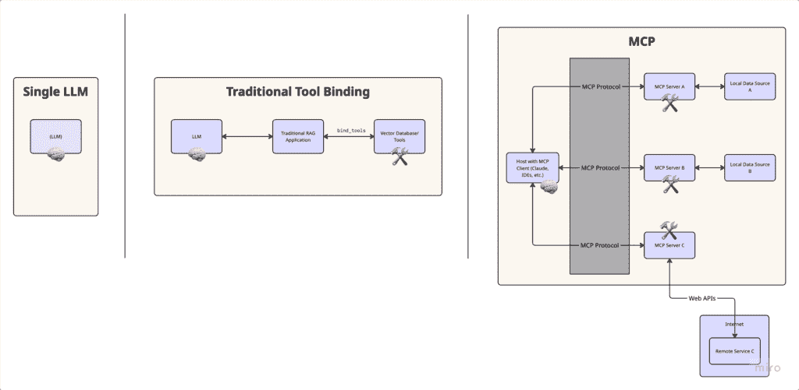
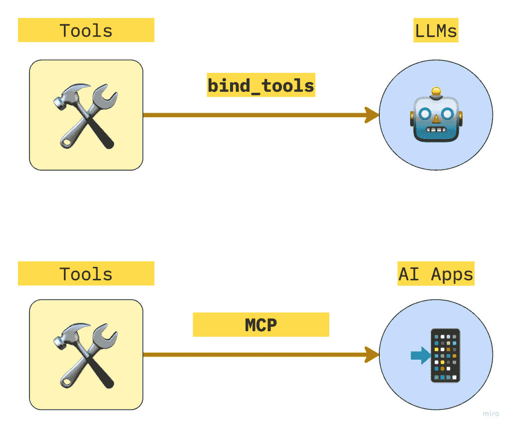
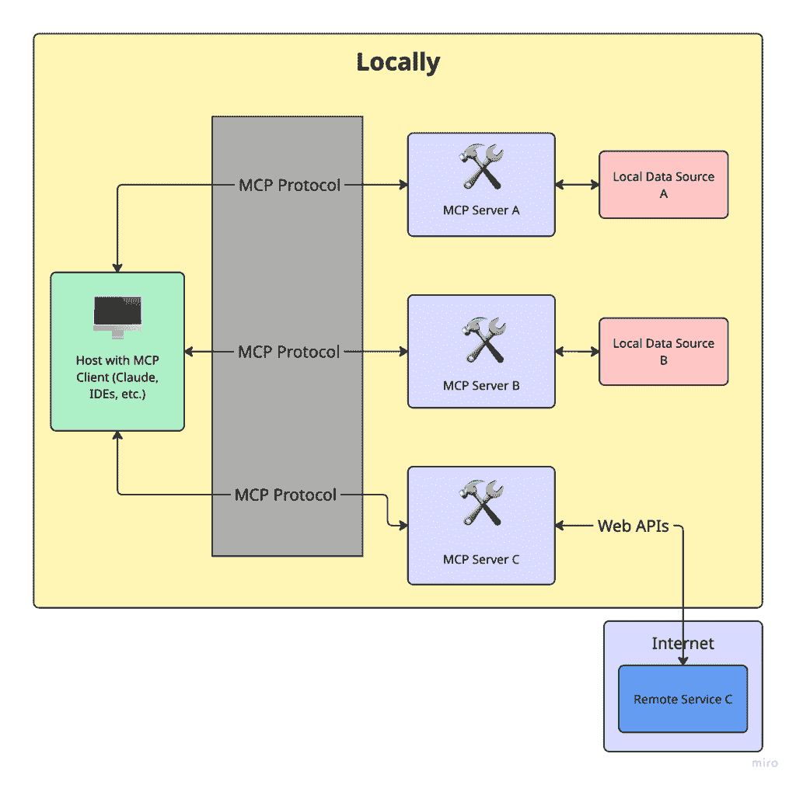
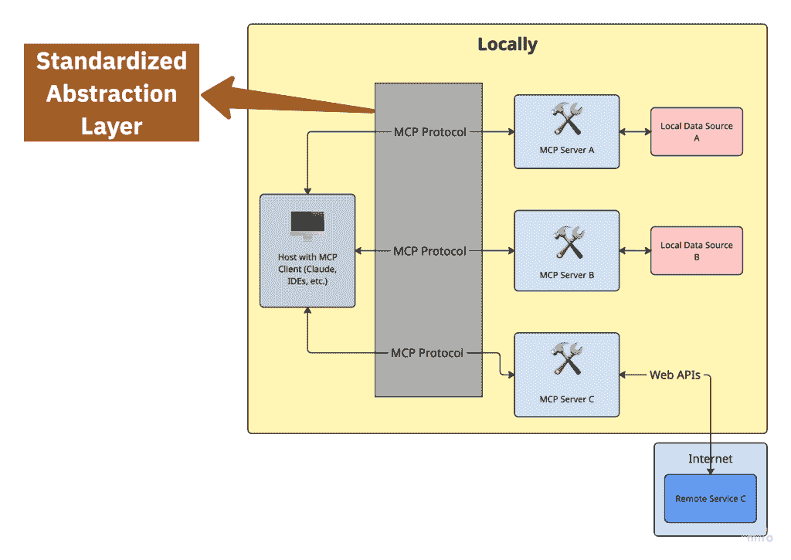
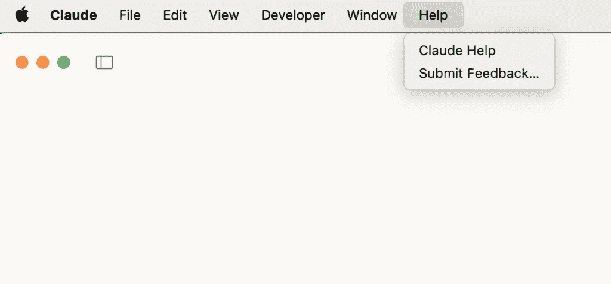
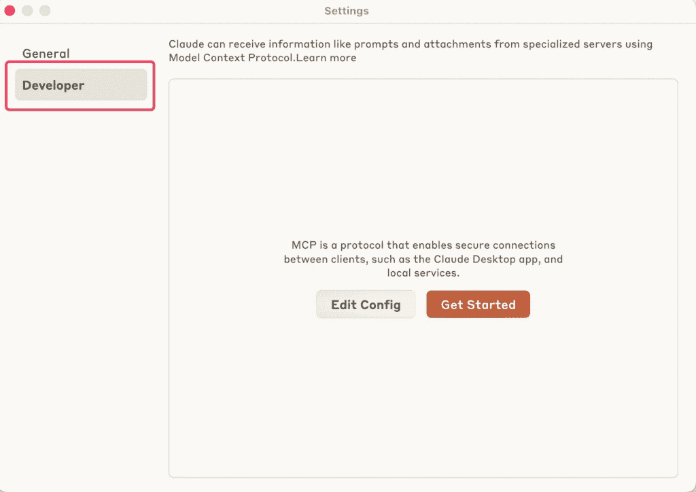
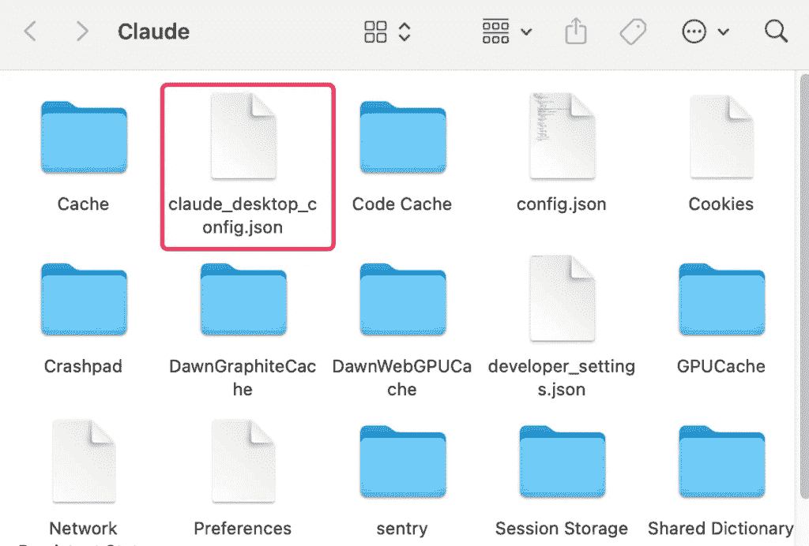
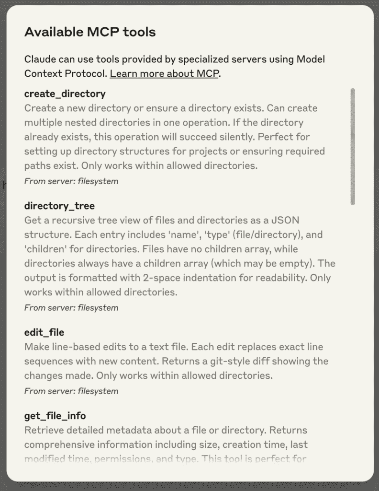
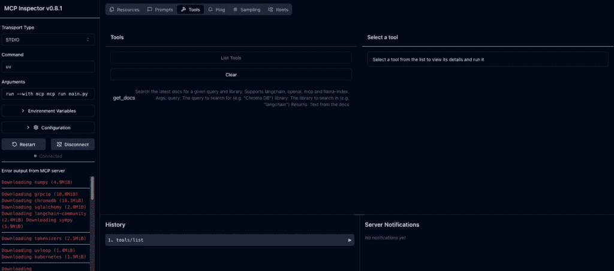
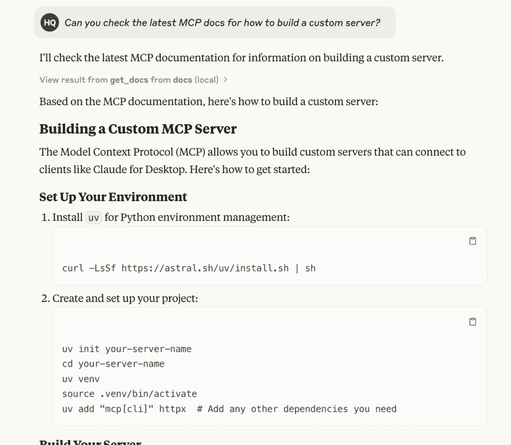

# 我是如何最终理解 MCP 并在现实生活中让它工作的

> 原文：[`towardsdatascience.com/how-i-finally-understood-mcp-and-got-it-working-irl-2/`](https://towardsdatascience.com/how-i-finally-understood-mcp-and-got-it-working-irl-2/)

# 目录

1.  <mdspan datatext="el1745428604481" class="mdspan-comment">引言</mdspan>：为什么我要写这篇文章

1.  LLM 工具集成的演变

1.  模型上下文协议（MCP）究竟是什么？

1.  等等，MCP 听起来像 RAG……但它吗？

    1.  基于 MCP 的设置

    1.  在传统的 RAG 系统中

    1.  传统的 RAG 实现

    1.  MCP 实现

1.  快速回顾！

1.  MCP 服务器的核心功能

1.  真实世界示例：Claude 桌面 + MCP（预构建服务器）

1.  从头开始构建：自定义 MCP 服务器

1.  🎉 恭喜，你已经掌握了 MCP！

1.  参考文献

* * *

## <mdspan datatext="el1745428604481" class="mdspan-comment">引言</mdspan>：为什么我要写这篇文章

我会坦诚。当我第一次看到“模型上下文协议（MCP）”这个术语时，我做了大多数开发者面对另一个新缩写时通常会做的事情：我快速浏览了一个教程，看到了一些 JSON，然后默默地继续前进。“太抽象了，”我想。快进到当我真正尝试将一些自定义工具与 Claude 桌面集成——这需要内存或访问外部工具——突然，MCP 不再只是相关，而是至关重要。

问题是什么？我遇到的每一个教程都没有感觉适合初学者。大多数教程都直接跳到构建自定义 MCP 服务器，而没有详细解释为什么你一开始就需要一个服务器——更不用说提到预构建的 MCP 服务器已经存在并且可以即插即用。因此，我决定从头开始学习。

我阅读了我能找到的一切，实验了预构建和自定义服务器，将其与 Claude 桌面集成，并测试了我是否可以向我的朋友们解释——他们对这个话题一无所知。当我最终得到他们的认可时，我知道我可以为任何人分解它，即使你直到五分钟前都没有听说过 MCP。

本文将分解 MCP 是什么，为什么它很重要，以及它与 RAG 等其他流行架构如何比较。我们将从“这究竟是什么？”开始，到启动你自己的工作 Claude 集成——无需任何先前的 MCP 知识。如果你曾经努力让你的 AI 模型感觉不那么像金鱼，这篇文章就是为你准备的。

## LLM 工具集成的演变

在深入研究 MCP 之前，让我们了解我们如何将大型语言模型（LLM）连接到外部工具和数据的演变过程：



图片由作者提供

1.  **独立 LLM**：最初，像 GPT 和 Claude 这样的模型是独立运行的，仅依赖于它们的训练数据。它们无法访问实时信息或与外部系统交互。

1.  **工具绑定**：随着 LLM 的进步，开发者创建了将工具“绑定”到模型的方法。例如，使用 LangChain 或类似框架，您可以执行如下操作：

```py
llm = ChatAnthropic()
augmented_llm = llm.bind_tools([search_tool, calculator_tool])
```

这对于单个脚本来说效果不错，但难以轻松扩展到应用程序。***为什么？***因为框架如 LangChain 中的工具绑定通常设计为**单会话、无状态交互**，这意味着每次您启动一个新的代理或函数调用时，您通常正在重新定义它可以访问的工具。没有集中化的方式来管理多个接口或用户上下文中的工具。

**3. 应用集成挑战**：当您想要将工具与 AI 驱动的应用（如 IDE（Cursor，VS Code）、聊天界面（Claude Desktop）或其他生产力工具）集成时，真正的复杂性就会出现。每个应用都需要为每个可能的工具或数据源定制连接器，从而创建一个错综复杂的集成网络。

这就是 MCP 发挥作用的地方——为连接 AI 应用与外部工具和数据源提供标准化的抽象层。

## 模型上下文协议（MCP）究竟是什么？

让我们将其分解：

+   **模型**：您应用核心的 LLM——GPT、Claude，无论什么。它是一个强大的推理引擎，但受限于其训练内容和它能承载的上下文量。

+   **上下文**：模型完成其工作所需额外信息——文档、搜索结果、用户偏好、最近的历史。上下文扩展了模型的能力，超越了其训练集。

+   **协议**：组件之间的一种标准化通信方式。可以将其视为一种通用语言，允许您的模型以可预测的方式与工具和数据源交互。

将这三者结合起来，**MCP** 就成为一个通过一致、模块化和互操作接口将模型与上下文信息和工具连接起来的框架。

与 HTTP 通过标准化浏览器与服务器之间的通信方式从而推动了网络发展类似，MCP 标准化了 AI 应用与外部数据和功能交互的方式。

* * *

> **小贴士**！将 MCP 可视化的一种简单方法是将它视为**整个 AI 堆栈的工具绑定**，而不仅仅是单个代理的工具绑定。**这就是为什么** [**Anthropic 将 MCP 描述为**](https://docs.anthropic.com/en/docs/agents-and-tools/mcp) **“AI 应用的 USB-C 端口。”**



图片由作者创作，灵感来源于 LangChain 的[从零开始理解 MCP](https://www.youtube.com/watch?v=CDjjaTALI68&t=467s)

* * *

## 等等，MCP 听起来像 RAG……但它真的是吗？

许多人问，“这与 RAG 有何不同？”这是一个很好的问题。

一眼望去，MCP 和 RAG 都旨在解决相同的问题：为语言模型提供访问相关外部信息的能力。但它们如何实现——以及它们的可维护性——存在显著差异。

### 在基于 MCP 的设置中

+   您的 AI 应用（主机/客户端）连接到 MCP 文档服务器

+   您使用标准化协议与上下文交互

+   您可以添加新的文档或工具，而无需修改应用程序

+   一切都通过相同的接口工作，保持一致



图片由作者提供，灵感来源于[MCP 文档](https://modelcontextprotocol.io/introduction)。

### 在传统的 RAG 系统中

+   您的应用程序手动构建和查询向量数据库

+   您通常需要自定义嵌入逻辑、检索器和加载器

+   添加新的来源意味着重写部分应用程序代码

+   每个集成都是定制的，紧密耦合到您的应用程序逻辑中

**关键的区别在于抽象：** 模型上下文协议中的*协议*不过是一个*标准化的抽象层*，它定义了 MCP 客户端/主机和 MCP 服务器之间的**双向通信**。



图片由作者提供，灵感来源于[MCP 文档](https://modelcontextprotocol.io/introduction)。

MCP 使您的应用程序能够询问，“给我关于 X 的信息，”而无需知道这些信息是如何存储或检索的。RAG 系统要求您的应用程序管理所有这些。

**使用 MCP，即使文档源发生变化，您的应用程序逻辑保持不变。**

让我们看看一些高级代码，看看这些方法有何不同：

### 传统 RAG 实现

在传统的 RAG 实现中，您的应用程序代码直接管理对文档源的连接：

```py
# Hardcoded vector store logic
vectorstore = FAISS.load_local("store/embeddings")
retriever = vectorstore.as_retriever()
response = retriever.invoke("query about LangGraph")
```

使用工具绑定，您定义工具并将它们绑定到 LLM，但仍需要修改工具实现以包含新的数据源。当您的后端更改时，您仍然需要更新工具实现。

```py
@tool
def search_docs(query: str):
    return search_vector_store(query)
```

### MCP 实现

使用 MCP，您的应用程序连接到标准化的接口，服务器处理文档源的具体细节：

```py
# MCP Client/Host: Client/Host stays the same

# MCP Server: Define your MCP server
# Import necessary libraries
from typing import Any
from mcp.server.fastmcp import FastMCP

# Initialize FastMCP server
mcp = FastMCP("your-server")

# Implement your server's tools
@mcp.tool()
async def example_tool(param1: str, param2: int) -> str:
    """An example tool that demonstrates MCP functionality.

    Args:
        param1: First parameter description
        param2: Second parameter description

    Returns:
        A string result from the tool execution
    """
    # Tool implementation
    result = f"Processed {param1} with value {param2}"
    return result

# Example of adding a resource (optional)
@mcp.resource()
async def get_example_resource() -> bytes:
    """Provides example data as a resource.

    Returns:
        Binary data that can be read by clients
    """
    return b"Example resource data"

# Example of adding a prompt template (optional)
mcp.add_prompt(
    "example-prompt",
    "This is a template for {{purpose}}. You can use it to {{action}}."
)

# Run the server
if __name__ == "__main__":
    mcp.run(transport="stdio")
```

然后，您配置主机或客户端（如 Claude 桌面）通过更新其配置文件来使用服务器。

```py
{
    "mcpServers": {
        "your-server": {
            "command": "uv",
            "args": [
                "--directory",
                "/ABSOLUTE/PATH/TO/PARENT/FOLDER/your-server",
                "run",
                "your-server.py"
            ]
        }
    }
}
```

* * *

如果您更改资源/文档的存储位置或方式，**您只需更新服务器，而不是客户端。**

***这就是抽象的魔力。***

对于许多用例——尤其是在 IDE 扩展或商业应用程序等生产环境中——您**根本无法触及客户端代码**。MCP 的解耦不仅仅是一个锦上添花的特性：它是一个必需品。它隔离了应用程序代码，使得只有服务器端逻辑（工具、数据源或嵌入）需要进化。主机应用程序保持不变。这使您能够快速迭代和实验，而不会导致回归或违反应用程序约束。

* * *

## 快速回顾！

希望到现在为止，您已经清楚为什么 MCP 实际上很重要。

想象一下，您正在构建一个需要以下功能的 AI 助手：

+   利用知识库

+   执行代码或脚本

+   跟踪过去的用户对话

没有 MCP，您将陷入为每个集成编写自定义粘合代码的困境。当然，它可行——直到它不可行。它脆弱、混乱，并且在大规模维护时是一个噩梦。

**MCP 通过充当模型与外部世界之间的通用适配器来解决这个问题**。您可以在不重写模型逻辑的情况下插入新的工具或数据源。这意味着**更快地迭代、更干净的代码、更少的错误**，以及真正模块化和可维护的 AI 应用。

我希望当我说**MCP 允许主机（客户端）和服务器之间的双向通信**时，您已经注意到了——因为这解锁了 MCP 最强大的用例之一：**持久记忆**。

默认情况下，LLM 就像金鱼一样。除非你手动将整个历史记录放入上下文窗口，否则它们会忘记一切。但有了 MCP，您可以：

+   存储和检索过去的交互

+   跟踪长期用户偏好

+   构建能够“记住”完整项目或持续会话的助手

不再需要笨拙的提示链式操作或脆弱的记忆解决方案。**MCP 为您的模型提供了一个比单次聊天更持久的“大脑”。**

## MCP 服务器的核心功能

考虑到所有这些，很明显：**MCP 服务器是整个协议的 MVP（最小可行产品）。**

这是定义模型实际可以使用的能力的中心枢纽。主要有三种类型：

+   **资源：** 将这些视为外部数据源——PDF 文件、API、数据库。模型可以从中提取信息以提供上下文，但它无法更改它们。只读。

+   **工具：** 这些是模型可以调用的实际功能——运行代码、搜索网络、生成摘要等。

+   **提示：** 预定义的模板，用于指导模型的行为或构建其响应。就像给它一个剧本。

使 MCP 强大的是，所有这些都可以通过**单一、一致的协议**暴露出来。这意味着模型可以请求、调用和整合它们，而无需为每个单独的实例编写自定义逻辑。只需连接到 MCP 服务器，一切就绪。

## 实际案例：Claude 桌面 + MCP（预构建服务器）

默认情况下，**Anthropic 提供了一系列预构建的 MCP 服务器**，您可以直接将其集成到您的 AI 应用中——例如 Claude 桌面、Cursor 等。设置快速且简便。

想要查看可用的完整服务器列表，请访问[MCP 服务器仓库](https://github.com/modelcontextprotocol/servers)。这里有你所需的各种现成集成。

在本节中，我将通过一个实际案例向您展示：**扩展 Claude 桌面**，使其能够从您的计算机文件系统中读取，写入新文件，移动文件，甚至搜索它们。

本指南基于官方文档中的[快速入门](https://modelcontextprotocol.io/quickstart/user)指南，但说实话，那个指南跳过了一些关键细节——尤其是如果您之前从未接触过这些设置。因此，我将填补这些空白，并分享我在路上学到的额外技巧，以节省您的麻烦。

### 1. 下载 Claude 桌面

首先，先下载[**Claude 桌面版**](https://claude.ai/download)。选择适用于**macOS**或**Windows**的版本（抱歉，Linux 用户，目前尚不支持）。

按照提示进行安装步骤。

已经安装了吗？通过点击电脑上的**Claude 菜单**并选择**“检查更新…”**来确保您使用的是最新版本。

### 2. 检查先决条件

您需要在您的机器上安装**Node.js**才能顺利运行。

要检查您是否已安装 Node.js：

+   **在 macOS 上**：从应用程序文件夹中打开**终端**。

+   **在 Windows 上**：按`Windows + R`，输入`cmd`，然后按 Enter。

+   然后在您的终端中运行以下命令：

```py
node --version
```

如果您看到一个版本号，您就可以开始了。如果没有，请访问[nodejs.org](https://nodejs.org)并安装最新的**LTS 版本**。

### 3. 启用开发者模式

打开 Claude 桌面版，点击屏幕左上角的“Claude”菜单。从那里，选择**帮助**。

在 macOS 上，它应该看起来像这样：



图片由作者提供

从下拉菜单中选择**“启用开发者模式。”**

如果您之前已经启用过，它将不会再次显示——但如果这是您第一次，它应该就在列表中。

一旦**开发者模式**开启：

1.  再次点击屏幕左上角的**“Claude”**菜单。

1.  选择**“设置。”**

1.  将出现一个新弹窗——在左侧导航栏中寻找**“开发者”**标签。所有好东西都在那里。



图片由作者提供

### 4. 设置配置文件

仍然在**开发者**设置中，点击**“编辑配置。”**

这将创建一个配置文件（如果尚不存在）并在您的文件系统中直接打开它。

文件位置取决于您的操作系统：

+   **macOS**：`~/Library/Application Support/Claude/claude_desktop_config.json`

+   **Windows**：`%APPDATA%\Claude\claude_desktop_config.json`

这是你定义 Claude 要使用的服务器和功能的地方——所以请保持此文件打开，我们稍后会编辑它。



图片由作者提供

使用任何文本编辑器打开配置文件（`claude_desktop_config.json`）。根据您的操作系统，替换其内容如下：

#### 对于 macOS：

```py
{
  "mcpServers": {
    "filesystem": {
      "command": "npx",
      "args": [
        "-y",
        "@modelcontextprotocol/server-filesystem",
        "/Users/username/Desktop",
        "/Users/username/Downloads"
      ]
    }
  }
}
```

#### 对于 Windows：

```py
{
  "mcpServers": {
    "filesystem": {
      "command": "npx",
      "args": [
        "-y",
        "@modelcontextprotocol/server-filesystem",
        "C:\\Users\\username\\Desktop",
        "C:\\Users\\username\\Downloads"
      ]
    }
  }
}
```

**请确保将** `"username"` **替换为您的实际系统用户名。** 这里列出的路径应指向您的机器上的有效文件夹——此设置使 Claude 能够访问您的**桌面**和**下载**，但如果需要，您可以添加更多路径。

#### 这是什么作用

此配置告诉**Claude 桌面版**在每次应用程序启动时自动启动一个名为`"filesystem"`的 MCP 服务器。该服务器使用`npx`运行并启动`@modelcontextprotocol/server-filesystem`，这使得 Claude 能够与您的文件系统交互——读取、写入、移动文件、搜索目录等。

#### ⚠️ 命令权限

> 提前提醒：Claude 将以你的用户账户权限运行这些命令，这意味着它可以访问和修改本地文件。只有在你理解并信任你连接的服务器时，才向配置文件中添加命令——不要添加来自互联网的随机包！

### 5. 重启 Claude

更新并保存你的配置文件后，**重启 Claude 桌面版**以应用更改。

启动后，你应该在输入框的左下角看到一个**锤子图标**。这是你的信号，表明开发者工具——以及你的自定义 MCP 服务器——正在运行。


图片由作者提供

点击**锤子图标**后，你应该能看到由**文件系统 MCP 服务器**暴露的工具列表——比如读取文件、写入文件、搜索目录等等。



图片由作者提供

如果你没有看到你的服务器列出来或者什么都没有显示，别担心。跳转到官方文档中的[**故障排除**](https://modelcontextprotocol.io/quickstart/user#troubleshooting)部分，获取一些快速调试技巧，以使一切恢复正常。

### 6. 尝试一下！

现在一切都已经设置好了，你可以开始与 Claude 讨论你的文件系统——**它应该知道何时调用正确的工具**。

这里有一些你可以尝试询问的问题：

+   *“你能写一首诗并保存到我的桌面上吗？”*

+   *“我的下载文件夹里有哪些与工作相关的文件？”*

+   *“你能把我的桌面上所有的图片都移动到一个名为‘Images’的新文件夹里吗？”*

当需要时，Claude 将自动调用适当的工具，并在对系统进行任何操作之前**征求你的批准**。你保持控制权，而 Claude 完成工作。

## 从零开始：自定义 MCP 服务器

**好吧，准备好升级了吗？**

在本节中，你将从用户变为构建者。我们将编写一个 Claude 可以与之通信的自定义 MCP 服务器——具体来说，是一个允许它搜索来自 LangChain、OpenAI、MCP（是的，我们正在使用 MCP 来学习 MCP）和 LlamaIndex 等 AI 库的最新文档的工具。

因为让我们说实话——你有多少次看到 Claude 自信地输出过时代码或自 2021 年以来未更新的参考库？

此工具使用实时搜索，抓取实时内容，并按需为你的助手提供新鲜知识。是的，它听起来就像它听起来那么酷。

该项目使用 Anthropic 的官方 MCP SDK 构建。如果你熟悉 Python 和命令行，你将很快就能上手。即使你不熟悉——别担心。我们会一步一步地引导你，包括那些大多数教程都假设你已经知道的部分。

### 先决条件

在我们深入之前，这里是你需要在系统上安装的东西：

+   **Python 3.10 或更高版本**——这是我们将会使用的编程语言

+   **MCP SDK（v1.2.0 或更高版本）**——这为你提供了创建 Claude 兼容服务器的所有工具（将在后续部分中安装）

+   [**uv**](https://github.com/astral-sh/uv) **（包管理器）**——把它想象成 pip 的现代版本，但更快，更容易用于项目（将在后续部分中安装）

### 第 1 步：安装 `uv`（包管理器）

I<mdspan datatext="el1746803343129" class="mdspan-comment">如果你之前使用过 Python，你可能已经习惯了 `pip`。`uv` 是 pip 更酷、更现代的堂兄。我们将使用它来设置和管理我们的项目。在你的终端中运行以下命令来安装 `uv`：</mdspan>

**在 macOS/Linux 上：**

```py
curl –LsSf https://astral.sh/uv/install.sh | sh
```

**在 Windows 上：**

```py
powershell –ExecutionPolicy ByPass -c "irm https://astral.sh/uv/install.ps1 | iex"
```

这将在你的机器上下载并安装 `uv`。完成后，**关闭并重新打开您的终端**，以确保 `uv` 命令被识别。（如果你使用 Windows，可以使用 WSL 或遵循他们的 Windows 说明。）

为了检查它是否工作，请在你的终端中运行以下命令：

```py
uv --version
```

如果你看到一个版本号，那么你就准备好了。

### 第 2 步：设置您的项目

现在我们将创建一个用于我们的 MCP 服务器的文件夹，并将所有部件放在一起。在你的终端中运行以下命令：

```py
# Create and enter your project folder
uv init mcp-server
cd mcp-server

# Create a virtual environment
uv venv
# Activate the virtual environment
source .venv/bin/activate  # Windows: .venv\Scripts\activate
```

**等等——这是什么意思？**

+   `uv init mcp-server` 将设置一个名为 `mcp-server` 的空白 Python 项目。

+   `uv venv` 创建一个虚拟环境（该项目私有的沙盒）

+   `source .venv/bin/activate` 启用该环境，这样你安装的所有内容都保留在其中。

### 第 3 步：安装所需的包

在你的虚拟环境中，安装你需要的工具：

```py
uv add "mcp[cli]" httpx beautifulsoup4 python-dotenv
```

这里是每个包的作用：

+   `mcp[cli]`: 这是允许你构建 Claude 可以与之通信的服务器的核心 SDK

+   `httpx`: 用于发送 HTTP 请求（如从网站获取数据）

+   `beautifulsoup4`: 帮助我们从混乱的 HTML 中提取可读文本

+   `python-dotenv`: 允许我们从 `.env` 文件中加载 API 密钥

在我们开始编写代码之前，打开项目文件夹在文本编辑器中是个好主意，这样你就可以在一个地方看到所有文件并轻松编辑它们。

如果你使用的是 **VS Code**（如果你不确定使用什么，我强烈推荐），只需在 `mcp-server` 文件夹内运行此命令：

```py
code .
```

这个命令告诉 VS Code 打开 **当前文件夹**（`.` 只表示“就在这里”）。

> *🛠️ 如果* `code` *命令不起作用，你可能需要启用它*：
> 
> *1. 打开 VS Code*
> 
> *2. 按* `Cmd+Shift+P` *(或 Windows 上的* `Ctrl+Shift+P` *) 
> 
> *3. 输入:* `Shell Command: Install 'code' command in PATH`
> 
> *4. 按下 Enter 键，然后重新启动您的终端*
> 
> *如果你使用的是其他编辑器，如 PyCharm 或 Sublime Text，你可以直接从应用内部手动打开* `mcp-server` *文件夹。*

### 第 3.5 步：获取您的 Serper API 密钥（用于网络搜索）

为了使我们的实时文档搜索功能，我们将使用 [Serper](https://serper.dev) ——一个简单快速的 Google 搜索 API，非常适合 AI 代理。

这里是如何设置的：

1.  前往[serper.dev](https://serper.dev)并点击**注册**：基本使用是免费的，并且非常适合这个项目。

1.  登录后，前往你的**仪表板**：你将看到列出的**API 密钥**。复制它。

1.  在你的项目文件夹中，创建一个名为`.env:<br>`的文件。这是我们安全存储密钥的地方（这样我们就不需要硬编码它）。

1.  将以下行添加到你的`.env`文件中：

```py
SERPER_API_KEY=your-api-key-here
```

将`your-api-key-here`替换为你复制的实际密钥

就这样——现在你的服务器可以通过 Serper 与 Google 通信，并在 Claude 请求时拉取新鲜文档。

### 第 4 步：编写服务器代码

现在项目已经搭建好，虚拟环境正在运行，是时候真正编写服务器代码了。

这个服务器将要：

+   接受像这样的问题：“我在 LangChain 中如何使用检索器？”

+   知道要搜索哪个文档站点（例如，LangChain、OpenAI 等）

+   使用网络搜索 API（Serper）从该网站找到最佳链接

+   访问这些页面并抓取实际内容

+   将该内容返回给 Claude

这就是让 Claude 变得更聪明的因素——它可以从真实文档中查找信息，而不是基于旧数据编造内容。

* * *

### ⚠️关于道德抓取的快速提醒

**始终尊重你正在抓取的网站**。负责任地使用。避免频繁访问页面，不要爬取登录墙后的内容，并检查网站的`robots.txt`文件以查看允许的内容。你可以在这里了解更多信息。[here.](https://developers.google.com/search/docs/crawling-indexing/robots/intro)

你的工具只有在其尊重他人的基础上才有用。这就是我们构建不仅聪明而且可持续的 AI 系统的方式。

* * *

#### **1. 创建服务器文件**

首先，在你的`mcp-server`文件夹内运行以下命令以创建一个新文件：

```py
touch main.py
```

然后打开该文件（如果尚未打开）。将那里的代码替换为以下内容：

```py
from mcp.server.fastmcp import FastMCP
from dotenv import load_dotenv
import httpx
import json
import os
from bs4 import BeautifulSoup
load_dotenv()

mcp = FastMCP("docs")

USER_AGENT = "docs-app/1.0"
SERPER_URL = "https://google.serper.dev/search"

docs_urls = {
    "langchain": "python.langchain.com/docs",
    "llama-index": "docs.llamaindex.ai/en/stable",
    "openai": "platform.openai.com/docs",
    "mcp": "modelcontextprotocol.io"
}

async def search_web(query: str) -> dict | None:
    payload = json.dumps({"q": query, "num": 2})
    headers = {
        "X-API-KEY": os.getenv("SERPER_API_KEY"),
        "Content-Type": "application/json",
    }

    async with httpx.AsyncClient() as client:
        try:
            response = await client.post(
                SERPER_URL, headers=headers, data=payload, timeout=30.0
            )
            response.raise_for_status()
            return response.json()
        except httpx.TimeoutException:
            return {"organic": []}
        except httpx.HTTPStatusError as e:
            print(f"HTTP error occurred: {e}")
            return {"organic": []}

async def fetch_url(url: str) -> str:
    async with httpx.AsyncClient(headers={"User-Agent": USER_AGENT}) as client:
        try:
            response = await client.get(url, timeout=30.0)
            response.raise_for_status()
            soup = BeautifulSoup(response.text, "html.parser")

            # Try to extract main content and remove navigation, sidebars, etc.
            main_content = soup.find("main") or soup.find("article") or soup.find("div", class_="content")

            if main_content:
                text = main_content.get_text(separator="\n", strip=True)
            else:
                text = soup.get_text(separator="\n", strip=True)

            # Limit content length if it's too large
            if len(text) > 8000:
                text = text[:8000] + "... [content truncated]"

            return text
        except httpx.TimeoutException:
            return "Timeout error when fetching the URL"
        except httpx.HTTPStatusError as e:
            return f"HTTP error occurred: {e}"

@mcp.tool()  
async def get_docs(query: str, library: str) -> str:
    """
    Search the latest docs for a given query and library.
    Supports langchain, openai, mcp and llama-index.

    Args:
        query: The query to search for (e.g. "Chroma DB")
        library: The library to search in (e.g. "langchain")

    Returns:
        Text from the docs
    """
    if library not in docs_urls:
        raise ValueError(f"Library {library} not supported by this tool. Supported libraries: {', '.join(docs_urls.keys())}")

    query = f"site:{docs_urls[library]} {query}"
    results = await search_web(query)

    if not results or len(results.get("organic", [])) == 0:
        return "No results found"

    combined_text = ""
    for i, result in enumerate(results["organic"]):
        url = result["link"]
        title = result.get("title", "No title")

        # Add separator between results
        if i > 0:
            combined_text += "\n\n" + "="*50 + "\n\n"

        combined_text += f"Source: {title}\nURL: {url}\n\n"
        page_content = await fetch_url(url)
        combined_text += page_content

    return combined_text

if __name__ == "__main__":
    mcp.run(transport="stdio")
```

#### **2. 代码的工作原理**

首先，我们搭建了我们自定义的 MCP 服务器的基础。它包含了你需要的所有库——比如用于发送网络请求、清理网页和加载秘密 API 密钥的工具。它还会创建你的服务器，并将其命名为`"docs"`，这样 Claude 就知道如何称呼它。然后，它会列出你的工具将要搜索的文档站点（如 LangChain、OpenAI、MCP 和 LlamaIndex）。最后，它设置了 Serper API 的 URL，这是工具将用来发送 Google 搜索查询的地方。把它想象成在真正构建工具之前准备你的工作空间。

<details class="wp-block-details is-layout-flow wp-block-details-is-layout-flow"><summary>点击此处查看相关的代码片段</summary>

```py
from mcp.server.fastmcp import FastMCP
from dotenv import load_dotenv
import httpx
import json
import os
from bs4 import BeautifulSoup
load_dotenv()

mcp = FastMCP("docs")

USER_AGENT = "docs-app/1.0"
SERPER_URL = "https://google.serper.dev/search"

docs_urls = {
    "langchain": "python.langchain.com/docs",
    "llama-index": "docs.llamaindex.ai/en/stable",
    "openai": "platform.openai.com/docs",
    "mcp": "modelcontextprotocol.io"
}
```</details>

然后，我们定义一个函数，让我们的工具能够与**Serper API**通信，我们将将其用作 Google 搜索的包装器。

这个函数 `search_web` 接收一个查询字符串，构建一个请求，并将其发送到搜索引擎。它包括你的 API 密钥进行身份验证，告诉 Serper 我们正在发送 JSON，并将搜索结果的数量限制为 2 以提高速度和专注度。该函数返回一个包含结构化结果的字典，并且它还能优雅地处理超时或可能来自 API 的任何错误。这是帮助 Claude 在我们甚至获取内容之前就能确定*查找位置*的部分。

<details class="wp-block-details is-layout-flow wp-block-details-is-layout-flow"><summary>点击此处查看相关代码片段</summary>

```py
async def search_web(query: str) -> dict | None:
    payload = json.dumps({"q": query, "num": 2})
    headers = {
        "X-API-KEY": os.getenv("SERPER_API_KEY"),
        "Content-Type": "application/json",
    }

    async with httpx.AsyncClient() as client:
        try:
            response = await client.post(
                SERPER_URL, headers=headers, data=payload, timeout=30.0
            )
            response.raise_for_status()
            return response.json()
        except httpx.TimeoutException:
            return {"organic": []}
        except httpx.HTTPStatusError as e:
            print(f"HTTP error occurred: {e}")
            return {"organic": []}
```</details>

一旦我们找到了几个有希望的链接，我们需要一种方法来从这些网页中提取**有用的内容**。这就是 `fetch_url` 的作用。它访问每个 URL，获取页面的完整 HTML，然后使用 BeautifulSoup 过滤出可读的部分——比如段落、标题和示例。我们试图优先处理 `<main>`、`<article>` 或具有 `.content` 类的容器，这些通常包含好的内容。如果页面非常长，我们也会将其裁剪以避免输出过载。想象一下，这是 Claude 的“阅读模式”——它将杂乱的网页转换为它能够理解的干净文本。

<details class="wp-block-details is-layout-flow wp-block-details-is-layout-flow"><summary>点击此处查看相关代码片段</summary>

```py
async def fetch_url(url: str) -> str:
    async with httpx.AsyncClient(headers={"User-Agent": USER_AGENT}) as client:
        try:
            response = await client.get(url, timeout=30.0)
            response.raise_for_status()
            soup = BeautifulSoup(response.text, "html.parser")

            # Try to extract main content and remove navigation, sidebars, etc.
            main_content = soup.find("main") or soup.find("article") or soup.find("div", class_="content")

            if main_content:
                text = main_content.get_text(separator="\n", strip=True)
            else:
                text = soup.get_text(separator="\n", strip=True)

            # Limit content length if it's too large
            if len(text) > 8000:
                text = text[:8000] + "... [content truncated]"

            return text
        except httpx.TimeoutException:
            return "Timeout error when fetching the URL"
        except httpx.HTTPStatusError as e:
            return f"HTTP error occurred: {e}"
```</details>

现在是主要部分：Claude 将要调用的实际工具函数。

`get_docs` 函数是所有内容汇集的地方。Claude 会传递一个**查询**和一个**库**（如`"llama-index"`）的名称，这个函数将：

1.  检查该库是否受支持

1.  构建特定网站的搜索查询（例如，`site:docs.llamaindex.ai "vector store"`）

1.  使用 `search_web()` 获取顶部结果

1.  使用 `fetch_url()` 访问并提取内容

1.  将所有内容格式化为 Claude 可以理解和返回的漂亮、可读的字符串

我们还包括标题、URL 以及每个结果之间的某些视觉分隔符，以便 Claude 在需要时可以引用或引用它们。

<details class="wp-block-details is-layout-flow wp-block-details-is-layout-flow"><summary>点击此处查看相关代码片段</summary>

```py
@mcp.tool()  
async def get_docs(query: str, library: str) -> str:
    """
    Search the latest docs for a given query and library.
    Supports langchain, openai, mcp and llama-index.

    Args:
        query: The query to search for (e.g. "Chroma DB")
        library: The library to search in (e.g. "langchain")

    Returns:
        Text from the docs
    """
    if library not in docs_urls:
        raise ValueError(f"Library {library} not supported by this tool. Supported libraries: {', '.join(docs_urls.keys())}")

    query = f"site:{docs_urls[library]} {query}"
    results = await search_web(query)

    if not results or len(results.get("organic", [])) == 0:
        return "No results found"

    combined_text = ""
    for i, result in enumerate(results["organic"]):
        url = result["link"]
        title = result.get("title", "No title")

        # Add separator between results
        if i > 0:
            combined_text += "\n\n" + "="*50 + "\n\n"

        combined_text += f"Source: {title}\nURL: {url}\n\n"
        page_content = await fetch_url(url)
        combined_text += page_content

    return combined_text
```</details>

最后，这一行启动了所有操作。它告诉 MCP 服务器开始通过标准输入/输出监听来自 Claude 的输入（这是 Claude 桌面与外部工具通信的方式）。这一行总是位于脚本的最底部。

```py
if __name__ == "__main__":
    mcp.run(transport="stdio")
```

### 第 5 步：测试和运行你的服务器

好的，你的服务器已经编码并准备好了——现在让我们运行它并看看它的实际效果。测试你的 MCP 服务器有两种主要方式：

#### 开发模式（推荐用于构建和测试）

在开发期间测试你的服务器的最简单方法是使用：

```py
mcp dev main.py
```

此命令启动了[**MCP 检查器**](https://modelcontextprotocol.io/docs/tools/inspector)，它会在你的浏览器中打开一个本地 Web 界面。它就像是你服务器的控制面板。



图片由作者提供

你可以用它做以下事情：

+   交互式测试你的工具（如`get_docs`）

+   实时查看详细的日志和错误信息

+   监控性能和响应时间

+   临时设置或覆盖环境变量

在构建和调试时使用此模式。你将能够看到克劳德会看到的内容，并在集成到完整的克劳德桌面应用程序之前快速修复任何问题。

#### 克劳德桌面集成（常规使用）

一旦你的服务器工作正常，你对其满意，你可以将其安装到克劳德桌面中：

```py
mcp install main.py
```

此命令将：

+   自动将你的服务器添加到克劳德的配置文件（我们之前修改过的 JSON 文件）中

+   启用它，每次启动克劳德桌面时都会运行

+   通过开发者工具（🔨锤子图标）使其可用

> ***但是等等——还有一个小小的陷阱……***

#### ⚠️ 当前问题：`uv`命令被硬编码

目前，`mcp`库中有一个开放的问题：当它将你的服务器写入克劳德的配置文件时，它将命令**硬编码**为`"uv"`。这只在`uv`在全局 PATH 中可用时有效——这并不总是情况，尤其是如果你使用 pipx 或自定义方法本地安装了它。

因此，我们需要手动修复它。以下是方法：

##### 手动更新克劳德的配置文件

1.  **打开你的克劳德配置文件：**

**在 MacOS 上：**

```py
code ~/Library/Application\ Support/Claude/claude_desktop_config.json
```

**在 Windows 上：**

```py
code $env:AppData\Claude\claude_desktop_config.json
```

💡 如果你不是使用 VS Code，将`code`替换为你选择的文本编辑器（如`open`、`nano`或`subl`）。

2. **找到看起来像这样的部分：**

```py
"docs": {
  "command": "uv",
  "args": [
    "run",
    "--with",
    "mcp[cli]",
    "mcp",
    "run",
    "/PATH/TO/mcp-server/main.py"
  ]
}
```

3. **更新`"command"`值为你系统上`uv`的绝对路径。**

+   要找到它，请在你的终端中运行以下命令：

```py
which uv
```

+   它会返回类似以下内容：

```py
/Users/your_username/.local/bin/uv
```

+   现在将配置中的`"uv"`替换为该完整路径：

```py
"docs": {
  "command": "/Users/your_username/.local/bin/uv",
  "args": [
    "run",
    "--with",
    "mcp[cli]",
    "mcp",
    "run",
    "PATH/TO/mcp-server/main.py"
  ]
}
```

4. **保存文件并重新启动克劳德桌面。**

✅ **这就完成了！**

现在，克劳德桌面将识别你的自定义`docs`工具，并且每次你打开开发者工具（🔨）时，它都会显示出来。你可以与克劳德聊天，询问如下问题：

> *“你能检查一下最新的 MCP 文档，看看如何构建自定义服务器吗？”*

克劳德将调用你的服务器，搜索文档，提取内容，并在其响应中使用它——实时。你可以在这里查看快速演示[这里](https://drive.google.com/file/d/1xFqx0KfviGcor7Fnzk8MdmQJUDjQsfLW/view?usp=sharing)



图片由作者提供

* * *

## 🎉 恭喜，你已经掌握了 MCP！

你做到了。你已经从零开始构建、测试和集成你自己的**克劳德兼容 MCP 服务器**——这是一项**了不起的成就**。

抽空片刻。伸展一下。喝杯咖啡。给自己鼓掌。你不仅仅写了一些 Python 代码——你构建了一个真正的、生产级别的工具，以模块化、安全且强大的方式扩展了 LLM 的功能。

严肃地说，大多数开发者都没有走到这一步。你现在理解了：

+   MCP 在底层是如何工作的

+   如何构建和展示 Claude 可以使用的工具

+   如何连接实时网络搜索和内容提取

+   如何调试、测试并将整个系统与 Claude 桌面版集成

你不仅学到了它——你还发布了它。

想要更深入？有一个充满**代理工作流程**、**定制工具**和**协作 LLM**的世界等待你去构建。但现在？

**取得胜利。你应得的。** 🏆

现在去问 Claude 一些有趣的问题，让你的新工具展示一下。

* * *

## 参考文献

[1] Anthropic, *模型上下文协议：简介* (2024), modelcontextprotocol.io

[2] LangChain, *从零开始构建 MCP* (2024), [Notion](https://mirror-feeling-d80.notion.site/MCP-From-Scratch-1b9808527b178040b5baf83a991ed3b2?pvs=4)

[3] A. Alejandro, *MCP 服务器示例* (2024), [GitHub 仓库](https://github.com/alejandro-ao/mcp-server-example)

[4] O. Santos, *将代理 RAG 与 MCP 服务器集成：技术实施指南* (2024), Medium

* * *

[*版权声明

© 2025 Hailey Quach. 版权所有。

本文及其内容受版权法保护。您可以在明确注明出处并链接至原始来源的情况下引用或引用本文的部分内容。然而，未经作者事先书面许可，本出版物任何部分不得全部复制、重新发布或重新分发——无论以印刷、数字或衍生形式——未经授权的使用可能导致法律诉讼。*]
