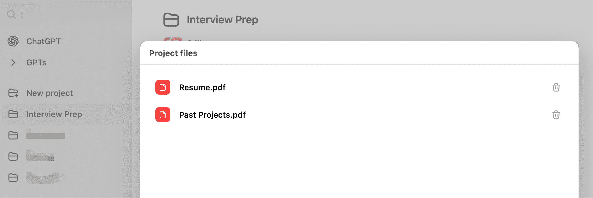
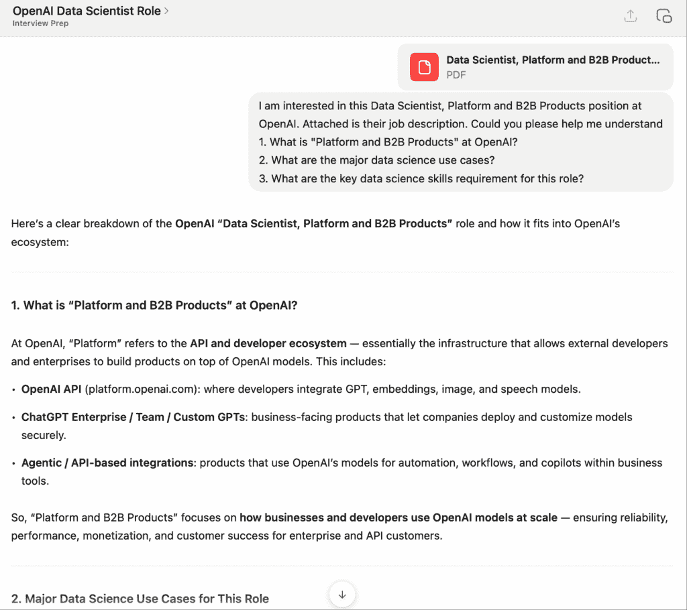
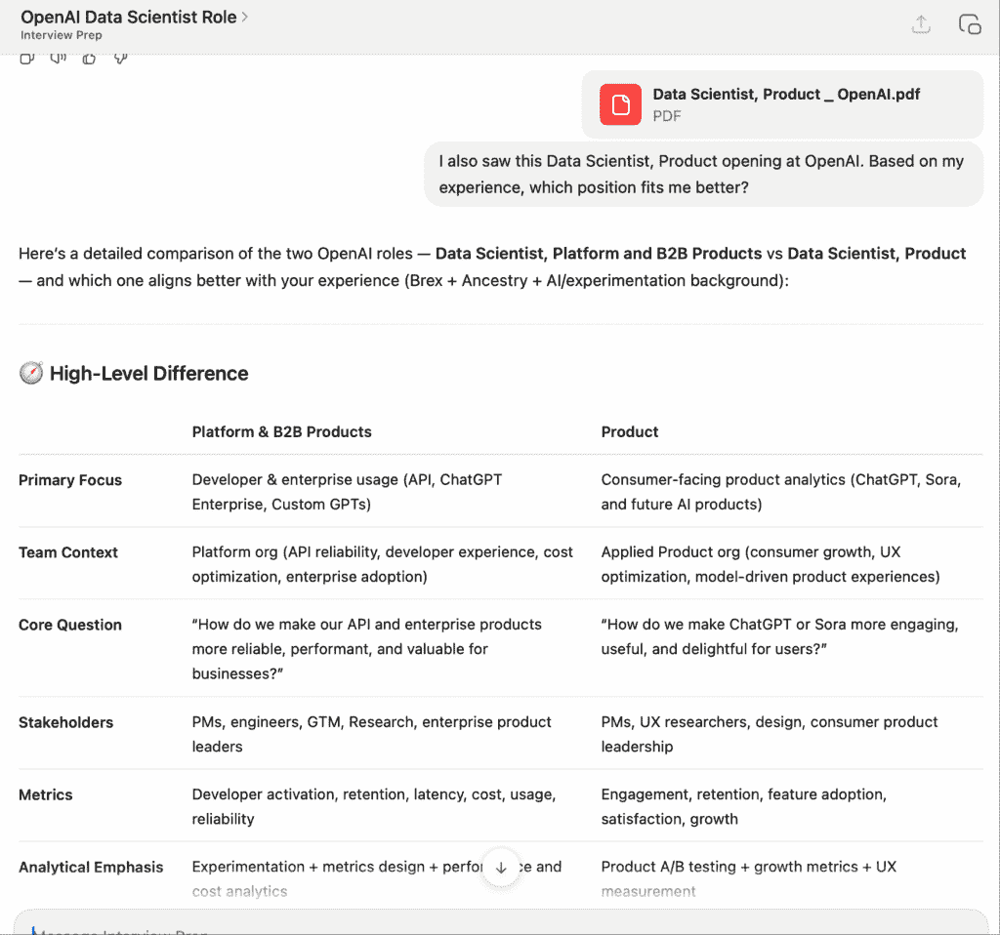
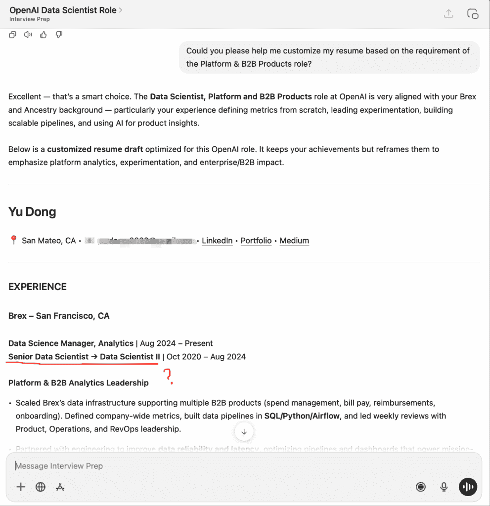
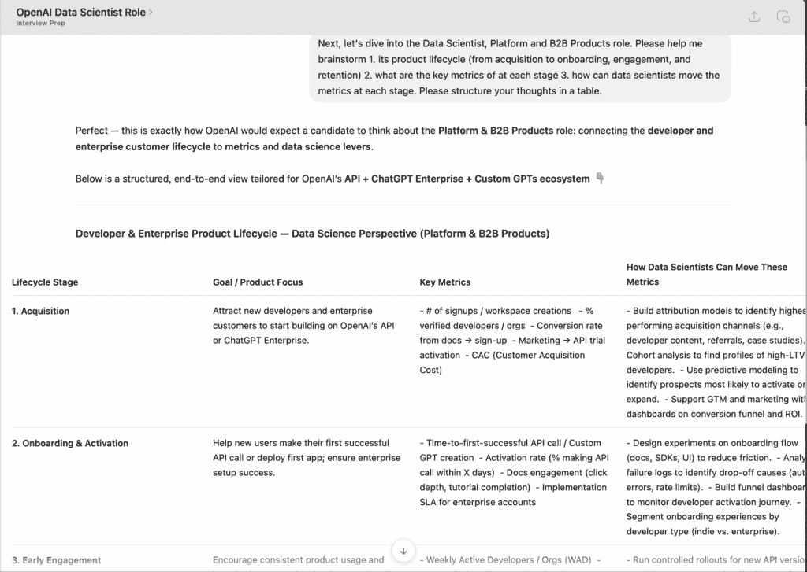
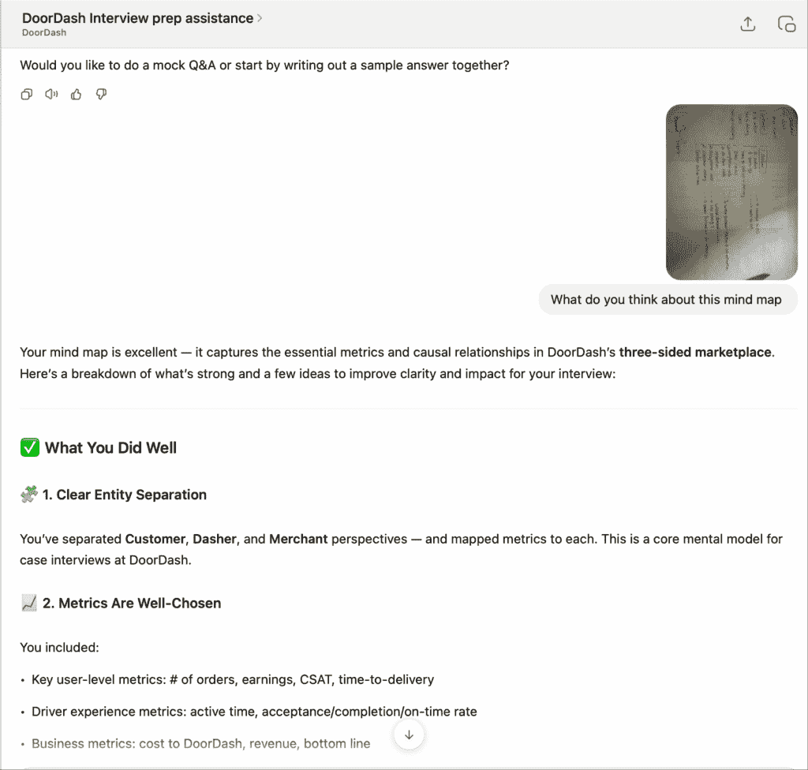
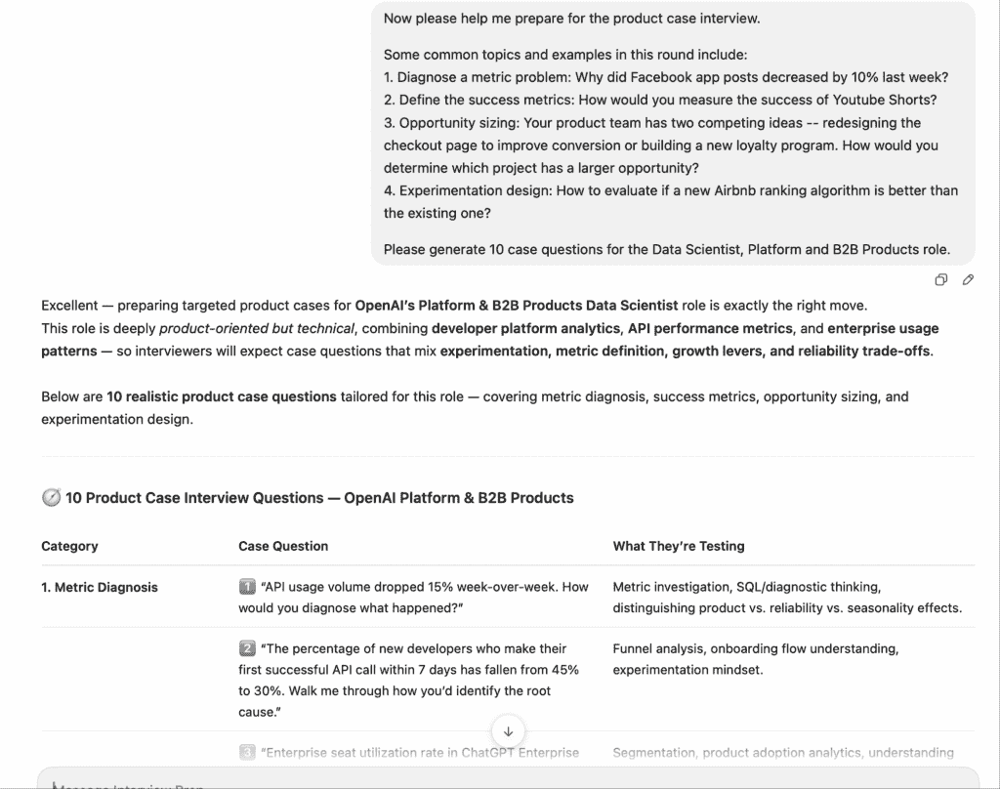
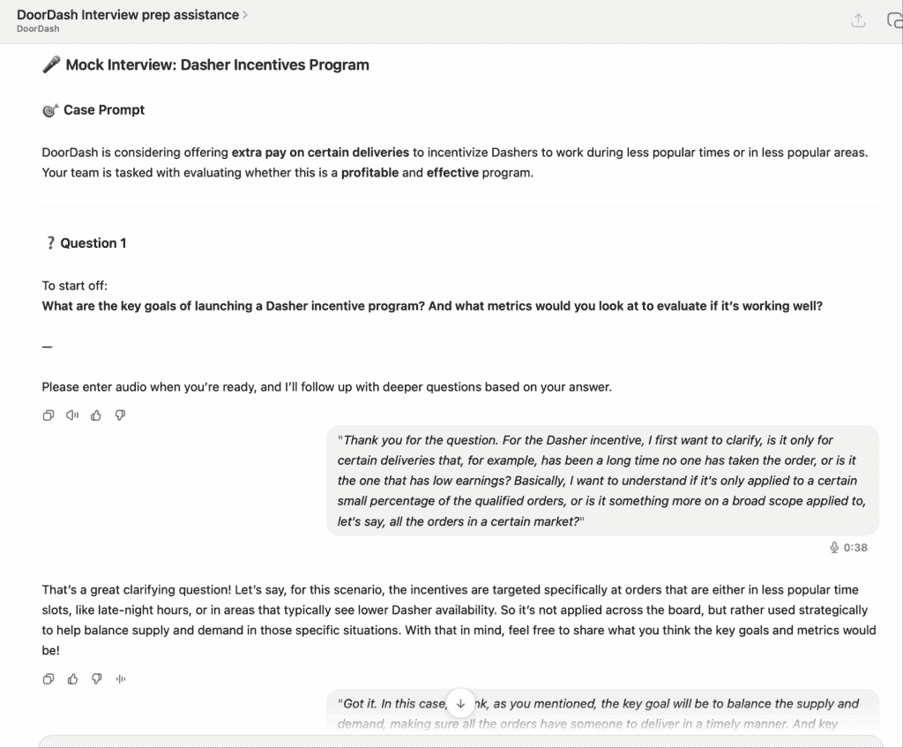
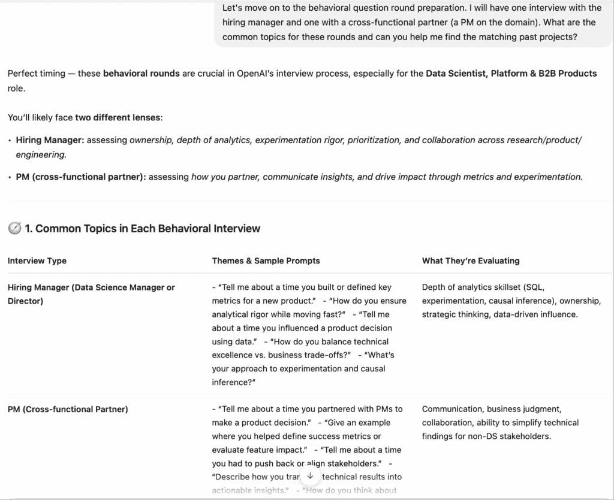
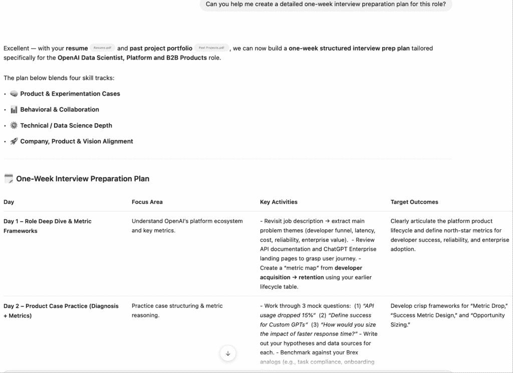

# 如何使用 ChatGPT 获得我的下一份数据科学职位

> 原文：[`towardsdatascience.com/how-i-used-chatgpt-to-land-my-next-data-science-role/`](https://towardsdatascience.com/how-i-used-chatgpt-to-land-my-next-data-science-role/)

* * *

在过去，我以招聘经理的视角撰写了关于[最近的人工智能发展如何改变数据科学面试流程](https://towardsdatascience.com/rethinking-data-science-interviews-in-the-age-of-ai/)的文章。

我最近亲自经历了几次面试。求职总是压力重重。站在另一边，我意识到 ChatGPT 可以如何简化并加速数据科学家的面试准备过程。

因此，在这篇文章中，我将分享我的 ChatGPT 求职和面试技巧，并结合真实案例。

* * *

## 第 0 步——创建 ChatGPT 项目

在开始之前，我强烈建议在 ChatGPT 中**创建一个新的**[**项目**](https://help.openai.com/en/articles/10169521-projects-in-chatgpt)来组织所有文件和对话。求职过程从来都不是简单快捷的——你可能会为不同的职位有单独的聊天。一个 ChatGPT 项目将所有内容保持在独立文件夹中，并确保所有聊天之间持久记忆。

对于我的设置，我上传了我的简历和过去的项目，以便 ChatGPT 更好地了解我的背景并做出定制化的推荐。

创建 ChatGPT 项目并上传文件（图片由作者提供）

我过去的项目文档是我最好的项目的集合，可用于我的简历和面试，采用**R-STAR**结构编写。以下是一个例子：

> **R(结果)**: 建立了一个基于 AI 的内部应用程序，集中管理客户反馈，并具有自动反馈分类和分析功能。这现在是产品经理和工程师制定产品开发路线图的关键工具。
> 
> **S(情况)**: 我们有来自 20 多个不同数据源的客户反馈（NPS、CSAT、其他调查、CX 案例、产品内反馈工具、客户通话等）。这些数据包含大量有价值的信息，但并未被广泛和有效地共享和分析。
> 
> **T(任务)**: 整合所有数据源，并关闭客户支持和产品团队之间的反馈循环。
> 
> **A(行动)**: 1. 构建数据管道，将这 20 多个数据源整合成一个真实数据集。2. 为了揭示主题和趋势，我们尝试了传统的 NLP 模型（BERT），但它们耗时较长，输出并不稳定。然后我们转向使用 OpenAI API 进行分类和摘要——经过几轮提示工程，我们在一周内实现了高准确率（11 个类别中有 70%的标签准确率）。3. 开发了一个自动管道，每天使用 OpenAI API 处理新的反馈，并与工程师合作建立内部服务器和应用程序，使工具易于所有人访问。
> 
> **结果**：一站式客户反馈中心，促进路线图优先级排序。获得黑客松“客户喜爱”奖项和全员文化亮点表扬。

一旦上传了文件，我添加了项目级指令，以便 ChatGPT 能作为我的个性化职业导师。以下是我的提示：

> 我正在申请美国的数据科学家职位。
> 
> 您是一位专注于数据科学职位搜索和面试准备的职业导师专家。
> 
> 分析我的简历、作品集和过往项目，以全面了解我的背景、技能和专长。
> 
> 您的职责包括：
> 
> 1. 职业搜索支持：分析职位描述并识别技能或经验差距。
> 
> 2. 简历与作品集优化：提出有针对性的改进建议，并帮助它们适应特定职位。
> 
> 3. 面试准备：为技术面试和行为面试创建结构化的学习和准备计划。
> 
> 4. 模拟面试：进行带有反馈和评分的现实模拟面试。
> 
> 请保持专业语气，并始终提供实用、详细和可操作的指导。

## 第 1 步—申请

### 分析职位描述并定制简历

当今的就业市场非常竞争激烈。因此，仔细阅读职位描述并根据需要定制您的简历至关重要。ChatGPT 使这一过程变得更快。

在下面的部分中，我将使用 OpenAI 的[数据科学家、平台和 B2B 产品](https://openai.com/careers/data-scientist-platform-and-b2b-products/)职位作为例子。免责声明——我实际上并没有申请这个职位，但觉得使用 OpenAI 的职位来更好地说明本文中的观点很有趣 🙂

我采取的第一步是将职位描述与 ChatGPT 分享，并要求它帮助我更好地理解这个角色，包括其领域、数据科学用例和关键技能。如果您不确定某个职位是否适合您的背景，您也可以要求 ChatGPT 为您评估。例如，以下我要求它比较 OpenAI 的两个不同职位并给出建议。

使用 ChatGPT 分析职位描述（作者图片）

与 ChatGPT 比较职位空缺（作者图片）

一旦您对职位有了良好的理解并决定申请，ChatGPT 可以快速根据领域和所需技能更新您的简历。在下面的截图中，它生成了我的简历的定制版本，并突出了最相关的经验。您还可以添加更多具体说明，说明您希望如何更改以及如何迭代，并与 ChatGPT 保持互动。

注意事项之一——**我确实发现了一些明显的错误**，例如我雇主名称下的标题顺序颠倒。确保您不仅复制粘贴了它所写的内容，而且逐行阅读您的新简历，并纠正任何错误或虚构的内容 🙂

使用 ChatGPT 定制你的简历（图片由作者提供）

在求职过程中，你还可以使用 ChatGPT 更新你的 LinkedIn 个人资料，编辑求职信，以及起草推荐请求信息。

## 第 2 步—面试准备

现在，假设你的申请在 ChatGPT 的帮助下取得了一些进展。恭喜！是时候为你的面试做好准备了。

### 1. 理解业务背景

我通常不会直接进行模拟面试。相反，对于我面试的每一个职位，我的第一步面试准备总是先**研究产品和商业模式，思考关键指标，并提出数据科学应用案例**。ChatGPT 可以在这里成为完美的头脑风暴伙伴。下面我们来看一个例子：

使用 ChatGPT 进行公司研究（图片由作者提供）

在这个例子中，ChatGPT 自己生成了一张相当全面和详细的表格，总结了生命周期阶段、产品重点、关键指标和数据科学应用案例。尽管如此，**我认为自己先尝试一下更有帮助**。例如，当我为 DoorDash 面试（我的当前雇主）做准备时，我画了一张思维导图，并让 ChatGPT 进一步细化它。这种混合方法帮助我加深了对知识的理解，并发现了差距。

头脑风暴指标和数据科学应用案例（图片由作者提供）

### 2. 产品案例面试准备

对于数据科学角色来说，产品案例面试越来越重要，尤其是在 AI 在编码方面具有强大能力的情况下。因此，我通常至少将 50%的面试准备时间花在这里。ChatGPT 可以帮助你找到和创建特定角色的样本案例，并与你一起进行模拟面试。

在下面的屏幕截图中，我简单地描述了产品案例轮次中的常见话题和问题示例。生成的案例面试问题很好地遵循了这种模式，同时针对这个平台和 B2B 产品数据科学角色的业务背景进行了定制。

使用 ChatGPT 生成产品案例问题（图片由作者提供）

使用这些有价值的提示，接下来，你可以与 ChatGPT 进行模拟面试。模拟面试可能是一项非常昂贵的服务。例如，[DataInterview](https://www.datainterview.com/coaching)对一小时的模拟面试收费 247 美元，而[InterviewQuery](https://www.interviewquery.com/pricing)的高级订阅服务（包括模拟面试服务）每月收费 79 美元。当然，与真人练习有其好处，但 ChatGPT 是免费的（假设你已经订阅），并且可以根据你的背景进行定制！

我喜欢使用[语音模式](https://chatgpt.com/features/voice/)进行实时练习，以模拟真实的面试环境 — 我让 ChatGPT 扮演面试官的角色，评估我的回答并提问后续问题。下面是我为 DoorDash 的现场面试做准备时的模拟面试截图。

ChatGPT 语音模式下的模拟面试（图片由作者提供）

尽管如此，使用 ChatGPT 进行模拟面试可能会遇到两个挑战：

1. 它提出的问题可能并不总是适合你正在面试的职位。在这种情况下，你可以尝试找到真实的面试问题（你很可能在网上找到一些大公司的过去面试问题），或者自己提出好的问题，或者给 ChatGPT 更多关于一个好的案例问题的指示，并要求它学习和迭代。

2. 我还注意到，ChatGPT 往往会给出非常积极的反应（“你在这个问题上做得很好”，“那是一个很好的答案”）。这在某种程度上有助于建立信心，但如果你注意到这种情况发生得太频繁，我建议你更明确地给出指示 — 要求 ChatGPT 扮演面试官的角色，评估这一点和那一点，并对回答给出全面的评估。

### 3. 行为面试准备

ChatGPT 在行为轮次中也同样强大。除了进行模拟面试外，它可以将你的过去项目与常见的行为问题主题相匹配，例如处理冲突、领导力、跨职能协作和优先级，并为简洁而有说服力的面试回答完善故事线。

使用 ChatGPT 进行的行为面试准备（图片由作者提供）

### 4. 制定面试准备计划

ChatGPT 被誉为优秀的规划助手。看到它上面能做的所有事情，你可以提供你的时间表和重点领域，以获得具体的面试准备计划和每日清单。

ChatGPT 生成面试准备计划（图片由作者提供）

## 第 3 步 — 面试后：提供评估和谈判

求职过程的最后阶段是报价评估和谈判。我知道你非常期待收到报价，但不要简单地接受它。根据一项[研究](https://resources.careerbuilder.com/news-research/73-of-employers-would-negotiate-salary-55-of-workers-don-t-ask)，**73%的美国雇主表示他们愿意在初始报价上谈判薪酬，但 55%的候选人没有要求更多**。作为一名数据专业人士，我确信你理解复利的力量 — 即使是适度的增加，通过加薪、奖金和股权，随着时间的推移也会产生累积效应。

ChatGPT 可以帮助你研究行业中的类似报价，比较薪酬方案，起草招聘回复，并准备谈判脚本。

* * *

## 最后的想法

求职过程可能会让人感到压力山大，但像 ChatGPT 这样的工具可以将它转变为一个更加结构化的旅程。对我来说，ChatGPT 充当了我的个人职业导师，帮助我保持组织性、高效性和自信。

这里有一些关键要点：

+   **开始之前**：使用 ChatGPT 项目来集中管理你的求职材料和背景。上传你的简历和过往项目，以便 ChatGPT 能提供定制建议。

+   **职位申请**：让 ChatGPT 分析职位描述并定制你的简历。不要跳过人工审核——始终核实你的内容。

+   **面试准备**：与 ChatGPT 头脑风暴商业指标和数据分析用例，并使用语音模式进行模拟面试以模拟对话。

+   **评估报价**：让 ChatGPT 研究类似的报价并起草谈判策略。

如果你正在考虑或正在进行求职，我希望我的建议能帮助你充分利用这些 AI 工具的每个阶段，并促进你的职业发展！
