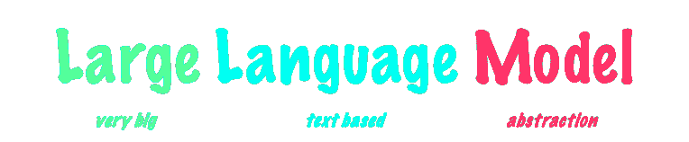

# 大型语言模型（LLMs）是如何学习的：玩游戏

> 原文：[`towardsdatascience.com/how-large-language-models-llms-learn-playing-games-cb023d780401/`](https://towardsdatascience.com/how-large-language-models-llms-learn-playing-games-cb023d780401/)

来自 Unplash.com 的图片

亲爱的读者，希望你一切都好！

在今天的文章中，我将为您提供关于大型语言模型学习的一个非常简洁直观的概述，所以请坐下来，拿一杯咖啡或茶，享受吧！

*这是我见过的最好的[数据科学路线图](https://aigents.co/learn/roadmaps/data-science-roadmap)。它包含 AI 驱动的解释和免费学习资源！*

## 什么是大型语言模型？

**大型语言模型或 LLMs**是我们所说的驱动 ChatGPT 等应用的统计模型。

它们之所以被称为这样，是因为它们通常使用**大量**（因此称为*大型*）**文本**（因此称为*语言*）进行训练，并且我们通常通过文本与它们互动，这是表示**语言**的主要途径之一。

此外，我们还有科学中**模型**的正常定义，它是对现实世界现象、系统或过程的**抽象表示**。

由作者提供的图片

因此，本质上，从名称中我们就可以得到一个相当精确的把握：**它们是人类每天使用的语言的抽象，由大量文本构建而成**。

通过学习这些抽象概念，大型语言模型学会了以许多不同的方式与文本互动，理解它，并且能够以看似人类的质量水平产生文本。

## 它们是如何构建的？

现在，让我们进入文章的核心。

**魔法。**

**要理解 LLMs 是如何构建的**，我们必须研究两件事：首先，它们从哪里学习（数据），其次，它们是如何学习的（模型的训练过程）。

### 数据

数据部分相当简单，并且取决于特定模型，但通常它是一个**结合了整个互联网的很大一部分加上特定的私有数据源**。

从它被构建的那一刻起，互联网就是人类知识最大的可访问数字数据库，它几乎包含了我们能想到的一切：

+   **书籍**：涵盖不同流派、主题和语言的各类书籍。从《战争的艺术》到《*小王子*》，最新的 LLMs 阅读了即使是人类军队在一生中阅读也无法完成的文学量。

+   **网站**：包含信息内容、论坛和其他类型文本数据的公开网站。公司网站或其他网站。

+   **维基百科**：关于广泛主题的综合信息来源——世界上最大的百科全书。

+   **研究论文**：来自各个研究领域的研究论文和期刊，他们可以从中获得很多深入、具体的知识。

+   **用户生成内容**：来自论坛、博客和社交媒体的公开可用的文本。大个子杰克的观点当然会被 LLMs 考虑，但在所有其他知识来源之间被稀释和平滑。

+   **私人内容**如报纸、大型私人论坛等。实际上，你可能已经看到像 Reddit、纽约时报和其他大型媒体公司与 OpenAI、Meta 和大型科技公司签订协议，以提供他们的专有数据来训练他们的大型语言模型。

### 训练

现在，有了这些数据，他们如何得出世界语言的抽象？他们如何构建模型？

**数据学习的流程是什么？**

通过玩[疯狂 libs 游戏](https://en.wikipedia.org/wiki/Mad_Libs)来学习如何做他们所做的事情。

什么？一个游戏？

**是的，你听得很对**。

对于那些不知道的人来说，疯狂 libs 游戏包括以下内容：

> 一名玩家在朗读之前提示其他玩家为故事中的空白处提供要替换的单词列表。

事实上，你给出了一部分上下文（周围或前面的单词），你必须**猜测文本中下一个单词**。

模型通过典型的**[机器学习](https://howtolearnmachinelearning.com/) [梯度下降](https://en.wikipedia.org/wiki/Gradient_descent)**来获得好的猜测的奖励，并因错误的猜测而受到惩罚，随着时间的推移，学习猜测最有可能的单词（按概率排序），以填充空白空间。

**LLMs 只是专业的疯狂 libs 玩家！**

## 学习示例

好吧，这是一个巨大的简化，但在高层次上，这就是普通的 LLMs 所做的事情。**让我们看看一个例子**，比如《爱丽丝梦游仙境》的第一句话：

> 爱丽丝开始厌倦坐在她姐姐身边，坐在河岸上，无所事事

第 1 件要注意的事情是，这些数据已经标记好了：模型已经有了它需要的所有文本，而我们，作为模型训练者，只需要移除单词来训练它。这就是我们所说的**[自监督学习](https://en.wikipedia.org/wiki/Self-supervised_learning)**。

模型首先得到第一个单词，或者第一个和第三个单词，其中我们移除了整个句子或第二个单词。

> 爱丽丝

或者

> 爱丽丝 ___ 开始

想象一下，如果我们采用第一个例子，现在模型将尝试猜测下一个单词。

让我们看看他通过查看按概率排序的下一个单词列表是如何做的（想象模型已经有一些预先硬编码的训练）。

> (is, 0.95), (was, 0.82), (said, 0.42), (thinks, 0.39), (loves, 0.32)…

这将导致我们在句子中插入单词***is***作为下一个单词。

> 爱丽丝是

当然，**我们知道这是错误的**，因为需要填补空白的词是“*was*”（我们知道这一点，因为我们有文本），所以我们惩罚模型，并让它改变其内部权重来学习这一点。

**这就完了！简单吧？**

端到端大型语言模型有一个重要的参数，即**温度参数**，它允许模型选择一个不是最可能的词，使它们的感觉更加自然和灵活，并允许其响应中存在一些变化。

你可以在这里找到所有关于它的信息：[提示工程设置指南](https://www.promptingguide.ai/introduction/settings)

现在，通过重复我们在提到的所有不同性质的文本上进行的这个过程，ChatGPT 和其他由 LLM 驱动的应用学会了它们所做的事情，展现了我们称之为“***新兴能力***”的东西。

新兴能力是相当特别的事情，AI 研究人员在训练这些模型时意外地发现了它们。基本上，通过学习**预测下一个单词**，LLMs 还学会了做很多其他事情，而且做得非常好。

+   **它们学会了编码**，最新的 OpenAI 模型 O3 现在在[全球编码测试中排名第 175 位](https://www.nextbigfuture.com/2024/12/openai-o3-ranks-as-175th-best-in-the-world-on-coding-test-and-great-on-agi-and-phd-tests.html)。

+   它们还学会了**以特定风格撰写文本**，颠覆了内容创作行业（我的风格对 LLM 来说太难模仿了，这篇文章是 100%原创的，请放心）

+   它们在**从一种语言翻译到另一种语言**方面非常出色。

+   它们学会了总结、头脑风暴，以及几乎可以用文本完成我们可以想象的一切。

在 AI 社区中，关于 LLM 能否达到所谓的**人工通用智能（AGI）**存在广泛的**辩论**。

**AGI 是什么，目前还没有得到完美的定义**，但本质上它指的是能够以相当不错的人类水平和专业知识执行各种任务的机器。

一些，如 Sam Altman 或 Elon Musk 认为，随着模型更好、更大，以及架构的调整和补充，**我们将通过基于 LLM 的系统达到 AGI**。

其他像 Yan Leccun 这样的人，Meta 的首席 AI 官，说当前的架构过于狭窄，**缺乏与现实世界互动的基础和基本能力**。

我们将看到谁是对的，但无论如何，LLMs 的这些新兴能力，以及过去两年中我们所看到的所有令人难以置信的应用和开发，都指向**语言是智能的基本元素**，并指向一个有趣的哲学辩论：

**我们是人类因为发展了语言才变得聪明，还是因为我们聪明才发展了语言？**

👉 _ 非常乐意听到您的想法，请在下面的评论中告诉我 👉

和往常一样，我希望你在阅读这篇文章时有所乐趣，并且能够从高层次上了解 LLMs 是如何在底层工作的。

祝你有个美好的一天，继续学习！
