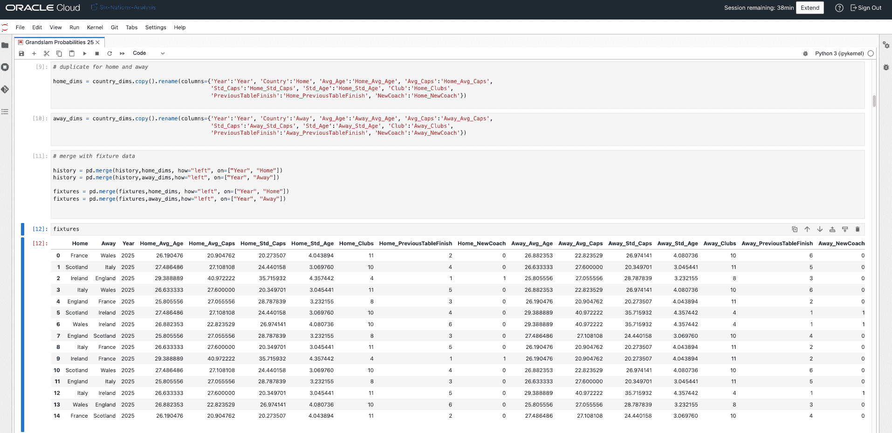
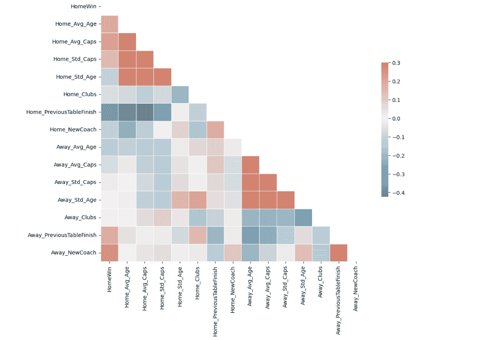
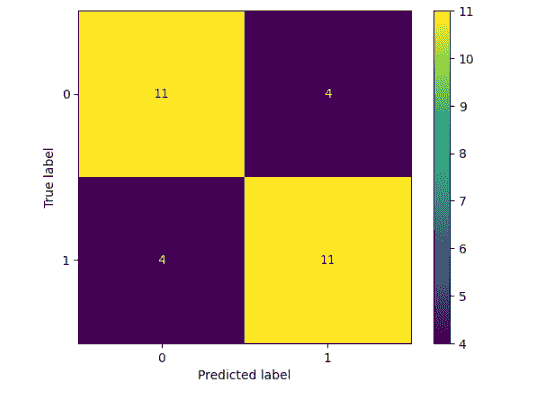
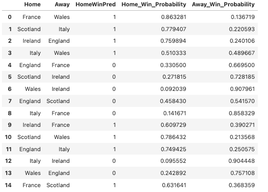
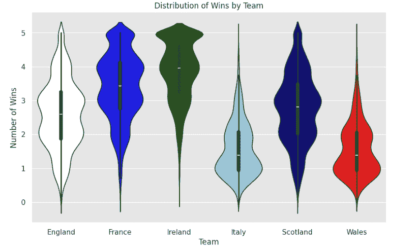
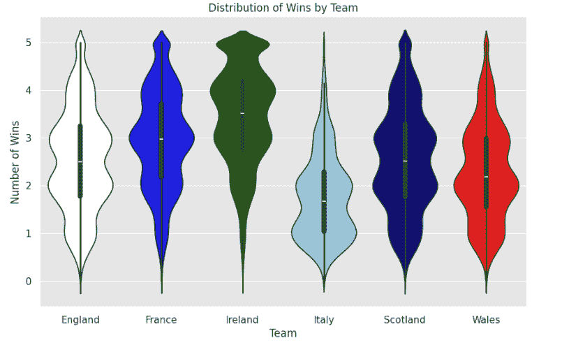
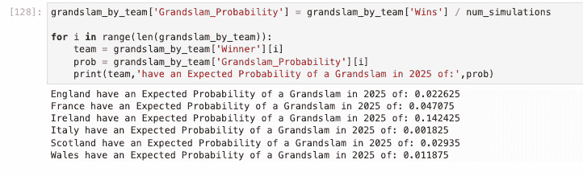
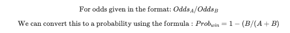
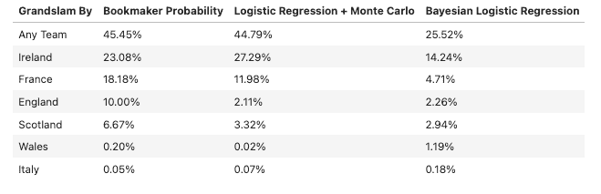

# 2025 年六国赛 Grand Slam 的可能性有多大？

> 原文：[`towardsdatascience.com/how-likely-is-a-six-nations-grandslam-in-2025-91aadb47963e/`](https://towardsdatascience.com/how-likely-is-a-six-nations-grandslam-in-2025-91aadb47963e/)

### 对体育赛事的不确定性进行量化

图片由[Thomas Serer](https://unsplash.com/@jesusance?utm_source=medium&utm_medium=referral)在[Unsplash](https://unsplash.com?utm_source=medium&utm_medium=referral)提供

## **引言**

对于橄榄球迷来说，漫长的等待即将结束，就像圣诞节一样，六国赛一年一度地来到寒冷的冬季，提振我们的精神。如果你对橄榄球不太熟悉，六国赛是一个年度赛事，欧洲顶级国家队（英格兰、法国、爱尔兰、意大利、苏格兰、威尔士）每年进行五场比赛，每年轮流主客场。所有队伍都为了赢得比赛而竞争，但最渴望的奖项是“Grand Slam”——一支队伍赢得所有 5 场比赛。鉴于赛事的竞争性，Grand Slam 相对罕见，自从 2000 年赛事扩大到六支队伍以来，可能的 25 次 Grand Slam 中只有 13 次。

今年，在 2025 年的比赛中，爱尔兰队带着连续三次系列赛胜利的势头进入比赛，面临着来自法国的激烈竞争，法国的国内联赛（Top 14）今年在欧洲冠军杯中表现非常出色。

考虑到这一点，并且鉴于大约一半的赛事都导致了 Grand Slam，2025 年发生 Grand Slam 的可能性有多大？在这篇简短的文章中，我们将探讨如何利用以往的比赛结果和其他信息来对 Grand Slam 的可能性做出最佳猜测。我们将重点关注线性模型，并从频率派和贝叶斯的角度来探讨这个问题。这些模型是使用 SciKit-Learn 和贝叶斯建模库 Bambi（它建立在*优秀的*PyMC 框架之上）构建的。

继续阅读以了解我为什么估计 2025 年六国赛 Grand Slam 的可能性大约在*30-40%*。

## **量化不确定性**

在人工智能时代，人们越来越习惯于将输入映射到输出，并做出高度准确的预测。无论是使用 LLM 生成自然语言响应，计算机视觉模型标记图像，甚至是 Auto ML 预测表格数据集，人们越来越认为这些模型*只是工作*。

尽管如此，输入和输出之间的关系自然涉及一定程度的不确定性——当你处理像体育中经常看到的小型或噪声数据集时，给你的预测附加一个不确定性的估计是很重要的。例如，2025 年六国赛的首场比赛法国队主场对阵威尔士——我们可能会预测法国队会赢，但我们对此有多大的信心？

## **我们的数据集**

用于此分析的数据集来源于公开资源，例如 [维基百科](https://en.wikipedia.org/wiki/2024_Six_Nations_Championship)。预测 2025 年比赛结果的一个挑战是，基于面板数据的预测是基于样本外数据，并且队伍的表现通常在几年间波动，因为队伍和管理层发生变化。

在我们公开获取的数据中，我们收集了 2020-2024 年的统计数据，包括：

+   队伍的年龄结构

+   队伍的经验（即国际出场次数）

+   构成国家队的不同俱乐部队伍数量

+   前一赛季排名

+   前一赛季比赛结果

+   自上次锦标赛以来是否有教练更换

这里的数据准备使用 Pandas 完成。图 1 显示了我们在比赛层面合并数据的方式，包括每年锦标赛队伍的信息。通过观察我们可以看到，在 2025 年：

+   ***爱尔兰*** 拥有最老的队伍，平均出场次数比例较高。这告诉我们队伍非常稳定，由于爱尔兰橄榄球是地方性的，队伍由仅四支球队组成。考虑到队伍的年龄结构和他们今年有新教练，关于他们是否处于或接近“顶峰”状态存在不确定性

+   ***法国*** 平均年龄最小的队伍之一，平均出场次数也最低。尽管如此，他们表现异常出色，在 2024 年锦标赛中排名第二，这表明他们的队伍正在崛起

+   ***英格兰*** 是第二年轻的队伍，但平均出场次数比例较高，这表明他们在 2025 年锦标赛中试图在年轻和经验之间取得平衡

+   ***苏格兰*** 是锦标赛中第二老和出场次数最多的队伍之一。他们有一支稳定的队伍，并且可能在 2024 年表现不佳，排名第四。他们的队伍可能在达到顶峰之前将经历一段重建期

+   ***意大利*** 在平均出场次数方面与苏格兰处于相似位置，但年龄结构略年轻。多年来管理层的变动不少，但今年他们带着一支稳定的队伍和同一教练参赛。他们今年可能会让人感到意外

+   ***威尔士*** 处于重建期，拥有年轻且缺乏经验的队伍，并在 2024 年锦标赛中表现不佳，排名最后

由于我们使用线性方法来预测结果，我创建了一个二元标志来表示主队是否赢得了比赛，对于每一场比赛，我们将预测主队获胜的概率（即是否）。主队未获胜的概率，隐含地，等同于预测客队获胜。

图 1 – 使用 Pandas 准备的锦标赛历史和 2025 年比赛

## **探索数据**

在构建预测模型之前，进行一些探索性分析是很重要的。图 2 显示了特征的关联图。

如您所预期的那样，去年您所处的位置与今年获胜高度相关。同样，您的球队档案也与获胜高度相关。更换教练也有相关性，但不是那么强烈——这可能是因为在锦标赛之间发生这种情况的实例相对较少。

在这里的一个重要考虑因素是模型输入（特征）之间是否存在相关性，因为自相关性可能会对模型可靠性产生负面影响。我们可以看到，年龄和出场次数之间存在强烈的关联，这是直观的，因为年龄较大的球员（平均而言）会有更多的出场次数。为了适应这一点，我们用表示出场次数与年龄比例的复合特征替换这些输入，我们还从模型中移除了一些相关性较低的输入，因为在拟合模型以避免过拟合时，通常“少即是多”。

图 2 – 历史结果的关联图

## **准备数据**

一旦我们确定了模型的特征，我们就可以准备训练数据。由于这是一个面板数据问题，我们按以下方式分割数据。

***模型验证：*** 我们首先验证模型并估计样本外准确性。为此，我们在之前的锦标赛上进行回测

+   训练数据集 – 2020–2023 赛季的赛程结果

+   测试数据集 – 2024 年锦标赛的赛程结果

***模型预测：*** 我们可以为 2025 年的样本外预测创建预测模型

+   训练数据集 – 2020–2024 年的赛程结果

+   预测数据集 – 2025 年的即将到来的赛程

我们使用以下方法准备用于建模的数据集：

+   赛程的一元编码

+   对数值特征进行 MinMax 缩放

在每个数据集上应用缩放是很重要的，以减轻 _[数据泄露](https://scikit-learn.org/stable/common_pitfalls.html#data-leakage)_ 的风险。

## **逻辑回归的点估计**

我们可以使用 SciKit-Learn 的逻辑回归分类器创建我们的频率主义模型。图 3 显示了在 2020–2024 年赛程上的回测混淆矩阵

图 3 – 回测的混淆矩阵

在图 3 中，我们可以看到模型的准确率大约为 73%。您可能会想知道为什么 2024 年的预测有总共 30 场比赛，而每个锦标赛只有 15 场比赛？这是因为为了提高模型准确率，我们堆叠了数据，以便为每场比赛获得主客场结果。这是因为球队每年只相互比赛一次，并在每个锦标赛中交换主客场。我们作为人类，理解法国对阵威尔士与威尔士对阵法国是相同的，但模型无法直接理解这一点。为了做到这一点，我们交换了主客场，然后交换了主胜的二进制标志，以保持数据的完整性。

例如：

+   2024 年威尔士对阵法国 → 主胜 = 0 [原始]

+   2024 年法国对阵威尔士 → 主胜 = 1 [倒置]

使用我们对 2025 年的外样本预测，我们得到了以下 2025 年即将到来的赛事的胜率。

表 1 – 2025 年的点估计

在表 1 中，我们可以看到：

+   根据以往的表现和获得“三连冠”（第三个连续冠军）的机会，爱尔兰队预计会表现得很好。

+   预计法国将表现得非常好，尤其是在主场

+   英格兰有相当强的机会，但很可能会以中游的成绩结束

+   苏格兰预计在今年再次在加尔各答杯中略占优势，但竞争将非常激烈

+   意大利和威尔士预计将竞争以避免获得“木勺”（最差成绩），预计意大利将是轻微的青睐方

## **模拟基于我们估计概率的赛事结果**

一旦我们估计了赛事的概率，我们可以使用蒙特卡洛方法来模拟锦标赛并估计六国赛冠军的可能性。蒙特卡洛方法使用随机抽样来估计概率并量化不确定性。

为了做到这一点，我们运行了 10,000 次锦标赛模拟，并使用我们的胜率进行随机选择。为此，我们使用 Numpy 的随机选择方法为我们的一组主客场赛事和相应的胜率。图 4 显示了每个球队在每个锦标赛中模拟的获胜次数的提琴图

图 4 – 基于频率主义概率的模拟锦标赛结果

值得注意的是，这些点被抖动以改善图表的美观，但总体而言，我们可以从图 4 中看到：

+   法国和爱尔兰是夺冠的明显热门，尽管根据过去的表现，爱尔兰可能更有可能赢得冠军赛

+   重要的是要注意，过去的表现并不总是预示着当前的表现，例如爱尔兰队有新的主教练，是最老的球队，并且在关键球员乔尼·塞顿退役后正处于重建阶段

+   英格兰和苏格兰可能会引起一些意外，但很可能会为争夺中上游位置而战。根据最近的表现，苏格兰更有可能赢得 3 场胜利，英格兰赢得 2 场胜利，但英格兰在比赛中可能的表现存在更多不确定性。

+   威尔士和意大利很可能会在积分榜底部展开争夺，两队都有很大可能在本届锦标赛中至少赢得一场胜利，尽管这可能是一场意大利对阵威尔士的比赛，鉴于 2025 年的主场优势，意大利可能是可能的夺冠热门。

总体而言，这个模型与许多专家对本届锦标赛的期望相符。这种方法的一个局限性是我们假设比赛的获胜概率围绕逻辑回归模型中的点估计呈正态分布。这可能是一个强烈的假设。

模型的另一个假设是，一场比赛中获胜的结果不会影响其他比赛中获胜的概率，即比赛是独立的。我个人认为这并不完全不合理，因为这是职业体育，各队都会被训练在每场比赛中保持获胜心态——而且各队之间的表现往往不一致。例如，苏格兰在 2024 年对英格兰的表现非常好，但随后输掉了后续的比赛，而英格兰随后击败了爱尔兰，最终赢得了锦标赛。

## **使用贝叶斯逻辑回归预测 2025 年**

我们可以通过直接采样来避免对整个锦标赛中获胜概率分布的强烈假设。为此，我们可以使用马尔可夫链蒙特卡洛（MCMC）方法——它提供了一种通过随机采样来估计模型参数分布的贝叶斯方法。本质上，这些模型通过观察真实数据来更新对模型参数分布的先验信念。一旦模型围绕“真实”分布收敛，它就会直接从模型参数的后验分布中进行采样。在逻辑回归模型的情况下，我们将目标变量建模为伯努利分布。

使用贝叶斯逻辑回归模型可能存在潜在缺点，例如它们可能对模型假设的先验值敏感，预测概率可能没有很好地校准（取决于先验假设），在层次模型的情况下，可能存在‘收缩’现象。收缩发生在层级水平被拉向父级水平的平均值——在体育建模中，这种影响是，位于表格顶部和底部的队伍的估计值可能会被拉向表格的平均值。

图 5 – 直接从预测后验分布中估计大满贯概率的样本

图 5 显示了直接从预测后验分布中估计的获胜分布的提琴图。分布看起来比我们的逻辑回归更分散，这可能表明我们模型中的不确定性更高。观察图表，可能存在一些收缩，因为威尔士和意大利预计会比逻辑回归模型表现更好，而爱尔兰似乎大满贯的机会更小。

## **我们的分析告诉我们什么？**

我们可以直接通过将大满贯次数除以赛事次数来使用我们的样本直接估计大满贯的概率，这如图 6 所示。

图 6 – 从蒙特卡洛和 MCMC 样本中估计概率

我们可以将我们的模型结果与公开发布的赔率进行比较。我发现 1 月 1 日一位投注者发布的赔率如下：

+   没有赢家 5/6 [这暗示任何赢家的赔率为 6/5]

+   爱尔兰 10/3

+   法国 9/2

+   英格兰 9/1

+   苏格兰 14/1

+   威尔士 500/1

+   意大利 2000/1

我们可以使用以下公式将发布的赔率转换为近似概率：

这里有两个方面需要考虑：

+   首先，博彩公司发布的是*隐含赔率*而不是*真实赔率*，因为他们在发布的赔率中考虑了利润空间（即*庄家总是赢*）。

+   其次，随着新信息的出现，赔率会发生变化。我们的分析相对简单，没有考虑伤病或其他因素。这很重要，因为比赛开始前有明显的伤病和退赛情况，因此赔率已经发生变化。这就是为什么我比较的是我们估计的赔率与年初发布的赔率，因为近期伤病不会影响发布的赔率。

## **我们的模型与公开发布的投注赔率相比如何？**

那么，我们的模型与公开发布的赔率相比如何？我们的频率主义模型出奇地接近，而我们的贝叶斯模型暗示对六国赛大满贯可能性的确定性较低。在表 2 中，您可以看到转换后的赔率和我们估计的概率比较。

表 2 – 我们模型与公开发布赔率的比较

总体而言，尽管我们使用的样本相对较小且稀疏，我们的估计看起来并不不合理。

## **结论**

我们的分析发现：

+   在 2025 年六国赛中，法国队由于阵容相对年轻，有可能表现得超出预期。

+   爱尔兰看起来最有可能获得大满贯，但这基于过去的成绩。随着新教练的加入、老将阵容和战术核心的更迭，前景变得不太确定。

+   英格兰的真实赔率可能比他们的隐含赔率更差，并且根据过去的表现，应该争取一个强劲的中游位置。他们拥有最年轻的队伍之一，但相对于他们的年龄结构，拥有比其他强队更多的出场次数。他们有潜力在比赛中造成破坏。

+   苏格兰赢得大满贯的机会比英格兰更大，并且很可能也在争夺一个强劲的中游位置。他们在爱尔兰之后拥有第二老和经验最丰富的队伍，并且可能正处于或接近作为一支队伍的巅峰状态。对于这个队伍来说，现在是时候还是永远不再了呢？

+   威尔士和意大利不太可能在 2025 年的六国赛中表现出色，并且意大利将力争连续第二年排在威尔士之上。

+   任何一支球队赢得大满贯的可能性相当大，大约有 30-40%的机会。

+   这可能是一场非常具有竞争力的锦标赛，许多队伍都有赢得比赛的好机会。

## **总结**

在这篇文章中，我们看到了如何利用频率派和贝叶斯方法来量化 2025 年六国赛可能获胜者的不确定性。虽然我们的模型相对简单，并且仅限于使用小数据集，但我们的概率与已发布的赔率并不太相似，尽管随着事件的发展（伤病、征召等），这些赔率已经发生了变化。

感谢您阅读这篇文章，希望它对您有所启发。如果您想了解更多关于分析的信息，您可以在我的[GitHub](https://github.com/HarrySnart/GrandslamProbabilities2025)账户上找到完整的代码。

* * *

除非另有说明，所有图片均为作者所有。
