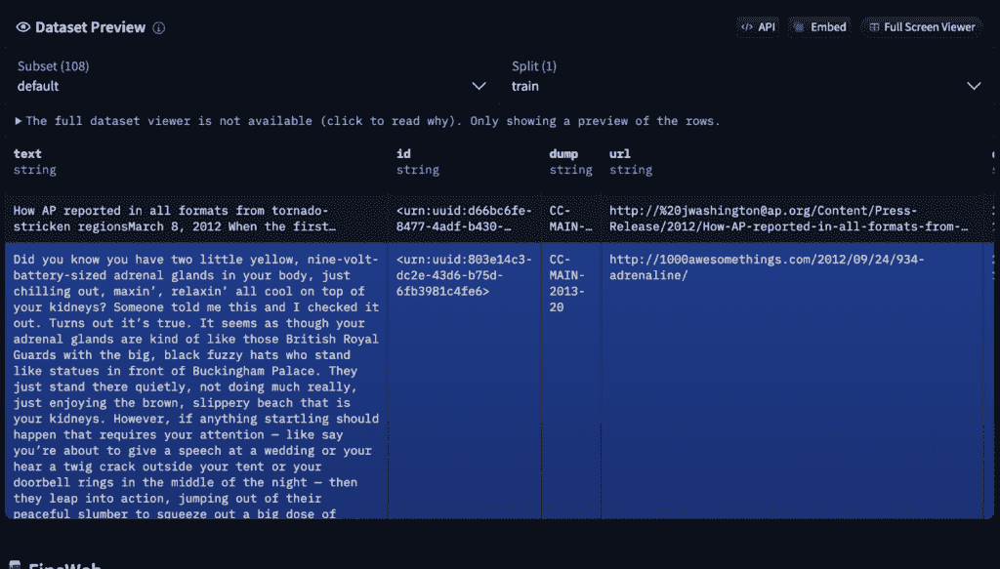
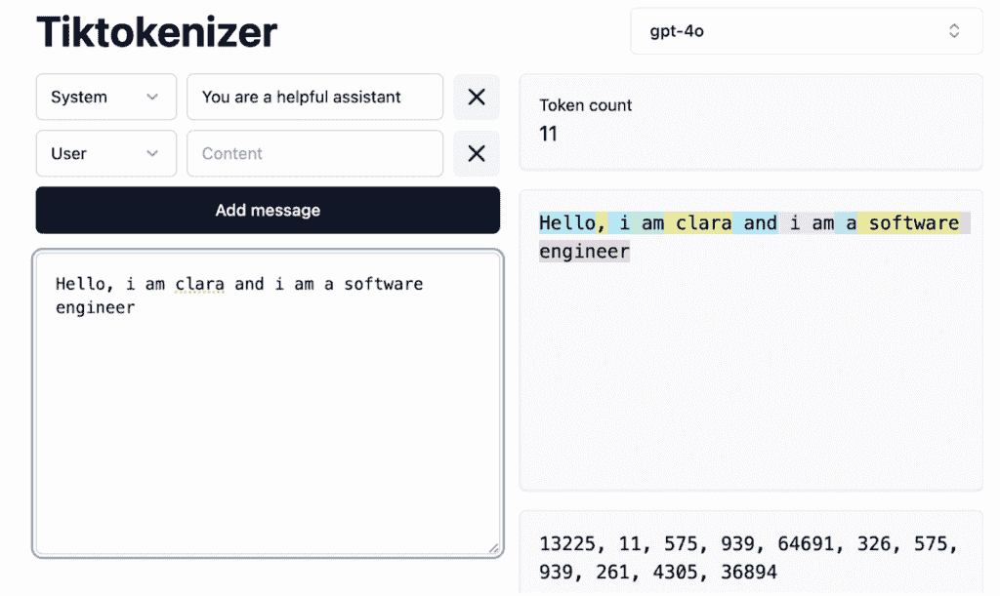
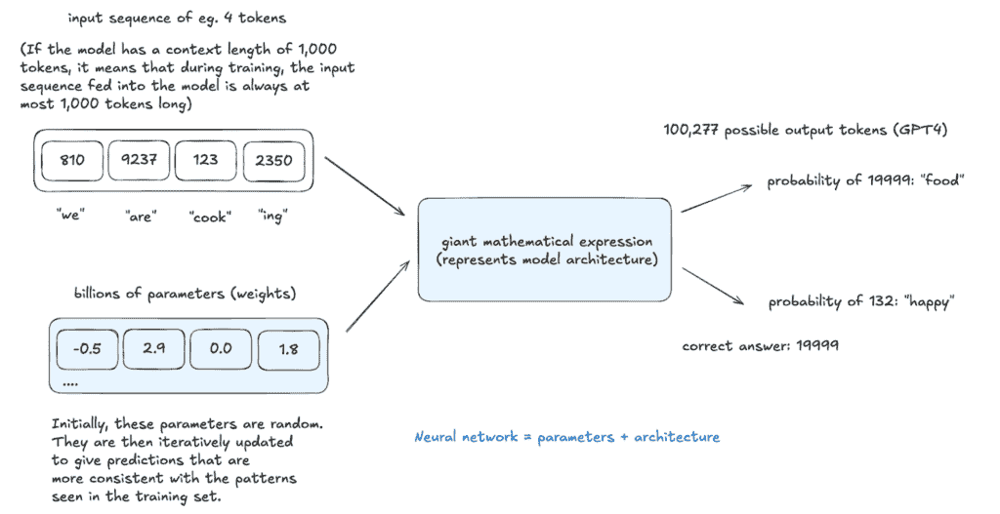
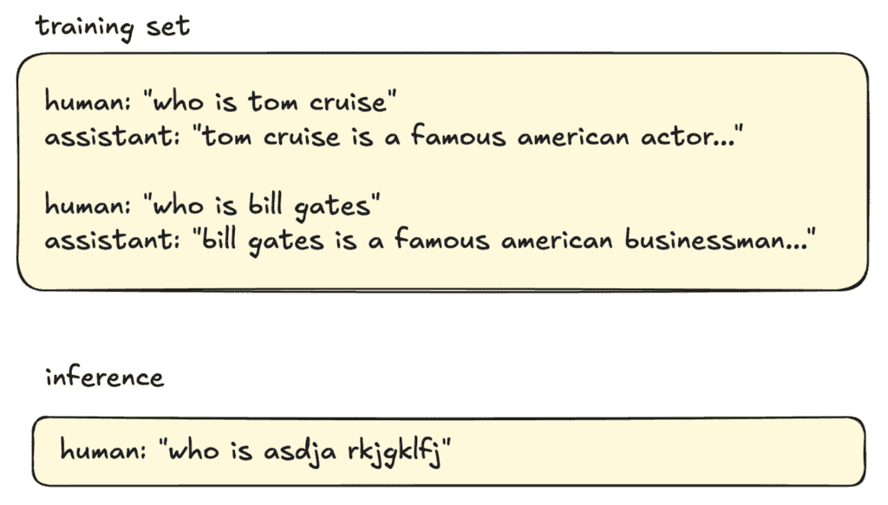

# LLMs 的工作原理：从预训练到后训练，神经网络，幻觉和推理

> 原文：[`towardsdatascience.com/how-llms-work-pre-training-to-post-training-neural-networks-hallucinations-and-inference/`](https://towardsdatascience.com/how-llms-work-pre-training-to-post-training-neural-networks-hallucinations-and-inference/)

随着对大型语言模型（LLMs）兴趣的最近激增，它们似乎几乎具有魔力。但让我们揭开它们的神秘面纱。

我想要回顾并剖析基本原理——分解 LLMs 是如何构建的、训练和微调的，以成为我们今天与之互动的 AI 系统。

这**两部分的深入探讨**是我一直想做的事情，也受到了[Andrej Karpathy 广受欢迎的 3.5 小时 YouTube](https://www.youtube.com/watch?app=desktop&v=7xTGNNLPyMI)视频的启发，该视频在短短 10 天内就获得了 80 万以上的观看量。Andrej 是 OpenAI 的创始人之一，他的见解是宝贵的——你明白我的意思。

如果你有时间，**这个视频绝对值得一看**。但说实在的——3.5 小时是一个漫长的观看时间。所以，对于所有忙碌的人，不想错过的人，我已经从前 1.5 小时中提炼出了关键概念，并添加了自己的分析，以帮助你建立稳固的直觉。

## **你将获得**

第一部分（本文）：涵盖了 LLMs 的基本原理，包括从预训练到后训练，神经网络，幻觉和推理。

第二部分：带有人类/人工智能反馈的强化学习，研究 o1 模型，DeepSeek R1，AlphaGo

让我们开始吧！我将从了解 LLMs 是如何构建的入手。

从高层次来看，有两个关键阶段：预训练和后训练。

### **1. 预训练**

在 LLM 能够生成文本之前，它必须首先学习语言的工作方式。这是通过预训练实现的，这是一个计算密集型任务。

#### 第一步：数据收集和预处理

训练 LLM 的第一步是收集尽可能多的高质量文本。目标是创建一个包含广泛人类知识的庞大且多样化的数据集。

一个来源是[Common Crawl](https://commoncrawl.org/)，这是一个包含 18 年超过 2500 亿网页的免费、开源的网页抓取数据仓库。然而，原始的网页数据是嘈杂的——包含垃圾邮件、重复内容和低质量内容——因此预处理是必不可少的。如果你对预处理后的数据集感兴趣，FineWeb 提供了 Common Crawl 的精选版本，并在[Hugging Face](https://huggingface.co/spaces/HuggingFaceFW/blogpost-fineweb-v1)上提供。

一旦文本语料库被清理，它就准备好进行分词了。

#### 第二步：分词

在神经网络能够处理文本之前，它必须被转换为数值形式。这是通过**分词**来完成的，其中单词、子词或字符被映射到唯一的数值标记。

将标记视为构建块——所有语言模型的基本构建块。在 GPT4 中，有 100,277 个可能的标记。一个流行的标记器，[Tiktokenizer](https://tiktokenizer.vercel.app/)，允许你进行标记化实验并查看文本是如何分解成标记的。尝试输入一个句子，你就会看到每个单词或子词被分配一系列数字 ID。

#### 第 3 步：神经网络训练

一旦文本被标记化，神经网络就会根据其上下文学习预测下一个标记。如上图所示，模型接受一个标记序列的输入（例如，“我们正在烹饪”）并通过一个巨大的数学表达式——这代表了模型的架构——来预测下一个标记。

一个神经网络由 2 个关键部分组成：

1.  **参数（权重）**——从训练中学习到的数值。

1.  **架构（数学表达式）**——定义如何处理输入标记以产生输出的结构。

初始时，模型的预测是随机的，但随着训练的进行，它学会了为可能的下一个标记分配概率。

当识别出正确的标记（例如，“食物”）时，模型通过**反向传播**调整其数十亿个参数（权重）——这是一个通过增加正确预测的概率同时减少错误预测的可能性来强化正确预测的优化过程。

这个过程在大量数据集上重复数十亿次。

#### **基础模型——预训练的输出**

在这个阶段，基础模型已经学会了：

+   单词、短语和句子如何相互关联

+   训练数据中的统计模式

然而，**基础模型尚未针对现实世界任务进行优化**。你可以把它们看作是一个高级自动完成系统——它们根据概率预测下一个标记，但具有有限的指令遵循能力。

基础模型有时可以逐字背诵训练数据，并且可以通过**上下文学习**应用于某些应用，其中你通过在提示中提供示例来引导其响应。然而，要使模型真正有用和可靠，它还需要进一步训练。

### 2. 后训练——使模型有用

基础模型是原始且未经过精炼的。为了使它们变得有用、可靠和安全，它们需要经过后训练，在这个过程中，它们在更小、更专业的数据集上进行微调。

因为模型是一个神经网络，它不能像传统软件那样被明确编程。**相反，我们通过在表示期望交互的示例的结构化标记数据集上对其进行训练来隐式地“编程”它。**

#### 后训练是如何工作的

创建了专门的数据库，包含模型在不同情况下应该如何响应的结构化示例。

一些类型的后训练包括：

1.  **指令/对话微调**目标：教会模型遵循指令，具有任务导向性，参与多轮对话，遵循安全指南，拒绝恶意请求等。

    例如：[InstructGPT (2022)](https://arxiv.org/abs/2203.02155)：OpenAI 雇佣了大约 40 名承包商来创建这些标记数据集。这些人工标注者编写提示并提供基于安全指南的理想响应。如今，许多数据集都是自动生成的，人类会对其进行审查和编辑以确保质量。

1.  **领域特定微调**目标：将模型适应于医学、法律和编程等特定领域。

训练后还引入了**特殊令牌**——在预训练期间未使用的符号，以帮助模型理解交互结构。这些令牌指示用户的输入开始和结束的位置以及 AI 响应的开始位置，确保模型正确区分提示和回复。

现在，我们将继续介绍一些其他关键概念。

## **推理——模型如何生成新文本**

推理可以在任何阶段进行，甚至在预训练中途，以评估模型学习得有多好。

当给定一个令牌输入序列时，模型会根据训练期间学习的模式为所有可能的下一个令牌分配概率。

**而不是总是选择最可能的令牌，它从这个概率分布中进行采样——类似于抛一个有偏见的硬币，其中更高概率的令牌更有可能被选中。**

这个过程会迭代进行，每个新生成的令牌都将成为下一个预测的输入部分。

令牌选择是**随机的**，相同的输入可以产生不同的输出。随着时间的推移，模型生成的文本可能不在其训练数据中明确提及，但遵循相同的统计模式。

## **幻觉——当 LLM 生成虚假信息**

### **为什么会出现幻觉？**

幻觉发生是因为 LLM（大型语言模型）并不“知道”事实——它们只是根据训练数据预测最可能出现的单词序列。

早期模型在幻觉方面遇到了很大的困难。

例如，在下面的例子中，如果训练数据包含许多带有明确答案的“Who is…”问题，模型会学习到这样的查询应该总是有自信的回应，即使它缺乏必要知识。

当被问及一个未知人物时，模型不会默认回答“我不知道”，因为这种模式在训练期间没有得到强化。相反，它会生成最佳猜测，这通常会导致虚构的信息。

### **如何减少幻觉？**

#### 方法 1：说“我不知道”

提高事实准确性需要明确训练模型以识别它不知道的内容——这项任务比看起来更复杂。

这是通过**自我质疑**来实现的，这个过程有助于定义模型的知识边界。

自我质疑可以通过使用另一个 AI 模型来自动化，该模型生成问题以探测知识差距。如果它产生了错误的答案，就会添加新的训练示例，其中正确的响应是：“*我不确定。你能提供更多背景信息吗？*”

如果一个模型在训练中多次见过一个问题，它会给正确答案分配一个很高的概率。

**如果模型之前没有遇到过这个问题，它会在多个可能的标记上分配更均匀的概率，使得输出更加随机化。没有单个标记突出为最有可能的选择。**

显式微调训练模型以处理低置信度输出和预定义的响应。

例如，当我向 ChatGPT-4o 提问“*谁是 asdja rkjgklfj？*”时，它正确地回答：“我不确定是谁。你能提供更多背景信息吗？”

#### 方法 2：进行网络搜索

一种更高级的方法是通过提供外部搜索工具的访问权限，来扩展模型的知识范围，使其超出其训练数据。

在高层次上，当模型检测到不确定性时，它可以触发网络搜索。然后，搜索结果被插入到模型的内容窗口中——本质上允许这些新数据成为其工作记忆的一部分。在生成响应时，模型会参考这些新信息。

## 模糊记忆与工作记忆

一般而言，LLMs 有两种类型的知识访问。

1.  模糊记忆——模型参数中存储的知识。这是基于它从大量互联网数据中学习到的模式，但不是精确的，也不是可搜索的。

1.  工作记忆——在模型的内容窗口中可用的信息，在推理期间可以直接访问。在提示中提供的任何文本都充当短期记忆，允许模型在生成响应时回忆细节。

在内容窗口中添加相关事实可以显著提高响应质量。

## 自我认知

当被问及像“*你是谁？*”或“*是什么建造了你？*”这样的问题时，LLM 将基于其训练数据生成基于统计的最佳猜测，除非明确编程以准确响应。

LLMs 没有真正的自我意识，它们的响应取决于训练期间看到的模式。

通过使用**系统提示**，可以提供一种方法来确保模型具有一致的个性，该提示预设了关于它应该如何描述自己、其能力和其限制的指令。

## 结束语

第一部分到此结束！希望这能帮助你建立对 LLMs 工作原理的直觉。在第二部分，我们将更深入地探讨强化学习和一些最新的模型。

对于我接下来应该涵盖什么内容有疑问或想法吗？请在评论中留言——我很乐意听到你的想法。第二部分再见！ 🙂
