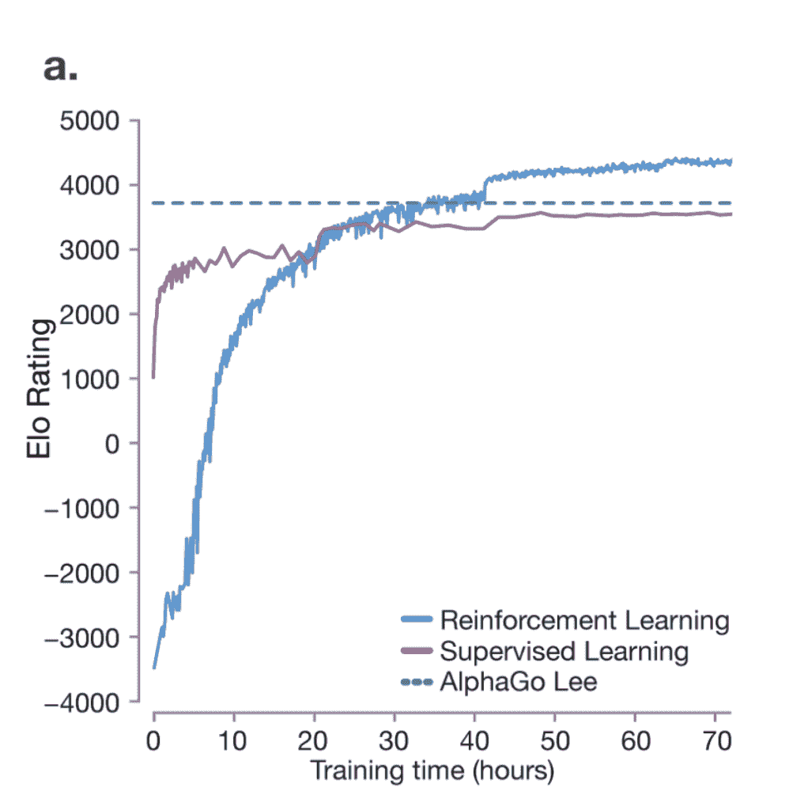
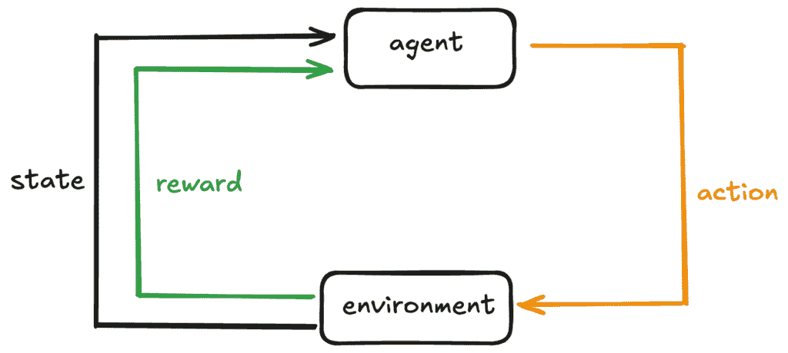
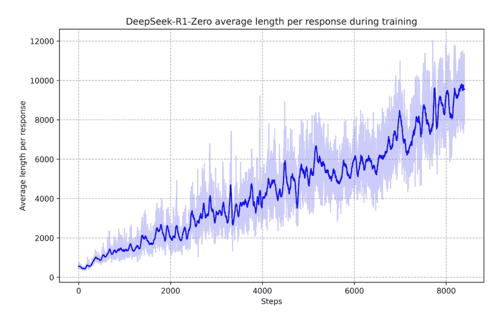
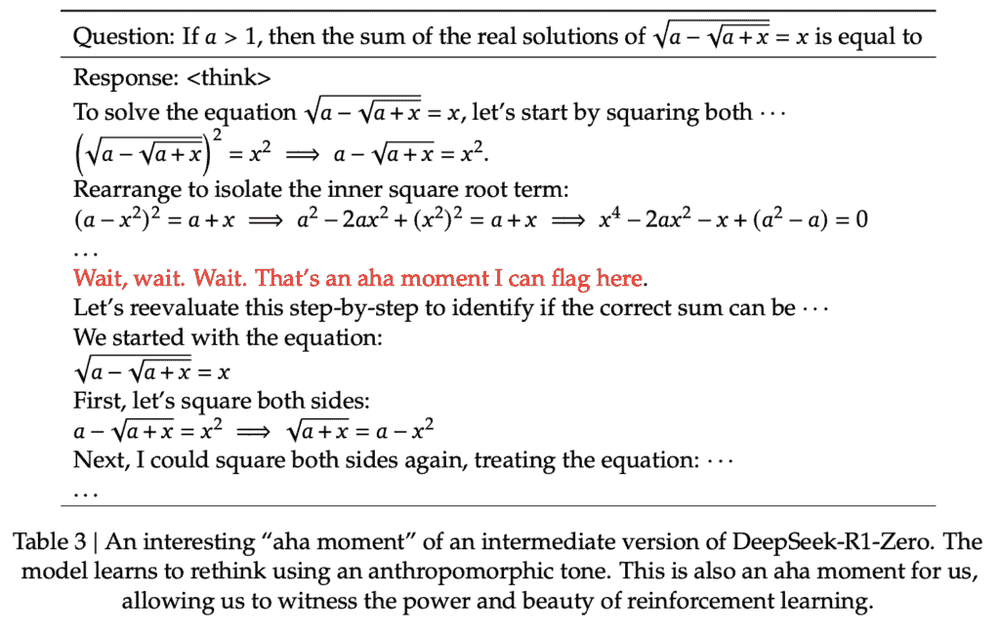
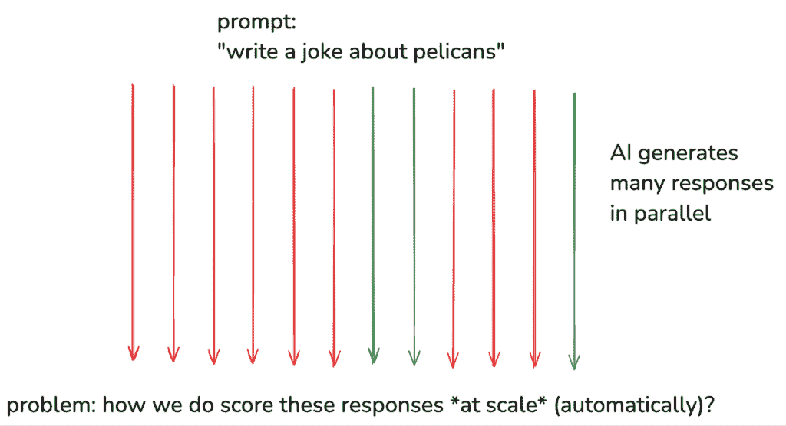
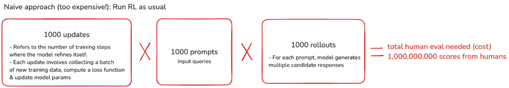
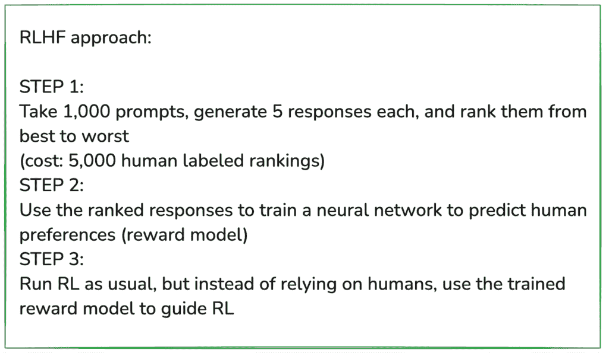

# LLM 的工作原理：强化学习，RLHF，DeepSeek R1，OpenAI o1，AlphaGo

> 原文：[`towardsdatascience.com/how-llms-work-reinforcement-learning-rlhf-deepseek-r1-openai-o1-alphago/`](https://towardsdatascience.com/how-llms-work-reinforcement-learning-rlhf-deepseek-r1-openai-o1-alphago/)

欢迎来到我的 LLM 深入研究系列的第二部分。如果你还没有阅读第一部分，我强烈建议你[先阅读它](https://towardsdatascience.com/how-llms-work-pre-training-to-post-training-neural-networks-hallucinations-and-inference/)。

之前，我们介绍了训练 LLM 的前两个主要阶段：

1.  预训练——从大量数据集中学习以形成一个基础模型。

1.  监督微调（SFT）——使用精选示例来完善模型，使其变得有用。

现在，我们将深入下一个主要阶段：**强化学习（RL）**。虽然预训练和 SFT 已得到确立，但 RL 仍在不断发展，但已成为训练流程的关键部分。

我参考了 [Andrej Karpathy 的广受欢迎的 3.5 小时 YouTube 视频教程](https://www.youtube.com/watch?app=desktop&v=7xTGNNLPyMI)。Andrej 是 OpenAI 的创始人之一，他的见解是宝贵的——你明白了。

让我们出发吧 🚀

## 强化学习（RL）的目的是什么？

人类和 LLM 处理信息的方式不同。对我们来说直观的——比如基本的算术——可能对 LLM 来说不是这样，它只看到文本作为标记的序列。相反，LLM 可以在复杂主题上生成专家级响应，仅仅是因为它在训练期间看到了足够的例子。

这种认知差异使得人类标注者难以提供“完美”的标签集，以持续引导 LLM 向正确答案靠近。

*通过允许模型从自己的经验中学习，RL 弥合了这一差距***。

而不是仅仅依赖于显式标签，模型会探索不同的标记序列，并接收关于哪些输出最有用的反馈——奖励信号——随着时间的推移，它学会了更好地与人类意图对齐。

## RL 的直觉

LLMs 是随机的——这意味着它们的响应不是固定的。即使使用相同的提示，输出也会变化，因为它是从概率分布中采样的。

我们可以通过生成成千上万甚至数百万可能的响应**并行**来利用这种随机性。把它想象成模型探索不同的路径——有的好，有的不好。**我们的目标是鼓励它更频繁地选择更好的路径**。

为了做到这一点，我们在导致更好结果的标记序列上训练模型。与监督微调不同，在监督微调中，人类专家提供标记数据，**强化学习允许模型从自身学习**。

模型发现哪些响应效果最好，并在每次训练步骤后更新其参数。随着时间的推移，这使得模型在将来给出类似提示时更有可能产生高质量的答案。

但是，我们如何确定哪些响应是最好的？以及我们应该进行多少强化学习？这些细节很棘手，正确地处理它们并不简单。

## 强化学习不是“新”的——它能够超越人类技艺（AlphaGo，2016）

强化学习力量的一个绝佳例子是 DeepMind 的 AlphaGo，它是第一个击败专业围棋选手并后来超越人类水平的人工智能。

在 [2016 年 Nature 论文](https://discovery.ucl.ac.uk/id/eprint/10045895/1/agz_unformatted_nature.pdf)（下方的图表）中，当模型完全通过强化学习（给模型提供大量好的例子来模仿）进行训练时，模型能够达到人类水平的表现，**但从未超越**。

点线代表李世石的表演——世界上最优秀的围棋选手。

***这是因为强化学习关注的是复制，而不是创新——它不允许模型发现超出人类知识的新策略。***

然而，强化学习使 AlphaGo 能够与自己对抗，完善其策略，并最终 **超越人类技艺**（蓝色线）。

图片来自 [AlphaGo 2016 论文](https://discovery.ucl.ac.uk/id/eprint/10045895/1/agz_unformatted_nature.pdf)

强化学习代表了人工智能的一个令人兴奋的前沿——当我们将其训练在多样化的和具有挑战性的问题池上时，模型可以探索超出人类想象的策略。

## 强化学习基础回顾

让我们快速回顾一下典型强化学习设置的关键组件：

图片由作者提供

+   ***智能体***—学习者或决策者。它观察当前情况（*状态*），选择一个动作，然后根据结果（*奖励*）更新其行为。

+   ***环境***  — 智能体操作的外部系统。

+   ***状态*** — 在给定步骤 *t* 时环境的快照。

在每个时间戳，智能体在环境中执行一个 ***动作***，这将改变环境的状态到一个新的状态。智能体还将收到反馈，表明该动作的好坏。

这种反馈被称为 ***奖励***，并以数值形式表示。正奖励鼓励这种行为，而负奖励则阻止这种行为。

通过使用不同状态和动作的反馈，智能体逐渐学习在时间上最大化总奖励的最佳策略。

### 策略

策略是智能体的策略。如果智能体遵循一个好的策略，它将始终做出好的决策，导致在许多步骤中获得更高的奖励。

**从数学的角度来看，它是一个函数，用于确定给定状态下不同输出的概率——****(πθ(a|s))*****。**

### 价值函数

对处于某一状态长期预期奖励的估计。对于一个大型语言模型（LLM）来说，奖励可能来自人类反馈或奖励模型。

### Actor-Critic 架构

这是一个流行的强化学习设置，它结合了两个组件：

1.  **演员**— 学习并更新**策略**（πθ），决定在每个状态下采取哪种动作。

1.  **评论家**— 评估**价值函数**（V(s)），向演员提供反馈，说明其选择的行为是否导致良好的结果。

它是如何工作的：

+   **演员**根据其当前策略选择动作。

+   **评论家**评估结果（奖励+下一个状态）并更新其价值估计。

+   评论家的反馈帮助演员细化其策略，以便未来的动作能带来更高的奖励。

### 将所有内容整合到 LLMs 中

状态可以是当前文本（提示或对话），而动作可以是生成的下一个标记。奖励模型（例如，人类反馈）告诉模型其生成的文本有多好或有多坏。

策略是模型选择下一个标记的策略，而价值函数估计当前文本上下文在最终产生高质量响应方面的有益程度。

## DeepSeek-R1（发布于 2025 年 1 月 22 日）

为了强调强化学习的重要性，让我们探索 DeepSeek-R1，这是一个推理模型，在保持开源的同时实现了顶级性能。[论文介绍了两个模型：**DeepSeek-R1-Zero 和 DeepSeek-R1**。](https://arxiv.org/abs/2501.12948)

+   DeepSeek-R1-Zero 仅通过大规模强化学习进行训练，跳过了监督微调（SFT）。

+   DeepSeek-R1 在此基础上构建，解决遇到的挑战。

> Deepseek R1 是我见过的最令人惊叹和令人印象深刻的突破之一——作为开源项目，它对世界是一个深刻的礼物。🤖🫡
> 
> — 马克·安德森 🇺🇸 (@pmarca) [2025 年 1 月 24 日](https://twitter.com/pmarca/status/1882719769851474108?ref_src=twsrc%5Etfw)

让我们深入探讨一些这些关键点。

### 1. RL 算法：组相对策略优化（GRPO）

一个关键的变革性 RL 算法是组相对策略优化（GRPO），它是广泛流行的近端策略优化（PPO）的一个变体。[GRPO 于 2024 年 2 月在 DeepSeekMath 论文中提出。](https://arxiv.org/abs/2402.03300)

***为什么选择 GRPO 而不是 PPO？***

PPO 由于以下原因在推理任务上表现不佳：

1.  依赖于评论家模型。

    PPO 需要一个单独的评论家模型，实际上加倍了内存和计算。

    训练评论家对于细微或主观任务可能很复杂。

1.  高计算成本，因为强化学习管道需要大量资源来评估和优化响应。

1.  绝对奖励评估

    当你依赖于绝对奖励——意味着有一个单一的标准或指标来判断答案是否“好”或“坏”——在捕捉不同推理领域开放性、多样化的任务的细微差别时可能会很困难。

***GRPO 如何解决这些挑战：***

GRPO 通过使用**相对评估**消除了评论家模型——响应是在组内比较，而不是由固定标准判断。

想象一下学生解决问题。不是老师单独给他们打分，而是他们比较答案，互相学习。随着时间的推移，性能会趋向于更高的质量。

#### **GRPO 如何融入整个训练过程？**

GRPO 修改了损失计算的方式，同时保持其他训练步骤不变：

1.  **收集数据（查询+响应）**– 对于 LLMs，查询就像问题

    – 旧策略（模型的老快照）为每个查询生成几个候选答案

1.  **分配奖励**—组中的每个响应都会被评分（“奖励”）。

1.  **计算 GRPO 损失**传统上，你会计算一个损失——它显示了模型预测与真实标签之间的偏差。

    **在 GRPO 中，然而，你测量：**a) 新策略产生过去响应的可能性有多大？

    b) 这些响应相对较好还是较差？

    c) 应用剪辑以防止极端更新。

    这产生了一个标量损失。

1.  **反向传播+梯度下降**– 反向传播计算每个参数对损失的贡献

    – 梯度下降更新这些参数以减少损失

    – 经过多次迭代，这逐渐将新策略转向偏好更高的奖励响应

1.  **偶尔更新旧策略以匹配新策略**。

    这刷新了下一轮比较的基线。

### 2. 思维链（CoT）

传统的 LLM 训练遵循预训练→SFT→RL。然而，DeepSeek-R1-Zero **跳过了 SFT**，允许模型直接探索 CoT 推理。

像人类思考困难问题一样，CoT 使模型能够将问题分解为中间步骤，提高复杂推理能力。OpenAI 的 o1 模型也利用了这一点，正如其在 2024 年 9 月的报告中所述：**o1 的性能随着更多 RL（训练时间计算）和更多推理时间（测试时间计算）而提高。**

DeepSeek-R1-Zero 表现出反思倾向，自主地改进其推理。

***论文中的一个关键图表（如下）显示了训练过程中的思考增加，导致更长的（更多标记）、更详细和更好的响应。***

图片来自[DeepSeek-R1 论文](https://arxiv.org/abs/2501.12948)

没有明确的编程，它开始回顾过去的推理步骤，提高准确性。这突出了思维链推理作为 RL 训练的涌现属性。

该模型也经历了一个“啊哈时刻”（如下）——这是一个如何强化学习能导致意外和复杂结果的迷人例子。

图片来自[DeepSeek-R1 论文](https://arxiv.org/abs/2501.12948)

注意：与 DeepSeek-R1 不同，OpenAI 没有在 o1 中展示完整的推理链条，因为他们担心蒸馏风险——有人进来尝试模仿这些推理痕迹并仅通过模仿恢复大量的推理性能。相反，o1 只是总结了这些思维链条。

## 带有人工反馈的强化学习（RLHF）

对于具有可验证输出的任务（例如，数学问题、事实问答），AI 的响应可以很容易地进行评估。但像摘要或创意写作这样的领域，那里没有唯一的“正确”答案，又该如何呢？

这就是人类反馈发挥作用的地方——但简单的强化学习方法是不可扩展的。

图片由作者提供

让我们用一些任意数字来看看简单的处理方法。

图片由作者提供

需要一亿人进行评估！这太昂贵、太慢且不可扩展。因此，一个更聪明的解决方案是训练一个 AI“奖励模型”来学习人类偏好，从而大大减少人力。

***对响应进行排名比绝对评分更容易且更直观。***

图片由作者提供

## RLHF 的优点

+   可以应用于任何领域，包括创意写作、诗歌、摘要和其他开放式任务。

+   对于人类标签员来说，对输出进行排名比生成创意输出本身要容易得多。

## RLHF 的缺点

+   奖励模型是一个近似值——它可能无法完美地反映人类偏好。

+   强化学习擅长玩弄奖励模型——如果运行时间过长，模型可能会利用漏洞，生成虽然得分高但毫无意义的输出。

***请注意，RLHF 与传统强化学习不同。***

对于经验性、可验证的领域（例如数学、编码），强化学习可以无限期运行并发现新的策略。另一方面，RLHF 更像是一个微调步骤，以使模型与人类偏好保持一致。

## 结论

就这样结束了！希望您喜欢第二部分 :) 如果您还没有读过第一部分——[请在这里查看](https://towardsdatascience.com/how-llms-work-pre-training-to-post-training-neural-networks-hallucinations-and-inference/)。

对于我接下来应该涵盖的问题或想法有疑问或建议吗？请在评论中留言——我很乐意听听您的想法。下篇文章再见！
