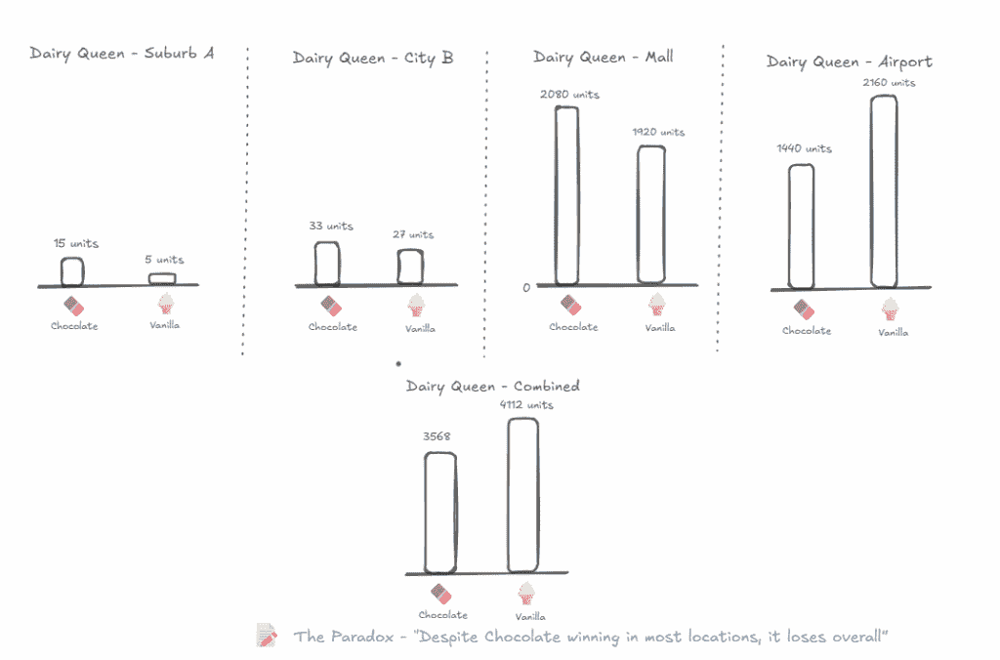
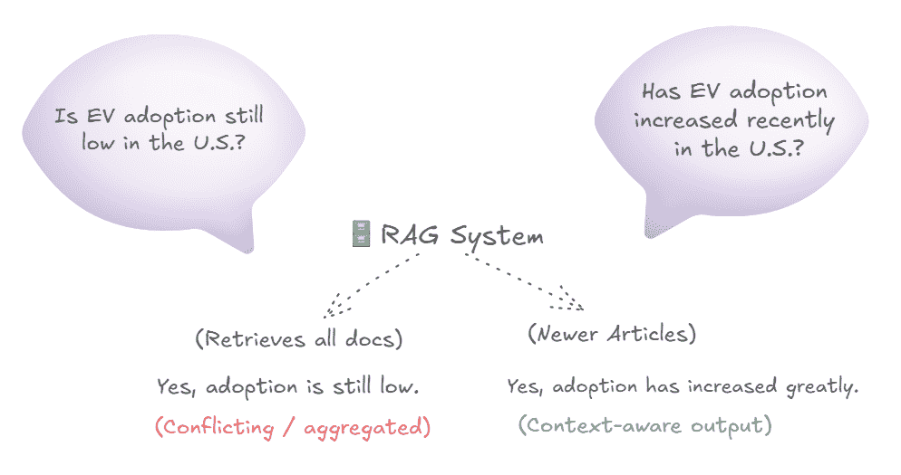
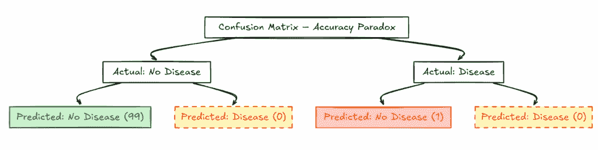
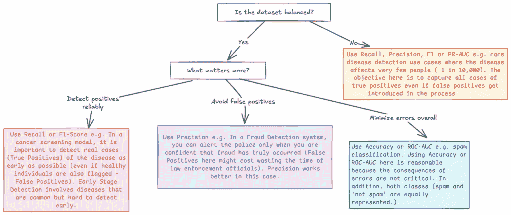
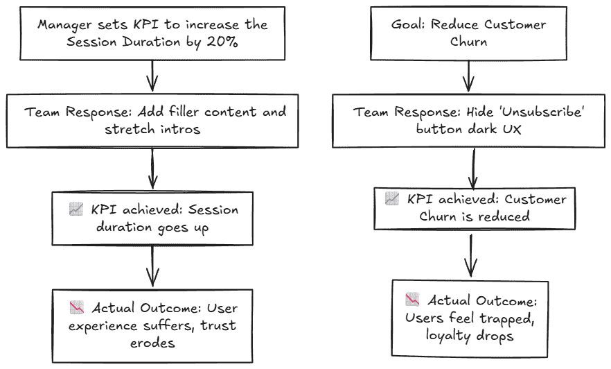
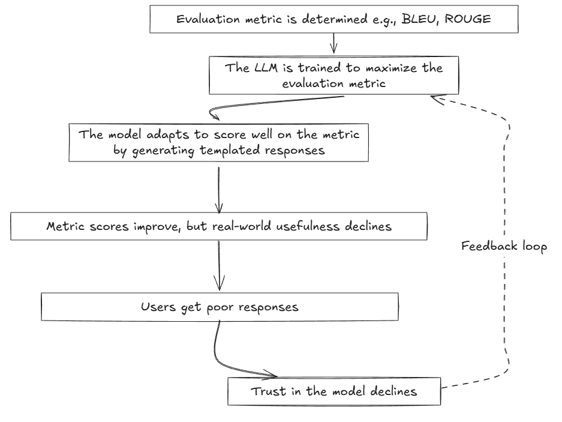

# 指标（以及 LLMs）如何欺骗你：悖论指南

> 原文：[`towardsdatascience.com/how-metrics-and-llms-can-trick-you-a-field-guide-to-paradoxes/`](https://towardsdatascience.com/how-metrics-and-llms-can-trick-you-a-field-guide-to-paradoxes/)

## 概述

<mdspan datatext="el1752601668525" class="mdspan-comment">悖论不仅仅是视觉错觉或令人费解的谜题。</mdspan>它们也可以是逻辑上的，导致在更深入的观察中，最初的观察结果会崩溃。在数据科学中，当我们只看数字，而不去了解它们背后的背景时，就会出现悖论。即使有最锐利的视觉，也可能带着错误的故事离开。

在这篇文章中，我们讨论了三个逻辑悖论，这些悖论对于那些快速解读数据而不应用背景的人来说是警示性的。我们探讨了悖论如何在数据科学和商业智能（BI）用例中出现，然后将这些见解扩展到检索增强生成（RAG）系统，在这些系统中，类似的悖论可能会损害提供的提示和模型输出的质量。

## 商业智能中的辛普森悖论

辛普森悖论描述了当数据聚合时趋势会逆转的情况。换句话说，当你合并数字并分析它们时，你在子组中观察到的趋势会被翻转。让我们假设我们正在分析一家流行冰淇淋连锁店的四个位置的销售额。当每个位置的销售额单独分析时，它表明巧克力口味是顾客最偏好的。但当销售额加总时，这种趋势消失了，新的合并结果表明香草最受欢迎。这种趋势逆转被称为辛普森悖论。我们使用以下虚构数据来演示这一点。

| **位置** | **巧克力** | **香草** | **总客户数** | **巧克力百分比** | **香草百分比** | **获胜者** |
| --- | --- | --- | --- | --- | --- | --- |
| 郊区 A | 15 | 5 | 20 | 75.0% | 25.0% | 巧克力 |
| 城市 B | 33 | 27 | 60 | 55.0% | 45.0% | 巧克力 |
| 购物中心 | 2080 | 1920 | 4000 | 52.0% | 48.0% | 巧克力 |
| 机场 | 1440 | 2160 | 3600 | 40.0% | 60.0% | 香草 |
| **总计** | **3568** | **4112** | **7680** | **46.5%** | **53.5%** | **香草**！ |

一家虚构冰淇淋连锁店的门店销售位置

下面是一个视觉说明。

商业智能报告中的辛普森悖论说明（图像由作者提供）

忽视这些子群体动态的数据分析师可能会假设巧克力表现不佳。因此，按子群体汇总数据并检查辛普森悖论的存在是至关重要的。当趋势发生逆转时，应将隐藏变量识别为下一步。隐藏变量是影响群体结果隐藏的因素。在这种情况下，商店位置恰好是隐藏变量。需要深入理解上下文来解释为什么在机场香草冰淇淋的销量很高，从而翻转了整体结果。可以用来调查的问题包括：

• 机场商店的巧克力选项是否较少？

• 旅客是否更喜欢口味较淡的？

• 机场商店是否有促销活动偏向香草？

## RAG 系统中辛普森悖论

假设你有一个 RAG（检索增强生成）模型，该模型衡量公众对电动汽车（EV）的看法，并回答相关问题。该模型使用 2010 年至 2024 年的新闻文章。直到 2016 年，由于续航里程有限、购买价格较高和缺乏充电站，电动汽车受到了混合的评价。所有这些因素使得在电动汽车中长途驾驶变得不可能。2017 年之前的报纸报道经常强调这些不足之处。但截至 2017 年，由于性能的改进和充电站的可用性，电动汽车开始被看作是积极的。特斯拉高端电动汽车的成功推出特别促进了这种看法的转变。一个使用 2010 年至 2024 年新闻报告的 RAG 模型可能会对类似问题给出矛盾的回答，这将触发辛普森悖论。

例如，如果 RAG 被问及，“美国电动汽车（EV）的采用率是否仍然很低？”，答案可能是“是的，由于购买成本高和基础设施有限，采用率仍然很低”。如果 RAG 被问及，“美国电动汽车的采用率最近是否有所增加？”，答案将是“是的，由于技术和充电基础设施的进步，采用率大幅增加”。在这种情况下，隐藏变量是发布日期。解决这个问题的一个实际方法是，在预处理阶段将文档（文章）标记到基于时间的分类中。其他选项包括鼓励用户在他们的提示中指定时间范围（例如，在过去五年中，电动汽车的采用情况如何？）或者微调 LLM 以明确指出它考虑的响应时间线（例如，大约在 2024 年，电动汽车的采用率大幅增加）。

RAG 系统中辛普森悖论（图片由作者提供）

## 数据科学问题中的准确性悖论

准确性悖论的实质是高准确率并不代表有用的输出。假设你正在构建一个分类模型，用于识别是否有一个患者患有仅影响 100 人中的 1 人的罕见疾病。该模型正确地识别并标记了没有疾病的人，从而实现了 99%的准确率。然而，它未能识别出那个患有疾病且需要紧急医疗关注的人。因此，该模型在检测疾病方面变得无用，而这正是它的目的。这种情况在观察数据极不平衡的数据集中尤为明显。这已在下面的图中得到说明。

数据科学问题中的准确性悖论（作者图片）

解决准确性悖论的最佳方式是使用能够捕捉少数类性能的指标，如精确率、召回率和 F1 分数。另一种可行的方法是将不平衡数据集视为异常检测问题，而不是分类问题。还可以考虑收集更多少数类数据（如果可能的话），对少数类进行过采样，或对多数类进行欠采样。以下是一个快速指南，根据使用案例、目标和错误后果确定使用哪个指标。

为你的模型性能测量选择正确的指标（作者图片）

## LLMs 中的准确性悖论

虽然准确性悖论是许多数据科学家面临的常见问题，但在 LLMs 中的影响却被很大程度上忽视了。在涉及安全、毒性检测和偏见缓解的使用案例中，准确性指标可能会危险地过度承诺。高准确率并不意味着模型是公平且安全使用的。例如，一个 98%准确率的 LLM 模型，如果它错误地将 2 个恶意提示分类为安全无害，那么它就毫无用处。因此，在 LLMs 评估中，使用召回率、精确率或 PR-AUC 而不是准确率是一个好主意，因为它们表明模型如何处理少数类。

## 商业智能中的 Goodhart 定律

经济学家查尔斯·古德哈特指出：“当一项指标成为目标时，它就不再是一个好的指标。”这条定律是一个温和的提醒，如果你在不理解其影响和背景的情况下过度优化一个指标，模型可能会适得其反。

一个虚构的在线新闻机构的经理为他团队设定了一个 KPI。他要求团队努力将会话时长增加 20%。团队通过人工延长介绍和添加填充内容来增加会话时长。会话时长确实上升了，但视频质量却丧失了，结果用户从视频中获得的值减少了。

另一个例子与客户流失相关。为了减少客户流失，一个基于订阅的娱乐应用决定将其“取消订阅”按钮放置在其网站门户的一个难以找到的位置。结果，客户流失减少了，但这并不是由于客户满意度的提高。这仅仅是因为有限的退出选项——一种客户保留的错觉。下面是一个视觉插图，展示了努力达到或超过增长目标（如增加会话时长或用户参与度）通常会导致意想不到的后果，导致用户体验下降。当团队诉诸于人为的通货膨胀策略来帮助提高性能指标时，指标改善在纸上看起来很好，但在任何意义上都没有意义。

古德哈特定律 - 示例（图片由作者提供）

## LLM 中的古德哈特定律

当你在特定数据集（尤其是基准数据集）上过度训练 LLM 时，它可能会开始记住训练数据中的模式，而不是学习泛化。这是一个经典的过拟合例子，其中模型在训练数据上表现极好，但在现实世界输入上表现不佳。

假设你正在训练一个用于总结新闻文章的 LLM（大型语言模型）。你使用 ROUGE（Recall-Oriented Understudy for Gisting Evaluation）指标来评估 LLM 的性能。ROUGE 指标奖励与参考摘要中精确或近似精确匹配的 n-gram。随着时间的推移，LLM 开始从输入文章中复制大量文本短语，以获得更高的 ROUGE 分数。它还使用了参考摘要中经常出现的热门词汇。假设输入文章中的文本是“银行提高利率以抑制通货膨胀，这导致股价急剧下跌。”过拟合的模型会总结为“银行提高利率以抑制通货膨胀”，而一个泛化模型会总结为“利率上涨引发了股市的下跌”。下面的插图展示了过度优化模型以适应评估指标可能导致低质量响应（在纸上看起来很好，但在实际中无助于解决问题）的情况。

LLM 中的古德哈特定律（图片由作者提供）

## 结论性评论

不论是在商业智能还是 LLM 中，如果处理数字和指标时没有考虑到其背后的细微差别和上下文，悖论可能会出现。此外，重要的是要记住，过拟合可能会损害整体情况。将定量分析与人类洞察力相结合对于避免此类陷阱并创建可靠的报告和真正带来价值的强大 LLM 至关重要。
