# 大多数组织如何错误地制定数据策略——以及如何纠正

> 原文：[`towardsdatascience.com/how-most-organizations-get-data-strategy-wrong-and-how-to-fix-it-b8afa59f1533/`](https://towardsdatascience.com/how-most-organizations-get-data-strategy-wrong-and-how-to-fix-it-b8afa59f1533/)

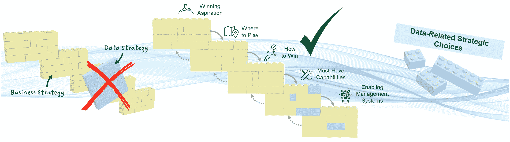

Wave by CLEANPNG.

### [揭秘数据策略](https://contributor.insightmediagroup.io/tagged/demystify-data-strategy)

*从数据、分析和人工智能中释放商业价值是一个热门话题。然而，大多数组织都难以货币化现有数据或创造新的数据来推进他们的思考。我断言，在大多数情况下，这种斗争源于缺乏有效的商业策略设计。*

*这是[揭秘数据策略系列](https://contributor.insightmediagroup.io/tagged/demystify-data-strategy)的第三部分——组织似乎需要成为数据驱动型并在当今数字化世界中保持竞争力。这份文件作为数据策略的剧本，通过解决误解、阐明定义、提出可操作的框架，并通过详细的例子来说明概念。*

*[*我是 Jens*](https://jens-linden.de/)*，一位具有近二十年实施数据和人工智能用例经验的企业数据专家。我帮助各行业的领导者设计策略，培养能够释放数据和算法全部潜力的文化。

* * *

## tl;dr

+   数据策略不是商业策略的独立补充，也不是构建数据能力的计划。它实际上是数据功能的策略，为内部数据客户提供服务。

+   数据策略*并不*定义组织如何利用数据、分析和人工智能创造价值。这是业务策略的工作，与数据相关的战略选择是一个整体部分。

+   关于数据策略的误解，加上薄弱的商业策略设计，阻碍了组织有效地利用数据。这些问题阻碍了他们获得竞争优势的能力。

+   玩赢框架帮助组织在两个方面取得进展：将数据创新融入其商业策略，并设计有效的数据策略。

* * *

## 目录

* * *

**1 数据策略的模糊认识**

1.1 数据可以在整个组织中创造效益

1.2 组织在成为数据驱动型方面遇到困难

1.3 数据策略的承诺

**2 数据策略的误解**

2.1 误解 #1：构建数据和人工智能能力的计划

2.2 误解 #2：数据管理的方法和指南

2.3 误解 #3：商业策略的补充

2.4 前路在何方？

**3 策略**

3.1 玩赢策略框架

3.2 策略实际上是什么

3.3 计划与战略：典型的误解

3.4 战略选择结构化过程

3.5 组织需要哪些战略

3.6 强化杆

3.7 组织不需要哪些战略

3.8 战略设计团队

3.9 总结战略基础

**4 数据战略定义与设计**

4.1 定义数据战略

4.2 数据战略选择级联

4.3 数据战略设计流程

4.4 步骤 I：识别数据与人工智能需求

4.5 步骤 II：收集挑战

4.6 步骤 IV：运营能力和系统

4.7 步骤 V：成熟度评估

4.8 步骤 VI：规划

**5 整合业务战略与数据**

5.1 数据选择作为您的业务战略的一部分

5.2 作为业务战略一部分的数据用于问题表述和可能性生成

5.3 作为测试一部分的数据用例验证

5.4 关于业务战略与数据的结语

**6 实践案例**

6.1 步骤 I：识别数据与人工智能需求

6.2 步骤 II：收集挑战

6.3 步骤 III：设计数据战略

6.4 步骤 IV-VI：激活战略

**7 结论**

参考文献**

## 1 数据战略的模糊之处

数据、分析和人工智能（AI）在商业中不是新现象，但在过去几十年中变得越来越相关。

由于生成式人工智能在生成文本或图像等输出方面的近期显著进步，目前对其存在大量的兴奋。当我提到人工智能时，我并不只是指生成式人工智能，而是指从数据中生成价值的更广泛工具集。这些工具包括商业智能、机器学习或数据科学，而且绝非新鲜事物。它们已经存在很多年了。

持续的兴趣从何而来？

### 1.1 数据可以在整个组织中创造效益

虽然数据曾经主要与会计和控制团队相关，但现在它在整个组织中通常是成功的关键：

+   市场营销部门利用历史营销活动数据来识别推动成功的因素，从而实现更有效的营销支出分配。

+   采购部门利用数据和数据分析来分析供应商绩效，以最大限度地减少中断并最大化成本节约。

+   销售部门利用历史数据推荐最佳的销售点投资组合，从而增加收入。

+   客户服务中心利用数据预测客户流失，从而采取主动措施降低流失率并推动可持续的收入增长。

+   生产部门利用物联网数据防止机器故障，降低维修成本并最小化生产停机时间。

+   产品开发团队通过数字应用丰富现有产品和服务，例如向客户提供增值见解，增加客户忠诚度，并确保竞争优势。

许多组织已经成功地从基于此类分析数据用例的数据中获得了价值。但数据和人工智能可以做更多的事情。

数据和人工智能提供了质疑公司现状和整个行业现状的手段。它们允许组织通过询问有关客户、技术、竞争对手和行业的问题来获得知识优势，从而提供了一种获得和维持竞争优势的手段。这是将数据洞察与人类创造力相结合，积极设计未来的问题[[1a](https://rogermartin.medium.com/what-strategy-questions-are-you-asking-587d3[2](https://www.vahlen.de/wernicke-data-inspired/product/35418267)239a48)，2]。

考虑到巨大的潜在利益，越来越多的组织都渴望将数据作为*战略资产*来利用。公司努力成为数据驱动——或者更确切地说*数据启发*[2]，这意味着他们旨在：

+   持续利用现有数据的潜力，以优化其业务

+   将数据和数据分析作为其业务创新的组成部分，快速测试新的创意想法，这推动了他们的思考并增加了竞争力

那么，问题出在哪里呢？

### 1.2 组织在成为数据驱动方面遇到挑战

尽管前景广阔，许多组织仍然在利用数据、分析和人工智能的益处方面遇到困难。在技术、算法和方法已经存在数十年的情况下，这是怎么可能的呢？

**成为数据驱动可能是一项复杂的任务**

组织往往低估了成为数据驱动的复杂性，尤其是在缺乏战略清晰度和数据素养阻碍进步的情况下。

当组织开始利用数据作为资产的努力时，许多事情都可能出错。这*并不是*关于购买一些即插即用的技术解决方案，正如许多供应商所承诺的那样。

成为数据驱动通常被称为[数据驱动业务转型[3]](https://carruthersandjackson.com/thought-leadership-our-books/)。之所以称之为转型，是有充分理由的，因为它通常涉及影响整个企业的变化。

例如，需要从各种来源获取和整合数据，以便将其提供给业务。数据整合需要公司范围内的协调和管理。没有这些，每个数据消费者都不得不重复繁琐且容易出错的数据准备工作，最终导致“数据荒野”，在那里报告了不同的真相，宝贵的资源被浪费。

**利用数据和人工智能是企业的责任**

数据的实际价值生成主要发生在业务单元和职能中，即市场营销、采购、销售或制造。

许多人认为，成为数据驱动仅仅是 IT 和数据分析方面的技术专长问题，而忽略了它所要求的文化和组织变革。但这是一种谬误。

商业用户需要自己成为数据素养的。他们需要拥抱一种*文化*，创新、识别和开发与他们的领域决策相关的数据用例。他们需要能够使用数据来发现新的见解，激发新的问题，并激发创新思想，以创造竞争优势。

> 组织需要文化和技术能力才能成为数据驱动型，但它们在识别、构建和维护这些能力方面面临挑战。

最后，利用数据是一个团队的努力，需要跨学科的利益相关者和思维方式。

**数据、分析和人工智能并非万能的良药**

目前数据、分析和人工智能被过度炒作，人们似乎忘记了每个算法的基础是数学。然而，每个统计算法都有其背后的假设和固有的局限性。仅依靠数据做出决策，就像完全不使用数据做出决策一样糟糕。

著名的引言“*[预测是困难的，尤其是在处理未来时](https://quoteinvestigator.com/2013/10/20/no-predict/)*”，这句话源自丹麦政治家卡尔·克里斯蒂安 [[4](https://quoteinvestigator.com/2013/10/20/no-predict/)]，暗示了在应用任何预测时都需要谨慎：基于历史数据做出预测的一个基本假设是，生成数据的底层系统在未来不会发生根本性的变化。这个假设往往会被违反，一个值得信赖的数据专业人士在应用复杂的算法之前必须仔细检查这一点。

数据、分析和人工智能被过度炒作的事实可能是个问题，因为利益相关者可能会有不切实际的期望。这需要通过在组织中建立数据素养和文化，培养一种共同语言和理解，从而引导出现实期望来解决。

以一个特定的领域为例，分析需要谨慎对待的是战略设计过程，因为创新战略的目标通常是独特地塑造未来，对市场产生影响。如果这样的战略成功，基于过去样本数据的销售预测可能不具有代表性，并且从中得出有意义的结论毫无价值 [[1a](https://rogermartin.medium.com/what-strategy-questions-are-you-asking-587d32239a48), [1b](https://miro.com/app/board/uXjVL4NmYKw=/?moveToWidget=3458764610667414141&cot=14)]。

**缺乏商业战略是数据与人工智能频繁失败的根本原因**

正如我在[第二篇文章 [5]](https://medium.com/towards-data-science/the-root-cause-of-why-organizations-fail-with-data-ai-0095a73cf5ab)中提出的，在[揭秘数据策略系列文章](https://contributor.insightmediagroup.io/tagged/demystify-data-strategy)中，我相信，组织在管理和利用数据作为资产方面遇到的大多数问题都源于缺乏战略基础。我所说的战略基础，并不是通常使用的（错误）概念——正如我们下面将要讨论的——，而是一种真正的战略设计工作，它自然地将与数据相关的战略选择整合到商业策略中。

因此，本文将这一想法扩展为一个现成的框架，利用了著名的“为了胜利而玩”策略框架的工具。

但首先，让我们更深入地了解一下数据策略的承诺及其周围的误解。

### 1.3 数据策略的承诺

在过去几十年中，随着 BI 和数据分析的应用增长，组织在管理数据管理和分析解决方案的创建和扩展的复杂性方面越来越感到困难。需要更结构化的方法，而“数据策略”就是解决这些问题的所谓良方。

为了撰写这篇文章，我试图找到“数据策略”一词的起源。使用 Google 图书搜索，我找到了 1981 年出版的书籍[《分布式数据处理的设计与策略》[6]](https://www.google.de/books/edition/Design_and_Strategy_for_Distributed_Data/RPKh4FzKNUgC?hl=de&gbpv=0&bsq=%22data%20strategy%22)。

因此，术语“数据策略”并非新事物，但自 2010 年以来，其关注度不断增加，正如[Google Trends [6]](https://trends.google.de/trends/explore?date=all&q=%22data%20strategy%22&hl=en)搜索结果显示的那样，这与我在这一时期作为数据专业人士的个人经验相符。

![图 1：从 Google Trends [6]中获取的“数据策略”术语的相关兴趣](../Images/b41e44e37a12113d188f3ccab4f214f4.png)

图 1：从 Google Trends [6]中获取的“数据策略”术语的相关兴趣。

策略通常被认为是一种聪明的做法，可以管理复杂性，而数据策略的承诺在于解决组织在利用数据、分析和人工智能方面面临的挑战。

然而，有一个问题：尽管其知名度不断增长，“数据策略”仍然定义不清，并且通常被误解，导致沟通不畅、项目不协调和期望未达成。

要理解为什么组织在数据策略上持续遇到困难，我们首先必须解决围绕这一术语的误解。

* * *

## 2 数据策略的误解

作为数据专业人士和管理顾问，我了解到清晰的沟通对于成功至关重要。清晰的沟通从共同的语言开始，这正是数据战略问题所在：对于它实际意味着什么或应该是什么，没有共识。数据专业人士以及商业专家在不同的语境中使用它，而其含义却不同。

> 目前对于“数据战略”真正包含的内容还没有普遍的共识。

此外，最常用的数据战略定义与已建立的策略定义不相兼容。在我看来，这造成了严重的问题，因为它阻碍了数据专业人士与高管和商业利益相关者的目标导向讨论，因此成为组织解决数据挑战的障碍，阻止组织成为数据驱动型组织。

> 对于数据战略缺乏共同的理解阻碍了业务和数据专业人士之间的目标导向讨论，因此成为组织利用数据作为资产的一个障碍。

这种缺乏共识导致了关于数据战略的广泛误解。

虽然许多关于数据战略的出版物故意或无意地避免明确定义该术语——假设读者已经知道它应该意味着什么——但当提供定义时，它们通常揭示了误解。让我们探讨我认为最常见的三种误解。

### 2.1 错误观念 #1：构建数据和人工智能能力的计划

计划侧重于执行和时间表，而策略则侧重于在不确定性下做出有意的选择。混淆两者会导致混乱和低效。

“玩好赢”策略框架非常清楚地阐述了[计划和策略之间的区别 [8]](https://www.youtube.com/watch?v=iuYlGRnC7J8)，正如我们将在第 3.3 节中详细看到的那样。然而，当我谷歌“*数据战略*”这个术语时，第一页的结果中（跳过广告）有几个将其定义为计划或路线图。以下是一些例子：

1.  “*数据战略是一个长期计划，它定义了管理组织信息资产所需的技术、流程、人员和规则。*” [[9](https://aws.amazon.com/what-is/data-strategy/)]

1.  “*数据战略是一个精心设计的计划，旨在提高公司范围内数据管理的有效性。*” [[10](https://www.sap.com/resources/what-is-data-strategy)]

从本质上讲，属于这一类别的数据战略定义，是关于构建数据、分析和/或人工智能能力计划的。这些组织能力包括数据架构、数据治理、数据管理、BI、数据科学和数据文化等其他元素。

![图 2：组织利用数据作为资产所需的数据和人工智能能力典型列表。(../Images/548fc681f2556107d2821292f87b200b.png)]

图 2：组织利用数据作为资产所需的数据和人工智能能力典型列表。

将数据策略定义为建设数据能力的计划反映了人们对策略真正含义的普遍误解。策略首先应该定义组织真正需要的数据相关能力。

> 建设数据、分析和人工智能能力的计划不是你的策略，而是你策略工作的成果。

制定这样的计划本身就是一项具有挑战性的任务，其设计对于将数据作为公司资产利用是绝对必要的。因此，这是一项值得投资的时间，并且需要广泛跨学科领域的扎实能力。我只想简单地说，不要称之为数据策略，因为它就是它本身：一个计划。

### 2.2 误解 #2：数据管理指南

另一种常见的定义将数据策略视为一种最佳实践指南，阐明数据是如何获取、存储、管理和利用的。

管理数据的方法是支持策略的必要运营工具，但与策略本身不同。将它们称为“策略”可能会掩盖深思熟虑的战略选择的重要性。

数据的获取、存储和管理是重要的话题，对于在任何一个组织中创建可扩展的数据管理基础至关重要。然而，方法和指南不应被称为策略。它们只是不同的事物。

### 2.3 误解 #3：作为业务策略的补充

我必须承认，在我职业生涯的早期，我也陷入了数据策略可以作为业务策略独立补充的误解。然而，数据策略永远不应独立存在，它应该定义数据如何创造商业价值。这本质上是业务策略本身的作用，我们将在第五部分中进一步探讨。

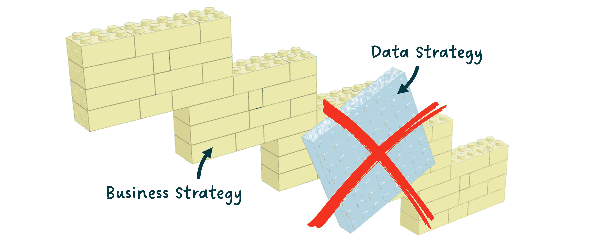

图 3：数据策略不应该是业务策略的补充。

我喜欢用乐高积木来可视化这一点：业务策略是一套相互连接的乐高积木的集成集合，而一个错误的数据策略则像是一个由臭名昭著的“*商业大亨*”用他可怕的“*克拉格勒*”胶水强行粘贴在顶部的独立实体 [[11](https://de.wikipedia.org/wiki/The_LEGO_Movie)]，抑制了创造力并阻碍了创新设计。

我所说的数据策略作为业务策略的补充是什么意思？当数据策略被定义为“*定义组织如何利用数据来实现其战略目标的东西*”时，这是一个误解 [[1c](https://rogermartin.medium.com/strategy-strategy-everywhere-83e9d8a2fce9)]。一个明确定义的策略是单一的 [1d](https://rogermartin.medium.com/strategy-is-singular-4876ac92a824)，每个不可分割的商业实体都有一个业务策略。业务策略的选择集形成一个和谐的整体。试图强加某种东西，比如通过利用数据和人工智能实现一种不同的获胜方式，根本不起作用。因此：

> 拥有一个补充数据战略，该战略通过说明你的组织如何使用数据、分析和人工智能来创造商业价值并获得竞争优势，这不是你的组织应该追求的目标。

相反，正如我在[《揭秘数据战略》系列文章的第二部分](https://medium.com/towards-data-science/the-root-cause-of-why-organizations-fail-with-data-ai-0095a73cf5ab)中论证的那样，你的商业战略应该阐明你的组织如何以及如何使用数据、分析和人工智能来获得战略竞争优势。一个定义良好的商业战略已经包括了数据如何创造价值 [[1c](https://rogermartin.medium.com/strategy-strategy-everywhere-83e9d8a2fce9)]。添加一个补充数据战略会分散注意力并削弱整合。

第五部分讨论了如何设计一个利用数据战略的商业模式。

### 2.4 前进的方向？

为了避免前两个关于数据战略的误解相对简单，因为这仅仅是达成一个共同语言。计划就是计划，指南就是指南，战略就是战略。这些都是不同的概念，数据和商业专业人士都必须在他们的沟通中认识到这一点。

但关于第三个误解，即不应该有数据补充战略的事实呢？

缺少的是数据战略的明确定义，这个定义既被数据专业人士理解，也被商业专业人士理解。

因此，为了解决这个误解，我们需要两件事：

1.  一个与常见商业战略定义相一致的数据战略的明确定义

1.  一个将数据相关选择整合到商业战略框架中的流程

本文的剩余部分将讨论这个问题。它提供了：

+   一个与商业环境中战略定义相兼容的数据战略定义

+   关于商业战略利用数据作为资产的明确性

+   一个实现数据驱动的所有必要战略工作的流程

建议框架的一个重要副作用将是其对数据领导力的积极影响，有助于培养数据文化和高管的数据素养。

本文的剩余部分结构如下：

+   **第三部分** 提供了著名的“为了赢而玩”战略框架的总结，这将成为成为数据驱动型所需的所有战略工作的基础。

+   **第四部分** 提出了一个数据战略的定义，该定义与“为了赢而玩”的战略框架相一致，并适合其中。它还提供了一个详细的端到端流程，用于执行组织成为数据驱动型所需的所有战略工作。

+   **第五节**阐明，仅按第四节的定义设计数据策略对于希望成为数据驱动型组织的机构来说是不够的。相反，你需要将数据相关的战略选择编织到你的商业策略中，从而将策略设计和数据用例的创新与发展相结合。

+   **第六节**详细介绍了为一家生产和销售薯片和坚果的咸味零食公司设计数据策略的实例。本节旨在为希望深入了解数据策略设计过程的读者提供信息。读者可以跳过本节而不影响文章的整体流程。

+   **第七节**提供了一些总结性评论。

* * *

## 3 策略

### 3.1 玩胜策略框架

《玩胜》（Playing to Win）是[罗杰·马丁[8]](https://rogerlmartin.com/)开发的策略框架，他是一位全球公认的商业思想家、首席执行官顾问、前 Monitor 顾问和罗特曼管理学院荣誉教授。

该框架在 20 世纪 80 年代和 90 年代开发和不断改进[[1e](https://medium.com/@rogermartin/the-origins-of-playing-to-win-1d63af815797)]，并在罗杰·马丁（Roger Martin）和 A. G. 拉夫利（A. G. Lafley）合著的[联合书籍[13]](https://rogerlmartin.com/lets-read/playing-to-win)中达到高潮，拉夫利曾是宝洁公司的前首席执行官。该书于 2013 年出版。

该框架成为宝洁公司的标准策略方法，并自那时以来在多个行业成功应用，确立了自己作为策略的广泛认可的方法。此外，《玩胜》框架通过一系列广泛的[策略实践者洞察[1](https://rogerlmartin.com/archive/medium-posts/-in-thought-pillars,strategy), [1f](https://medium.com/@rogermartin/playing-to-win-x-5-43fb814a89a6)]，由罗杰·马丁不断详细阐述。

尽管存在其他策略框架，我选择《玩胜》是因为它被广泛认为是有效策略设计的标准。此外，它还附带一个完整的生态系统，包括文献、流程、模板和培训等资源，可以用于设计任何类型的策略。

虽然《玩胜》为设计商业策略提供了一个稳健的框架，但它也提供了一种将数据相关选择整合到商业策略中的方法。这一点将在第五节中详细探讨。

那么，策略这个术语的明确定义又是什么呢？

### 3.2 什么是策略

**定义策略这个术语**

策略设计框架《玩胜》（Playing to Win）将策略定义为形成一种*合理的理论*的综合选择，使组织能够在竞争中获胜。

> “策略是一套综合的选择，使企业在行业中占据独特的位置，从而相对于竞争对手创造可持续的优势和优越的价值。” [13]

该框架强调“*赢得胜利*”，以突出策略的最终目标是竞争成功，而不仅仅是生存或参与市场。如果你只是为了玩而玩，你可能会冒至少一个竞争对手找到获胜方法的风险，最终将你的公司挤出市场。

**策略选择级联**

策略设计团队需要做出的选择可以分为五组，这五组共同构成了所谓的*策略选择级联*，这是“赢得游戏”策略框架的核心工具之一。

我喜欢用乐高积木来可视化级联：级联中的每个方框代表一组战略选择——每个选择由一个单独的乐高积木象征。每个方框内的选择相互关联，而方框本身也相互强化，形成一个整合且连贯的策略。

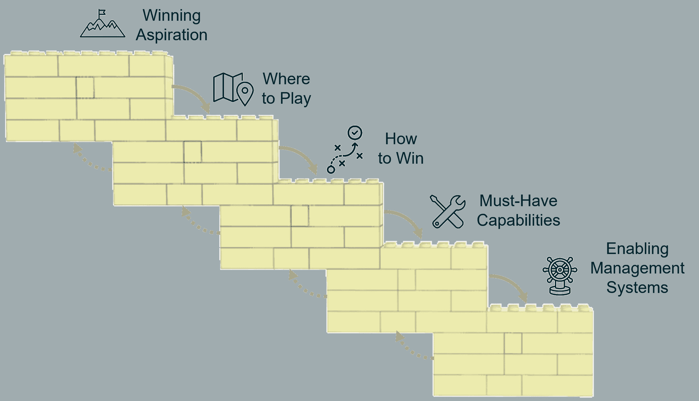

图 5：策略选择级联有助于在策略设计过程中结构化你需要回答的战略选择。将选择视为乐高积木。

级联表明，组织需要做出以下选择：

1.  组织赢得胜利的含义（*胜利渴望*）

1.  为哪些客户服务以及提供哪些产品（*在哪里竞争*）

1.  组织如何旨在通过这些客户在市场上获胜（*如何获胜*）

1.  它需要哪些关键活动和资源来实现这一点（*能力*），以及

1.  需要哪些系统、流程、规范、文化和指标来确保这些能力被构建和维护（管理系统）

这些选择不是为了形成一个松散耦合的列表，而需要很好地整合，以达到一个引人入胜的整体。这就是你的策略。

**显式策略与隐式策略**

如果你仔细想想，每个组织都会以明确和有意识的形式制定策略，或者通过其行动隐性地做出这五个选择。例如，组织会做出选择，决定销售哪些产品和不销售哪些产品，或者服务哪些客户和不服务哪些客户。

因此，每个组织都有一个策略——无论是否明确阐述。这种隐性的策略可以从公司采取的行动中推断出来 [[1g](https://rogermartin.medium.com/strategy-is-what-you-do-not-what-you-say-a6e483840557)]。

这种隐性的“策略在用”的一个问题是，组织内部可能没有关于策略的共识。这有两个影响：

+   组织难以改进，因为它目前所处的位置并不明确。

+   基于它的行动可能无效，因为利益相关者的行为可能是反生产力的。

**应用级联的用例**

级联是一个工具，它不仅在策略设计过程中只填写一次，而是在整个策略设计过程中反复回顾和利用，以适应各种用例。例如，它用于：

+   **通过观察竞争对手的行为来重建他们的战略**：这是一个熟悉框架的好方法，也是开始策略设计过程的一种[破冰活动[1h]](https://rogermartin.medium.com/the-best-strategy-icebreaker-0c9b6ae58461)。

+   **记录你的当前战略**：这是一种建立对现状的共同理解的好方法，如果之前没有这样做，可以使你当前的隐含选择变得明确。

+   **记录新的战略可能性**：设计策略的[过程[1i]](https://medium.com/@rogermartin/the-strategic-choice-structuring-process-5e116b12ae1f)包含一个创造性元素，其中生成了许多未来目标策略的可能性，并对其进行系统评估。这些可能性通过策略选择级联进行记录和详细说明，每个可能性对应一个。

### 3.3 计划与战略：典型的误解

由于“战略”一词与智慧和目的性相关联，它被用于许多场合，描述了许多事物和活动。它用于描述目标、使命和愿景声明、商业模式、口号或主题或任何类型的倡议。如果你想使一个术语听起来更复杂，只需将其作为后缀使用“战略”。

提供了一份典型的[战略神话](https://rogermartin.medium.com/the-five-deadliest-strategy-myths-7331995f6[8](https://www.youtube.com/watch?v=iuYlGRnC7J8)fd)列表，包括最普遍的误解：[计划不是战略[8]](https://www.youtube.com/watch?v=iuYlGRnC7J8)。作为“赢得游戏”框架的创始人，罗杰·马丁花费了大量时间和精力来解释计划和战略之间的区别[8, 1j, [1k](https://rogermartin.medium.com/strategy-vs-planning-complements-not-substitutes-ea08e56809d6), [1l](https://rogermartin.medium.com/strategy-vs-planning-complements-not-substitutes-ea08e56809d6), [1m](https://rogermartin.medium.com/from-strategy-to-planning-7555234d6cc8)]。这两个术语有何不同？

> 计划关乎确定性。它们规划了有时间表、可交付成果、预算和责任的项目。战略关乎不确定性。它包括选择，制定一个组织如何赢得胜利的赌注。

因此，当大多数人提到策略时，他们实际上是指一个计划或一系列的倡议。然而，这些是完全不同的东西，尽管它们是相辅相成的：规划跟随策略。一旦你的策略被设计和同意，你就知道需要哪些能力和系统来激活你的策略。为了构建这些能力和系统，你需要制定计划。

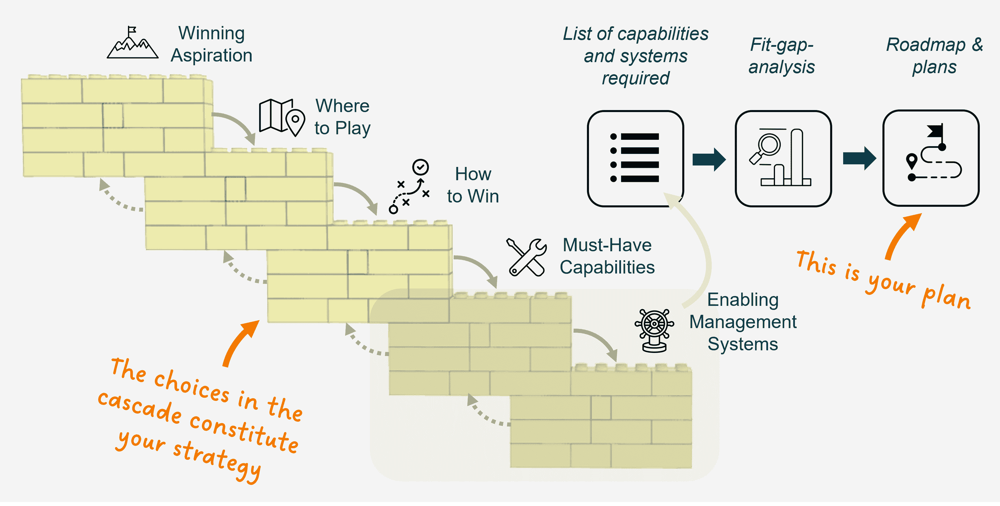

图 6：计划与策略：计划跟随你的策略工作。

这种计划-策略混淆也适用于*数据策略*，正如我们在第 2.1 节中看到的。

知道策略是什么，它是如何被创建的？

### 3.4 战略选择结构化过程

要设计一个策略，需要的不仅仅是简单地填写五个框。Playing to Win 框架的第二个工具是一个用于策略设计的既定过程，称为*战略选择结构化过程*。

这个过程实际上是一个通用的工具，用于解决实际结果和期望结果之间的差距 [[1i](https://medium.com/@rogermartin/the-strategic-choice-structuring-process-5e116b12ae1f)]。它包括七个步骤。

![图 7：战略选择结构化过程 [1i] 给出了设计获胜策略所需的步骤。](../Images/2dc0598a6e76132428aa9aef6a63d60a.png)

图 7：战略选择结构化过程 [1i] 给出了设计获胜策略所需的步骤。

**步骤 1：问题定义**

策略首先是一个[问题解决工具 [1n]](https://rogermartin.medium.com/strategy-as-problem-solving-5c6fb9291d87)，因此你首先从确定你的策略设计业务需求开始。由于你的当前策略——无论是隐含的还是明确的——正在创造问题，你需要一套新的选择，以产生你希望的结果。

**步骤 2：我们如何做到？**

这一步的目标是产生一个声明，为步骤 3 中的创意阶段打开讨论。

对于前两个步骤，重要的是要关注客户而不是内部元素。

**步骤 3：可能性生成**

这是设计过程中的一个创造性部分。它涉及到创新不同的可能性，如何解决确定的问题。对于每个可能性，都会制定一个选择级联。

**步骤 4：什么必须是真的？**

在这一步中，策略设计团队的目标是揭示那些必须存在的条件，使得考虑的可能性会成为一个伟大的策略。对于每个创建的可能性，都需要进行这项练习。

团队询问客户、公司和竞争对手为了揭示每个战略可能性的潜在假设，需要“什么必须是真的”。重要的是不要问“什么是真的”，因为这会导致无益的讨论，而最好的策略创造一个新未来，也就是说，今天不是真的事情，可能会因为新策略的实施而在未来成为真的。

**步骤 5：选择障碍**

在步骤 4 中确定的任何条件，如果策略设计团队对其真实性或未来能否实现真实性缺乏信心，都可能成为障碍。一个已识别的障碍可能会阻止设计团队在步骤 7 中选择相应的可能性作为最终策略。

如果已经识别出障碍，则需要对其进行测试。

**步骤 6：测试与转变**

对于每个障碍，都需要设计并执行一个测试，以确定当前条件是否为真，或者是否存在一个合理的转变路径使其为真 [[1i](https://medium.com/@rogermartin/the-strategic-choice-structuring-process-5e116b12ae1f)]. 这是过程中的第二个创造性元素。

测试的目的不是达到 100%的信心，这是不可能的，而是为了缩短战略可能性的概率，使得设计团队能够足够自信地将其选为最终策略。

**步骤 7：选择**

在开发出所有战略可能性、识别并测试潜在障碍之后，策略设计团队应该拥有足够的信息来选择一个可能性而不是其他，这将成为新的策略。

注意，战略选择结构化过程包含[设计思维 [1o]](https://rogermartin.medium.com/strategy-design-thinking-faf6b787160b)的元素，分别对应步骤 3 和步骤 6 的发散性思维阶段 [[14](https://michaelgoitein.com/the-playing-to-win-framework-part-ii-the-strategy-process-map/)]。

### 3.5 组织需要哪些策略

在一个地理区域内销售单一产品的公司可能只需要一个策略 [[1d](https://rogermartin.medium.com/strategy-is-singular-4876ac92a824)]. 然而，如果业务元素在“在哪里竞争”和“如何获胜”方面存在显著差异，每个元素都将需要其自己的策略。

对于每个策略，都需要应用上述设计过程，以得出一个独特的选择集，导致一个单独的策略选择级联。因此，大型组织将拥有几个策略构建块，挑战在于使它们相互匹配并相互加强 [[1p](https://rogermartin.medium.com/the-secret-to-knitting-strategy-together-corporate-wide-827a3efdd53a), [1q](https://rogermartin.medium.com/corporate-vs-business-unit-strategy-adb1163665da), [1r](https://rogermartin.medium.com/strategic-choice-chartering-3d56d8962ec3)].

> “策略涉及在不确定性、约束和竞争下做出选择，而这在公司内的许多地方都会发生。” [[1c](https://rogermartin.medium.com/strategy-strategy-everywhere-83e9d8a2fce9)]

**商业策略**

策略最核心的形式是*业务策略*，它是一个服务或产品 [[1c](https://rogermartin.medium.com/strategy-strategy-everywhere-83e9d8a2fce9)] 在一个地理区域 [[1s](https://rogermartin.medium.com/understanding-the-true-building-blocks-of-corporate-strategy-78f1f55e86b6)] 的策略。在这个不可分割的策略层面，一个组织与特定的竞争对手为特定的客户群体竞争。

**聚合策略**

另一种策略形式是*聚合策略* [[1q](https://rogermartin.medium.com/corporate-vs-business-unit-strategy-adb1163665da)]，它结合了来自较低层面的策略集。*企业策略*仅仅是组织内部最高的聚合策略。聚合策略的任务是为下级企业的组合增加竞争优势，使得整体大于部分之和。

典型的嵌套聚合层级包括企业、业务单元、类别和品牌。另一个聚合策略的例子是区域策略，例如针对特定地区或国家。

**功能策略**

第三种策略形式是功能策略。

功能是组织内的专业领域，如人力资源、信息技术、财务、市场营销和研发，它们为更广泛的组织或业务单元提供支持服务。它们可以作为一个中央团队（例如，企业功能）或特定业务领域内的分散单位运营。功能的目的在于提供关键运营支持和专业知识，以帮助业务单元有效地执行其策略。

功能策略对于确保组织内的专业领域或团队在与其组织总体目标保持一致的同时为内部客户创造价值至关重要。每个功能都需要自己的策略 [[15](https://hbr.org/2019/07/the-one-thing-you-need-to-know-about-managing-functions)] 来确定：

+   为哪些内部客户提供哪些服务

+   有限资源如何进行优先排序

+   如何在支持组织更广泛目标的同时实现运营卓越

除了满足纯粹的操作需求外，一些功能可以通过提供跨越多个业务或聚合策略的共享能力或系统来发挥战略性和整合性的作用。这些共享能力和系统被称为*加固杆* [[1q](https://rogermartin.medium.com/corporate-vs-business-unit-strategy-adb1163665da)]，它们专注于创造协同效应并使组织内的嵌套策略保持一致。我们将在第 3.6 节中更详细地探讨加固杆。

**策略架构**

在大型组织中，由于各个业务有不同的竞争对手和客户，存在一个嵌套和相互关联的策略生态系统。

***示例***

为了说明这个概念，我选择描绘一家生产并销售薯片和坚果的咸味零食公司的策略构建块的一个子集。

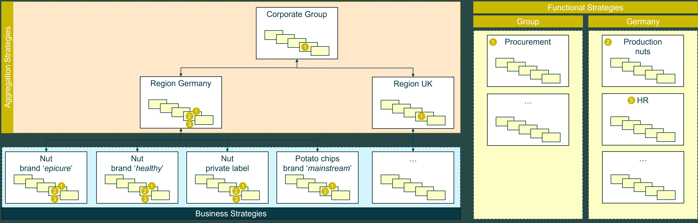

图 8：一家零食食品公司嵌套和相互关联的策略示例生态系统。

有两个聚合策略层：一个用于德国和英国等地区，另一个用于总体的企业集团层面。

在德国地区的聚合策略之下，有四个业务策略，每个策略形成一个不可分割的单位，这是竞争发生的基础层面。坚果品牌 *epicure* 和 *healthy* 有不同的客户和竞争对手，因此需要为它们制定一个单独的获胜理论，就像为自有品牌坚果和薯片一样。

德国地区的聚合策略提供了 *加固钢筋* 来利用生产和人力资源职能提供的协同效应。每个职能都需要自己的策略。

数据策略如何在策略架构中定位？在第四部分中，我将数据策略定义为数据职能的策略，将其明确地定位在职能策略之内。然而，仅此还不够使组织成为数据驱动型。正如我们将在第五部分中探讨的，实现这一雄心壮志需要不仅仅是一个精心设计的职能数据策略——它需要将数据相关的选择嵌入到个别业务策略、其他职能策略和总体聚合策略中。

### 3.6 加固钢筋

与加强混凝土结构的钢筋类似，加固钢筋是策略中的一个概念，它加强了整体策略架构。如第 3.5 节所述，聚合策略的主要任务是为其覆盖的业务组合增加竞争优势。这通常是通过加固钢筋实现的。

加固钢筋是跨越多个业务单元或组织层面的能力或系统，通过创造增强价值并提高竞争优势的协同效应。它们通过连接不同的层次（例如，企业、业务单元、地理区域）来加强整个组织，并使它们能够比单独行动时更好地集体表现。通过这种方式，加固钢筋为不可分割的策略提供了净收益，使它们更加有效。

图 9：说明加固钢筋的概念。

加固钢筋的例子可以是跨区域共享的研发或品牌建设能力。

因此，加固杆是聚合策略必须具备的能力或使能管理系统。聚合策略决定了为什么需要这些杆，并根据它们对组织的战略价值进行优先排序。然而，它们的实现通常委托给职能部门。

总结来说，加固杆是为了在组织层级上建立具有战略影响的协同效应，减少重复，并优化专用或稀缺资源的利用。它们通过确保其嵌套策略无缝协作，使组织能够更有效地竞争。

### 3.7 组织不需要的策略

无论何时你认为你需要一种补充性的策略来修正或叠加你的业务、聚合或功能策略，这很可能是误解。根据定义，策略是一套相互加强的选择，通过叠加一个策略到另一个策略上，你并不会实现整合，反而会失去整合。

在 [[1c](https://rogermartin.medium.com/strategy-strategy-everywhere-83e9d8a2fce9)] 中，Roger Martin 提供了这种不希望出现的策略退化的例子。这些包括内容策略、合作伙伴策略、增长策略、可持续性策略、数字策略和 *数据策略*。

正如我们在第 2.3 节中已经指出的，作为商业策略补充实体的数据策略是一个应该避免的误解。

关于我们帮助组织成为数据驱动型，利用数据作为资产的影响将在第四部分和第五部分中讨论。

### 3.8 策略设计团队

一个较大的组织可以有一套不同的策略，那么谁负责什么策略设计？

通常，每个需要策略的实体的领导者最终负责做出相应的战略选择 [[1t](https://rogermartin.medium.com/who-should-do-strategy-a5dcf4559b04)]。这意味着首席执行官负责企业战略，而 IT 领导者负责功能 IT 策略，依此类推。

策略很少由单个个体设计，而更是一个团队活动，从一开始就创造参与感以激活策略是非常重要的 [[[1](https://rogermartin.medium.com/who-should-do-strategy-a5dcf4559b04)6](https://www.ideou.com/blogs/inspiration/how-to-make-your-strategy-real)]。然而，这并不意味着要尽可能多地涉及人员。战略决策者必须具备在竞争、客户和公司背景下评估战略选择的能力。这些能力应存在于被设计策略的实体的领导团队中 [1t]。

在策略设计团队中，通常存在以下角色：

+   **赞助者**：负责总体选择，提供咨询并最终批准策略

+   **负责人**：为该战略设计的单位领导对做出战略选择承担最终责任

+   **核心团队成员**：那些负责共同创造战略选择的人。对于企业战略，这是整个领导团队。

+   **扩展团队成员**：那些拥有重要视角的人，这些视角对于塑造战略至关重要

+   **主题专家**：拥有特定专业知识的人

### **3.9** 策略基础总结

正如我们所看到的，"赢得游戏"框架提供了一个强大且结构化的方法来设计战略。它提供了一套丰富的定义、工具和思维方式，有助于生成任何类型的成功战略。

策略不是一个计划，而是一套综合的选择，它确定了一个可以玩的地方以及如何在其中获胜的理论，这些理论由能力和相应的管理系统支持，这些系统能够建立和维护这些能力 [[1d](https://rogermartin.medium.com/strategy-is-singular-4876ac92a824)]。

战略选择级联有助于构建必须做出的选择。战略选择结构化过程通过从问题表述开始，生成和评估不同的可能性，直到最终选择一个可能性作为解决该问题的新战略来设计您的战略。

现在我们已经对战略是什么以及它是如何设计的有了坚实的理解，考虑数据相关的战略选择如何适应这个框架是很重要的。关于数据战略的误解——在第 2.3 节中突出显示——只能通过将数据相关的选择嵌入到业务战略本身来解决。这确保了数据、分析和 AI 被视为战略雄心的促进因素，而不是作为独立或补充的倡议。

在下一节中，我们将探讨如何以与"赢得游戏"框架无缝对齐的方式定义数据战略。在第五部分中，我们将讨论如何确保数据战略的需求直接源自业务战略，从而创建一个将数据用例创新融入组织整体战略框架的连贯方法。

* * *

## 4 数据战略定义与设计

### 4.1 定义数据战略

大多数组织需要一个专门的职能来提供数据相关服务或产品，主要是为内部和最终的外部数据客户。这个职能需要一个战略，正如我们在第 3.5 节中看到的。这就是您的数据战略。

> 数据战略是数据、分析和 AI 职能的战略。它概述了该职能如何通过提供数据相关产品和服务来服务于组织的更广泛业务战略。

您的数据策略明确了数据功能胜利的含义，您的内部数据客户是谁，数据功能提供的服务或产品是什么，它是如何通过其数据客户获胜的，以及需要哪些能力和系统来获胜。

注意，数据策略并不定义数据、分析和 AI 如何为组织创造竞争优势。这是您的业务战略的任务！在第五部分中，我将展示与数据相关的战略选择是商业战略的自然部分。反过来，商业战略提供了战略数据需求，这是您数据功能的需求，您根据这些需求设计数据策略。

> 正如人力资源或 IT 策略存在是为了服务于业务一样，数据策略是满足数据需求的功能性策略，而不是数据创造价值的独立定义。

没有明确定义数据策略会导致缺乏重点，数据功能要么试图满足所有需求（“*奴性策略*”），要么追求脱节的数据项目（“*帝国策略*”）。这两种方法都削弱了该功能获胜的能力。

> 根据该功能提供的服务和产品的性质和重点，您可能称之为数据策略、分析策略、BI 策略或 AI 策略。

这样的策略有助于数据、分析和 AI 团队集中精力，在我看来，这是唯一应该被称为*数据策略*的实体。

### 4.2 数据策略选择级联

当使用“以赢为目标”框架来设计数据策略时，一些术语需要调整。这是本系列文章[第一部分[17]](https://contributor.insightmediagroup.io/the-data-strategy-choice-cascade-9f2742b81bda)中讨论的主题。[揭秘数据策略文章系列](https://contributor.insightmediagroup.io/tagged/demystify-data-strategy)。我们需要调整的是：

+   **产品 → 数据产品**：这包括与数据、分析或 AI 相关的产品或服务。

+   **客户 → 数据客户**：接受数据服务的人群。这些人很可能是公司内部的利益相关者或团体，但有时也可能包括外部利益相关者。

+   **公司 → 数据服务提供商**：创建数据服务的人群。数据功能的工作人员。

+   **竞争**：数据客户可能选择的数据服务提供商的替代方案。这可以是从未得到服务的数据客户，自行提供服务或使用外部服务。

+   **地理 → 重点关注领域**：您的数据策略将关注的业务单元、部门、团队、领域或地理区域。

+   **渠道 → 数据交付渠道**：数据客户如何获取数据产品。

+   **生产阶段 → 数据生命周期管理**：数据生命周期的哪些阶段是在内部完成的或外包的。

在翻译核心元素后，数据战略选择级联 [[17](https://contributor.insightmediagroup.io/the-data-strategy-choice-cascade-9f2742b81bda)] 可以定义为以下内容：

1.  **获胜愿景**：定义你职能的获胜是什么样的。

1.  **在哪里竞争**：你将选择和不会选择竞争的竞技场。这通常包括五个维度：i) **关注领域**，ii) **数据客户**，iii) **数据交付渠道**，iv) **数据产品**，v) **数据生命周期管理**。

1.  **如何获胜**：你的数据战略将创造的战略优势。你将如何通过数据客户可持续地获胜。

1.  **必备能力**: 实现如何获胜所需的关键活动和资源。

1.  **支持管理系统**：基础设施（系统、流程、治理、指标与文化），这是支持并维持你的数据战略所需的。

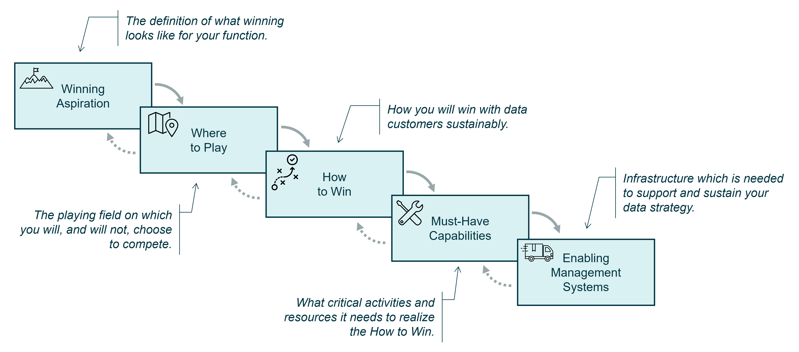

图 10：数据战略选择级联。

### 4.3 数据战略设计过程

对于任何战略设计，我们可以应用“赢得游戏”框架中的战略选择结构过程。我提出了五个额外的步骤来制定数据战略，以纳入业务战略需求，并明确区分随后的能力建设和系统构建计划。

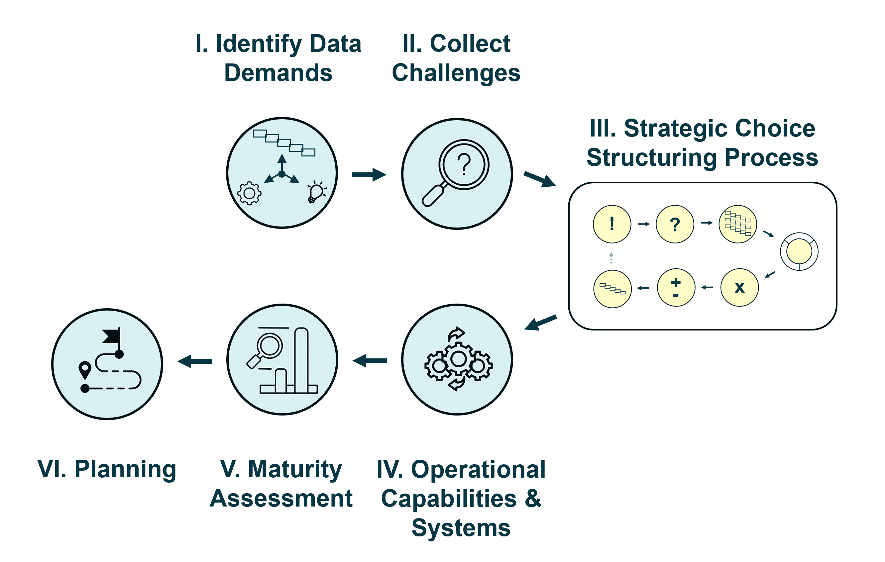

图 11：为数据战略设计修改的战略选择结构过程。

数据战略设计的五个额外步骤将在以下小节中描述。

### 4.4 步骤 I：识别数据与人工智能需求

从上述定义中，应该清楚，数据战略不应回答数据、分析和人工智能如何创造商业价值和竞争优势。[正如我在[5](https://medium.com/towards-data-science/the-root-cause-of-why-organizations-fail-with-data-ai-0095a73cf5ab)]中论证的，这应该是你业务、聚合和功能战略的一部分。这些在 3.5 节中进行了讨论。数据功能对战略数据需求是从这些战略中衍生出来的，并补充了运营和最终的未来数据需求。

实质上，步骤 I 是关于明确组织中现有数据、分析和人工智能需求。总共有三个这样的数据需求来源，为随后建立的数据功能提供了自然的优先级。

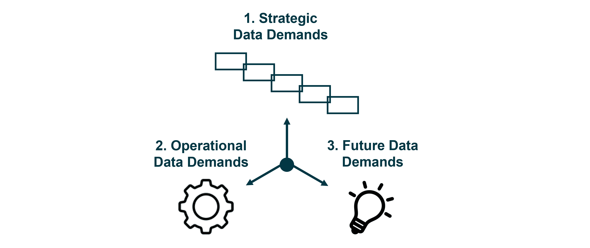

图 12：战略、运营和未来数据需求

**优先级 1：战略数据需求**

当你在进行战略架构工作时，随着各个战略设计团队的工作进展，你组织的战略各层中的战略数据需求应该变得清晰。固有的困难在于，战略设计不是一个线性过程，而是一个迭代的过程，来回反复。这既适用于单一战略的设计[[1u](https://rogermartin.medium.com/overcoming-the-integrative-strategy-challenge-9af0d670d083)]，也适用于战略架构中不同层面的协调[[1q](https://rogermartin.medium.com/corporate-vs-business-unit-strategy-adb1163665da)]。

通常，数据在组织的不同层面产生战略需求，可能会产生数据、分析和人工智能作为战略架构强化支柱的需求（参见第 3.6 节）。这甚至可能是设计中央数据功能的原因，正如我们将在第六部分中看到的。

另一种方式，战略数据需求可以以数据用例的形式体现。我们将在第 5.1 节中遇到这样一个用例的例子，它直接有助于组织在竞争中的优势。这个用例可能引发对新型人工智能能力的需求。通常情况下，这需要业务得到相应数据与人工智能功能的支撑。

战略数据需求的另一个重要方面是组织希望真正成为[数据启发式[2]](https://www.vahlen.de/wernicke-data-inspired/product/35418267)。这意味着通过创造关于客户、技术、竞争对手和行业的洞察来不断推动其思考，以获得竞争优势。这里可能存在一些递归，因为这种能力也将用于业务战略设计过程的中心，正如我们将在第五部分中看到的。然而，如果一个组织充分认识到数据巨大的潜力，这不仅仅局限于提升运营性能，体现在最佳实践数据用例的待办事项中，那么这确实是为设计数据功能所必需的。这将导致数据策略中的“在哪里竞争”选择，以支持领导层进行业务战略设计，正如我们将在第 5.2 节和 5.3 节中详细说明的。

理想情况下，数据需求应由相应的策略所有者积极提出，并通过选择授权到达企业数据领导者那里。

数据专业人士收集战略数据需求作为数据策略输入的最佳方式是成为实际战略设计团队的一员，并积极参与创新和评估战略数据用例，正如我们将在第 5.2 节和 5.3 节中讨论的。如果这不可能实现，你应该分析你组织的当前战略架构。如果设计得当，各个战略构建块应直接提供战略数据需求。

不幸的是，在许多公司中，战略设计似乎已经变成了一种失传的艺术 [[1v](https://rogermartin.medium.com/the-lost-art-of-strategy-5f95edbaa04b)]，要弄清楚组织的当前战略架构需要一点侦探工作。

在所有战略层中确定的战略用例集为数据、分析和 AI 提供了最重要的要求，因为相应的用例对于支持组织的战略和竞争优势至关重要。

**优先级 2：运营数据需求**

数据需求并不仅仅源于战略选择的一部分，也可能来自运营选择。

作为战略的一部分，能力和系统通常只有少数几个战略选择。战略的任务并不是提供组织能力和系统的详尽列表，而只是那些有助于胜利理论的部分。

因此，你的战略选择通常由其他称为*运营必要要求*的选择所补充 [[1w](https://rogermartin.medium.com/is-or-is-not-the-opposite-stupid-on-its-face-ab635b9c5582)]。这些是那些不会使你的组织与竞争对手区分开来的运营选择，而是标准或最佳实践的选择，是其他人都在做的事情。

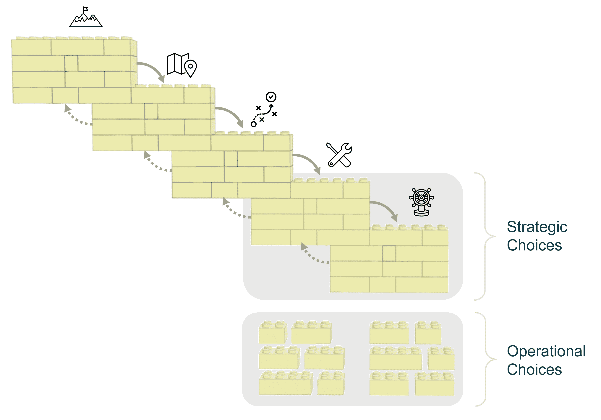

图 13：能力和系统的运营选择补充了少数几个战略选择。

一个具有数据相关性的运营选择示例可能是企业战略的报告和 BI 能力。在组织中拥有 BI 解决方案进行报告是一种最佳实践，但这些可能并不有助于你的胜利理论——它们只是运营上的必要要求。

与战略数据需求一样，运营数据需求还可以以数据用例的形式体现出来。这些*运营数据用例*提供了点优化，例如现有流程的效率提升。

我通常通过一系列访谈来发现运营数据需求，这些访谈是我与客户的业务和数据利益相关者进行的。

**优先级 3：未来数据需求**

为了构建一个面向未来的数据战略，组织应考虑数据需求的第三个类别。

通常，组织的不同部分已经有一些想法或甚至计划如何在未来利用数据和 AI 为其领域服务。因此，识别这些未来的数据需求很重要，因为这些可能对数据或 AI 职能的战略产生影响。

这样的未来数据需求可以通过与业务利益相关者的访谈以被动方式收集，或者通过进行数据用例创新研讨会以更积极的方式收集。

一旦所有数据需求都明确，在深入到数据战略设计过程之前，您需要了解当前的痛点，因为这些可能会塑造问题表述。

### 4.5 步 II：收集挑战

在明确数据函数的需求后，您需要识别在组织中利用数据可能遇到的潜在挑战。这些挑战将成为在战略选择结构化过程的第 1 步中选择问题定义的基础。

任务是确定组织中数据价值生成最紧迫的不足。我通常在识别第 I 步中的数据需求时将此包括在业务利益相关者的访谈中。实际上，我通常要求提供与业务相关的和数据相关的职位、痛苦和收益。为了文档目的，我喜欢借用著名的[价值主张画布 [18]](https://www.strategyzer.com/library/achieve-product-market-fit-with-our-brand-new-value-proposition-designer-canvas)的右侧部分。

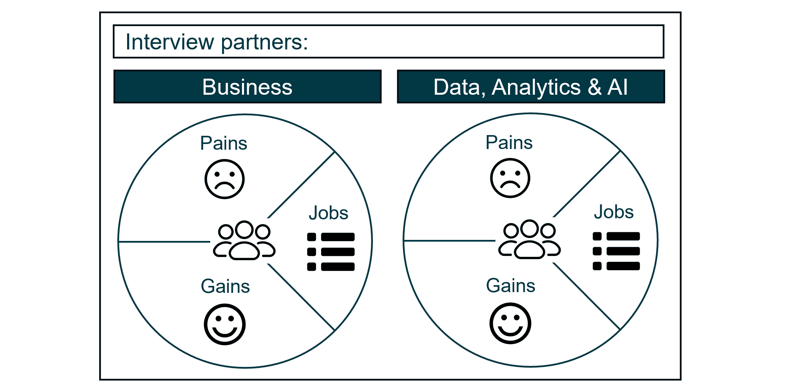

图 14：受 Strategyzer 价值主张画布启发的访谈文档模板。

此步骤的成果是对最紧迫的数据相关挑战有坚实的理解，这些挑战与数据需求一起提供了一种适合-差距分析，作为战略选择结构化过程第 1 步的基础。

由于数据战略设计过程的第 III 步是标准的战略选择结构化过程，我们已经在第 3.4 节中讨论过，因此在这里我将跳过重复，并直接跳到第 IV 步。

### **4.6 步 IV：运营能力和系统**

在第 III 步完成之后，数据战略就可以设计并需要激活 [[16](https://www.ideou.com/blogs/inspiration/how-to-make-your-strategy-real)]。这是通过设计和构建那些对于功能获胜所必需的能力和系统来完成的。因此，为了构建一个有效的数据功能，对战略和运营能力和系统有清晰的理解是至关重要的。

战略能力和系统通常是数据功能所需能力和系统的一个小子集。这些在您的数据战略中定义。运营能力是那些基础活动，它们能够有效地和可靠地执行战略选择，但并不直接有助于通过您的数据客户获胜。

战略能力和系统与运营能力和系统之间的区别提供了在构建这些元素时投资时间和资源的自然优先级。

正如我们所看到的，在步骤 I 中已经确定了运营数据需求。运营能力和系统通常直接由此产生。例如，这可能包括有效报告或 BI 等能力。请注意，战略选择结构过程的测试与转型步骤（策略设计过程的步骤 III.5）可能需要额外的运营能力和系统。

因此，步骤 IV 是通过获得数据功能成功所需的运营能力和系统的概览来完善整个画面。为此，可能有助于使用能力图。数据、分析和 AI 的能力图是数据专业人士熟知的工具（参见图 2），在构建数据功能时通常用作一种清单[[3](https://carruthersandjackson.com/thought-leadership-our-books/)]。

在数据战略背景下，典型的运营能力管理系统元素包括：

+   数据平台

+   数据目录

+   BI 工具

+   决策框架

+   建立数据文化的系统

+   数据成熟度模型

+   数据治理框架

+   技能矩阵

+   …

一旦你对数据功能成功所需的所有战略和运营能力和系统有了概览，就是时候评估现状并确定差距了。

### **4.7 步骤 V：成熟度评估**

在定义了战略和运营数据能力和系统之后，通过进行数据成熟度评估来评估你的当前状态是至关重要的。

许多咨询公司和数据专业人士倾向于在数据战略设计过程的早期就开始这种类型的活动。然而，我认为这种方法是错误的。虽然了解组织目前拥有的能力概览当然是有价值的，但在战略设计过程的开始进行详细评估几乎没有价值。首先，你需要确定所需的具体能力和系统，以及每个系统的期望成熟度水平。这意味着必须定义能力和系统及其相应的目标状态。然而，这只有在数据战略设计完成之后才可能实现。

此外，我对那些专注于与竞争对手或行业平均水平进行基准比较的数据成熟度评估持怀疑态度，因为我已经在其他地方[论证过](https://www.linkedin.com/posts/jens-linden_datenreifegrad-informdatalab-datenstrategie-activity-7116025878249132032-3N6k)。虽然这种比较可能看起来很有洞察力，但它们通常对你的组织提供的可操作价值有限，因为它们没有考虑到你业务的独特战略数据需求和背景。这种成熟度评估更像是一种标准化的简单解决方案，它无法满足成为数据驱动型问题的复杂性。

然而，对能力和系统进行彻底的现状评估是步骤 VI 的基础，在该步骤中，将创建构建和维护每个能力和系统的计划。

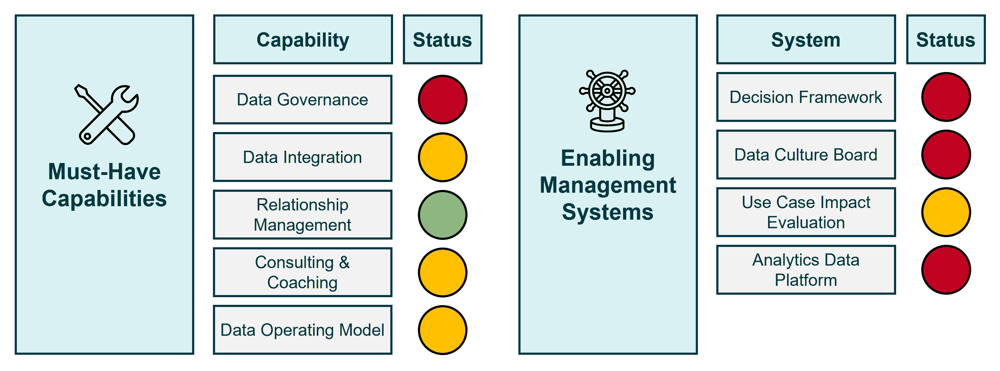

图 15：使用现状交通灯评估的数据成熟度评估结果。

此外，一些组织成功地利用数据成熟度模型作为衡量他们在数据驱动业务转型项目进展的工具，并将其作为与组织内各利益相关者的沟通工具。在这些情况下，比简单的交通灯指标更复杂的指标可能更有利。

### **4.8 步骤 VI：规划**

在对每个能力和系统进行适应性-差距分析之后，是时候制定一个计划来构建和维护数据功能所需的能力，以赢得胜利。构建与数据相关的能力和系统的计划是当涉及到数据、分析或 AI 时，大多数公司都热衷于讨论的话题。正如我们在第 2.1 节中看到的，这通常被错误地宣布为数据战略。

构建每个能力和系统通常是一个独立的项目，需要有一个负责人和相应的项目团队。负责人最终负责设计和构建该元素。

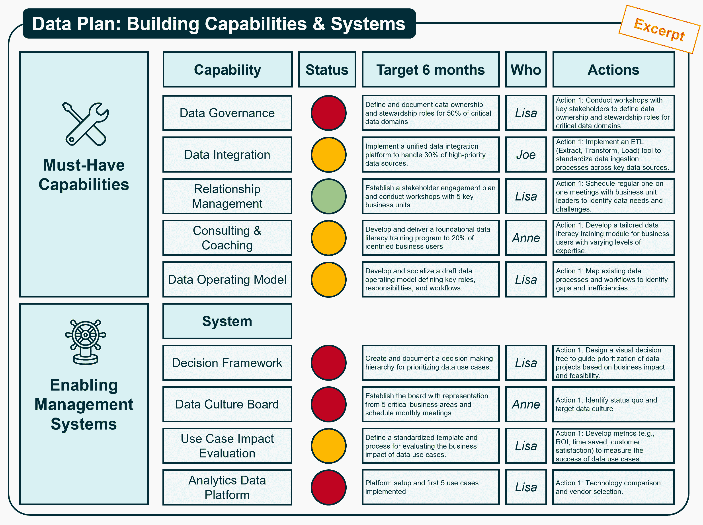

图 16：构建所需能力和系统的说明性计划。

单个项目通常是构建一个数据驱动或数据启发式组织的总体转型路线图的一部分。

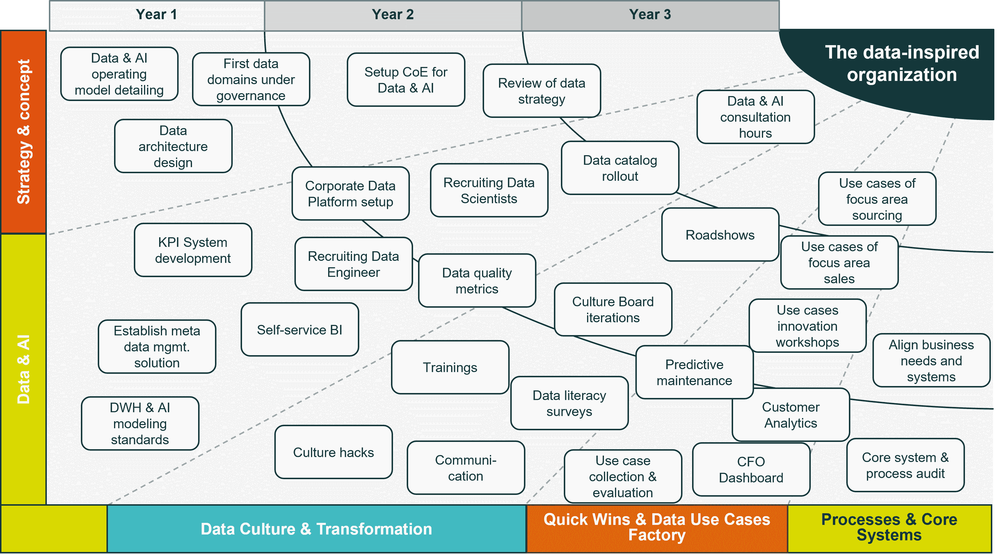

图 17：转型路线图的说明性示例。

逐步实施相应的项目逐步构建数据、分析和 AI 的[运营模型[20]](https://operatingmodelcanvas.com/)，从而激活你的数据战略。

在第六部分中通过一个实际示例更深入地探讨数据战略设计过程之前，让我们考虑一下业务战略设计和数据用例设计应该如何结合。这是确定你的战略数据业务需求所必需的，这是上述步骤 I 的一部分。我们将在下一节中了解到这一点。

* * *

## 5 整合业务战略与数据

在第四部分中，我们了解到，定义组织如何使用数据、分析和人工智能创造价值或竞争优势的任务——即作为功能战略的数据战略——并不是数据战略的任务。这是业务、聚合和/或功能战略的任务，我们在第 3.5 节中定义了这些战略。这些战略定义了如何获胜。有时，组织可以在数据、分析和人工智能的帮助下获胜。

在本节中，我们首先探讨数据战略选择如何自然地成为商业战略设计的一部分。我所说的数据战略选择是指那些组织理论中为了获胜而依赖或涉及数据使用的决策。

我接着论证，数据用例发现、创新和验证应被视为商业、聚合或功能战略设计过程中的战略选择结构过程的有机组成部分。这自然地将商业战略和数据用例设计联系起来，这对于组织成为数据驱动型组织通常被视为最大的挑战之一。

### 5.1 数据选择作为您的商业战略的一部分

当您在商业战略设计中做出关于在哪里竞争、如何竞争以及需要哪些能力和系统来获胜的决策时，其中一些决策可能依赖于利用数据、分析和人工智能。数据与人工智能能力的战略选择是您商业战略的自然组成部分。我在[5]中提供了[一些例子](https://contributor.insightmediagroup.io/the-root-cause-of-why-organizations-fail-with-data-ai-0095a73cf5ab)。

因此，组织应将数据和人工智能视为需要融入其商业战略核心的东西。

> 与数据或人工智能相关的战略选择仅仅是您的商业、聚合或功能战略的一部分。

为了说明目的，请将您的战略选择想象成乐高积木，您可以用它们构建您的战略选择瀑布，而与数据相关的战略选择只是其中不可或缺的一部分。

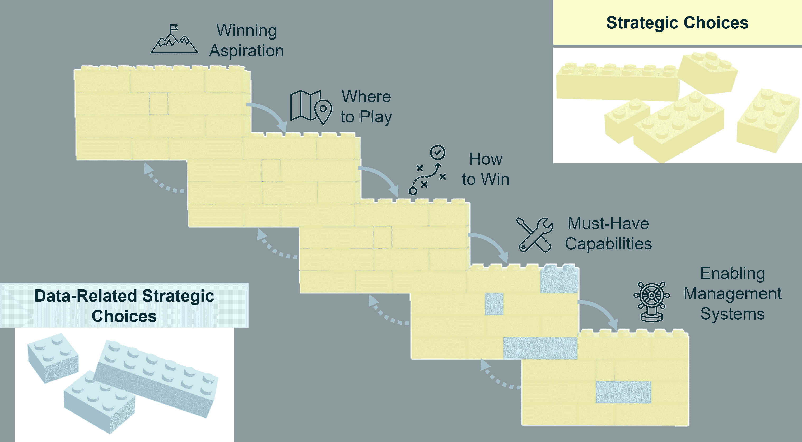

图 18：与数据相关的战略选择是您商业战略的一部分。

让我们看看一个例子，其中人工智能是战略的一部分能力。

***示例***

我使用了这个例子，这个例子是从[[1x](https://rogermartin.medium.com/distinguishing-how-to-win-from-capabilities-in-your-strategy-choice-fd190484ccea)]借用的，在[本系列文章的第二部分[5]](https://contributor.insightmediagroup.io/the-root-cause-of-why-organizations-fail-with-data-ai-0095a73cf5ab)中已经提到过。它是一个关于咸味零食生产商的例子，该生产商使用直接门店配送系统，产品由配送司机直接送到便利店并放置在货架上。

这种直接门店配送系统劳动密集且因此成本高昂，但使公司区别于其竞争对手。这是区域聚合战略的战略选择，这些实现可能被[特许[1r]](https://rogermartin.medium.com/strategic-choice-chartering-3d56d8962ec3)分配给销售部门。

构建数据与 AI 解决方案以预测门店库存并生成每个销售点的最佳产品订单有助于降低直接门店配送系统的成本。因此，拥有数据与 AI 能力的选择，使组织能够预测门店库存，将是销售战略职能的战略选择，这直接支持组织的竞争优势。

这种与数据相关的战略选择提供了一个清晰的*战略数据需求* [[5](https://medium.com/towards-data-science/the-root-cause-of-why-organizations-fail-with-data-ai-0095a73cf5ab)]，即组织对数据和使用 AI 的战略需求。它是公司战略的组成部分，并加强了关于与竞争对手差异化的其他战略选择。

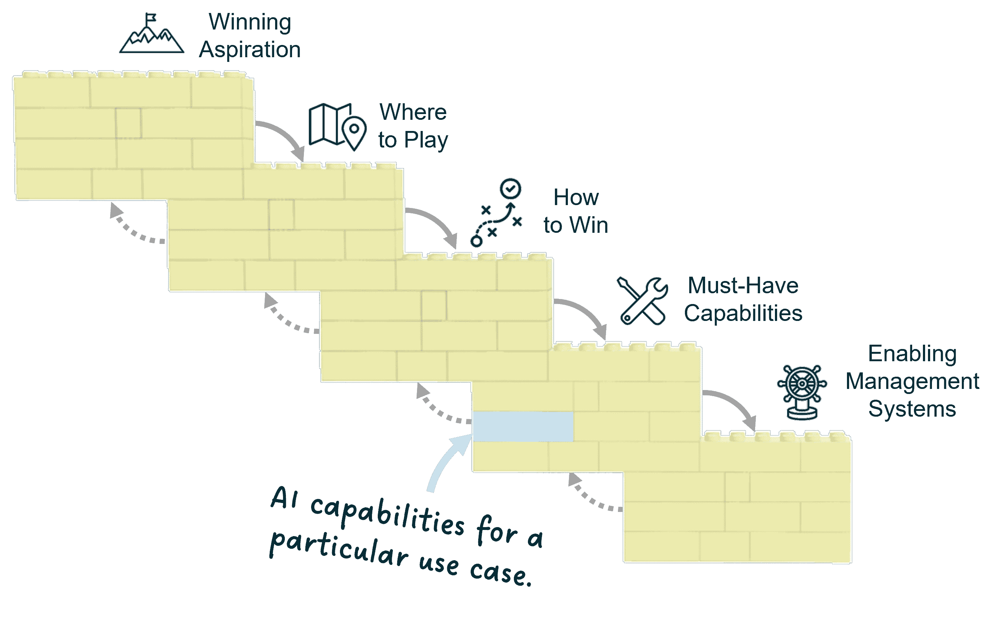

图 19：销售职能战略的示例战略选择级联，其中数据相关的选择是必备能力的一部分。

该示例说明，战略——在这种情况下是销售职能的战略——应定义数据与 AI 如何在组织中创造战略价值，而不是一种补充的数据战略“误解”。

因此，数据用例创新应成为业务战略设计的重要组成部分。以下两个小节表明，Playing to Win 框架的战略设计过程为整合数据用例创新提供了一个自然的环境。

### 5.2 问题表述和可能性生成数据

数据用例是数据价值创造的核心，但组织往往难以确定其可行且具有影响力的个别用例集合。

在创新数据用例时，通常不会区分其目的是优化现有流程还是创造新的商业机会。然而，区分操作用例和战略用例是至关重要的，操作用例解决常规需求或提高现有系统内的效率，而战略用例则直接支持竞争优势并使新的运营方式成为可能。后者应成为业务战略设计的一部分。

存在着用于用例发现和创新的知名和经过验证的格式和技术[[2](https://www.vahlen.de/wernicke-data-inspired/product/35418267), [22](https://www.datentreiber.de/en/method/#data-strategy-design)]。这些通常包含设计思维的因素，并被称为数据思维[[23](https://en.wikipedia.org/wiki/Data_thinking)]，因为其固有的迭代方法要求。

事实上，这些格式和技术可以直接整合到业务策略设计过程中，而不是作为独立的练习。这与战略选择结构化过程非常契合，这并不令人惊讶，因为它也利用了[设计思维[1o](https://rogermartin.medium.com/strategy-design-thinking-faf6b787160b)]。因此，玩到赢的框架允许自然地将数据用例创新和业务策略设计结合起来，弥合业务和数据人员之间的差距。

> 将数据用例创新整合到业务策略设计过程中有助于弥合业务和数据人员之间的差距

这样，业务策略设计团队可以利用数据和人工智能作为工具，通过结合人类创造力和数据洞察来创造战略创新。这适用于第一步——问题定义，以及第三步——可能性生成。让我们来看一个例子。

**示例**

考虑到之前的例子中的咸味零食公司。该咸味零食公司注意到，在注重健康的消费者中，其产品吸引力正在下降。通过对销售数据的分析，结合社交媒体情绪分析，突显出一个关键洞察：顾客越来越寻求个性化的零食选择。*受此洞察启发*，策略设计团队不仅超越了优化现有产品，还提出了以下问题及其相应的*如何可能*问题：

**1 问题定义**

> 顾客越来越寻求个性化的零食选择，但我们的当前产品供应是标准化的，导致在注重健康的消费者中的市场份额下降。

**2 如何可能问题**

> 我们如何更好地满足注重健康的消费者对个性化零食选择的日益增长的需求？

通过结合数据驱动的洞察和创意格式，团队开发了以下创新可能性：

**3.a 可能性‘零食套装’**：在商店提供自选零食套装，顾客可以手动选择配料来创建自己的混合搭配，满足他们独特的口味偏好。

**3.b 可能性‘影响者’**：与健康和福祉影响者合作，为他们的追随者设计品牌零食套装，通过与受信任的人物共同创造来推广个性化。

**3.c 可能性“直接面向消费者平台”**：设计一个直接面向消费者的平台，客户可以在其中输入他们的饮食偏好，并使用基于客户数据洞察的 AI 驱动推荐接收个性化的零食组合。

这些可能性并非简单地从数据中得出——它们是从数据中获得的灵感，利用洞察力作为创造性解决方案的基础，这些解决方案既满足了客户的需求，也实现了商业目标。

此外，在可能性 3.c 中，设计团队创建了一个新的数据使用案例。这表明在战略设计过程中，数据和 AI 可以被用来：

1.  激发问题表述

1.  在创新新的可能性时创建新的数据使用案例

这意味着：

> 数据、分析和 AI 的主题专家应该是任何战略设计中的自然部分。

这很好地回到了第 4.4 节，并作为在数据战略的数据提供中包含“*业务战略设计支持*”作为何处竞争选择的一般动机。

不仅可以将新数据使用案例的创新纳入业务战略设计，还可以将其后续的迭代和增量开发纳入其中。

### 5.3 作为测试一部分的数据使用案例验证

当组织发现或创新数据和使用案例时，并不总是清楚所期望的解决方案是否会按预期工作。需要识别、评估并最终验证的不确定性假设。这就是设计思维与数据使用案例设计相遇的地方。

这个过程完美地与第 3.4 节中概述的战略选择结构化过程的第 6 步——测试和转型——相吻合。

> 战略选择结构化过程自然地允许整合迭代和增量数据使用案例开发。

对于前一个例子中的可能性 3.c（直接面向消费者平台），这可能看起来如下所示：

***示例（继续）***

对于每个生成的战略可能性，需要识别和评估该可能性成为伟大战略的假设。这是战略选择结构化过程的第 4 步——W*hat Would Have to Be True?*的任务。

第 4 步是识别客户、竞争和公司的*关键条件*。为了说明这个概念，一些关键条件可能包括：

> 对于***客户***来说，必须是真的，即注重健康的消费者愿意使用数字平台来个性化他们的零食选择。
> 
> 对于***竞争对手***，必须是真的，他们要么无法快速复制直接面向消费者的平台，要么不愿意这样做。这就是所谓的不能/不愿意测试 [[1x](https://rogermartin.medium.com/distinguishing-how-to-win-from-capabilities-in-your-strategy-choice-fd190484ccea), [1y](https://rogermartin.medium.com/can-your-strategy-pass-its-most-important-test-59293df6b3a7), [1z](https://rogermartin.medium.com/untangling-value-proposition-competitive-advantage-c3ab3ff91151)]。
> 
> 对于***公司***，必须是真的，我们可以从历史消费者数据中持续得出有意义的和可操作的推荐，以有效地个性化零食组合。

如果战略设计团队对任何已识别的关键条件目前是否为真或可能变为真没有合理的信心，它将宣布其为*障碍*，这可能会阻止团队选择可能性 3.c 作为最终战略。如果已识别出障碍，团队将设计和执行测试，以了解更多信息并获取（或失去）对条件可能变为真的信心。这是战略选择结构化过程的第 6 步。

对于上述三个关键条件中的最后一个（公司），一个有意义的测试可能是设计一个最小可行产品，其中数据科学团队使用可用数据构建算法。然后，使用一组潜在客户对建议进行测试。

这样的测试将验证公司是否有足够的数据做出有意义的预测，以及该数据的质量以及所使用算法的预测准确性是否足够，以便得出有意义的建议。

例子说明了：

> 数据专业人员应用的数据用例创新和发展过程可以无缝集成到“赢得游戏”框架的通用战略设计过程中。

注意，通过这样做，业务专家和数据专家紧密合作，设计和探索新的战略可能性，这解决了组织中的常见问题：业务团队和数据团队之间现有的差距。

### 5.4 关于业务战略与数据的结论性评论

为了总结本节内容，我们首先将来自业务战略设计过程产生的战略数据需求与第 4.3 节中描述的数据战略设计过程联系起来。

**战略数据需求作为数据战略的输入**

我们看到，数据战略设计过程的第 I 步是确定组织的战略数据需求，这些需求随后成为构建数据功能的需求输入。

从这一点可以得出结论：

> 在一个组织中，对业务、聚合和功能战略的稳固设计是成功应用数据、分析和 AI 的必要条件。

我认为，[组织在数据与人工智能方面失败的根本原因在于[5]](https://medium.com/towards-data-science/the-root-cause-of-why-organizations-fail-with-data-ai-0095a73cf5ab)：随着坚实的[战略设计成为一种失传的艺术[1v]](https://rogermartin.medium.com/the-lost-art-of-strategy-5f95edbaa04b)，许多组织缺乏健全的战略架构和战略设计流程。缺乏战略能力对组织有许多负面影响。其中之一是组织难以将数据作为资产使用。

通过利用“赢得胜利”战略框架来创建坚实的战略架构，组织可以将与数据相关的战略创新和由此产生的选择嵌入其业务战略中，产生明确战略需求，从而为数据功能战略的设计提供信息和指导，确保一致性和专注。

**数据领导力**

我们得出结论，从数据、分析和人工智能中获取战略价值是业务战略设计的工作，因此很明显，最终的责任在于相应的战略所有者，即相应的领导者。

这再次强调，所有种类和级别的领导者都需要拥抱一种*数据文化*，确保他们理解、愿意、有技能，并且被上级要求利用数据和使用人工智能作为战略杠杆的可能性。他们需要成为所谓的‘*数据探索者*’，正如[[2](https://www.vahlen.de/wernicke-data-inspired/product/35418267)]所定义的那样。

> 所有类型的领导者都需要成为数据探索者

因此，在数字世界中，数据、分析和人工智能是一种得分技能。这不仅适用于数据专业人士，如数据科学家或数据工程师，也适用于商业领导者。

**成为数据驱动计划的 ROI 问题**

任何类型的转型都不是目的本身。成为数据驱动的转型计划应该始终源于业务战略。这些计划是旨在激活战略的计划和倡议，确保实现组织的获胜渴望、在哪里竞争以及如何获胜的选择。

当涉及到为这些转型计划投入资源时，我经常遇到高管和领导者提出关于投资回报率（ROI）的问题——这是一个可以理解的关注点。然而，预期成本的评估应该在业务战略设计过程中较早进行，而不是在数据战略设计阶段，甚至不是在实施阶段。

理想情况下，特定能力或系统的需求应自然地从定义良好的战略中产生。当 ROI 计算主导讨论时，这可能表明领导层认为所提出的投资与当前的战略优先事项不一致。

在商业战略设计过程中，设计团队应该问，“*关于构建所需能力和系统的成本，需要满足哪些条件？*”如果对成本存在不确定性，这个关键条件就会成为障碍，促使进行测试。这些测试必须评估战略利益和相关的成本，确保数据投资在更广泛的组织优先事项背景下得到评估。

这再次强调了在商业战略设计过程中涉及数据团队的重要性，并表明战略和执行不是分离的阶段，而是在能力和系统设计后无缝过渡到激活的阶段。

下一节将详细介绍所开发的框架，并将其应用于一个基于之前咸味零食公司案例的实际案例。

* * *

## 6 实际案例

在第 4.3 节中，我们介绍了一种修改后的战略选择结构化过程，用于设计数据战略。在第五部分中，我们展示了数据相关的战略选择如何与商业战略密不可分，形成设计数据功能的关键要求。

现在我们已经拥有了所有拼图碎片，可以开始进行组织内部利用分析和/或人工智能将数据作为资产所需的战略工作。

本节提供了一个详细的例子，说明了如何制定数据战略。为此，我们再次使用生产并销售薯片和坚果的咸味零食公司，为该集团数据功能设计一个战略。本节旨在进行深入探讨，可以跳过而不会失去太多上下文。

回想一下，我们已经在第 3.5 节以及第 5.1 节、5.2 节和 5.3 节中提到了这个例子。现在，我们将按照图 11 中所示的数据战略设计过程的步骤进行。

### **6.1 步骤 I：识别数据与人工智能需求**

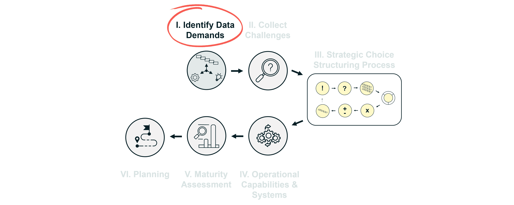

图 20：数据战略设计过程的步骤 I。

**战略需求**

作为集团战略设计的一部分，咸味零食公司选择通过构建一个新的加固杆来为国内业务增加竞争优势。所选的可能性包括集中所有主要 IT 系统（企业资源规划、客户关系管理、制造执行系统），从而实现跨越整个组织的管理系统。

因此，这家跨国咸味零食公司决定实施一项重大的 IT 整合计划，目标是集中所有国家的系统和相应的业务流程。

基于此，集团战略设计团队还选择为数据、分析和 AI 建立另一个加固杆，这应通过一个新的集团数据功能实现。例如，这包括协调所有国家的报告解决方案。

从几个区域销售功能战略中，另一个战略需求是为商店库存预测提供解决方案，如我们在第 5.1 节中看到的。

这些战略数据需求直接与组织的战略挂钩，确保数据功能支持组织的竞争优势。战略需求优先考虑，因为它们直接支持组织的胜利理论，而运营和未来的需求则解决基础和探索性需求。让我们来看看后两者。

**运营需求**

新数据功能的一个关键运营数据需求是确保协调一致的系统和中枢报告解决方案在推出时能够无缝替换现有的本地系统，而不会中断日常运营。在过渡阶段，现有的本地数据团队将负责维护当前运营仪表板和报告解决方案的连续性（例如，用于销售跟踪、库存和生产管理）。

**未来数据需求**

在为即将到来的数据战略设计过程做准备时，设计团队通过一系列与个别区域单位的访谈，发现了几个未来的数据需求。

其中一个未来的数据需求是在几个生产国计划中的数字化制造项目，该项目旨在通过充分利用数字和数据潜力来优化生产和质量。该项目的路线图包括潜在的数据用例，例如生产机械的预测过程调整。

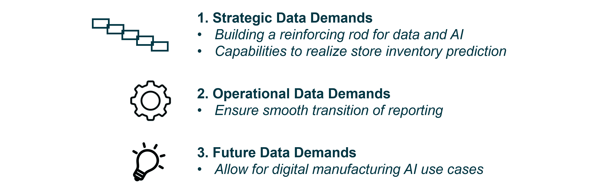

图 21：数据需求概述。

**战略设计团队**

设计数据战略的团队由来自公司数据功能和区域利益相关者的代表组成。

在公司层面，团队包括集团数据领导者，她负责数据战略，因为她负责集团数据功能。核心团队的其他成员包括数据治理专家和负责中枢报告框架的分析经理。作为集团 CEO 授权选择建立加固杆，他作为数据战略设计的赞助人。

从区域角度来看，核心团队包括德国分部的数据经理，他负责德国的数据、分析和 AI 需求和解决方案。此外，制造功能的代表也是核心团队的一员，以确保与当地需求保持一致，例如数字化制造倡议。

此外，还利用了外部主题专家进行战略设计、数据和文化的利用。这确保了合理的方法论，并允许从一开始就解决与变革相关的问题。

扩展团队由几个分析高手和有关键要求的相关利益方组成，他们根据需要参与。

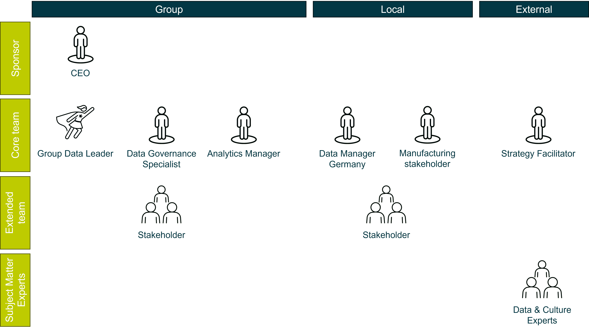

图 22：数据战略设计团队矩阵。

这种组合使得团队能够平衡企业优先事项与地区团队的特定需求。

### **6.2 步骤 II：收集挑战**

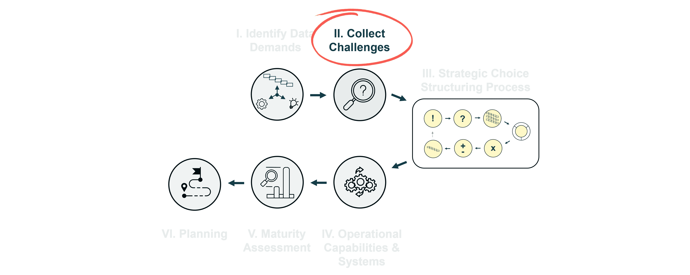

图 23：数据战略设计过程的步骤 II。

在准备阶段，对集团和地区单位各利益相关者的访谈揭示了与数据、分析和人工智能相关的最紧迫挑战。这些挑战需要在数据战略设计期间解决，以确保在最小化中断的同时，成功实施集中式数据功能，并最大化集团数据功能的价值。

以下是一些关键挑战：

**1 对未来状态的不确定性**

+   地区单位对集团数据功能的预期运营模型清晰度表示担忧，特别是关于他们在管理和利用数据方面的角色和自主权。

+   利益相关者指出，他们缺乏理解，即统一的系统和报告解决方案如何满足集团级和地区特定的需求。

**2 对集中的抵制**

+   几个地区对在需要临时报告或快速调整的情况下失去灵活性和响应能力表示担忧，尤其是在需要临时报告或快速调整的情况下。

+   担心一刀切解决方案无法满足当地业务细微差别，被列为采用的一个潜在障碍。

**3 技能和能力差距**

+   地区团队强调了适应新的集中式系统，特别是自助式分析和人工智能用例所需的培训和支援。

+   在利用预测分析用例方面，如数字制造计划中概述的，当地业务在技能和能力上存在差距。

**4 临时业务连续性风险**

+   在过渡阶段保持不间断的运营报告对当地团队来说仍然是首要任务，因为任何中断都可能影响销售、生产和库存管理等关键业务决策。

+   利益相关者强调了满足当地临时数据和分析需求所面临的挑战。他们表示，在推出之前，对哪些新本地解决方案值得在现有遗留环境中开发，以及哪些解决方案可以被降级表示不确定。

**5 与未来计划的协调**

+   设计团队指出，未来项目（如数字制造倡议）的成功将取决于建立一个强大且足够灵活的数据基础设施和架构，以支持预测性过程调优等新兴数据用例。

### 6.3 步骤 III：设计数据策略

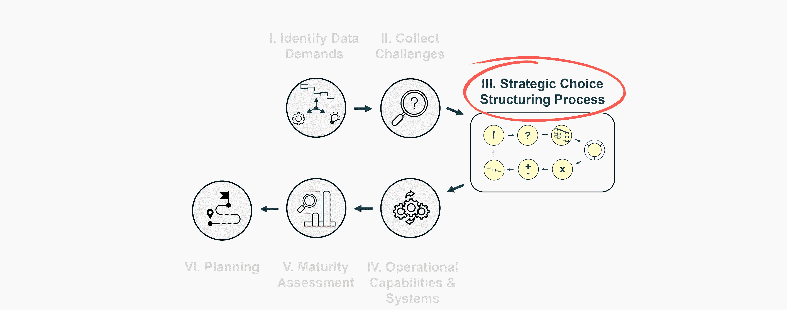

图 24：数据策略设计过程的第三步。

策略设计过程遵循图 7 中描述的战略选择结构化过程，该过程本身由 7 个步骤组成。

**第一步：问题定义**

数据策略设计团队首先定义了他们旨在解决的问题。团队将问题定义为：

> *“我们需要根据新集中的 IT 环境，在满足不同区域需求、保持业务连续性和实现未来数据驱动机会的同时，协调数据、分析和 AI 服务。”*

**第二步：我们如何做？**

“我们如何做”这个问题旨在激发数据功能策略的创新可能性，同时保持对交付价值和解决核心挑战的关注。

> *“我们如何通过协调的数据、分析和 AI 解决方案为我们的区域单位创造价值，同时解决它们的独特需求并与我们的集中 IT 环境和治理保持一致？”*

**第三步：可能性生成**

在定义问题和构建“我们如何做”的问题之后，团队生成了战略可能性。

*为了说明目的，我将示例的可能性限制为两个。这些可能性对比了构建和运营函数的不同方法，重点关注中央集权和区域自治的程度。通常，团队可以开发多达六个可能性，并对比其他方面，例如对外部专业服务公司的依赖程度或策略应具有的进攻性或防御性 [[14](https://hbr.org/2017/05/whats-your-data-strategy)]。*

**可能性“完全集中的数据功能”**

这个可能性设想了一个完全集中的数据功能治理和运营模型。所有主要数据、分析和 AI 活动，包括数据集成、治理、需求管理和解决方案交付，将由中央团队管理。区域单位作为数据消费者，依赖于中央团队统一提供的标准化报告框架、仪表板和分析解决方案，以确保一致性、可扩展性和效率。

**可能性“具有区域定制的联邦数据功能”**

这种可能性提出了一种联邦模型，将集中式治理与地区单位的显著自主权相结合。地区团队将在需求管理、分析开发以及利用数据科学/人工智能进行本地活动方面发挥积极作用，尤其是在数字制造等项目中。

**选择级联**

为了详细说明这两种可能性，团队为每个可能性完成了数据战略选择级联。这有助于团队对每个可能性有一个详细的共同理解。

明确必备能力和启用管理系统对于设计团队来说，已经是激活数据战略的第一步，因为它是对每个可能性的现实检查。

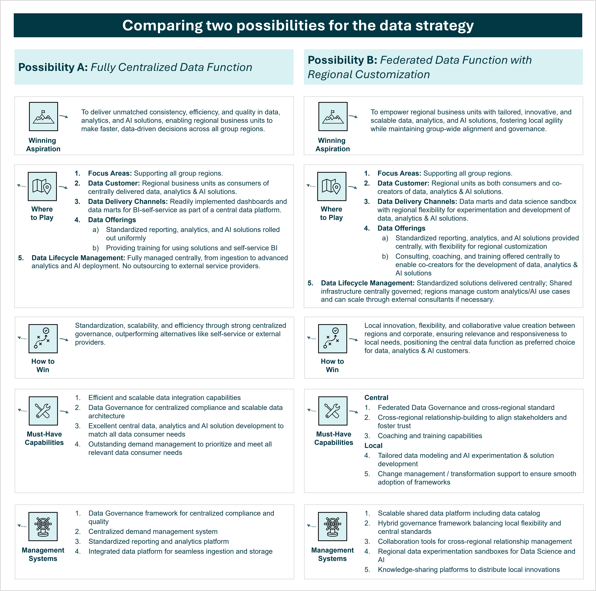

图 25：两种数据战略选择级联的比较 - 每个可能性一个。

**步骤 4：什么必须是真的？**

*为了不使本节内容过于膨胀，我将只关注战略选择结构化过程的步骤 4-6 中的可能性 B，因为它足以说明这个概念。*

收集了客户、公司和竞争的关键条件。

*回忆一下我们在第 4.2 节中为这个练习定义的公司和竞争的翻译。*

***客户***

1.  地区数据客户重视能够创建自己的数据解决方案来满足其特定国家的需求

1.  地区数据客户具备通过本地工具和实验定制分析和人工智能解决方案以适应其特定需求的能力。

1.  区域业务单元相信集中式治理框架能够，而不是阻碍，他们的创新能力和适应本地需求的能力。

***公司***

1.  核心数据团队能够提供有效的治理框架和工具，使地区能够创新，同时保持与集团标准的统一。

1.  地区团队成功开发并分享创新的使用案例和最佳实践，这些由当地团队评估并在其他合理地区采用。

1.  资源分配得有效，以平衡对中央治理和地区定制的支持，而不使任何一方过载。

1.  公司能够以成本效益的方式实施和维护联邦模型，确保资源分配支持中央和地方能力。

***竞争***

1.  联邦模型在提供更快、更集成、成本效益更高的分析和人工智能解决方案方面优于自行解决方法（例如使用 Excel）或外部咨询公司。

**步骤 5：选择障碍**

从这些关键条件中，数据战略设计团队对以下两点最缺乏信心：

***客户-3***: “区域业务单元相信集中式治理框架能够，而不是阻碍，他们的创新能力和适应本地需求的能力。”

信心低的原因是，区域业务单位历史上一直依赖本地数据专家或外部顾问来解决数据问题。不清楚数据消费者是否会接受新的中央权威。

***公司-4**： “公司可以以成本效益的方式实施和维护联邦模型，确保资源分配支持中央和地方的能力。”

信心低的原因是，当时团队对数据平台和工具的成本以及人员成本的了解不足，因为整体数据运营模型没有详细到足够的程度。

**步骤 6：测试与转型**

为了解决这些不确定性，数据策略设计团队开发了一系列测试来验证两个关键条件。

为了解决已识别的障碍，数据策略设计团队设计了两个有针对性的测试：

***测试 1（对新数据治理模型的信任度）***

设计团队创建了一个未来数据治理运营模型的草图，使本地数据消费者的影响更加具体。草案与当地关键利益相关者分享，并在下一个数据治理运营模型的设计迭代中纳入了他们的反馈。

***测试 2（成本效益的实施）***

设计团队制定了一个数据运营模型的第一稿，详细说明了估计技术未来总拥有成本的解决方案。他们还详细说明了为估计即将建立的数据功能未来人员成本所需的新专家角色。

这些测试提供了可操作见解，验证了假设并验证了可能性成功的潜力。

**步骤 7：选择**

在本例的背景下，数据策略设计团队决定追求联邦模型，因为它在更好地平衡区域创新和定制需求的同时，实现了集团的集中治理和对齐目标，提供了最高的获胜可能性。

### 6.4 步骤 IV-VI：激活策略

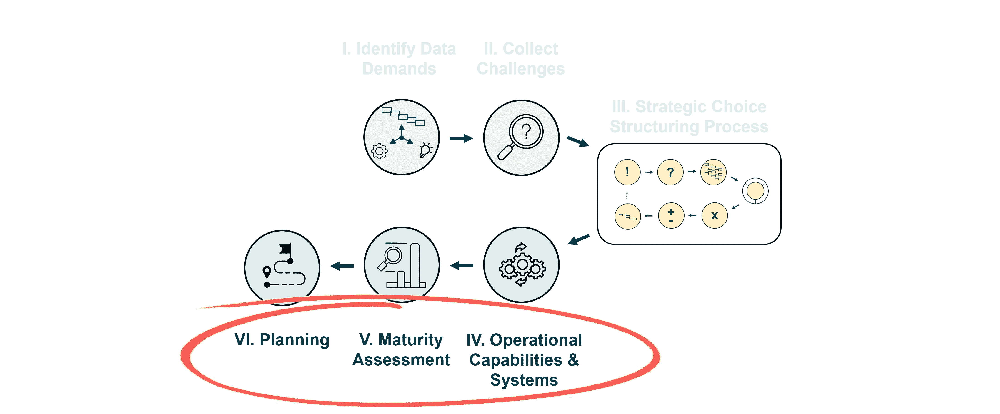

图 26：数据策略设计过程的步骤 IV-VI。

一旦选择 B 作为新的数据策略，接下来的任务就是通过解决实施要求来激活它。步骤 IV 到 VI 确保了在设计过程中做出的战略选择被转化为运营现实，使数据功能能够满足其战略需求。通过将数据策略与业务策略保持一致，组织确保数据能力直接支持其竞争目标。

**步骤 IV：确定运营能力和系统**

在步骤 III 中，作为数据战略的一部分定义了战略能力和系统后，设计团队确定了实施联邦模型所需的操作能力和支持管理系统。

关键的操作能力包括高效的报告生成。这些能力得到了 BI 和 ETL 工具以及数据质量监控系统等操作系统的补充。

**步骤 V：数据成熟度评估**

为了评估数据战略的准备工作，团队对所有需要激活战略的能力和系统以及所有地区进行了全面的数据成熟度评估。

他们使用交通灯评估指标来评估数据建模、报告和本地实验等领域当前的能力和系统。被评为“绿色”的能力和系统被认为可以采用数据战略，而那些标记为“黄色”或“红色”的则需要针对性的干预，形式为专门的项目来构建和维护新的能力和系统。

评估还揭示了实验和自助服务采用不发达的地区，为优先考虑成熟度建设努力提供了路线图。

**步骤 VI：构建数据、分析和人工智能能力的计划**

根据成熟度评估的结果，团队制定了一个分阶段的计划，以构建和维持所需的能力和系统，并优先考虑那些具有战略性质的因素。

每个地区都被分配了特定的里程碑，这些里程碑根据其成熟度水平定制，并具有明确的时限和成功指标。为了确保持续改进，计划中集成了反馈循环，使中央团队能够根据地区经验和不断变化的需求来完善工具和框架。

* * *

## 7 结论

本文旨在通过解决阻碍组织充分利用数据、分析和人工智能的常见误解来揭开数据战略的神秘面纱。

与流行观点相反，数据战略不是构建数据能力的计划，也不是管理数据的一套指南，或商业战略的补充元素。相反，它是一个功能战略——数据、分析和人工智能功能的战略，为内部客户提供数据服务。

数据战略是在组织整体商业战略的基础上设计的。定义组织如何利用数据实现竞争优势的是商业战略，而不是数据战略。

通过利用玩好赢框架，我证明了数据相关的战略选择必须嵌入到组织的业务战略中，形成稳健数据策略的输入。通过将数据用例创新整合到业务战略设计流程中，并得出明确战略需求，组织确保其数据战略作为功能性的推动者，提供直接支持竞争优势的能力。

使用咸味小吃公司的实际案例，我说明了组织如何应用这种方法来弥合理论与实践之间的差距。这个结构化的流程不仅使数据功能与业务需求保持一致，而且使数据成为竞争优势的关键驱动力。

那些继续将数据战略视为独立补充或技术倡议清单的组织，将无法实现其真正的潜力。相反，通过将数据相关的战略选择融入其业务战略的实质，他们可以构建一个统一、目标驱动的战略架构，使他们能够获胜。

数据、分析和人工智能的承诺不在于其技术复杂性，而在于其战略和文化的一致性。通过将数据创新嵌入到业务战略设计之中，组织可以超越数据炒作，利用数据作为真正的战略资产。

* * *

*我欢迎您的反馈、建议和问题。您同意、不同意，还是有其他想法？我期待在这里的 Medium 评论中与您进行讨论。*

* * *

## 参考文献

[1] 罗杰·马丁，《玩好赢/实践见解》（[Playing to Win/ Practitioner Insights](https://rogerlmartin.com/archive/medium-posts/-in-thought-pillars,strategy) (2024)），包含文章列表的网站

[1a] 罗杰·马丁，《你在问哪些策略问题？》（[What Strategy Questions are You Asking?](https://rogermartin.medium.com/what-strategy-questions-are-you-asking-587d32239a48) (2023)），《玩好赢实践见解》系列 Medium 文章

[1b] 罗杰·马丁，《克服策略家普遍的分析错误》（[Overcoming the Pervasive Analytical Blunder of Strategists](https://miro.com/app/board/uXjVL4NmYKK=/?moveToWidget=3458764610667414141&cot=14) (2021)），《玩好赢实践见解》系列 Medium 文章

[1c] 罗杰·马丁，《策略无处不在》（[Strategy, Strategy Everywhere](https://rogermartin.medium.com/strategy-strategy-everywhere-83e9d8a2fce9) (2023)），《玩好赢实践见解》系列 Medium 文章

[1d] 罗杰·马丁，《策略是单一的》（[Strategy is Singular](https://rogermartin.medium.com/strategy-is-singular-4876ac92a824) (2023)），《玩好赢实践见解》系列 Medium 文章

[1e] 罗杰·马丁，[玩到赢的起源](https://medium.com/@rogermartin/the-origins-of-playing-to-win-1d63af815797) (2023)，《玩到赢实践洞察》系列 Medium 文章

[1f] 罗杰·马丁，[(玩到赢) x 5 (2024)](https://medium.com/@rogermartin/playing-to-win-x-5-43fb814a89a6)，《玩到赢实践洞察》系列 Medium 文章

[1g] 罗杰·马丁，[战略是你所做，而非你所言](https://rogermartin.medium.com/strategy-is-what-you-do-not-what-you-say-a6e483840557) (2020)，《玩到赢实践洞察》系列 Medium 文章

[1h] 罗杰·马丁，[最佳战略破冰法](https://rogermartin.medium.com/the-best-strategy-icebreaker-0c9b6ae58461) (2024)，《玩到赢实践洞察》系列 Medium 文章

[1i] 罗杰·马丁，[战略选择结构化过程](https://medium.com/@rogermartin/the-strategic-choice-structuring-process-5e116b12ae1f) (2024)，《玩到赢实践洞察》系列 Medium 文章

[1j] 罗杰·马丁，[五种最致命的战略迷思](https://rogermartin.medium.com/the-five-deadliest-strategy-myths-7331995f68fd)，《玩到赢实践洞察》系列 Medium 文章

[1k] 罗杰·马丁，[为什么规划胜过战略？](https://rogermartin.medium.com/why-planning-over-strategy-88555015af3c) (2022)，《玩到赢实践洞察》系列 Medium 文章

[1l] 罗杰·马丁，[战略与规划：互补而非替代](https://rogermartin.medium.com/strategy-vs-planning-complements-not-substitutes-ea08e56809d6) (2024)，《玩到赢实践洞察》系列 Medium 文章

[1m] 罗杰·马丁，[从战略到规划](https://rogermartin.medium.com/from-strategy-to-planning-7555234d6cc8) (2021)，《玩到赢实践洞察》系列 Medium 文章

[1n] 罗杰·马丁，[战略即问题解决](https://rogermartin.medium.com/strategy-as-problem-solving-5c6fb9291d87) (2020)，《玩到赢实践洞察》系列 Medium 文章

[1o] 罗杰·马丁，[战略与设计思维](https://rogermartin.medium.com/strategy-design-thinking-faf6b787160b) (2020)，《玩到赢实践洞察》系列 Medium 文章

[1p] 罗杰·马丁，[将战略编织到整个企业中的秘诀](https://rogermartin.medium.com/the-secret-to-knitting-strategy-together-corporate-wide-827a3efdd53a) (2021)，《玩转胜利实践洞察》系列 Medium 文章

[1q] 罗杰·马丁，[企业战略与业务单元战略](https://rogermartin.medium.com/corporate-vs-business-unit-strategy-adb1163665da) (2022)，《玩转胜利实践洞察》系列 Medium 文章

[1r] 罗杰·马丁，[战略选择规划](https://rogermartin.medium.com/strategic-choice-chartering-3d56d8962ec3) (2020)，《玩转胜利实践洞察》系列 Medium 文章

[1s] 罗杰·马丁，[理解企业战略的真实构建块](https://rogermartin.medium.com/understanding-the-true-building-blocks-of-corporate-strategy-78f1f55e86b6) (2022)，《玩转胜利实践洞察》系列 Medium 文章

[1t] 罗杰·马丁，[谁应该制定战略？](https://rogermartin.medium.com/who-should-do-strategy-a5dcf4559b04) (2023)，《玩转胜利实践洞察》系列 Medium 文章

[1u] 罗杰·马丁，[克服综合战略挑战](https://rogermartin.medium.com/overcoming-the-integrative-strategy-challenge-9af0d670d083) (2024)，《玩转胜利实践洞察》系列 Medium 文章

[1v] 罗杰·马丁，[战略的失落艺术](https://rogermartin.medium.com/the-lost-art-of-strategy-5f95edbaa04b) (2021)，《玩转胜利实践洞察》系列 Medium 文章

[1w] 罗杰·马丁，[表面上看，对立的愚蠢是否存在？](https://rogermartin.medium.com/is-or-is-not-the-opposite-stupid-on-its-face-ab635b9c5582) (2024)，《玩转胜利实践洞察》系列 Medium 文章

[1x] 罗杰·马丁，[在战略选择中区分如何获胜与能力](https://rogermartin.medium.com/distinguishing-how-to-win-from-capabilities-in-your-strategy-choice-fd190484ccea) (2021)，《玩转胜利实践洞察》系列 Medium 文章

[1y] 罗杰·马丁，[你的战略能否通过最重要的测试？](https://rogermartin.medium.com/can-your-strategy-pass-its-most-important-test-59293df6b3a7) (2021)，《玩转胜利实践洞察》系列 Medium 文章

[1z] Roger Martin, [解开价值主张与竞争优势](https://rogermartin.medium.com/untangling-value-proposition-competitive-advantage-c3ab3ff91151) (2022), “赢得游戏实践洞察”系列 Medium 文章

[2] Sebastian Wernicke, [数据启发](https://www.vahlen.de/wernicke-data-inspired/product/35418267) (2024), 由 Vahlen 出版的德语书籍

[3] Caroline Carruthers 和 Peter Jackson, [数据驱动业务转型（2019）](https://carruthersandjackson.com/thought-leadership-our-books/), 由 Wiley 出版的书籍

[4] Quote Investigator, [引言起源：预测很难，尤其是关于未来的预测](https://quoteinvestigator.com/2013/10/20/no-predict/), 2025 年 1 月 4 日访问的网站

[5] Jens Linden, [为什么组织在数据与 AI 方面失败的根本原因](https://medium.com/towards-data-science/the-root-cause-of-why-organizations-fail-with-data-ai-0095a73cf5ab) (2024), 在[Toward Data Science](https://contributor.insightmediagroup.io/)上发表的 Medium 文章

[6] James Martin, [分布式数据处理的设计和策略（1981）](https://www.google.de/books/edition/Design_and_Strategy_for_Distributed_Data/RPKh4FzKNUgC?hl=de&gbpv=0&bsq=%22data%20strategy%22), 由 Prentice-Hall 出版的书籍

[7] Google Trends, [“数据策略”一词的全球关注度](https://trends.google.de/trends/explore?date=all&q=%22data%20strategy%22&hl=en) (2024), 网站

[8] Roger Martin, [计划并非策略](https://www.youtube.com/watch?v=iuYlGRnC7J8) (2022), 视频

[9] AWS, [什么是数据策略？](https://aws.amazon.com/what-is/data-strategy/) (2024), 2024 年 12 月 22 日访问的网站

[10] SAP, [什么是数据策略？](https://www.sap.com/resources/what-is-data-strategy) (2024), 2024 年 12 月 22 日访问的网站文章

[11] Wikipedia, [乐高电影](https://de.wikipedia.org/wiki/The_LEGO_Movie) (2014), WIKI 条目

[12] [Roger Martin 的网站](https://rogerlmartin.com/) (2024)

[13] A. G. Lafley 和 Roger L. Martin, [赢得游戏](https://rogerlmartin.com/lets-read/playing-to-win) (2013), 由 Harvard Business Review Press 出版的书籍

[14] Michael Goitein, [一位领先的战略专家如何结合设计思维和科学探究，让任何人都能创造获胜的策略](https://michaelgoitein.com/the-playing-to-win-framework-part-ii-the-strategy-process-map/), 2024 年 12 月 25 日访问的博客条目

[15] Roger Martin, Jennifer Riel, [关于管理职能你需要知道的一件事](https://hbr.org/2019/07/the-one-thing-you-need-to-know-about-managing-functions) (2019), 在《哈佛商业评论》上发表的文章

[16] Jennifer Riel, [如何让你的策略变得真实](https://www.ideou.com/blogs/inspiration/how-to-make-your-strategy-real) (2024), IDEOU 博客条目

[17] Jens Linden，[数据战略选择级联](https://contributor.insightmediagroup.io/the-data-strategy-choice-cascade-9f2742b81bda)（2024），发表于[Towards Data Science](https://contributor.insightmediagroup.io/)的 Medium 文章

[18] Alex Osterwalder，[使用我们全新的价值主张画布实现产品市场匹配](https://www.strategyzer.com/library/achieve-product-market-fit-with-our-brand-new-value-proposition-designer-canvas)（2012），于 2024 年 12 月 30 日访问的网站

[19] Jens Linden，[我们的数据成熟度是“反应型”还是“管理型”——现在怎么办？](https://www.linkedin.com/posts/jens-linden_datenreifegrad-informdatalab-datenstrategie-activity-7116025878249132032-3N6k)（2023），德语 LinkedIn 博客条目

[20] Andrew Campbell，Mikel Gutierrez，Mark Lancelott，[运营模型画布](https://operatingmodelcanvas.com/)（2017），由 Van Haren 出版的书籍

[21] Jens Linden，[数据与 AI 运营模型画布](https://www.linkedin.com/posts/jens-linden_ki-datenstrategie-datastrategy-activity-7131299437515010049-wCLE)（2023），德语 LinkedIn 博客条目

[22] Datentreiber，[Datentreiber 方法：数据与 AI 商业设计](https://www.datentreiber.de/en/method/)（2024），于 2024 年 12 月 30 日访问的网站

[23] 维基百科，[数据思维](https://en.wikipedia.org/wiki/Data_thinking)（2024），于 2024 年 12 月 30 日访问的网站条目

[24] Leandro DalleMule，[托马斯·H·达文波特 你的数据战略是什么？](https://hbr.org/2017/05/whats-your-data-strategy)（2017），发表于《哈佛商业评论》的文章

* * *

*除非另有说明，所有图片均为作者创作。*

*所有乐高插图均使用[MECABRICKS](https://www.mecabricks.com/)创建。*

*我使用了 ChatGPT 4o 作为对手，以生成一些示例想法。*
