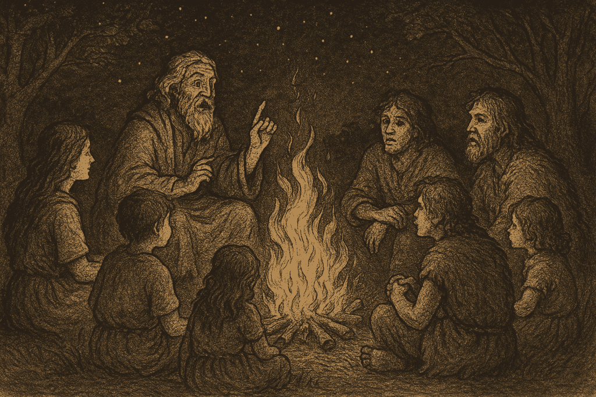
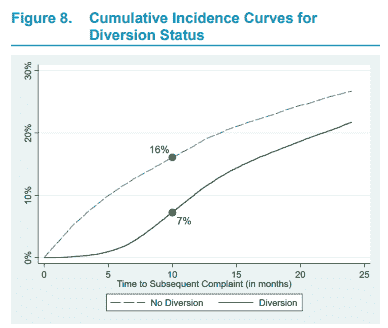
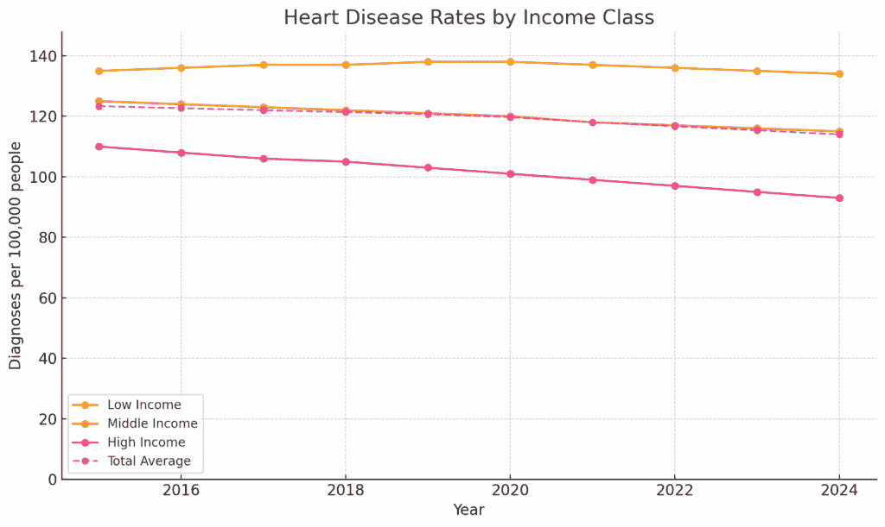
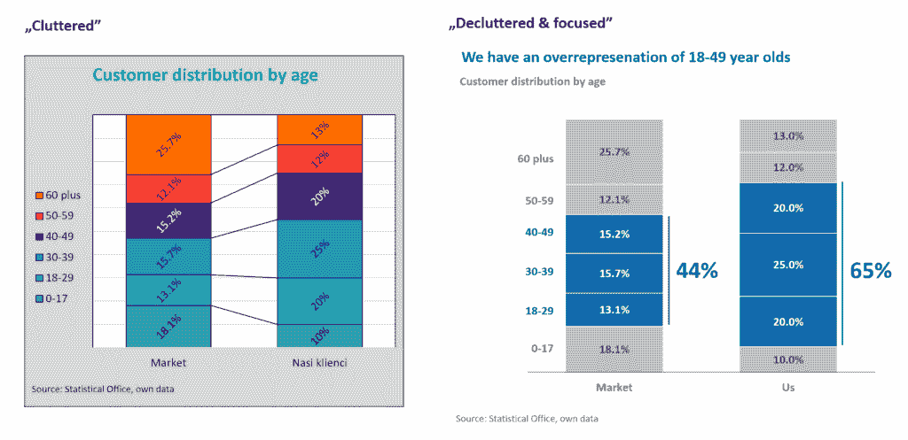
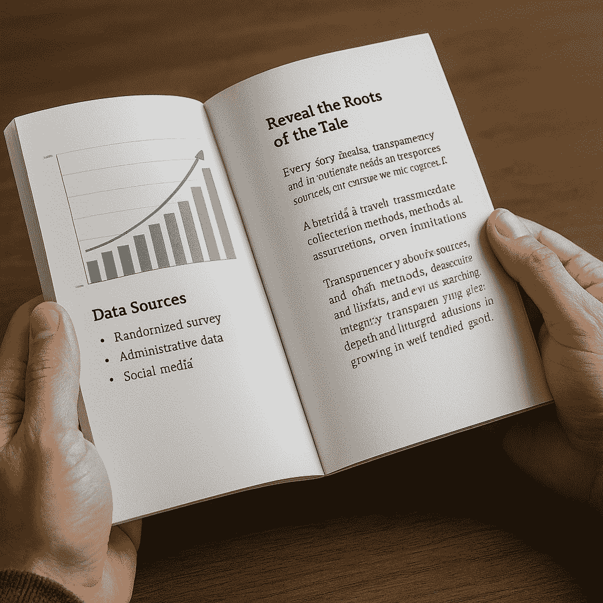

# 如何不通过你的数据驱动型故事误导他人

> 原文：[`towardsdatascience.com/how-not-to-mislead-with-your-data-driven-story/`](https://towardsdatascience.com/how-not-to-mislead-with-your-data-driven-story/)

<mdspan datatext="el1753297711561" class="mdspan-comment">数据驱动型叙事</mdspan>无处不在。有无数本书籍、文章、教程和视频，其中一些是我所写或制作的。

在我的经验中，这些资源往往倾向于以压倒性的积极光鲜地展示数据叙事。但最近，一个担忧一直萦绕在我心头：

### 如果我们的故事不是澄清，而是误导呢？

图像 1. 改变视角，你将看到完全不同的故事。照片由作者拍摄

上面的图片展示了我所在社区的一座公寓楼。现在，看看左边的照片，想象一下白色建筑中的一套公寓正在出售。你正在考虑购买它。你可能会关注周围的环境，尤其是卖家照片中呈现的那样。有什么不寻常的地方吗？可能没有，至少一开始没有。

立即的环境是否应该成为决定性因素？在我看来，不一定。它不是最风景如画或最迷人的地方——只是华沙一个普通社区的一个典型街区。或者呢？

让我们绕到建筑的后面走一走。惊喜：那里有一个公共洗手间。你还觉得这个地方不错吗？也许吧，也许不。**有一点很清楚：你肯定想知道未来阳台下面就有一个公共厕所。**

此外，公寓位于建筑的较低部分，而其他塔楼则在其上方升起。这也是一个可能很重要的因素。这两个“问题”肯定可以在价格谈判中提出。

**这个简单的例子说明了故事（在这种情况下，使用照片）如何容易被误解。从一个角度看，一切看起来都很正常，甚至很有吸引力。向右走几步，哦，天哪。**

同样的情况也可能发生在我们的“专业”生活中。如果观众确信他们正在做出基于信息、数据支持的决策，却被微妙地引导到错误的方向——不是通过错误的数据，而是通过数据呈现的方式？

**本文基于我在 2024 年撰写的一篇关于误导性视觉化的文章[1]。在这里，我想从一个更广阔的角度来看，探讨故事的结构和流程本身如何无意中（或故意地）引导人们得出错误的结论，以及我们如何避免这种情况。**

## 数据叙事是主观的

我们常常喜欢相信“数据会说话”。但在现实中，这很少发生。围绕数据集构建的每一个图表、仪表板或标题都是由人类的选择塑造的：

+   什么应该包含，

+   什么应该省略，

+   如何构建信息？

这突显了数据驱动型故事讲述的核心挑战：**它本质上是主观的**。这种主观性源于我们在证明我们想要证明的观点时所拥有的自由裁量权：

+   选择要展示的数据，

+   选择合适的分析技术，

+   决定要强调的论点，

+   以及甚至如何使用。

主观性也存在于解释中——无论是我们自己的还是我们受众的——以及他们采取行动的意愿。**这为偏见打开了大门。如果我们不小心，我们很容易从主观性跨越到不道德的故事讲述**。

本文探讨了数据故事讲述中嵌入的隐藏偏见以及我们如何从操纵过渡到有意义的见解。

## 我们需要故事

**主观与否，我们都需要故事**。故事对我们至关重要，因为它们帮助我们理解世界。它们承载着我们的价值观，保存着我们的历史，并激发我们的想象力。通过故事，我们与他人建立联系，从过去的经验中学习，并探索成为人类的意义。无论你的国籍、文化或宗教，我们都听过无数塑造我们的故事。这些故事是由我们的祖父母、父母、老师、朋友以及工作中的同事讲述的。故事唤起情感，激发行动，并塑造我们的身份，无论是个人还是集体。在每一种文化和每一个时代，讲故事都是理解生活、分享知识和构建社区的一种强大手段。

但尽管故事可以启迪，它们也可能误导。一个引人入胜的叙述有能力塑造感知，即使它扭曲了事实或过分简化了复杂问题。故事通常依赖于情感、选择性细节和一个清晰的信息，这使得它们具有说服力，但也可能危险地简化。当被粗心或操纵性地使用时，讲故事可能会加强偏见，掩盖真相，或基于情感而非理性做出决策。

在本文的下文中，我将探讨故事可能存在的潜在问题——特别是在数据驱动型环境中——以及它们的权力如何无意中（或有意地）误导我们的理解。

图片 2. 故事始终是我们生活中不可或缺的一部分。由作者在 ChatGPT 中生成的图像。

## 数据驱动型故事讲述中的叙事偏见

### 偏见 1. 数据远未达到解释阶段

这里是一个来自报告《“肯塔基州青少年司法改革评估：评估 SB 200 对青少年处置结果和种族及民族差异的影响。”》的视觉示例。[“Kentucky Juvenile Justice Reform Evaluation: Assessing the Effects of SB 200 on Youth Dispositional Outcomes and Racial and Ethnic Disparities.”](https://www.ojp.gov/pdffiles1/ojjdp/grants/255930.pdf)

图片 3. 来自“肯塔基州青少年司法改革评估…”的报告第 18 页的图像。

图表显示，在肯塔基州，如果年轻罪犯在第一次犯罪后通过一个分流项目，他们再犯的可能性会降低。这个项目将他们与社区支持联系起来，例如社会工作者和治疗师，以解决更深层次的生活挑战。**这是一个具有现实世界影响的强大叙事：它支持减少我们对昂贵刑事司法系统的依赖，为非营利组织增加资金提供了正当理由，并指出了改善生活的有意义方式。**

但问题是：除非你已经具备强大的数据素养和专业知识，否则这些结论不会立即从图表中显而易见。虽然报告确实提出了这个观点，但它直到近 20 页后才这样做。这是学术报道结构如何削弱故事影响力的一个经典例子。这是由于数据在一个部分以视觉形式呈现，而在文档的不同（有时是遥远的）部分以文本形式解释的结果。

### 偏差 2.缺失地图的故事：选择偏差

图像 4.照片 [Ashleigh Shea](https://unsplash.com/@ashleigh86?utm_content=creditCopyText&utm_medium=referral&utm_source=unsplash)，Unsplash

选择哪些数据点（樱桃😊）包括（以及哪些忽略）是偏见最强——并且通常最被忽视——的行为之一。也许没有哪个行业比大烟草业更好地说明了这一点。

他们现在著名的法律策略总结说出了所有：

> 是的，吸烟会导致肺癌，但不是起诉我们的人。

那个引用完美地捕捉了 20 世纪末期烟草诉讼的基调，当时公司面临着来自因吸烟而患病的客户的连串诉讼。尽管医学和科学界普遍达成共识，但烟草公司通常会使用一系列论点来推卸责任，这些论点虽然有时在法律上具有策略性，但在科学上却是荒谬的。

这里列出了他们根据这篇文章[2]在法庭上使用的四种最严重的选择偏差策略。

**选择偏差策略 1：在法律或修辞语境中使用“例外谬误”策略。**

> 是的，吸烟会导致癌症——但不是这种。

+   原告患有罕见的癌症，如细支气管肺泡癌（BAC）或粘液表皮样癌，他们声称这些癌症与吸烟没有确凿的联系。

+   在一个案例中，他们辩称癌症来自胸腺，而不是肺部，尽管有压倒性的医学证据。

**选择偏差策略 2：强调罕见的例外或罕见的癌症类型，以挑战普遍流行病学证据。**

> 不是我们的品牌。

+   “当然，烟草可能导致了疾病——但不是我们的香烟。”

+   在 Ierardi 诉 Lorillard 一案中，公司辩称原告接触含有石棉的香烟过滤嘴（Micronite）的时间发生在他们使用的狭窄 4 年窗口之外，尽管当时售出了 58.5 亿包香烟。

**选择偏差策略 3**：关注品牌或产品差异作为转移责任的方式。

在几个案例中，例如 Ierardi 诉 Lorillard 和 Lacy 诉 Lorillard，辩护方承认香烟可以致癌，但辩称原告：

+   在暴露时没有使用他们的品牌，

+   或者没有使用最危险的产品版本（例如，含有石棉的 Micronite 过滤器的 Kent 香烟），

+   或者没有使用最危险的产品版本（例如，含有石棉的 Micronite 过滤器的 Kent 香烟），

+   窗口年份之前，使得原告不太可能暴露。

这种策略将叙事从

> 我们的产品造成了伤害。

转变为

> 也许吸烟造成了伤害——但不是我们的。

**选择偏差策略 4**：强调每一个可能的风险因素——无论其可能性如何——以转移烟草的作用。

> 存在其他风险因素。

+   在许多诉讼中，公司指出了疾病的其他原因：石棉、柴油烟雾、酒精、遗传、饮食、肥胖，甚至辛辣食物。

+   在 Allgood 诉 RJ Reynolds 案中，辩护方将原告的病情部分归咎于他对“德克萨斯-墨西哥食品”的喜爱。

选择偏差并不总是显而易见。它可能隐藏在法律辩护、营销文案、仪表板甚至学术报告中。但当只有服务于故事的数据被讲述时，它就不再是洞察，而是开始变成操纵。

### 偏差 3：森林中的镜子：相同的数据如何讲述不同的故事

我们如何表述结果可能会扭曲解释。我们应该说“失业率降至 4.9%”还是“尽管有所改善，仍有数百万人失业”？两者都可以是准确的。区别在于**情感框架**。

从本质上讲，框架是一种战略性的叙事技巧，它可以显著影响故事被接收、理解和记忆的方式。通过理解框架的力量，讲述者可以创作出与听众产生深刻共鸣的叙事，并实现他们的目标。我在表 1 中提供了一些例子。

|   | **框架 A** | **框架 B** | **客观描述** |
| --- | --- | --- | --- |
| 失业 | *“失业率降至 5 年低点”* 表明进步、复苏和强有力的领导。 | *“尽管有所下降，仍有数百万人失业。”* 突出持续问题和未满足的需求。 | 失业率适度下降。 |
| 疫苗有效性 | *“COVID 疫苗将风险降低 95%”* 强调保护作用，鼓励接种。 | *“即使接种后，仍有 1/20 的人感染。”* 关注脆弱性和怀疑。 | 一项临床试验显示相对风险降低了 95%。 |
| 气候数据 | *“2023 年是记录中最热的一年。”* 引起对全球危机的关注。 | *“地球一直处于自然周期中。”* 暗示没有发生不寻常的事情。 | 长期温度记录。 |
| 公司财务报告 | *“第二季度收入增长 10%。”* 庆祝短期收益。 | *“仍低于大流行前的水平。”* 长期表现不佳。 | 季度收益报告。 |
| 选举民意调查 | *“候选人 A 领先 3 个百分点！”* 创造了一种动力的感觉。 | *“在误差范围内：比赛过于接近无法判断。”* 强调了不确定性。 | 一个误差为±3%的民意调查。 |
| 健康警告 | *“这种饮料含有 25 克糖。”* 听起来科学、中立。 | *“这种饮料含有超过六茶匙的糖。”* 听起来过量且危险。 | 25 克糖。 |

表 1. 同一个故事的不同的框架方式。由作者使用 ChatGPT 生成的示例。

### 偏差 4：“设计之龙：美如何迷惑真相”

视觉简化数据，但它们也可以**操纵感知**。在我的旧文章[1]中，我列出了 14 种欺骗性的可视化策略。以下是它们的总结。

1.  **使用错误的图表类型：** 选择混淆而不是澄清的图表——如 3D 饼图或不适用的比较——使得看到数据讲述的故事更加困难。

1.  **添加分散注意力的元素：** 在视觉中填充标志、装饰、深色网格线或杂乱无章的东西，隐藏了在噪音和视觉过载背后的重要见解。

1.  **过度使用颜色：** 使用过多的颜色可能会分散注意力。如果没有明确的颜色层次，则没有任何东西会突出，观众会感到不知所措。

1.  **随机数据排序：** 打乱类别或时间序列数据会掩盖模式并阻止清晰的比较。

1.  **操纵坐标轴刻度：** 截断 y 轴夸大了差异。延长它最小化了有意义的变异。两者都扭曲了感知。

1.  **创造趋势错觉：** 使用不一致的时间框架、选择性的数据点或间距不佳的坐标轴，使非趋势看起来很重要。

1.  **选择性地挑选数据：** 只展示支持你观点的数据部分，忽略整个故事或矛盾的证据。

1.  **省略视觉提示：** 移除标签、图例、网格线或坐标轴刻度，使数据难以解释，或难以挑战。

1.  **图表过载：** 在一个图表中塞入太多数据可能会分散注意力并造成混乱，尤其是在关键数据被埋藏在视觉混乱中时。

1.  **仅显示累积值：** 使用累积图暗示平稳的进步，同时隐藏个别时期的波动或下降。

1.  **使用 3D 效果：** 3D 图表扭曲了感知，使比较更加困难，通常会导致关于大小或比例的误导性信息。

1.  **应用渐变和阴影：** 华丽的纹理或渐变会转移焦点，并给可能不配得到这种关注的区域增加视觉重量。

1.  **误导性或模糊的标题：** 中立或技术性的标题可能会淡化发现的重要性。一个戏剧性的标题可能会夸大微小的变化。

1.  **使用垃圾图表：** 视觉上过度设计、复杂或过于艺术化的图表，难以解释且容易误读。

### 偏差 5：“故事编织机：但谁握着线头？”

现代工具如**Power BI Copilot**或**Tableau Pulse**正越来越多地为您生成摘要和“洞察”。更不用说由 ChatGPT 或 Gemini 等 LLM（大型语言模型）准备的摘要、叙述或整个演示文稿了。

但这里有个问题：

**这些工具是在模式上训练的，而不是在伦理上。**

AI 无法判断它是否在创造误导性的故事。如果你的提示或数据集有偏见，输出很可能也会有偏见，并且是在**机器规模**上。

这引发了一个关键问题：我们是使用 AI 来民主化洞察，还是为了**大量生产叙事操纵**？

图片 5：由[Aerps.com](https://unsplash.com/@almoya?utm_content=creditCopyText&utm_medium=referral&utm_source=unsplash)在[Unsplash](https://unsplash.com/photos/hand-holding-a-phone-with-ai-application-icons-5Gv-6g_lu-Y?utm_content=creditCopyText&utm_medium=referral&utm_source=unsplash)提供的照片

最近 BBC 的一项调查发现，领先的 AI 聊天机器人经常扭曲或错误地表述当前事件，即使它们以 BBC 文章为来源。测试的回应中超过一半存在重大问题，包括过时的事实、编造或篡改的引语，以及意见和报道之间的混淆。例子包括错误地声称里希·苏纳克仍然是英国首相，到在备受瞩目的刑事案件遗漏关键法律背景。BBC 高管警告说，这些不准确之处威胁到公众对新闻的信任，并敦促 AI 公司与出版商合作，以提高透明度和问责制。[3]

**感到不知所措？你只看到了开始。数据叙事可能会受到许多认知偏差的影响，每个都微妙地扭曲了叙事。**

以**确认偏差**为例，讲述者只强调支持他们假设的数据——宣称*“我们的活动是成功的！”*——而忽略相反的证据。然后是**结果偏差**，它将成功归因于合理的策略：*“我们推出了产品，它取得了成功，所以我们的方法完美无缺，”*即使运气发挥了重要作用。

**幸存者偏差**只关注赢家——扩展规模的初创公司或病毒式传播的活动，而忽略了使用相同方法失败的大多数。**叙事偏差**简化了复杂性，将混乱的现实塑造成整洁的结论，例如*“吸电子烟总是更安全，”*而没有足够的背景。

**锚定偏差**导致人们专注于最初呈现的数字——比如 20%的预测——扭曲了后续信息的解释。**遗漏偏差**出现在重要数据被遗漏的情况下，例如，只突出表现良好的地区，而忽略表现不佳的地区。

**投影偏差**假设其他人会以分析师相同的方式解读数据：“这个仪表盘自说自话”——然而，这可能并不准确，尤其是对于不熟悉背景的股东来说。**规模偏差**通过不成比例的框架误导——*“增长了 300%！”听起来很令人印象深刻，直到你了解到它只是从一位用户增长到三位用户**。

最后，**因果偏差**从相关性中得出没有根据的结论：“我们添加弹出窗口后，用户停留时间更长——他们一定很喜欢！”——而没有测试弹出窗口是否是真正的原因。

## 如何“去偏见”数据叙事

**每个数据故事都是一个选择**。在一个注意力持续时间短、AI 写作速度超过人类的世界里，这些选择比以往任何时候都更有力量——也更危险。

作为数据科学家、分析师和叙事者，我们必须以与应用于统计模型相同程度的严谨和深思熟虑来处理叙事选择。从数据中构建故事不仅仅是关于清晰度或参与度——它关乎责任。我们在框架、强调和解释中做出的每一个选择都会塑造他人对真相的看法。最终，最危险的故事不是虚假的，而是那些感觉像事实的故事。

在本文的这一部分，我将分享几个实用的策略，帮助您加强您的数据叙事能力。这些想法将侧重于如何既引人入胜又令人信服——如何构建既能吸引观众又不会过度简化或误导他们的叙事。因为当做得好时，数据叙事不仅仅是传达洞察力——它建立信任。

### 策略 1：智慧巫师的规则：提问，而不是施法

在数据和分析的领域，最有洞察力的叙事者不会以戏剧性的方式宣布他们的结论——他们以深思熟虑的问题为起点。他们不是提出大胆的声明，而是通过提问来邀请反思：“你看到了什么？”这种方法鼓励他人自己发现洞察力，培养理解而不是被动的接受。

考虑一个显示测试成绩下降的图表。表面上的解释可能会立即声称，“我们的学校失败了，”引发担忧或指责。但更仔细、更分析性的回应会是，“什么因素可以解释这种变化？是不是新的测试格式、学生人口结构的变化，或者其他什么原因？”同样，当新功能推出后销售上升时，人们可能会倾向于将增长完全归因于该功能。然而，更严谨的方法会问，“在这个时期，还有哪些其他变量发生了变化？”

通过提出问题，我们为解释、对话和更深入的思考创造了空间。这种方法防止了错误的确定性，并鼓励更协作、更深思熟虑的数据探索。一个强大的叙事应该引导观众，而不是强迫他们走向预定的结论。

### 策略 2：多真理的镜像：提供反叙事

良好的数据叙事不仅仅停留在单一的解释上。复杂的数据库通常允许多种有效的视角，而叙事者的责任就是承认这些视角。提出一个反叙事——“这是另一种看待这个问题的方法”——可以激发批判性思维并建立可信度。

例如，一个图表可能显示心脏病发病率总体呈下降趋势。这似乎是一个成功。但更仔细的观察可能会揭示，这种改善主要集中在高收入地区，而农村或服务不足地区的发病率仍然很高。同时呈现这两种观点——进步和差异——可以提供一个更全面和真实的对问题的描述。

通过提供反叙事，我们防止过度简化，并帮助我们的观众理解数字背后的细微差别。

图像 6. 添加收入阶层维度可以更好地发现洞察力。由 ChatGPT 生成的图表，数据是假的。

### 策略 3：扭曲图表的诅咒：避免欺骗性视觉

视觉信息强大，但这种力量必须负责任地使用。误导性的图表可以通过微妙的技巧扭曲感知，例如夸大差异的截断轴，未标记的单位模糊了比例，或者装饰性的杂乱分散了信息。为了避免这些陷阱，始终清晰地标记轴，在适当的时候从零开始刻度，并选择最适合数据的图表类型，而不仅仅是它们的美观。欺骗并不总是出于恶意——有时只是设计上的疏忽。但无论如何，它都会侵蚀信任。一个干净、诚实的视觉信息远比一个隐藏细节的华丽视觉信息更有说服力。

图像 7. 同一个视觉的两种版本。一个是讲述故事，另一个…？图像由作者提供。

以 **图像 7** 中显示的两个图表为例。左边的图表杂乱无章，难以解读。其标题模糊，过度使用颜色分散了注意力，不必要的元素——如粗边框、网格线和阴影——只会增加混乱。没有视觉线索来引导观众，使观众只能猜测作者试图表达什么。

相比之下，右边的图表效果更佳。它去除了噪音，只用了三种颜色：灰色用于背景，蓝色突出关键信息，干净的白色背景。最重要的是，标题传达了主要信息，使观众能够一眼抓住要点。

### 策略 4：诚实地谈论阴影：拥抱不确定性的智慧

不确定性是处理数据的一个固有部分，承认它并不会削弱你的故事——反而会增强你的可信度。关于不确定性的透明度是负责任的数据沟通的一个标志。当你传达诸如置信区间、误差范围或模型背后的假设等元素时，你不仅是在技术上准确，你还在展示诚实和谦逊。这表明你尊重你的观众处理复杂性的能力，而不是为了保持一个干净的叙事而过度简化。

不确定性可能来自各种来源，包括样本量有限、嘈杂或不完整的数据、变化的条件或预测模型中固有的假设。而不是忽视或平滑这些限制，好的讲述者会将它们带到前台——无论是视觉上还是口头上的。这样做鼓励批判性思维，也为讨论打开了大门。它还保护你的工作免受误解、误用或对结果过度自信的影响。简而言之，通过公开数据无法告诉我们的事情，我们给予了它更多的权重。以下，我展示了如何在你的数据故事中包含关于不确定性的信息的几个示例。

1.  **置信区间的更新**

    而不是：“下个季度收入将增长 15%。”

    使用：“我们预测增长 15%，置信区间为 12%–18%。”

1.  **留出误差范围。**

    而不是：“客户满意度为 82%。”

    使用：“客户满意度为 82%，±3%的误差范围。”

1.  **缺失数据指示器**

    在图表上使用视觉提示，如褪色的条形、虚线或阴影区域，以表示差距。

    添加脚注：“由于报告延迟，第二季度的数据不完整。”

1.  **模型假设**

    示例：“这个预测假设用户行为或市场条件没有发生重大变化。”

1.  **多种情景**

    提出最佳情况、最坏情况和最可能的情况，以反映一系列可能的后果。

1.  **概率性语言**

    而不是：“这将会发生。”

    使用：“在当前条件下，有 70%的可能性出现这种结果。”

1.  **数据质量备注**

    突出显示小样本量或自我报告数据等问题：

    “结果基于 100 名受访者的调查，可能无法反映更广泛的群体。”

1.  **图表上的误差条**

    通过在图表中包含误差条或阴影置信区间来直观地展示不确定性。

1.  **限制透明度**

    示例：“这项分析没有考虑到季节性变化或外部经济因素。”

1.  **定性说明**

    在演示或仪表板上使用标题或注释：

    “数据趋势具有指示性，但需要进一步验证。”

你可能会想，“*但强调这些不确定性不会削弱我的故事或让我看起来对结果不确定吗？*”**恰恰相反，承认不确定性并不表示缺乏信心；它显示了深度、专业性和诚信**。它向你的听众传达，你理解数据的复杂性，并且不是试图过度推销一个简单的结论。分享你所知道的同时，也分享你所不知道的，创造了一个更加平衡和可信的叙述。人们更有可能信任你的见解，当他们看到你在诚实地谈论局限性。这并不是关于削弱你的故事——而是关于将它建立在现实之上。

### 策略 5：揭示故事的根源：让真相与来源同行

每个故事都需要根基，在数据故事讲述的世界里，这些根基就是你的来源。一个漂亮的图表或引人注目的数字，如果听众看不到它的来源，就微不足道。这是一项随机调查？行政数据？社交媒体抓取？就像旅行者信任知道路线的向导一样，读者更可能信任你的见解，当他们能够追溯到它们的起源时。关于数据来源、收集方法、假设甚至局限性的透明度，不是弱点的标志——而是诚信的标志。当我们揭示故事的根源时，我们为我们的故事增添了深度、可信度和韧性。明智的决策只能在精心耕种的土壤中成长。

图像 8：作者在 ChatGPT 中生成的图像。

## 结束语

数据驱动型讲故事既是艺术也是责任。它赋予我们使信息有意义的力量——但也赋予我们误导他人的力量，即使是无意的。在这篇文章中，我们探索了一片森林般的偏见、设计陷阱和叙事诱惑，它们可以微妙地塑造感知并扭曲真相。无论你是数据科学家、传播者还是决策者，你的故事都有分量——不仅在于它们展示了什么，还在于它们是如何讲述的。

所以让我们讲述那些启迪人心而非遮蔽视线的故事。让我们以问题开头，而非结论。让我们揭示不确定性，而非躲在虚假的清晰背后。最重要的是，让我们将我们的见解建立在透明来源和谦逊的解释之上。**目标不是完美——而是诚信**。因为在充满噪音和叙事操纵的世界里，你能讲述的最有力的故事是既清晰又诚实的故事。

最后，讲故事不是关于控制信息——而是关于赢得信任。一旦信任失去，就难以挽回**。所以请仔细选择你的故事。用心塑造它们。记住：真相可能并不总是引人注目，但它总会找到光明之路。**

还有一点：如果你曾经发现（或无意中创造了）一个有偏见的数据故事，请在评论中分享你的经验。我们越能揭露这些叙事，我们所有人就越擅长讲述数据真相，而不仅仅是数据故事。

### 参考文献

[1] [如何避免在数据可视化中作弊](https://towardsdatascience.com/how-not-to-cheat-with-data-visualizations-46fa9c8e13b0/), 米哈尔·苏德耶科，数据科学趋势

[2] [烟草制造商针对原告关于癌症因果关系的索赔进行辩护：向墙上泼泥，希望其中一些能粘住](https://pmc.ncbi.nlm.nih.gov/articles/PMC2563590/), 多位作者，国家医学图书馆

[3] [BBC 发现，当被问及时事时，AI 聊天机器人会扭曲和误导](https://www.theguardian.com/technology/2025/feb/11/ai-chatbots-distort-and-mislead-when-asked-about-current-affairs-bbc-finds), 马修·韦弗

### 免责声明

*这篇文章最初是用 Microsoft Word 编写的，拼写和语法都经过 Grammarly 检查。我审查并调整了任何修改，以确保我的意图得到准确反映。所有其他 AI 的使用（例如图像和样本数据生成）都直接在文本中披露。*
