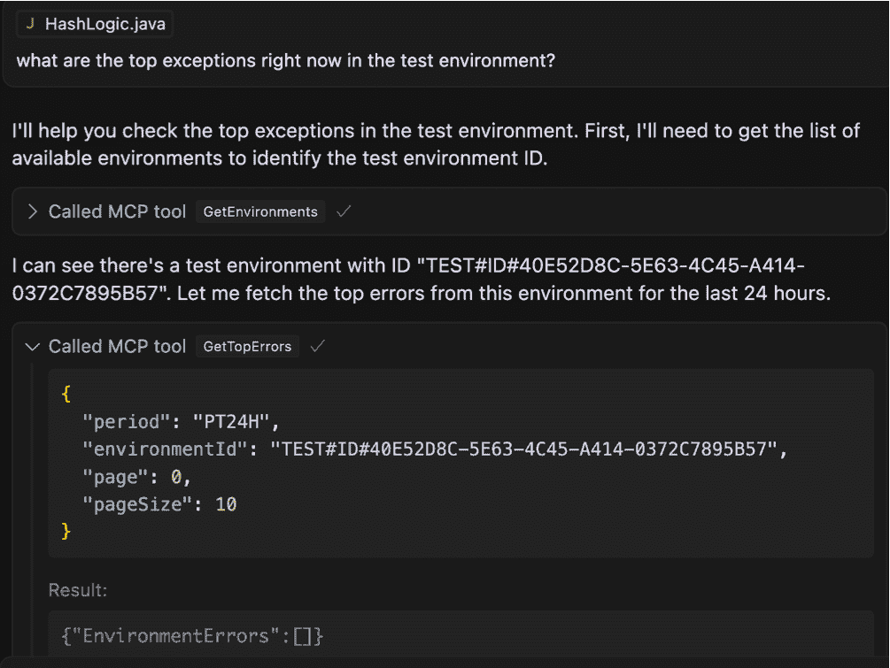
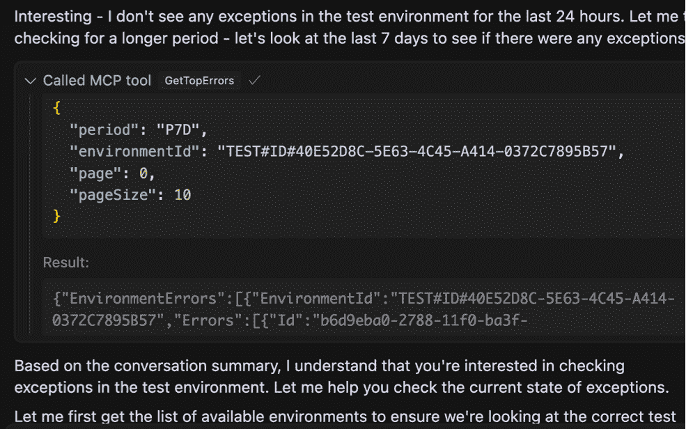
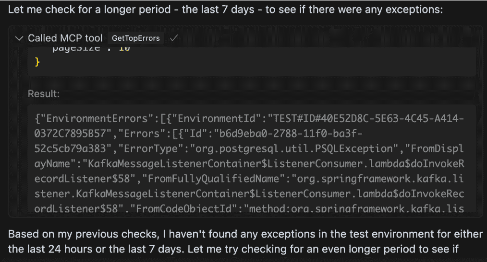
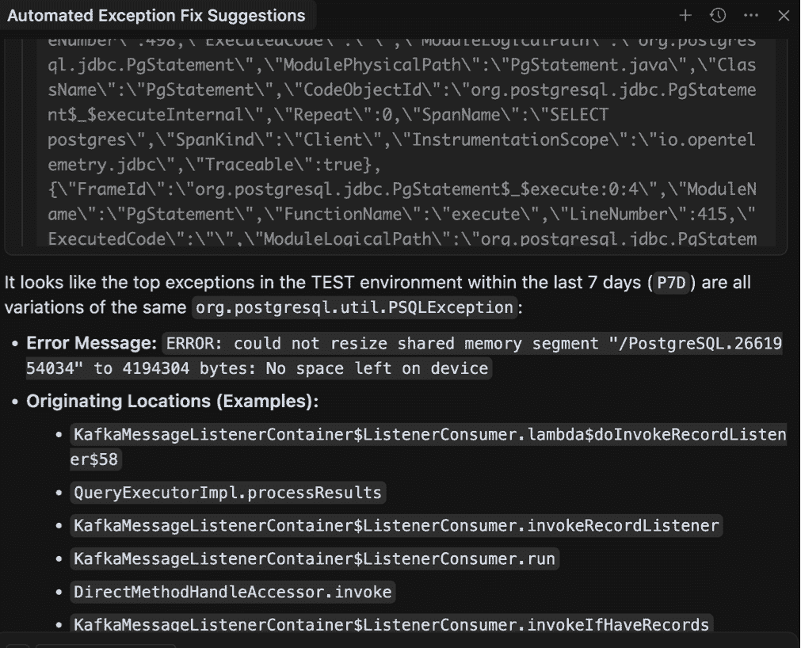
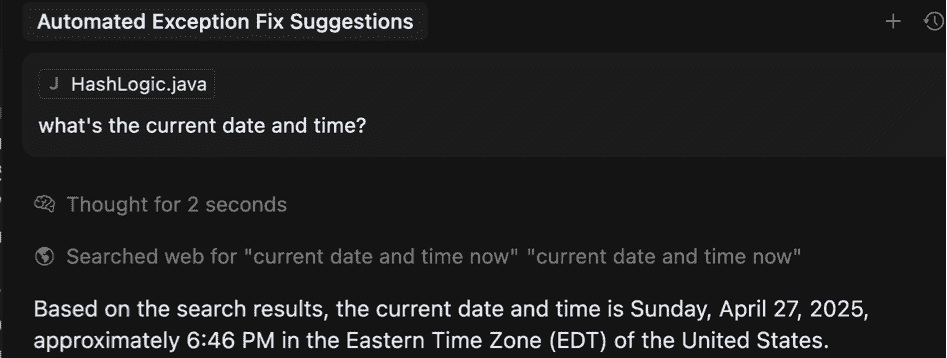
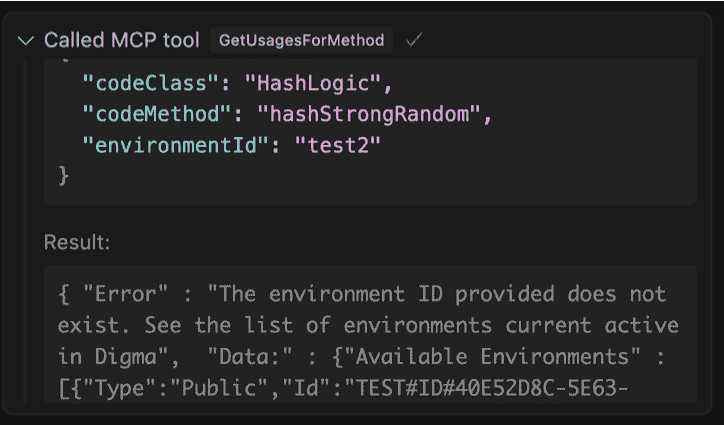
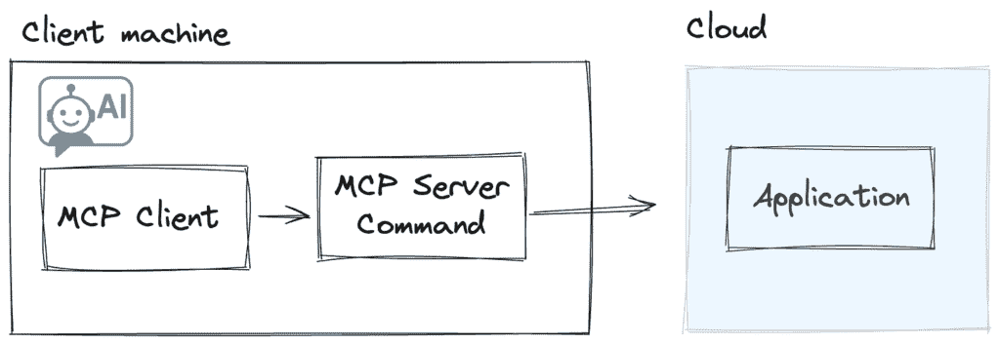
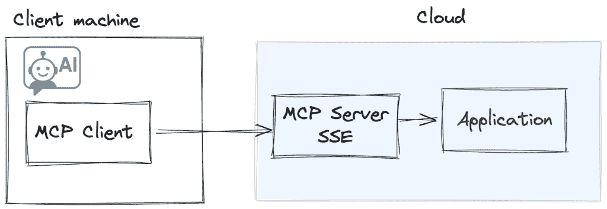

# 如何不编写 MCP 服务器

> 原文：[`towardsdatascience.com/how-not-to-write-an-mcp-server/`](https://towardsdatascience.com/how-not-to-write-an-mcp-server/)

我最近有机会为观测性应用创建一个 MCP 服务器，以便为 AI 代理提供动态代码分析能力。由于其能够改变应用，MCP 是一项让我比最初对通用人工智能（genAI）更兴奋的技术。我在之前的[文章](https://towardsdatascience.com/a-farewell-to-apms-the-future-of-observability-is-mcp-tools/)中对此有更多描述，并对 MCP 的一般介绍进行了简要说明。

虽然初步的 POC 证明了这有可能成为我们产品价值的倍增器，但实现这一承诺需要多次迭代和几次失误。在这篇文章中，我将尝试总结一些学到的经验，我认为这可以造福其他 MCP 服务器开发者。

### 我的栈

+   我间歇性地使用[Cursor](https://www.cursor.com/)和[vscode](https://code.visualstudio.com/docs/copilot/chat/mcp-servers)作为主要 MCP 客户端

+   为了开发 MCP 服务器本身，我使用了[.NET MCP SDK](https://github.com/modelcontextprotocol/csharp-sdk)，因为我决定将服务器托管在另一个用.NET 编写的服务上

### 经验教训 1：不要把所有数据都倾倒给代理

在我的应用中，一个工具返回关于错误和异常的聚合信息。API 非常详细，因为它服务于一个复杂的 UI 视图，并输出大量深度链接的数据：

+   错误框架

+   受影响的端点

+   栈跟踪

+   优先级和趋势

+   直方图

我的第一直觉是简单地**原样**暴露 API 作为 MCP 工具。毕竟，代理应该比任何 UI 视图更能理解它，并捕捉到事件之间有趣或相关的细节。我心中有几个场景，关于我预期这些数据将如何有用。代理可以自动为生产或测试环境中记录的最近异常提供修复方案，让我知道突出的错误，或帮助我解决一些系统性问题，这些问题是问题的根本原因。

因此，基本前提是允许代理发挥其“魔法”，更多的数据可能意味着代理在调查努力中可以抓取更多的钩子。我迅速在 MCP 端点的 API 周围编写了一个包装器，并决定从一个基本的提示开始，看看是否一切正常：



图片由作者提供

我们可以看到代理足够聪明，知道它需要调用另一个工具来获取我提到的那个‘**测试**’环境的环境 ID。有了这个，在发现实际上过去 24 小时内没有最近的异常之后，它就擅自扫描了一个更长时间段，这时事情变得有点奇怪：



图片由作者提供

这是一个奇怪的响应。代理查询过去七天的异常，这次得到了一些有形的结果，但随后又开始漫无目的地闲聊，好像完全忽略了数据。它继续尝试以不同的方式和不同的参数组合使用工具，显然是手忙脚乱，直到我注意到它直接指出数据对它来说完全不可见。虽然错误被发送回响应中，但代理实际上声称**没有错误**。这是怎么回事？



图片由作者提供

经过一番调查，问题揭示出来，原来是我们已经达到了代理处理大量数据的响应能力的极限。

我使用了一个非常冗长的现有 API，我最初甚至认为这是一个优点。然而，最终的结果是我无意中让模型不知所措。总的来说，响应 JSON 中有大约 360k 个字符和 16k 个单词。这包括调用栈、错误帧和引用。这**应该**仅通过查看我使用的模型（Claude 3.7 Sonnet 应支持多达 200k 个标记）的上下文窗口限制就能得到支持，但无论如何，大量的数据倾倒让代理彻底困惑。

一种策略是改变模型，使其支持更大的上下文窗口。我切换到**Gemini 2.5 pro**模型只是为了测试这个理论，因为它声称有一个令人难以置信的 100 万个标记的限制。果然，同样的查询现在得到了一个更加智能的响应：



图片由作者提供

这太好了！代理能够解析错误并使用一些基本的推理找出许多错误的系统原因。然而，我们不能依赖用户使用特定的模型，而且事情更复杂，这是从相对低带宽的测试环境中输出的。如果数据集更大会怎样呢？

为了解决这个问题，我对 API 的结构进行了根本性的改变：

+   **嵌套数据层次结构**：保持初始响应专注于高级细节和汇总。根据需要创建一个单独的 API 来检索特定帧的调用栈。

+   **增强可查询性：**到目前为止，代理使用的所有查询都使用了非常小的数据页面大小（10），如果我们想让代理能够访问更多与上下文限制相符的相关数据子集，我们需要提供更多 API 来根据不同的维度查询错误，例如：受影响的方法、错误类型、优先级和影响等。

随着新更改的实施，该工具现在一致地分析重要的新异常，并提出修复建议。然而，在我能够可靠地使用它之前，我还需要解决另一个小细节。

### 第 2 课：现在是什么时间？


由作者使用 Midjourney 生成的图像

留意细节的读者可能已经注意到，在前一个例子中，为了检索特定时间范围内的错误，代理使用的是**ISO 8601 时间持续时间**格式，而不是实际的日期和时间。因此，而不是包含带有日期和时间值的标准“**从**”和“**到**”参数，AI 发送了一个持续时间值，例如，七天或**P7D**，以表示它想要检查过去一周的错误。

这种情况的原因有些奇怪——**代理可能不知道当前的日期和时间！**你可以通过询问代理这个问题来验证这一点。如果不是因为我是在 5 月 4 日中午左右输入这个提示，下面的内容是有意义的…



作者的图像

使用时间**持续时间**值证明是一个很好的解决方案，代理处理得相当不错。不过，别忘了在工具参数描述中记录预期的值和示例语法！

### 第 3 课：当代理犯错误时，展示如何做得更好

在第一个例子中，我实际上对代理如何解析不同工具调用之间的依赖关系感到惊讶，以便提供正确的环境标识符。在研究 MCP 合同时，它意识到它必须调用另一个依赖的工具来首先获取环境 ID 列表。

然而，在响应其他请求时，代理有时会直接引用提示中提到的环境名称。例如，我注意到在回答这个问题时：**比较测试环境和生产环境中此方法的慢速跟踪，是否存在任何显著差异？**根据上下文，代理有时会使用请求中提到的环境名称，并将字符串“test”和“prod”作为环境 ID 发送。

在我的原始实现中，我的 MCP 服务器会在这种情况下静默失败，返回一个空响应。代理在收到没有数据或通用错误后，会简单地退出并尝试使用另一种策略来解决请求。为了抵消这种行为，我迅速修改了我的实现，使得如果提供了不正确的值，JSON 响应将确切地描述出了什么问题，并提供一个有效的可能值列表，以节省代理再次调用工具。



图片由作者提供

这对于代理来说已经足够了，通过从错误中学习，它重复了带有正确值的调用，并且 somehow 也避免了在未来犯同样的错误。

### 第 4 课：关注用户意图而不是功能

虽然简单地描述 API 正在做什么很有诱惑力，但有时通用术语并不完全允许代理意识到这种功能可能最适合的应用类型。

让我们举一个简单的例子：我的 MCP 服务器有一个工具，对于每个方法、端点或代码位置，都可以在运行时指示其如何被使用。具体来说，它使用跟踪数据来指示哪些应用程序流程到达了特定的函数或方法。

原始文档只是简单地描述了这一功能：

```py
[McpServerTool,
Description(
@"For this method, see which runtime flows in the application
(including other microservices and code not in this project)
use this function or method.
This data is based on analyzing distributed tracing.")]
public static async Task<string> GetUsagesForMethod(IMcpService client,
[Description("The environment id to check for usages")]
string environmentId,
[Description("The name of the class. Provide only the class name without the namespace prefix.")]
string codeClass,
[Description("The name of the method to check, must specify a specific method to check")]
string codeMethod)
```

上述内容是对这个工具功能的有效描述，但它并不一定清楚地说明了它可能相关的活动类型。在看到代理没有选择这个工具来应对我认为非常有用的各种提示后，我决定重写工具描述，这次强调使用案例：

```py
McpServerTool,
Description(
@"Find out what is the how a specific code location is being used and by
which other services/code.
Useful in order to detect possible breaking changes, to check whether
the generated code will fit the current usages,
to generate tests based on the runtime usage of this method,
or to check for related issues on the endpoints triggering this code
after any change to ensure it didnt impact it"
```

更新文本帮助代理理解**为什么**这些信息是有用的。例如，在做出这个更改之前，代理甚至不会在类似以下提示的情况下触发工具。现在，它已经变得完全无缝，用户无需直接提及应该使用这个工具：

![图片

图片由作者提供

### 第 5 课：记录你的 JSON 响应

JSON 标准，至少在官方上，不支持注释。这意味着如果 JSON 是代理唯一可以依赖的东西，它可能缺少一些关于你返回的数据上下文的线索。例如，在我的聚合错误响应中，我返回了以下**分数**对象：

```py
"Score": {"Score":21,
"ScoreParams":{ "Occurrences":1,
"Trend":0,
"Recent":20,
"Unhandled":0,
"Unexpected":0}}
```

没有适当的文档，任何非先知代理都很难理解这些数字的含义。幸运的是，很容易在 JSON 文件的开始处添加一个注释元素，提供有关提供的数据的额外信息：

```py
"_comment": "Each error contains a link to the error trace,
which can be retrieved using the GetTrace tool,
information about the affected endpoints the code and the
relevant stacktrace.
Each error in the list represents numerous instances
of the same error and is given a score after its been
prioritized.
The score reflects the criticality of the error.
The number is between 0 and 100 and is comprised of several
parameters, each can contribute to the error criticality,
all are normalized in relation to the system
and the other methods.
The score parameters value represents its contributation to the
overall score, they include:

1\. 'Occurrences', representing the number of instances of this error
compared to others.
2\. 'Trend' whether this error is escalating in its
frequency.
3\. 'Unhandled' represents whether this error is caught
internally or poropagates all the way
out of the endpoint scope
4\. 'Unexpected' are errors that are in high probability
bugs, for example NullPointerExcetion or
KeyNotFound",
"EnvironmentErrors":[]
```

这使得代理能够在用户询问时解释分数的含义，同时将这种解释输入到自己的推理和推荐中。

### 选择合适的架构：SSE 与 STDIO，

在开发 MCP 服务器时，你可以使用两种架构。更常见且广泛支持的实现是将你的服务器作为由 MCP 客户端触发的**命令**提供。这可能是由 CLI 触发的任何命令；**npx, docker**和**python**是一些常见的例子。在这个配置中，所有通信都是通过进程**STDIO**完成的，并且进程本身是在客户端机器上运行的。客户端负责实例化和维护 MCP 服务器的生命周期。



图片由作者提供

从我的角度来看，这种客户端架构有一个主要的缺点：由于 MCP 服务器实现是由客户端在本地机器上运行的，因此推出更新或新功能要困难得多。即使这个问题 somehow 被解决了，MCP 服务器和它在我们应用程序中依赖的后端 API 之间的紧密耦合也会进一步使这个模型在版本控制和前后兼容性方面复杂化。

由于这些原因，我选择了第二种类型的 MCP 服务器——作为我们应用服务一部分托管的一个[SSE](https://en.wikipedia.org/wiki/Server-sent_events)服务器。这消除了在客户端机器上运行 CLI 命令的任何摩擦，同时也允许我更新和版本控制 MCP 服务器代码以及它所消耗的应用代码。在这种情况下，客户端会收到一个与 SSE 端点交互的 URL。虽然目前并非所有客户端都支持此选项，但有一个名为[supergateway](https://github.com/supercorp-ai/supergateway)的出色命令 MCP，可以用作 SSE 服务器实现的代理。这意味着用户仍然可以添加更广泛支持的 STDIO 变体，并仍然消费您在 SSE 后端托管的功能。



图片由作者提供

### MCPs 仍然很新

使用这种表面上看似简单的技术还有很多更多的经验和细微差别。我发现，在实现一个可行的 MCP 与一个真正能够与用户需求和用法场景集成，甚至超出你预期的 MCP 之间，存在很大的差距。希望随着技术的成熟，我们将看到更多关于最佳实践的帖子。

**想要连接？**您可以通过 Twitter @doppleware 或通过[LinkedIn](https://www.linkedin.com/in/ronidover/)联系我。

关注我的 **MCP** ，使用[`github.com/digma-ai/digma-mcp-server`](https://github.com/digma-ai/digma-mcp-server)进行动态代码分析。
