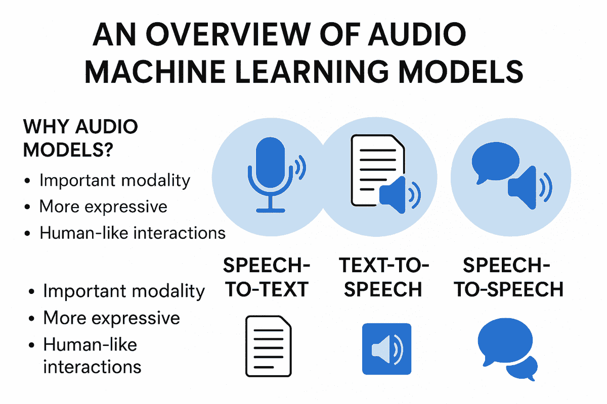

# 如何将强大的 AI 音频模型应用于实际应用

> 原文：[`towardsdatascience.com/how-to-apply-powerful-ai-audio-models-to-real-world-applications/`](https://towardsdatascience.com/how-to-apply-powerful-ai-audio-models-to-real-world-applications/)

<mdspan datatext="el1761594046762" class="mdspan-comment">音频机器学习</mdspan>模型是强大的模型，它们可以处理音频输入或产生音频输出。这些模型在 AI 中非常重要，因为以语音或其他声音形式存在的音频非常普遍，并帮助我们理解我们所处的世界。要真正理解音频在世界中的重要性，你可以想象一个没有声音的世界，以及它与有声音的世界有多么不同。

在本文中，我将提供一个高级概述，介绍不同的音频机器学习模型，你可以使用它们执行的不同任务，以及它们的应用领域。在 ChatGPT 的 LLM 突破之后，音频模型在过去几年中取得了显著的进步。



这张信息图表突出了本文的主要内容。我将讨论为什么我们需要 AI 音频模型，以及不同的应用领域，如语音转文本、文本转语音和语音转语音。图片由 ChatGPT 提供。

## 为什么我们需要音频模型

我们已经拥有了极其强大的 LLMs，可以处理大量的人类交互，因此强调为什么需要音频模型很重要。我将强调三个主要点：

+   音频是一个重要的数据集，就像视觉和文本一样

+   直接分析音频比通过转录文本分析更具表现力

+   音频允许更接近人类交互

对于我的第一个观点，我认为重要的是要说明，尽管我们在互联网上有大量的文本数据集和视频中的视觉数据，但我们也有大量音频数据。例如，大多数视频都会包含音频，这为视频增加了意义和上下文。因此，如果我们想创建最强大的 AI 模型，我们必须创建能够理解所有模态的模型。这里的模态指的是一种数据类型，例如

+   文本

+   视觉

+   音频

我的第二个观点也强调了音频模型的重要需求。如果我们想将音频转换为文本（例如，以便应用 LLMs），我们首先需要使用转录模型，这当然本身就是一个音频模型。此外，直接分析音频通常比通过转录文本分析一小部分音频更好。这样做的原因是音频可以捕捉到更多的细微差别。例如，如果我们有某人讲话的音频，音频将捕捉到说话者的情绪，这是无法通过文本真正表达的信息。

音频模型还允许更接近人类体验，例如，你可以与 AI 模型进行对话，而不是来回打字。

## 音频模型类型

在本节中，我将介绍您在处理音频模型时可能会遇到的主要音频模型类型。

### 语音转文字

语音转文字是音频模型最常见用例之一，也称为*转录*。语音转文字是将语音输入并输出语音中提供的文本的任务。这对于总结会议笔记或在您用手机与 Siri 等虚拟助手交谈时非常重要。语音转文字还用于为 LLMs 创建更大的训练数据集。

您可以使用语音转文字模型来分析音频片段。例如，假设您有一个客户服务互动。在这种情况下，您可以转录这个互动并对其进行分析，例如分析互动的长度，快速分析客户服务代表的绩效，或者查看客户是否对互动感到满意，而无需听完整个互动。分析文本通常比分析音频快得多，因为您阅读文本的速度比听音频的速度要快。以下是一个此类转录互动的示例：

```py
[Customer service representative]
Hi, thanks for calling, what do you need help with?

[Customer]
Hi, I need a refund for a recent purchase I made

[Customer service representative]
Okay, do you have the order ID for the purchase?

...
```

然而，重要的是要注意，当您将语音转换为文本时，您会丢失一些信息，正如我在本文的引言中所描述的。您会丢失音频中说话者的情感，因此很难从客户服务互动中确定客户情感，除非情感通过文本明确传达。在任何情况下，您都会从音频中丢失细微差别，因为阅读对话的文本永远无法像听对话本身那样富有表现力。

因此，如果您想对音频进行更深入的分析，您可以直接分析互动的音频，而不是首先将互动转录为文本。例如，如果您想确定互动中客户的情感，您可以直接输入音频，以及如下所示的提示。然后您可以进行直接的音频分析，捕捉到更多的细微差别。

```py
prompt = 
"""Analyse the emotional state of the customer in this interaction

{audio_clip}

""" 
```

### 文本到语音

文本到语音是音频模型的另一个重要用例。这是之前描述任务的逆过程，您输入文本并为该文本生成音频。与转录文本时丢失信息一样，现在您需要添加信息来创建音频。

因此，在执行文本到语音转换时，您通常需要提供生成的语音应包含的情感（除非提供商在生成音频时自动确定情感）。

文本到语音在许多场景中都有用：

+   创建广告，您想要根据转录本进行配音。这可以使用像 Elevenlabs 这样的服务轻松完成

+   对于客户服务互动，通过拥有一个客户可以与之交谈的声音。例如，你可以让客户打电话进来，转录他们的文本（语音转文本），使用大型语言模型生成响应（文本转文本），然后从大型语言模型的响应生成音频（文本转语音）。

最后一个要点中的方法从质量角度来看是可行的。然而，如果你这样做，你可能会遇到延迟问题，因为在你流式传输音频响应之前，你需要时间来转录文本并使用大型语言模型进行响应。因此，你可能想要利用下一节中将要讨论的语音转语音模型。

### 语音转语音

语音转语音模型是能够输入和输出语音的强大模型。这在需要快速响应的实时场景中非常有用。

例如，你可以使用语音转语音模型创建直接的客户服务代表，以低延迟直接响应用户查询。在这种互动中，延迟非常重要，因为你希望为客户创建类似人类的互动。从理论上讲，这种互动应该感觉与处理人类客户服务代表一样，甚至更好。

最佳情况下，你会使用直接的语音转语音模型，例如 Qwen-3-Omni。另一种选择是首先执行语音转文本，文本转文本（使用大型语言模型），然后文本转语音。然而，重要的是要说明，几乎总是更好的使用端到端模型（例如本例中的语音转语音），而不是将不同的模型串联起来。这是因为端到端模型会更好地保留信息，从而提供更好的输出。

***

我想提到的另一个语音转语音模型是声音克隆。这是你提供一个特定声音的音频样本的应用。然后，你可以通过提供旁白文本来生成带有克隆声音的新音频。语音到语音模型在过去几年中也取得了巨大的进步，可以快速生成大量的旁白。

例如，想象一下你想从教科书创建一本有声书，使用一个已经做过之前有声书的特定声音。通常情况下，你需要预订一个录音室，并让这个声音朗读整本新书，这需要几周时间。相反，如果你已经有了这个声音的大量样本，现在你可以使用声音克隆模型在几分钟内生成完整的旁白。当然，在使用声音克隆模型之前，你始终需要获得许可。

## 结论

在这篇文章中，我讨论了不同的语音模型，包括语音转文本、文本转语音和语音转语音模型，它们在自己的应用领域都非常有用。我认为，鉴于其重要性，语音模型将继续发展和改进。音频模型很重要，因为音频是理解世界的重要模态，就像文本和视觉一样。我相信音频与图像类似，很难仅用文字来描述。

**👉 我的免费资源**

**🚀** [使用大型语言模型提升你的工程能力（免费 3 天电子邮件课程）](https://www.eivindkjosbakken.com/email-course)

📚 [获取我的免费视觉语言模型电子书](https://eivindkjosbakken.com/ebook)

💻 [我的视觉语言模型网络研讨会](https://www.eivindkjosbakken.com/webinar)

**👉 在社交平台上找到我：**

📩 [订阅我的通讯](https://eivindkjosbakken.com/newsletter)

🧑‍💻 [联系我](https://eivindkjosbakken.com/)

🔗 [LinkedIn](https://www.linkedin.com/in/eivind-kjosbakken/)

🐦 [X / Twitter](https://x.com/EivindKjos)

✍️ [Medium](https://oieivind.medium.com/)
