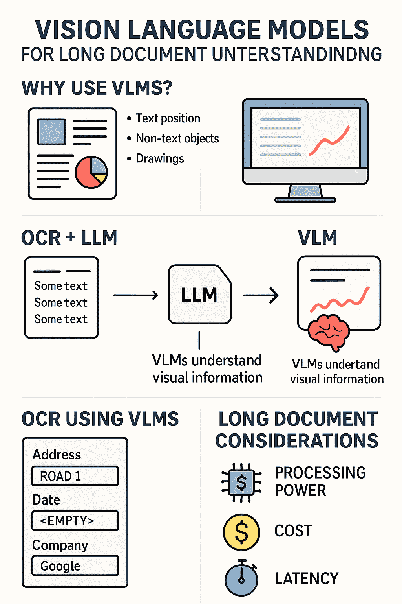
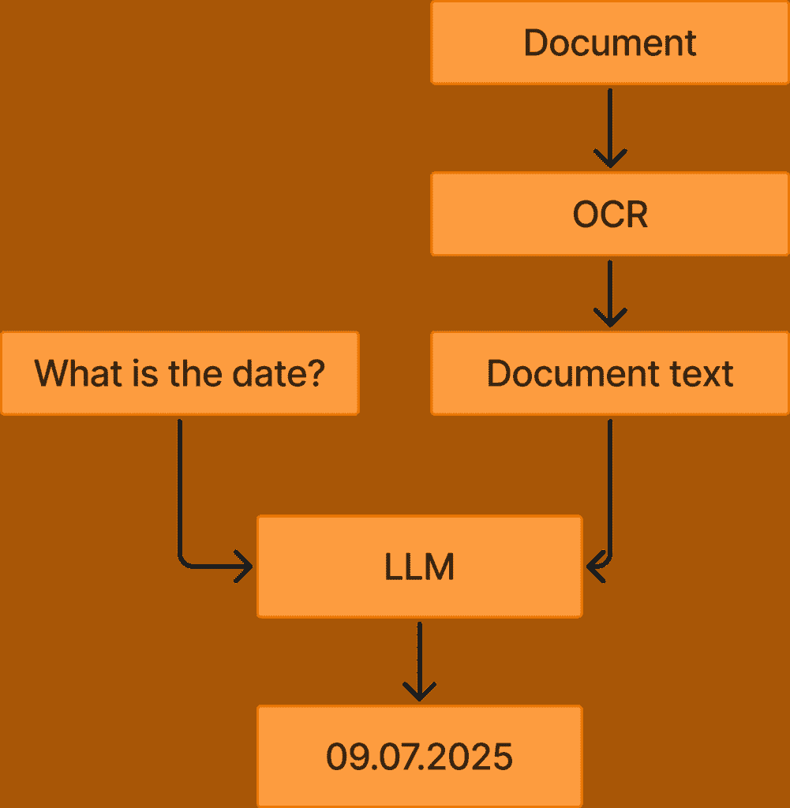
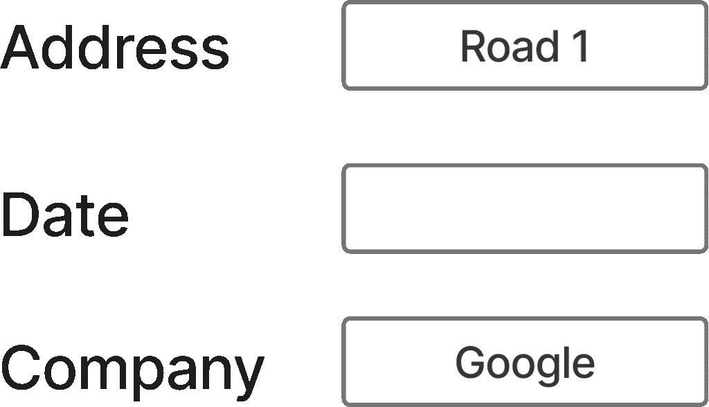

# 如何将视觉语言模型应用于长文档

> 原文：[`towardsdatascience.com/how-to-apply-vision-language-models-to-long-documents/`](https://towardsdatascience.com/how-to-apply-vision-language-models-to-long-documents/)

<mdspan datatext="el1762205952776" class="mdspan-comment">视觉语言模型</mdspan>是强大的模型，它们以图像为输入，而不是像传统 LLM 那样以文本为输入。考虑到我们可以直接处理文档的内容，而不是使用 OCR 提取文本，然后将此文本输入到 LLM 中，这开辟了许多可能性。

在本文中，我将讨论如何将视觉语言模型（VLMs）应用于长上下文文档理解任务。这意味着将 VLMs 应用于超过 100 页的非常长的文档或包含大量信息（如插图）的非常密集的文档。我将讨论应用 VLMs 时需要考虑的因素，以及你可以使用它们执行的任务类型。



这张信息图表突出了本文的主要内容。我将讨论为什么 VLMs 如此重要以及如何将它们应用于长文档。例如，你可以使用 VLMs 进行更高级的 OCR，将更多文档信息纳入提取的文本中。此外，你可以直接将 VLMs 应用于文档的图像，但必须考虑所需的处理能力、成本和延迟。图片由 ChatGPT 提供。

## 我们为什么需要 VLMs？

我在我的前几篇文章中讨论了很多 VLMs，并解释了为什么它们对于理解某些文档的内容如此重要。VLMs 之所以需要，主要原因是文档中有很多信息需要视觉输入才能理解。

VLMs 的替代方案是使用 OCR，然后使用 LLM（大型语言模型）。问题在于你只从文档中提取了文本，而没有包括视觉信息，例如：

+   不同文本相对于其他文本的位置

+   非文本信息（基本上是所有不是字母的东西，如符号或插图）

+   文本相对于其他信息的位置

这类信息对于真正理解文档至关重要，因此直接使用 VLMs（视觉语言模型）通常更好，你直接输入图像，因此也可以解释视觉信息。

对于长文档，使用 VLMs 是一个挑战，因为你需要很多标记来表示视觉信息。处理数百页是一个很大的挑战。然而，随着 VLM 技术最近的大量进步，模型越来越好，能够将视觉信息压缩到合理的上下文长度，使得将 VLMs 应用于长文档进行文档理解任务成为可能和可行。



此图突出了你可以利用的 OCR + LLM 方法。你将文档应用 OCR 以获取文档文本。然后，你将此文本以及用户查询输入到 LLM 中，LLM 将根据文档文本回答问题。如果你使用 VLMs，你可以完全跳过 OCR 步骤，直接从文档中回答用户问题。图片由作者提供。

## 使用 VLMs 进行 OCR

处理长文档并仍然包含视觉信息的一个好选项是使用 VLMs 进行 OCR。传统的 OCR，如 Tesseract，仅从文档中提取文本，以及文本的边界框。然而，VLMs 也被训练进行 OCR，并且可以进行更高级的文本提取，例如：

+   提取 Markdown

+   解释纯视觉信息（即，如果有绘图，用文字解释绘图）

+   添加缺失信息（即，如果有说“日期”的框和其后的空白字段，你可以告诉 OCR 提取“日期 <空>”）

最近，DeepSeek 发布了一个基于 VLM 的强大 OCR 模型，最近受到了很多关注和认可，使得 VLMs 在 OCR 中更加流行。

### Markdown

Markdown 非常强大，因为它可以提取格式化文本。这允许模型：

+   提供标题和副标题

+   准确表示表格

+   使文本加粗

这允许模型提取更具代表性的文本，这将更准确地描述文档的文本内容。如果你现在将 LLM 应用于此文本，LLM 的表现将远远优于如果你将它们应用于简单文本提取的传统 OCR。

> LLM 在格式化文本（如 Markdown）上的表现优于使用传统 OCR 提取的纯文本。

### 解释视觉信息

你还可以使用 VLM OCR 来解释视觉信息。例如，如果你有一幅没有文字的绘图，传统的 OCR 不会提取任何信息，因为它只被训练来提取文本字符。然而，你可以使用 VLMs 来解释图像的视觉内容。

假设你有一个以下文档：

```py
This is the introduction text of the document

<image showing the Eiffel tower>

This is the conclusion of the document
```

如果你应用了像 Tesseract 这样的传统 OCR，你会得到以下输出：

```py
This is the introduction text of the document

This is the conclusion of the document
```

这显然是一个问题，因为你没有包括展示埃菲尔铁塔的图片的信息。相反，你应该使用 VLMs，它将输出类似的内容：

```py
This is the introduction text of the document

<image>
This image depicts the Eiffel tower during the day
</image>

This is the conclusion of the document
```

如果你在一个文本上使用了 LLM，当然它不会知道文档包含埃菲尔铁塔的图片。然而，如果你在 VLM 提取的第二段文本上使用 LLM，LLM 将自然地更好地回答关于文档的问题。

### 添加缺失信息

如果有缺失信息，你也可以提示 VLMs 输出内容。为了理解这个概念，请看下面的图片：



此图展示了信息在文档中的典型表示示例。图片由作者提供。

如果你将此图像应用传统 OCR，你会得到：

```py
Address Road 1
Date
Company Google
```

然而，如果你使用 VLM，这将更有代表性，因为如果得到指示，它可以输出：

```py
Address Road 1
Date <empty> 
Company Google
```

这更有信息量，因为我们正在通知任何下游模型日期字段是空的。如果我们不提供这些信息，就不知道日期是简单地缺失，OCR 无法提取它，还是其他任何原因。

* * *

然而，使用视觉语言模型（VLMs）的 OCR 仍然存在一些传统 OCR 所面临的难题，因为它并不是直接处理视觉信息。你可能听说过“一图胜千言”的说法，这在处理文档中的视觉信息时通常也是成立的。是的，你可以使用 VLM 作为 OCR 来提供一幅图的文本描述，但这个文本永远不会像原图那样具有描述性。因此，我认为在许多情况下，直接使用 VLM 处理文档会更好，这一点我将在接下来的章节中详细说明。

## 开源模型与闭源模型

可用的 VLM 有很多。我遵循[HuggingFace VLM 排行榜](https://huggingface.co/spaces/opencompass/open_vlm_leaderboard)来关注任何新的高性能模型。根据这个排行榜，如果你想通过 API 使用闭源模型，你应该选择 Gemini 2.5 Pro 或 GPT-5。根据我的经验，这些是很好的选择，适用于长文档理解和处理复杂文档。

然而，你也可能因为隐私、成本或希望对自己的应用程序有更多控制而想要利用开源模型。在这种情况下，SenseNova-V6-5-Pro 在排行榜上名列前茅。我还没有亲自尝试这个模型，但我大量使用了 Qwen 3 VL，我对它有很好的经验。Qwen 还发布了一个[针对长文档理解的特定食谱](https://github.com/QwenLM/Qwen3-VL/blob/main/cookbooks/long_document_understanding.ipynb)。

## VLM 在长文档中的应用

在本节中，我将讨论将 VLM 应用于长文档以及你在这样做时必须考虑的因素。

### 处理能力考虑

如果你正在运行开源模型，你需要考虑的主要问题是你可以运行多大的模型以及需要多长时间。你依赖于访问更大的 GPU，在大多数情况下至少需要一个 A100。幸运的是，这很普遍，而且相对便宜（通常每小时 1.5-2 美元，许多云服务提供商现在都提供这样的服务）。然而，你必须进一步考虑你可以接受的延迟。运行 VLMs 需要大量的处理，你必须考虑以下因素：

+   处理一个请求可以接受的最长时间

+   你需要哪种图像分辨率？

+   你需要处理多少页

例如，如果你有一个实时聊天，你需要快速处理；然而，如果你只是在后台处理，你可以允许更长的处理时间。

图像分辨率也是一个重要的考虑因素。如果你需要能够阅读文档中的文本，你需要高分辨率的图像，通常是 2048×2048 以上，尽管这自然取决于文档。例如，详细的绘图，其中包含小文本，将需要更高的分辨率。提高分辨率会大大增加处理时间，这是一个重要的考虑因素。你应该追求尽可能低的分辨率，同时仍然能够执行你想要执行的所有任务。此外，页数也是一个类似的考虑因素。添加更多页面通常是必要的，以便访问文档中的所有信息。然而，通常最重要的信息包含在文档的早期，因此你可能只需要处理前 10 页，例如。

### 依赖答案的处理

你可以尝试降低所需的处理能力的方法之一，就是从简单开始，只有在没有得到期望的答案时才转向更复杂的处理。

例如，你可以从只查看前 10 页开始，看看你是否能够正确解决手头的任务，例如从文档中提取信息。只有当我们无法提取该信息时，我们才开始查看更多页面。你可以将同样的概念应用到图像的分辨率上，从低分辨率图像开始，然后转向所需的更高分辨率。

这种分层处理可以减少所需的处理能力，因为大多数任务只需查看前 10 页或使用低分辨率图像即可解决。然后，只有在必要时，我们才会继续处理更多图像或更高分辨率的图像。

### 成本

成本在使用 VLMs 时是一个重要的考虑因素。我处理了很多文档，通常看到在使用图像（VLMs）而不是文本（LLMs）时，令牌数量增加了大约 10 倍。由于输入令牌通常是长文档任务中成本的主要驱动因素，因此使用 VLMs 通常会显著增加成本。请注意，对于 OCR，关于输入令牌多于输出令牌的观点不适用，因为 OCR 在输出图像中的所有文本时自然会生成大量的输出令牌。

因此，在使用 VLMs 时，最大化使用缓存令牌至关重要，这是我在[我最近关于优化 LLMs 以降低成本和延迟的文章中讨论的主题](https://towardsdatascience.com/4-techniques-to-optimize-your-llm-prompts-for-cost-latency-and-performance/)。

## 结论

在这篇文章中，我讨论了如何将视觉语言模型（VLMs）应用于长文档以处理复杂的文档理解任务。我讨论了为什么 VLMs 如此重要，以及如何在长文档上使用 VLMs 的方法。例如，你可以使用 VLMs 进行更复杂的 OCR，或者直接将 VLMs 应用于长文档，但需要注意所需的处理能力、成本和延迟。我认为 VLMs 正变得越来越重要，这从最近发布的 Deepseek OCR 中可以看出。因此，我认为文档理解中的 VLMs 是一个你应该参与的话题，你应该学习如何使用 VLMs 进行文档处理应用。

**👉 我的免费资源**

**🚀** [使用 LLMs 将你的工程能力提升 10 倍（免费 3 天电子邮件课程）](https://www.eivindkjosbakken.com/email-course)

📚 [获取我的免费视觉语言模型电子书](https://eivindkjosbakken.com/ebook)

💻 [我的视觉语言模型网络研讨会](https://www.eivindkjosbakken.com/webinar)

**👉 在社交媒体上找到我：**

📩 [订阅我的通讯](https://eivindkjosbakken.com/newsletter)

🧑‍💻 [联系我](https://eivindkjosbakken.com/)

🔗 [LinkedIn](https://www.linkedin.com/in/eivind-kjosbakken/)

🐦 [X / Twitter](https://x.com/EivindKjos)

✍️ [Medium](https://oieivind.medium.com/)
