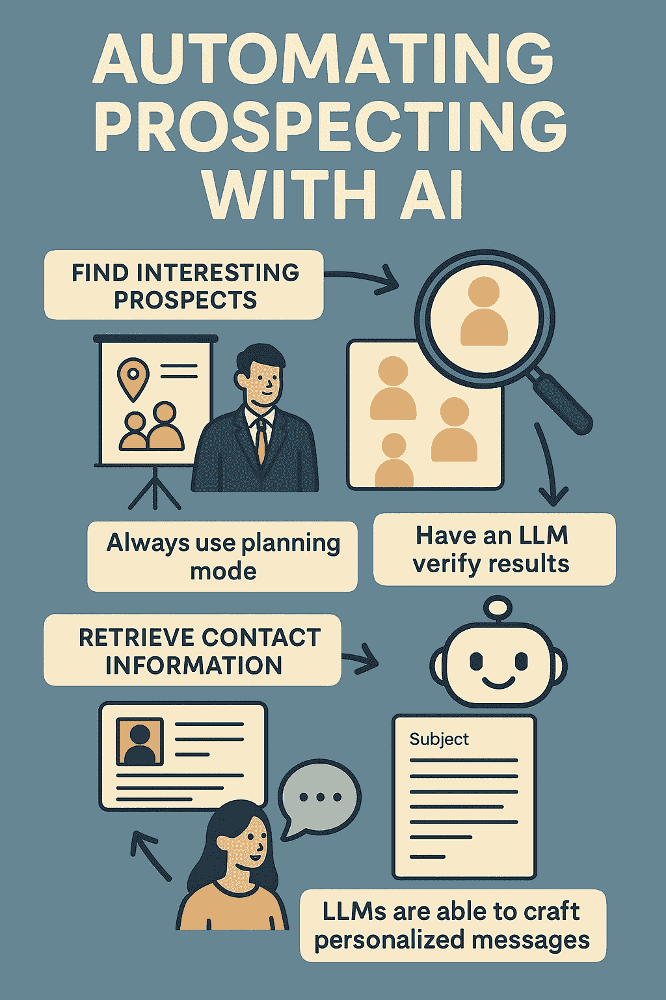

# 如何使用 AI 自动化工作流程

> 原文：[`towardsdatascience.com/how-to-automate-workflows-with-ai/`](https://towardsdatascience.com/how-to-automate-workflows-with-ai/)

<mdspan datatext="el1763148534668" class="mdspan-comment">AI 是大多数开发者工作中的一大部分。我们使用 Cursor、Windsurf、OpenAI Codex、Claude Code 等工具，使我们在工作中更加高效。然而，与非技术领域工作的人交流时，我经常看到很多可以使用 AI 优化的流程。</mdspan>

在这篇文章中，我将展示其他非技术行业如何从使用 AI 中受益。我将通过使用 AI 自动化寻找潜在客户的过程来突出这一点，这是一个典型的需要大量手动工作的销售工作。本文的目标是强调即使是非技术人员也可以利用最新的编码代理来创建强大的自动化工具。

在整篇文章中，我将通过以下方式突出我的主要技巧：

> 这是一个主要技巧



这张信息图突出了本文的主要内容。我首先将讨论为什么需要寻找潜在客户，然后继续讨论如何优化这个过程，并在整篇文章中通过引用突出具体的技巧。图片由 ChatGPT 提供。

## 为什么我们需要自动寻找潜在客户

商业发展代表与以下人员合作：

1.  寻找有趣的潜在客户

1.  获取他们的联系信息，例如他们的 LinkedIn 个人资料或电子邮件地址

1.  联系潜在客户，尝试安排会议

从那里，客户经理通常会接管，尽管我将专注于如何优化前三个步骤。

这个三步过程通常相当广泛，因为在线寻找潜在客户需要浏览大量的 LinkedIn 个人资料或其他网站以找到有趣的公司。找到公司后，你通常会开始寻找组织中的特定人员来联系。这通常将是关键决策者，他们可能是一家大公司的中层管理者，或是一家小公司的首席财务官。找到正确的人后，你需要获取他们的联系信息，通常可以在 LinkedIn 或公司的网站上找到。最后，你应该用个性化的信息联系这个人。

## 寻找有趣的潜在客户

我将使用 Claude Code 开始开发这个工具。实际上，你可以使用任何编码工具，例如 Codex、Cursor、Windsurf、Replit 等等。关键点在于你用来创建应用的命令。

> 在创建新应用之前始终使用规划模式

我总是从 *计划模式* 开始，这告诉模型阅读你的提示，创建一个逐步计划，并询问任何澄清问题。这非常有用，因为它有助于缩小你应用程序的范围，并确保你对任何含糊不清的地方提供自己的想法。例如，我被提示：

+   你针对哪个地区（以我的情况为例，我在查看挪威的潜在客户）

+   你希望你的应用程序使用哪种编程语言（我选择了 Python，但 TypeScript 或其他语言当然也是可能的）

+   你想查看哪些网站（在挪威，*proff.no*有很多关于公司和员工的信息，所以你可以找到类似工具，或者甚至让你的编码代理通过网络搜索自己找到这些网站）

+   我更喜欢哪种输出格式（我选择了 Excel 表格）

这些都是很好的澄清问题，这就是为什么使用*计划模式*如此有用的原因。

此外，确保提示你的模型使用公开可用的 API，并且只从相关公司获取信息。根据你所在地的规定，获取个人信息可能是违法的。

> 总是尽可能为你的编码代理提供工具。这可能包括 MCP 服务器、OpenAI 凭证或通过 API 访问任何程序的权限。

此外，我还创建了一个 OpenAI 密钥，我告诉 Claude Code 可以从我的.env 文件中加载 OPENAI_API_KEY。这很有用，因为许多操作可能需要使用 LLM 来查找或处理信息。因此，为 Claude Code 提供对强大的 API 服务的访问权限非常重要。如果你有其他相关的 API，你也应该为 Claude Code 提供这些 API 的文档，并告诉它使用它们。

例如，我通知 Claude 它有权访问网络搜索，并且可以使用以下功能进行搜索：

```py
response = client.responses.create(
    model="gpt-5",
    tools=[{"type": "web_search"}],
    input="What was a positive news story from today?"
)
```

* * *

在我回答了所有澄清问题后，我告诉 Claude 开始构建，它构建了一个以 CSV 格式返回潜在客户列表的应用程序。这涵盖了第一步和第二步，即首先找到有趣的潜在客户，并获取他们的联系信息。

在找到所有这些潜在客户后，你也应该进行人工审查，确保正确性。此外，我建议提示 GPT-5 或等效模型检查你的结果，并验证任何不一致之处。

> 让一个大型语言模型（LLM）检查你的结果以验证正确性

最后，寻找潜在客户时也要遵守规定。你应该只在网上寻找相关公司，然后手动寻找个人以遵守 GDPR 规定。因此，为了找到额外的信息，例如潜在个人的姓名、电子邮件和职位，我手动从我的申请中提供的公司获取这些信息。

## 联系

在找到联系信息后，你现在需要联系他们。你可以阅读很多关于如何进行冷电子邮件的统计数据和信息，但在这里我不会深入讨论，因为我的重点是技术和我们如何利用它来优化我们的流程。

到目前为止，我假设你已经获取了一份包含潜在客户及其联系信息的列表，并且你准备好开始联系他们。我们现在想要为每个人创建定制的消息，幸运的是，这是 LLM 非常擅长的一项任务。

> LLMs 能够制作个性化的信息

例如，在这个阶段，我针对每个潜在客户有以下信息：

+   个人姓名

+   个人电子邮件

+   个人角色

+   公司名称

+   公司规模

+   公司收入

此外，通常情况下，在提示中添加更多信息通常是更好的。如果你更喜欢电子邮件中的特定风格或语气，你应该添加相关信息。一个好主意也是展示你以前的电子邮件示例，突出你如何自己撰写电子邮件，从而使用少样本提示来提高输出质量。

> 在你的提示中尽可能添加更多信息

我现在将使用这些信息来起草一个定制信息。例如，使用 GPT-5 可以相对简单地完成这项任务：

```py
prompt = f"""
You are an expert at creating personalized emails. You are given information
about an individual and have to create an email to reach out to them for the 
first time.

Name: {name}
Email: {mail}
Role: {role}
Company name: {company_name}
Company size: (company_size}
Company revenue: {company_revenue}

Create both a subject tag, and the full email, including no other comments
or reasoning.
"""

client = OpenAI(api_key=OPENAI_API_KEY, base_url=API_URL)

import os
from openai import OpenAI

result = client.responses.create(
    model="gpt-5",
    input=prompt,
    reasoning={ "effort": "low"},
    text={ "verbosity": "low" },
)
```

当你有了信息的概要后，你可以根据你找到的信息手动调整和优化你要联系的人的信息。

你现在可以使用这些电子邮件进行联系。为了避免违反任何服务条款和垃圾邮件，我建议手动联系而不是使用自动化服务。我并不支持垃圾邮件或类似行为。AI 仅用于帮助你并使流程更有效，而不是必然地消除所有人类环节。

## 结论

在这篇文章中，我强调了你可以如何使用最新的编码工具，例如 Claude Code，来自动化一些流程。具体来说，我介绍了如何通过使用 AI 自动找到相关公司和自动创建电子邮件，同时保持合规性来优化联系潜在客户的过程。在过去的几年里，我们在 AI 方面取得了巨大的进步，但我仍然认为在实施方面 AI 落后了。因此，如果你能快速将 AI 整合到你的日常生活中，你将比你的同行拥有巨大的优势。

**👉 我的免费资源**

**🚀** [使用 LLMs 将你的工程能力提升 10 倍（免费 3 天电子邮件课程）](https://www.eivindkjosbakken.com/email-course)

📚 [获取我的免费视觉语言模型电子书](https://eivindkjosbakken.com/ebook)

💻 [我的视觉语言模型网络研讨会](https://www.eivindkjosbakken.com/webinar)

**👉 在社交平台上找到我：**

📩 [订阅我的通讯](https://eivindkjosbakken.com/newsletter)

🧑‍💻 [取得联系](https://eivindkjosbakken.com/)

🔗 [LinkedIn](https://www.linkedin.com/in/eivind-kjosbakken/)

🐦 [X / Twitter](https://x.com/EivindKjos)

✍️ [Medium](https://oieivind.medium.com/)
