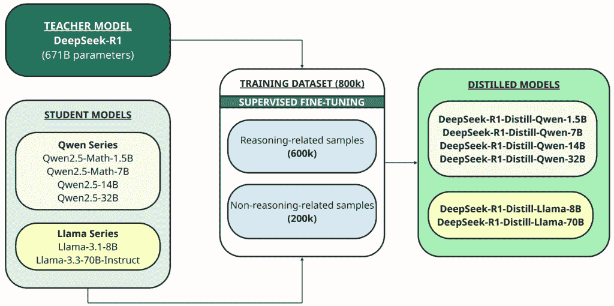
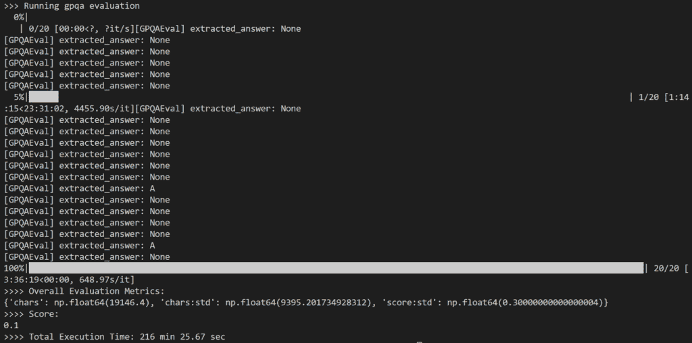

# 如何使用 Ollama 和 OpenAI 的 simple-evals 在 GPQA 上基准测试 DeepSeek-R1 蒸馏模型

> 原文：[`towardsdatascience.com/how-to-benchmark-deepseek-r1-distilled-models-on-gpqa-using-ollama-and-openais-simple-evals/`](https://towardsdatascience.com/how-to-benchmark-deepseek-r1-distilled-models-on-gpqa-using-ollama-and-openais-simple-evals/)

<mdspan datatext="el1745457890532" class="mdspan-comment">近期发布的</mdspan> [DeepSeek-R1](https://api-docs.deepseek.com/news/news250120) 模型在全球人工智能社区中引起了波澜。它实现了与 Meta 和 OpenAI 的推理模型相当的重大突破，在极短的时间内以显著更低的成本做到了这一点。

除去标题和在线热议，我们如何使用公认的基准来评估该模型的推理能力？

DeepSeek 的[用户界面](http://chat.deepseek.com/)使其易于探索其功能，但以编程方式使用它提供了更深入的见解，并能够更无缝地集成到实际应用中。了解如何本地运行此类模型也提供了增强的控制和离线访问。

在这篇文章中，我们探讨了如何使用**Ollama**和**OpenAI 的 simple-evals**根据著名的**GPQA-Diamond**基准来评估 DeepSeek-R1 蒸馏模型的推理能力。

## 内容

> **(1)** 什么是推理模型？
> 
> **(2)** 什么是 DeepSeek-R1？
> 
> **(3)** 理解蒸馏和 DeepSeek-R1 蒸馏模型
> 
> **(4)** 蒸馏模型的选择
> 
> **(5)** 评估推理的基准
> 
> **(6)** 使用的工具
> 
> **(7)** 评估结果
> 
> **(8)** 逐步说明

这里是这篇文章的[GitHub 仓库链接](https://github.com/kennethleungty/DeepSeek-R1-Ollama-Simple-Evals)。

* * *

## (1) 什么是推理模型？

推理模型，如 DeepSeek-R1 和 OpenAI 的 o 系列模型（例如，o1、o3），是使用强化学习训练的大语言模型（LLM），用于执行推理。

推理模型在回答之前会思考，在回答前会形成一个长的内部思维链。它们在复杂问题解决、编码、科学推理和多步骤的代理工作流程规划方面表现出色。

* * *

## (2) 什么是 DeepSeek-R1？

DeepSeek-R1 是一个用于**高级推理**的尖端开源 LLM，于 2025 年 1 月在一篇名为 *“*[*DeepSeek-R1: 通过强化学习激励 LLM 中的推理能力*](https://arxiv.org/abs/2501.12948)*”* 的论文中介绍。

该模型是一个基于广泛使用强化学习（RL）训练的 671 亿参数 LLM，基于以下管道：

+   两个旨在发现改进的推理模式和与人类偏好对齐的强化学习阶段

+   两个监督微调阶段作为模型推理和非推理能力的种子。

严格来说，DeepSeek 训练了两个模型：

+   第一个模型是**DeepSeek-R1-Zero**，这是一个使用强化学习训练的推理模型，它为第二个模型**DeepSeek-R1**生成训练数据。

+   它通过产生推理轨迹来实现这一点，根据最终结果仅保留高质量输出。

+   这意味着，与大多数模型不同，这个训练管道中的 RL 示例不是由人类编写的，而是由模型生成的。

结果是，该模型在数学、编码和复杂推理等任务上实现了与领先模型（如[OpenAI 的 o1 模型](https://openai.com/index/learning-to-reason-with-llms/)）相当的性能。

* * *

## (3) 理解蒸馏和 DeepSeek-R1 的蒸馏模型

除了完整模型外，他们还开源了基于[Qwen](https://huggingface.co/Qwen)或[Llama](https://www.llama.com/)作为基础模型的六个不同大小（1.5B、7B、8B、14B、32B、70B）的小型密集模型（也称为 DeepSeek-R1）。

**蒸馏**是一种技术，其中较小的模型（“学生”）被训练来复制较大的、更强大的预训练模型（“教师”）的性能。



DeepSeek-R1 蒸馏过程示意图 | 图片由作者提供

在这种情况下，教师是 671B 的 DeepSeek-R1 模型，学生是使用这些开源基础模型蒸馏的六个模型：

+   [Qwen2.5 — Math-1.5B](https://huggingface.co/deepseek-ai/DeepSeek-R1-Distill-Qwen-1.5B)

+   [Qwen2.5 — Math-7B](https://huggingface.co/deepseek-ai/DeepSeek-R1-Distill-Qwen-7B)

+   [Qwen2.5 — 14B](https://huggingface.co/deepseek-ai/DeepSeek-R1-Distill-Qwen-14B)

+   [Qwen2.5 — 32B](https://huggingface.co/deepseek-ai/DeepSeek-R1-Distill-Qwen-32B)

+   [Llama-3.1 — 8B](https://huggingface.co/deepseek-ai/DeepSeek-R1-Distill-Llama-8B)

+   [Llama-3.3 — 70B-Instruct](https://huggingface.co/deepseek-ai/DeepSeek-R1-Distill-Llama-70B)

DeepSeek-R1 被用作教师模型，生成 800,000 个训练样本，包括推理和非推理样本的混合，通过**监督微调**基础模型（1.5B、7B、8B、14B、32B 和 70B）进行蒸馏。

**那么，我们最初为什么要进行蒸馏呢？**

目标是将大型模型（如 DeepSeek-R1 671B）的推理能力转移到更小、更高效的模型中。这使得小模型能够处理复杂的推理任务，同时更快、更高效地使用资源。

此外，DeepSeek-R1 拥有庞大的参数数量（671 亿），这使得它在大多数消费级机器上运行具有挑战性。

即使是最强大的 MacBook Pro，最大也只有 128GB 的统一内存，也无法运行一个 671 亿参数的模型。

因此，蒸馏模型使得在计算资源有限的设备上部署成为可能。

> [Unsloth](https://unsloth.ai/blog/deepseekr1-dynamic) 通过量化原始 671B 参数的 DeepSeek-R1 模型，将其缩小到仅 131GB——尺寸减少了惊人的 80%。然而，131GB 的 VRAM 要求仍然是一个重大的障碍。

* * *

## (4) 精炼模型的选择

有六种精炼的模型大小可供选择，选择正确的模型在很大程度上取决于本地设备硬件的能力。

对于那些拥有高性能 GPU 或 CPU 并需要最大性能的用户，更大的 DeepSeek-R1 模型（32B 及以上）是理想的选择——即使是量化的 671B 版本也是可行的。

然而，如果资源有限或更倾向于更快的生成时间（正如我一样），较小的精炼变体，如 8B 或 14B，则更为合适。

**对于这个项目，我将使用 DeepSeek-R1 精炼** [**Qwen-14B**](https://huggingface.co/deepseek-ai/DeepSeek-R1-Distill-Qwen-14B) **模型，它与我所面临的硬件限制相匹配。**

* * *

## (5) 评估推理的基准

LLM 通常使用标准化的基准来评估其在各种任务上的性能，包括语言理解、代码生成、指令遵循和问题回答。常见的例子包括 [MMLU](https://paperswithcode.com/sota/multi-task-language-understanding-on-mmlu)、[HumanEval](https://paperswithcode.com/sota/code-generation-on-humaneval) 和 [MGSM](https://paperswithcode.com/dataset/mgsm)。

为了衡量一个 LLM 的推理能力，我们需要更多具有挑战性、推理密集型的基准，这些基准超越了表面任务。以下是一些专注于评估高级推理能力的流行示例：

### (i) AIME 2024 — 竞赛数学

+   [**美国邀请赛数学考试 (AIME) 2024**](https://paperswithcode.com/sota/mathematical-reasoning-on-aime24) 作为评估大型语言模型 (LLM) 数学推理能力的一个强大基准。

+   这是一个具有复杂、多步问题的挑战性数学竞赛，测试了一个 LLM 解释复杂问题、应用高级推理和进行精确符号操作的能力。

### (ii) Codeforces — 竞赛代码

+   [**Codeforces 基准**](https://arxiv.org/abs/2501.01257v2) 使用来自 Codeforces 的真实竞赛编程问题来评估一个 LLM 的推理能力，Codeforces 是一个以算法挑战著称的平台。

+   这些问题测试了一个 LLM 理解复杂指令、进行逻辑和数学推理、规划多步解决方案以及生成正确、高效代码的能力。

### (iii) GPQA Diamond — 博士级科学问题

+   GPQA-Diamond 是从更广泛的 [**GPQA (研究生级物理问题回答)**](https://arxiv.org/abs/2311.12022) 基准中精选出的 **最难问题** 的子集，专门设计用来挑战 LLM 在高级博士级主题上的推理极限。

+   虽然 GPQA 包含一系列概念性和计算密集型的研究生问题，但 GPQA-Diamond 仅隔离了最具挑战性和推理密集型的那些。

+   它被认为是谷歌难以破解的，这意味着即使有不受限制的互联网访问，也很难回答。

+   下面是一个 GPQA-Diamond 问题的示例：

在这个项目中，**我们使用 GPQA-Diamond 作为推理基准**，因为 [OpenAI](https://openai.com/index/learning-to-reason-with-llms/#:~:text=test%2Dtime%20compute-,Evals,-To%20highlight%20the) 和 [DeepSeek](https://github.com/deepseek-ai/DeepSeek-R1?tab=readme-ov-file#deepseek-r1-evaluation) 都用它来评估它们的推理模型。

* * *

## (6) 使用工具

在这个项目中，我们主要使用 [Ollama](http://www.ollama.com) 和 OpenAI 的 [simple-evals](https://github.com/openai/simple-evals)。

### (i) Ollama

[**Ollama**](http://ollama.com/) 是一个开源工具，它简化了在我们的计算机或本地服务器上运行 LLMs 的过程。

它充当管理器和运行时，处理下载和环境设置等任务。这使得用户可以在不需要持续互联网连接或依赖云服务的情况下与这些模型交互。

它支持许多开源 LLMs，包括 DeepSeek-R1，并且与 macOS、Windows 和 Linux 兼容。此外，它提供了一种简单、无需麻烦的设置，并高效地利用资源。

> ***重要提示**：请确保您的本地设备有 **GPU 访问权限** 以供 Ollama 使用，因为这可以显著加速性能，并使后续的基准测试练习比使用 CPU 时更加高效。在终端中运行 `nvidia-smi` 以检查是否检测到 GPU。*

* * *

### (ii) OpenAI simple-evals

[**simple-evals**](https://github.com/openai/simple-evals) 是一个轻量级的库，旨在通过零样本、思维链提示方法评估语言模型。它包括著名的基准测试，如 MMLU、MATH、GPQA、MGSM 和 HumanEval，旨在反映现实的使用场景。

你们中的一些人可能听说过 OpenAI 更著名且更全面的评估库 [**Evals**](https://github.com/openai/evals)，它与 simple-evals 不同。

事实上，simple-evals 的 [README](https://github.com/openai/simple-evals?tab=readme-ov-file#background) 也明确指出，它不是用来替换 **Evals** 库的。

**为什么我们使用 simple-evals？**

简单的答案是，**simple-evals** 内置了我们针对的推理基准（如 GPQA）的评估脚本，而 **Evals** 中则没有。

此外，我没有找到其他工具或平台，除了 simple-evals，它们提供了一种直接、Python 原生的方法来运行多个关键基准，如 GPQA，尤其是在与 Ollama 一起工作时。

* * *

## (7) 评估结果

作为评估的一部分，我选择了 GPQA-Diamond 198 题集中的**20 个随机问题**供**14B 精炼模型**处理。总共花费了 216 分钟，即每个问题大约 11 分钟。

结果诚然令人失望，因为它只得了**10%**，远低于 671B DeepSeek-R1 模型报告的 73.3%的得分。

我注意到的主要问题是，在其密集的内部推理过程中，**模型经常要么无法产生任何答案（例如，将推理标记作为输出最后几行返回）要么提供了不符合预期多选题格式的响应（例如，答案：A）。**



20 个基准运行示例的评估输出打印 | 图由作者提供

如上图所示，许多输出最终变成了`None`，因为 simple-evals 中的正则表达式逻辑无法在 LLM 的响应中检测到预期的答案模式。

虽然[类似人类的推理逻辑](https://github.com/kennethleungty/DeepSeek-R1-Ollama-Simple-Evals/blob/main/data/convos_output_20250313_0105.txt)观察起来很有趣，但我原本期望在问答准确度方面有更强的表现。

我还看到在线用户提到，即使是更大的 32B 模型表现也不如 o1。这引发了关于精炼推理模型实用性的怀疑，尤其是在它们在生成长推理的同时难以给出正确答案时。

话虽如此，GPQA-Diamond 是一个极具挑战性的基准，因此这些模型对于更简单的推理任务仍然可能很有用。它们较低的计算需求也使得它们更容易访问。

此外，DeepSeek 团队建议在基准测试过程中进行多次测试并平均结果—由于时间限制，我忽略了这一点。

* * *

## (8) 逐步讲解

到目前为止，我们已经涵盖了核心概念和关键要点。

如果你准备好进行实际操作的技术讲解，本节将深入探讨其内部工作原理和逐步实施过程。

> *查看（或克隆）[相关的 GitHub 仓库](https://github.com/kennethleungty/DeepSeek-R1-Ollama-Simple-Evals)以跟随操作。虚拟环境设置的要求可以在[这里](https://github.com/kennethleungty/DeepSeek-R1-Ollama-Simple-Evals/blob/main/requirements.txt)找到。*

### (i) 初始设置—Ollama

我们首先下载 Ollama。访问[**Ollama 下载页面**](https://ollama.com/download)，选择你的操作系统，并遵循相应的安装说明。

安装完成后，通过双击 Ollama 应用程序（适用于 Windows 和 macOS）或在终端中运行`ollama serve`来启动 Ollama。

* * *

### (ii) 初始设置—OpenAI simple-evals

simple-evals 的设置相对独特。

虽然 simple-evals 以库的形式出现，**但仓库中缺少 `__init__.py` 文件意味着它没有以正确的 Python 包结构组织**，这会导致在本地克隆仓库后出现导入错误。

由于它也没有发布到 PyPI，并且缺少像 `setup.py` 或 `pyproject.toml` 这样的标准打包文件，因此无法通过 `pip` 安装。

幸运的是，我们可以利用 **Git 子模块**作为直接的解决方案。

> *Git 子模块让我们可以在自己的项目中包含另一个 Git 仓库的内容。它从外部仓库（例如，simple-evals）中拉取文件，但保持其历史记录独立。*

您可以选择两种方式（A 或 B）来拉取 simple-evals 内容：

***(A) 如果您克隆了我的项目仓库***

我的项目仓库已经包含了 `simple-evals` 作为子模块，因此您只需运行：

```py
git submodule update --init --recursive
```

***(B) 如果您将其添加到新创建的项目中***

要手动将 simple-evals 添加为子模块，请运行以下命令：

```py
git submodule add https://github.com/openai/simple-evals.git simple_evals
```

**注意**：命令末尾的 `simple_evals`（带有 **下划线**）至关重要。它设置了文件夹名称，使用连字符（即，simple**–**evals）代替可能会导致后续的导入问题。

* * *

**最终步骤（两种方法都适用）**

拉取仓库内容后，您必须在新建的 `simple_evals` 文件夹中创建一个空的 `__init__.py` 文件，以便它可以作为模块导入。您可以手动创建它，或者使用以下命令：

```py
touch simple_evals/__init__.py
```

* * *

### (iii) 通过 Ollama 拉取 DeepSeek-R1 模型

下一步是使用此命令本地下载您选择的精炼模型（例如，14B）：

```py
ollama pull deepseek-r1:14b
```

Ollama 上可用的 DeepSeek-R1 模型列表可以在[这里](https://ollama.com/library/deepseek-r1)找到。

* * *

### (iv) 定义配置

我们在配置 YAML 文件中定义参数，如下所示：

模型温度设置为 **0.6**（与典型的默认值 0 相比）。这遵循 DeepSeek 的使用建议，建议温度范围为 0.5 到 0.7（推荐值为 0.6），以**防止无限重复或不连贯的输出**。

> *请务必查看有趣的独特[DeepSeek-R1 使用建议](https://github.com/deepseek-ai/DeepSeek-R1?tab=readme-ov-file#usage-recommendations)——特别是对于基准测试——以确保使用 DeepSeek-R1 模型时的最佳性能。*

`EVAL_N_EXAMPLES` 是设置用于评估的完整 198 题问集中的问题数量的参数。

* * *

### (v) 设置采样器代码

为了在 simple-evals 框架内支持基于 Ollama 的语言模型，我们创建了一个名为 `OllamaSampler` 的自定义包装类，并将其保存在 `utils/samplers/ollama_sampler.py` 中。

在这个上下文中，一个 *采样器* 是一个 Python 类，它根据给定的提示从语言模型生成输出。

由于 simple-evals 中的现有采样器仅覆盖 OpenAI 和 Claude 等提供商，我们需要一个为 Ollama 提供兼容接口的采样器类。

`OllamaSampler` 从 GPQA 问题提示中提取信息，将其与指定的温度一起发送到模型，并返回纯文本响应。

包含 `_pack_message` 方法以确保输出格式与 simple-evals 中的评估脚本期望的格式相匹配。

* * *

### (vi) 创建评估运行脚本

以下代码在 `main.py` 中设置了评估执行，包括使用 simple-evals 中的 `GPQAEval` 类来运行 GPQA 基准测试。

`run_eval()` 函数是一个可配置的评估运行器，它通过 Ollama 在 GPQA 等基准测试中对 LLMs 进行测试。

它从配置文件中加载设置，设置适当的 simple-evals 评估类，并通过标准化评估过程运行模型。它保存在 `main.py` 中，可以通过 `python main.py` 执行。

按照上述步骤，我们已经在 DeepSeek-R1 精简模型上成功设置了并执行了 GPQA-Diamond 基准测试。

* * *

## 总结

在本文中，我们展示了如何结合 Ollama 和 OpenAI 的 simple-evals 工具来探索和基准测试 DeepSeek-R1 的精简模型。

精简模型可能尚未在 GPQA-Diamond 等具有挑战性的推理基准测试中与 671B 参数的原模型相媲美。然而，它们展示了蒸馏如何扩展 LLM 推理能力的访问。

尽管在复杂的博士级别任务中得分不佳，但这些较小的变体可能在要求较低的场合中仍然可行，为在更广泛的硬件上高效本地部署铺平了道路。

### 在您离开之前

我欢迎您关注我的 [GitHub](https://github.com/kennethleungty) 和 [LinkedIn](https://www.linkedin.com/in/kennethleungty/) 以获取更多引人入胜且实用的内容。同时，享受使用 Ollama 和 simple-evals 对 LLMs 进行基准测试的乐趣！
