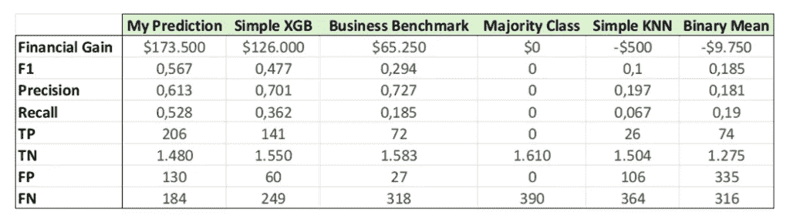

# 如何为你的模型构建基准

> 原文：[`towardsdatascience.com/how-to-build-a-benchmark-for-your-models/`](https://towardsdatascience.com/how-to-build-a-benchmark-for-your-models/)

我在过去三年里一直担任数据科学顾问，并且有机会在多个行业的工作中工作。然而，我注意到我大多数客户中有一个共同点：

**他们很少对项目目标有一个清晰的认识。**

这是数据科学家面临的主要障碍之一，尤其是在通用人工智能接管每一个领域的时候。

但让我们假设经过一番讨论，目标变得清晰。我们设法确定了一个具体的问题来回答。例如：

> ***我想根据客户流失的概率将客户分为两组：“高流失可能性”和“低流失可能性”***

好吧，那么接下来呢？简单，让我们开始构建一些模型！

**错误！**

如果有一个明确的目标是罕见的，那么有一个可靠的**基准**就更加罕见。

在我看来，交付数据科学项目最重要的步骤之一是与客户定义并同意一组**基准**。

在这篇博客文章中，我将解释：

+   **基准是什么，**

+   **为什么拥有一个基准很重要，**

+   **如何通过示例场景构建一个，并**

+   **一些需要考虑的潜在缺点**

* * *

## 什么是基准？

**基准**是一种标准化的方式来评估模型的性能。它提供了一个参考点，新的模型可以与之比较。

一个基准需要两个关键组件才能被认为是完整的：

1.  **一组用于评估性能的指标**

1.  **一组简单的模型**作为基线使用

核心概念很简单：每次我开发一个新的模型，我都会将其与之前的版本和基线模型进行比较。这确保了改进是真实且可追踪的。

重要的是要理解，这个基线不应该针对模型或数据集特定，而应该是针对业务案例的。它应该是一个给定业务案例的一般基准。

如果我遇到一个新的数据集，具有相同的企业目标，这个基准应该是一个可靠的参考点。

* * *

## 为什么构建基准很重要

现在我们已经定义了什么是基准，让我们深入探讨为什么我认为在开发一个强大的基准上额外花费一个项目周是值得的。

1.  **没有基准，你追求的是完美** — 如果你没有明确的参考点，任何结果都将失去意义。 *“我的模型 MAE 为 30,000”* 这是好吗？我不知道！也许用简单的平均值你就能得到 25,000 的 MAE。通过将你的模型与基线进行比较，你可以衡量**性能**和**改进**。

1.  **改善与客户的沟通**——客户和业务团队可能不会立即理解模型的标准输出。然而，通过从开始就与他们互动简单的基线，以后展示改进就变得更容易。在许多情况下，基准可以直接来自业务，以不同的形式。

1.  **有助于模型选择**——基准为比较多个模型提供了一个**起点**。没有它，您可能会浪费时间测试那些不值得考虑的模型。

1.  **模型漂移检测和监控**——模型可能会随时间退化。通过拥有基准，您可能能够通过将新模型的输出与过去的基准和基线进行比较来提前拦截**漂移**。

1.  **不同数据集之间的一致性**——数据集会演变。通过拥有固定的一组指标和模型，您确保性能比较在时间上保持有效。

在一个清晰的基准下，模型开发的每一步都会提供**即时反馈**，使整个过程更加**有目的性和数据驱动**。

* * *

## 我会如何构建基准

我希望我已经说服了您拥有基准的重要性。现在，让我们实际构建一个。

让我们从我们在博客文章开头提出的企业问题开始：

> ***我想根据客户流失的概率将我的客户分为两组：“高度可能流失”和“低度可能流失”***

为了简单起见，我将假设**没有额外的业务约束**，但在现实世界的场景中，通常存在约束。

在这个例子中，我使用[***这个数据集***](https://www.kaggle.com/datasets/shubh0799/churn-modelling) ([CC0: 公共领域](https://creativecommons.org/publicdomain/zero/1.0/))。数据包含来自公司客户群的一些属性（例如，年龄，性别，产品数量，……）以及他们的流失状态。

现在我们有了一些可以工作的东西，让我们构建基准：

### 1. 定义指标

我们处理的是一个流失用例，特别是这是一个**二元分类问题**。因此，我们可以使用的指标主要是：

+   **精确率**——所有预测流失客户中正确预测流失客户的百分比

+   **召回率**——正确识别的实际流失客户的百分比

+   **F1 分数**——平衡精确率和召回率

+   **真正正面，假正面，真正负面和假负面**

这些是一些可以用来评估模型输出的“简单”指标。

**然而**，这并不是一个详尽的列表，标准指标并不总是足够。在许多用例中，构建自定义指标可能很有用。

假设在我们的业务案例中，**被标记为“高度可能流失”的客户会得到折扣**。这会创造：

+   向非流失客户提供折扣时的**成本**（$250）

+   保留一个流失客户时的**利润**（$1000）

根据这个定义，我们可以构建一个在我们场景中至关重要的自定义指标：

```py
# Defining the business case-specific reference metric
def financial_gain(y_true, y_pred):  
    loss_from_fp = np.sum(np.logical_and(y_pred == 1, y_true == 0)) * 250  
    gain_from_tp = np.sum(np.logical_and(y_pred == 1, y_true == 1)) * 1000  
    return gain_from_tp - loss_from_fp
```

当你构建**业务驱动型指标**时，这些通常是相关性最高的。这些指标可以采取任何形状或形式：财务目标、最低要求、覆盖率百分比等等。

### 2. 定义基准

现在我们已经定义了我们的指标，我们可以定义一组用作参考的基线模型。

在这个阶段，你应该定义一个简单易实现的模型列表，以它们最简单的可能设置。在这个状态下，没有必要花费时间和资源来优化这些模型，我的心态是：

> **如果我有 15 分钟，我会如何实现这个模型？**

在模型的后期阶段，你可以随着项目的进展添加更多的基线模型。

在这个案例中，我将使用以下模型：

+   **随机模型**——随机分配标签

+   **多数模型**——总是预测最频繁的类别

+   **简单的 XGB**

+   **简单的 KNN**

```py
import numpy as np  
import xgboost as xgb  
from sklearn.neighbors import KNeighborsClassifier  

class BinaryMean():  
    @staticmethod  
    def run_benchmark(df_train, df_test):  
        np.random.seed(21)  
        return np.random.choice(a=[1, 0], size=len(df_test), p=[df_train['y'].mean(), 1 - df_train['y'].mean()])  

class SimpleXbg():  
    @staticmethod  
    def run_benchmark(df_train, df_test):  
        model = xgb.XGBClassifier()  
        model.fit(df_train.select_dtypes(include=np.number).drop(columns='y'), df_train['y'])  
        return model.predict(df_test.select_dtypes(include=np.number).drop(columns='y'))  

class MajorityClass():  
    @staticmethod  
    def run_benchmark(df_train, df_test):  
        majority_class = df_train['y'].mode()[0]  
        return np.full(len(df_test), majority_class)  

class SimpleKNN():  
    @staticmethod  
    def run_benchmark(df_train, df_test):  
        model = KNeighborsClassifier()  
        model.fit(df_train.select_dtypes(include=np.number).drop(columns='y'), df_train['y'])  
        return model.predict(df_test.select_dtypes(include=np.number).drop(columns='y'))
```

同样，正如在指标案例中，我们可以构建**自定义基准**。

让我们假设在我们的业务案例中，**市场营销团队联系了所有**：

+   **50 岁以上**和

+   那是**不再活跃了**

遵循这个规则，我们可以构建以下模型：

```py
# Defining the business case-specific benchmark
class BusinessBenchmark():  
    @staticmethod  
    def run_benchmark(df_train, df_test):  
        df = df_test.copy()  
        df.loc[:,'y_hat'] = 0  
        df.loc[(df['IsActiveMember'] == 0) & (df['Age'] >= 50), 'y_hat'] = 1  
        return df['y_hat']
```

### 运行基准

要运行基准，我将使用以下类。入口点是方法`compare_with_benchmark()`，它接受一个预测，运行所有模型并计算所有指标。

```py
import numpy as np  

class ChurnBinaryBenchmark():  
    def __init__(        
	    self,  
        metrics = [],  
        benchmark_models = [],        
        ):  
        self.metrics = metrics  
        self.benchmark_models = benchmark_models  

    def compare_pred_with_benchmark(        
	    self,  
        df_train,  
        df_test,  
        my_predictions,    
        ):  

        output_metrics = {  
            'Prediction': self._calculate_metrics(df_test['y'], my_predictions)  
        }  
        dct_benchmarks = {}  

        for model in self.benchmark_models:  
            dct_benchmarks[model.__name__] = model.run_benchmark(df_train = df_train, df_test = df_test)  
            output_metrics[f'Benchmark - {model.__name__}'] = self._calculate_metrics(df_test['y'], dct_benchmarks[model.__name__])  

        return output_metrics  

    def _calculate_metrics(self, y_true, y_pred):  
        return {getattr(func, '__name__', 'Unknown') : func(y_true = y_true, y_pred = y_pred) for func in self.metrics}
```

现在我们需要的只是一个预测。在这个例子中，我快速进行了特征工程和一些超参数调整。

最后一步只是运行基准：

```py
binary_benchmark = ChurnBinaryBenchmark(  
    metrics=[f1_score, precision_score, recall_score, tp, tn, fp, fn, financial_gain],  
    benchmark_models=[BinaryMean, SimpleXbg, MajorityClass, SimpleKNN, BusinessBenchmark]  
    )  

res = binary_benchmark.compare_pred_with_benchmark(  
    df_train=df_train,  
    df_test=df_test,  
    my_predictions=preds,  
)  

pd.DataFrame(res)
```



基准指标比较 | 图由作者提供

这生成了一个**比较表**，列出了所有模型在所有指标上的比较。使用这个表，可以就模型的预测得出具体的结论，并在流程的下一步中做出明智的决定。

* * *

## 一些缺点

正如我们所看到的，有许多理由说明为什么拥有一个基准是有用的。然而，尽管基准非常有用，但仍有一些需要注意的**陷阱**：

1.  **无信息基准**——当指标或模型定义不佳时，拥有基准的边际影响会降低。**始终定义有意义的基线**。

1.  **利益相关者的误解**——与客户的沟通至关重要，重要的是要清楚地说明这些指标在衡量什么。**最好的模型可能在所有定义的指标上都不是最好的**。

1.  **过度拟合基准**——你可能会试图创建过于特定的特征，这些特征可能会击败基准，但在预测中并不具有良好的泛化能力。**不要专注于击败基准，而应专注于为问题创造可能的最佳解决方案**。

1.  **目标变化**——由于沟通不畅或计划变更，定义的目标可能会改变。**保持基准的灵活性，以便在需要时进行适应**。

* * *

## 最后的想法

基准测试提供了清晰度，确保改进是可衡量的，并在数据科学家和客户之间创建了一个**共享的参考点**。它们有助于避免在没有证据的情况下假设模型表现良好的陷阱，并确保每一次迭代都带来真正的价值。

他们还充当着一种**沟通工具**，使得向客户解释进度变得更加容易。你不再只是展示数字，而是可以展示清晰的比较，突出改进之处。

[*在此处可以找到本博客文章的完整实现笔记本*](https://github.com/lorenzomezzini/MediumPosts/blob/main/Benchmarking/benchmarking.ipynb)*.*
