# 如何构建 Graph RAG 应用

> 原文：[`towardsdatascience.com/how-to-build-a-graph-rag-app-b323fc33ba06/`](https://towardsdatascience.com/how-to-build-a-graph-rag-app-b323fc33ba06/)

*该应用的代码和笔记本的配套代码*[*在此处.*](https://github.com/SteveHedden/kg_llm/tree/main/graphRAGapp)

知识图谱（KGs）和大型语言模型（LLMs）是天作之合。我的[之前](https://medium.com/towards-data-science/how-to-implement-knowledge-graphs-and-large-language-models-llms-together-at-the-enterprise-level-cf2835475c47) [文章](https://medium.com/towards-data-science/how-to-implement-graph-rag-using-knowledge-graphs-and-vector-databases-60bb69a22759)更详细地讨论了这两种技术的互补性，但简而言之是，“LLMs 的一些主要弱点，即它们是黑盒模型且难以处理事实性知识，正是 KGs 最大的优势。本质上，KGs 是事实的集合，它们是完全可解释的。”

这篇文章全部关于构建一个简单的 Graph RAG 应用。什么是 RAG？RAG，即检索增强生成，是关于**检索**相关信息以**增强**发送给 LLM 的提示，LLM 随后**生成**响应。Graph RAG 是使用知识图谱作为检索部分一部分的 RAG。如果您从未听说过 Graph RAG 或需要复习，我建议您观看[这个视频](https://www.youtube.com/watch?v=knDDGYHnnSI)。

基本思路是，与其直接将提示发送给未在您的数据上训练的 LLM，您可以通过补充 LLM 准确回答提示所需的相关信息来完善您的提示。我经常使用的例子是将一份工作描述和我的简历复制到 ChatGPT 中，让它帮我写一封求职信。如果给我我的简历以及我申请的工作描述，LLM 就能对我的提示“写一封求职信”提供更加相关的回应。由于知识图谱是为了存储知识而构建的，因此它们是存储内部数据和通过额外上下文补充 LLM 提示的完美方式，这可以提高响应的准确性和上下文理解。

这种技术有非常广泛的应用，例如[客户服务机器人](https://arxiv.org/pdf/2404.17723)、[药物](https://academic.oup.com/bioinformatics/article/40/6/btae353/7687047) [发现](https://blog.biostrand.ai/integrating-knowledge-graphs-and-large-language-models-for-next-generation-drug-discovery)、[生命科学中自动生成监管报告](https://www.weave.bio/)、[人力资源中的人才获取和管理](https://beamery.com/resources/news/beamery-announces-talentgpt-the-world-s-first-generative-ai-for-hr)、[法律研究和写作](https://legal.thomsonreuters.com/blog/retrieval-augmented-generation-in-legal-tech/)以及[财富顾问助手](https://www.cnbc.com/amp/2023/03/14/morgan-stanley-testing-openai-powered-chatbot-for-its-financial-advisors.html)。由于其广泛的应用性和提高 LLM 工具性能的潜力，Graph RAG（我将在这里使用这个术语）在流行度上迅速上升。以下是根据 Google 搜索趋势显示的兴趣随时间变化的图表。

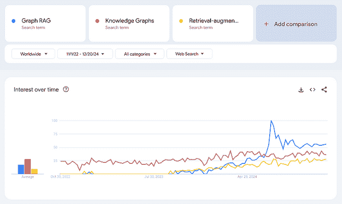

来源：[`trends.google.com/`](https://trends.google.com/)

Graph RAG 在搜索兴趣上经历了激增，甚至超过了知识图谱和检索增强生成等术语。请注意，Google Trends 衡量的是*相对*搜索兴趣，而不是搜索的绝对数量。2024 年 7 月对 Graph RAG 的搜索激增与微软[宣布](https://www.microsoft.com/en-us/research/blog/graphrag-new-tool-for-complex-data-discovery-now-on-github/)他们的 GraphRAG 应用程序将在[GitHub](https://github.com/microsoft/graphrag)上可用的时间相吻合。

围绕 Graph RAG 的兴奋不仅仅局限于微软。2024 年 7 月，三星收购了知识图谱公司 RDFox。宣布该收购的[文章](https://news.samsung.com/global/samsung-electronics-announces-acquisition-of-oxford-semantic-technologies-uk-based-knowledge-graph-startup)没有明确提及 Graph RAG，但在 2024 年 11 月发布的[福布斯](https://www.forbes.com/sites/zakdoffman/2024/11/09/samsung-confirms-new-upgrade-choice-millions-of-galaxy-owners-must-now-decide/)文章中，三星发言人表示：“我们计划开发知识图谱技术，这是个性化 AI 的主要技术之一，并将其与生成式 AI 有机地连接起来，以支持特定用户的服务。”

在 2024 年 10 月，领先的图数据库公司 Ontotext 和语义网公司 PoolParty（一个知识图谱编辑平台）的制造商合并，成立了[Graphwise](https://graphwise.ai/)。根据[新闻稿](https://www.prnewswire.com/news-releases/semantic-web-company-and-ontotext-merge-to-create-knowledge-graph-and-ai-powerhouse-graphwise-302283427.html?utm_source=chatgpt.com)，此次合并的目标是“使 Graph RAG 作为一类产品的演变民主化”。

尽管围绕 Graph RAG 的炒作可能部分源于对聊天机器人和生成式 AI 的广泛兴奋，但它反映了知识图谱在解决复杂、现实世界问题中的应用方式的真正演变。一个例子是 LinkedIn 将 Graph RAG[应用于其客户服务技术支持](https://arxiv.org/pdf/2404.17723)。由于该工具能够检索相关数据（如之前解决的类似工单或问题），以供 LLM 使用，因此响应更加准确，平均解决时间从 40 小时缩短至 15 小时。

本文将介绍一个相当简单但我觉得具有说明性的例子，说明 Graph RAG 在实际中是如何工作的。最终结果是用户可以与之交互的应用程序。像我的上一篇文章一样，我将使用 PubMed 中的医学期刊文章数据集。想法是，这是一个医学领域的人可以用来进行文献综述的应用程序。然而，这些原则可以应用于许多用例，这就是为什么 Graph RAG 如此令人兴奋。

应用程序的结构以及本文的结构如下：

第零步是准备数据。我将在下面解释细节，但总体目标是矢量化原始数据，并将其单独转换为 RDF 图。只要我们在矢量化之前将 URI 与文章关联起来，我们就可以在文章图和文章向量空间中导航。然后，我们可以：

1.  **搜索文章：**利用向量数据库的强大功能，根据搜索词进行相关文章的初步搜索。我将使用向量相似度检索与搜索词向量最相似的文章。

1.  **细化术语：**探索[医学主题词表（MeSH）生物医学词汇](https://id.nlm.nih.gov/mesh/)以选择用于过滤步骤 1 中文章的术语。这个受控词汇包含医学术语、别名、更窄的概念以及许多其他属性和关系。

1.  **过滤与总结：**使用 MeSH 术语过滤文章以避免“上下文中毒”。然后将剩余的文章发送给 LLM，并附加一个额外的提示，例如，“用项目符号总结。”

在我们开始之前，关于这个应用程序和教程的一些注意事项：

+   这种设置仅使用知识图谱进行元数据。这之所以可能，仅仅是因为我的数据集中的每篇文章都已经用属于丰富受控词汇的术语进行了标记。我正在使用图来构建结构和语义，使用向量数据库进行基于相似度的检索，确保每种技术都用于其最擅长的领域。向量相似度可以告诉我们“食管癌”在语义上与“口腔癌”相似，但知识图谱可以告诉我们“食管癌”与“口腔癌”之间关系的细节。

+   我为这个应用程序使用的数据是从 PubMed 收集的医疗期刊文章集合（关于数据的更多信息见下文）。我选择这个数据集是因为它是结构化的（表格形式），同时也包含每篇文章的摘要形式的文本，并且它已经用与一个建立良好的控制词汇表（MeSH）对齐的主题术语进行了标记。因为这些是医学文章，所以我将这个应用程序称为“Graph RAG for Medicine”。但同样的结构可以应用于任何领域，并不特定于医学领域。

+   我希望这个教程和应用程序展示的是，通过在检索步骤中整合知识图谱，你可以提高你的 RAG 应用程序在准确性和可解释性方面的结果。我将展示知识图谱如何以两种方式提高 RAG 应用程序的准确性：一是为用户提供一种过滤上下文的方法，以确保 LLM 只接收最相关的信息；二是使用由领域专家维护和整理的具有密集关系的特定领域控制词汇表来进行过滤。

+   这个教程和应用程序没有直接展示的是知识图谱可以增强 RAG 应用程序的另外两种重要方式：治理、访问控制和合规性；以及效率和可扩展性。对于治理，知识图谱不仅可以过滤内容以提高准确性，还可以执行数据治理政策。例如，如果用户没有权限访问某些内容，那么这些内容就可以从他们的 RAG 管道中排除。在效率和可扩展性方面，知识图谱可以帮助确保 RAG 应用程序不会胎死腹中。虽然创建一个令人印象深刻的单次 RAG 应用程序很容易（这正是这个教程的目的），但许多公司都面临着 POCs（原型）激增的问题，这些 POCs 缺乏一个统一的框架、结构或平台。这意味着许多这样的应用程序将不会长期生存。由知识图谱驱动的元数据层可以打破数据孤岛，为有效地构建、扩展和维护 RAG 应用程序提供所需的基础。使用像 MeSH 这样的丰富控制词汇为这些文章的元数据标签是确保这个 Graph RAG 应用程序可以与其他系统集成并降低其成为孤岛风险的一种方式。

# 第 0 步：准备数据

准备数据的代码在[*这个*](https://github.com/SteveHedden/kg_llm/blob/main/graphRAGapp/VectorVsKG_updated.ipynb)笔记本中。

如前所述，我再次决定使用来自 PubMed 仓库的 50,000 篇研究文章的数据集 [此数据集](https://www.kaggle.com/datasets/owaiskhan9654/pubmed-multilabel-text-classification)（许可证 [CC0: 公共领域](https://creativecommons.org/publicdomain/zero/1.0/)）。此数据集包含文章的标题、摘要以及用于元数据标签的字段。这些标签来自医学主题词表（MeSH）受控词汇表。PubMed 文章实际上只是文章的元数据——每篇文章都有摘要，但我们没有全文。数据已经以表格格式呈现，并标记了 MeSH 术语。

我们可以直接将此表格数据集向量化。在向量化之前，我们可以将其转换为图形（RDF），但我没有为这个应用程序做这件事，也不知道这对这种类型的数据的最终结果是否有帮助。将原始数据向量化的最重要的事情是，我们首先为每篇文章添加[唯一资源标识符](https://en.wikipedia.org/wiki/Uniform_Resource_Identifier)（URIs）。URI 是用于导航 RDF 数据的唯一 ID，对于我们在这张图中的向量和实体之间来回移动是必要的。此外，我们将在我们的向量数据库中为 MeSH 术语创建一个单独的集合。这将使用户能够在不知道这种受控词汇的情况下搜索相关术语。以下是我们在准备数据时所做的图示。

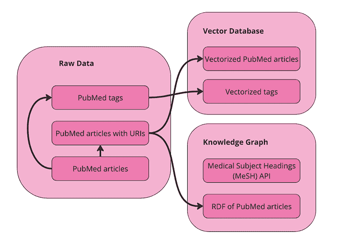

图片由作者提供

我们在向量数据库中有两个集合用于查询：文章和术语。我们还有以 RDF 格式表示的数据。由于 MeSH 有一个 API，我将直接查询 API 以获取术语的替代名称和更窄的概念。

## 在 Weaviate 中向量化数据

首先，导入所需的包并设置 Weaviate 客户端：

```py
import weaviate<br>from weaviate.util import generate_uuid5<br>from weaviate.classes.init import Auth<br>import os<br>import json<br>import pandas as pd<br><br>client = weaviate.connect_to_weaviate_cloud(<br>    cluster_url="XXX",  # Replace with your Weaviate Cloud URL<br>    auth_credentials=Auth.api_key("XXX"),  # Replace with your Weaviate Cloud key<br>    headers={'X-OpenAI-Api-key': "XXX"}  # Replace with your OpenAI API key<br>)
```

读取 PubMed 期刊文章。我正在使用[Databricks](https://www.databricks.com/)运行这个笔记本，所以你可能需要根据你运行的位置进行更改。这里的目的是只是将数据放入 pandas DataFrame 中。

```py
df = spark.sql("SELECT * FROM workspace.default.pub_med_multi_label_text_classification_dataset_processed").toPandas()
```

如果你在本地运行，只需这样做：

```py
df = pd.read_csv("PubMed Multi Label Text Classification Dataset Processed.csv")
```

然后稍微清理一下数据：

```py
import numpy as np<br># Replace infinity values with NaN and then fill NaN values<br>df.replace([np.inf, -np.inf], np.nan, inplace=True)<br>df.fillna('', inplace=True)<br><br># Convert columns to string type<br>df['Title'] = df['Title'].astype(str)<br>df['abstractText'] = df['abstractText'].astype(str)<br>df['meshMajor'] = df['meshMajor'].astype(str)
```

现在，我们需要为每篇文章创建一个 URI 并将其添加为新列。这是很重要的，因为 URI 是我们将文章的向量表示与文章的知识图谱表示连接起来的方式。

```py
import urllib.parse<br>from rdflib import Graph, RDF, RDFS, Namespace, URIRef, Literal<br><br><br># Function to create a valid URI<br>def create_valid_uri(base_uri, text):<br>    if pd.isna(text):<br>        return None<br>    # Encode text to be used in URI<br>    sanitized_text = urllib.parse.quote(text.strip().replace(' ', '_').replace('"', '').replace('<', '').replace('>', '').replace("'", "_"))<br>    return URIRef(f"{base_uri}/{sanitized_text}")<br><br><br># Function to create a valid URI for Articles<br>def create_article_uri(title, base_namespace="http://example.org/article/"):<br>    """<br>    Creates a URI for an article by replacing non-word characters with underscores and URL-encoding.<br><br>    Args:<br>        title (str): The title of the article.<br>        base_namespace (str): The base namespace for the article URI.<br><br>    Returns:<br>        URIRef: The formatted article URI.<br>    """<br>    if pd.isna(title):<br>        return None<br>    # Replace non-word characters with underscores<br>    sanitized_title = re.sub(r'\W+', '_', title.strip())<br>    # Condense multiple underscores into a single underscore<br>    sanitized_title = re.sub(r'_+', '_', sanitized_title)<br>    # URL-encode the term<br>    encoded_title = quote(sanitized_title)<br>    # Concatenate with base_namespace without adding underscores<br>    uri = f"{base_namespace}{encoded_title}"<br>    return URIRef(uri)<br><br># Add a new column to the DataFrame for the article URIs<br>df['Article_URI'] = df['Title'].apply(lambda title: create_valid_uri("http://example.org/article", title))
```

我们还希望创建一个包含用于标记文章的所有 MeSH 术语的 DataFrame。这将在我们想要搜索类似 MeSH 术语时非常有用。

```py
# Function to clean and parse MeSH terms<br>def parse_mesh_terms(mesh_list):<br>    if pd.isna(mesh_list):<br>        return []<br>    return [<br>        term.strip().replace(' ', '_')<br>        for term in mesh_list.strip("[]'").split(',')<br>    ]<br><br># Function to create a valid URI for MeSH terms<br>def create_valid_uri(base_uri, text):<br>    if pd.isna(text):<br>        return None<br>    sanitized_text = urllib.parse.quote(<br>        text.strip()<br>        .replace(' ', '_')<br>        .replace('"', '')<br>        .replace('<', '')<br>        .replace('>', '')<br>        .replace("'", "_")<br>    )<br>    return f"{base_uri}/{sanitized_text}"<br><br># Extract and process all MeSH terms<br>all_mesh_terms = []<br>for mesh_list in df["meshMajor"]:<br>    all_mesh_terms.extend(parse_mesh_terms(mesh_list))<br><br># Deduplicate terms<br>unique_mesh_terms = list(set(all_mesh_terms))<br><br># Create a DataFrame of MeSH terms and their URIs<br>mesh_df = pd.DataFrame({<br>    "meshTerm": unique_mesh_terms,<br>    "URI": [create_valid_uri("http://example.org/mesh", term) for term in unique_mesh_terms]<br>})<br><br># Display the DataFrame<br>print(mesh_df)
```

向量化文章 DataFrame：

```py
from weaviate.classes.config import Configure<br><br><br>#define the collection<br>articles = client.collections.create(<br>    name = "Article",<br>    vectorizer_config=Configure.Vectorizer.text2vec_openai(),  # If set to "none" you must always provide vectors yourself. Could be any other "text2vec-*" also.<br>    generative_config=Configure.Generative.openai(),  # Ensure the `generative-openai` module is used for generative queries<br>)<br><br>#add ojects<br>articles = client.collections.get("Article")<br><br>with articles.batch.dynamic() as batch:<br>    for index, row in df.iterrows():<br>        batch.add_object({<br>            "title": row["Title"],<br>            "abstractText": row["abstractText"],<br>            "Article_URI": row["Article_URI"],<br>            "meshMajor": row["meshMajor"],<br>        })
```

现在将 MeSH 术语向量化：

```py
#define the collection<br>terms = client.collections.create(<br>    name = "term",<br>    vectorizer_config=Configure.Vectorizer.text2vec_openai(),  # If set to "none" you must always provide vectors yourself. Could be any other "text2vec-*" also.<br>    generative_config=Configure.Generative.openai(),  # Ensure the `generative-openai` module is used for generative queries<br>)<br><br>#add ojects<br>terms = client.collections.get("term")<br><br>with terms.batch.dynamic() as batch:<br>    for index, row in mesh_df.iterrows():<br>        batch.add_object({<br>            "meshTerm": row["meshTerm"],<br>            "URI": row["URI"],<br>        })
```

在这一点上，你可以直接对向量化后的数据集运行语义搜索、相似性搜索和 RAG。我不会在这里详细介绍，但你可以在我的[配套笔记本](https://github.com/SteveHedden/kg_llm/tree/main/graphRAGapp)中查看代码以进行这些操作。

## 将数据转换为知识图谱

我只是使用了我们在[上一篇文章](https://medium.com/towards-data-science/how-to-implement-graph-rag-using-knowledge-graphs-and-vector-databases-60bb69a22759)中使用的相同代码来做这件事。我们基本上将数据中的每一行都转换成我们 KG 中的“文章”实体。然后，我们为这些文章提供标题、摘要和 MeSH 术语属性。我们还将每个 MeSH 术语转换成实体。此代码还为每篇文章添加了随机日期作为“发布日期”属性，以及一个介于 1 和 10 之间的随机数字作为“访问”属性。我们不会在这个演示中使用这些属性。以下是创建的图的视觉表示。

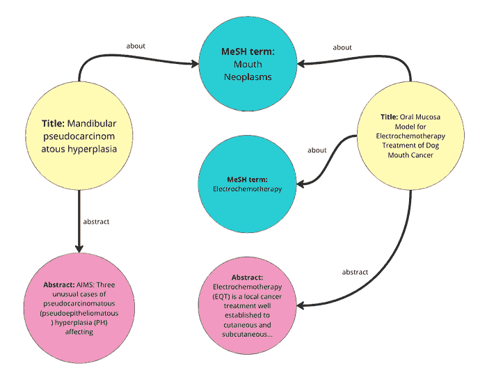

这里是如何遍历 DataFrame 并将其转换为 RDF 数据的：

```py
from rdflib import Graph, RDF, RDFS, Namespace, URIRef, Literal<br>from rdflib.namespace import SKOS, XSD<br>import pandas as pd<br>import urllib.parse<br>import random<br>from datetime import datetime, timedelta<br>import re<br>from urllib.parse import quote<br><br># --- Initialization ---<br>g = Graph()<br><br># Define namespaces<br>schema = Namespace('http://schema.org/')<br>ex = Namespace('http://example.org/')<br>prefixes = {<br>    'schema': schema,<br>    'ex': ex,<br>    'skos': SKOS,<br>    'xsd': XSD<br>}<br>for p, ns in prefixes.items():<br>    g.bind(p, ns)<br><br># Define classes and properties<br>Article = URIRef(ex.Article)<br>MeSHTerm = URIRef(ex.MeSHTerm)<br>g.add((Article, RDF.type, RDFS.Class))<br>g.add((MeSHTerm, RDF.type, RDFS.Class))<br><br>title = URIRef(schema.name)<br>abstract = URIRef(schema.description)<br>date_published = URIRef(schema.datePublished)<br>access = URIRef(ex.access)<br><br>g.add((title, RDF.type, RDF.Property))<br>g.add((abstract, RDF.type, RDF.Property))<br>g.add((date_published, RDF.type, RDF.Property))<br>g.add((access, RDF.type, RDF.Property))<br><br># Function to clean and parse MeSH terms<br>def parse_mesh_terms(mesh_list):<br>    if pd.isna(mesh_list):<br>        return []<br>    return [term.strip() for term in mesh_list.strip("[]'").split(',')]<br><br># Enhanced convert_to_uri function<br>def convert_to_uri(term, base_namespace="http://example.org/mesh/"):<br>    """<br>    Converts a MeSH term into a standardized URI by replacing spaces and special characters with underscores,<br>    ensuring it starts and ends with a single underscore, and URL-encoding the term.<br><br>    Args:<br>        term (str): The MeSH term to convert.<br>        base_namespace (str): The base namespace for the URI.<br><br>    Returns:<br>        URIRef: The formatted URI.<br>    """<br>    if pd.isna(term):<br>        return None  # Handle NaN or None terms gracefully<br>    <br>    # Step 1: Strip existing leading and trailing non-word characters (including underscores)<br>    stripped_term = re.sub(r'^\W+|\W+$', '', term)<br>    <br>    # Step 2: Replace non-word characters with underscores (one or more)<br>    formatted_term = re.sub(r'\W+', '_', stripped_term)<br>    <br>    # Step 3: Replace multiple consecutive underscores with a single underscore<br>    formatted_term = re.sub(r'_+', '_', formatted_term)<br>    <br>    # Step 4: URL-encode the term to handle any remaining special characters<br>    encoded_term = quote(formatted_term)<br>    <br>    # Step 5: Add single leading and trailing underscores<br>    term_with_underscores = f"_{encoded_term}_"<br>    <br>    # Step 6: Concatenate with base_namespace without adding an extra underscore<br>    uri = f"{base_namespace}{term_with_underscores}"<br><br>    return URIRef(uri)<br><br># Function to generate a random date within the last 5 years<br>def generate_random_date():<br>    start_date = datetime.now() - timedelta(days=5*365)<br>    random_days = random.randint(0, 5*365)<br>    return start_date + timedelta(days=random_days)<br><br># Function to generate a random access value between 1 and 10<br>def generate_random_access():<br>    return random.randint(1, 10)<br><br># Function to create a valid URI for Articles<br>def create_article_uri(title, base_namespace="http://example.org/article"):<br>    """<br>    Creates a URI for an article by replacing non-word characters with underscores and URL-encoding.<br><br>    Args:<br>        title (str): The title of the article.<br>        base_namespace (str): The base namespace for the article URI.<br><br>    Returns:<br>        URIRef: The formatted article URI.<br>    """<br>    if pd.isna(title):<br>        return None<br>    # Encode text to be used in URI<br>    sanitized_text = urllib.parse.quote(title.strip().replace(' ', '_').replace('"', '').replace('<', '').replace('>', '').replace("'", "_"))<br>    return URIRef(f"{base_namespace}/{sanitized_text}")<br><br># Loop through each row in the DataFrame and create RDF triples<br>for index, row in df.iterrows():<br>    article_uri = create_article_uri(row['Title'])<br>    if article_uri is None:<br>        continue<br>    <br>    # Add Article instance<br>    g.add((article_uri, RDF.type, Article))<br>    g.add((article_uri, title, Literal(row['Title'], datatype=XSD.string)))<br>    g.add((article_uri, abstract, Literal(row['abstractText'], datatype=XSD.string)))<br>    <br>    # Add random datePublished and access<br>    random_date = generate_random_date()<br>    random_access = generate_random_access()<br>    g.add((article_uri, date_published, Literal(random_date.date(), datatype=XSD.date)))<br>    g.add((article_uri, access, Literal(random_access, datatype=XSD.integer)))<br>    <br>    # Add MeSH Terms<br>    mesh_terms = parse_mesh_terms(row['meshMajor'])<br>    for term in mesh_terms:<br>        term_uri = convert_to_uri(term, base_namespace="http://example.org/mesh/")<br>        if term_uri is None:<br>            continue<br>        <br>        # Add MeSH Term instance<br>        g.add((term_uri, RDF.type, MeSHTerm))<br>        g.add((term_uri, RDFS.label, Literal(term.replace('_', ' '), datatype=XSD.string)))<br>        <br>        # Link Article to MeSH Term<br>        g.add((article_uri, schema.about, term_uri))<br><br># Path to save the file<br>file_path = "/Workspace/PubMedGraph.ttl"<br><br># Save the file<br>g.serialize(destination=file_path, format='turtle')<br><br>print(f"File saved at {file_path}")
```

好的，现在我们有了数据的向量化版本和数据的图（RDF）版本。每个向量都与一个 URI 相关联，这对应于 KG 中的一个实体，因此我们可以在数据格式之间来回转换。

# 构建应用

我决定使用 [Streamlit](https://streamlit.io/) 来构建这个图 RAG 应用的界面。与上一篇博客文章类似，我保持了相同的用户流程。

1.  **搜索文章：**首先，用户使用搜索词搜索文章。这完全依赖于向量数据库。用户的搜索词（们）被发送到向量数据库，并返回与向量空间中该术语最近的十篇文章。

1.  **精炼术语：**其次，用户决定使用哪些 MeSH 术语来过滤返回的结果。由于我们也对 MeSH 术语进行了向量化，因此用户可以输入一个自然语言提示来获取最相关的 MeSH 术语。然后，我们允许用户扩展这些术语以查看它们的替代名称和更窄的概念。用户可以根据他们的过滤标准选择他们想要的任何术语。

1.  **过滤与总结：**第三，用户将选定的术语作为过滤器应用于原始的十篇期刊文章。由于 PubMed 文章被标记了 MeSH 术语，我们可以这样做。最后，我们让用户输入一个额外的提示，并将其与过滤后的期刊文章一起发送给 LLM。这是 RAG 应用的生成步骤。

让我们一步一步地通过这些步骤。您可以在我的 GitHub 上看到完整的应用和代码，但以下是结构：

```py
-- app.py (a python file that drives the app and calls other functions as needed)<br>-- query_functions (a folder containing python files with queries)<br>  -- rdf_queries.py (python file with RDF queries)<br>  -- weaviate_queries.py (python file containing weaviate queries)<br>-- PubMedGraph.ttl (the pubmed data in RDF format, stored as a ttl file)
```

## 搜索文章

首先，想要实现的是 Weaviate 的[向量相似性搜索](https://weaviate.io/developers/weaviate/search/similarity)。由于我们的文章已经向量化，我们可以将搜索词发送到向量数据库并获取相似的文章。

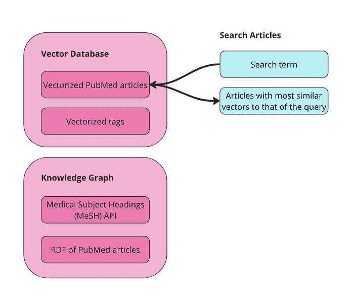

图片由作者提供

在 app.py 中，主要的功能是在向量数据库中搜索相关的期刊文章：

```py
# --- TAB 1: Search Articles ---<br>with tab_search:<br>    st.header("Search Articles (Vector Query)")<br>    query_text = st.text_input("Enter your vector search term (e.g., Mouth Neoplasms):", key="vector_search")<br><br>    if st.button("Search Articles", key="search_articles_btn"):<br>        try:<br>            client = initialize_weaviate_client()<br>            article_results = query_weaviate_articles(client, query_text)<br><br>            # Extract URIs here<br>            article_uris = [<br>                result["properties"].get("article_URI")<br>                for result in article_results<br>                if result["properties"].get("article_URI")<br>            ]<br><br>            # Store article_uris in the session state<br>            st.session_state.article_uris = article_uris<br><br>            st.session_state.article_results = [<br>                {<br>                    "Title": result["properties"].get("title", "N/A"),<br>                    "Abstract": (result["properties"].get("abstractText", "N/A")[:100] + "..."),<br>                    "Distance": result["distance"],<br>                    "MeSH Terms": ", ".join(<br>                        ast.literal_eval(result["properties"].get("meshMajor", "[]"))<br>                        if result["properties"].get("meshMajor") else []<br>                    ),<br><br>                }<br>                for result in article_results<br>            ]<br>            client.close()<br>        except Exception as e:<br>            st.error(f"Error during article search: {e}")<br><br>    if st.session_state.article_results:<br>        st.write("**Search Results for Articles:**")<br>        st.table(st.session_state.article_results)<br>    else:<br>        st.write("No articles found yet.")
```

这个函数使用存储在 weaviate_queries 中的查询来建立 Weaviate 客户端（initialize_weaviate_client）并搜索文章（query_weaviate_articles）。然后我们在表格中显示返回的文章，包括它们的摘要、距离（它们与搜索词的接近程度）以及它们标记的 MeSH 术语。

在 weaviate_queries.py 中查询 Weaviate 的函数看起来是这样的：

```py
# Function to query Weaviate for Articles<br>def query_weaviate_articles(client, query_text, limit=10):<br>    # Perform vector search on Article collection<br>    response = client.collections.get("Article").query.near_text(<br>        query=query_text,<br>        limit=limit,<br>        return_metadata=MetadataQuery(distance=True)<br>    )<br><br>    # Parse response<br>    results = []<br>    for obj in response.objects:<br>        results.append({<br>            "uuid": obj.uuid,<br>            "properties": obj.properties,<br>            "distance": obj.metadata.distance,<br>        })<br>    return results
```

如您所见，我这里只设置了十个结果，只是为了使它更简单，但您可以更改这个设置。这只是在 Weaviate 中使用向量相似性搜索来返回相关结果。

在应用中的最终结果看起来是这样的：

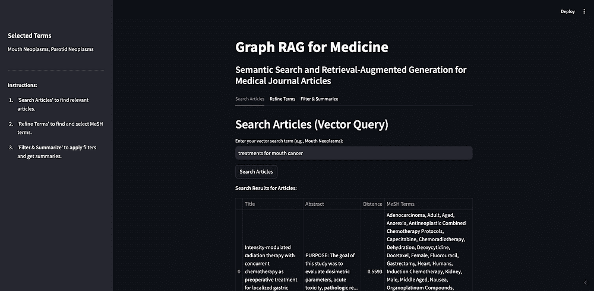

图片由作者提供

作为演示，我将搜索“口腔癌的治疗”这个术语。如您所见，返回了 10 篇文章，大部分是相关的。这展示了基于向量的检索的优点和弱点。

优点是我们可以用最少的努力在我们的数据上构建语义搜索功能。如您所见，我们只是设置了客户端并将数据发送到向量数据库。一旦我们的数据被向量化，我们就可以进行语义搜索、相似性搜索，甚至 RAG。我在这篇帖子的配套笔记本中放了一些这样的例子，但 Weaviate 的[官方文档](https://weaviate.io/developers/weaviate)中还有很多。

基于向量的检索的弱点，如我上面提到的，是它们是黑盒的，并且难以处理事实性知识。在我们的例子中，看起来大部分文章都是关于某种癌症的治疗或疗法。有些文章是关于特定类型的口腔癌，有些是关于牙龈癌（牙龈的癌症）或腭癌（硬腭的癌症）。但也有关于鼻咽癌（上咽部的癌症）、下颌癌（颌部的癌症）和食管癌（食道的癌症）的文章。这些（上咽部、颌部或食道）都不被认为是口腔癌。一个关于鼻咽部肿瘤的特定癌症放射治疗的文章被认为是与提示“口腔癌的治疗”相似，但如果您只寻找口腔癌的治疗方法，这可能并不相关。如果我们直接将这些十篇文章放入我们的 LLM 提示中并要求它“总结不同的治疗方法”，我们会得到错误的信息。

RAG 的目的是给 LLM 提供一组非常具体的附加信息，以便更好地回答你的问题——如果这些信息是错误的或不相关的，可能会导致 LLM 给出误导性的回答。这通常被称为“上下文中毒”。上下文中毒特别危险的地方在于，回答并不一定是事实上的不准确（LLM 可能会准确地总结我们给它提供的治疗方案），也不一定是基于不准确的数据（假设期刊文章本身是准确的），它只是使用了错误的数据来回答你的问题。在这个例子中，用户可能会读到如何治疗错误类型的癌症，这看起来非常糟糕。

## 精炼术语

知识图谱（KGs）可以通过精炼向量数据库的结果来帮助提高回答的准确性，并减少上下文中毒的可能性。下一步是选择我们想要用于过滤文章的 MeSH 术语。首先，我们在术语集合上对向量数据库进行另一个向量相似度搜索。这是因为用户可能不熟悉 MeSH 控制词汇。在我们上面的例子中，我搜索了“口腔癌症的治疗”，但“口腔癌症”不是 MeSH 中的一个术语——他们使用“Mouth Neoplasms”。我们希望用户能够在没有事先了解它们的情况下开始探索 MeSH 术语——这无论使用什么元数据来标记内容都是良好的实践。

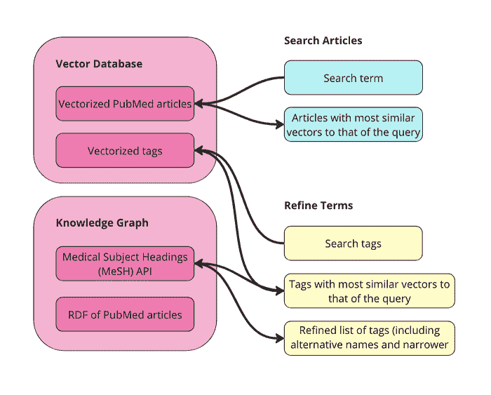

图片由作者提供

获取相关 MeSH 术语的函数几乎与之前的 Weaviate 查询相同。只需将文章替换为术语：

```py
# Function to query Weaviate for MeSH Terms<br>def query_weaviate_terms(client, query_text, limit=10):<br>    # Perform vector search on MeshTerm collection<br>    response = client.collections.get("term").query.near_text(<br>        query=query_text,<br>        limit=limit,<br>        return_metadata=MetadataQuery(distance=True)<br>    )<br><br>    # Parse response<br>    results = []<br>    for obj in response.objects:<br>        results.append({<br>            "uuid": obj.uuid,<br>            "properties": obj.properties,<br>            "distance": obj.metadata.distance,<br>        })<br>    return results
```

在应用中，它看起来是这样的：

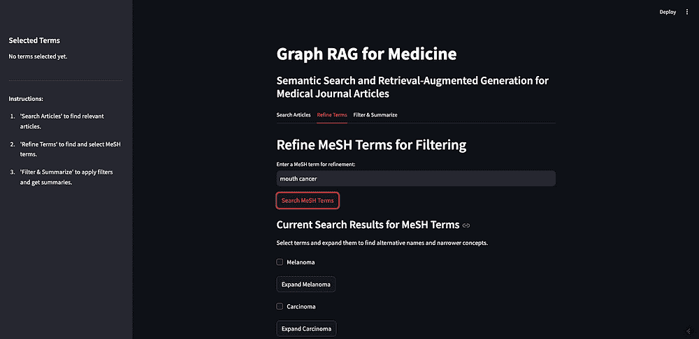

图片由作者提供

如您所见，我搜索了“口腔癌症”，返回了最相似术语。口腔癌症没有返回，因为这不是 MeSH 中的一个术语，但“Mouth Neoplasms”在列表中。

下一步是允许用户扩展返回的术语，以查看替代名称和更窄的概念。这需要查询 [MeSH API](https://id.nlm.nih.gov/mesh/)。这是这个应用中最棘手的部分，原因有很多。最大的问题是 Streamlit 要求所有内容都有一个唯一的 ID，但 MeSH 术语可以重复——如果返回的概念是另一个概念的子项，那么当你展开父项时，你将会有一个子项的重复。我想我已经解决了大部分大问题，应用应该可以工作，但在这个阶段可能还有要发现的错误。

我们依赖的函数在 rdf_queries.py 中找到。我们需要一个函数来获取术语的替代名称：

```py
# Fetch alternative names and triples for a MeSH term<br>def get_concept_triples_for_term(term):<br>    term = sanitize_term(term)  # Sanitize input term<br>    sparql = SPARQLWrapper("https://id.nlm.nih.gov/mesh/sparql")<br>    query = f"""<br>    PREFIX rdf: <http://www.w3.org/1999/02/22-rdf-syntax-ns#><br>    PREFIX rdfs: <http://www.w3.org/2000/01/rdf-schema#><br>    PREFIX meshv: <http://id.nlm.nih.gov/mesh/vocab#><br>    PREFIX mesh: <http://id.nlm.nih.gov/mesh/><br><br>    SELECT ?subject ?p ?pLabel ?o ?oLabel<br>    FROM <http://id.nlm.nih.gov/mesh><br>    WHERE {{<br>        ?subject rdfs:label "{term}"@en .<br>        ?subject ?p ?o .<br>        FILTER(CONTAINS(STR(?p), "concept"))<br>        OPTIONAL {{ ?p rdfs:label ?pLabel . }}<br>        OPTIONAL {{ ?o rdfs:label ?oLabel . }}<br>    }}<br>    """<br>    try:<br>        sparql.setQuery(query)<br>        sparql.setReturnFormat(JSON)<br>        results = sparql.query().convert()<br><br>        triples = set()<br>        for result in results["results"]["bindings"]:<br>            obj_label = result.get("oLabel", {}).get("value", "No label")<br>            triples.add(sanitize_term(obj_label))  # Sanitize term before adding<br><br>        # Add the sanitized term itself to ensure it's included<br>        triples.add(sanitize_term(term))<br>        return list(triples)<br><br>    except Exception as e:<br>        print(f"Error fetching concept triples for term '{term}': {e}")<br>        return []
```

我们还需要获取给定术语的更窄（子）概念的功能。我有两个实现这一目标的功能——一个获取术语的直接子项，另一个是递归函数，它返回给定深度的所有子项。

```py
# Fetch narrower concepts for a MeSH term<br>def get_narrower_concepts_for_term(term):<br>    term = sanitize_term(term)  # Sanitize input term<br>    sparql = SPARQLWrapper("https://id.nlm.nih.gov/mesh/sparql")<br>    query = f"""<br>    PREFIX rdf: <http://www.w3.org/1999/02/22-rdf-syntax-ns#><br>    PREFIX rdfs: <http://www.w3.org/2000/01/rdf-schema#><br>    PREFIX meshv: <http://id.nlm.nih.gov/mesh/vocab#><br>    PREFIX mesh: <http://id.nlm.nih.gov/mesh/><br><br>    SELECT ?narrowerConcept ?narrowerConceptLabel<br>    WHERE {{<br>        ?broaderConcept rdfs:label "{term}"@en .<br>        ?narrowerConcept meshv:broaderDescriptor ?broaderConcept .<br>        ?narrowerConcept rdfs:label ?narrowerConceptLabel .<br>    }}<br>    """<br>    try:<br>        sparql.setQuery(query)<br>        sparql.setReturnFormat(JSON)<br>        results = sparql.query().convert()<br><br>        concepts = set()<br>        for result in results["results"]["bindings"]:<br>            subject_label = result.get("narrowerConceptLabel", {}).get("value", "No label")<br>            concepts.add(sanitize_term(subject_label))  # Sanitize term before adding<br><br>        return list(concepts)<br><br>    except Exception as e:<br>        print(f"Error fetching narrower concepts for term '{term}': {e}")<br>        return []<br><br># Recursive function to fetch narrower concepts to a given depth<br>def get_all_narrower_concepts(term, depth=2, current_depth=1):<br>    term = sanitize_term(term)  # Sanitize input term<br>    all_concepts = {}<br>    try:<br>        narrower_concepts = get_narrower_concepts_for_term(term)<br>        all_concepts[sanitize_term(term)] = narrower_concepts<br><br>        if current_depth < depth:<br>            for concept in narrower_concepts:<br>                child_concepts = get_all_narrower_concepts(concept, depth, current_depth + 1)<br>                all_concepts.update(child_concepts)<br><br>    except Exception as e:<br>        print(f"Error fetching all narrower concepts for term '{term}': {e}")<br><br>    return all_concepts
```

第 2 步的另一个重要部分是允许用户选择要添加到“已选术语”列表中的术语。这些术语将出现在屏幕左侧的侧边栏中。有很多事情可以改进这一步，比如：

+   没有清除所有内容的方法，但您可以在需要时清除缓存或刷新浏览器。

+   没有选择“选择所有更窄概念”的方法，这会有所帮助。

+   目前没有添加过滤规则的选项。目前，我们只是假设文章必须包含术语 A 或术语 B 或术语 C 等。最后的排名是基于文章被标记的术语数量。

这是在应用程序中的样子：

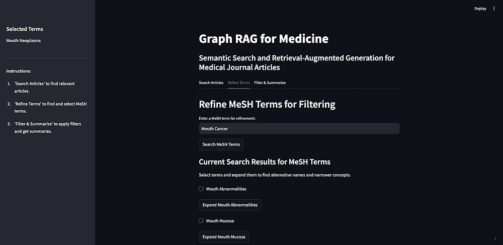

作者提供的图片

我可以展开口腔肿瘤以查看替代名称，在这种情况下，“口腔癌”，以及所有更窄的概念。如您所见，大多数更窄的概念都有自己的子项，您也可以展开它们。出于这个演示的目的，我将选择口腔肿瘤的所有子项。

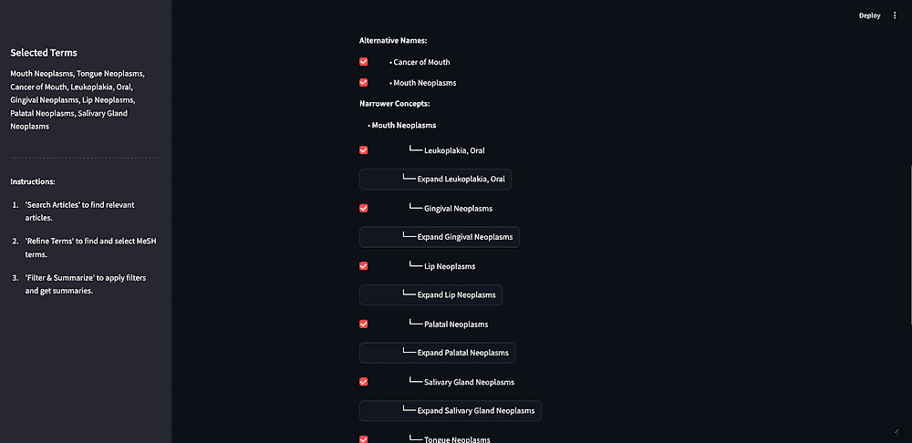

作者提供的图片

这一步很重要，不仅因为它允许用户过滤搜索结果，而且因为它也是用户探索 MeSH 图本身并从中学习的一种方式。例如，这将是在用户学习鼻咽部肿瘤不是口腔肿瘤子集的地方。

## 过滤 & 摘要

现在您已经获得了您的文章和过滤术语，您可以对结果应用过滤并进行总结。这是我们将第一步返回的原始 10 篇文章与经过精炼的 MeSH 术语列表结合在一起的地方。我们允许用户在将提示发送到 LLM 之前添加额外的上下文。

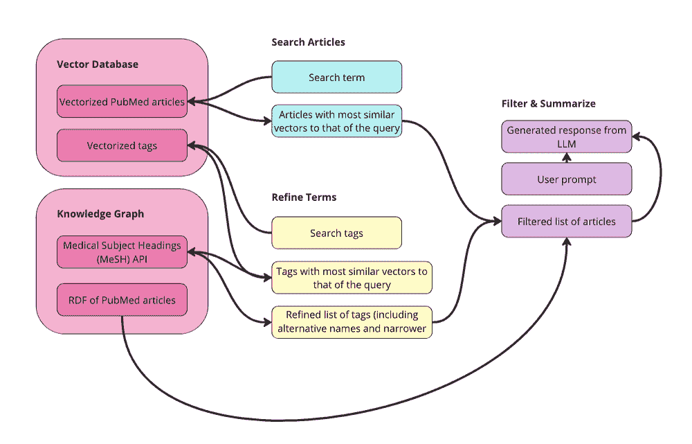

作者提供的图片

我们进行这种过滤的方式是，我们需要从原始搜索中获取 10 篇文章的 URI。然后我们可以查询我们的知识图，看看哪些文章被标记了相关的 MeSH 术语。此外，我们保存这些文章的摘要以供下一步使用。这将是我们可以根据访问控制或其他用户控制的参数（如作者、文件类型、发布日期等）进行过滤的地方。我没有在这个应用程序中包含任何这些，但我添加了访问控制和发布日期的属性，以防我们想在稍后的 UI 中添加这些。

这是在 app.py 中的代码样子：

```py
 if st.button("Filter Articles"):<br>            try:<br>                # Check if we have URIs from tab 1<br>                if "article_uris" in st.session_state and st.session_state.article_uris:<br>                    article_uris = st.session_state.article_uris<br><br>                    # Convert list of URIs into a string for the VALUES clause or FILTER<br>                    article_uris_string = ", ".join([f"<{str(uri)}>" for uri in article_uris])<br><br>                    SPARQL_QUERY = """<br>                    PREFIX schema: <http://schema.org/><br>                    PREFIX ex: <http://example.org/><br><br>                    SELECT ?article ?title ?abstract ?datePublished ?access ?meshTerm<br>                    WHERE {{<br>                      ?article a ex:Article ;<br>                               schema:name ?title ;<br>                               schema:description ?abstract ;<br>                               schema:datePublished ?datePublished ;<br>                               ex:access ?access ;<br>                               schema:about ?meshTerm .<br><br>                      ?meshTerm a ex:MeSHTerm .<br><br>                      FILTER (?article IN ({article_uris}))<br>                    }}<br>                    """<br>                    # Insert the article URIs into the query<br>                    query = SPARQL_QUERY.format(article_uris=article_uris_string)<br>                else:<br>                    st.write("No articles selected from Tab 1.")<br>                    st.stop()<br><br>                # Query the RDF and save results in session state<br>                top_articles = query_rdf(LOCAL_FILE_PATH, query, final_terms)<br>                st.session_state.filtered_articles = top_articles<br><br>                if top_articles:<br><br>                    # Combine abstracts from top articles and save in session state<br>                    def combine_abstracts(ranked_articles):<br>                        combined_text = " ".join(<br>                            [f"Title: {data['title']} Abstract: {data['abstract']}" for article_uri, data in<br>                             ranked_articles]<br>                        )<br>                        return combined_text<br><br><br>                    st.session_state.combined_text = combine_abstracts(top_articles)<br><br>                else:<br>                    st.write("No articles found for the selected terms.")<br>            except Exception as e:<br>                st.error(f"Error filtering articles: {e}")
```

这是在 rdf_queries.py 文件中使用的 query_rdf 函数。该函数看起来是这样的：

```py
# Function to query RDF using SPARQL<br>def query_rdf(local_file_path, query, mesh_terms, base_namespace="http://example.org/mesh/"):<br>    if not mesh_terms:<br>        raise ValueError("The list of MeSH terms is empty or invalid.")<br><br>    print("SPARQL Query:", query)<br><br>    # Create and parse the RDF graph<br>    g = Graph()<br>    g.parse(local_file_path, format="ttl")<br><br>    article_data = {}<br><br>    for term in mesh_terms:<br>        # Convert the term to a valid URI<br>        mesh_term_uri = convert_to_uri(term, base_namespace)<br>        #print("Term:", term, "URI:", mesh_term_uri)<br><br>        # Perform SPARQL query with initBindings<br>        results = g.query(query, initBindings={'meshTerm': mesh_term_uri})<br><br>        for row in results:<br>            article_uri = row['article']<br>            if article_uri not in article_data:<br>                article_data[article_uri] = {<br>                    'title': row['title'],<br>                    'abstract': row['abstract'],<br>                    'datePublished': row['datePublished'],<br>                    'access': row['access'],<br>                    'meshTerms': set()<br>                }<br>            article_data[article_uri]['meshTerms'].add(str(row['meshTerm']))<br>        #print("DEBUG article_data:", article_data)<br><br>    # Rank articles by the number of matching MeSH terms<br>    ranked_articles = sorted(<br>        article_data.items(),<br>        key=lambda item: len(item[1]['meshTerms']),<br>        reverse=True<br>    )<br>    return ranked_articles[:10]
```

如您所见，此函数还将 MeSH 术语转换为 URI，这样我们就可以使用图进行过滤。在将术语转换为 URI 的方式上要小心，并确保它与其他函数保持一致。

这是在应用程序中的样子：

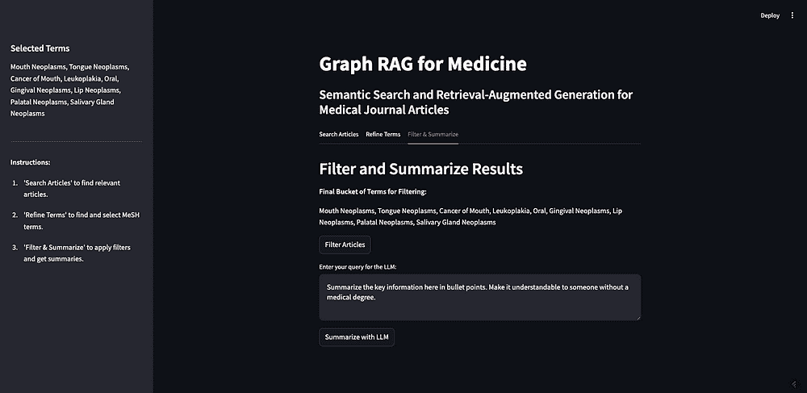

作者提供的图片

如您所见，我们从前一步选出的两个 MeSH 术语在这里。如果点击“过滤文章”，它将使用我们在第二步中设置的过滤标准过滤原始的 10 篇文章。文章将返回其完整的摘要，以及其标记的 MeSH 术语（见下图）。

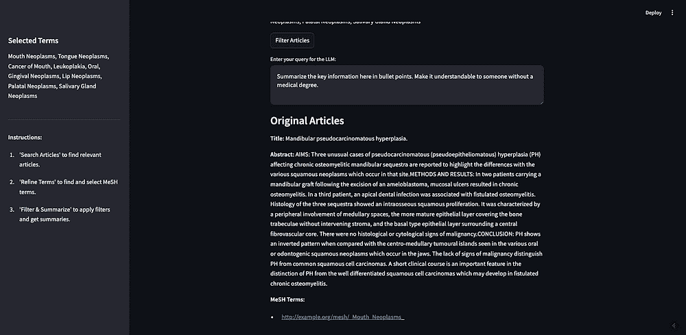

作者提供的图片

返回了 5 篇文章。其中两篇被标记为“口腔肿瘤”，一篇被标记为“牙龈肿瘤”，还有两篇被标记为“硬腭肿瘤”。

现在我们已经有一个我们想要用来生成响应的精选文章列表，我们可以进入最后一步。我们希望将这些文章发送给一个 LLM 来生成响应，但我们也可以在提示中添加额外的上下文。我有一个默认提示说：“在这里用项目符号总结关键信息。使其对没有医学学位的人也能理解。”对于这个演示，我将调整提示以反映我们的原始搜索词：

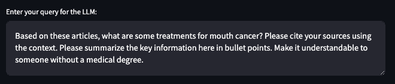

结果如下：

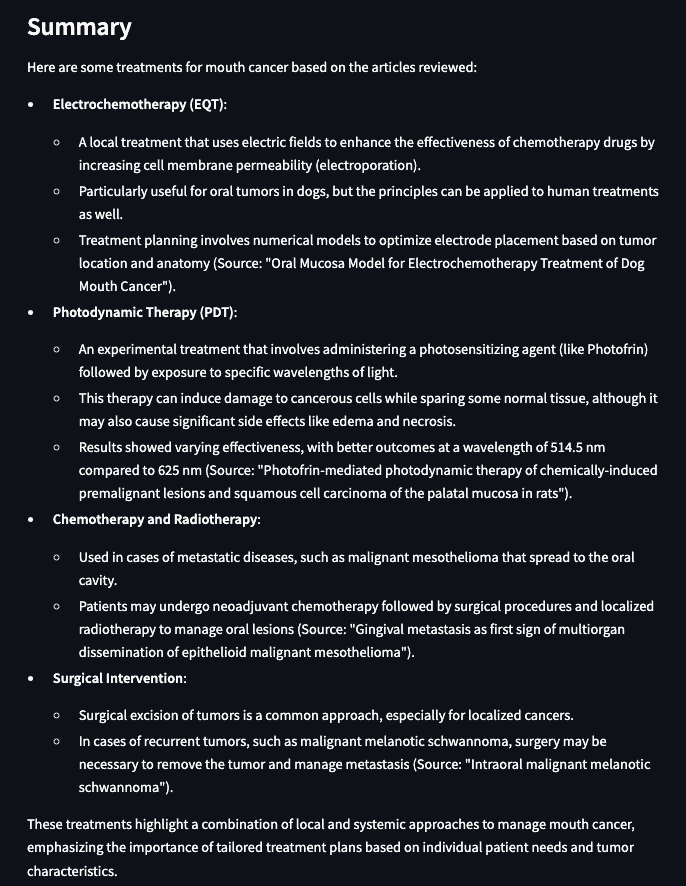

结果看起来更好，主要是因为我知道我们正在总结的文章可能是关于口腔癌治疗的。数据集不包含实际的期刊文章，只有摘要。因此，这些结果只是摘要的摘要。这可能有一些价值，但如果我们正在构建一个真正的应用程序而不是仅仅是一个演示，这就是我们可以整合文章全文的步骤。或者，这就是用户/研究人员会去阅读这些文章的步骤，而不是完全依赖 LLM 进行总结。

# 结论

本教程演示了如何结合向量数据库和知识图谱可以显著增强 RAG 应用。通过利用向量相似性进行初始搜索和结构化知识图谱元数据进行过滤和组织，我们可以构建一个提供准确、可解释和特定领域结果的系统。将 MeSH（一个建立已久的受控词汇）集成其中，突出了领域专业知识在编制元数据方面的力量，这确保了检索步骤与应用的独特需求保持一致，同时保持与其他系统的互操作性。这种方法不仅限于医学——其原则可以应用于任何存在结构化数据和文本信息的领域。

本教程强调了利用每种技术发挥其最佳作用的重要性。向量数据库在基于相似性的检索方面表现出色，而知识图谱在提供上下文、结构和语义方面表现出色。此外，扩展 RAG 应用需要元数据层来打破数据孤岛并执行治理策略。基于特定领域元数据和强大治理的深思熟虑的设计是构建既准确又可扩展的 RAG 系统的途径。
