# 如何为 2026 年的资本支出审查构建 AI 预算规划优化器：LangGraph、FastAPI 和 n8n

> 原文：[`towardsdatascience.com/how-to-build-an-ai-budget-planning-optimizer-for-your-2026-capex-review-langgraph-fastapi-and-n8n/`](https://towardsdatascience.com/how-to-build-an-ai-budget-planning-optimizer-for-your-2026-capex-review-langgraph-fastapi-and-n8n/)

<mdspan datatext="el1757394638147" class="mdspan-comment">如果**简单的电子邮件**是复杂预算规划的 UI，而 AI 代理则处理背后的优化，会怎样？</mdspan>

> 如果我能发送“运行 2026 年预算，XXX 上限和 Y%的可持续性”并得到一个决定，那将改变我们的预算审查。

这就是物流副总裁在讨论自动化年度 CAPEX 审批周期投资组合选择自动化时如何阐述问题的。

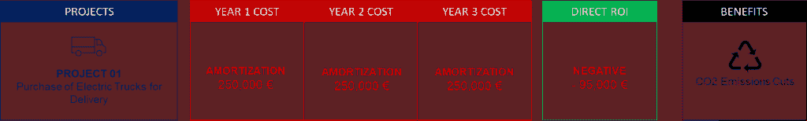

CAPEX 申请示例 – (图片由 Samir Saci 提供)

由于公司投资于昂贵的物流设备，总监收到了来自运营团队的短期和长期项目的 CAPEX 申请。

这是一个复杂的练习，因为你需要在投资回报和长期战略之间取得平衡。

> *作为数据科学家，我们如何支持这个决策过程？*

使用线性规划，我们可以帮助决定哪些项目可以获得资金以最大化投资回报率，同时遵守多年的预算限制。

在这篇文章中，我们将构建一个**AI 预算规划代理**，将电子邮件请求转换为优化的资本支出投资组合。

这个 AI 工作流程是使用 n8n 进行编排，并使用 LangGraph 创建一个连接到执行线性规划模型的 FastAPI 微服务的推理代理。

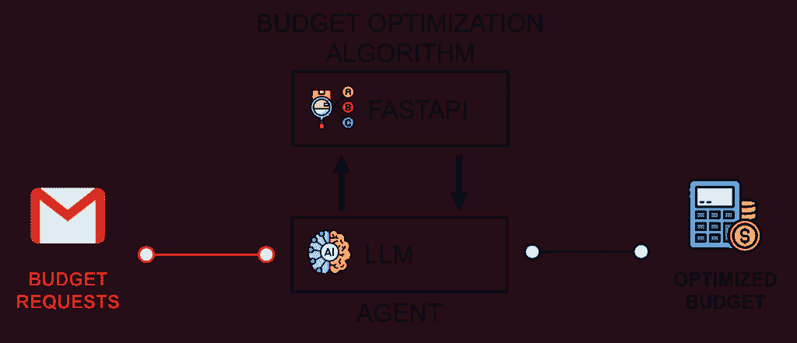

工作流程目标 – (图片由 Samir Saci 提供)

我们将审查架构，并使用一个具有至少 20%可持续性项目分配限制的实际预算优化请求来探索结果。

## 使用 Python 进行预算规划优化

### 问题陈述：运营预算规划

我们支持一家总部位于新加坡的大型第三方物流服务提供商（3PL）的亚太地区总监。

他们的工作是管理亚太地区四个国家的其他公司的仓储和运输运营。

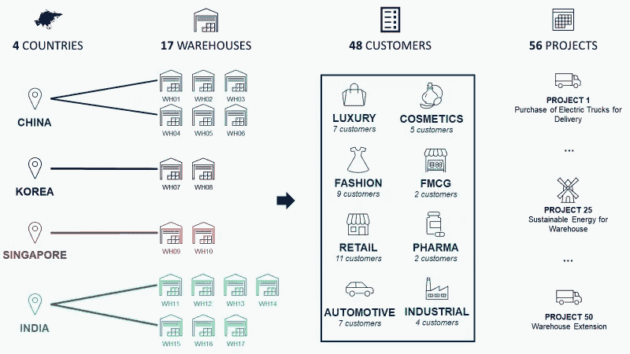

我们在谈论支持 48 个客户，这些客户被分为超过八个市场垂直领域（奢侈品、化妆品……）。

例如，他们管理北京一家大型快时尚零售商的 10,000 平方米仓库，向中国北部的 50 家门店供货。

> *仓库经理：我们需要 15 万欧元来购买一条新传送带，这将提高我们的接收效率 20%。*

我们的总监从其位于亚太地区的 17 个仓库经理那里收到了需要资本支出（CAPEX）的项目列表。

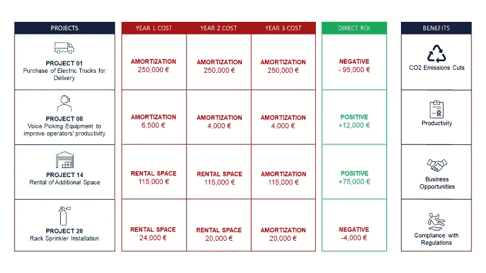

CAPEX 申请示例 – (图片由 Samir Saci 提供)

对于每个项目，CAPEX 应用程序包括一个简要描述（例如，租赁 500 平方米），三年的成本概况（第一年：11.5 万欧元；第二年：12 万欧元；第三年：15 万欧元），以及预期的投资回报率（例如，+5 万欧元）。

这些项目还可以带来额外的收益：

+   **业务发展**：解锁新的收入（例如，为新客户或产品线提供产能）

+   **可持续性（CO₂减少）**：通过节能设备或布局变更降低排放

+   **数字化转型**：提高数据可见性，自动化重复性任务，并实现 AI 驱动的决策

+   **运营卓越**：提高吞吐量，减少缺陷和返工，缩短换线时间，稳定流程。

+   **HSE（健康、安全与环境）**：通过更安全的设备降低事故风险和保险暴露

+   **企业社会责任（CSR）**：加强社区和劳动力倡议（例如，培训，无障碍）

例如，一个仓库自动化项目可以减少包装使用（可持续性），降低操作员压力（企业社会责任），并加速数字化转型。

一些额外的收益与我们的总监需要遵循的最高管理层指导方针相关。

> *APAC 总监：“我应该如何分配 XX 百万欧元的预算以最大化投资回报率，同时遵守我的最高管理层指导方针？”*

由于总监每次会议都要处理超过 50 个项目，我们建议构建一个线性规划模块，以确定最佳选择，同时考虑外部约束。

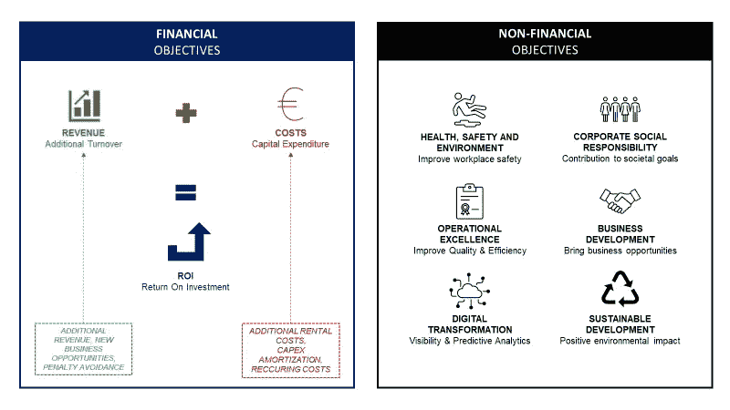

解决方案的目标 – （图片由 Samir Saci 提供）

作为输入，我们得到可用预算和管理目标，以及 CAPEX 应用程序的电子表格。

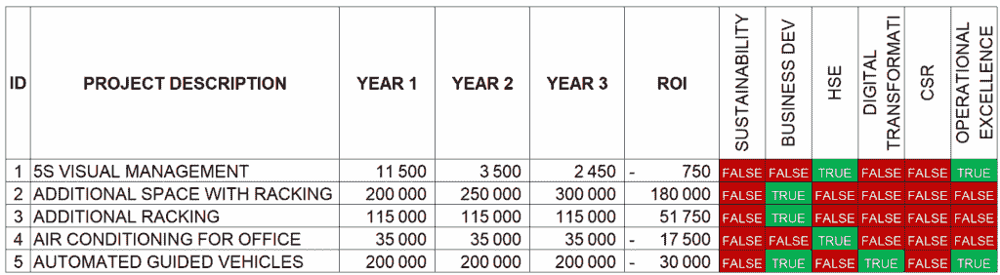

CAPEX 应用程序电子表格示例 – （图片由 Samir Saci 提供）

这将成为我们解决方案的输入之一。

### FastAPI 微服务：用于 CAPEX 预算规划的 0-1 混合整数优化器

为了解决这个问题，我们利用了 Python PuLP 库提供的线性规划（LP）和整数规划（IP）问题的建模框架。

解决方案被封装在一个部署在云端的 FastAPI 微服务中。

#### 决策变量

对于每个项目 i，我们定义一个二元值来告知是否分配预算：

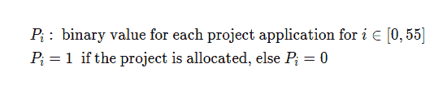

决策变量 – （图片由 Samir Saci 提供）

#### 目标函数

目标是最大化我们选定的项目组合的总投资回报率：

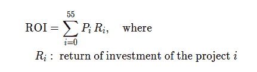

目标函数 – （图片由 Samir Saci 提供）

#### 约束条件

由于我们每年不能花费超过分配的金额，我们必须考虑未来三年的预算约束。

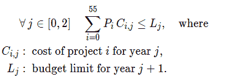

约束条件 – （图片由 Samir Saci 提供）

> APAC 总监：我们的首席执行官希望我们将 20%的预算投资于支持我们可持续发展路线图的项目。

此外，我们可能还对特定管理目标的最小预算有约束。


在上面的例子中，我们确保可持续性项目的总投资等于或大于 `S_min`。

现在我们已经定义了我们的模型，我们可以使用[本文中共享的代码](https://towardsdatascience.com/automate-budget-planning-using-linear-programming-5254aace697c/)将其打包为 FastAPI 微服务。

整个工作流程将接受使用 Pydantic 定义的特定模式进行验证和默认值。

```py
from pydantic import BaseModel
from typing import Optional

class LaunchParamsBudget(BaseModel):
    budget_year1: int = 1250000
    budget_year2: int = 1500000
    budget_year3: int = 1750000
    set_min_budget: bool = False
    min_budget_objective: Optional[str] = 'Sustainability'
    min_budget_perc: float = 20

class EmailRequest(BaseModel):
    email_text: str
```

LaunchParamsBudget 捕获优化输入：

+   三个**年度预算上限**（以欧元表示 `budget_year1/2/3`）

+   通过 `set_min_budget` 切换的**最小分配规则**，其目标管理目标是 `min_budget_objective`，以及所需的份额 `min_budget_perc`，以百分比表示。

我们需要**确保代理遵守此模式；如果不遵守，它将无法**查询 API。

> 我们可以期待哪些输出？

```py
"budget_results": {
"total_budget": 4500000,
"total_budget_application": 8147425,
"total_turnover": 128880000,
"expected_roi": 715071,
"n_projects": 58,
"n_management_objective": 7,
"roi": 1024051,
"allocated_budget": 4183750,
"allocated_year1": 1247450,
"allocated_year2": 1421150,
"allocated_year3": 1515150,
"percentage_allocated": 92.97,
"projects_positive_roi": 38,
"projects_negative_roi": 20,
"n_selected_projects": 35,
"sustainable_projects": 21,
"business_dev_projects": 17,
"hse_projects": 17,
"digital_projects": 16,
"CSR_projects": 4,
"excellence_projects": 35
}
```

代理将收到分配预算的详细信息，包括年度分配，以及所选项目的信息。

基于这些结果和适当的系统提示，我们的代理可以为物流副总裁提供预算分配的简洁摘要。

## 使用 LangGraph 和 n8 构建一个代理工作流程

### 全流程描述

假设我们的亚太区总监收到了包含所有 CAPEX 申请的电子表格。


CAPEX 应用电子表格示例 – (图片由 Samir Saci 提供)

想法是通过电子邮件以普通英语接收有关预算金额和约束的假设，以及附加的电子表格。


基于这封电子邮件，工作流程应自动选择项目以进行最优预算分配。

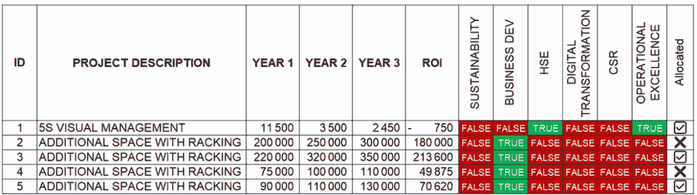

项目是否被选中 – (图片由 Samir Saci 提供)

此外，总监还期望对构建这个最佳“投资组合”所做出的选择有一个简洁的解释。


我们可以使用 LangGraph 和 n8n 构建一个自动化的工作流程，用于执行这些任务。

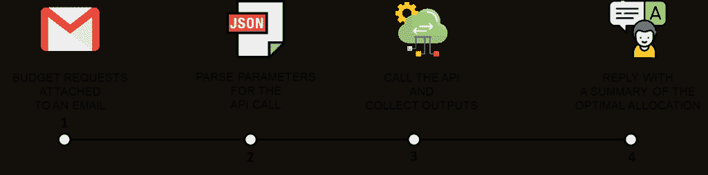

工作流程的目标 – (图片由 Samir Saci 提供)

这将是一个包含 4 个步骤的工作流程：

+   **步骤 1**：使用 n8n Gmail 节点，我们将电子邮件正文和附加到 FastAPI 后端的电子表格发送

+   **步骤 2**：一个 AI 代理解析器将收集电子邮件中的参数并调用其他 API 进行预算规划

+   **步骤 3**：输出将被发送到一个 AI 代理摘要器，该摘要器将使用这些输出生成摘要

+   **步骤 4**：用户通过 n8n 中的 Gmail 节点通过电子邮件收到总结回复

核心的**LangGraph 代理工作流程**将在一个**FastAPI 微服务**内实现，该服务将被包装在 n8n 工作流程中进行编排。

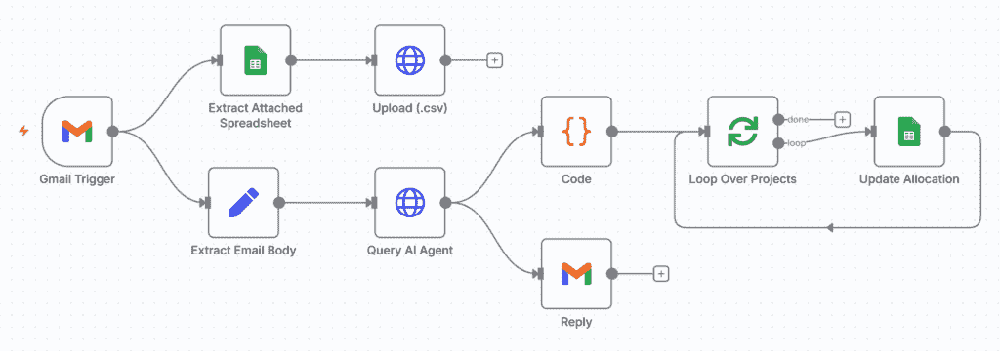

n8n 编排工作流程 – (图片由 Samir Saci 提供)

顶部的第一个两个节点将提取电子表格的内容并将其上传到 API。

然后，我们在`Extract Email Body`节点中提取电子邮件内容，并将其发送到代理端点，使用`Query AI Agent`节点。

API 的输出包括：

+   使用`Reply`节点通过电子邮件发送的关于最佳预算分配的详细说明

+   一个 JSON，其中包含由`Update Allocation`节点使用的按项目分配的分配，用于在电子表格中添加✅和❌

最终，我们的总监收到了关于最佳投资组合的综合分析，该分析包括三个不同的部分。

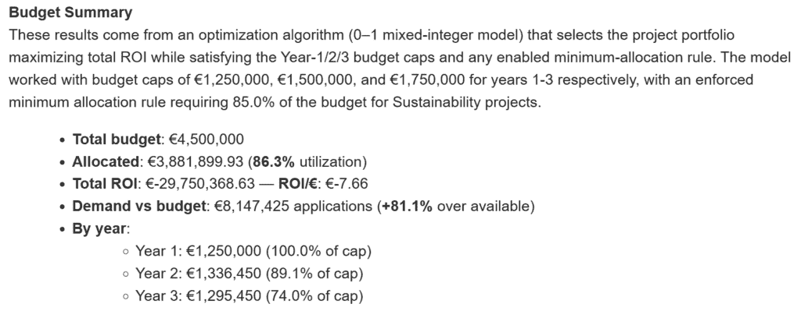

预算摘要 – (图片由 Samir Saci 提供)

**预算摘要**提供了分配的预算和投资回报的详细信息。

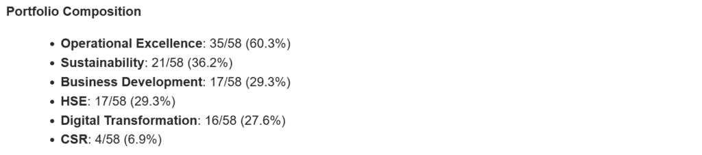

投资组合构成 – (图片由 Samir Saci 提供)

**投资组合构成**详细说明了每个管理目标获得的项目数量。

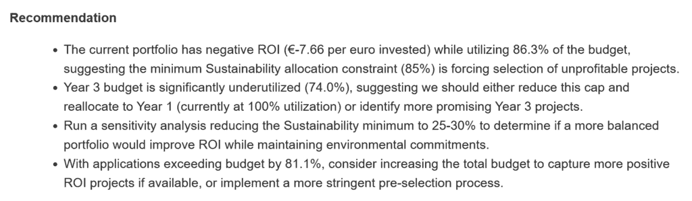

推荐 – (图片由 Samir Saci 提供)

最后，代理根据其对目标的了解得出**推荐**。

让我们看看我们是如何构建核心的**LangGraph 预算代理**，它解析电子邮件以返回完整分析。

### 基于 LangGraph 的预算规划 AI 代理

*本节中共享的代码已被大大简化以节省篇幅。*

在创建图之前，让我们构建不同的块：

+   `EmailParser`用于解析从 n8n HTTP 节点接收到的电子邮件正文以**提取预算 API 的参数**

+   `BudgetPlanInterpreter`将调用 API，检索结果并生成摘要

供您参考，我已使用这种方法与独立块一起使用，因为我们将在其他结合多个代理的工作流程中重用它们。

### 块 1：AI 代理解析器

让我们构建这个代理的块，我们将称之为**AI 代理解析器**：

```py
import logging
from langchain.chat_models import init_chat_model
from app.utils.config_loader import load_config
from app.models.budagent_models import LaunchParamsBudget

logger = logging.getLogger(__name__)
config = load_config()

class EmailParser:
    def __init__(self, model_name: str | None = None):
        model_name = config.get("budget_agent", {}).get(
                "model_name", "anthropic:claude-3-7-sonnet-latest"
            )
        self.llm = init_chat_model(model_name)
        self.params: dict | None = None
        self.raw_email: str | None = None

    def parse(self, content: str | None = None) -> dict:
        """
        Parse email content to extract parameters for API
        """
        content = content.strip()
        system_prompt = config.get("budget_agent", {}).get(
            "system_prompt_parser", {}
        )
        structured_llm = self.llm.with_structured_output(LaunchParamsBudget)
        result = structured_llm.invoke(
            [
                {"role": "system", "content": system_prompt},
                {"role": "user", "content": content},
            ]
        )
        payload = result.model_dump()
        self.params = payload
        logger.info(f"[BudgetAgent] Parsed params: {self.params}")
        return self.params
```

我们包括了将被用于图状态变量的参数。

这个`EmailParser`块将纯文本电子邮件正文转换为使用 LLM 的**类型化、模式有效的参数**，用于我们的预算规划 API。

1.  在初始化时，我们加载聊天模型并构建 LangChain 聊天模型。

1.  `parse()`函数接收 n8n HTTP 节点发送的原始电子邮件`内容`和**系统提示**，使用`LaunchParamsBudget` Pydantic 模式定义的**结构化输出**调用模型。

存储在 YAML 配置文件中的`EmailParser`系统提示（最小版本以节省篇幅）：

```py
budget_agent:
  system_prompt_parser:  |
    You are a budget planning analyst for LogiGreen.

    Your task is to extract structured input parameters from emails 
    requesting budget optimization runs.

    Fields to return (match exactly the schema):
    - budget_year1: integer (annual cap for Year 1)
    - budget_year2: integer (annual cap for Year 2)
    - budget_year3: integer (annual cap for Year 3)
    - set_min_budget: boolean (true/false)
    - min_budget_objective: string (e.g., "Sustainability")
    - min_budget_perc: number (percentage between 0 and 100)

    Output ONLY these fields; no extra keys.
```

它包括要解析的字段列表，以及简洁的解释和严格的格式规则。

输出看起来像这样：

```py
{
'objective': 'Return On Investment', 
'budget_year1': 1250000, 
'budget_year2': 1500000, 
'budget_year3': 1750000, 
'set_min_budget': True, 
'min_budget_objective': 'Sustainability', 
'min_budget_perc': 20.0
}
```

这将被发送到第二个代理的调用工具（我们的另一个 FastAPI 微服务）和结果解释。

### 块 2：工具调用和解释的块

将使用两个块来调用**预算规划 API**并处理 API 的输出。

由于我将使用这个**预算规划 API**为多个代理，我创建了一个独立的函数来调用它。

```py
import os, logging, httpx
import logging
from app.models.budagent_models import LaunchParamsBudget
from app.utils.config_loader import load_config
logger = logging.getLogger(__name__)

API = os.getenv("API_URL")
LAUNCH = f"{API}/budget/launch_budget"

async def run_budget_api(params: LaunchParamsBudget, 
                         session_id: str = "test_agent") -> dict:
    payload = {
        "objective": params.objective,
        "budget_year1": params.budget_year1,
        "budget_year2": params.budget_year2,
        "budget_year3": params.budget_year3,
        "set_min_budget": params.set_min_budget,
        "min_budget_objective": params.min_budget_objective,
        "min_budget_perc": params.min_budget_perc,
    }
    try:
        async with httpx.AsyncClient(timeout=httpx.Timeout(5, read=30)) as c:
            r = await c.post(LAUNCH, 
                             json=payload, 
                             headers={"session_id": session_id})
            r.raise_for_status()
            return r.json()
    except httpx.HTTPError as e:
        logger.error("[BudgetAgent]: API call failed: %s", e)
        code = getattr(e.response, "status_code", "")
        return {"error": f"{code} {e}"}
```

我们现在可以在下面定义的`BudgetPlanInterpreter`块中调用此函数。

```py
import logging
import requests
from langchain.chat_models import init_chat_model
from app.utils.functions.budagent_runner import run_budget_api
from app.models.budagent_models import LaunchParamsBudget
from app.utils.config_loader import load_config

logger = logging.getLogger(__name__)
config = load_config()

class BudgetPlanInterpreter:
    def __init__(self, 
                model_name: str = "anthropic:claude-3-7-sonnet-latest", 
                session_id: str = "test_agent"):
        self.llm = init_chat_model(model_name)
        self.session_id = session_id
        self.api_result: dict | None = None 
        self.html_summary: str | None = None

    async def run_plan(self, params: dict) -> dict:
        """Run budget planning using FastAPI Microservice API"""
        try:
            launch_params = LaunchParamsBudget(**params) 
            self.api_result = await run_budget_api(launch_params, self.session_id)
            return self.api_result
        except Exception as e:
            logger.error(f"[BudgetAgent] Direct API call failed: {e}")
            return {"error": str(e)}

    async def interpret(self, params: dict, api_output: dict | None = None) -> str:
        """Interpret API budget planning results into HTML summary for the Director"""
        if api_output is None:
            if not self.api_result:
                raise ValueError("No API result available.")
            api_output = self.api_result

        messages = [
            {
                "role": "system",
                "content": config["budget_agent"]["system_prompt_tool"]
            },
            {
                "role": "user",
                "content": f"Input parameters: {params}\n
                             \nModel results: {api_output}"
            }
        ]

        reply = self.llm.invoke(messages)
        self.html_summary = reply.content

        logger.info("[BudgetPlanAgent] Generated HTML summary")
        return self.html_summary

    def get_summary(self) -> str:
        if not self.html_summary:
            raise ValueError("No summary available.")
        return self.html_summary
```

它运行预算优化器，并将其 JSON 转换为 HTML 格式的**“执行摘要”**。

+   我们使用`run_plan()`调用 FastAPI 微服务，利用`run_budget_api(s)`函数检索结果

+   `interpret()`函数根据系统提示的指令，根据 API 的输出生成分析。

我们现在有三个基础块，可以用来构建带有节点和条件边的图。

### 带有节点和条件边的 LangGraph 构建器

现在我们有了三个块，我们可以构建我们的图。

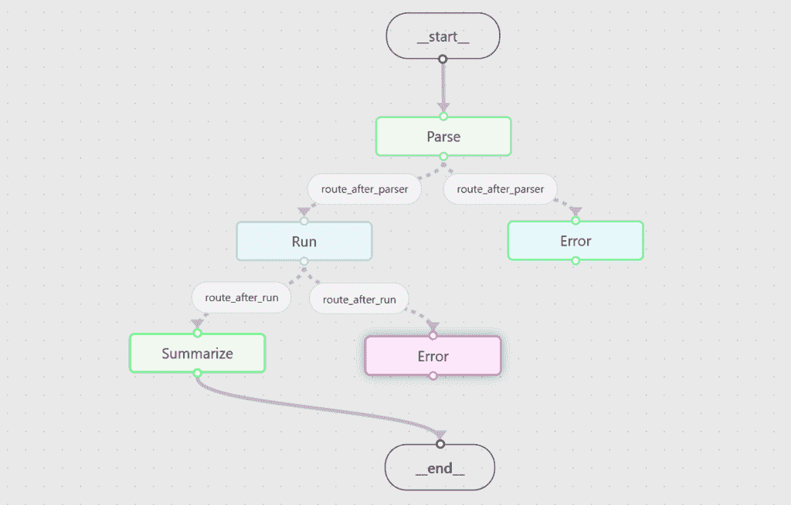

LangGraph – (图片由 Samir Saci 提供)

这是一个包含三个步骤（解析、运行、解释）以及每一步错误处理的实验性**LangGraph 状态机**。

```py
from typing import TypedDict
from langgraph.graph import StateGraph, START, END
import logging

from app.utils.functions.budagent_parser import EmailParser
from app.utils.functions.budagent_functions import BudgetPlanInterpreter
from app.utils.config_loader import load_config

logger = logging.getLogger(__name__)
config = load_config()

class AgentState(TypedDict, total=False):
    email_text: str
    params: dict
    budget_results: dict
    html_summary: str
    error: str
    session_id: str
```

这个块是基本的，因为它定义了在 LangGraph 节点之间传递的**共享状态**

+   `session_id`: 包含在 API 调用中

+   `email_text`: 从 n8n 节点接收到的原始电子邮件正文

+   `params`: 由 EmailParser 从电子邮件中解析出的结构化输入

+   `budget_results`: FastAPI 微服务的 JSON 输出

+   `html_summary`: 基于`budget_results`输出的`interpret()`生成的分析（HTML 格式）

+   `error`: 如有必要，存储错误消息

我们现在应该定义每个节点将接收当前 AgentState 并返回部分更新的函数。

```py
async def handle_error(state: AgentState) -> AgentState:
    err = state.get("error", "Unknown error")
    logger.error(f"[BudgetGraph] handle_error: {err}")
    html = (
        "<b>Budget Summary</b><br>"
        "<ul><li>There was an error while processing your request.</li></ul>"
        f"<b>Details</b><br>{err}"
    )
    return {"html_summary": html}
```

**函数**：handle_error(state)

+   返回 HTML 格式的错误消息，该消息将被发送到 n8n 中的 Gmail 节点以通知用户

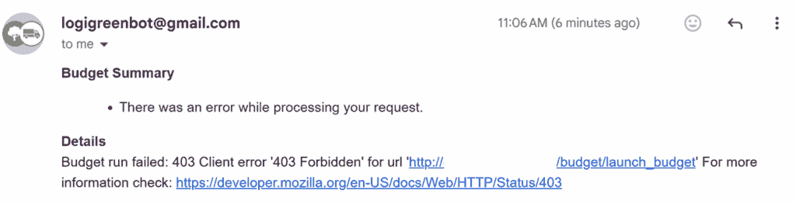

错误消息示例 – (图片由 Samir Saci 提供)

在这种情况下，对于支持团队来说，这更实用，因为用户只需转发电子邮件。

*注意：在生产版本中，我们添加了一个`run_id`以帮助跟踪日志中的问题。*

```py
async def parse_email(state: AgentState) -> AgentState:
    try:
        parser = EmailParser(model_name=config["budget_agent"]["model_name"])
        params = parser.parse(state["email_text"])

        if not params or ("error" in params and params["error"]):
            return {"error": f"Parse failed: {params.get('error', 'unknown')}"}

        return {"params": params}
    except Exception as e:
        logger.exception("[BudgetGraph] parse_email crashed")
        return {"error": f"Parse exception: {e}"} 
```

**函数** 2：parse_email(state)

+   使用`EmailParser`将接收到的电子邮件正文转换为 JSON 格式的预算规划参数

+   **成功时**：返回用于调用 FastAPI 微服务的`{"params": …}`

```py
async def run_budget(state: AgentState) -> AgentState:
    if "error" in state:
        return {}
    try:
        interpreter = BudgetPlanInterpreter(
            model_name=config["budget_agent"]["model_name"],
            session_id=state.get("session_id", 
                                 config["budget_agent"]["session_id"]))
        results = await interpreter.run_plan(state["params"])

        if "error" in results:
            return {"error": f"Budget run failed: {results['error']}"}

        return {"budget_results": results, "interpreter": interpreter}
    except Exception as e:
        logger.exception("[BudgetGraph] run_budget crashed")
        return {"error": f"Budget exception: {e}"}
```

**函数** 3：run_budget(state)

+   使用`BudgetPlanInterpreter`调用将执行预算优化的`run_plan`函数，通过 FastAPI 微服务

+   **成功时**：以 JSON 格式返回优化器的输出作为`budget_results`

这个输出可以用来生成预算分配的摘要。

```py
async def summarize(state: AgentState) -> AgentState:
    if "error" in state:
        return {}
    try:
        interpreter = state.get("interpreter") or BudgetPlanInterpreter(
            model_name=config["budget_agent"]["model_name"],
            session_id=state.get("session_id", config["budget_agent"]["session_id"]),
        )
        html = await interpreter.interpret(state["params"], state["budget_results"])
        return {"html_summary": html}
    except Exception as e:
        logger.exception("[BudgetGraph] summarize crashed")
        return {"error": f"Summarization exception: {e}"}
```

**函数** 4：summarize(state)

+   重新使用状态中的解释器（或创建一个），然后调用`interpret()`

+   **成功时：** 返回一个简洁且专业的预算分配摘要，以 HTML 格式呈现，准备好通过电子邮件发送 `{"html_summary": …}`

这个输出 `html_summary` 然后被 API 返回到 n8n 上的 Gmail 节点以回复发件人。

现在我们有了所有功能，我们可以创建节点，并使用下面定义的 `build_budagent_graph()` 函数“连接”图：

```py
def route_after_parse(state: AgentState) -> str:
    return "error" if "error" in state else "run"

def route_after_run(state: AgentState) -> str:
    return "error" if "error" in state else "summarize"

def build_budagent_graph():
    graph_builder = StateGraph(AgentState)

    graph_builder.add_node("parse", parse_email)
    graph_builder.add_node("run", run_budget)
    graph_builder.add_node("summarize", summarize)
    graph_builder.add_node("error", handle_error)

    graph_builder.add_edge(START, "parse")
    graph_builder.add_conditional_edges("parse", route_after_parse, {
        "run": "run",
        "error": "error",
    })
    graph_builder.add_conditional_edges("run", route_after_run, {
        "summarize": "summarize",
        "error": "error",
    })
    graph_builder.add_edge("summarize", END)
    graph_builder.add_edge("error", END)

    return graph_builder.compile()
```

这四个节点通过路由器连接：

+   `route_after_parse` 将根据邮件解析的输出来指导流程：如果状态中有 `error` 则转到 `"error"`；否则转到 `"run"`。

+   `route_after_run` 将根据调用 FastAPI 微服务的输出来指导流程：如果状态中有 `error` 则转到 `"error"`；否则转到 `"summarize"`。

我们几乎完成了！

我们只需要将这个工具打包成 FastAPI 端点：

```py
@router.post("/graph_parse_and_run")
async def graph_parse_and_run(request: EmailRequest):
    """
    Parse an email body, run Budget Planning, and return an HTML summary — orchestrated via a LangGraph StateGraph.
    """
    try:
        initial_state = {
            "email_text": request.email_text,
            "session_id": config.get("budget_agent", {}).get("session_id", "test_agent"),
        }
        final_state = await _graph.ainvoke(initial_state)

        return {
            "params": final_state.get("params"),
            "budget_results": final_state.get("budget_results"),
            "html_summary": final_state.get("html_summary"),
            "error": final_state.get("error"),
        }
    except Exception as e:
        logger.exception("[BudAgent] Graph run failed")
        raise HTTPException(status_code=500, detail=f"Graph run failed: {e}")
```

它将由我们的 n8n 工作流程中的 `Query Agent API` 节点查询，以返回输入参数在 `params` 中，预算优化结果在 `budget_results` 中，以及代理解释器生成的摘要在 `html_summary` 中。

### 一个完全功能的预算规划 AI 工作流程

我们现在可以在 n8n 上激活工作流程，并使用不同的场景测试这个工具。

> 如果我们没有任何管理目标的最小预算怎么办？

我将尝试调整邮件以使 `set_min_budget` 设置为 `False`。

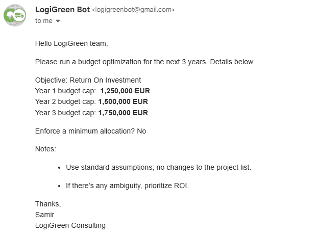

邮件示例 – （图片由 Saci 提供）

邮件已经很好地解析，现在 `set_min_budget` 的值设置为 `False`。

```py
Parsed params: {
'objective': 'Return On Investment', 
'budget_year1': 1250000, 
'budget_year2': 1500000, 
'budget_year3': 1750000, 
'set_min_budget': False, 
'min_budget_objective': 'Sustainability', 
'min_budget_perc': 20.0
}
```

我们可以在摘要中看到结果：

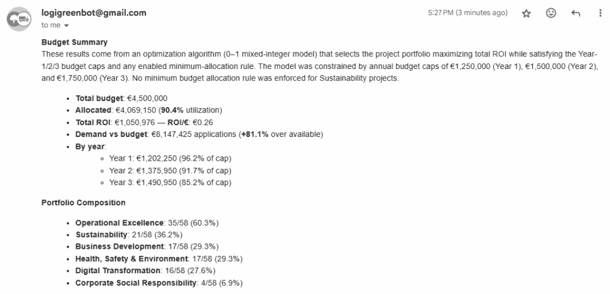

新的摘要，带有更新的约束条件 – （图片由 Samir Saci 提供）

如我们所预期，性能更好：

+   总投资回报率：€1,050,976（与 €1,024,051 相比）

+   **ROI/€**: €0.26（与 €0.24 相比）

## 结论

这个工作流程已经向 APAC 团队展示，他们开始“玩弄”它。

我们了解到他们使用它来准备董事会会议的不同投资组合分配场景的幻灯片。

这仍然是一个“战略工具”，每年只使用几次。

然而，我们计划重用相同的架构为更多“战术”工具提供支持，供应链部门可以使用这些工具进行 [ABC 分析](https://youtu.be/Fp4AHYE14Mg?si=kYGkmdsvCANRd61B)，[库存管理](https://youtu.be/U1HqjHZzgq4?si=mvYJYbU6iOlgzKyb)，或 [供应链优化](https://youtu.be/gF9ds3CH3N4?si=jpVVagZGc35uu4xz)，以及人力资源部门用于 [劳动力规划](https://youtu.be/OdLeRR4rvt0?si=riqvvyH7ufhoPVFo) 或商业控制团队。

### 我们能否超越这个简单的流程？

我对工作流程中 Agentic 部分的贡献仍然不满意。

事实上，有一个可以通过电子邮件触发并提供简洁摘要的工具是件好事。

然而，我想探索拥有多个代理提出不同场景的想法，这些场景将相互竞争。

> 如果我们将可持续性的最低预算增加 15%，对投资回报率会有什么影响？

例如，我们可以要求代理运行多个场景并提供比较研究。

我们仍在尝试各种类型的编排，以确定最有效的方法。

这将是以下文章的主题。

#### 其他代理工作流程的例子？

这不是我第一次尝试将一个优化工具（打包在 FastAPI 微服务中）与代理工作流程链接起来。

我最初的尝试是创建一个**生产计划优化代理**。

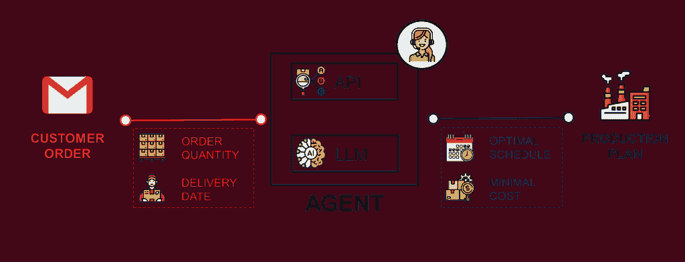

生产计划代理 – (图片由 Samir Saci 提供)

就像这里，我将一个优化算法打包在一个 FastAPI 微服务中，我希望将其连接到一个电子邮件工作流程。

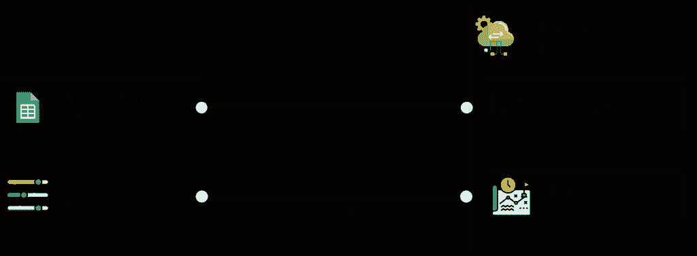

生产计划 FastAPI 微服务 – (图片由 Samir Saci 提供)

与这里不同，工作流程的代理部分由 n8n 中的两个代理节点处理。

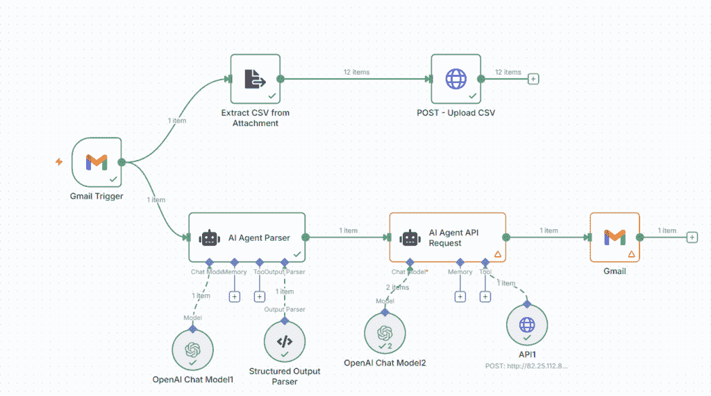

工作流程 – (图片由 Samir Saci 提供)

结果相当令人满意，如以下链接的短视频所示。

用户界面非常流畅。

然而，维护对团队来说是一项挑战。

正因如此，我们想探索使用 Python 和 TypeScript 框架来构建代理工作流程，就像这里一样。

### 接下来是什么？商业计划的代理方法

在我们的初创公司[LogiGreen](https://www.logi-green.com/logigreen-applications-for-supply-chain-optimization)中，我们试图（通过此类实验）超越供应链优化，并涵盖商业决策。

在我的路线图中，我有一个开发出来的工具，可以帮助小型和中型公司优化他们的现金流。


我朋友商业模式的产业链 – (图片由 Samir Saci 提供)

在发表在 Towards Data Science 的[另一篇文章](https://towardsdatascience.com/business-planning-with-python-inventory-and-cash-flow-management-4f9beb7ecbec/)中，我介绍了我是如何使用 Python 来模拟一家向咖啡店销售可回收纸杯公司的财务流。

> “我们必须拒绝订单，因为我们没有足够的现金来支付供应商的库存补充。”

一个经营小生意的亲密朋友，抱怨现金流问题限制了公司的发展。

我首先使用 Python 的一个优化内置解决方案来解决库存管理问题。

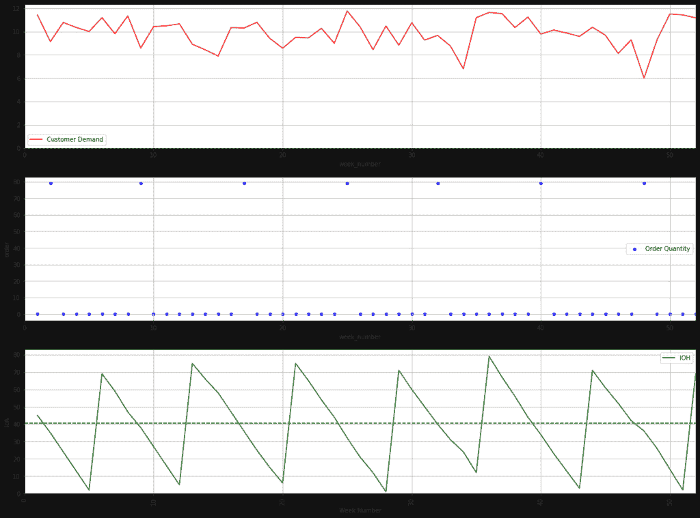

库存管理规则 – (图片由 Samir Saci 提供)

然后，我考虑了销售渠道策略、付款条款和其他许多战略商业参数来丰富模型，帮助他找到最大化利润的最佳商业计划。

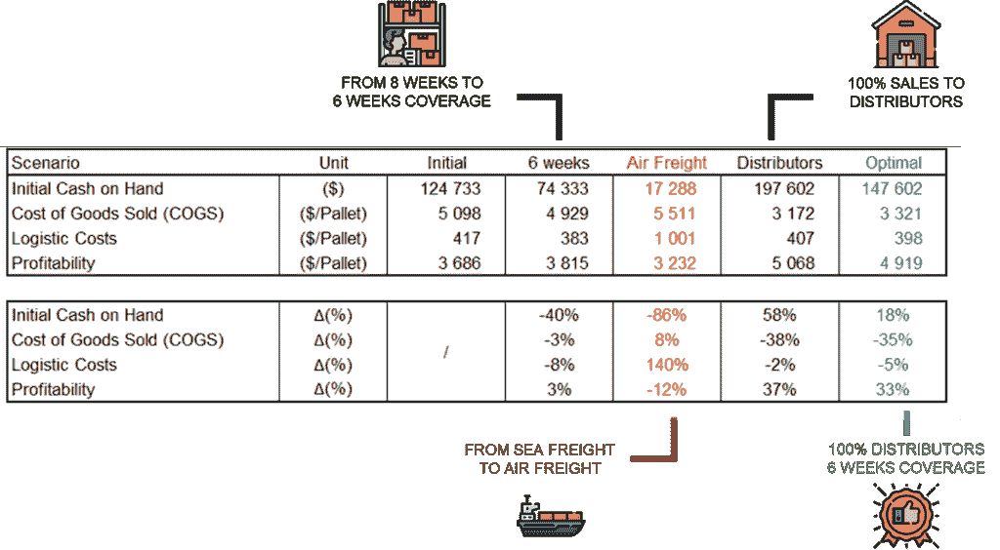

生成场景的示例 – (图片由 Samir Saci 提供)

这个解决方案可能是我们在使用代理工作流程支持业务和运营决策方面的实验中的下一个候选者。

如需更多信息，您可以查看这个工具的简短演示

目前，它被包装在一个与 React 前端（以及 streamlit 用于公共演示）连接的 FastAPI 微服务中。


工具的 UI 可在[LogiGreen Apps](https://www.logi-green.com/logigreen-applications-for-supply-chain-optimization)中找到 – （图片由 Samir Saci 提供）

我希望实现一个 AI 工作流程，它会

1.  考虑多个场景（如视频中所展示的）

1.  为每个场景调用 API

1.  收集并处理结果

1.  提供比较分析以推荐最佳决策

基本上，我希望将文章和视频中展示的完整研究外包给单个（或多个）代理。

为了这个目的，我们正在探索多种代理编排方法。

我们将在未来的文章中分享我们的发现。请保持关注！

## 关于我

让我们在[LinkedIn](https://www.linkedin.com/in/samir-saci/)和[Twitter](https://twitter.com/Samir_Saci_)上建立联系。我是一名供应链工程师，使用数据分析来改善物流运营并降低成本。

如需咨询或建议有关分析和可持续供应链转型，请通过[Logigreen Consulting](https://www.logi-green.com/)联系我。

如果你对数据分析供应链感兴趣，请查看我的网站。

[**Samir Saci | 数据科学 & 效率**](https://samirsaci.com/)
