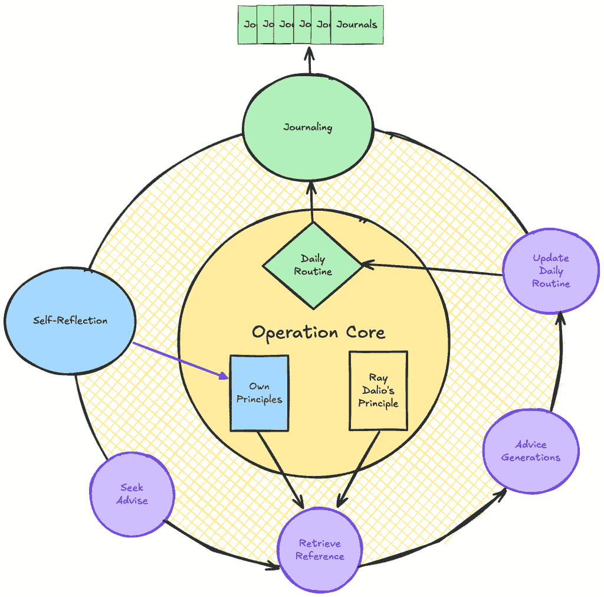
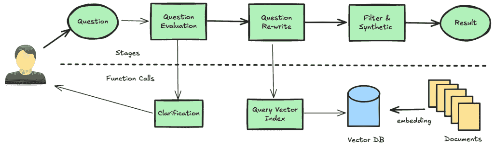
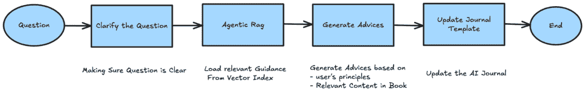

# 如何使用 LlamaIndex 构建 AI 期刊

> 原文：[`towardsdatascience.com/how-to-build-an-ai-journal-to-build-your-own-principles/`](https://towardsdatascience.com/how-to-build-an-ai-journal-to-build-your-own-principles/)

<mdspan datatext="el1747426306756" class="mdspan-comment">这篇帖子</mdspan>将分享如何使用 [LlamaIndex](https://www.llamaindex.ai/) 构建一个 AI 期刊。我们将涵盖这个 AI 期刊的一个基本功能：寻求建议。我们将从最基本实现开始，并在此基础上迭代。当我们应用像 Agentic RAG 和多智能体工作流程这样的设计模式时，我们可以看到这个功能有显著的改进。

您可以在我的 GitHub 仓库 [这里](https://github.com/PepperStudio77/principle-master) 找到这份 AI 期刊的源代码。关于[我是谁](https://www.linkedin.com/in/ming-gao-57509a101/)。

## AI 期刊概述

我想通过遵循 Ray Dalio 的实践来建立我的原则。一个 AI 期刊将帮助我进行自我反思，跟踪我的进步，甚至给我提供建议。这样一个 AI 期刊的整体功能看起来是这样的：



AI 期刊概览。图片由作者提供。

今天，我们将只涵盖寻求建议流程的实现，这在上述图中由多个紫色循环表示。

## 最简单形式：具有大上下文的 LLM

在最直接的实施方式中，我们可以将所有相关内容传递到上下文中，并附加我们想要提出的问题。我们可以在 LlamaIndex 中用几行代码做到这一点。

```py
import pymupdf
from llama_index.llms.openai import OpenAI

path_to_pdf_book = './path/to/pdf/book.pdf'
def load_book_content():
    text = ""
    with pymupdf.open(path_to_pdf_book) as pdf:
        for page in pdf:
            text += str(page.get_text().encode("utf8", errors='ignore'))
    return text

system_prompt_template = """You are an AI assistant that provides thoughtful, practical, and *deeply personalized* suggestions by combining:
- The user's personal profile and principles
- Insights retrieved from *Principles* by Ray Dalio
Book Content: 
```

{书籍内容}

```py
User profile:
```

{用户资料}

```py
User's question:
```

{用户问题}

```py
"""

def get_system_prompt(book_content: str, user_profile: str, user_question: str):
    system_prompt = system_prompt_template.format(
        book_content=book_content,
        user_profile=user_profile,
        user_question=user_question
    )
    return system_prompt

def chat():
    llm = get_openai_llm()
    user_profile = input(">>Tell me about yourself: ")
    user_question = input(">>What do you want to ask: ")
    user_profile = user_profile.strip()
    book_content = load_book_summary()
    response = llm.complete(prompt=get_system_prompt(book_content, user_profile, user_question))
    return response
```

这种方法存在一些缺点：

+   低精度：加载所有书籍上下文可能会使 LLM 丢失对用户问题的关注。

+   高成本：在每次 LLM 调用中发送大量内容意味着成本高昂且性能不佳。

使用这种方法，如果你传递 Ray Dalio 的《原则》一书的全部内容，对“如何处理压力？”这样的问题的回答就会非常笼统。这样的回答没有与我提出的问题相关联，让我感觉 AI 没有在听我说话。即使它涵盖了像“接受现实”、“获得你想要的东西的 5 步过程”和“极端开放心态”等重要概念。我喜欢我得到的建议更加针对我提出的问题。让我们看看我们如何通过 RAG 来改进它。

## 增强形式：Agentic RAG

那么，什么是 Agentic RAG？Agentic RAG 是将动态决策和数据检索相结合。在我们的 AI 期刊中，Agentic RAG 流程看起来是这样的：



Agentic Rag 阶段。图片由作者提供

+   问题评估：表述不佳的问题会导致查询结果不佳。智能体将评估用户的查询，并在智能体认为必要时澄清问题。

+   问题重写：将用户查询重写为在语义空间中将内容投影到索引内容。我发现这些步骤对于提高检索精度至关重要。比如说，如果你的知识库是 Q/A 对，而你正在索引问题部分以搜索答案。将用户的查询语句重写为一个合适的问题将帮助你找到最相关的内容。

+   查询向量索引：在构建此类索引时，可以调整许多参数，包括块大小、重叠或不同的索引类型。为了简单起见，我们在这里使用 VectorStoreIndex，它有一个默认的块化策略。

+   过滤与合成：而不是复杂的重新排序过程，我明确指示 LLM 在提示中过滤和找到相关内容。我发现 LLM 甚至有时比其他内容具有更低的相似度得分，但它仍然能够挑选出最相关的内容。

使用这种 Agentic RAG，你可以检索与用户问题高度相关的内容，生成更有针对性的建议。

让我们检查一下实现。使用 LlamaIndex SDK，在本地目录中创建和持久化索引非常简单。

```py
from llama_index.core import Document, VectorStoreIndex, StorageContext, load_index_from_storage

Settings.embed_model = OpenAIEmbedding(api_key="ak-xxxx")
PERSISTED_INDEX_PATH = "/path/to/the/directory/persist/index/locally"

def create_index(content: str):
    documents = [Document(text=content)]
    vector_index = VectorStoreIndex.from_documents(documents)
    vector_index.storage_context.persist(persist_dir=PERSISTED_INDEX_PATH)

def load_index():
    storage_context = StorageContext.from_defaults(persist_dir=PERSISTED_INDEX_PATH)
    index = load_index_from_storage(storage_context)
    return index
```

一旦我们有了索引，我们就可以在其之上创建一个查询引擎。查询引擎是一个强大的抽象，它允许你在查询期间调整参数（例如，TOP K）以及在内容检索后的合成行为。在我的实现中，我覆盖了 response_mode `NO_TEXT`，因为代理将处理函数调用返回的书籍内容并合成最终结果。在将结果传递给代理之前，让查询引擎合成结果将是多余的。

```py
from llama_index.core.indices.vector_store import VectorIndexRetriever
from llama_index.core.query_engine import RetrieverQueryEngine
from llama_index.core.response_synthesizers import ResponseMode
from llama_index.core import  VectorStoreIndex, get_response_synthesizer

def _create_query_engine_from_index(index: VectorStoreIndex):
    # configure retriever
    retriever = VectorIndexRetriever(
        index=index,
        similarity_top_k=TOP_K,
    )
    # return the original content without using LLM to synthesizer. For later evaluation.
    response_synthesizer = get_response_synthesizer(response_mode=ResponseMode.NO_TEXT)
    # assemble query engine
    query_engine = RetrieverQueryEngine(
        retriever=retriever,
        response_synthesizer=response_synthesizer
    )
    return query_engine
```

提示如下：

```py
You are an assistant that helps reframe user questions into clear, concept-driven statements that match 
the style and topics of Principles by Ray Dalio, and perform look up principle book for relevant content. 

Background:
Principles teaches structured thinking about life and work decisions.
The key ideas are:
* Radical truth and radical transparency
* Decision-making frameworks
* Embracing mistakes as learning

Task:
- Task 1: Clarify the user's question if needed. Ask follow-up questions to ensure you understand the user's intent.
- Task 2: Rewrite a user’s question into a statement that would match how Ray Dalio frames ideas in Principles. Use formal, logical, neutral tone.
- Task 3: Look up principle book with given re-wrote statements. You should provide at least {REWRITE_FACTOR} rewrote versions.
- Task 4: Find the most relevant from the book content as your fina answers.
```

最后，我们可以使用定义好的这些函数来构建代理。

```py
def get_principle_rag_agent():
    index = load_persisted_index()
    query_engine = _create_query_engine_from_index(index)

    def look_up_principle_book(original_question: str, rewrote_statement: List[str]) -> List[str]:
        result = []
        for q in rewrote_statement:
            response = query_engine.query(q)
            content = [n.get_content() for n in response.source_nodes]
            result.extend(content)
        return result

    def clarify_question(original_question: str, your_questions_to_user: List[str]) -> str:
        """
        Clarify the user's question if needed. Ask follow-up questions to ensure you understand the user's intent.
        """
        response = ""
        for q in your_questions_to_user:
            print(f"Question: {q}")
            r = input("Response:")
            response += f"Question: {q}\nResponse: {r}\n"
        return response

    tools = [
        FunctionTool.from_defaults(
            fn=look_up_principle_book,
            name="look_up_principle_book",
            description="Look up principle book with re-wrote queries. Getting the suggestions from the Principle book by Ray Dalio"),
        FunctionTool.from_defaults(
            fn=clarify_question,
            name="clarify_question",
            description="Clarify the user's question if needed. Ask follow-up questions to ensure you understand the user's intent.",
        )
    ]

    agent = FunctionAgent(
        name="principle_reference_loader",
        description="You are a helpful agent will based on user's question and look up the most relevant content in principle book.\n",
        system_prompt=QUESTION_REWRITE_PROMPT,
        tools=tools,
    )
    return agent

rag_agent = get_principle_rag_agent()
response = await agent.run(chat_history=chat_history)
```

在实现过程中，我有以下几点观察：

+   我发现的一个有趣的事实是，在函数签名中提供一个未使用的参数`original_question`很有帮助。我发现，当我没有这样的参数时，LLM 有时不会遵循重写指令，并将原始问题传递给`rewrote_statement`参数。有`original_question`参数似乎以某种方式强调了重写任务对 LLM 的重要性。

+   在相同的提示下，不同的 LLM 表现差异很大。我发现 DeepSeek V3 比其他模型提供商更不愿意触发函数调用。这并不一定意味着它不可用。如果一个功能调用应该有 90%的时间被启动，它应该成为工作流程的一部分，而不是注册为一个函数调用。此外，与 OpenAI 的模型相比，我发现 Gemini 在合成结果时很好地引用了书籍的来源。

+   你加载到上下文窗口中的内容越多，模型需要的推理能力就越大。一个推理能力较小的模型更有可能在提供的大上下文中迷失方向。

然而，要完成寻求建议的功能，你需要多个代理协同工作，而不是单个代理。让我们来谈谈如何将你的代理链式连接成工作流程。

## 最终形式：代理工作流程

在我们开始之前，我推荐 Anthropic 的这篇文章，[构建有效的代理](https://www.anthropic.com/engineering/building-effective-agents)。文章的一句总结是，*在可能的情况下，你应该始终优先构建工作流程而不是动态代理*。在 LlamaIndex 中，你可以两者兼得。它允许你创建一个具有更多自动路由的代理工作流程，或者一个具有更多显式控制步骤转换的自定义工作流程。我将提供两种实现的示例。



工作流程解释。图片由作者提供。

让我们看看你如何构建一个动态工作流程。下面是一个代码示例。

```py
interviewer = FunctionAgent(
        name="interviewer",
        description="Useful agent to clarify user's questions",
        system_prompt=_intervierw_prompt,
        can_handoff_to = ["retriver"]
        tools=tools
)
interviewer = FunctionAgent(
        name="retriever",
        description="Useful agent to retrive principle book's content.",
        system_prompt=_retriver_prompt,
        can_handoff_to = ["advisor"]
        tools=tools
)
advisor = FunctionAgent(
        name="advisor",
        description="Useful agent to advise user.",
        system_prompt=_advisor_prompt,
        can_handoff_to = []
        tools=tools
)
workflow = AgentWorkflow(
        agents=[interviewer, advisor, retriever],
        root_agent="interviewer",
    )
handler = await workflow.run(user_msg="How to handle stress?")
```

它是动态的，因为代理转换基于 LLM 模型的函数调用。在底层，LlamaIndex 工作流程为 LLM 模型提供代理描述作为函数。当 LLM 模型触发这样的“代理函数调用”时，LlamaIndex 将路由到你的下一个相应代理进行后续步骤的处理。你的前一个代理的输出已添加到工作流程内部状态中，你的下一个代理将作为上下文的一部分在其对 LLM 模型的调用中获取状态。你还可以利用`state`和`memory`组件来管理工作流程的内部状态或加载外部数据（参考文档[此处](https://docs.llamaindex.ai/en/stable/module_guides/deploying/agents/memory/#memory-vs-workflow-context)）。

然而，正如我之前建议的，你可以显式地控制工作流程中的步骤以获得更多控制。使用 LlamaIndex，可以通过扩展工作流程对象来实现。例如：

```py
class ReferenceRetrivalEvent(Event):
    question: str

class Advice(Event):
    principles: List[str]
    profile: dict
    question: str
    book_content: str

class AdviceWorkFlow(Workflow):
    def __init__(self, verbose: bool = False, session_id: str = None):
        state = get_workflow_state(session_id)
        self.principles = state.load_principle_from_cases()
        self.profile = state.load_profile()
        self.verbose = verbose
        super().__init__(timeout=None, verbose=verbose)

    @step
    async def interview(self, ctx: Context,
                        ev: StartEvent) -> ReferenceRetrivalEvent:
        # Step 1: Interviewer agent asks questions to the user
        interviewer = get_interviewer_agent()
        question = await _run_agent(interviewer, question=ev.user_msg, verbose=self.verbose)

        return ReferenceRetrivalEvent(question=question)

    @step
    async def retrieve(self, ctx: Context, ev: ReferenceRetrivalEvent) -> Advice:
        # Step 2: RAG agent retrieves relevant content from the book
        rag_agent = get_principle_rag_agent()
        book_content = await _run_agent(rag_agent, question=ev.question, verbose=self.verbose)
        return Advice(principles=self.principles, profile=self.profile,
                      question=ev.question, book_content=book_content)

    @step
    async def advice(self, ctx: Context, ev: Advice) -> StopEvent:
        # Step 3: Adviser agent provides advice based on the user's profile, principles, and book content
        advisor = get_adviser_agent(ev.profile, ev.principles, ev.book_content)
        advise = await _run_agent(advisor, question=ev.question, verbose=self.verbose)
        return StopEvent(result=advise)
```

特定事件类型的返回值控制工作流程步骤的转换。例如，`retrieve`步骤返回一个`Advice`事件，这将触发`advice`步骤的执行。你还可以利用`Advice`事件来传递你需要的信息。

在实施过程中，如果你在调试中间步骤时不得不从头开始工作流程感到烦恼，那么当你想要故障转移工作流程执行时，*上下文对象*是至关重要的。你可以将你的状态以序列化格式存储，并通过反序列化到上下文对象中恢复你的工作流程。你的工作流程将根据状态继续执行，而不是从头开始。

```py
workflow = AgentWorkflow(
    agents=[interviewer, advisor, retriever],
    root_agent="interviewer",
)
try:
    handler = w.run()
    result = await handler
except Exception as e:
    print(f"Error during initial run: {e}")
    await fail_over()
    # Optional, serialised and save the contexct for debugging 
    ctx_dict = ctx.to_dict(serializer=JsonSerializer())
    json_dump_and_save(ctx_dict)
    # Resume from the same context
    ctx_dict = load_failed_dict()
    restored_ctx = Context.from_dict(workflow, ctx_dict,serializer=JsonSerializer())
    handler = w.run(ctx=handler.ctx)
    result = await handler
```

## 摘要

在这篇文章中，我们讨论了如何使用 LlamaIndex 实现 AI 日志的核心功能。关键学习包括：

+   使用代理 RAG 来利用 LLM 的能力，动态重写原始查询和合成结果。

+   使用自定义工作流程以获得对步骤转换的更多显式控制。在必要时构建动态代理。

这本 AI 期刊的源代码在我的 GitHub 仓库[这里](https://github.com/PepperStudio77/principle-master)可以找到。希望您喜欢这篇文章以及我构建的这个小型应用程序。干杯！
