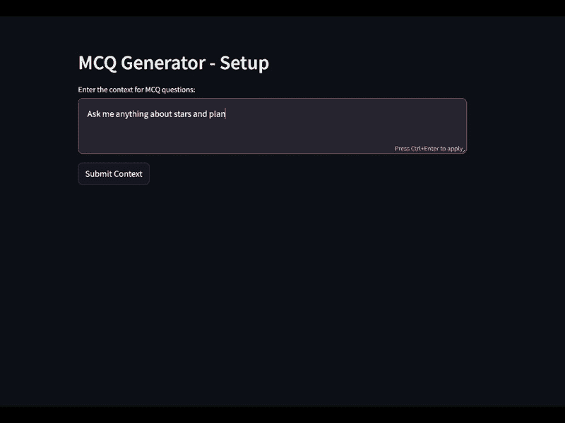
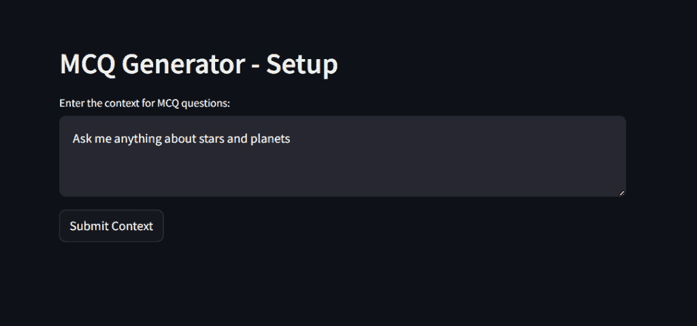
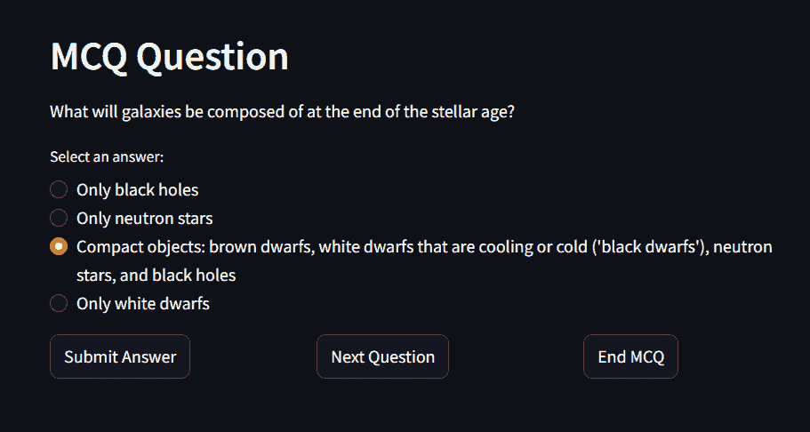
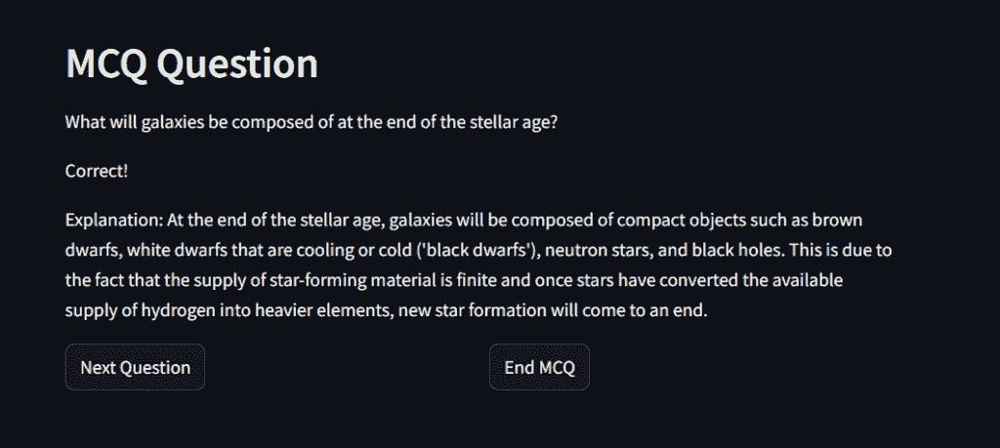
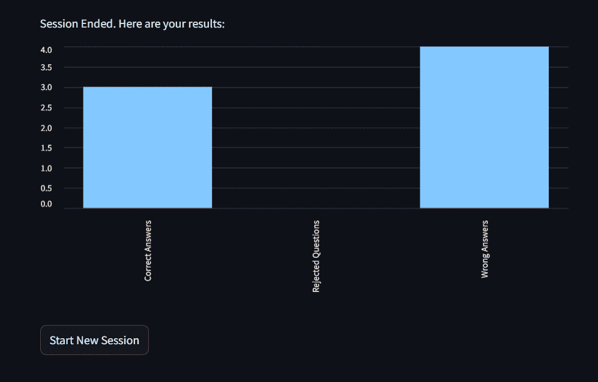
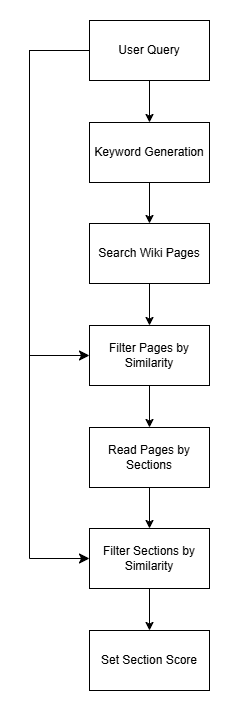
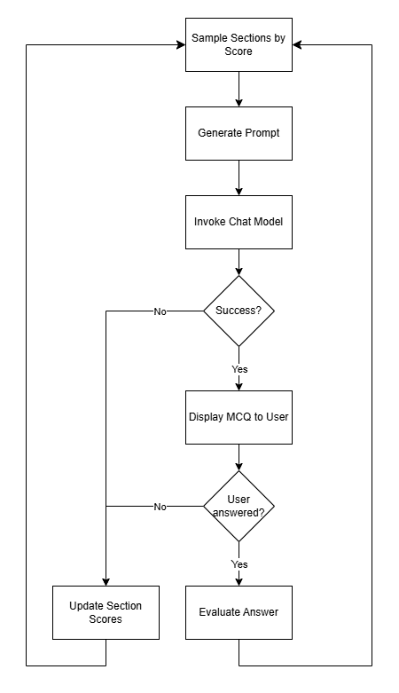

# 如何构建 MCQ 应用

> 原文：[`towardsdatascience.com/how-to-build-an-mcq-app/`](https://towardsdatascience.com/how-to-build-an-mcq-app/)

<mdspan datatext="el1748629420211" class="mdspan-comment">在这篇文章中</mdspan>，我解释了如何构建一个应用，该应用可以针对任何用户定义的主题生成多项选择题（MCQs）。该应用提取与用户请求相关的维基百科文章，并使用 RAG 查询聊天模型来生成问题。

我将演示该应用的工作方式，解释如何检索维基百科文章，并展示如何使用这些文章来调用聊天模型。接下来，我将更详细地解释该应用的关键组件。该应用的代码可在[此处](https://github.com/ReinhardSellmair/learning_app)找到。

## 应用演示



应用演示

上面的 gif 显示了用户进入学习上下文，生成的 MCQ 以及用户提交答案后的反馈。



启动屏幕

在第一个屏幕上，用户描述了应生成的 MCQs 的上下文。按下“提交上下文”后，应用将搜索与用户查询内容匹配的维基百科文章。



问题屏幕

该应用将每个维基百科页面拆分为部分，并根据它们与用户查询的匹配程度进行评分。这些评分用于采样下一个问题的上下文，该问题将在下一个屏幕上以四个选项的形式显示。用户可以选择一个选项，并通过“提交答案”提交。用户也可以通过“下一个问题”跳过这个问题。在这种情况下，认为这个问题没有达到用户的期望。将避免使用这个问题的上下文来生成后续问题。要结束会话，用户可以选择“结束 MCQ”。



答案屏幕

用户提交答案后的下一个屏幕显示了答案是否正确，并提供了额外的解释。随后，用户可以通过“下一个问题”获取新问题，或者通过“结束 MCQ”结束会话。



会话结束屏幕

会话结束屏幕显示了正确和错误回答的问题数量。此外，它还包含用户通过“下一个问题”拒绝的问题数量。如果用户选择“开始新会话”，则将显示启动屏幕，可以在其中提供下一个会话的新上下文。

## 概念

该应用的目标是针对任何用户定义的主题生成高质量和最新的问题。因此，用户反馈被考虑以确保生成的问答符合用户的期望。

为了检索高质量和最新的上下文，根据用户查询选择维基百科文章。每篇文章被分成几个部分，每个部分根据其与用户查询的相似度进行评分。如果用户拒绝一个问题，相应的章节得分将降低，以减少再次采样该章节的可能性。

此过程可以分为两个工作流程：

1.  上下文检索

1.  问题生成

下面将进行描述。

### 上下文检索

下图展示了根据用户查询从维基百科中推导 MCQ 上下文的工作流程。



上下文检索工作流程

用户在起始屏幕上插入描述 MCQs（多项选择题）上下文的查询。用户查询的一个例子可以是：**“问我关于星星和行星的任何问题”**。

为了高效地搜索维基百科文章，此查询被转换为关键词。上述查询的关键词是：“Stars”，“Planets”，“Astronomy”，“Solar System”和“Galaxy”。

对于每个关键词，执行维基百科搜索，并选择前三个页面。并非这 15 个页面都适合用户提供的查询。为了尽早去除不相关的页面，计算嵌入的用户查询和页面摘录的向量相似度。相似度低于阈值的页面被过滤掉。在我们的例子中，15 页中有 3 页被移除。

读取剩余的页面并将它们分成几个部分。由于整个页面内容可能并不都与用户查询相关，将页面分成部分允许选择与用户查询特别吻合的页面部分。因此，对于每个章节，计算其与用户查询的向量相似度，并过滤掉相似度低的章节。剩余的 12 页包含 305 个章节，其中经过过滤后保留了 244 个章节。

检索工作流程的最后一步是为每个章节根据向量相似度分配一个得分。这个得分将随后用于采样章节以进行问题生成。

### 问题生成

生成新 MCQ 的工作流程如下所示：



问题生成工作流程

第一步是根据章节得分采样一个章节。将此章节的文本以及用户查询插入到提示中，以调用聊天模型。聊天模型返回一个 json 格式的响应，其中包含问题、答案选项和正确答案的解释。如果提供的上下文不适合生成针对用户查询的 MCQ，聊天模型将指示返回一个关键词以标识问题生成未成功。

如果问题生成成功，将向用户显示问题和答案选项。一旦用户提交答案，就会评估答案是否正确，并显示正确答案的解释。要生成新问题，重复相同的流程。

如果问题生成不成功，或者用户通过点击“下一个问题”来拒绝问题，则用于生成提示的所选章节的分数会降低。因此，这个章节再次被选中的可能性较小。

## 关键组件

接下来，我将更详细地解释工作流程中的关键组件。

### 提取维基百科文章

维基百科文章的提取分为两个步骤：首先运行搜索以找到合适的页面。在过滤搜索结果后，按章节读取页面。

搜索请求发送到此[URL](https://api.wikimedia.org/core/v1/wikipedia/en/search/page)。此外，包含请求者联系信息和包含搜索查询和要返回的页面数的参数字典的标题。输出是 json 格式，可以转换为字典。下面的代码显示了如何运行请求：

```py
headers = {'User-Agent': os.getenv('WIKI_USER_AGENT')}
parameters = {'q': search_query, 'limit': number_of_results}
response = requests.get(WIKI_SEARCH_URL, headers=headers, params=parameters)
page_info = response.json()['pages']
```

根据页面摘要过滤搜索结果后，使用 wikipediaapi 导入剩余页面的文本：

```py
import wikipediaapi

def get_wiki_page_sections_as_dict(page_title, sections_exclude=SECTIONS_EXCLUDE):
    wiki_wiki = wikipediaapi.Wikipedia(user_agent=os.getenv('WIKI_USER_AGENT'), language='en')
    page = wiki_wiki.page(page_title)

    if not page.exists():
        return None

    def sections_to_dict(sections, parent_titles=[]):
        result = {'Summary': page.summary}
        for section in sections:
            if section.title in sections_exclude: continue
            section_title = ": ".join(parent_titles + [section.title])
            if section.text:
                result[section_title] = section.text
            result.update(sections_to_dict(section.sections, parent_titles + [section.title]))
        return result

    return sections_to_dict(page.sections)
```

要访问维基百科文章，应用程序使用 wikipediaapi.Wikipedia，这需要一个用户代理字符串进行识别。它返回一个包含页面摘要、带有标题和每个章节文本的页面部分。章节是按层次组织的，这意味着每个章节都是另一个 WikipediaPage 对象，包含另一个列表，该列表是相应章节的子章节。上述函数读取页面的所有章节，并返回一个将所有章节和子章节标题的连接映射到相应文本的字典。

### 上下文评分

更符合用户查询的章节应获得更高的选择概率。这是通过为每个章节分配一个分数来实现的，该分数用作采样章节的权重。此分数的计算如下：

\[s_{section}=w_{rejection}s_{rejection}+(1-w_{rejection})s_{sim}\]

每个章节根据两个因素获得一个分数：它被拒绝的频率以及其内容与用户查询的匹配程度。这些分数组合成一个加权总和。章节拒绝分数由两个组成部分：章节页面被拒绝的次数与最高页面拒绝次数的比例，以及该章节的拒绝次数与最高章节拒绝次数的比例：

\[s_{rejection}=1-\frac{1}{2}\left( \frac{n_{page(s)}}{\max_{page}n_{page}} + \frac{n_s}{\max_{s}n_s} \right)\]

### 提示工程

提示工程是学习应用程序功能的关键方面。此应用程序使用两个提示：

+   获取维基百科页面搜索的关键词

+   为样本上下文生成多项选择题

关键词生成提示模板如下所示：

```py
KEYWORDS_TEMPLATE = """
You're an assistant to generate keywords to search for Wikipedia articles that contain content the user wants to learn. 
For a given user query return at most {n_keywords} keywords. Make sure every keyword is a good match to the user query. 
Rather provide fewer keywords than keywords that are less relevant.

Instructions:
- Return the keywords separated by commas 
- Do not return anything else
"""
```

这个系统消息与包含用户查询的人类消息连接起来，以调用 LLM 模型。

参数 `n_keywords` 设置要生成的最大关键词数。指令确保响应可以轻松转换为关键词列表。尽管有这些指令，LLM（大型语言模型）通常返回最大数量的关键词，包括一些不太相关的关键词。

MCQ 提示包含样本部分，并调用聊天模型以机器可读的格式响应问题、答案选项和正确答案的解释。

```py
MCQ_TEMPLATE = """
You are a learning app that generates multiple-choice questions based on educational content. The user provided the 
following request to define the learning content:

"{user_query}"

Based on the user request, following context was retrieved:

"{context}"

Generate a multiple-choice question directly based on the provided context. The correct answer must be explicitly stated 
in the context and should always be the first option in the choices list. Additionally, provide an explanation for why 
the correct answer is correct.
Number of answer choices: {n_choices}
{previous_questions}{rejected_questions}
The JSON output should follow this structure (for number of choices = 4):

{{"question": "Your generated question based on the context", "choices": ["Correct answer (this must be the first choice)","Distractor 1","Distractor 2","Distractor 3"], "explanation": "A brief explanation of why the correct answer is correct."}}

Instructions:
- Generate one multiple-choice question strictly based on the context.
- Provide exactly {n_choices} answer choices, ensuring the first one is the correct answer.
- Include a concise explanation of why the correct answer is correct.
- Do not return anything else than the json output.
- The provided explanation should not assume the user is aware of the context. Avoid formulations like "As stated in the text...".
- The response must be machine readable and not contain line breaks.
- Check if it is possible to generate a question based on the provided context that is aligned with the user request. If it is not possible set the generated question to "{fail_keyword}".
""" 
```

插入的参数包括：

+   `user_query`: 用户查询的文本

+   `context`: 样本部分的文本

+   `n_choices`: 答案选项的数量

+   `previous_questions`: 指示不要重复先前问题的指令，并列出所有先前问题

+   `rejected_questions`: 指示避免具有类似性质或上下文的问题的指令，并列出被拒绝的问题

+   `fail_keyword`: 指示问题无法生成的关键词

包含先前问题可以减少聊天模型重复问题的可能性。此外，通过提供被拒绝的问题，用户的反馈在生成新问题时被考虑。示例应确保生成的输出格式正确，以便可以轻松转换为字典。将正确答案作为第一个选项可以避免需要额外的输出以指示正确答案。在向用户展示选项时，选项的顺序是随机打乱的。最后的指令定义了在无法生成与用户查询匹配的问题时应该提供什么输出。使用标准化的关键词使得在问题生成失败时容易识别。

### Streamlit 应用程序

该应用程序使用 Streamlit 构建，Streamlit 是一个开源的 Python 应用框架。Streamlit 有许多功能，允许仅用一行代码添加页面元素。例如，用户可以写入查询的元素是通过以下方式创建的：

```py
context_text = st.text_area("Enter the context for MCQ questions:")
```

其中 `context_text` 包含用户写入的字符串。按钮是通过 `st.button` 或 `st.radio` 创建的，其中返回的变量包含按钮是否被按下或选定了什么值的信息。

该页面是通过一个脚本自上而下生成的，该脚本依次定义每个元素。每次用户与页面交互时，例如点击按钮，脚本可以通过 `st.rerun()` 重新运行。在重新运行脚本时，重要的是要从前一次运行中携带信息。这是通过 `st.session_state` 实现的，它可以包含任何对象。例如，将 MCQ 生成器实例分配给会话状态，如下所示：

```py
st.session_state.mcq_generator = MCQGenerator()
```

以便在执行上下文检索工作流程后，找到的上下文可用于在下一页生成多项选择题。

## 增强功能

有许多选项可以增强这个应用。除了维基百科之外，用户还可以上传自己的 PDF 文件，从自定义材料中生成问题——例如讲座幻灯片或教科书。这将使用户能够针对任何上下文生成问题，例如，可以通过上传课程材料来准备考试。

另一个可以改进的方面是优化上下文选择，以最小化用户拒绝的问题数量。除了更新分数外，还可以训练一个机器学习模型来预测一个问题根据诸如与已接受和拒绝问题的相似性等特征被拒绝的可能性。每次拒绝另一个问题时，这个模型都可以重新训练。

此外，生成的题目可以保存，以便当用户想要重复学习练习时，这些题目可以再次使用。可以应用一种算法来选择之前回答错误的问题，以便更频繁地关注提高学习者的弱点。

## 摘要

本文展示了如何使用检索增强生成（RAG）技术构建一个交互式学习应用，该应用可以从维基百科文章中生成高质量、特定上下文的单选题。通过结合基于关键词的搜索、语义过滤、提示工程和反馈驱动的评分系统，该应用能够动态适应用户偏好和学习目标。利用 Streamlit 等工具可以实现快速原型设计和部署，使其成为教育工作者、学生和开发者共同可用的框架。通过进一步的增强，例如自定义文档上传、自适应问题排序和基于机器学习的拒绝预测，该应用在个性化学习和自我评估平台方面具有强大的潜力。

## 进一步阅读

要了解更多关于 RAG 的信息，我可以推荐来自[Shaw Talebi](https://towardsdatascience.com/how-to-improve-llms-with-rag-abdc132f76ac/)和[Avishek Biswas](https://towardsdatascience.com/the-ultimate-guide-to-rags-each-component-dissected-3cd51c4c0212/)的文章。Harrison Hoffman 撰写了两篇关于[嵌入和向量数据库](https://realpython.com/chromadb-vector-database/)以及[构建 LLM RAG 聊天机器人](https://realpython.com/build-llm-rag-chatbot-with-langchain/)的优秀教程。如何在 Streamlit 中管理状态可以在 Baertschi 的[文章](https://medium.com/@baertschi91/state-management-in-streamlit-135b51aae3ee)中找到。

*除非另有说明，所有图像均由作者创建。*
