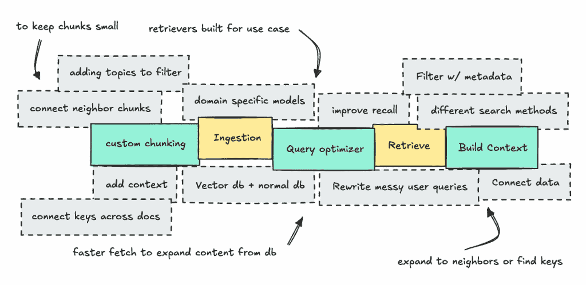
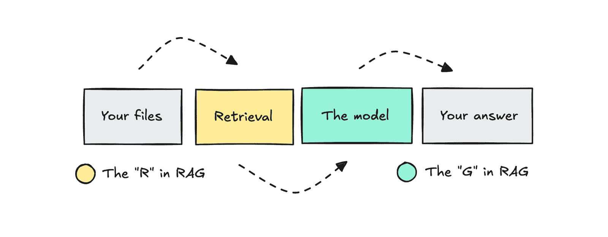
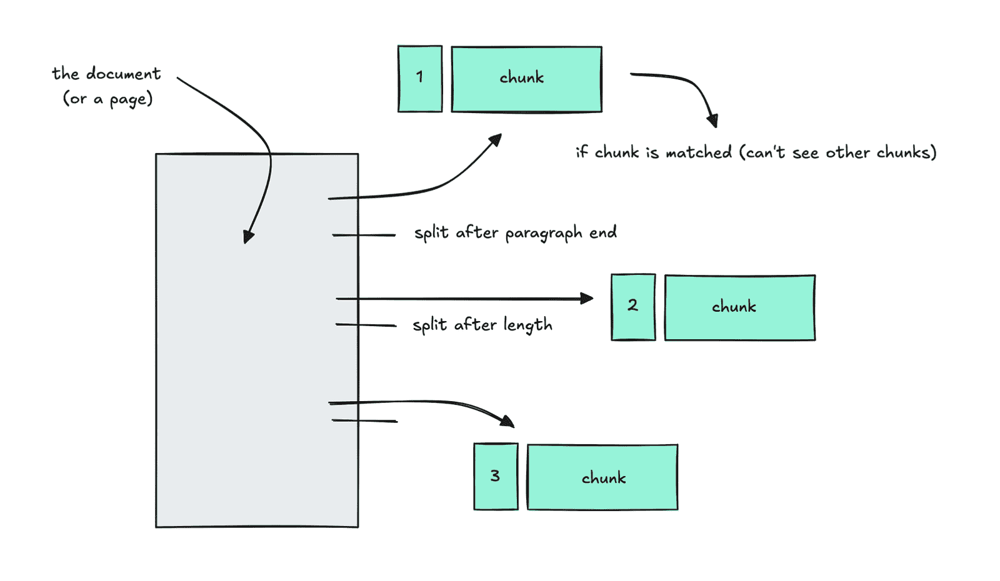
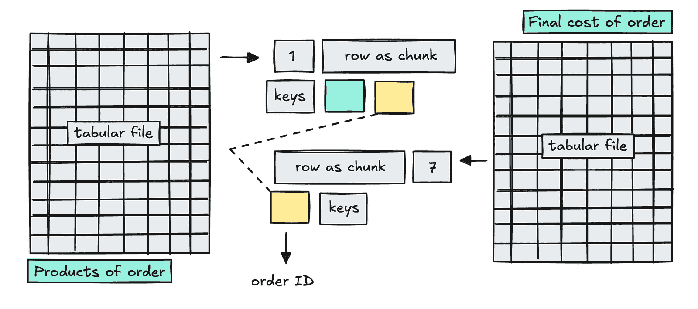
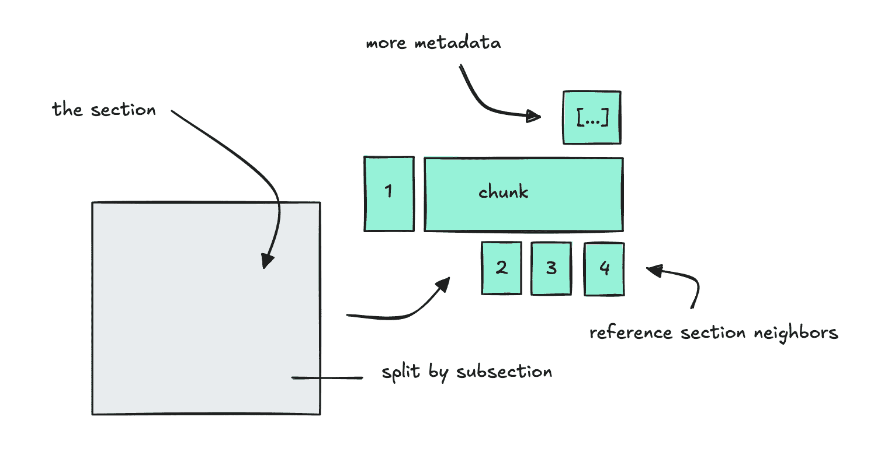
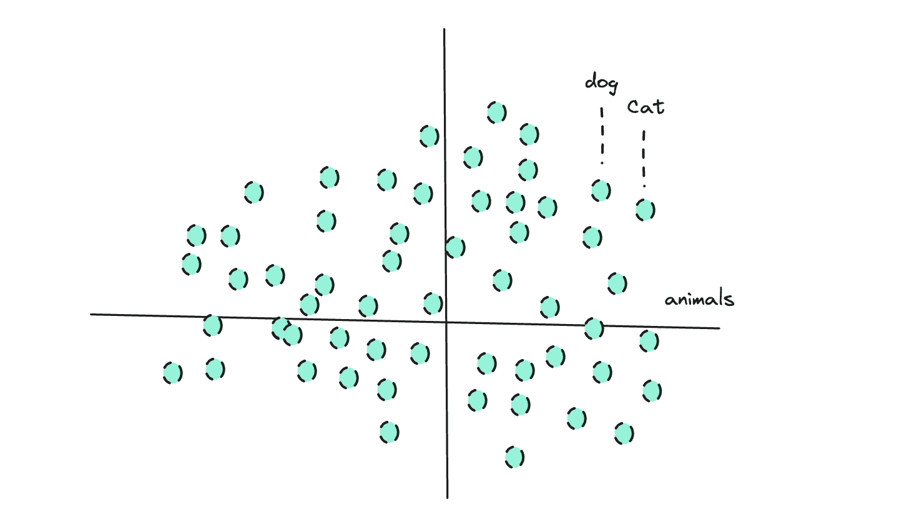
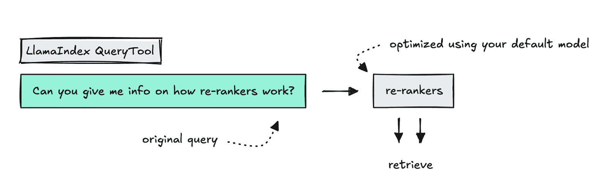
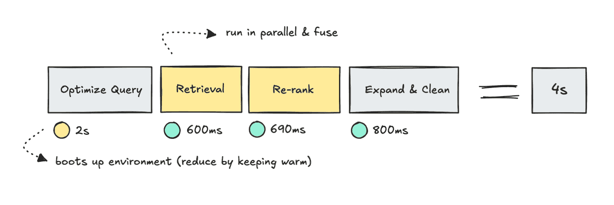

# 如何构建一个过度设计的检索系统

> 原文：[`towardsdatascience.com/how-to-build-an-overengineered-retrieval-system/`](https://towardsdatascience.com/how-to-build-an-overengineered-retrieval-system/)

<mdspan datatext="el1763428277760" class="mdspan-comment">在进行 AI 工程工作时</mdspan>，你可能会遇到的一个问题是，没有真正的蓝图可以遵循。

是的，对于检索的最基本部分（RAG 中的“R”），你可以对文档进行分块，在查询上使用语义搜索，重新排序结果等等。这部分是众所周知的。

但一旦你开始深入研究这个领域，你可能会开始问一些问题，比如：**如果一个系统只能在一篇文档的几个片段中阅读，我们怎么能称其为智能呢？**那么，我们如何确保它有足够的信息来真正地进行智能回答？

很快，你会发现自己在一条兔子洞中，试图弄清楚其他人如何在他们的组织中做这件事，因为这一切都没有得到适当的记录，人们仍在构建自己的设置。

这将引导你实施各种优化策略：构建自定义的 chunkers，重写用户查询，使用不同的搜索方法，使用元数据过滤，以及扩展上下文以包括相邻的片段。



因此，我现在构建了一个相当臃肿的检索系统来展示它是如何工作的。所以，让我们一步步地走一遍，这样我们就可以看到每个步骤的结果，同时也可以讨论权衡。

为了在公共场合演示这个系统，我决定嵌入 150 篇最近提及 RAG 的 ArXiv 论文（共 2,250 页）。这意味着我们在这里测试的系统是为科学论文设计的，所有的测试查询都将与 RAG 相关。

如果你想详细了解整个流程，我已在这个[仓库](https://github.com/ilsilfverskiold/Awesome-LLM-Resources-List/tree/main/guides/RAG/Custom)中收集了每个步骤的原始输出，请查看。

对于技术栈，我使用 Qdrant 和 Redis 来存储数据，使用 Cohere 和 OpenAI 来处理 LLMs。我不依赖任何框架来构建管道（因为它使得调试更加困难）。

*如往常一样，我会快速回顾一下我们正在做的事情，以便初学者了解，如果你已经熟悉 RAG，请自由地跳过第一部分*。

## 概述检索与 RAG

当你与像 Copilot 这样的 AI 知识系统（其中你提供自己的文档以供回答）一起工作时，你就是在使用一个 RAG 系统。

**RAG**代表**检索增强生成**，分为检索部分和生成部分。

**检索**指的是根据用户查询，使用关键词和语义匹配，从你的文件中**检索信息**的过程。**生成**部分是 LLM 根据提供的上下文和用户查询**回答**的地方。



对于任何刚开始接触 RAG 的人来说，这可能会感觉是一种构建系统的笨拙方式。LLM 不应该自己完成大部分工作吗？

不幸的是，LLM 是静态的，我们需要设计系统，以便每次我们调用它们时，我们都能提前提供它们所需的一切，以便它们可以回答问题。

我之前写过关于为 Slack 构建 RAG 机器人的文章[之前](https://towardsdatascience.com/agentic-rag-applications-company-knowledge-slack-agents/)。这个使用标准的块分割方法，如果你想要了解人们是如何构建简单的东西。

本文更进一步，尝试在不使用任何框架的情况下重建整个检索管道，做一些复杂的事情，比如构建多查询优化器、融合结果以及扩展块以构建 LLM 更好的上下文。

尽管如此，我们将看到，所有这些花哨的附加功能我们都需要在延迟和额外的工作中付出代价。

## 处理不同的文档

就像任何数据工程问题一样，你的第一个挑战将是设计如何存储数据。在检索方面，我们关注的是所谓的块分割，以及你如何做以及你与之存储的内容对于构建一个精心设计的系统是至关重要的。

当我们进行检索时，我们搜索文本，为此我们需要将文本分成不同的信息块。这些文本片段是我们稍后搜索以找到查询匹配的内容。

大多数简单的系统使用通用的块分割器，简单地根据长度、段落或句子分割全文。



但每个文档都是不同的，所以这样做你可能会失去上下文。

要理解这一点，你应该查看不同的文档，看看它们是如何遵循不同结构的。你将有一个带有清晰部分标题的 HR 文档，以及使用代码块和表格的无编号部分的 API 文档。

如果你将这些相同的块分割逻辑应用于所有这些，你可能会错误地分割每个文本。这意味着一旦 LLM 获得了信息块，它将是不完整的，这可能会导致它无法产生准确的答案。

此外，对于每个信息块，你还需要考虑你想要它持有的数据。

它应该包含某些元数据，以便系统可以应用过滤器吗？它应该链接到类似的信息，以便它可以连接数据吗？它应该持有上下文，以便 LLM 理解信息来自哪里？

这意味着你存储数据的架构成为最重要的部分。如果你开始存储信息，后来发现不够，你将不得不重新做。如果你意识到你使系统变得复杂，你将不得不从头开始。

这个系统将摄入 Excel 和 PDF 文件，专注于添加上下文、键和邻居。这将允许你在稍后进行检索时看到它的样子。

*对于这个演示，我已经将数据存储在 Redis 和 Qdrant 中。我们使用 Qdrant 来进行语义、BM25 和混合搜索，并从 Redis 中获取数据来扩展内容。*

## 处理表格文件

首先，我们将介绍如何分块表格数据，添加上下文，并使用键保持信息连接。

当处理已经结构化的表格数据，如 Excel 文件时，可能看起来直接让系统直接搜索它是明显的做法。但实际上，对于混乱的用户查询，语义匹配非常有效。

SQL 或直接查询仅在你知道模式以及确切字段时才有效。例如，如果你从用户那里得到一个“Mazda 2023 规格”的查询，语义匹配行将给我们一些依据。

我和想要他们的系统匹配不同 Excel 文件中的文档的公司谈过。为了做到这一点，我们可以存储键与块（而不进行完整的 KG）一起。

例如，如果我们正在处理包含采购数据的 Excel 文件，我们可以这样为每一行摄取数据：

```py
{
    "chunk_id": "Sales_Q1_123::row::1",
    "doc_id": "Sales_Q1_123:1234"
    "location": {"sheet_name": "Sales Q1", "row_n": 1},
    "type": "chunk",
    "text": "OrderID: 1001234f67 \n Customer: Alice Hemsworth \n Products: Blue sweater 4, Red pants 6",
    "context": "Quarterly sales snapshot",
    "keys": {"OrderID": "1001234f67"},
}
```

如果我们决定在检索管道中稍后连接信息，我们可以使用键进行标准搜索以找到连接的块。这允许我们在文档之间快速跳转，而无需在管道中添加另一个路由步骤。



非常简化——在表格文档之间连接键 | 图片由作者提供

我们也可以为每个文档设置一个摘要。这作为块的门卫。

```py
{
    "chunk_id": "Sales_Q1::summary",
    "doc_id": "Sales_Q1_123:1234"
    "location": {"sheet_name": "Sales Q1"},
    "type": "summary",
    "text": "Sheet tracks Q1 orders for 2025, type of product, and customer names for reconciliation.",
    "context": ""
}
```

最初理解门卫摘要的想法可能有点复杂，但如果在构建上下文时需要它，将摘要存储在文档级别也有帮助。

当 LLM 设置这个摘要（以及一个简短上下文字符串）时，它可以建议关键列（例如订单 ID 等）。

*作为备注，如果可能，始终手动设置键列，如果不可能，设置一些验证逻辑以确保键不是随机的（可能会发生 LLM 选择奇怪的列来存储，而忽略最重要的列）。*

对于这个包含 ArXiv 论文的系统，我已经摄取了两个包含标题和作者级别信息的 Excel 文件。

块看起来可能像这样：

```py
{
    "chunk_id": "titles::row::8817::250930134607",
    "doc_id": "titles::250930134607",
    "location": {
      "sheet_name": "titles",
      "row_n": 8817
    },
    "type": "chunk",
    "text": "id: 2507 2114\ntitle: Gender Similarities Dominate Mathematical Cognition at the Neural Level: A Japanese fMRI Study Using Advanced Wavelet Analysis and Generative AI\nkeywords: FMRI; Functional Magnetic Resonance Imaging; Gender Differences; Machine Learning; Mathematical Performance; Time Frequency Analysis; Wavelet\nabstract_url: https://arxiv.org/abs/2507.21140\ncreated: 2025-07-23 00:00:00 UTC\nauthor_1: Tatsuru Kikuchi",
    "context": "Analyzing trends in AI and computational research articles.",
    "keys": {
      "id": "2507 2114",
      "author_1": "Tatsuru Kikuchi"
    }
 }
```

这些 Excel 文件严格来说不是必要的（PDF 文件就足够了），但它们是演示系统如何查找键以找到连接信息的一种方式。

我也为这些文件创建了摘要。

```py
{
    "chunk_id": "titles::summary::250930134607",
    "doc_id": "titles::250930134607",
    "location": {
      "sheet_name": "titles"
    },
    "type": "summary",
    "text": "The dataset consists of articles with various attributes including ID, title, keywords, authors, and publication date. It contains a total of 2508 rows with a rich variety of topics predominantly around AI, machine learning, and advanced computational methods. Authors often contribute in teams, indicated by multiple author columns. The dataset serves academic and research purposes, enabling catego",
 }
```

我们还在 Redis 中以文档级别存储信息，这告诉我们它是什么，在哪里可以找到它，谁被允许查看它，以及最后一次更新时间。这将允许我们稍后更新过时的信息。

现在让我们转向 PDF 文件，这是你将遇到的最大的怪物。

## 处理 PDF 文档

处理 PDF 文件时，我们做类似的事情，但分块它们要困难得多，我们存储邻居而不是键。

要开始处理 PDF，我们有几个框架可以与之合作，例如 LlamaParse 和 Docling，但没有一个是完美的，因此我们必须进一步构建系统。

PDF 文档处理起来非常困难，因为大多数文档的结构并不相同。它们还经常包含大多数系统无法正确处理的图表和表格。

尽管如此，像 Docling 这样的工具可以帮助我们至少正确解析正常表格，并将每个元素映射到正确的页面和元素编号。

从这里，我们可以通过为每个元素映射章节和子章节以及智能合并片段来创建自己的程序逻辑，使块读起来自然（即不要在句子中间分割）。

我们还确保按章节对块进行分组，通过在名为“邻居”的字段中链接它们的 ID 来将它们保持在一起。



这允许我们保持块的大小，但在检索后仍然可以扩展它们。

最终结果将类似于以下内容：

```py
{
    "chunk_id": "S3::C02::251009105423",
    "doc_id": "2507.18910v1",
    "location": {
      "page_start": 2,
      "page_end": 2
    },
    "type": "chunk",
    "text": "1 Introduction\n\n1.1 Background and Motivation\n\nLarge-scale pre-trained language models have demonstrated an ability to store vast amounts of factual knowledge in their parameters, but they struggle with accessing up-to-date information and providing verifiable sources. This limitation has motivated techniques that augment generative models with information retrieval. Retrieval-Augmented Generation (RAG) emerged as a solution to this problem, combining a neural retriever with a sequence-to-sequence generator to ground outputs in external documents [52]. The seminal work of [52] introduced RAG for knowledge-intensive tasks, showing that a generative model (built on a BART encoder-decoder) could retrieve relevant Wikipedia passages and incorporate them into its responses, thereby achieving state-of-the-art performance on open-domain question answering. RAG is built upon prior efforts in which retrieval was used to enhance question answering and language modeling [48, 26, 45]. Unlike earlier extractive approaches, RAG produces free-form answers while still leveraging non-parametric memory, offering the best of both worlds: improved factual accuracy and the ability to cite sources. This capability is especially important to mitigate hallucinations (i.e., believable but incorrect outputs) and to allow knowledge updates without retraining the model [52, 33].",
    "context": "Systematic review of RAG's development and applications in NLP, addressing challenges and advancements.",
    "section_neighbours": {
      "before": [
        "S3::C01::251009105423"
      ],
      "after": [
        "S3::C03::251009105423",
        "S3::C04::251009105423",
        "S3::C05::251009105423",
        "S3::C06::251009105423",
        "S3::C07::251009105423"
      ]
    },
    "keys": {}
 }
```

当我们以这种方式设置数据时，我们可以将这些块视为种子。我们正在根据用户查询搜索可能存在相关信息的地方，并从这里扩展。

与简单的 RAG 系统相比，我们试图利用 LLM 不断增长的上下文窗口来发送更多信息（但显然也有权衡）。

您将在检索管道中构建上下文时看到这个混乱的解决方案的样子。

## 构建检索管道

由于我是逐步构建这个管道的，这使我们能够测试每个部分，并了解我们在检索和转换信息之前如何做出某些选择，然后再将其交给 LLM。

我们将遍历语义、混合和 BM25 搜索，构建一个多查询优化器，重新排序结果，扩展内容以构建上下文，然后将结果交给 LLM 来回答。

我们将以关于延迟、不必要的复杂性和要削减以使系统更快的内容的讨论来结束本节。

如果您想查看此管道的几次运行输出，请访问此[仓库](https://medium.com/data-science-collective/agentic-rag-company-knowledge-slack-agents-98e588fd1209)。

### 语义、BM25 和混合搜索

这个管道的第一部分是确保我们能够为用户查询返回相关的文档。为此，我们使用语义搜索、BM25 和混合搜索。

对于简单的检索系统，人们通常会直接使用语义搜索。为了执行语义搜索，我们使用嵌入模型为每段文本嵌入密集向量。

如果这对您来说很新，请注意，嵌入将每段文本表示为高维空间中的一个点。每个点的位置反映了模型根据训练期间学习的模式对其含义的理解。



意义相似的文本最终会靠近在一起。

这意味着如果模型已经看到了许多类似语言的例子，它就会更好地将相关文本放在一起，因此更好地匹配与最相关内容相关的查询。

*我之前写过关于* [*这个话题的，*](https://towardsdatascience.com/working-with-embeddings-closed-versus-open-source-39491f0b95c2/) *通过在多种嵌入模型上使用聚类来查看它们在特定用例中的表现，如果你有兴趣了解更多。*

为了测试这一点，我们可以通过使用 BM25 将查询更改为*“来自 Anirban Saha Anik 的论文”*。

这个模型比它们的较小模型更昂贵，也许不适合这个用例。

我会考虑针对特定领域使用专业模型或考虑微调自己的模型。因为记住，如果嵌入模型没有看到许多与您嵌入的文本相似的例子，那么将它们与相关文档匹配会更困难。

为了支持混合和 BM25 搜索，我们还构建了一个词法索引（稀疏向量）。BM25 在精确标记（例如，“ID 826384”）上工作，而不是像语义搜索那样返回“具有相似含义”的文本。

为了测试语义搜索，我们将设置一个我认为我们已摄入的论文可以回答的查询，例如：*“为什么 LLMs 在较长的上下文中表现变差，以及如何应对？”*

```py
[1] score=0.5071 doc=docs_ingestor/docs/arxiv/2508.15253.pdf chunk=S3::C02::251009131027
  text: 1 Introduction This challenge is exacerbated when incorrect yet highly ranked contexts serve as hard negatives. Conventional RAG, i.e. , simply appending * Corresponding author 1 https://github.com/eunseongc/CARE Figure 1: LLMs struggle to resolve context-memory conflict. Green bars show the number of questions correctly answered without retrieval in a closed-book setting. Blue and yellow bars show performance when provided with a positive or negative context, respectively. Closed-book w/ Positive Context W/ Negative Context 1 8k 25.1% 49.1% 39.6% 47.5% 6k 4k 1 2k 4 Mistral-7b LLaMA3-8b GPT-4o-mini Claude-3.5 retrieved context to the prompt, struggles to discriminate between incorrect external context and correct parametric knowledge (Ren et al., 2025). This misalignment leads to overriding correct internal representations, resulting in substantial performance degradation on questions that the model initially answered correctly. As shown in Figure 1, we observed significant performance drops of 25.149.1% across state-of-the-
[2] score=0.5022 doc=docs_ingestor/docs/arxiv/2508.19614.pdf chunk=S3::C03::251009132038
  text: 1 Introductions Despite these advances, LLMs might underutilize accurate external contexts, disproportionately favoring internal parametric knowledge during generation [50, 40]. This overreliance risks propagating outdated information or hallucinations, undermining the trustworthiness of RAG systems. Surprisingly, recent studies reveal a paradoxical phenomenon: injecting noise-random documents or tokens-to retrieved contexts that already contain answer-relevant snippets can improve the generation accuracy [10, 49]. While this noise-injection approach is simple and effective, its underlying influence on LLM remains unclear. Furthermore, long contexts containing noise documents create computational overhead. Therefore, it is important to design more principled strategies that can achieve similar benefits without incurring excessive cost.
[3] score=0.4982 doc=docs_ingestor/docs/arxiv/2508.19614.pdf chunk=S6::C18::251009132038
  text: 4 Experiments 4.3 Analysis Experiments Qualitative Study In Table 4, we analyze a case study from the NQ dataset using the Llama2-7B model, evaluating four decoding strategies: GD(0), CS, DoLA, and LFD. Despite access to groundtruth documents, both GD(0) and DoLA generate incorrect answers (e.g., '18 minutes'), suggesting limited capacity to integrate contextual evidence. Similarly, while CS produces a partially relevant response ('Texas Revolution'), it exhibits reduced factual consistency with the source material. In contrast, LFD demonstrates superior utilization of retrieved context, synthesizing a precise and factually aligned answer. Additional case studies and analyses are provided in Appendix F.
[4] score=0.4857 doc=docs_ingestor/docs/arxiv/2507.23588.pdf chunk=S6::C03::251009122456
  text: 4 Results Figure 4: Change in attention pattern distribution in different models. For DiffLoRA variants we plot attention mass for main component (green) and denoiser component (yellow). Note that attention mass is normalized by the number of tokens in each part of the sequence. The negative attention is shown after it is scaled by λ . DiffLoRA corresponds to the variant with learnable λ and LoRa parameters in both terms. BOS CONTEXT 1 MAGIC NUMBER CONTEXT 2 QUERY 0 0.2 0.4 0.6 BOS CONTEXT 1 MAGIC NUMBER CONTEXT 2 QUERY BOS CONTEXT 1 MAGIC NUMBER CONTEXT 2 QUERY BOS CONTEXT 1 MAGIC NUMBER CONTEXT 2 QUERY Llama-3.2-1B LoRA DLoRA-32 DLoRA, Tulu-3 perform similarly as the initial model, however they are outperformed by LoRA. When increasing the context length with more sample demonstrations, DiffLoRA seems to struggle even more in TREC-fine and Banking77\. This might be due to the nature of instruction tuned data, and the max_sequence_length = 4096 applied during finetuning. LoRA is less impacted, likely because it diverges less
[5] score=0.4838 doc=docs_ingestor/docs/arxiv/2508.15253.pdf chunk=S3::C03::251009131027
  text: 1 Introduction To mitigate context-memory conflict, existing studies such as adaptive retrieval (Ren et al., 2025; Baek et al., 2025) and the decoding strategies (Zhao et al., 2024; Han et al., 2025) adjust the influence of external context either before or during answer generation. However, due to the LLM's limited capacity in detecting conflicts, it is susceptible to misleading contextual inputs that contradict the LLM's parametric knowledge. Recently, robust training has equipped LLMs, enabling them to identify conflicts (Asai et al., 2024; Wang et al., 2024). As shown in Figure 2(a), it enables the LLM to dis-
[6] score=0.4827 doc=docs_ingestor/docs/arxiv/2508.05266.pdf chunk=S27::C03::251009123532
  text: B. Subclassification Criteria for Misinterpretation of Design Specifications Initially, regarding long-context scenarios, we observed that directly prompting LLMs to generate RTL code based on lengthy contexts often resulted in certain code segments failing to accurately reflect high-level requirements. However, by manually decomposing the long context-retaining only the key descriptive text relevant to the erroneous segments while omitting unnecessary details-the LLM regenerated RTL code that correctly matched the specifications. As shown in Fig 23, after manual decomposition of the long context, the LLM successfully generated the correct code. This demonstrates that redundancy in long contexts is a limiting factor in LLMs' ability to generate accurate RTL code.
[7] score=0.4798 doc=docs_ingestor/docs/arxiv/2508.19614.pdf chunk=S3::C02::251009132038
  text: 1 Introductions Figure 1: Illustration for layer-wise behavior in LLMs for RAG. Given a query and retrieved documents with the correct answer ('Real Madrid'), shallow layers capture local context, middle layers focus on answer-relevant content, while deep layers may over-rely on internal knowledge and hallucinate (e.g., 'Barcelona'). Our proposal, LFD fuses middle-layer signals into the final output to preserve external knowledge and improve accuracy. Shallow Layers Middle Layers Deep Layers Who has more la liga titles real madrid or barcelona? …Nine teams have been crowned champions, with Real Madrid winning the title a record 33 times and Barcelona 25 times … Query Retrieved Document …with Real Madrid winning the title a record 33 times and Barcelona 25 times … Short-context Modeling Focus on Right Answer Answer is barcelona Wrong Answer LLMs …with Real Madrid winning the title a record 33 times and Barcelona 25 times … …with Real Madrid winning the title a record 33 times and Barcelona 25 times … Internal Knowledge Confou
```

从上述结果中，我们可以看到它能够匹配一些有趣的段落，其中讨论了可以回答查询的主题。

如果我们尝试使用与相同查询匹配的 BM25（匹配精确标记），我们会得到以下结果：

```py
[1] score=22.0764 doc=docs_ingestor/docs/arxiv/2507.20888.pdf chunk=S4::C27::251009115003
  text: 3 APPROACH 3.2.2 Project Knowledge Retrieval Similar Code Retrieval. Similar snippets within the same project are valuable for code completion, even if they are not entirely replicable. In this step, we also retrieve similar code snippets. Following RepoCoder, we no longer use the unfinished code as the query but instead use the code draft, because the code draft is closer to the ground truth compared to the unfinished code. We use the Jaccard index to calculate the similarity between the code draft and the candidate code snippets. Then, we obtain a list sorted by scores. Due to the potentially large differences in length between code snippets, we no longer use the top-k method. Instead, we get code snippets from the highest to the lowest scores until the preset context length is filled.
[2] score=17.4931 doc=docs_ingestor/docs/arxiv/2508.09105.pdf chunk=S20::C08::251009124222
  text: C. Ablation Studies Ablation result across White-Box attribution: Table V shows the comparison result in methods of WhiteBox Attribution with Noise, White-Box Attrition with Alternative Model and our current method Black-Box zero-gradient Attribution with Noise under two LLM categories. We can know that: First, The White-Box Attribution with Noise is under the desired condition, thus the average Accuracy Score of two LLMs get the 0.8612 and 0.8073\. Second, the the alternative models (the two models are exchanged for attribution) reach the 0.7058 and 0.6464\. Finally, our current method Black-Box Attribution with Noise get the Accuracy of 0.7008 and 0.6657 by two LLMs.
[3] score=17.1458 doc=docs_ingestor/docs/arxiv/2508.05100.pdf chunk=S4::C03::251009123245
  text: Preliminaries Based on this, inspired by existing analyses (Zhang et al. 2024c), we measure the amount of information a position receives using discrete entropy, as shown in the following equation: which quantifies how much information t i receives from the attention perspective. This insight suggests that LLMs struggle with longer sequences when not trained on them, likely due to the discrepancy in information received by tokens in longer contexts. Based on the previous analysis, the optimization of attention entropy should focus on two aspects: The information entropy at positions that are relatively important and likely contain key information should increase.
```

在这里，对于这个查询的结果有些平淡无奇——但有时查询中包含我们需要匹配的特定关键词，这时 BM25 是更好的选择。

我发现对于这个查询，语义搜索效果最好，这就是为什么运行多查询并使用不同的搜索方法来获取前几块内容是有用的，尽管这也增加了复杂性。

```py
[1] score=62.3398 doc=authors.csv chunk=authors::row::1::251009110024
  text: author_name: Anirban Saha Anik n_papers: 2 article_1: 2509.01058 article_2: 2507.07307
[2] score=56.4007 doc=titles.csv chunk=titles::row::24::251009110138
  text: id: 2509.01058 title: Speaking at the Right Level: Literacy-Controlled Counterspeech Generation with RAG-RL keywords: Controlled-Literacy; Health Misinformation; Public Health; RAG; RL; Reinforcement Learning; Retrieval Augmented Generation abstract_url: https://arxiv.org/abs/2509.01058 created: 2025-09-10 00:00:00 UTC author_1: Xiaoying Song author_2: Anirban Saha Anik author_3: Dibakar Barua author_4: Pengcheng Luo author_5: Junhua Ding author_6: Lingzi Hong
[3] score=56.2614 doc=titles.csv chunk=titles::row::106::251009110138
  text: id: 2507.07307 title: Multi-Agent Retrieval-Augmented Framework for Evidence-Based Counterspeech Against Health Misinformation keywords: Evidence Enhancement; Health Misinformation; LLMs; Large Language Models; RAG; Response Refinement; Retrieval Augmented Generation abstract_url: https://arxiv.org/abs/2507.07307 created: 2025-07-27 00:00:00 UTC author_1: Anirban Saha Anik author_2: Xiaoying Song author_3: Elliott Wang author_4: Bryan Wang author_5: Bengisu Yarimbas author_6: Lingzi Hong
```

所有上述结果都提到了“Anirban Saha Anik”，这正是我们所寻找的。

如果我们使用语义搜索运行这个查询，它会返回不仅包括“Anirban Saha Anik”这个名字，还包括类似的名字。

```py
[1] score=0.5810 doc=authors.csv chunk=authors::row::1::251009110024
  text: author_name: Anirban Saha Anik n_papers: 2 article_1: 2509.01058 article_2: 2507.07307
[2] score=0.4499 doc=authors.csv chunk=authors::row::55::251009110024
  text: author_name: Anand A. Rajasekar n_papers: 1 article_1: 2508.0199
[3] score=0.4320 doc=authors.csv chunk=authors::row::59::251009110024
  text: author_name: Anoop Mayampurath n_papers: 1 article_1: 2508.14817
[4] score=0.4306 doc=authors.csv chunk=authors::row::69::251009110024
  text: author_name: Avishek Anand n_papers: 1 article_1: 2508.15437
[5] score=0.4215 doc=authors.csv chunk=authors::row::182::251009110024
  text: author_name: Ganesh Ananthanarayanan n_papers: 1 article_1: 2509.14608
```

这是一个很好的例子，说明了语义搜索并不总是理想的方法——相似的名字并不一定意味着它们与查询相关。

因此，有些情况下语义搜索是理想的，而其他情况下 BM25（标记匹配）是更好的选择。

我们还可以使用混合搜索，它结合了语义和 BM25。

你将看到以下是通过在原始查询上运行混合搜索得到的结果：*“为什么 LLMs 在较长的上下文中表现变差，以及如何应对？”*

```py
[1] score=0.5000 doc=docs_ingestor/docs/arxiv/2508.15253.pdf chunk=S3::C02::251009131027
  text: 1 Introduction This challenge is exacerbated when incorrect yet highly ranked contexts serve as hard negatives. Conventional RAG, i.e. , simply appending * Corresponding author 1 https://github.com/eunseongc/CARE Figure 1: LLMs struggle to resolve context-memory conflict. Green bars show the number of questions correctly answered without retrieval in a closed-book setting. Blue and yellow bars show performance when provided with a positive or negative context, respectively. Closed-book w/ Positive Context W/ Negative Context 1 8k 25.1% 49.1% 39.6% 47.5% 6k 4k 1 2k 4 Mistral-7b LLaMA3-8b GPT-4o-mini Claude-3.5 retrieved context to the prompt, struggles to discriminate between incorrect external context and correct parametric knowledge (Ren et al., 2025). This misalignment leads to overriding correct internal representations, resulting in substantial performance degradation on questions that the model initially answered correctly. As shown in Figure 1, we observed significant performance drops of 25.149.1% across state-of-the-
[2] score=0.5000 doc=docs_ingestor/docs/arxiv/2507.20888.pdf chunk=S4::C27::251009115003
  text: 3 APPROACH 3.2.2 Project Knowledge Retrieval Similar Code Retrieval. Similar snippets within the same project are valuable for code completion, even if they are not entirely replicable. In this step, we also retrieve similar code snippets. Following RepoCoder, we no longer use the unfinished code as the query but instead use the code draft, because the code draft is closer to the ground truth compared to the unfinished code. We use the Jaccard index to calculate the similarity between the code draft and the candidate code snippets. Then, we obtain a list sorted by scores. Due to the potentially large differences in length between code snippets, we no longer use the top-k method. Instead, we get code snippets from the highest to the lowest scores until the preset context length is filled.
[3] score=0.4133 doc=docs_ingestor/docs/arxiv/2508.19614.pdf chunk=S3::C03::251009132038
  text: 1 Introductions Despite these advances, LLMs might underutilize accurate external contexts, disproportionately favoring internal parametric knowledge during generation [50, 40]. This overreliance risks propagating outdated information or hallucinations, undermining the trustworthiness of RAG systems. Surprisingly, recent studies reveal a paradoxical phenomenon: injecting noise-random documents or tokens-to retrieved contexts that already contain answer-relevant snippets can improve the generation accuracy [10, 49]. While this noise-injection approach is simple and effective, its underlying influence on LLM remains unclear. Furthermore, long contexts containing noise documents create computational overhead. Therefore, it is important to design more principled strategies that can achieve similar benefits without incurring excessive cost.
[4] score=0.1813 doc=docs_ingestor/docs/arxiv/2508.19614.pdf chunk=S6::C18::251009132038
  text: 4 Experiments 4.3 Analysis Experiments Qualitative Study In Table 4, we analyze a case study from the NQ dataset using the Llama2-7B model, evaluating four decoding strategies: GD(0), CS, DoLA, and LFD. Despite access to groundtruth documents, both GD(0) and DoLA generate incorrect answers (e.g., '18 minutes'), suggesting limited capacity to integrate contextual evidence. Similarly, while CS produces a partially relevant response ('Texas Revolution'), it exhibits reduced factual consistency with the source material. In contrast, LFD demonstrates superior utilization of retrieved context, synthesizing a precise and factually aligned answer. Additional case studies and analyses are provided in Appendix F.
```

为了创建密集向量，我使用了 OpenAI 的大嵌入模型，因为我正在处理科学论文。

因此，让我们转向构建一个可以将原始查询转换为几个优化版本并融合结果的系统。

### 多查询优化器

对于这部分，我们看看我们如何通过生成多个有针对性的变体并为每个选择正确的搜索方法来优化混乱的用户查询。它可以提高召回率，但这也引入了权衡。

你看到的所有代理抽象系统通常在执行搜索时都会转换用户查询。例如，当你使用 LlamaIndex 中的 QueryTool 时，它会使用 LLM 来优化传入的查询。



我们可以自己重建这部分，但我们可以赋予它创建多个查询的能力，同时设置搜索方法。*当你处理更多文档时，你还可以在这个阶段设置过滤器。*

至于创建大量查询，我会尽量保持简单，因为这里的问题会导致检索输出质量低下。系统生成的无关查询越多，它引入到管道中的噪声就越多。

我在这里创建的函数将根据混乱的用户查询生成 1-3 个学术风格的查询，以及要使用的搜索方法。

```py
Original query:
why is everyone saying RAG doesn't scale? how are people fixing that?

Generated queries:
- hybrid: RAG scalability issues
- hybrid: solutions to RAG scaling challenges
```

我们将得到这样的结果：

```py
Query 1 (hybrid) top 20 for query: RAG scalability issues

[1] score=0.5000 doc=docs_ingestor/docs/arxiv/2507.18910.pdf chunk=S22::C05::251104142800
  text: 7 Challenges of RAG 7.2.1 Scalability and Infrastructure Deploying RAG at scale requires substantial engineering to maintain large knowledge corpora and efficient retrieval indices. Systems must handle millions or billions of documents, demanding significant computational resources, efficient indexing, distributed computing infrastructure, and cost management strategies [21]. Efficient indexing methods, caching, and multi-tier retrieval approaches (such as cascaded retrieval) become essential at scale, especially in large deployments like web search engines.
[2] score=0.5000 doc=docs_ingestor/docs/arxiv/2507.07695.pdf chunk=SDOC::SUM::251104135247
  text: This paper proposes the KeyKnowledgeRAG (K2RAG) framework to enhance the efficiency and accuracy of Retrieval-Augment-Generate (RAG) systems. It addresses the high computational costs and scalability issues associated with naive RAG implementations by incorporating techniques such as knowledge graphs, a hybrid retrieval approach, and document summarization to reduce training times and improve answer accuracy. Evaluations show that K2RAG significantly outperforms traditional implementations, achieving greater answer similarity and faster execution times, thereby providing a scalable solution for companies seeking robust question-answering systems.

[...]

Query 2 (hybrid) top 20 for query: solutions to RAG scaling challenges

[1] score=0.5000 doc=docs_ingestor/docs/arxiv/2507.18910.pdf chunk=S22::C05::251104142800
  text: 7 Challenges of RAG 7.2.1 Scalability and Infrastructure Deploying RAG at scale requires substantial engineering to maintain large knowledge corpora and efficient retrieval indices. Systems must handle millions or billions of documents, demanding significant computational resources, efficient indexing, distributed computing infrastructure, and cost management strategies [21]. Efficient indexing methods, caching, and multi-tier retrieval approaches (such as cascaded retrieval) become essential at scale, especially in large deployments like web search engines.
[2] score=0.5000 doc=docs_ingestor/docs/arxiv/2508.05100.pdf chunk=S3::C06::251104155301
  text: Introduction Empirical analyses across multiple real-world benchmarks reveal that BEE-RAG fundamentally alters the entropy scaling laws governing conventional RAG systems, which provides a robust and scalable solution for RAG systems dealing with long-context scenarios. Our main contributions are summarized as follows: We introduce the concept of balanced context entropy, a novel attention reformulation that ensures entropy invariance across varying context lengths, and allocates attention to important segments. It addresses the critical challenge of context expansion in RAG.

[...]
```

我们也可以使用特定的关键词，如姓名和 ID 来测试系统，以确保它选择 BM25 而不是语义搜索。

```py
Original query:
any papers from Chenxin Diao?

Generated queries:
- BM25: Chenxin Diao
```

这将检索到明确提到*陈心调*的结果。

*我应该指出，BM25 可能在用户拼写错误时引起问题，例如询问“陈旭迪”而不是“陈心调”。所以实际上你可能只想将混合搜索应用于所有这些（然后让重新排序器负责剔除无关的结果）。*

如果你想做得更好，你可以构建一个检索系统，该系统基于输入生成几个示例查询，因此当原始查询到来时，你可以获取示例来帮助指导优化器。

这有助于因为较小的模型并不擅长将混乱的人类查询转换成更精确的学术措辞。

以供参考，当用户询问为什么 LLM 在撒谎时，优化器可能会将查询转换为“大型语言模型中不准确的原因”这样的内容，而不是直接寻找“hallicunations”。

在我们并行获取结果后，我们将它们融合。结果看起来可能像这样：

```py
RRF Fusion top 38 for query: why is everyone saying RAG doesn't scale? how are people fixing that?

[1] score=0.0328 doc=docs_ingestor/docs/arxiv/2507.18910.pdf chunk=S22::C05::251104142800
  text: 7 Challenges of RAG 7.2.1 Scalability and Infrastructure Deploying RAG at scale requires substantial engineering to maintain large knowledge corpora and efficient retrieval indices. Systems must handle millions or billions of documents, demanding significant computational resources, efficient indexing, distributed computing infrastructure, and cost management strategies [21]. Efficient indexing methods, caching, and multi-tier retrieval approaches (such as cascaded retrieval) become essential at scale, especially in large deployments like web search engines.
[2] score=0.0313 doc=docs_ingestor/docs/arxiv/2507.18910.pdf chunk=S22::C42::251104142800
  text: 7 Challenges of RAG 7.5.5 Scalability Scalability challenges arise as knowledge corpora expand. Advanced indexing, distributed retrieval, and approximate nearest neighbor techniques facilitate efficient handling of large-scale knowledge bases [57]. Selective indexing and corpus curation, combined with infrastructure improvements like caching and parallel retrieval, allow RAG systems to scale to massive knowledge repositories. Research indicates that moderate-sized models augmented with large external corpora can outperform significantly larger standalone models, suggesting parameter efficiency advantages [10].
[3] score=0.0161 doc=docs_ingestor/docs/arxiv/2507.07695.pdf chunk=SDOC::SUM::251104135247
  text: This paper proposes the KeyKnowledgeRAG (K2RAG) framework to enhance the efficiency and accuracy of Retrieval-Augment-Generate (RAG) systems. It addresses the high computational costs and scalability issues associated with naive RAG implementations by incorporating techniques such as knowledge graphs, a hybrid retrieval approach, and document summarization to reduce training times and improve answer accuracy. Evaluations show that K2RAG significantly outperforms traditional implementations, achieving greater answer similarity and faster execution times, thereby providing a scalable solution for companies seeking robust question-answering systems.
[4] score=0.0161 doc=docs_ingestor/docs/arxiv/2508.05100.pdf chunk=S3::C06::251104155301
  text: Introduction Empirical analyses across multiple real-world benchmarks reveal that BEE-RAG fundamentally alters the entropy scaling laws governing conventional RAG systems, which provides a robust and scalable solution for RAG systems dealing with long-context scenarios. Our main contributions are summarized as follows: We introduce the concept of balanced context entropy, a novel attention reformulation that ensures entropy invariance across varying context lengths, and allocates attention to important segments. It addresses the critical challenge of context expansion in RAG.

[...]
```

我们看到有一些好的匹配项，但也有一两个无关的匹配项需要进一步过滤。

在我们继续之前，这可能是你尝试减少延迟时将跳过或优化的步骤。

我发现 LLM 在创建真正能够检索有用信息的键查询方面并不出色，所以如果做得不对，它只会增加更多的噪声。

### 添加重新排序器

我们确实从检索系统中得到了结果，其中一些是好的，而另一些是不相关的，所以大多数检索系统都会使用某种形式的重新排序器。

重新排序器接收几个片段，并根据原始用户查询为每个片段分配一个相关性分数。你在这里有几个选择，包括使用更小的东西，但我会使用 Cohere 的重新排序器。

我们可以在前一个部分使用的第一个问题上进行测试这个重新排序器：*“为什么每个人都认为 RAG 无法扩展？人们是如何解决这个问题的？”*

```py
[... optimizer... retrieval... fuse...]

Rerank summary:
- strategy=cohere
- model=rerank-english-v3.0
- candidates=32
- eligible_above_threshold=4
- kept=4 (reranker_threshold=0.35)

Reranked Relevant (4/32 kept ≥ 0.35) top 4 for query: why is everyone saying RAG doesn't scale? how are people fixing that?

[1] score=0.7920 doc=docs_ingestor/docs/arxiv/2507.07695.pdf chunk=S4::C08::251104135247
  text: 1 Introduction Scalability: Naive implementations of Retrieval-Augmented Generation (RAG) often rely on 16-bit floating-point large language models (LLMs) for the generation component. However, this approach introduces significant scalability challenges due to the increased memory demands required to host the LLM as well as longer inference times due to using a higher precision number type. To enable more efficient scaling, it is crucial to integrate methods or techniques that reduce the memory footprint and inference times of generator models. Quantized models offer more scalable solutions due to less computational requirements, hence when developing RAG systems we should aim to use quantized LLMs for more cost effective deployment as compared to a full fine-tuned LLM whose performance might be good but is more expensive to deploy due to higher memory requirements. A quantized LLM's role in the RAG pipeline itself should be minimal and for means of rewriting retrieved information into a presentable fashion for the end users
[2] score=0.4749 doc=docs_ingestor/docs/arxiv/2507.18910.pdf chunk=S22::C42::251104142800
  text: 7 Challenges of RAG 7.5.5 Scalability Scalability challenges arise as knowledge corpora expand. Advanced indexing, distributed retrieval, and approximate nearest neighbor techniques facilitate efficient handling of large-scale knowledge bases [57]. Selective indexing and corpus curation, combined with infrastructure improvements like caching and parallel retrieval, allow RAG systems to scale to massive knowledge repositories. Research indicates that moderate-sized models augmented with large external corpora can outperform significantly larger standalone models, suggesting parameter efficiency advantages [10].
[3] score=0.4304 doc=docs_ingestor/docs/arxiv/2507.18910.pdf chunk=S22::C05::251104142800
  text: 7 Challenges of RAG 7.2.1 Scalability and Infrastructure Deploying RAG at scale requires substantial engineering to maintain large knowledge corpora and efficient retrieval indices. Systems must handle millions or billions of documents, demanding significant computational resources, efficient indexing, distributed computing infrastructure, and cost management strategies [21]. Efficient indexing methods, caching, and multi-tier retrieval approaches (such as cascaded retrieval) become essential at scale, especially in large deployments like web search engines.
[4] score=0.3556 doc=docs_ingestor/docs/arxiv/2509.13772.pdf chunk=S11::C02::251104182521
  text: 7\. Discussion and Limitations Scalability of RAGOrigin: We extend our evaluation by scaling the NQ dataset's knowledge database to 16.7 million texts, combining entries from the knowledge database of NQ, HotpotQA, and MS-MARCO. Using the same user questions from NQ, we assess RAGOrigin's performance under larger data volumes. As shown in Table 16, RAGOrigin maintains consistent effectiveness and performance even on this significantly expanded database. These results demonstrate that RAGOrigin remains robust at scale, making it suitable for enterprise-level applications requiring large
```

记住，到目前为止，我们已经转换了用户查询，进行了语义或混合搜索，并在将片段传递给重新排序器之前融合了结果。

如果你查看结果，我们可以清楚地看到它能够识别出一些相关的片段，我们可以将其用作种子。

*记住，它最初只有 150 个文档可以参考。*

你还可以看到它从同一文档返回多个片段。我们将在上下文构建中稍后设置此操作，但如果你想要获取独特的文档，你可以在自定义逻辑中添加一些设置，以限制独特文档的数量而不是片段。

我们可以用另一个问题来尝试：*“RAG 中的幻觉与正常 LLM 以及如何减少它们”*

```py
[... optimizer... retrieval... fuse...]

Rerank summary:
- strategy=cohere
- model=rerank-english-v3.0
- candidates=35
- eligible_above_threshold=12
- kept=5 (threshold=0.2)

Reranked Relevant (5/35 kept ≥ 0.2) top 5 for query: hallucinations in rag vs normal llms and how to reduce them

[1] score=0.9965 doc=docs_ingestor/docs/arxiv/2508.19614.pdf chunk=S7::C03::251104164901
  text: 5 Related Work Hallucinations in LLMs Hallucinations in LLMs refer to instances where the model generates false or unsupported information not grounded in its reference data [42]. Existing mitigation strategies include multi-agent debating, where multiple LLM instances collaborate to detect inconsistencies through iterative debates [8, 14]; self-consistency verification, which aggregates and reconciles multiple reasoning paths to reduce individual errors [53]; and model editing, which directly modifies neural network weights to correct systematic factual errors [62, 19]. While RAG systems aim to ground responses in retrieved external knowledge, recent studies show that they still exhibit hallucinations, especially those that contradict the retrieved content [50]. To address this limitation, our work conducts an empirical study analyzing how LLMs internally process external knowledge
[2] score=0.9342 doc=docs_ingestor/docs/arxiv/2508.05509.pdf chunk=S3::C01::251104160034
  text: Introduction Large language models (LLMs), like Claude (Anthropic 2024), ChatGPT (OpenAI 2023) and the Deepseek series (Liu et al. 2024), have demonstrated remarkable capabilities in many real-world tasks (Chen et al. 2024b; Zhou et al. 2025), such as question answering (Allam and Haggag 2012), text comprehension (Wright and Cervetti 2017) and content generation (Kumar 2024). Despite the success, these models are often criticized for their tendency to produce hallucinations, generating incorrect statements on tasks beyond their knowledge and perception (Ji et al. 2023; Zhang et al. 2024). Recently, retrieval-augmented generation (RAG) (Gao et al. 2023; Lewis et al. 2020) has emerged as a promising solution to alleviate such hallucinations. By dynamically leveraging external knowledge from textual corpora, RAG enables LLMs to generate more accurate and reliable responses without costly retraining (Lewis et al. 2020; Figure 1: Comparison of three paradigms. LAG exhibits greater lightweight properties compared to GraphRAG while
[3] score=0.9030 doc=docs_ingestor/docs/arxiv/2509.13702.pdf chunk=S3::C01::251104182000
  text: ABSTRACT Hallucination remains a critical barrier to the reliable deployment of Large Language Models (LLMs) in high-stakes applications. Existing mitigation strategies, such as Retrieval-Augmented Generation (RAG) and post-hoc verification, are often reactive, inefficient, or fail to address the root cause within the generative process. Inspired by dual-process cognitive theory, we propose D ynamic S elfreinforcing C alibration for H allucination S uppression (DSCC-HS), a novel, proactive framework that intervenes directly during autoregressive decoding. DSCC-HS operates via a two-phase mechanism: (1) During training, a compact proxy model is iteratively aligned into two adversarial roles-a Factual Alignment Proxy (FAP) and a Hallucination Detection Proxy (HDP)-through contrastive logit-space optimization using augmented data and parameter-efficient LoRA adaptation. (2) During inference, these frozen proxies dynamically steer a large target model by injecting a real-time, vocabulary-aligned steering vector (computed as the 
[4] score=0.9007 doc=docs_ingestor/docs/arxiv/2509.09360.pdf chunk=S2::C05::251104174859
  text: 1 Introduction Figure 1\. Standard Retrieval-Augmented Generation (RAG) workflow. A user query is encoded into a vector representation using an embedding model and queried against a vector database constructed from a document corpus. The most relevant document chunks are retrieved and appended to the original query, which is then provided as input to a large language model (LLM) to generate the final response. Corpus Retrieved_Chunks Vectpr DB Embedding model Query Response LLM Retrieval-Augmented Generation (RAG) [17] aims to mitigate hallucinations by grounding model outputs in retrieved, up-to-date documents, as illustrated in Figure 1\. By injecting retrieved text from re- a
[5] score=0.8986 doc=docs_ingestor/docs/arxiv/2508.04057.pdf chunk=S20::C02::251104155008
  text: Parametric knowledge can generate accurate answers. Effects of LLM hallucinations. To assess the impact of hallucinations when large language models (LLMs) generate answers without retrieval, we conduct a controlled experiment based on a simple heuristic: if a generated answer contains numeric values, it is more likely to be affected by hallucination. This is because LLMs are generally less reliable when producing precise facts such as numbers, dates, or counts from parametric memory alone (Ji et al. 2023; Singh et al. 2025). We filter out all directly answered queries (DQs) whose generated answers contain numbers, and we then rerun our DPR-AIS for these queries (referred to Exclude num ). The results are reported in Tab. 5\. Overall, excluding numeric DQs results in slightly improved performance. The average exact match (EM) increases from 35.03 to 35.12, and the average F1 score improves from 35.68 to 35.80\. While these gains are modest, they come with an increase in the retriever activation (RA) ratio-from 75.5% to 78.1%.
```

这个查询也表现得很不错（如果你查看返回的全部片段）。

我们还可以测试更混乱的用户查询，例如：*“为什么 LLM 在说谎，RAG 如何帮助解决这个问题？”*

```py
[... optimizer...]

Original query:
why is the llm lying and rag help with this?

Generated queries:
- semantic: explore reasons for LLM inaccuracies
- hybrid: RAG techniques for LLM truthfulness

[...retrieval... fuse...]

Rerank summary:
- strategy=cohere
- model=rerank-english-v3.0
- candidates=39
- eligible_above_threshold=39
- kept=6 (threshold=0)

Reranked Relevant (6/39 kept ≥ 0) top 6 for query: why is the llm lying and rag help with this?

[1] score=0.0293 doc=docs_ingestor/docs/arxiv/2507.05714.pdf chunk=S3::C01::251104134926
  text: 1 Introduction Retrieval Augmentation Generation (hereafter referred to as RAG) helps large language models (LLMs) (OpenAI et al., 2024) reduce hallucinations (Zhang et al., 2023) and access real-time data 1 *Equal contribution.
[2] score=0.0284 doc=docs_ingestor/docs/arxiv/2508.15437.pdf chunk=S3::C01::251104164223
  text: 1 Introduction Large language models (LLMs) augmented with retrieval have become a dominant paradigm for knowledge-intensive NLP tasks. In a typical retrieval-augmented generation (RAG) setup, an LLM retrieves documents from an external corpus and conditions generation on the retrieved evidence (Lewis et al., 2020b; Izacard and Grave, 2021). This setup mitigates a key weakness of LLMs-hallucination-by grounding generation in externally sourced knowledge. RAG systems now power open-domain QA (Karpukhin et al., 2020), fact verification (V et al., 2024; Schlichtkrull et al., 2023), knowledge-grounded dialogue, and explanatory QA.
[3] score=0.0277 doc=docs_ingestor/docs/arxiv/2509.09651.pdf chunk=S3::C01::251104180034
  text: 1 Introduction Large Language Models (LLMs) have transformed natural language processing, achieving state-ofthe-art performance in summarization, translation, and question answering. However, despite their versatility, LLMs are prone to generating false or misleading content, a phenomenon commonly referred to as hallucination [9, 21]. While sometimes harmless in casual applications, such inaccuracies pose significant risks in domains that demand strict factual correctness, including medicine, law, and telecommunications. In these settings, misinformation can have severe consequences, ranging from financial losses to safety hazards and legal disputes.
[4] score=0.0087 doc=docs_ingestor/docs/arxiv/2507.07695.pdf chunk=S4::C08::251104135247
  text: 1 Introduction Scalability: Naive implementations of Retrieval-Augmented Generation (RAG) often rely on 16-bit floating-point large language models (LLMs) for the generation component. However, this approach introduces significant scalability challenges due to the increased memory demands required to host the LLM as well as longer inference times due to using a higher precision number type. To enable more efficient scaling, it is crucial to integrate methods or techniques that reduce the memory footprint and inference times of generator models. Quantized models offer more scalable solutions due to less computational requirements, hence when developing RAG systems we should aim to use quantized LLMs for more cost effective deployment as compared to a full fine-tuned LLM whose performance might be good but is more expensive to deploy due to higher memory requirements. A quantized LLM's role in the RAG pipeline itself should be minimal and for means of rewriting retrieved information into a presentable fashion for the end users
```

在我们继续之前，我需要指出，在某些时刻，这个重新排序器表现并不好，正如你从上面的分数中看到的。

有时它估计片段没有回答用户的问题，但实际上它确实回答了，至少当我们把这些片段作为种子来看时。

通常对于重新排序器，片段应该暗示整个内容，但我们在使用这些片段作为种子，所以有时它会对结果进行非常低的评级，但对我们来说已经足够了。

这就是为什么我保持了很低的分数阈值。

这里可能有更好的选择，你可能想要探索，比如构建一个理解你寻找内容的自定义重新排序器。

然而，现在我们已经有了一些相关的文档，我们将使用我们在摄取前设置的元数据来扩展和发散这些片段，以便 LLM 能够获得足够的上下文来理解如何回答问题。

### 构建上下文

现在我们已经有了一些作为种子的片段，我们将从 Redis 中拉取更多信息，扩展并构建上下文。

这一步显然要复杂得多，因为你需要为要获取哪些片段以及如何获取构建逻辑（如果存在键，或者如果有任何邻居），并行获取信息，然后进一步清理片段。

一旦你有了所有片段（以及关于文档本身的信息），你需要将它们放在一起，即去重片段，可能设置系统可以扩展的范围限制，并突出显示哪些片段被获取了，哪些被扩展了。

最终结果将类似于以下内容：

```py
Expanded context windows (Markdown ready):

## Document #1 - Fusing Knowledge and Language: A Comparative Study of Knowledge Graph-Based Question Answering with LLMs
- `doc_id`: `doc::6371023da29b4bbe8242ffc5caf4a8cd`
- **Last Updated:** 2025-11-04T17:44:07.300967+00:00
- **Context:** Comparative study on methodologies for integrating knowledge graphs in QA systems using LLMs.
- **Content fetched inside document:**
```文本

[从第 4 页开始]

    QA 中的 LLM

    随着大型语言模型（LLMs）的出现，自然语言处理（NLP）领域进入了变革时代，特别是在问答（QA）领域。这些模型在大量多样化的文本语料库上进行了预训练，展现出在自然语言理解和生成方面的复杂能力。它们在产生连贯、上下文相关且类似人类响应的广泛提示方面表现出色，这使得它们非常适合问答任务，在这些任务中，提供精确和有信息量的答案是至关重要的。BERT [57] 和 ChatGPT [58] 等模型最近的进步显著推动了该领域的发展。LLMs 在开放域问答场景中表现出强大的性能——例如常识推理[20]——这得益于它们对世界的广泛嵌入知识。此外，它们理解和阐述对抽象或上下文细微的查询和推理任务[22]的响应能力，强调了它们在解决需要深度语义理解的复杂问答挑战中的实用性。尽管 LLMs 具有优势，但它们也带来了挑战：它们可能会在输出中表现出上下文模糊性或过度自信（“幻觉”[21]），并且它们大量的计算和内存需求使得在资源受限的环境中部署变得复杂。

    RAG，问答中的微调

    ---------------------- 这是我们与查询匹配的段落 -------------

    当涉及到特定领域的问答或需要准确回忆事实信息而不是概率性地生成后续内容时，LLMs 也面临着问题。研究也探索了不同的提示技术，如思维链提示[24]和基于采样的方法[23]，以减少幻觉。当代研究越来越多地探索诸如微调和检索增强等策略，以增强基于 LLM 的问答系统。在特定领域语料库（例如，BioBERT 用于生物医学文本[17]，SciBERT 用于科学文本[18]）上的微调已被证明可以增强模型焦点，减少在医疗或法律问答等特定设置中的无关或通用响应。如 RAG[19]这样的检索增强架构将 LLMs 与外部知识库相结合，试图进一步缓解事实不准确的问题，并实现新信息的实时整合。基于 RAG 在连接参数和非参数知识方面的能力，许多现代问答管道引入了一个轻量级的重新排序步骤[25]，以筛选检索到的上下文并促进与查询最相关的段落。然而，RAG 仍然面临几个挑战。一个关键问题在于检索步骤本身——如果检索器未能检索到相关文档，生成器就只能进行幻觉或提供不完整的答案。此外，整合嘈杂或松散相关的上下文可能会降低响应质量而不是提高它，尤其是在精度至关重要的高风险领域。RAG 管道对底层知识库的质量和领域一致性也很敏感，并且通常需要大量调整以有效地平衡召回率和精确率。

    --------------------------------------------------------------------------------------

[结束在第 5 页]

```py

## Document #2 - Each to Their Own: Exploring the Optimal Embedding in RAG
- `doc_id`: `doc::3b9c43d010984d4cb11233b5de905555`
- **Last Updated:** 2025-11-04T14:00:38.215399+00:00
- **Context:** Enhancing Large Language Models using Retrieval-Augmented Generation techniques.
- **Content fetched inside document:**
```文本

[从第 1 页开始]

    1 引言

    大型语言模型（LLMs）最近通过直接答案生成、从头开始在多种类型的数据上进行训练以及在目标领域进行微调等不同范式，加速了多个领域的转型速度，包括交通（Lyu et al., 2025）、艺术（Zhao et al., 2025）和教育（Gao et al., 2024）。然而，与 LLMs 相关的幻觉问题（Henkel et al., 2024）已经困扰人们很长时间，这源于多个因素，如对给定提示的知识不足（Huang et al., 2025b）和有偏见的训练过程（Zhao, 2025）。

    作为一种高度有效的解决方案，检索增强生成（RAG）已被广泛应用于构建基础模型（Chen 等人，2024）和实用代理（Arslan 等人，2024）。与微调和提示调整等训练方法相比，其即插即用特性使 RAG 成为一个高效、简单且成本效益高的方法。RAG 的主要范式是首先计算问题与外部知识语料库中的块之间的相似度，然后结合前 K 个相关块到提示中，以引导 LLMs（Lewis 等人，2020）。

    尽管 RAG 具有优势，但选择合适的嵌入模型仍然是一个关键问题，因为检索到的参考质量直接影响 LLM（Tu 等人，2025）的生成结果。训练数据和模型架构的变化导致不同的嵌入模型在不同领域提供不同的好处。嵌入模型之间的不同相似度计算常常使研究人员不确定如何选择最佳模型。因此，从嵌入模型的角度提高 RAG 的准确性仍然是一个持续的研究领域。

    ---------------------- 这是与我们查询匹配的段落 -------------

    为了解决这一研究差距，我们提出了两种方法来通过结合多个嵌入模型的优势来改进 RAG。第一种方法命名为 Mixture-Embedding RAG，它根据归一化相似度对来自多个嵌入模型的检索材料进行排序，并选择前 K 个材料作为最终参考。第二种方法命名为 Confident RAG，其中我们首先使用 vanilla RAG 生成答案多次，每次使用不同的嵌入模型并记录相关的置信度指标，然后选择置信度最高的答案作为最终响应。通过使用多个 LLM 和嵌入模型验证我们的方法，我们展示了 Confident RAG 的优越性能和泛化能力，尽管 MixtureEmbedding RAG 可能会输给 vanilla RAG。本文的主要贡献可以总结如下：

    我们首先指出，在 RAG 中，不同的嵌入模型在其各自的先验域内运行。为了利用各种嵌入模型的优势，我们提出了并测试了两种新的 RAG 方法：MixtureEmbedding RAG 和 Confident RAG。这些方法有效地利用了从不同嵌入模型检索到的结果，达到最大程度。

    --------------------------------------------------------------------------------------

    虽然 Mixture-Embedding RAG 的表现与 vanilla RAG 相似，但 Confident RAG 方法在性能上优于 vanilla LLM 和 vanilla RAG，在使用最佳置信度指标时，平均分别提高了 9.9% 和 4.9%。此外，我们还基于结果讨论了 Confident RAG 方法的最佳嵌入模型数量。

[...]

```py

The total context will contain a few documents and lands around 2–3k tokens. There is some waste here, but instead of deciding for the LLM, we send in more information so it can scan entire documents rather than isolated chunks.

*Remember you can take a look at the pipeline for five different queries [here](https://github.com/ilsilfverskiold/Awesome-LLM-Resources-List/tree/main/guides/RAG/Custom) to see how it works. *

For the system you build, you can cache this context as well so the LLM can answer follow-up questions.

### Add in the LLM to answer (the G in RAG)

Let’s finish up with the last step, just to see how the LLM answers with the context it has been handed.

I did not plan on adding this part, as this article is primarily about the retrieval pipeline, but it’s good to test with an LLM to see if it can interpret the information into something coherent.

If you use a larger LLM here, you can expect the latency to go up quite a bit. At the same time, if you use a smaller model, it may not answer as intelligently.

I decided to test with GPT-5 (low reasoning), as it’s very cheap to use but also quite slow. You’ll see the result below with the messy user query: *“why is the llm lying and can rag help with this?”*

```

[优化查询...检索...融合...重新排序...扩展...构建上下文...]

LLM 答案：

LLM 有时“撒谎”，因为它们根据模式而不是经过验证的事实生成下一个可能的单词。如果没有基于来源的依据，它们可以产生自信但错误的陈述——称为幻觉——并且它们内置的知识可能过时或不完整 [6][3]。这在需要严格准确性的领域（例如法律或电信法规）中是危险的，因为小错误会有重大后果 [3]。

RAG 通过模型首先从外部语料库检索相关文档，然后基于该证据生成答案，从而减少幻觉并引入最新信息 [2][6][1]。在实践中，针对特定领域的 RAG 显著提高了准确性；例如，一个无线电法规 RAG 管道将 GPT-4o 的准确性通过普通提示提升了+11.9%，并实现了高达 97%的检索准确性，支持更可靠的答案 [3]。

然而，RAG 的效果取决于其检索能力和模型使用检索文本的能力。静态的现成检索器对于需要迭代查找或查询重构的复杂任务（例如多跳问题或程序查询）可能很脆弱 [2]。简单的 RAG 也可能使模型陷入长而嘈杂的上下文中，或者拉取语义相似但无关的片段——“大海捞针”问题——导致错误答案 [4]。

更好的 RAG 实践解决了这个问题：为 RAG 进行指令微调，以教授过滤、组合多个来源以及使用“思考后再回答”方法（HIRAG）进行 RAG 特定推理，从而提高证据的使用 [1]；自适应、反馈驱动的检索决定何时以及如何检索和重新排序证据 [2]；以及优化分块和检索的管道设计提高了答案的准确性 [4]。

如果幻觉仍然存在，可以采用直接引导解码（超出 RAG）的技术进一步抑制它 [5]。

引用文档：

[1] doc::b0610cc6134b401db0ea68a77096e883 - HIRAG：分层思维指令微调检索增强生成

[2] doc::53b521e646b84289b46e648c66dde56a - 测试时语料库反馈：从检索到 RAG

[3] doc::9694bd0124d0453c81ecb32dd75ab489 - 用于可靠解释无线电法规的检索增强生成

[4] doc::6d7a7d88cfc04636b20931fdf22f1e61 - 关键知识 RAG (K²RAG)：一种增强型 RAG 方法，以提升 LLM 问答能力

[5] doc::3c9a1937ecbc454b8faff4f66bdf427f - DSCC-HS：用于大型语言模型幻觉抑制的动态自我强化框架

[6] doc::688cfbc0abdc4520a73e219ac26aff41 - 关键检索增强生成（RAG）系统系统综述：进展、差距和未来方向

```

你会看到它正确引用了来源并使用了它所获得的信息，但因为我们使用的是 GPT-5，所以在这个大上下文中延迟相当高。

使用 GPT-5 首次标记需要大约 9 秒钟（但将取决于你的环境）。

如果整个检索管道大约需要 4-5 秒（并且这还没有优化），这意味着最后一部分将需要大约 2-3 倍的时间。

有些人会争论说，你需要减少上下文窗口中的信息量以降低这部分延迟，但这也会违背我们试图做的事情的目的。

另一些人会争论使用链式提示，一个较小的 LLM 提取有用信息，然后让另一个更大的 LLM 在优化的上下文窗口中回答，但我不确定在时间或价值方面能节省多少。

有些人会尽可能使用最小的模型，牺牲“智能”以换取速度和成本。但使用超过 2k 窗口的较小模型也存在风险，因为它们可能会开始产生幻觉。

尽管如此，如何优化系统取决于你。这是最难的部分。

如果你想要检查几个查询的整个管道，请查看[这个](https://github.com/ilsilfverskiold/Awesome-LLM-Resources-List/tree/main/guides/RAG/Custom)文件夹。

## 让我们谈谈延迟和成本

讨论将整个文档发送到 LLM 的人可能并没有在他们的系统中无情地优化延迟。这是你将花费最多时间的地方，用户不希望等待。

你当然可以应用一些 UX 技巧，但如果你的检索管道比几秒钟慢，开发者可能会认为你很懒惰。

这也是为什么我们看到在野外向代理搜索的这种转变很有趣，添加大型上下文窗口、基于 LLM 的查询转换、自动“路由器”链、子问题分解和多步骤“代理”查询引擎要慢得多。

对于这个系统（主要使用 Codex 和我的指令构建），在无服务器环境中检索大约需要 4-5 秒。



这有点慢（但相当便宜）。

你可以优化这里的每个步骤来降低这个数字，同时保持大多数内容处于活跃状态。然而，使用 API，你无法总是控制它们返回响应的速度。

有些人会争论为优化器和路由器托管自己的小型模型，但这样你还需要增加托管成本，这可能会轻易地每月增加几百美元。

使用这个管道，每次运行（不使用缓存）的成本为 1.2 美分（0.0121 美元），所以如果你每天让你的组织提出 200 个问题，你将支付大约 2.42 美元使用 GPT-5。

如果你将主要 LLM 切换到 GPT-5-mini，一次管道运行的成本将降至 0.0041 美分，对于 200 次运行，每天大约花费 0.82 美元。

至于嵌入文档，我使用 OpenAI 的大模型处理了大约 200 个 PDF 文件，花费了 0.5 美元。随着规模的扩大，这个成本会增加，这是需要考虑的，然后对于小型或专业的微调模型来说，这可能是有意义的。

## 如何改进它

由于我们只处理最近的 RAG 论文，一旦你扩大规模，你可以添加一些东西使其更加健壮。

我首先应该注意的是，您可能不会在文档开始增长之前看到大多数真正的问题。当您处理成千上万的文档时，那些看起来稳固的几百个文档将会开始显得杂乱无章。

您可以为优化器设置过滤器，可能使用语义匹配来处理主题。您还可以设置日期以保持信息的时效性，同时在重新排序时引入权威信号，以提升某些来源的排名。

一些团队会将此方法进一步发展，并设计自己的评分函数来决定哪些内容应该出现以及如何优先处理文档，但这完全取决于您的语料库是什么样的。

如果您需要处理几千个文档，在导入过程中跳过 LLM 可能是有意义的，而改在检索管道中使用它，在那里它仅在查询请求时分析文档。然后您可以缓存该结果以供下次使用。

最后，始终记得添加适当的评估来展示检索质量和稳定性，尤其是如果您正在切换模型以优化成本。我将来会尝试写一些关于这个话题的文章。

* * *

如果您一直读到这儿，您可以问自己一个问题：构建这样一个系统是否值得，或者这工作是否过于繁重。

我可能在将来做一些明确比较原始 RAG 与更好的分块 RAG（带有扩展/元数据）的输出质量的工作。

我还想要比较使用知识图谱的相同用例。

要查看我的更多作品并关注我的未来写作，请通过[LinkedIn](https://www.linkedin.com/in/ida-silfverskiold/)、[Medium](https://medium.com/@ilsilfverskiold)、[Substack](https://howtouseai.substack.com/)或访问我的[网站](https://www.ilsilfverskiold.com/)与我联系。

❤

PS. 我在 1 月份正在寻找一些工作。如果您需要一位在这个领域构建（并且喜欢在解释复杂技术概念的同时构建奇怪、有趣的东西）的人，请通过[联系我](https://www.linkedin.com/in/ida-silfverskiold/)。
