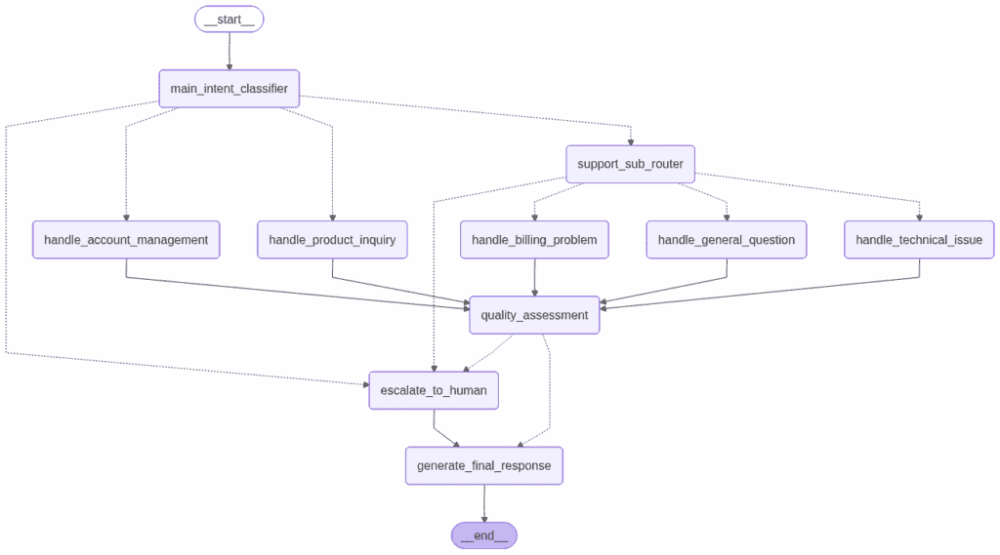
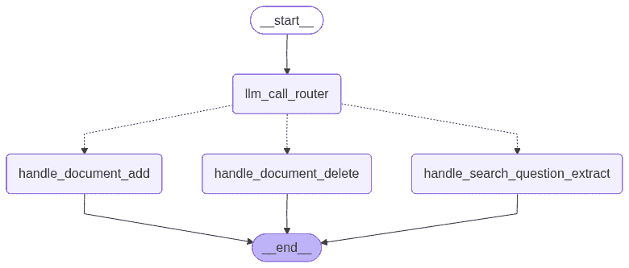
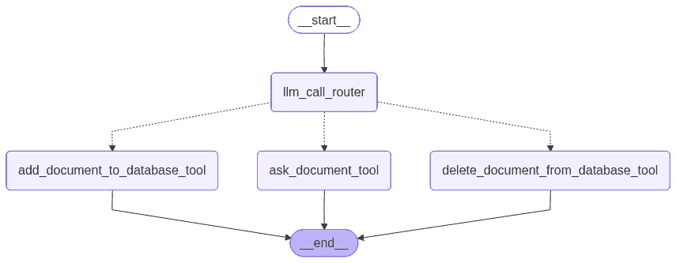

# 如何使用 LangGraph 构建有效的代理系统

> 原文：[`towardsdatascience.com/how-to-build-effective-agentic-systems-with-langgraph/`](https://towardsdatascience.com/how-to-build-effective-agentic-systems-with-langgraph/)

<mdspan datatext="el1759176334067" class="mdspan-comment">随着强大的人工智能模型，如 GPT-5 和 Gemini 2.5 Pro 的兴起，我们也看到了用于利用这些模型的代理框架的增加。这些框架通过抽象掉很多挑战，如工具调用、代理状态处理和人工干预设置，使与人工智能模型的工作变得更简单。</mdspan>

因此，在这篇文章中，我将深入探讨 LangGraph，这是可用的代理人工智能框架之一。我将利用它开发一个简单的代理应用程序，通过几个步骤突出代理人工智能包的优势。我还会介绍使用 LangGraph 和其他类似代理框架的优缺点。

我没有受到 LangGraph 的任何形式的赞助来创建这篇文章。我只是选择了这个框架，因为它是最普遍的框架之一。还有许多其他选择，例如：

+   LangChain

+   LlamaIndex

+   CrewAI



这张图展示了你可以使用 LangGraph 实现的先进人工智能工作流程的示例。该工作流程由几个路由步骤组成，每个步骤都引导到不同的功能处理程序，以有效地处理用户请求。图片由作者提供。

## 为什么你需要代理框架？

现在有大量旨在使编程应用程序更容易的包。在许多情况下，这些包产生了完全相反的效果，因为它们模糊了代码，在生产环境中表现不佳，有时甚至使调试变得更困难。

然而，你需要找到通过抽象掉样板代码来简化应用程序的包。这个原则在创业界经常被以下引语所强调：

> 专注于解决你试图解决的精确问题。所有其他（以前解决的问题）都应该外包给其他应用程序

需要代理框架是因为它可以抽象掉你不想处理的很多复杂性：

+   维护和更新状态。不仅仅是消息历史，还包括你收集的所有其他信息，例如在执行 RAG 时

+   工具使用。你不需要自己设置执行工具的逻辑。相反，你应该简单地定义它们，并让代理框架处理如何调用工具。（这对于并行和异步工具调用尤为重要）

因此，使用代理框架可以抽象掉很多复杂性，这样你就可以专注于产品的核心部分。

## LangGraph 的基础知识

要开始实施 LangGraph，我首先阅读了[文档](https://langchain-ai.github.io/langgraph/concepts/why-langgraph/)，涵盖了以下内容：

+   基本聊天机器人实现

+   工具使用

+   维护和更新状态

LangGraph，正如其名所示，是基于构建图和根据请求执行此图。在图中，你可以定义：

+   状态（当前保存在内存中的信息）

+   节点。通常是一个 LLM 或工具的调用，例如，分类用户意图或回答用户的问题

+   边。条件逻辑决定下一个要访问的节点。

所有这些都源于基本的图论。

## 实现工作流程



在这篇文章中，你将创建一个如上图所示的代理工作流程，其中你将从一个用户查询开始。这个查询将被路由到三个选项之一：要么向数据库添加一个新文档，要么从数据库中删除一个文档，或者询问关于数据库中文档的问题。图片由作者提供。

我认为学习最好的方式之一就是简单地自己尝试。因此，我将在 LangGraph 中实现一个简单的工作流程。你可以在工作流程文档中了解如何构建这些工作流程，该文档基于 Anthropic 的 Building effective agents 博客（关于代理我最喜欢的博客文章之一，我在我的一些早期文章中已经介绍过。我强烈推荐阅读它。

我将创建一个简单的工作流程来定义一个应用程序，用户可以在其中：

+   使用文本创建文档

+   删除文档

+   在文档中搜索

为了做到这一点，我将创建以下工作流程：

1.  检测用户意图。他们想要创建文档、删除文档还是在文档中搜索？

1.  根据步骤 1 的结果，我将有不同的流程来处理每一个。

你也可以通过简单地定义所有工具并让代理有权创建/删除/搜索文档来完成这项工作。然而，如果你想根据意图执行更多操作，首先进行意图分类路由步骤是最佳选择。

### 加载导入和 LLM

首先，我将加载所需的导入和我要使用的 LLM。我将使用 AWS Bedrock，尽管你可以使用其他提供者，正如你在本教程的第 3 步中看到的。[step 3 in this tutorial](https://langchain-ai.github.io/langgraph/tutorials/get-started/1-build-basic-chatbot/#__tabbed_1_1)。

```py
"""
Make a document handler workflow where a user can
create a new document to the database (currently just a dictionary)
delete a document from the database
ask a question about a document
"""

from typing_extensions import TypedDict, Literal
from langgraph.checkpoint.memory import InMemorySaver
from langgraph.graph import StateGraph, START, END
from langgraph.types import Command, interrupt
from langchain_aws import ChatBedrockConverse
from langchain_core.messages import HumanMessage, SystemMessage
from pydantic import BaseModel, Field
from IPython.display import display, Image

from dotenv import load_dotenv
import os

load_dotenv()

aws_access_key_id = os.getenv("AWS_ACCESS_KEY_ID") or ""
aws_secret_access_key = os.getenv("AWS_SECRET_ACCESS_KEY") or ""

os.environ["AWS_ACCESS_KEY_ID"] = aws_access_key_id
os.environ["AWS_SECRET_ACCESS_KEY"] = aws_secret_access_key

llm = ChatBedrockConverse(
    model_id="us.anthropic.claude-3-5-haiku-20241022-v1:0", # this is the model id (added us. before id in platform)
    region_name="us-east-1",
    aws_access_key_id=aws_access_key_id,
    aws_secret_access_key=aws_secret_access_key,

)

document_database: dict[str, str] = {} # a dictionary with key: filename, value: text in document 
```

我还将数据库定义为文件字典。在生产环境中，你自然会使用一个合适的数据库；然而，为了这个教程，我简化了它。

### 定义图

接下来，是时候定义图了。我首先创建了一个 Router 对象，它将用户的提示分类为三种意图之一：

+   add_document

+   delete_document

+   ask_document

```py
# Define state
class State(TypedDict):
    input: str
    decision: str | None
    output: str | None

# Schema for structured output to use as routing logic
class Route(BaseModel):
    step: Literal["add_document", "delete_document", "ask_document"] = Field(
        description="The next step in the routing process"
    )

# Augment the LLM with schema for structured output
router = llm.with_structured_output(Route)

def llm_call_router(state: State):
    """Route the user input to the appropriate node"""

    # Run the augmented LLM with structured output to serve as routing logic
    decision = router.invoke(
        [
            SystemMessage(
                content="""Route the user input to one of the following 3 intents:
                - 'add_document'
                - 'delete_document'
                - 'ask_document'
                You only need to return the intent, not any other text.
                """
            ),
            HumanMessage(content=state["input"]),
        ]
    )

    return {"decision": decision.step}

# Conditional edge function to route to the appropriate node
def route_decision(state: State):
    # Return the node name you want to visit next
    if state["decision"] == "add_document":
        return "add_document_to_database_tool"
    elif state["decision"] == "delete_document":
        return "delete_document_from_database_tool"
    elif state["decision"] == "ask_document":
        return "ask_document_tool" 
```

我定义了状态，其中存储用户输入、路由器的决策（三种意图之一），并确保从 LLM 获得结构化输出。结构化输出确保模型以三种意图之一进行响应。

继续下去，我将定义我们在本文中使用的工具，每个意图一个。

```py
# Nodes
def add_document_to_database_tool(state: State):
    """Add a document to the database. Given user query, extract the filename and content for the document. If not provided, will not add the document to the database."""

    user_query = state["input"]
    # extract filename and content from user query
    filename_prompt = f"Given the following user query, extract the filename for the document: {user_query}. Only return the filename, not any other text."
    output = llm.invoke(filename_prompt)
    filename = output.content
    content_prompt = f"Given the following user query, extract the content for the document: {user_query}. Only return the content, not any other text."
    output = llm.invoke(content_prompt)
    content = output.content

    # add document to database
    document_database[filename] = content
    return {"output": f"Document {filename} added to database"}

def delete_document_from_database_tool(state: State):
    """Delete a document from the database. Given user query, extract the filename of the document to delete. If not provided, will not delete the document from the database."""
    user_query = state["input"]
    # extract filename from user query
    filename_prompt = f"Given the following user query, extract the filename of the document to delete: {user_query}. Only return the filename, not any other text."
    output = llm.invoke(filename_prompt)
    filename = output.content

    # delete document from database if it exsits, if not retunr info  about failure 
    if filename not in document_database:
        return {"output": f"Document {filename} not found in database"}
    document_database.pop(filename)
    return {"output": f"Document {filename} deleted from database"}

def ask_document_tool(state: State):
    """Ask a question about a document. Given user query, extract the filename and question for the document. If not provided, will not ask the question about the document."""

    user_query = state["input"]
    # extract filename and question from user query
    filename_prompt = f"Given the following user query, extract the filename of the document to ask a question about: {user_query}. Only return the filename, not any other text."
    output = llm.invoke(filename_prompt)
    filename = output.content
    question_prompt = f"Given the following user query, extract the question to ask about the document: {user_query}. Only return the question, not any other text."
    output = llm.invoke(question_prompt)
    question = output.content

    # ask question about document
    if filename not in document_database:
        return {"output": f"Document {filename} not found in database"}
    result = llm.invoke(f"Document: {document_database[filename]}\n\nQuestion: {question}")
    return {"output": f"Document query result: {result.content}"}
```

最后，我们使用节点和边构建图：

```py
# Build workflow
router_builder = StateGraph(State)

# Add nodes
router_builder.add_node("add_document_to_database_tool", add_document_to_database_tool)
router_builder.add_node("delete_document_from_database_tool", delete_document_from_database_tool)
router_builder.add_node("ask_document_tool", ask_document_tool)
router_builder.add_node("llm_call_router", llm_call_router)

# Add edges to connect nodes
router_builder.add_edge(START, "llm_call_router")
router_builder.add_conditional_edges(
    "llm_call_router",
    route_decision,
    {  # Name returned by route_decision : Name of next node to visit
        "add_document_to_database_tool": "add_document_to_database_tool",
        "delete_document_from_database_tool": "delete_document_from_database_tool",
        "ask_document_tool": "ask_document_tool",
    },
)
router_builder.add_edge("add_document_to_database_tool", END)
router_builder.add_edge("delete_document_from_database_tool", END)
router_builder.add_edge("ask_document_tool", END)

# Compile workflow
memory = InMemorySaver()
router_workflow = router_builder.compile(checkpointer=memory)

config = {"configurable": {"thread_id": "1"}}

# Show the workflow
display(Image(router_workflow.get_graph().draw_mermaid_png())) 
```

最后的显示函数应该显示如下所示的图：



此图显示了您刚刚创建的图。图片由作者提供，

现在，你可以通过针对每个意图提出一个问题来尝试工作流程。

**添加文档：**

```py
user_input = "Add the document 'test.txt' with content 'This is a test document' to the database"
state = router_workflow.invoke({"input": user_input}, config)
print(state["output"]

# -> Document test.txt added to database
```

**搜索文档：**

```py
user_input = "Give me a summary of the document 'test.txt'"
state = router_workflow.invoke({"input": user_input}, config)
print(state["output"])

# -> A brief, generic test document with a simple descriptive sentence.
```

**删除文档**：

```py
user_input = "Delete the document 'test.txt' from the database"
state = router_workflow.invoke({"input": user_input}, config)
print(state["output"])

# -> Document test.txt deleted from database
```

太棒了！你可以看到，使用不同的路由选项，工作流程正在起作用。请随意添加更多意图或每个意图更多的节点，以创建更复杂的工作流程。

## 更强的代理用例

代理工作流程和完全代理应用程序之间的区别有时会让人困惑。然而，为了区分这两个术语，我将引用来自 [Anthropic 的构建有效代理](https://www.anthropic.com/engineering/building-effective-agents)的以下引言：

> 工作流程是 LLM 和工具通过预定义的代码路径进行编排的系统。另一方面，代理是 LLM 动态指导自己的流程和工具使用，保持对完成任务方式的控制的系统。

你用 LLM 解决的大多数挑战都会使用工作流程模式，因为大多数问题（根据我的经验）是预先定义的，并且应该有一套预定的护栏来遵循。在上面的例子中，当添加/删除/搜索文档时，你应该绝对通过定义意图分类器和针对每个意图要执行的操作来设置预定的流程。

然而，有时，你也想有更多自主的代理用例。例如，想象一下 Cursor，他们想要一个能够搜索你的代码、检查在线的最新文档并修改你的代码的编码代理。在这些情况下，创建预定的流程很困难，因为可能发生许多不同的场景。

如果你想要创建更多自主的代理系统，你可以了解更多关于这方面的内容[这里](https://langchain-ai.github.io/langgraph/concepts/agentic_concepts/)。

## LangGraph 的优缺点

### 优点

我对 LangGraph 的三个主要优点是：

+   易于设置

+   开源

+   简化你的代码

设置 LangGraph 并快速使其工作非常简单。尤其是在遵循他们的文档，或者将他们的文档输入到 Cursor 中，提示它实现特定的流程时。

此外，LangGraph 的代码是开源的，这意味着无论其背后的公司发生什么变化，或者他们决定做出什么改变，你都可以继续运行代码。我认为如果你想要在生产环境中部署它，这是至关重要的。最后，LangGraph 还简化了大量代码，并抽象出你原本可能需要用 Python 编写的许多逻辑。

### 缺点

然而，在实施过程中，我也注意到了 LangGraph 的一些缺点。

+   仍然有相当多的样板代码

+   你会遇到 LangGraph 特定的错误

当我实现自己的自定义流程时，我感觉我仍然不得不添加很多样板代码。尽管代码量肯定比从头开始实现所有内容要少，但我对自己需要添加以创建相对简单的流程的代码量感到惊讶。然而，我认为这其中的部分原因在于 LangGraph 试图将自己定位为一个比 LangChain（我认为 LangChain 抽象化太多，使得调试代码更困难）中找到的许多功能更低代码的工具。

此外，就像许多外部安装的包一样，在实现这个包时，你将遇到 LangGraph 特定的问题。例如，当我想要预览我创建的工作流程的图时，我遇到了与*draw_mermaid_png*函数相关的问题。在使用外部包时遇到此类错误是不可避免的，这将在包提供的有用代码抽象和在使用此类包时可能遇到的不同的错误之间形成一种权衡。

## 摘要

总的来说，我发现 LangGraph 在处理代理系统时是一个有用的包。首先进行意图分类，然后根据意图进行不同的流程设置，这个过程相对简单。此外，我认为 LangGraph 在完全不抽象化所有逻辑（使代码变得难以调试）和实际上抽象化我不希望在开发我的代理系统时处理的挑战之间找到了一个很好的平衡点。实施这样的代理框架既有优点也有缺点，我认为最好的做法是亲自实现简单的流程。

**👉 我的免费电子书和网络研讨会：**

📚 [获取我的免费视觉语言模型电子书](https://eivindkjosbakken.com/ebook)

💻 [我的视觉语言模型网络研讨会](https://www.eivindkjosbakken.com/webinar)

**👉 在社交平台上找到我：**

📩 [订阅我的通讯](https://eivindkjosbakken.com/newsletter)

🧑‍💻 [联系我](https://eivindkjosbakken.com/)

🔗 [LinkedIn](https://www.linkedin.com/in/eivind-kjosbakken/)

🐦 [X / Twitter](https://x.com/EivindKjos)

✍️ [Medium](https://oieivind.medium.com/)
