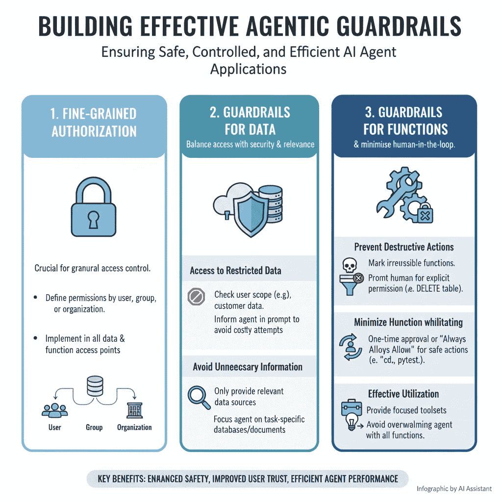

# 如何构建有效代理的防护栏

> 原文：[`towardsdatascience.com/how-to-build-guardrails-for-effective-agents/`](https://towardsdatascience.com/how-to-build-guardrails-for-effective-agents/)

<mdspan datatext="el1760743599765" class="mdspan-comment">AI 代理在许多应用中变得越来越普遍。然而，将代理集成到你的应用中不仅仅是给 LLM 访问所有数据和功能。你还需要构建有效的防护栏，确保代理只能访问相关的数据，并防止功能被滥用。你需要这样做，同时确保模型可以有效地访问必要的数据，并尽可能多地利用功能，而不需要人类在回路中。

我写这篇文章的目标是在高层次上强调如何构建有效的代理防护栏，以确保你的代理只能访问必要的数据，同时保持良好的用户体验，例如，最小化人类批准代理访问的次数。我首先将讨论为什么防护栏如此重要，然后我将进入防护栏的一个关键组成部分：细粒度授权。接下来，我将讨论为你的数据构建防护栏，并继续介绍功能防护栏。

这张信息图表突出了本文的主要主题。我将讨论细粒度授权、数据防护栏和功能防护栏，这些都是讨论 AI 代理防护栏时的关键主题。图片由 Google Gemini 提供。

## 为什么你需要为你的代理设置防护栏

首先，我想描述为什么我们需要为 AI 代理设置防护栏。从理论上讲，你完全可以给代理访问你应用中所有数据库和功能，对吧？

有多个原因说明为什么需要防护栏。主要原因是为了防止代理执行任何不希望的操作，例如删除数据库表。此外，你还需要确保代理只能访问特定范围内的数据，例如，确保一个客户使用的代理不能使用另一个客户的数据。

一些防护栏可以自动设置，并且永远不需要人类介入。数据库访问就是这样一种防护栏，你设置代理操作的范围（例如，在客户内部），并且只允许代理访问该客户的数据。然而，其他防护栏则需要人类交互。想象一下，如果代理想要运行一个命令，我们如何确保代理不会执行破坏性操作（如删除数据库表），并且用户允许该命令？

在这些场景中，我们有一个人类在回路中，代理会请求执行特定操作的许可。如果用户允许，代理可以继续，如果不允许，代理必须决定采取不同的行动。

## 细粒度权限

与代理程序一起工作的一个可能要求是拥有细粒度权限。这意味着你可以轻松地检查某个函数或某些数据是否在某个范围内可用，例如：

+   客户 1 是否有访问数据库表 A 的权限？

+   用户 2 是否有访问函数 B 的权限？

+   组织 3 是否有访问函数 C 的权限？

在你的应用程序中实现细粒度授权至关重要。现在有许多提供商提供这项功能。

当你实现了细粒度授权，你必须将其应用到你的应用程序中的所有函数中，并处理授权被授予和被拒绝的两种情况。例如，如果授权被拒绝，你可能需要添加一条消息，说明你需要向管理员请求特定的访问级别才能执行某些操作。

## 数据的代理护栏

在你实现了细粒度权限之后，我们可以开始讨论围绕你的数据的护栏。重要的是你的代理程序能够尽可能多地访问数据，以有效地回答用户的问题。然后你需要平衡这样一个事实，即代理程序不应该访问受限制的数据，或者获取不需要的信息，这些信息对于回答用户查询不是必要的。

### 受限制数据的访问

对于你的代理程序来说，限制对数据的访问主要取决于细粒度授权。在你的执行数据搜索的函数（数据库查找、桶检索等）中，你应该首先检查用户的访问范围。

此外，你还应该考虑在提示中告知你的代理它可以做什么。如果代理尝试访问数据，但由于任何原因被拒绝访问，这将造成成本，无论是关于令牌使用还是时间上。

### 避免获取不必要的信息

如果你给你的代理程序访问所有数据库表和数据桶的权限，你可能会遇到代理程序有太多选择的问题，这将使得代理程序难以选择正确的文档表和字段。这也是我最近在[关于构建有效代理工具的文章](https://towardsdatascience.com/how-to-build-tools-for-ai-agents/)中讨论过的话题。

为了解决这个问题，我会专注于只向代理程序告知相关信息源。如果你知道某个任务只能使用数据库 A 来解决，你应该考虑只向代理程序告知数据库 A，并将所有其他数据库排除在代理程序的提示之外。当然，这假设你知道哪些数据对于代理程序回答查询可能是相关的。

## 函数的代理护栏

我认为为函数构建代理护栏的话题甚至更有趣。原因是构建这些护栏时需要考虑很多元素：

+   你如何防止破坏性行为？

+   你如何最小化人工干预？

### 你如何防止破坏性行为

函数护栏最重要的子主题是防止破坏性行为。为了解决这个问题，您应该在所有函数上标记它们是否执行 **不可逆操作**。例如

+   删除数据库表是不可逆的（当然，您可以加载备份，但这需要一些工作）

+   从表中读取没有破坏性影响

如果代理执行的是容易恢复的操作（可以通过点击撤销按钮恢复），或者没有破坏性影响的操作，您可能只需允许代理运行该函数。

如果一个函数执行不可逆的操作，那么你应该通知代理，并且如果代理可以执行此操作，可能还需要提示人类用户。

### 如何最小化人工交互

自然地，您想防止破坏性行为。然而，您也不希望因为提示代理是否可以执行操作而过多地打扰用户。

最小化人工交互的一个很好的方法是执行函数白名单，例如 Cursor 为运行终端命令所做的那样：Cursor 第一次想要执行命令时，例如：

+   进入文件夹

+   运行 *pytest 测试*

+   将文件从一个位置移动到另一个位置

光标会提示用户是否允许执行命令。然后您可以选择以下三个选项之一：

+   拒绝请求

+   接受请求（一次性）

+   白名单命令（现在接受请求，并继续）

白名单效果很好，因为您确保用户允许代理运行一个函数或命令，但您不必再为此特定的函数打扰他们。尽管如此，白名单也有一个缺点，即某些命令不能被白名单，因为每次代理建议运行某些函数（如删除数据库表）时，用户都必须审查上下文。

## 结论

在这篇文章中，我讨论了在考虑护栏的情况下如何构建代理应用程序。护栏是必要的，因为您需要确保代理以期望的行为行事，并且不允许执行诸如获取超出访问范围的信息或在没有用户明确许可的情况下执行破坏性操作等行为。我讨论了为您的数据和您提供给代理的功能构建护栏。我相信护栏是构建代理应用程序的重要组成部分，在构建代理应用程序时应该始终牢记。确保有适当的护栏将使您的代理更安全，这是至关重要的，因为如果用户的信任被破坏，将很难恢复用户的信任。

**👉 我的免费资源**

**🚀** [使用 LLMs 提升你的工程能力（免费 3 天电子邮件课程）](https://www.eivindkjosbakken.com/email-course)

📚 [获取我的免费视觉语言模型电子书](https://eivindkjosbakken.com/ebook)

💻 [我的视觉语言模型网络研讨会](https://www.eivindkjosbakken.com/webinar)

**👉 在社交平台上找到我：**

📩 [订阅我的通讯](https://eivindkjosbakken.com/newsletter)

🧑‍💻 [联系我](https://eivindkjosbakken.com/)

🔗 [领英](https://www.linkedin.com/in/eivind-kjosbakken/)

🐦 [X / Twitter](https://x.com/EivindKjos)

✍️ [Medium](https://oieivind.medium.com/)
