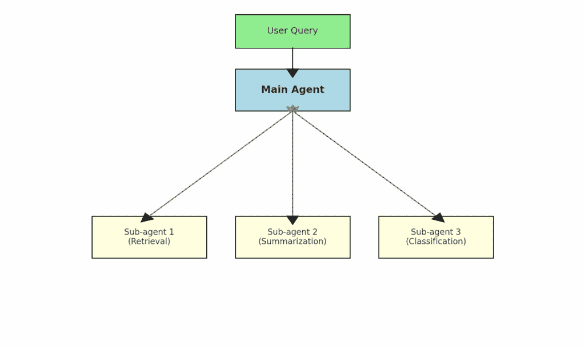

# 如何通过上下文工程优化问答管道

> 原文：[`towardsdatascience.com/how-to-context-engineer-to-optimize-question-answering-pipelines/`](https://towardsdatascience.com/how-to-context-engineer-to-optimize-question-answering-pipelines/)

<mdspan datatext="el1757028037019" class="mdspan-comment">我相信上下文</mdspan>工程是当前机器学习中最相关的话题之一，这就是我撰写关于这个主题的第三篇文章的原因。我的目标是扩大我对 LLM 上下文工程的理解，并通过我的文章分享这些知识。

在今天的文章中，我将讨论如何改进你为问答输入到 LLM 中的上下文。通常，这种上下文基于检索增强生成（RAG），然而，在今天的不断变化的环境中，这种方法应该得到更新。

> 🆕 "RAG 已死，上下文工程为王"[`t.co/CUxBNvAuqi`](https://t.co/CUxBNvAuqi)
> 
> 我们询问了[@jeffreyhuber](https://twitter.com/jeffreyhuber?ref_src=twsrc%5Etfw)关于今天[@trychroma](https://twitter.com/trychroma?ref_src=twsrc%5Etfw)云服务的重大发布，上下文工程的演变以及为什么你应该关注你的数据（感谢[@HamelHusain](https://twitter.com/HamelHusain?ref_src=twsrc%5Etfw) [@jxnlco](https://twitter.com/jxnlco?ref_src=twsrc%5Etfw)）。
> 
> 以下 YouTube 播客的完整链接 [`t.co/1UH0nlbkbc`](https://t.co/1UH0nlbkbc) [pic.twitter.com/iV2ZlSoUdP](https://t.co/iV2ZlSoUdP)
> 
> — Latent.Space (@latentspacepod) [2025 年 8 月 20 日](https://twitter.com/latentspacepod/status/1957960303016333348?ref_src=twsrc%5Etfw)

Chroma（一家矢量数据库提供商）的联合创始人发推文称 RAG 已死。我并不完全同意我们不再使用 RAG，但他的推文突出了在填充你的 LLM 上下文时存在不同的选择。

你还可以阅读我之前关于上下文工程的文章：

1.  [基本上下文工程技术](https://eivindkjosbakken.com/2025/08/25/1347/)[s](https://towardsdatascience.com/how-to-significantly-enhance-llms-by-leveraging-context-engineering-2/)

1.  [高级上下文工程技术](https://towardsdatascience.com/how-to-create-powerful-llm-applications-with-context-engineering/)

## 目录

+   为什么你应该关注上下文工程

+   传统的问答方法

+   改进 RAG 上下文检索

    +   减少无关标记的数量

        +   重排序

        +   摘要

        +   提示 GPT

    +   添加相关文档

        +   更好的嵌入模型

        +   搜索更多文档

+   代理搜索方法

+   其他上下文工程方面

+   结论

## 为什么你应该关注上下文工程

首先，让我强调三个你应该关注上下文工程的关键点：

+   通过避免[上下文退化](https://research.trychroma.com/context-rot)来提高输出**质量**。减少不必要的标记可以提高输出质量。你可以在[这篇文章](https://eval.16x.engineer/blog/llm-context-management-guide?utm_source=tldrai)中了解更多细节。

+   **更便宜**（不发送不必要的标记，它们会花钱）

+   **速度**（标记越少，响应时间越快）

这些是大多数问答系统的三个核心指标。输出质量自然是首要考虑的，因为用户不会希望使用性能低下的系统。

此外，价格始终应该是一个考虑因素，如果你可以降低它（而不需要太多的工程成本），那么做出这样的决定很简单。最后，一个更快的问答系统可以提供更好的用户体验。你不想让用户等待数秒才能得到回复，而 ChatGPT 会更快地做出回应。

## 传统的问答方法

在这个意义上，传统意味着在 ChatGPT[发布后](https://help.openai.com/en/articles/6825453-chatgpt-release-notes)构建的系统中最常见的问答方法。这个系统是传统的 RAG，它的工作方式如下：

1.  使用向量相似度检索获取与用户问题最相关的文档

1.  将相关文档与问题一起输入到 LLM 中，并接收回应

考虑到其简单性，这种方法效果非常好。有趣的是，我们还在另一种传统方法中看到了这种情况。[BM25 自 1994 年以来一直存在](https://www.cs.cornell.edu/courses/cs630/2006sp/guides/lec6.kr.pdf?)，例如，最近在 Anthropic 推出[上下文检索](https://www.anthropic.com/news/contextual-retrieval)时被使用，证明了即使是简单的信息检索技术也是多么有效。

然而，通过更新你的 RAG 并使用我在下一节中描述的一些技术，你仍然可以极大地改进你的问答系统。

## 改进 RAG 上下文检索

尽管 RAG 相对有效，但你很可能会通过引入我在本节中讨论的技术来获得更好的性能。我这里描述的所有技术都集中在改进你提供给 LLM 的上下文上。你可以通过两种主要方法来改进这个上下文：

1.  在不相关上下文中使用更少的标记（例如，从相关文档中删除或使用较少的材料）

1.  添加相关文档

因此，你应该专注于实现上述目标之一。如果你从[精确度和召回率](https://developers.google.com/machine-learning/crash-course/classification/accuracy-precision-recall)的角度思考：

1.  提高精确度（以召回率为代价）

1.  提高召回率（以精确度为代价）

这是在进行问答系统上下文工程时你必须做出的权衡。

### 减少无关标记的数量

在本节中，我强调三种主要方法来减少你输入到 LLMs 上下文中的无关标记数量：

+   重新排序

+   摘要

+   提示 GPT

当从向量相似度搜索中获取文档时，它们是按照最相关到最不相关的顺序返回的，给定向量相似度分数。然而，这个相似度分数可能无法准确代表哪些文档是最相关的。

**重新排序**

因此，你可以使用重新排序模型，例如，[Qwen 重新排序器](https://huggingface.co/Qwen/Qwen3-Reranker-8B)，来重新排序文档块。然后你可以选择只保留最相关的 X 个文档块（根据重新排序器的结果），这应该会从你的上下文中移除一些无关的文档。

**摘要**

你也可以选择摘要文档，减少每个文档使用的标记数量。例如，你可以保留从获取的前 10 个最相似文档中的完整文档，摘要排名第 11-20 的文档，并丢弃其余的文档。

这种方法将增加你保留相关文档完整上下文的概率，同时至少保留一些来自不太可能相关的文档的上下文（摘要）。

**提示 GPT**

最后，你也可以提示 GPT 判断获取的文档是否与用户查询相关。例如，如果你获取了 15 个文档，你可以进行 15 次单独的 LLM 调用来判断每个文档是否相关。然后丢弃被认为不相关的文档。请注意，这些 LLM 调用需要并行化以将响应时间保持在可接受的范围内。

### 添加相关文档

在移除无关文档之前或之后，你也要确保包括相关文档。我在本小节中包括两种主要方法：

+   更好的嵌入模型

+   在更多文档中进行搜索（以降低精度为代价）

**更好的嵌入模型**

要找到最佳的嵌入模型，你可以访问 [HuggingFace 嵌入模型排行榜](https://huggingface.co/spaces/mteb/leaderboard)，截至本文撰写时，Gemini 和 Qwen 排名前三。更新你的嵌入模型通常是一种便宜的方法来获取更多相关文档。这是因为运行和存储嵌入通常很便宜，例如，通过 [Gemini API](https://ai.google.dev/gemini-api/docs/embeddings) 进行嵌入，以及在 [Pinecone](https://www.pinecone.io/) 中存储向量。

**搜索更多文档**

另一种（相对简单）的方法来获取更多相关文档是获取更多的文档。获取更多文档自然会增加你添加相关文档的概率。然而，你必须平衡这一点，以避免上下文过时并尽可能减少无关文档的数量。在 LLM 调用中，每个不必要的标记，如前所述，很可能会：

+   降低输出质量

+   增加成本

+   降低速度

这些都是问答系统的关键方面。

## 代理搜索方法

我在之前的文章中讨论了代理搜索方法，例如，当我讨论[扩展你的 AI 搜索](https://towardsdatascience.com/how-to-scale-your-ai-search-to-handle-10m-queries-with-5-powerful-techniques/)时。然而，在本节中，我将更深入地探讨设置代理搜索，这将在你的 RAG 中替换一些或所有向量检索步骤。

第一步是用户向一组给定的数据点提供他们的问题，例如，一组文档。然后你设置一个由一个乐队代理和一系列子代理组成的代理系统。

此图突出了 LLM 代理的乐队系统。主要代理接收用户查询并将任务分配给子代理。图由 ChatGPT 提供。

这是代理将遵循的管道示例（尽管有许多设置方法）。

1.  乐队代理告诉两个子代理遍历所有文档文件名并返回相关文档

1.  相关文档被反馈给乐队代理，乐队代理再次向每个相关文档释放一个子代理，以获取与用户问题相关的文档的子部分（片段）。然后这些片段被反馈给乐队代理。

1.  乐队代理根据提供的片段回答用户的问题。

你可以实施另一种流程，例如存储文档嵌入，并用用户问题与每个文档之间的向量相似度替换第一步。

这种代理方法有优点和缺点。

**优点：**

+   比传统 RAG 有更高的机会获取相关的片段

+   对 RAG 系统有更多的控制。你可以在 RAG 相对静态的嵌入相似度的情况下更新系统提示等。

**缺点：**

+   这需要大量的 LLM 调用。在[他们关于构建多代理系统的文章中，Anthropic](https://www.anthropic.com/engineering/multi-agent-research-system)指出，单代理系统使用的 token 是单次 LLM 调用的 4 倍，而多代理系统使用的是 15 倍！

在我看来，构建这样的基于代理的检索系统是一种超级强大的方法，可以带来惊人的结果。在构建这样的系统时，你必须考虑的是，你将（很可能）看到的提高的质量是否值得成本的增加。

## 其他上下文工程方面

在这篇文章中，我主要介绍了我们在问答系统中获取的文档的上下文工程。然而，还有其他你应该注意的方面，主要是：

+   你正在使用的系统/用户提示

+   其他信息被输入到提示中

你为问答系统编写的提示应该精确、结构化，并避免无关信息。你可以阅读许多关于结构化提示的文章，通常你可以要求 LLM 改进这些提示的方面。

有时，你也会将其他信息输入到你的提示中。一个常见的例子是输入元数据，例如，涵盖用户信息的数据，例如：

+   姓名

+   职位

+   他们通常搜索的内容

+   等等

每次你添加此类信息时，你应该总是问自己：

> 修改这些信息是否有助于我的问答系统回答问题？

有时答案是肯定的，有时则是否定的。最重要的是，你在提示中是否需要这些信息已经做出了合理的决定。如果你无法证明在提示中包含这些信息是合理的，通常应该将其删除。

## 结论

在这篇文章中，我讨论了为你的问答系统进行上下文工程的重要性，以及为什么它很重要。问答系统通常包括一个初始步骤来获取相关信息。对这个信息的关注应该减少无关标记的数量到最小，同时尽可能包含尽可能多的相关信息。

**👉 我的免费电子书和网络研讨会：**

📚 [获取我的免费视觉语言模型电子书](https://eivindkjosbakken.com/ebook)

💻 [我的视觉语言模型网络研讨会](https://www.eivindkjosbakken.com/webinar)

**👉 在社交平台上找到我：**

📩 [订阅我的通讯](https://eivindkjosbakken.com/newsletter)

🧑‍💻 [联系我](https://eivindkjosbakken.com/)

🔗 [LinkedIn](https://www.linkedin.com/in/eivind-kjosbakken/)

🐦 [X / Twitter](https://x.com/EivindKjos)

✍️ [Medium](https://oieivind.medium.com/)
