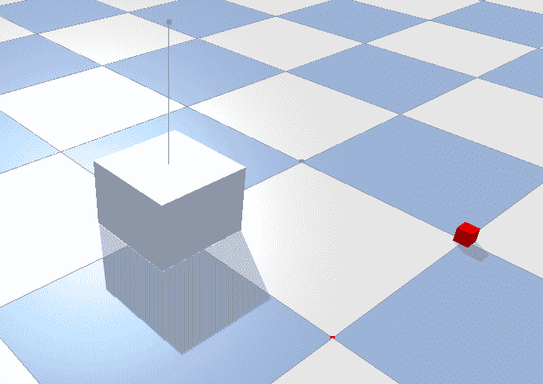
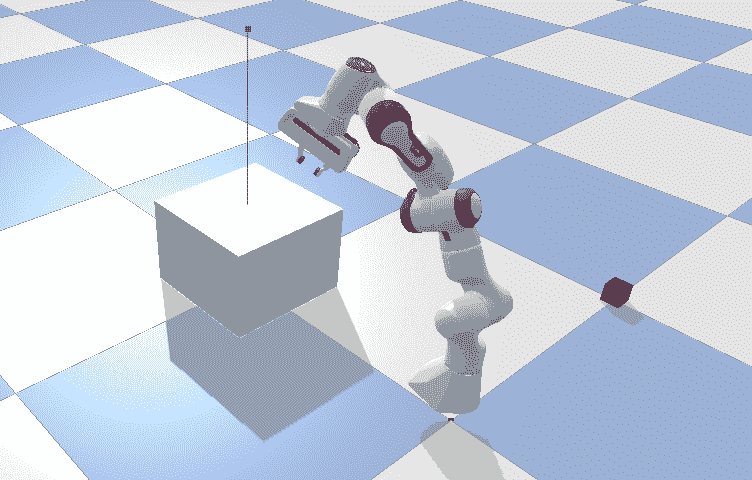
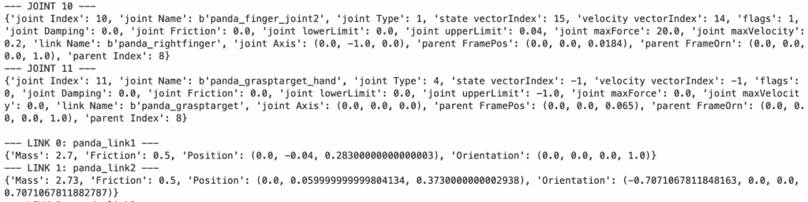
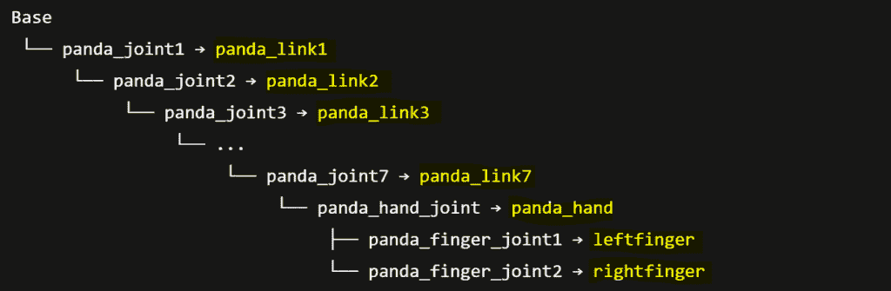
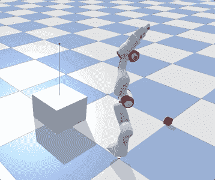
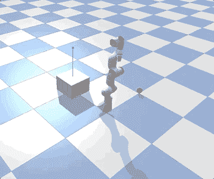
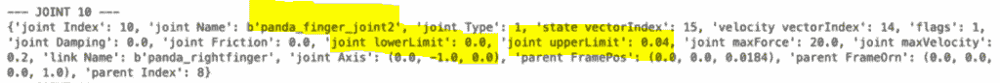
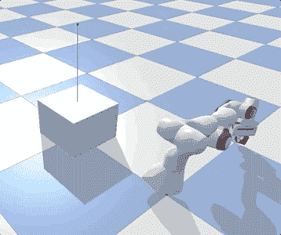
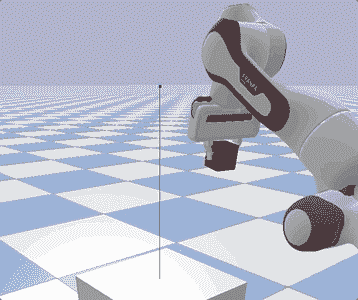
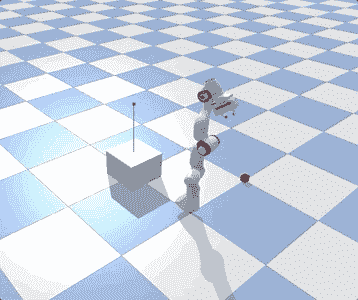

# 如何用 Python 控制机器人

> 原文：[`towardsdatascience.com/how-to-control-a-robot-with-python/`](https://towardsdatascience.com/how-to-control-a-robot-with-python/)

## <mdspan datatext="el1761182642043" class="mdspan-comment">简介</mdspan>

*[**PyBullet**](https://pybullet.org/)*是由 Facebook 创建的开源模拟平台，旨在为 3D 环境中训练物理代理（如机器人）提供物理引擎。它为刚性和软体都提供了物理引擎。它通常用于机器人技术、人工智能和游戏开发。

**[机器人臂](https://en.wikipedia.org/wiki/Robotic_arm)**因其速度、精度以及在危险环境中的工作能力而非常受欢迎。它们用于焊接、组装和物料处理等任务，尤其是在工业环境中（如制造）。

机器人执行任务有两种方式：

+   **手动控制** – 需要人类明确编程每个动作。更适合固定任务，但难以处理不确定性，并且需要对每个新场景进行繁琐的参数调整。

+   **人工智能** – 允许机器人通过试错学习最佳行动以实现目标。因此，它可以通过学习奖励和惩罚来适应不断变化的环境，而不需要预定义的计划（[强化学习](https://en.wikipedia.org/wiki/Reinforcement_learning)）。

在这篇文章中，我将展示如何使用*PyBullet***构建一个用于手动控制机器人臂的 3D 环境**。我将展示一些可以轻松应用于其他类似情况的实用 Python 代码（只需复制、粘贴、运行），并逐行代码进行注释，以便您可以复制此示例。

## 设置

*PyBullet*可以通过以下命令之一轻松安装（如果*pip*失败，*conda*应该肯定可以工作）：

```py
pip install pybullet

conda install -c conda-forge pybullet
```

*PyBullet*附带一系列预设的**URDF 文件**（统一机器人描述格式），这些是 XML 模式，描述了 3D 环境中物体的物理结构（例如立方体、球体、机器人）。

```py
import pybullet as p
import pybullet_data
import time

## setup
p.connect(p.GUI)
p.resetSimulation()
p.setGravity(gravX=0, gravY=0, gravZ=-9.8)
p.setAdditionalSearchPath(path=pybullet_data.getDataPath())

## load URDF
plane = p.loadURDF("plane.urdf")

cube = p.loadURDF("cube.urdf", basePosition=[0,0,0.1], globalScaling=0.5, useFixedBase=True)

obj = p.loadURDF("cube_small.urdf", basePosition=[1,1,0.1], globalScaling=1.5)
p.changeVisualShape(objectUniqueId=obj, linkIndex=-1, rgbaColor=[1,0,0,1]) #red

while p.isConnected():
    p.setRealTimeSimulation(True)
```



让我们来看看上面的代码：

+   当你可以连接到物理引擎时，你需要指定是否要打开**图形界面**(`p.GUI`)或者不打开(`p.DIRECT`)。

+   卡尔丹空间有**3 个维度**：x 轴（向前/向后），y 轴（左/右），z 轴（上/下）。

+   将**重力**设置为`(x=0, y=0, z=-9.8)`以模拟[地球的重力](https://en.wikipedia.org/wiki/Gravity_of_Earth)是一种常见的做法，但可以根据模拟的目标进行更改。

+   通常，你需要**导入一个平面**来创建地面，否则物体将无限期地落下。如果你想将物体固定到地板上，则设置`useFixedBase=True`（默认为*False*）。我用`basePosition=[0,0,0.1]`导入物体，这意味着它们距离地面 10 厘米。

+   模拟可以通过`p.setRealTimeSimulation(True)`以**实时**渲染，或者通过`p.stepSimulation()`更快（CPU 时间）渲染。设置实时渲染的另一种方法是：

```py
import time

for _ in range(240):   #240 timestep commonly used in videogame development
    p.stepSimulation() #add a physics step (CPU speed = 0.1 second)
    time.sleep(1/240)  #slow down to real-time (240 steps × 1/240 second sleep = 1 second)
```

## 机器人

目前，我们的 3D 环境由一个小物体（微小的红色立方体）和一个固定在地面上（平面）的桌子（大立方体）组成。我将添加一个**机械臂**，其任务是从较小的物体中取出并放在桌子上。

*PyBullet*有一个默认的仿生机械臂，其模型基于[Franka Panda 机器人](https://robodk.com/robot/Franka/Emika-Panda)。

```py
robo = p.loadURDF("franka_panda/panda.urdf", 
                   basePosition=[1,0,0.1], useFixedBase=True)
```



首先要做的是分析机器人的**连接**（固体部分）和**关节**（两个刚性部分之间的连接）。为此，你可以直接使用`p.DIRECT`，因为不需要图形界面。

```py
import pybullet as p
import pybullet_data

## setup
p.connect(p.DIRECT)
p.resetSimulation()
p.setGravity(gravX=0, gravY=0, gravZ=-9.8)
p.setAdditionalSearchPath(path=pybullet_data.getDataPath())

## load URDF
robo = p.loadURDF("franka_panda/panda.urdf", 
                  basePosition=[1,0,0.1], useFixedBase=True)

## joints
dic_info = {
    0:"joint Index",  #starts at 0
    1:"joint Name",
    2:"joint Type",  #0=revolute (rotational), 1=prismatic (sliding), 4=fixed
    3:"state vectorIndex",
    4:"velocity vectorIndex",
    5:"flags",  #nvm always 0
    6:"joint Damping",  
    7:"joint Friction",  #coefficient
    8:"joint lowerLimit",  #min angle
    9:"joint upperLimit",  #max angle
    10:"joint maxForce",  #max force allowed
    11:"joint maxVelocity",  #max speed
    12:"link Name",  #child link connected to this joint
    13:"joint Axis",
    14:"parent FramePos",  #position
    15:"parent FrameOrn",  #orientation
    16:"parent Index"  #−1 = base
}
for i in range(p.getNumJoints(bodyUniqueId=robo)):
    joint_info = p.getJointInfo(bodyUniqueId=robo, jointIndex=i)
    print(f"--- JOINT {i} ---")
    print({dic_info[k]:joint_info[k] for k in dic_info.keys()})

## links
for i in range(p.getNumJoints(robo)):
    link_name = p.getJointInfo(robo, i)[12].decode('utf-8')  #field 12="link Name"
    dyn = p.getDynamicsInfo(robo, i)
    pos, orn, *_ = p.getLinkState(robo, i)
    dic_info = {"Mass":dyn[0], "Friction":dyn[1], "Position":pos, "Orientation":orn}
    print(f"--- LINK {i}: {link_name} ---")
    print(dic_info)
```



每个机器人都有一个“**基座**”，这是其身体的根部，连接着一切（就像我们的脊柱骨骼）。查看上述代码的输出，我们知道机械臂有 12 个关节和 12 个连接。它们是这样连接的：



## 运动控制

为了让机器人做某事，你必须移动它的关节。有 3 种主要的控制类型，它们都是牛顿运动定律的应用：

+   **位置控制**：基本上，你告诉机器人“去这里”。技术上，你设置一个**目标位置**，然后施加力逐渐将关节从当前位置移动到目标。随着它越来越接近，施加的力会减小以避免超调，并最终与阻力（即摩擦力、重力）完美平衡，使关节稳定地保持在原地。

+   **速度** **控制**：基本上，你告诉机器人“以这个速度移动”。技术上，你设置一个**目标速度**，并施加力逐渐将速度从零增加到目标，然后通过平衡施加的力和阻力（即摩擦力、重力）来维持它。

+   **力/扭矩** **控制**：基本上，你“推动机器人并看看会发生什么”。技术上，你直接设置关节施加的力，而结果运动完全取决于物体的质量、惯性和环境。顺便提一下，在物理学中，“**力**”这个词用于线性运动（推/拉），而“**扭矩**”表示旋转运动（扭转/转动）。

我们可以使用`p.setJointMotorControl2()`来移动单个关节，使用`p.setJointMotorControlArray()`同时施加力到多个关节。例如，我将通过为每个机械臂关节提供一个随机目标来执行位置控制。

```py
## setup
p.connect(p.GUI)
p.resetSimulation()
p.setGravity(gravX=0, gravY=0, gravZ=-9.8)
p.setAdditionalSearchPath(path=pybullet_data.getDataPath())

## load URDF
plane = p.loadURDF("plane.urdf")
cube = p.loadURDF("cube.urdf", basePosition=[0,0,0.1], globalScaling=0.5, useFixedBase=True)
robo = p.loadURDF("franka_panda/panda.urdf", basePosition=[1,0,0.1], useFixedBase=True)
obj = p.loadURDF("cube_small.urdf", basePosition=[1,1,0.1], globalScaling=1.5)
p.changeVisualShape(objectUniqueId=obj, linkIndex=-1, rgbaColor=[1,0,0,1]) #red

## move arm
joints = [0,1,2,3,4,5,6]
target_positions = [1,1,1,1,1,1,1] #<--random numbers
p.setJointMotorControlArray(bodyUniqueId=robo, jointIndices=joints,
                            controlMode=p.POSITION_CONTROL,
                            targetPositions=target_positions,
                            forces=[50]*len(joints))
for _ in range(240*3):
    p.stepSimulation()
    time.sleep(1/240)
```



真正的问题是，“**每个关节的正确目标位置是什么？**” 答案是[逆运动学](https://en.wikipedia.org/wiki/Inverse_kinematics)，这是一种数学过程，用于计算将机器人放置在相对于起始点的给定位置和方向所需的参数。每个关节定义一个角度，你不想手动猜测多个关节角度。因此，我们将请求 *PyBullet* 使用 `p.calculateInverseKinematics()` 计算笛卡尔空间中的目标位置。

```py
obj_position, _ = p.getBasePositionAndOrientation(obj)
obj_position = list(obj_position)

target_positions = p.calculateInverseKinematics(
    bodyUniqueId=robo,
    endEffectorLinkIndex=11, #grasp-target link
    targetPosition=[obj_position[0], obj_position[1], obj_position[2]+0.25], #25cm above object
    targetOrientation=p.getQuaternionFromEuler([0,-3.14,0]) #[roll,pitch,yaw]=[0,-π,0] -> hand pointing down
)

arm_joints = [0,1,2,3,4,5,6]
p.setJointMotorControlArray(bodyUniqueId=robo, controlMode=p.POSITION_CONTROL,
                            jointIndices=arm_joints,
                            targetPositions=target_positions[:len(arm_joints)],
                            forces=[50]*len(arm_joints))
```



请注意，我使用了 `p.getQuaternionFromEuler()` 将 3D 角度（对人类来说更容易理解）转换为 4D[四元数](https://en.wikipedia.org/wiki/Conversion_between_quaternions_and_Euler_angles)，因为“**四元数**”对物理引擎来说更容易计算。如果你想更专业一点，在一个[四元数 *(x, y, z, w)*](https://en.wikipedia.org/wiki/Quaternions_and_spatial_rotation)中，前三个分量描述了旋转轴，而第四个维度编码了旋转量（*cos*/*sin*）。

上述代码命令机器人使用逆运动学将其手移动到物体上方的一个特定位置。我们使用 `p.getBasePositionAndOrientation()` 抓取世界中小红方块的位置，并使用这些信息来计算关节的目标位置。

## 与物体交互

机器人手臂有一个手（“抓手”），因此它可以打开和关闭以抓取物体。从之前的分析中，我们知道“手指”可以在（0-0.04）范围内移动。因此，你可以将目标位置设置为下限（**手闭合**）或上限（**手打开**）。



此外，我还要确保在移动时手臂能够握住那个小红方块。你可以使用 `p.createConstraint()` 在机器人的抓手和物体之间建立一个**临时的物理连接**，这样它就会和机器人手一起移动。在现实世界中，抓手会通过摩擦力和接触力施加力来挤压物体，防止其掉落。但是，由于 *PyBullet* 是一个非常简单的模拟器，我将采取这个捷径。

```py
## close hand
p.setJointMotorControl2(bodyUniqueId=robo, controlMode=p.POSITION_CONTROL,
                        jointIndex=9, #finger_joint1
                        targetPosition=0, #lower limit for finger_joint1
                        force=force)
p.setJointMotorControl2(bodyUniqueId=robo, controlMode=p.POSITION_CONTROL,
                        jointIndex=10, #finger_joint2
                        targetPosition=0, #lower limit for finger_joint2
                        force=force)

## hold the object
constraint = p.createConstraint(
    parentBodyUniqueId=robo,
    parentLinkIndex=11,
    childBodyUniqueId=obj,
    childLinkIndex=-1,
    jointType=p.JOINT_FIXED,
    jointAxis=[0,0,0],
    parentFramePosition=[0,0,0],
    childFramePosition=[0,0,0,1]
)
```

然后，我们可以使用之前相同的方法移动手臂，即逆运动学 -> 目标位置 -> 位置控制。



最后，当机器人到达笛卡尔空间中的目标位置时，我们可以打开手并释放物体与手臂之间的约束。

```py
## close hand
p.setJointMotorControl2(bodyUniqueId=robo, controlMode=p.POSITION_CONTROL,
                        jointIndex=9, #finger_joint1
                        targetPosition=0.04, #upper limit for finger_joint1
                        force=force)
p.setJointMotorControl2(bodyUniqueId=robo, controlMode=p.POSITION_CONTROL,
                        jointIndex=10, #finger_joint2
                        targetPosition=0.04, #upper limit for finger_joint2
                        force=force)

## drop the obj
p.removeConstraint(constraint)
```



## 全手动控制

在 *PyBullet* 中，你需要为机器人采取的每个动作渲染模拟。因此，有一个可以加快（即 *sec=0.1*）或减慢（即 *sec=2*）实时速度（*sec=1*）的实用函数是很方便的。

```py
import pybullet as p
import time

def render(sec=1):
    for _ in range(int(240*sec)):
        p.stepSimulation()
        time.sleep(1/240)
```

这是本文中我们进行的模拟的完整代码。

```py
import pybullet_data

## setup
p.connect(p.GUI)
p.resetSimulation()
p.setGravity(gravX=0, gravY=0, gravZ=-9.8)
p.setAdditionalSearchPath(path=pybullet_data.getDataPath())

plane = p.loadURDF("plane.urdf")
cube = p.loadURDF("cube.urdf", basePosition=[0,0,0.1], globalScaling=0.5, useFixedBase=True)
robo = p.loadURDF("franka_panda/panda.urdf", basePosition=[1,0,0.1], globalScaling=1.3, useFixedBase=True)
obj = p.loadURDF("cube_small.urdf", basePosition=[1,1,0.1], globalScaling=1.5)
p.changeVisualShape(objectUniqueId=obj, linkIndex=-1, rgbaColor=[1,0,0,1])

render(0.1)
force = 100

## open hand
print("### open hand ###")
p.setJointMotorControl2(bodyUniqueId=robo, controlMode=p.POSITION_CONTROL,
                        jointIndex=9, #finger_joint1
                        targetPosition=0.04, #upper limit for finger_joint1
                        force=force)
p.setJointMotorControl2(bodyUniqueId=robo, controlMode=p.POSITION_CONTROL,
                        jointIndex=10, #finger_joint2
                        targetPosition=0.04, #upper limit for finger_joint2
                        force=force)
render(0.1)
print(" ")

## move arm
print("### move arm ### ")
obj_position, _ = p.getBasePositionAndOrientation(obj)
obj_position = list(obj_position)

target_positions = p.calculateInverseKinematics(
    bodyUniqueId=robo,
    endEffectorLinkIndex=11, #grasp-target link
    targetPosition=[obj_position[0], obj_position[1], obj_position[2]+0.25], #25cm above object
    targetOrientation=p.getQuaternionFromEuler([0,-3.14,0]) #[roll,pitch,yaw]=[0,-π,0] -> hand pointing down
)
print("target position:", target_positions)

arm_joints = [0,1,2,3,4,5,6]
p.setJointMotorControlArray(bodyUniqueId=robo, controlMode=p.POSITION_CONTROL,
                            jointIndices=arm_joints,
                            targetPositions=target_positions[:len(arm_joints)],
                            forces=[force/3]*len(arm_joints))

render(0.5)
print(" ")

## close hand
print("### close hand ###")
p.setJointMotorControl2(bodyUniqueId=robo, controlMode=p.POSITION_CONTROL,
                        jointIndex=9, #finger_joint1
                        targetPosition=0, #lower limit for finger_joint1
                        force=force)
p.setJointMotorControl2(bodyUniqueId=robo, controlMode=p.POSITION_CONTROL,
                        jointIndex=10, #finger_joint2
                        targetPosition=0, #lower limit for finger_joint2
                        force=force)
render(0.1)
print(" ")

## hold the object
print("### hold the object ###")
constraint = p.createConstraint(
    parentBodyUniqueId=robo,
    parentLinkIndex=11,
    childBodyUniqueId=obj,
    childLinkIndex=-1,
    jointType=p.JOINT_FIXED,
    jointAxis=[0,0,0],
    parentFramePosition=[0,0,0],
    childFramePosition=[0,0,0,1]
)
render(0.1)
print(" ")

## move towards the table
print("### move towards the table ###")
cube_position, _ = p.getBasePositionAndOrientation(cube)
cube_position = list(cube_position)

target_positions = p.calculateInverseKinematics(
    bodyUniqueId=robo,
    endEffectorLinkIndex=11, #grasp-target link
    targetPosition=[cube_position[0], cube_position[1], cube_position[2]+0.80], #80cm above the table
    targetOrientation=p.getQuaternionFromEuler([0,-3.14,0]) #[roll,pitch,yaw]=[0,-π,0] -> hand pointing down
)
print("target position:", target_positions)

arm_joints = [0,1,2,3,4,5,6]
p.setJointMotorControlArray(bodyUniqueId=robo, controlMode=p.POSITION_CONTROL,
                            jointIndices=arm_joints,
                            targetPositions=target_positions[:len(arm_joints)],
                            forces=[force*3]*len(arm_joints))
render()
print(" ")

## open hand and drop the obj
print("### open hand and drop the obj ###")
p.setJointMotorControl2(bodyUniqueId=robo, controlMode=p.POSITION_CONTROL,
                        jointIndex=9, #finger_joint1
                        targetPosition=0.04, #upper limit for finger_joint1
                        force=force)
p.setJointMotorControl2(bodyUniqueId=robo, controlMode=p.POSITION_CONTROL,
                        jointIndex=10, #finger_joint2
                        targetPosition=0.04, #upper limit for finger_joint2
                        force=force)
p.removeConstraint(constraint)
render()
```



## 结论

本文是一篇关于如何**手动控制机械臂**的教程。我们学习了运动控制、逆运动学、抓取和移动物体。将会有更多关于更高级机器人的新教程。

本文章的完整代码：**[GitHub](https://github.com/mdipietro09/RoboticsPy)**

希望您喜欢这篇文章！如有任何问题或反馈，请随时联系我，或者只是分享您有趣的项目。

👉 [**让我们连接**](https://maurodp.carrd.co/) 👈


[^((所有图片均为作者所有，除非另有说明))]
