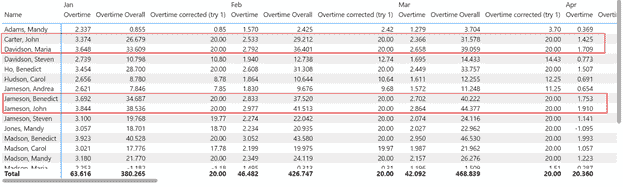
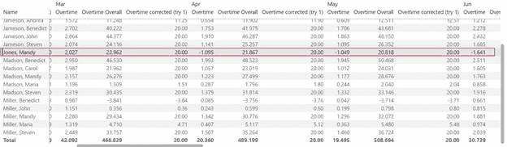
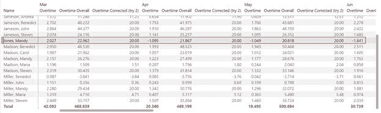
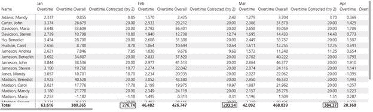
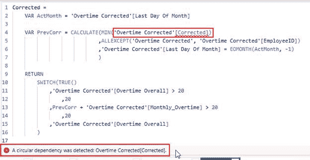
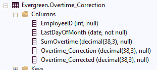
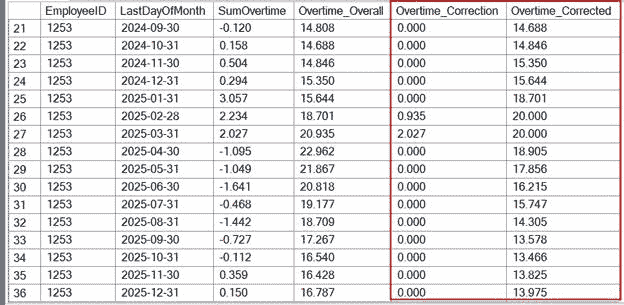
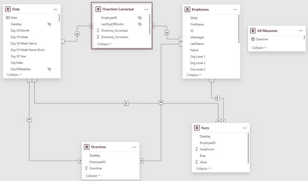
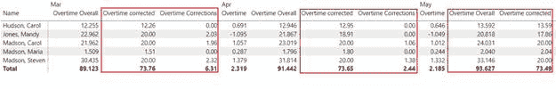

# 如何在 DAX（和 SQL）中正确应用结果限制

> 原文：[`towardsdatascience.com/how-to-correctly-apply-limits-on-the-result-in-dax-and-sql/`](https://towardsdatascience.com/how-to-correctly-apply-limits-on-the-result-in-dax-and-sql/)

## 简介

<mdspan datatext="el1755541242905" class="mdspan-comment">几天前</mdspan>，我的一个客户问我以下问题：

*我的公司对每个员工可以累积的加班余额施加限制。这个限制总共是 20 小时。

如果员工超过这个限制，超过 20 小时的加班将被减少。

*我如何在 Power BI 中计算这个？*


图片由 [Glenn Villas](https://unsplash.com/@glennvillas?utm_content=creditCopyText&utm_medium=referral&utm_source=unsplash) 在 [Unsplash](https://unsplash.com/photos/a-red-off-limit-sign-hanging-from-a-rope-Z5jO59eYuqM?utm_content=creditCopyText&utm_medium=referral&utm_source=unsplash) 上提供

这听起来像是一项简单的工作。

添加一个度量，检查加班总额是否超过 20，如果是，则返回 20。这难道不是正确的吗？

## 让我们尝试一个 DAX 度量

首先，我们必须创建一个度量，将自时间开始以来的所有加班加起来，以计算总余额：

```py
Overtime Overall =
    VAR FirstOT = CALCULATE(FIRSTNONBLANK('Date'[Date]
                                ,[Overtime])
                            ,REMOVEFILTERS('Date')
                            )

    VAR MaxDate = MAX('Date'[Date])

RETURN
    CALCULATE([Overtime]
            ,REMOVEFILTERS('Date')
            ,DATESBETWEEN('Date'[Date], FirstOT, MaxDate)
            )
```

第二，我们创建一个度量来将上限设置为 20：

```py
Overtime corrected (try 1) =
    VAR OvertimeOverall = [Overtime Overall]

RETURN
    IF(OvertimeOverall > 20, 20, OvertimeOverall)
```

让我们看看结果：



图 1 – 解决挑战的第一种方法的成果（图由作者绘制）

看起来是正确的。

仔细检查结果后，我们发现它们没有正确相加。

看看 Mandy Jones（名字是虚构的）：



图 2 – Mandy Jones 的结果，我们可以看到结果没有正确相加（图由作者绘制）

从 4 月份开始，她减少了工作时间以减少加班余额。

但度量 [Overtime Overall] 仍然在 4 月份显示超过 20 小时，尽管 3 月份已经进行了修正。

这是不正确的。

度量 [Overtime Overall] 必须考虑这些修正。

此外，总数是错误的。因为总数总是高于 20，所以它也会显示 20。

## 计算的目标

在我们继续之前，我们必须定义要求以确定需要做什么。

首先，结果必须只显示在月度级别。

第二，如上所述，结果必须反映前一个月（s）所做的修正。

第三，我们必须能够看到每个月所做的修正。

## 尝试一个 DAX 方法

好的，当我们为度量中的每个员工预先计算一个表并据此修正值时会发生什么：

```py
Overtime Corrected (try 2) =
    VAR ActEmpId = SELECTEDVALUE('Overtime'[EmployeeID])

    VAR EmpsByMonth =
        CALCULATETABLE(
            SUMMARIZECOLUMNS(
                    'Overtime'[EmployeeID]
                    ,'Date'[Last Day Of Month]
                    ,"OvertimeCorrected", IF([Overtime Overall] > 20.0, 20.0, [Overtime Overall])
                )
                ,'Overtime'[EmployeeID] = ActEmpId
                )

    RETURN
        SUMX(EmpsByMonth, [OvertimeCorrected])
```

添加的过滤器 [CALCULATETABLE()](https://dax.guide/calculatetable/) 是必要的，以减少 [SUMMARIZECOLUMNS()](https://dax.guide/summarizecolumns/) 生成的表的大小。



图 3 – Mandy Jones 的第二种度量结果的第二次结果（图由作者绘制）

如您所见，结果是一致的，因为度量仍然没有考虑前几个月的校正。

有趣的是，总数是空的。

原因是 SELECTEDVALUE() 不返回任何内容，因此没有可以计算的东西。

我可以通过使用 [VALUES()](https://dax.guide/values/) 来解决这个问题：

```py
Overtime Corrected (try 2) =
    VAR ActEmpId = VALUES('Overtime'[EmployeeID])

    VAR EmpsByMonth =
        CALCULATETABLE(
            SUMMARIZECOLUMNS(
                    'Overtime'[EmployeeID]
                    ,'Date'[Last Day Of Month]
                    ,"OvertimeCorrected", IF([Overtime Overall] > 20.0, 20.0, [Overtime Overall])
                )
                ,'Overtime'[EmployeeID] IN ActEmpId
                )

    RETURN
        SUMX(EmpsByMonth, [OvertimeCorrected])
```

这里是带有正确总量的结果：



图 4 – 使用 VALUES() 添加正确的总行结果（图由作者提供）

但是，这种方法扩展性不好，因为度量必须为计算期间的所有员工生成表。

对于 63 名员工来说，我的数据是这样的，但是如果有成百上千名员工，情况就不同了。

然而，核心问题仍然存在：如何在保持正确总量的同时，为每个月和每个员工计算正确的结果？

## 寻找解决方案

计算正确结果的方法应该是检查每个月的加班时间，同时考虑任何之前的校正。

因此，必须检查上个月的价值，看看是否进行了校正。

然后可以使用当前月份的加班时间来更新加班余额。

这将涉及递归计算，其中每行的计算都使用上个月相同列的结果。

不幸的是，DAX 不允许我们这样做，因为它会将其视为循环依赖：



图 5 – 尝试将递归计算作为计算列时出现的错误信息（图由作者提供）

回退一步，方法可能是通过 Power Query 来开发。

我不确定这会不会有效，因为这需要一种过程式方法来逐行处理。

我知道在 SQL 中，这可以相对容易地完成。

由于数据源是 Azure SQL 数据库，我决定在该数据库内进行处理。

## 在 SQL 中计算校正

考虑到这个数据需要按月计算的要求，我创建了一个新表来存储带有校正的数据：



图 6 – 存储校正的新表（图由作者提供）

这里是计算每个员工和每个月校正的完整 SQL 代码：

```py
INSERT INTO [Evergreen].[Overtime_Correction]
           ([EmployeeID]
           ,[LastDayOfMonth]
           ,[SumOvertime])
SELECT [O].[EmployeeID]
      ,[D].[LastDayOfMonth]
      ,SUM([O].[Overtime])  AS  [SumOvertime]
    FROM [Evergreen].[Overtime]     AS  [O]
        INNER JOIN [dbo].[Date]     AS  [D]
            ON [D].[DateKey] = [O].[Datekey]
        GROUP BY [O].[EmployeeID]
                ,[D].[LastDayOfMonth];

SET NOCOUNT ON;
DECLARE @EmployeeID              int;
DECLARE @LastDayOfMonth          date;
DECLARE @SumOvertime             decimal(38, 3);
DECLARE @Overtime_Overall        decimal(38, 3);
DECLARE @Overtime_Correction     decimal(38, 3);
DECLARE @Overtime_Corrected      decimal(38, 3);
DECLARE @SumCheck                decimal(38, 3);
DECLARE @Overtime_Corrected_PM   decimal(38, 3);
DECLARE @Set_Correction          decimal(38, 3);
DECLARE @Set_Corrected           decimal(38, 3);

UPDATE [Evergreen].[Overtime_Correction]
       SET [Overtime_Correction] = NULL
             ,[Overtime_Corrected] = NULL;
DECLARE corr CURSOR FOR
       SELECT [EmployeeID]
                    ,[LastDayOfMonth]
                    ,[SumOvertime]
                    ,SUM([SumOvertime]) OVER (PARTITION BY [EmployeeID] ORDER BY [LastDayOfMonth] ROWS BETWEEN UNBOUNDED PRECEDING AND 1 PRECEDING)   AS  [Overtime_Overall]
                    ,[Overtime_Correction]
                    ,[Overtime_Corrected]
             FROM [Evergreen].[Overtime_Correction]
                    ORDER BY [LastDayOfMonth];

OPEN corr
FETCH NEXT FROM corr INTO @EmployeeID, @LastDayOfMonth, @SumOvertime, @Overtime_Overall, @Overtime_Correction, @Overtime_Corrected;

WHILE @@FETCH_STATUS = 0
BEGIN
             SELECT @Overtime_Corrected_PM = ISNULL([Overtime_Corrected], 0)
                    FROM [Evergreen].[Overtime_Correction]
                           WHERE [EmployeeID] = @EmployeeID
                                  AND [LastDayOfMonth] = EOMONTH(@LastDayOfMonth, -1);
             SET @SumCheck = IIF(@Overtime_Corrected_PM IS NULL, @SumOvertime, @Overtime_Corrected_PM)
             IF @Overtime_Overall IS NULL
             BEGIN
                    SET @Set_Correction =   0;
                    SET @Set_Corrected  =   @SumOvertime;
             END
             ELSE
             IF @SumCheck  + @SumOvertime > 20
             BEGIN
                    SET @Set_Correction =   (@SumCheck + @SumOvertime) - 20;
                    SET @Set_Corrected  =   20.0;
             END
             ELSE
             BEGIN
                    SET @Set_Correction =   0.0;
                    SET @Set_Corrected  =   @SumCheck + @SumOvertime;
             END

             UPDATE [Evergreen].[Overtime_Correction]
                    SET [Overtime_Correction] = @Set_Correction
                           ,[Overtime_Corrected] = @Set_Corrected
                    WHERE [EmployeeID] = @EmployeeID
                           AND [LastDayOfMonth] = @LastDayOfMonth;

             FETCH NEXT FROM corr INTO @EmployeeID, @LastDayOfMonth, @SumOvertime, @Overtime_Overall, @Overtime_Correction, @Overtime_Corrected;

END

CLOSE corr;
DEALLOCATE corr;
```

第 39 行，我计算累计总量的地方很有趣，因为我使用了一个不太为人所知的技巧，即使用 [OVER()](https://learn.microsoft.com/en-us/sql/t-sql/queries/select-over-clause-transact-sql) 子句。

无论你是否使用 T-SQL，你都可以使用这个流程用任何其他编程语言来计算所需的结果。

我非常有信心，我能够编写一个不使用游标的自递归方法来计算所需的结果。

然而，我相信这种方法更易于适应其他语言。

当查看 Mandy Jones（EmpID 1253）时，2025 年的结果如下：



图 7 – 2025 年 Mandy Jones 加班计算的结果，来自数据库中计算出的表格（图由作者绘制）

在查看它们时，你会注意到更正是正确应用的，加班余额也是正确的。

## 在 Power BI 中集成表格

最后一步是将新表格集成到 Power BI 中。

我可以简单地将表格导入数据模型，并将关系添加到其他表格中：



图 8 – 带有新表格的数据模型（图由作者绘制）

现在，我可以创建度量来计算结果。

我需要以下度量：

+   用于计算两列总和的基础度量

+   一个用于计算加班更正最后值的度量，作为一个库存度量

前两个是简单的度量，用于汇总列。

第三点是以下内容：

```py
Overtime corrected =
    VAR LastKnownDate = LASTNONBLANK('Date'[Date]
                                    ,[Overtime Corrected (Base)]
                                    )
RETURN
    CALCULATE([Overtime Corrected (Base)]
                ,LastKnownDate
                )
```

度量 [加班更正（基础）] 不应在报告中使用。因此，我将它设置为隐藏。

这些是结果：



图 9 – 使用数据库中的表格进行计算的结果，显示更正的加班和应用的更正（图由作者绘制）

在审查结果时，你会看到它们是正确的，总账也是准确的。

这是我需要满足要求的结果。

## 结论

这里提出的挑战是计算极限并确保运行总账准确性的一个例子。此外，应用的更正也是可见的。

此外，它还表明准备数据可以显著简化数据模型中的度量。

对我来说，这是一个重要的方面，因为它提高了效率和性能。

你可以将这种方法应用于许多其他场景。

例如，你有一个仓库，你必须确保文章的数量不超过特定的限制。

你可以将这种方法应用于计算文章数量并确定你是否需要减少数量以确保仓库正常运行。

在撰写这篇文章的过程中，我意识到 SQL 方法也可以应用于每日数据。没有必要创建一个单独的表格。

如果必须将更正的计算应用于月度结果，我被迫仅使用月度数据创建表格。

此外，创建一个单独的表格可能具有挑战性，因为你必须考虑所有涉及的尺寸引用。

但这是业务方面必须定义的事情。虽然我为你提供了一个可能的解决方案，但你现在的作用是决定如何将其翻译到你的场景中。

希望你觉得这个有趣。

确保查看这里在 Towards Data Science 上的其他文章。

## 参考文献

数据是自行生成的，带有幻想的名字。

我通过将第一和最后名字的列表相互乘积生成了这个完整的列表。
