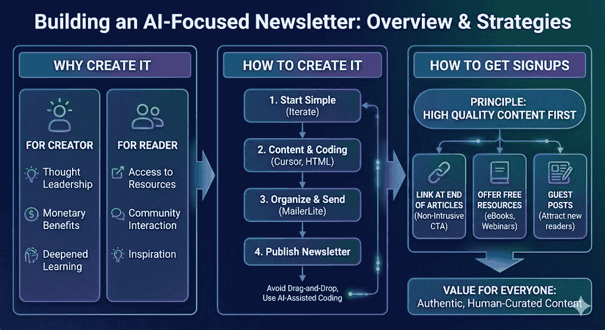
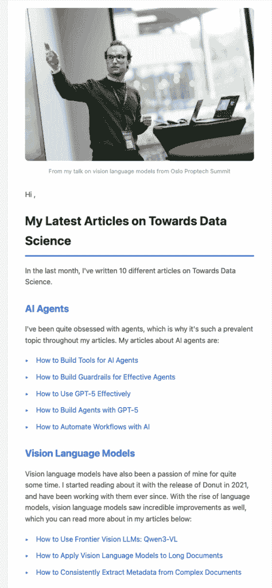

# 如何创建一个 ML 焦点通讯

> 原文：[`towardsdatascience.com/how-to-create-an-ml-focused-newsletter/`](https://towardsdatascience.com/how-to-create-an-ml-focused-newsletter/)

<mdspan datatext="el1764962074673" class="mdspan-comment">通讯是重要的资源，你可以利用它来跟踪 AI 领域的最新趋势。我个人关注 TLDR AI 和 Alphasignal，它们都提供 AI 领域最新新闻的每日摘要。然而，我也最近开始了我自己的 AI 焦点通讯，专注于 AI 领域的最新趋势，以及我自己撰写文章的主题。

在这篇文章中，我将提供一个高级概述，说明为什么以及如何我开始我的 AI 焦点通讯，包括我开始通讯的动机和理由，以及我用来创建通讯的工具和方法。我的目标是激励你创建一份通讯，为在过去几年中经历了前所未有的发展的 AI 社区提供更多资源。

这张信息图涵盖了这篇文章的主要内容。我将讨论为什么你应该创建一份通讯，如何创建通讯，以及如何为你的通讯获取订阅者。我将专注于创建 AI 焦点通讯。图片由 Gemini 提供

## 你为什么应该制作一份通讯

我认为通讯是 AI 社区的一个极好的资源。你可以跟随你最喜欢的创作者，关注他们正在做什么。我认为这对于以下方面很重要：

+   灵感

+   学习

+   保持最新

我特别认为灵感是其中最重要的方面之一。阅读不同的通讯使我保持最新，但最重要的是它给了我不同的想法，关于我想实施的内容，或者让我从不同的角度看待问题，这对于我在初创公司作为高级数据科学家日常工作中来说非常重要。

我相信创建一份好的通讯对创建者和读者都有益。创建者得到：

+   人们跟随他们，成为某个主题的思想领袖

+   财务收益

+   学习：写关于你的经验对于深化你的理解非常有用

而读者则得到：

+   获取免费或价格低廉的高质量资源

+   与社区互动

+   为他们自己的工作获得灵感

因此，制作一份好的通讯对所有方面都有益，如果你特别对某些主题感兴趣，这是一个你应该考虑的事情

## AI 焦点通讯 – 如何创建它

我现在已经涵盖了为什么你应该创建一份通讯，强调了它对通讯的创建者和订阅者都有益。

创建你自己的通讯不必特别困难，而且当然，你应该从简单开始，然后迭代你的通讯以改进它。

我只是通过讨论我之前写过的文章、提供文章的摘要和分类，以及我对文章的一些个人思考和反思来开始我的新闻通讯。我认为反思你之前的内容非常有价值，不仅包括阅读读者的反馈，还包括阅读旧内容，注意到你正在取得的进步，并始终努力成为一个更好的作家或创作者。以下是我第一份新闻通讯的概要：

这张图片展示了我第一份新闻通讯的一部分。这份新闻通讯包含了我上个月所写的所有文章，我将文章分为不同的类别，如 AI 代理和视觉语言模型（以及我特别喜欢的主题）。我提供了所有文章的标题和链接，以及我对 AI 代理和视觉语言模型的一些个人思考。图片由作者提供。

* * *

我正在使用[MailerLite](https://mailerlite.com/)创建我的新闻通讯，它允许你组织你的订阅者列表（我将在下一节中介绍如何获取订阅者），并创建你发送给订阅者的新闻通讯。他们还提供了你可以用来让人们注册你的新闻通讯的表单。我不是 MailerLite 的赞助商。

要创建实际的新闻通讯，我在 Cursor 中创建一个 HTML 文件。我为 Cursor 提供：

+   指向所有我想要引用的文章的链接，并附上标题

+   我想要包含在新闻通讯中的文本（即我对 AI 代理和视觉语言模型的看法）

+   我想要包含的图片路径，例如我在上面的新闻通讯片段中看到的图片

光标（Cursor）负责设置新闻通讯的大纲、项目符号列表以及新闻通讯的整体设计。在本地用 HTML 编写新闻通讯要快得多。

这也遵循了我为自己的网站所遵循的相同原则：

> 永远不要使用拖放编辑器。相反：寻找一种方法，使用任何 AI 代理自己编写代码

现在使用像 Claude Code 或 Cursor 这样的工具自己编写代码变得如此简单，以至于你应该不惜一切代价避免使用拖放编辑器

我在我的文章[如何用 AI 编写自己的网站](https://towardsdatascience.com/how-to-code-your-own-website-with-ai/)中应用了同样的概念。

## 如何获取注册用户

现在你已经知道了为什么你应该制作新闻通讯以及如何制作它，你需要让人们注册新闻通讯。这可能具有挑战性，但你应该始终努力遵循主要原则：

> 如果你创建高质量的内容，观众自然会来

如果你持续撰写高质量的文章，并通过你的新闻通讯引导读者继续关注你，那么随着时间的推移，你基本上可以保证观众的增长。

然而，还有一些具体的技巧你可以使用来增加注册用户：

+   在您的在线内容中链接到您的通讯（我建议在文章末尾链接，以确保您的内容保持纯净，然后在内容末尾展示对通讯的 CTA）

+   提供其他资源，例如网络研讨会和电子书，并让人们免费注册您的通讯，以获取您内容的免费访问权限

+   来宾文章：您可以将一些文章作为来宾文章发表，以吸引来自其他渠道的读者

这些是我使用并推荐的策略。重要的是，这些技术是：

+   不会令人烦恼，或者以降低您其他内容质量的方式。如果读者只想阅读您的文章而不受干扰，没有任何东西阻止他们这样做

+   读者通过注册受益，既可以通过高质量的通讯内容，也可以通过免费访问其他内容，例如电子书和网络研讨会

确保用户从注册您的通讯中受益是极其重要的。

## 结论

在这篇文章中，我讨论了为什么以及如何创建技术通讯。拥有一个通讯是好的，因为您作为创作者和读者都能从通讯的内容中受益。始终牢记您创建的内容以某种方式使读者受益是很重要的，例如，通过轻松访问高质量资源。我还讨论了我是如何通过 Cursor 创建 HTML 文件，然后将它们粘贴到 MailerLite 中发送给订阅者的方式来制作我的通讯。

我认为拥有一个通讯是创作者和读者都难以置信的资源，而且在我们进入一个越来越难以区分人工智能内容与真实人类创造内容的时代，它将变得越来越重要。拥有一个由人类撰写的真实通讯内容是确保真实性的好方法。

**👉 我的免费资源**

**🚀** [使用 LLMs 提升您的工程能力（免费 3 天电子邮件课程）](https://www.eivindkjosbakken.com/email-course)

📚 [获取我的免费视觉语言模型电子书](https://eivindkjosbakken.com/ebook)

💻 [我的视觉语言模型网络研讨会](https://www.eivindkjosbakken.com/webinar)

**👉 在社交平台上找到我：**

📩 [订阅我的通讯](https://eivindkjosbakken.com/newsletter)

🧑‍💻 [联系我](https://eivindkjosbakken.com/)

🔗 [LinkedIn](https://www.linkedin.com/in/eivind-kjosbakken/)

🐦 [X / Twitter](https://x.com/EivindKjos)

✍️ [Medium](https://oieivind.medium.com/)
