# 如何在 Microsoft PowerBI 中创建网络图可视化

> 原文：[`towardsdatascience.com/how-to-create-network-graph-visualizations-in-microsoft-powerbi/`](https://towardsdatascience.com/how-to-create-network-graph-visualizations-in-microsoft-powerbi/)

Microsoft PowerBI 是最受欢迎的商业智能（BI）工具之一，虽然它拥有创建面向业务各利益相关者的动态分析报告所需的所有功能，但创建一些高级数据可视化更具挑战性。

本文将介绍如何在 Microsoft PowerBI 中创建大型网络图可视化，以实现动态和交互式地探索如供应链网络、金融交易等相互关联的数据集。

但在我们这样做之前，让我们快速了解一下网络图的一些基础知识。

## 网络图基础

网络图数据，称为“图形数据”，是以节点和边格式编排的数据。节点代表离散的事物，边代表节点之间的关系。

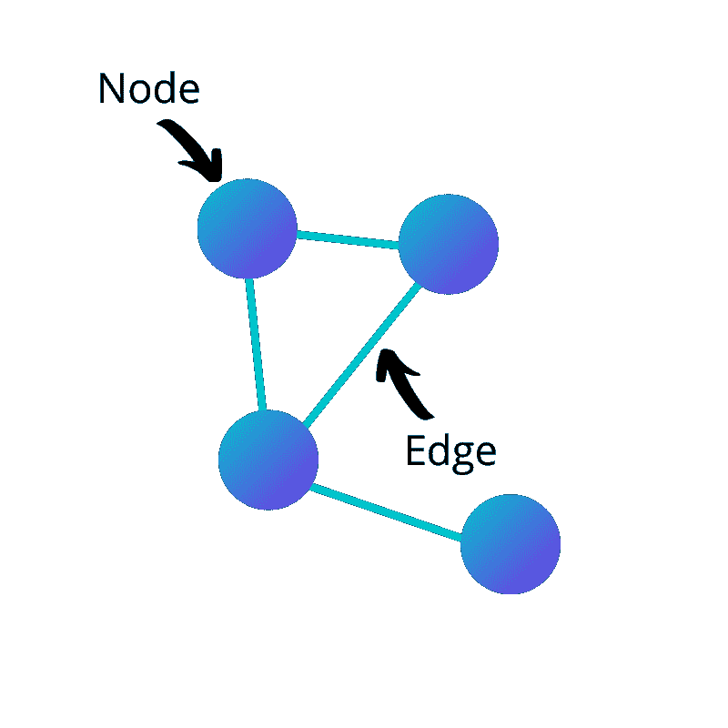

来源：作者

让我们以一个在线社交网络的简单例子为例，它可以表示为图形格式。

节点代表个人资料，而边代表关注状态。

一个由 3 个个人资料组成的简单网络可能看起来像这样：

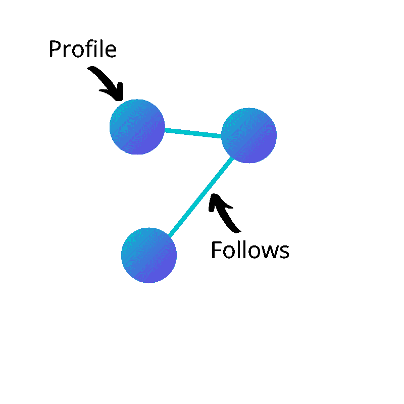

来源：作者

当可视化网络图时，我们可以通过多种方式嵌入有关节点和边的附加信息，例如但不限于：

1.  节点大小

1.  边大小

1.  节点颜色

1.  边颜色

1.  标签

## 结构化网络数据

所以现在你知道了网络图的基本构建块，你如何构建和转换你的数据集呢？

### 图形数据无处不在

虽然你可能认为，“我只在关系数据中”，但这通常不是情况。事实上，许多关系数据集可以可视化为网络图。

以下是一个简单的销售表格示例，包含产品名称、客户名称和数量列。

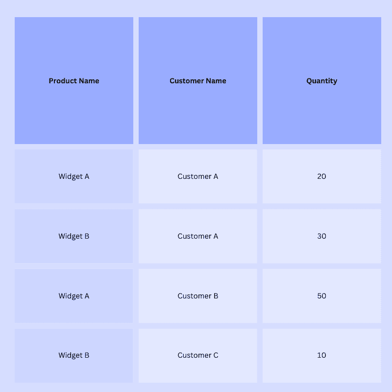

来源：作者

我们可以通过将产品名称表示为节点类型“产品”，客户名称表示为节点类型“客户”，并将每一行表示为“购买”边，将相同的销售表表示为网络图。

以网络图的形式可视化，它可能看起来像这样：

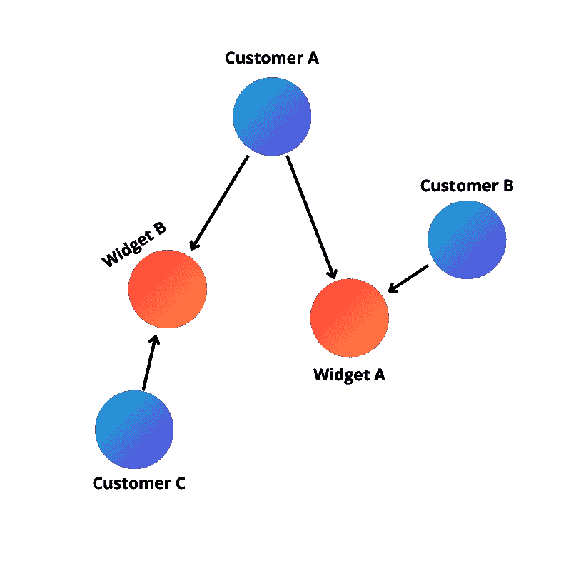

来源：作者

### 图形数据格式

此数据结构有几种方式，例如但不限于：

1.  节点和边列表（通常以.csv 格式）

1.  图形数据库（如 Neo4j）

1.  图形文件（如 GraphML 或 GEXF）

但在这篇文章中，我们将由于在 Microsoft PowerBI 中制作网络图的要求，将节点和边列表合并为单个表格数据集。

### 映射你的数据

你需要将你的数据映射到以下表格格式，其中每条记录代表一条边：

1.  源节点（必填）-> 这是边起始节点的唯一标识符（例如，客户 ID）

1.  目标节点（必填）-> 这是边结束节点的唯一标识符（例如，产品 ID）

1.  来源颜色 -> 这是源节点的类别标识符（例如，客户类型）

1.  目标颜色 -> 这是目标节点的类别标识符（例如，产品类别）

1.  链接颜色 -> 这是边的类别标识符（例如，销售渠道）

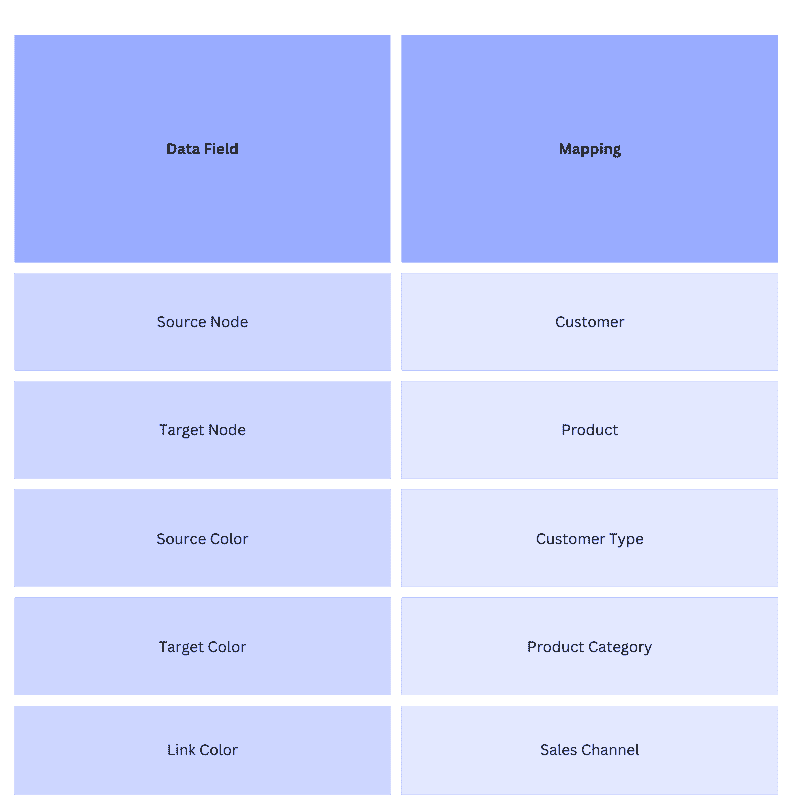

来源：作者

## 创建网络图可视化

现在我们已经将数据映射好了，我们可以创建网络图可视化。

虽然微软在默认的 PowerBI 视觉中不包括网络视觉，但我们可以访问视觉市场来下载第三方视觉。

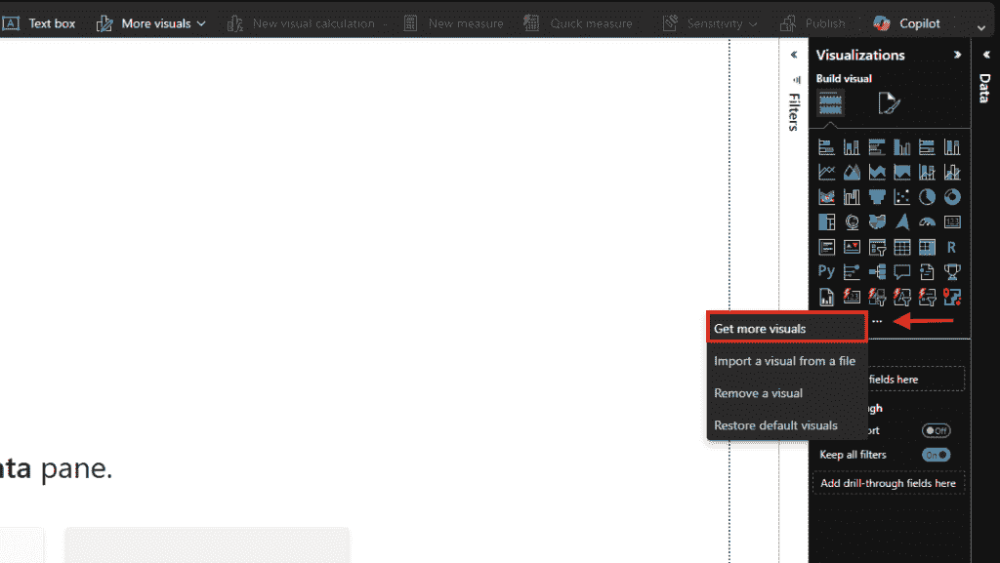

来源：作者

对于这篇文章，我们将使用“Astra”这个视觉，它允许你创建具有大量自定义选项的大规模网络图。

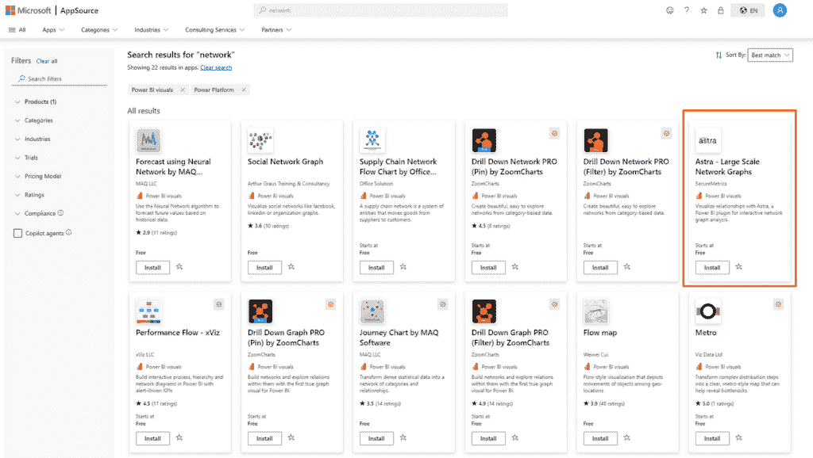

来源：作者

一旦安装，它将出现在你的视觉库中。

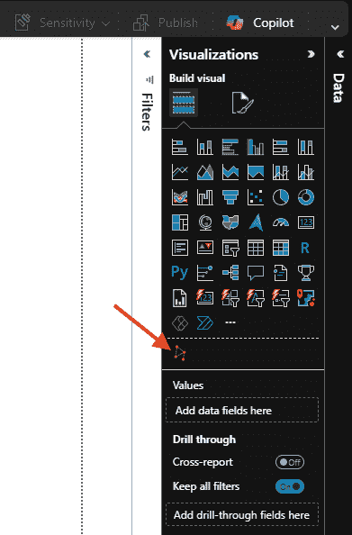

来源：作者

将视觉拖放到画布上，选择它，并注意所需的值（我们之前已经映射过了）。视觉还有传递 x 和 y 坐标以及自定义标签的选项，但在这篇文章中我们不会使用这些选项。

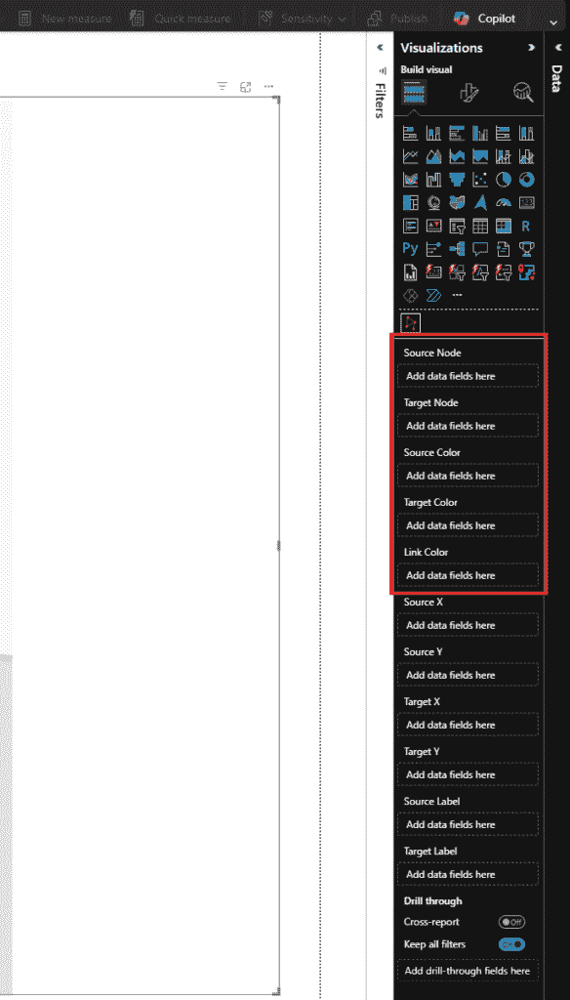

来源：作者

只需填写“源节点”和“目标节点”这两个必填值，所以我们从这里开始。从数据面板中拖动你映射到这些节点的列。

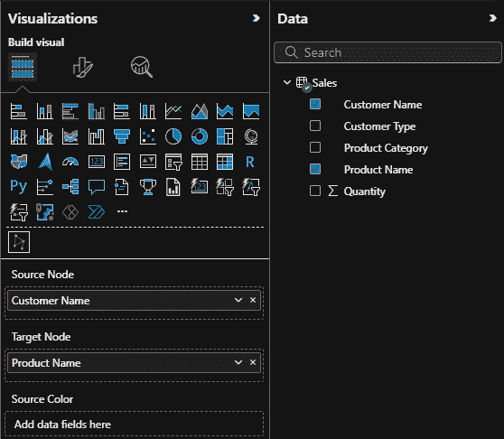

来源：作者

你会注意到视觉图显示了我们的节点和边，但是看起来并不那么好。我们需要更改一些模拟设置。

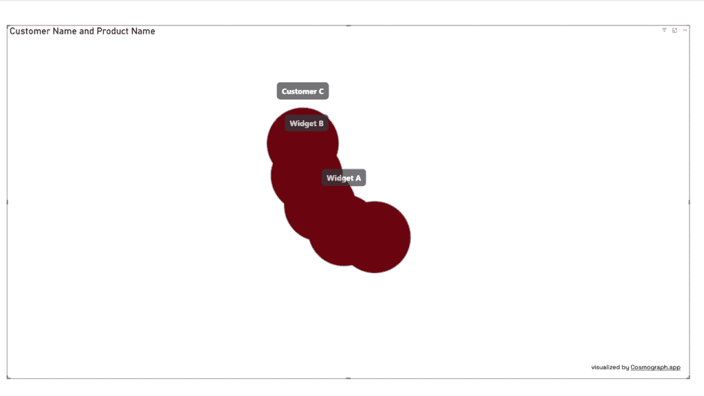

来源：作者

要更改模拟设置，打开格式化面板，然后选择模拟，增加链接距离和排斥力。我选择将排斥力设置为 0.3，链接距离设置为 15。

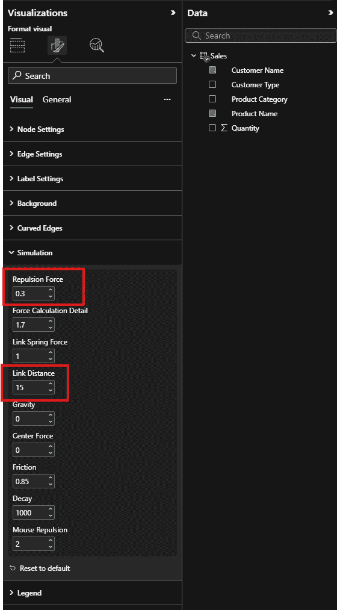

来源：作者

你现在可以看到我们得到了一个更好的数据布局。

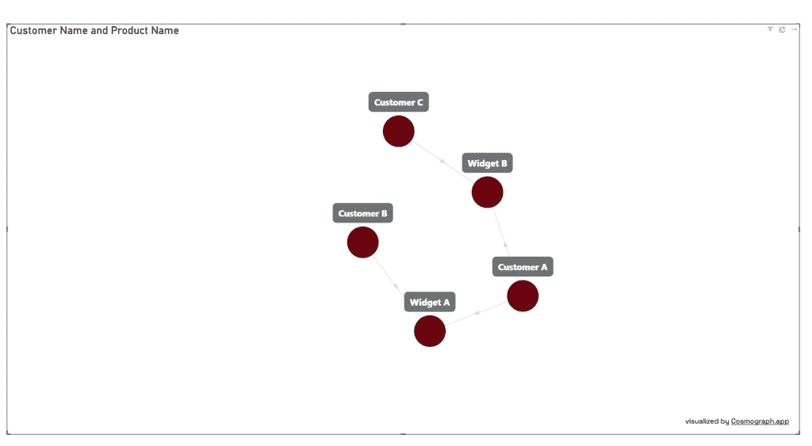

来源：作者

让我们现在通过根据节点类别更改节点颜色来将一些附加信息编码到图中。将你上面映射的字段拖动到来源颜色和目标颜色。

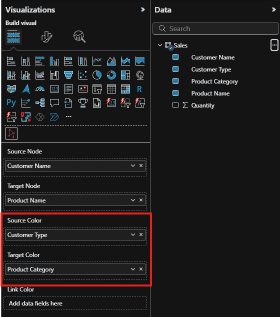

来源：作者

你现在会注意到节点颜色不同，视觉上也有图例。

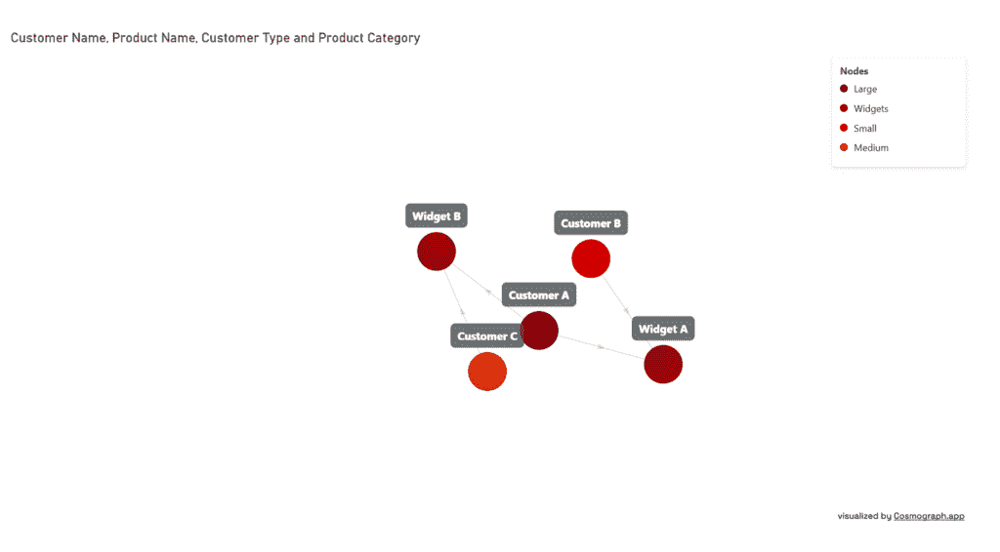

来源：作者

让我们在格式化面板中对背景颜色和节点颜色进行一些格式化。

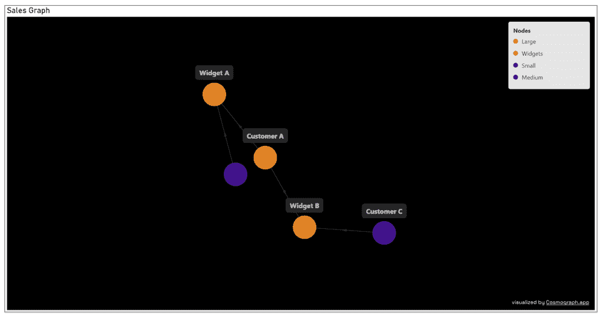

来源：作者

恭喜！您已在 PowerBI 中创建了一个具有动态节点着色的网络图可视化。

我们向图形添加更多信息，例如：

+   打开节点权重以使具有更多边的节点更大

+   添加链接类别以着色链接

+   为节点添加不同的标签

但我们还没有完成。

一旦我们有了可视化，利益相关者必须使用它来做出更明智的决策。

## 与网络图交互

静态网络图立即具有价值，例如能够通过关系直观地看到数据是如何相互关联的。

然而，我们还可以使用一些额外的功能来使可视化更具洞察力。

首先，我们可以通过选择类别来与图例交互，在图上突出显示它们。例如，快速定位图中的部件：

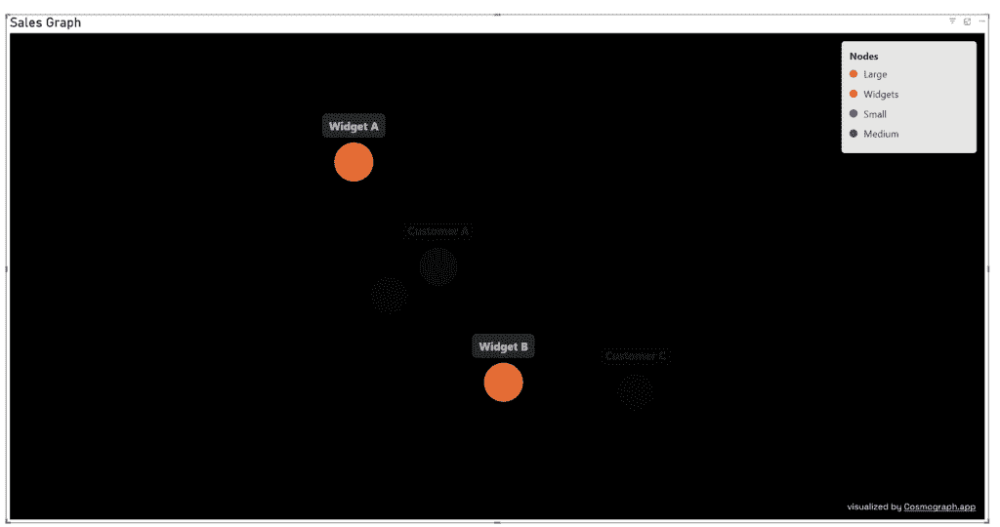

来源：作者

我们也可以通过点击图中的节点来选择单个节点。

或者，您可以在节点属性中切换“选择相邻节点”，使其不仅选择点击的节点，还选择通过边直接连接到该节点的所有节点。

例如，选择“部件 A”并开启“选择相邻节点”功能，将显示所有购买该部件的客户：

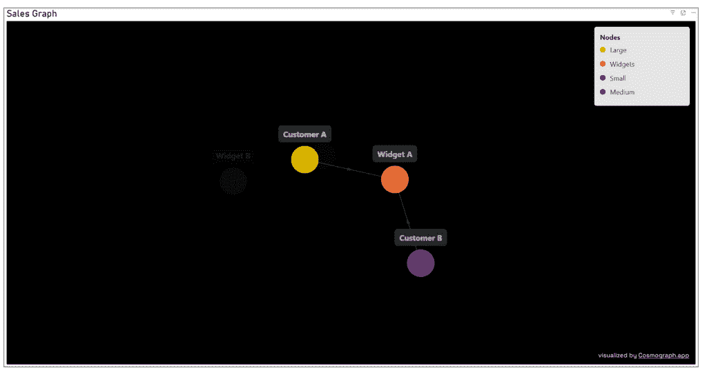

来源：作者

但选择节点不仅会在可视化中突出显示它们，还会将此筛选器传递到您的 PowerBI 报告的其余部分。

这意味着我们可以添加额外的图表，为用户的选定提供更多上下文。

例如，为顾客购买数量添加柱状图：

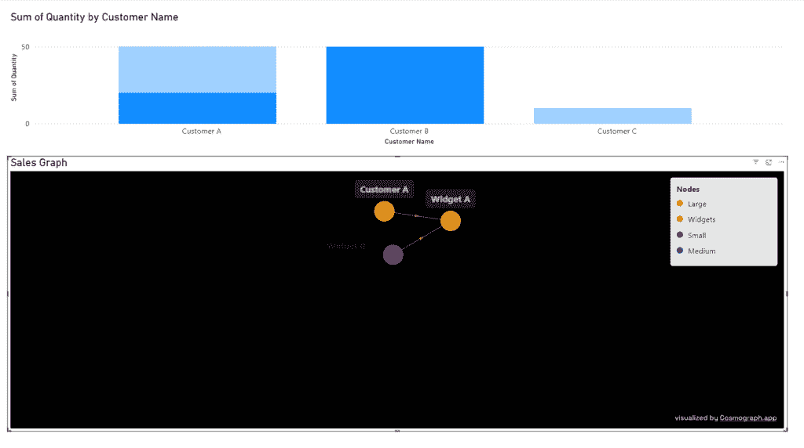

来源：作者

我们还可以通过筛选进入网络可视化的数据来执行相反的操作。这可以通过多种方式完成，例如：

1.  切片器

1.  选择其他图表的部分，例如饼图的一部分

1.  筛选面板

让我们使用切片器来根据客户类型切片图形：

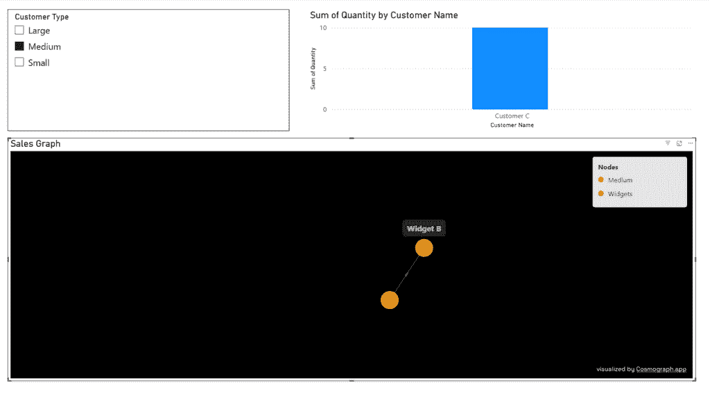

来源：作者

## 构建复杂的 BI 报告

尽管本文中的示例网络图在演示目的上相对简单，但您可以为利益相关者构建相当复杂的 BI 报告。

本文使用的 Astra PowerBI 可视化可以扩展到数十万个边，与额外的交叉筛选可视化与切片器配合使用，可以实现比默认 PowerBI 报告更高级的分析。

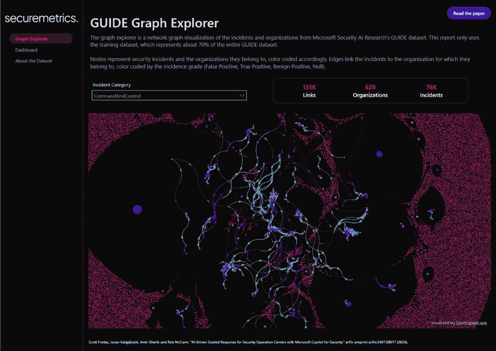

来源：作者

## 结论

网络图无处不在，甚至隐藏在你的关系型数据集中。虽然市面上有出色的网络图工具，但在 PowerBI 中构建网络图允许您将这种高级分析工具带给您的标准 BI 利益相关者，并通过添加额外的筛选器和图表来构建高级报告。
