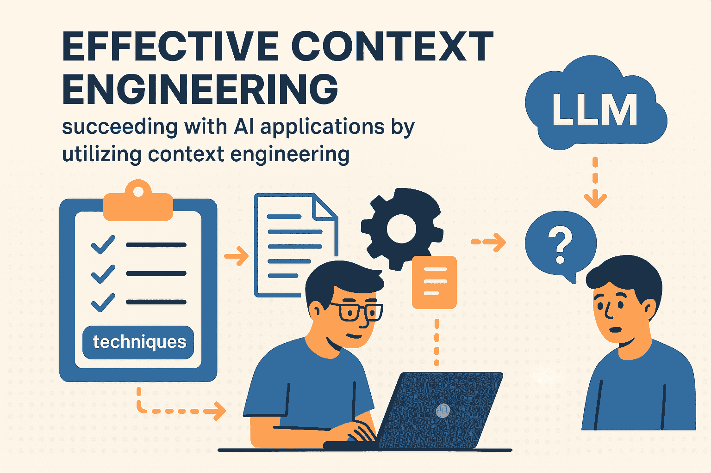
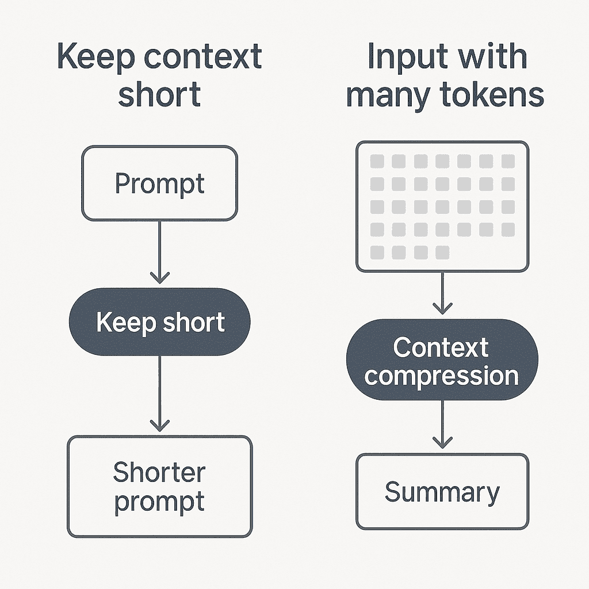
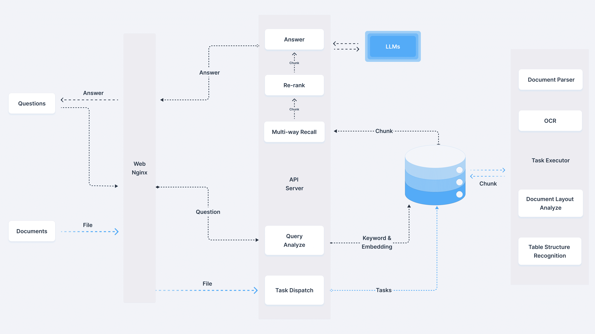

# 如何利用上下文工程创建强大的 LLM 应用

> 原文：[`towardsdatascience.com/how-to-create-powerful-llm-applications-with-context-engineering/`](https://towardsdatascience.com/how-to-create-powerful-llm-applications-with-context-engineering/)

<mdspan datatext="el1755540523920" class="mdspan-comment">上下文</mdspan>工程是一个强大的概念，你可以利用它来提高你的 LLM 应用的有效性。在这篇文章中，我详细阐述了上下文工程技术以及如何通过有效的上下文管理在 AI 应用中取得成功。因此，如果你正在使用 LLM 的 AI 应用中工作，我强烈建议阅读这篇文章的全文。

我首先在我的文章《How You Can Enhance LLMs with Context Engineering》中介绍了上下文工程这个主题，其中我讨论了一些上下文工程技术和一些重要注意事项。在这篇文章中，我通过讨论更多的上下文工程技术以及如何对你的上下文管理进行评估来扩展这个主题。



在这篇文章中，我讨论了如何利用上下文工程来提高你的 LLM 的效率。图片由 ChatGPT 提供。

如果你还没有阅读，我建议你首先阅读[我的关于上下文工程的初始文章](https://towardsdatascience.com/how-to-significantly-enhance-llms-by-leveraging-context-engineering-2/)、[确保 LLM 应用中的可靠性](https://eivindkjosbakken.com/2025/08/16/how-to-ensure-reliability-in-llm-applications/)或[如何使用 ARC AGI 3 基准测试 LLM](https://towardsdatascience.com/how-to-benchmark-llms-arc-agi-3/)

## 目录

+   动机

+   上下文工程技术

    +   提示结构

    +   上下文窗口管理

    +   关键词搜索（与 RAG 相比）)

+   评估

+   结论

## 动机

我写这篇文章的动机与我的[上一篇文章关于上下文工程](https://towardsdatascience.com/how-to-significantly-enhance-llms-by-leveraging-context-engineering-2/)相似。自 2022 年 ChatGPT 发布以来，LLM 在许多应用中变得极其重要。然而，由于上下文管理不善，LLM 往往没有发挥出全部潜力。适当的上下文管理需要上下文工程技能和技术，这正是我在这篇文章中要讨论的内容。因此，如果你正在开发任何使用 LLM 的应用，我强烈建议你从这篇文章中做笔记并将其整合到你的应用中。

## 上下文工程技术

在我上一篇文章中，我讨论了上下文工程技术，例如：

+   零样本/少样本提示

+   RAG

+   工具（MCP）

我现在将详细阐述更多对适当上下文管理重要性的技术。

### 提示结构化

在这里，我所说的提示结构化是指你的提示是如何组织的。例如，一个杂乱的提示可能包含没有换行的所有文本，重复的指令和不清晰的章节。下面是一个结构良好的提示与一个杂乱提示的例子：

```py
# unstructured prompt. No line breaks, repetitive instructions, unclear sectioning
"You are an AI assistant specializing in question answering. You answer the users queries in a helpful, concise manner, always trying to be helpful. You respond concisely, but also avoid single-word answers."

# structured prompt:
"""
## Role  
You are an **AI assistant specializing in question answering**.  

## Objectives  
1\. Answer user queries in a **helpful** and **concise** manner.  
2\. Always prioritize **usefulness** in responses.  

## Style Guidelines  
- **Concise, but not overly brief**: Avoid single-word answers.  
- **Clarity first**: Keep responses straightforward and easy to understand.  
- **Balanced tone**: Professional, helpful, and approachable.  

## Response Rules  
- Provide **complete answers** that cover the essential information.  
- Avoid unnecessary elaboration or filler text.  
- Ensure answers are **directly relevant** to the user’s question.  
"""
```

提示结构化之所以重要，有两个原因。

1.  它使指令对 AI 更清晰。

1.  它增加了提示的（人类）可读性，这有助于你检测到提示中可能存在的问题，避免重复指令等。

你应该始终尽量避免重复指令。为了避免这种情况，我建议将你的提示输入到另一个 LLM 中并请求反馈。你通常会收到一个更干净的提示，其中包含更清晰的指令。Anthropic 在其仪表板中也有一个[提示生成器](https://console.anthropic.com/dashboard)，还有许多其他工具可以帮助改进你的提示。

### 上下文窗口管理



关于上下文管理的两个主要点。保持上下文简短，如果上下文变得过长，你可以通过总结来利用上下文压缩。图片由 ChatGPT 提供。

另一个需要记住的重要点是上下文窗口管理。这里我指的是你输入到你的 LLM 中的标记数量。重要的是要记住，尽管最近的 LLM 有超级长的上下文窗口（例如，[Llama 4 Scout 具有 10M 上下文窗口](https://www.llama.com/models/llama-4/)），但它们并不一定能利用所有这些标记。例如，你可以[阅读这篇文章](https://arxiv.org/abs/2402.14848?utm_source=chatgpt.com)，突出显示 LLM 在输入标记更多的情况下表现更差，即使问题的难度保持不变。

因此，正确管理上下文窗口非常重要。我建议关注两个要点：

1.  尽可能使提示尽可能简短，同时包含所有相关信息。查看提示，确定其中是否有任何无关文本。如果有，删除它可能会提高 LLM 的性能。

1.  你可能遇到 LLM 耗尽上下文窗口的问题。这可能是由于硬上下文大小限制，或者是因为输入标记太多导致 LLM 响应缓慢。在这些情况下，你应该考虑**上下文压缩**。

对于第一点，需要注意的是，这种无关信息通常不是你静态系统提示的一部分，而是你输入到上下文中的动态信息。例如，如果你正在使用 RAG 获取信息，你应该考虑排除相似度低于特定阈值的块。这个阈值会根据应用的不同而有所不同，但在这里的经验推理通常效果很好。

上下文压缩是您可以用来正确管理您的 LLM 上下文的另一种强大技术。上下文压缩通常是通过提示另一个 LLM 总结您的上下文的一部分来完成的。这样，您可以使用更少的标记包含相同的信息。例如，这种方法用于处理代理的上下文窗口，随着代理执行更多操作，上下文窗口可以迅速扩展。

### 关键词搜索（与 RAG 相比）



此图像显示了来自 https://github.com/infiniflow/ragflow（Apache 2 许可证）的 RAG 架构。您可以通过实现上下文检索来改进 RAG 流程。

另一个我认为值得强调的话题是，除了检索增强生成（RAG）之外，还要利用关键词搜索。在大多数 AI 应用中，重点在于 RAG，因为它可以根据语义相似性检索信息。

语义相似性非常强大，因为在很多情况下，用户不知道他们要找的确切措辞。因此，搜索语义相似性非常有效。然而，在许多情况下，关键词搜索也会非常有效。因此，我建议在您的 RAG 之外集成一种使用某种关键词搜索检索文档的选项。在某些情况下，关键词搜索将能够检索比 RAG 更相关的文档。

Anthropic 在 2024 年 9 月发布的关于上下文检索的文章中 [强调了这种方法](https://www.anthropic.com/news/contextual-retrieval)。在这篇文章中，他们向您展示了如何有效地利用 BM25 在您的 RAG 系统中检索相关信息。

## 评估

评估是任何机器学习系统的重要组成部分。如果您不知道您的 LLM 表现如何，那么很难改进您的系统。

评估的第一步是可观察性。因此，我建议实施提示管理软件。您可以在 [这个 GitHub 页面](https://github.com/tensorchord/Awesome-LLMOps?tab=readme-ov-file#llmops) 找到一系列此类工具。

评估您上下文管理的一种方法是通过 A/B 测试。您只需运行两个不同版本的提示，使用不同的上下文管理技术。然后，例如，您可以收集用户反馈以确定哪种方法更有效。另一种测试方法是提示一个 LLM 您试图解决的问题（例如，RAG）以及您用于回答 RAG 查询的上下文。LLM 可以然后为您提供有关如何改进您的上下文管理的反馈。

此外，提高上下文质量的一个被低估的方法是手动检查它们。我相信许多与 LLM 合作的工程师在手动检查上花费的时间太少，分析输入到 LLMs 中的标记也属于这一范畴。因此，我建议留出时间来检查一系列输入到你的 LLM 中的不同上下文，以确定你可以如何改进。手动检查为你提供了正确理解你所处理的数据以及你输入到 LLMs 中的内容的机会。

## 结论

在这篇文章中，我详细阐述了上下文工程的主题。从事上下文工程是提高你的 LLM 应用的有效方法。你可以利用一系列技术来更好地管理 LLMs 的上下文，例如，改进你的提示结构、适当管理上下文窗口、利用关键词搜索和上下文压缩。此外，我还讨论了上下文的评估。

**👉 我的免费电子书和网络研讨会：**

📚 [获取我的免费视觉语言模型电子书](https://eivindkjosbakken.com/ebook)

💻 [我的视觉语言模型网络研讨会](https://www.eivindkjosbakken.com/webinar)

**👉 在社交平台上找到我：**

📩 [订阅我的通讯](https://eivindkjosbakken.com/newsletter)

🧑‍💻 [联系我](https://eivindkjosbakken.com/)

🔗 [LinkedIn](https://www.linkedin.com/in/eivind-kjosbakken/)

🐦 [X / Twitter](https://x.com/EivindKjos)

✍️ [Medium](https://oieivind.medium.com/)
