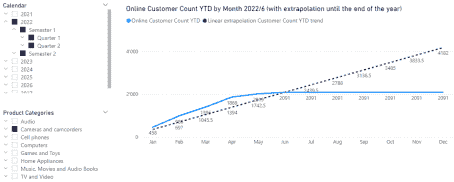
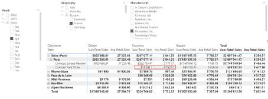
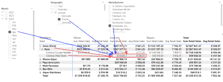
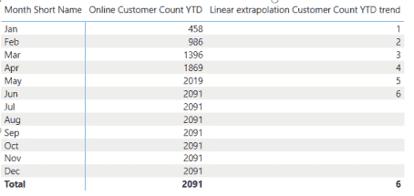
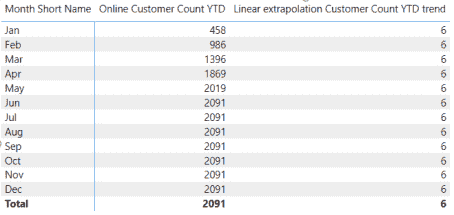
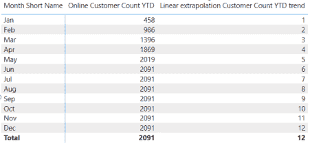
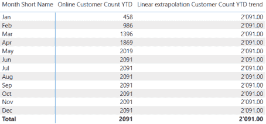
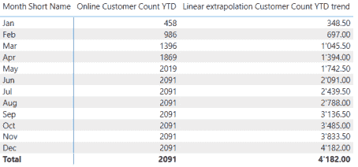
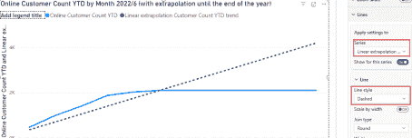

# 如何开发复杂的 DAX 表达式

> 原文：[`towardsdatascience.com/how-to-develop-complex-dax-expressions/`](https://towardsdatascience.com/how-to-develop-complex-dax-expressions/)

*在某个时候，任何 Power BI 开发者都必须编写复杂的 DAX 表达式来分析数据。但没有人告诉你如何做。这个过程是怎样的？最好的做法是什么，开发过程可以提供多少支持？这些问题我将在这里回答。*

## 简介

有时我的客户会问我如何为特定的 DAX 度量想出解决方案。我的回答总是，我遵循一个特定的过程来找到解决方案。

有时，过程并不直接，当我看到我走错了方向时，我必须偏离或从头开始。

但开发过程始终是一样的：

**1.** 理解需求。

**2.** 定义计算结果的数学公式。

**3.** 确认该度量必须在任何或特定场景下工作。

**4.** 从中间结果开始，逐步工作，直到我完全理解它应该如何工作，并能够交付所需的结果。

**5.** 计算最终结果。

第三步是最困难的。

有时我的客户会要求我在特定场景下计算一个特定的结果。但当我再次询问时，答案是：是的，我还会在其他场景中使用它。

例如，不久前，一位客户要求我为报告中的特定场景创建一些度量。我不得不在客户团队的工作坊中现场完成这项工作。

在我交付了所需结果后的几天，他让我基于我们在研讨会中详细阐述的相同语义模型和逻辑，但针对一个更灵活的场景，创建另一份报告。

第一组度量是为了与第一个场景紧密配合而设计的，所以我并不想改变它们。因此，我创建了一套更通用的新度量。

是的，这是一个最坏的情况，但这是可能发生的事情。

这只是一个例子，说明了花时间彻底理解所需度量需求和可能的未来用例是多么重要。

## 第 1 步：需求

对于这篇文章，我从我之前的一篇文章中选取了一个度量来计算客户数量的线性外推。

需求是：

+   使用客户数量度量作为基础度量。

+   用户可以选择要分析的年份。

+   用户可以在任何切片器中选择任何其他维度。

+   用户将按月分析结果。

+   应将过去的客户数量作为输入值。

+   必须以 YTD 增长率作为结果的基础。

+   根据 YTD 增长率，客户数量应该外推到年底。

+   YTD 客户数量和外推必须显示在同一张折线图上。

对于 2022 年，结果应该看起来像这样：



图 1 – 客户计数线性外推的请求结果（作者制图）

好的，让我们看看我是如何开发这个度量的。

但在这样做之前，我们必须理解过滤器上下文是什么。

如果你已经熟悉它，你可以跳过这一节。或者你也可以随便读一读，以确保我们处于同一水平。

### 间奏：过滤器上下文

过滤器上下文是 DAX 的核心概念。

当在语义模型中编写度量时，无论是在 Power BI、fabric 语义模型还是分析服务语义模型中，你必须始终理解当前的过滤器上下文。

过滤器上下文是：

*影响 DAX 表达式结果的所有过滤器的总和。*

看看下面的图片：



图 2 – 自问：标记单元格的过滤器上下文是什么？（作者制图）你能解释标记单元格的过滤器上下文吗？

现在，看看下面的图片：



图 3 – 影响标记单元格过滤器上下文的全部过滤器（作者制图）

有六个过滤器，影响两个度量“总零售销售额”和“平均零售销售额”的标记单元格的过滤器上下文：

+   商店“Contoso 巴黎店”

+   城市“巴黎”

+   类别名称“经济”

+   2024 年 4 月

+   国家“法国”

+   制造商“Proseware Inc.”

前三个过滤器来自视觉。我们可以称它们为“内部过滤器”。它们控制矩阵视觉如何扩展以及我们可以看到多少细节。

其他过滤器是“外部过滤器”，来自 Power BI 的切片器或过滤器面板，并由用户控制。

DAX 度量的力量在于提取过滤器上下文值和操作过滤器上下文的能力。

我们这样做是在编写 DAX 表达式时：我们操作过滤器上下文。

## 步骤 2：中间结果

好的，现在我们可以开始了。

首先，我不从行视觉开始，而是从表格或矩阵视觉开始。

这是因为将结果看作一个数字比看作一条线更容易。

尽管线性进展只表现为一条线。

然而，中间结果在矩阵中更容易阅读。

如果你不太熟悉在 DAX 中使用变量，我推荐[阅读这篇文章](https://towardsdatascience.com/three-things-you-need-to-know-when-using-variables-in-dax-c67724862b57/)，我在其中解释了变量的概念：

下一步是定义基本度量。这是我们想要用来计算预期结果的度量。

由于我们想要计算 YTD 结果，我们可以使用客户计数的 YTD 度量：

```py
Online Customer Count YTD =
VAR YTDDates = DATESYTD('Date'[Date])
RETURN
CALCULATE(
DISTINCTCOUNT('Online Sales'[CustomerKey])
,YTDDates
)
```

现在我们必须考虑如何处理这些中间结果。

这意味着我们必须定义度量的算术。

对于每个月，我必须计算已知的最后客户计数 YTD。

这意味着，我总是想为每个月计算 2,091。这是 2022 年的最后一个 YTD 客户计数。

然后，我想将这个结果除以最后一个有销售记录的月份，在这个例子中是 6 月，然后乘以当前月份编号。

因此，第一个中间结果是知道最后一次销售是在什么时候。我们必须获取在线销售表中的最新日期。

根据要求，用户可以选择任何年份进行分析，并且结果必须按月计算。

因此，正确的定义是：我必须首先知道所选年份最后一次销售发生的月份。

事实表包含一个日期和与日期表的关联，该日期表包括月份编号（列：[月份]）。

所以，第一个变量将类似于这样：

```py
Linear extrapolation Customer Count YTD trend =
// Get the number of months since the start of the year
VAR LastMonthWithData = MAXX('Online Sales'

,RELATED('Date'[Month])
)

RETURN
LastMonthWithData
```

这是结果：



图 4 – 获取最后一个有销售记录的月份（作者制图）

等一下：我们必须始终获取最后一个有销售记录的月份。现在，我们总是得到与当前行月份相同的月份。

这是因为每一行都将过滤器上下文设置为每个月。

因此，我们必须移除月份的过滤器，同时保留年份。我们可以使用 `ALLEXCEPT()` 来做到这一点：

```py
Linear extrapolation Customer Count YTD trend =
// Get the number of months since the start of the year
VAR LastMonthWithData = CALCULATE(MAXX('Online Sales'
,RELATED('Date'[Month])
)
,ALLEXCEPT('Date', 'Date'[Year])
)

RETURN
LastMonthWithData
```

现在，结果看起来好多了：



图 5 – 上个月为所有月份计算了销售（作者制图）

在计算每个月的结果时，我们必须知道当前行的月份编号（月份）。我们将重复使用这个作为乘以平均值的因子，以获得线性外推。

下一个中间结果是获取月份编号：

```py
Linear extrapolation Customer Count YTD trend =
// Get the number of months since the start of the year
VAR LastMonthWithData = CALCULATE(MAXX('Online Sales'
,RELATED('Date'[Month])
)
,ALLEXCEPT('Date', 'Date'[Year])
)
// Get the last month
// Is needed if we are looking at the data at the year, semester, or
quarter level
VAR MaxMonth = MAX('Date'[Month])
RETURN
MaxMonth
```

我可以保留第一个变量不变，并在返回后仅使用 MaxMonth 变量。结果显示每个月的月份编号：



图 6 – 获取每行的当前月份编号（作者制图）

根据之前制定的定义，我们必须获取最后一个有销售记录的月份的最后客户计数 YTD。

我可以用以下表达式做到这一点：

```py
Linear extrapolation Customer Count YTD trend =
// Get the number of months since the start of the year
VAR LastMonthWithData = CALCULATE(MAXX('Online Sales'
,RELATED('Date'[Month])
)
,ALLEXCEPT('Date', 'Date'[Year])
)
// Get the last month
// Is needed if we are looking at the data at the year, semester, or
quarter level
VAR MaxMonth = MAX('Date'[Month])
// Get the Customer Count YTD
VAR LastCustomerCountYTD = CALCULATE([Online Customer Count YTD]
,ALLEXCEPT('Date', 'Date'[Year])
,'Date'[Month] = LastMonthWithData
)

RETURN
LastCustomerCountYTD
```

如预期的那样，结果显示每个月都是 2,091：



图 7 – 每月计算最新的客户计数 YTD（作者制图）

你可以看到为什么我在开发复杂度量时总是从表格或矩阵开始。

现在想象一下，一个中间结果是一个日期或文本。

以线条图的形式展示这样的结果并不实用。

我们已经准备好根据上述数学定义计算最终结果。

## 第 3 步：最终结果

我们有两种计算结果的方法：

1. 在 `RETURN` 语句之后编写表达式。

2. 创建一个新的变量“结果”，并在 `RETURN` 语句之后使用这个变量。最终的表达式是这样的：

```py
(LastCustomerCountYTD / LastMonthWithData) * MaxMonth
```

第一个变体看起来像这样：

```py
Linear extrapolation Customer Count YTD trend =
// Get the number of months since the start of the year
VAR LastMonthWithData = CALCULATE(MAXX('Online Sales'
,RELATED('Date'[Month])

)

,ALLEXCEPT('Date', 'Date'[Year])

)
// Get the last month
// Is needed if we are looking at the data at the year, semester, or
quarter level
VAR MaxMonth = MAX('Date'[Month])
// Get the Customer Count YTD
VAR LastCustomerCountYTD = CALCULATE([Online Customer Count YTD]
,ALLEXCEPT('Date', 'Date'[Year])
,'Date'[Month] = LastMonthWithData
)

RETURN
// Calculating the extrapolation
(LastCustomerCountYTD / LastMonthWithData) * MaxMonth
```

这是第二个变体：

```py
Linear extrapolation Customer Count YTD trend =
// Get the number of months since the start of the year
VAR LastMonthWithData = CALCULATE(MAXX('Online Sales'
,RELATED('Date'[Month])
)
,ALLEXCEPT('Date', 'Date'[Year])
)
// Get the last month
// Is needed if we are looking at the data at the year, semester, or
quarter level
VAR MaxMonth = MAX('Date'[Month])
// Get the Customer Count YTD
VAR LastCustomerCountYTD = CALCULATE([Online Customer Count YTD]
,ALLEXCEPT('Date', 'Date'[Year])
,'Date'[Month] = LastMonthWithData
)
// Calculating the extrapolation
VAR Result =
(LastCustomerCountYTD / LastMonthWithData) * MaxMonth
RETURN
Result
```

结果是相同的。

第二种变体允许我们在最终结果不正确时快速切换回中间结果，而无需将 `RETURN` 语句后的表达式设置为注释。

它只是让生活变得更简单。

但选择哪种变体取决于您。

结果如下：



图 8 – 表格中的最终结果（图由作者绘制）

当将此表转换为折线图时，我们得到与第一图相同的结果。最后一步是将线条设置为虚线，以获得所需的可视化。



图 9 – 将外推线的线条设置为虚线（图由作者绘制）

### 复杂的计算列

当为计算列编写复杂的 DAX 表达式时，过程是相同的。区别在于我们可以在 Power BI Desktop 的表格视图中看到结果。

注意，当计算列被计算时，当您按下 Enter 键，结果会物理地存储在表中。

Measures 的结果不会存储在模型中。它们在可视化中实时计算。

另一个区别在于，我们可以利用上下文转换在需要时根据表中的其他行获取结果。

阅读这篇文章了解更多关于这个有趣话题的信息：

> [DAX 中上下文转换的奇妙之处](https://towardsdatascience.com/whats-fancy-about-context-transition-in-dax-efb5d5bc4c01/)

## 结论

复杂表达式的开发过程始终遵循相同的步骤：

**1.** 理解需求 – 如果有不清楚的地方，请提问。

**2.** 定义结果的数学公式。

**3.** 从中间结果开始，并理解结果。

**4.** 逐个构建中间结果 – 不要尝试一次性写完所有内容。

**5.** 决定在哪里编写最终结果的公式。

按照这样的流程可以帮您解决问题，因为您不需要一次性写完所有内容。

此外，获取这些中间结果允许您了解正在发生的事情并探索筛选上下文。

这将帮助您更有效地学习 DAX 并构建更复杂的内容。

但请注意：尽管需要一定程度的复杂性，但优秀的开发者会尽可能保持简单，同时保持最小的复杂性。

## 参考资料

[这里](https://towardsdatascience.com/calculating-a-linear-extrapolation-or-trend-in-dax-72a5705d949c/)是本文开头提到的文章，用于计算线性外推。

如同我之前的文章，我使用了 Contoso 示例数据集。您可以从微软[这里](https://www.microsoft.com/en-us/download/details.aspx?id=18279)免费下载 ContosoRetailDW 数据集。

根据描述，Contoso 数据可以在 MIT 许可证下自由使用[这里](https://github.com/microsoft/Power-BI-Embedded-Contoso-Sales-Demo)。我将数据集更改以将数据移至当代日期。
