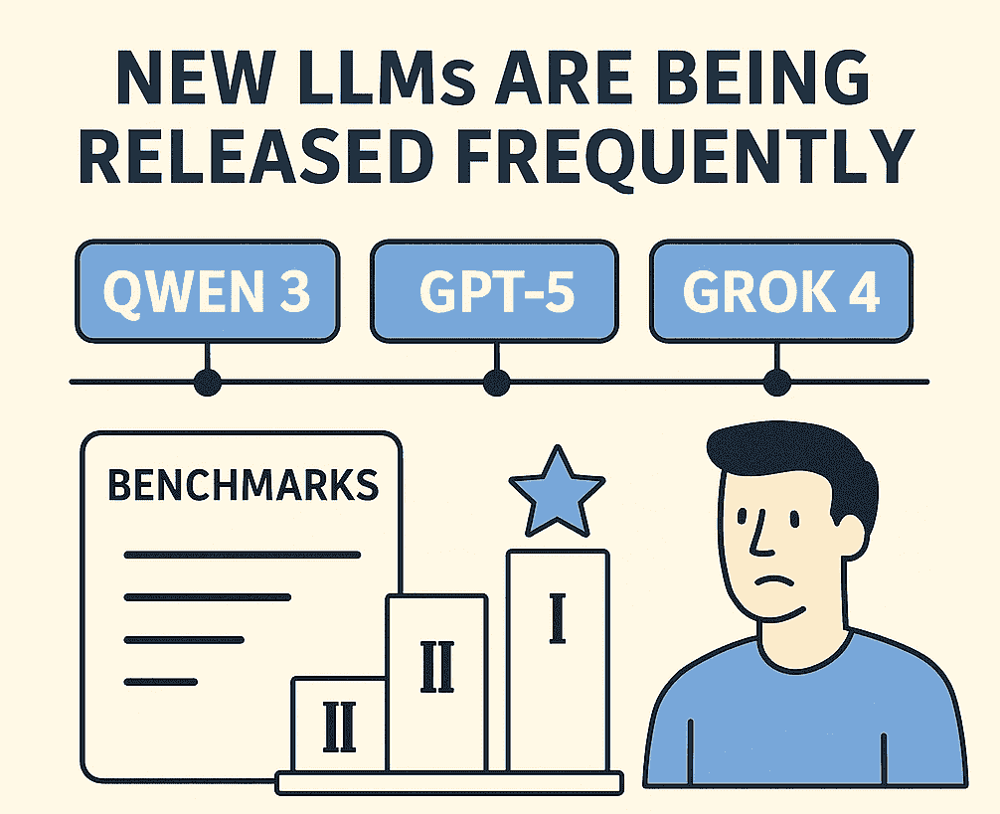

# 如何开发强大的内部 LLM 基准

> 原文：[`towardsdatascience.com/how-to-develop-powerf-interal-llm-benchmarks/`](https://towardsdatascience.com/how-to-develop-powerf-interal-llm-benchmarks/)

<mdspan datatext="el1756186564829" class="mdspan-comment">你几乎每周都能听到新的</mdspan>LLM 发布。我们最近的一些发布包括[Qwen3 coing 模型](https://huggingface.co/Qwen/Qwen3-Coder-480B-A35B-Instruct)、[GPT 5](https://openai.com/index/introducing-gpt-5/)、[Grok 4](https://x.ai/news/grok-4)，它们都声称在某个基准测试中处于领先地位。常见的基准有人文最后考试、SWE-bench、IMO 等。

然而，这些基准存在一个固有的缺陷：发布新前端模型的公司强烈被激励去优化它们在基准测试上的表现。原因是这些知名的基准实际上是为新突破性 LLM 设定标准的东西。

幸运的是，存在一个简单的解决方案来解决这个问题：开发你自己的内部基准，并在基准测试上测试每个 LLM，这正是本文将要讨论的内容。

我讨论了你可以如何开发强大的内部 LLM 基准，以比较适用于你自己的用例的 LLM。图片由 ChatGPT 提供。

## 目录

+   动机

+   如何开发内部基准

    +   任务类型

    +   确保自动任务

+   在你的内部基准上测试

+   避免污染

+   尽可能少花时间

+   结论

你还可以了解[如何基准测试 LLM – ARC AGI 3](https://towardsdatascience.com/how-to-benchmark-llms-arc-agi-3/)，或者阅读有关[确保 LLM 应用可靠性](https://eivindkjosbakken.com/2025/08/16/how-to-ensure-reliability-in-llm-applications/)的文章。

## 动机

我写这篇文章的动机是新的 LLM 发布速度很快。很难跟上 LLM 领域内所有新进展的步伐，因此你不得不依赖基准和在线意见来找出哪些模型是最好的。然而，这种方法在判断你应该使用哪些 LLM（无论是日常使用还是在你开发的应用中）时存在严重缺陷。

基准测试存在缺陷，因为前沿模型开发者被激励去优化它们在基准测试上的模型，使得基准测试的性能可能存在缺陷。在线意见也存在问题，因为其他人可能对 LLM 有不同于你的用例。因此，你应该开发一个内部基准，以正确测试新发布的 LLM，并找出哪些最适合你的特定用例。

## 如何开发内部基准

开发自己的内部基准测试有许多方法。这里的主要观点是，你的基准测试不是 LLM 执行的超常见任务（例如，生成摘要不适用）。此外，你的基准测试最好利用一些在线不可用的内部数据。

在开发内部基准测试时，你应该牢记两件事

+   它应该是一个不常见（因此 LLM 没有专门针对它进行训练）的任务，或者它应该使用在线不可用的数据

+   它应该尽可能自动化。你没有时间手动测试每个新版本

+   你可以从基准测试中获得一个数值分数，这样你就可以对不同模型进行排名

### 任务类型

内部基准测试可能彼此差异很大。针对一些用例，以下是一些你可以开发的示例基准测试

**用例：** 在很少使用的编程语言中进行开发。

**基准测试：** 让 LLM 对特定应用程序（如纸牌游戏）进行零样本测试（这灵感来源于[Fireship](https://www.youtube.com/c/Fireship)通过开发[Svelte](https://svelte.dev/)应用程序来对 LLM 进行基准测试）

**用例：** 内部问答聊天机器人

**基准测试：** 从你的应用程序中收集一系列提示（最好是实际用户提示），以及它们期望的响应，然后看看哪个 LLM 的响应最接近期望的响应。

**用例：** 分类

**基准测试：** 创建一组输入输出示例的数据集。对于这个基准测试，输入可以是文本，输出可以是特定的标签，例如情感分析数据集。在这种情况下，评估很简单，因为你需要 LLM 的输出与地面真实标签完全匹配。

### 确保自动化任务

在确定你想要为哪个任务创建内部基准测试之后，是时候开发这个任务了。在开发过程中，确保任务尽可能自动化是非常重要的。如果你必须为每个新模型发布进行大量手动工作，那么维护这个内部基准测试将是不可能的。

因此，我建议为你的基准测试创建一个标准接口，其中每次发布新模型时，你需要更改的唯一事情是添加一个函数，该函数接受提示并输出原始模型文本响应。然后，当发布新模型时，你的应用程序的其他部分可以保持静态。

为了尽可能自动化评估，我建议运行自动化评估。我最近写了一篇关于[如何进行大规模 LLM 全面验证](https://towardsdatascience.com/how-to-perform-comprehensive-large-scale-llm-validation/)的文章，在那里你可以了解更多关于自动化验证和评估的信息。主要亮点是你可以运行一个正则表达式函数来验证正确性，或者利用[LLM 作为裁判](https://towardsdatascience.com/how-to-use-llms-for-powerful-automatic-evaluations/)。

## 在你的内部基准测试上进行测试

现在你已经建立了自己的内部基准，是时候在上面测试一些 LLM 了。我建议至少测试所有闭源前沿模型开发者，例如

+   [OpenAI (ChatGPT)](https://openai.com/)

+   [Google (Gemini)](https://gemini.google.com/app)

+   [Anthropic (Claude)](https://www.anthropic.com/)

+   [xAI (Grok)](https://x.ai/)

+   [Mistral AI (Mistral)](https://mistral.ai/)

然而，我也强烈建议测试开源发布，例如，使用

+   [Qwen](https://chat.qwen.ai/)

+   [Deepseek](https://www.deepseek.com/)

+   [Llama](https://www.llama.com/)

+   等。

通常，每当一个新的模型引起轰动（例如，当 DeepSeek 发布 R1 时），我建议你在你的基准上运行它。而且因为你确保你的基准尽可能自动化，测试新模型的成本很低。

继续说，我还建议关注新模型版本的发布。例如，Qwen 最初发布了他们的[Qwen 3 模型](https://huggingface.co/Qwen/Qwen3-8B)。然而，一段时间后，他们用[Qwen-3-2507](https://huggingface.co/Qwen/Qwen3-30B-A3B-Thinking-2507)更新了此模型，据说这是在基线 Qwen 3 模型上的改进。你应该确保及时了解这样的（较小的）模型发布。

我关于运行基准的最后一个观点是，你应该定期运行基准。原因是模型可能会随时间变化。例如，如果你使用 OpenAI 并且没有锁定模型版本，你可能会经历输出结果的变化。因此，定期运行基准非常重要，即使是在你已经测试过的模型上也是如此。这尤其适用于在生产中运行此类模型的情况，保持高质量的输出至关重要。

## 避免污染

当使用内部基准时，避免污染至关重要，例如，通过让一些数据在线。原因是今天的前沿模型实际上已经从整个互联网上抓取了网页数据，因此，模型可以访问所有这些数据。如果你的数据在网上可用（尤其是如果你的基准中的解决方案可用），你将面临污染问题，模型可能已经从其预训练中访问了这些数据。

## 尽可能少花时间

将这个任务想象成关注模型发布。是的，这是你工作中非常重要的一个部分；然而，这是你可以花很少时间但仍能获得很多价值的一个部分。因此，我建议尽量减少在这些基准上花费的时间。每当一个新的前沿模型发布时，你都应该用你的基准测试该模型并验证结果。如果新模型实现了大幅改进的结果，你应该考虑在应用程序或日常生活中更改模型。然而，如果你只看到小幅度的改进，你可能需要等待更多模型发布。记住，何时更改模型取决于诸如：

+   改变模型需要多少时间

+   旧模型和新模型之间的成本差异

+   延迟

+   …

## 结论

在这篇文章中，我讨论了您如何为测试最近发生的所有 LLM 发布版本开发一个内部基准。保持对最佳 LLM 的最新了解是困难的，尤其是在测试哪种 LLM 最适合您的用例时。开发内部基准可以使这一测试过程变得更快，这就是我强烈推荐您这样做以保持对 LLM 最新了解的原因。

**👉 我的免费电子书和网络研讨会：**

📚 [获取我的免费视觉语言模型电子书](https://eivindkjosbakken.com/ebook)

💻 [我的视觉语言模型网络研讨会](https://www.eivindkjosbakken.com/webinar)

**👉 在社交平台上找到我：**

📩 [订阅我的通讯](https://eivindkjosbakken.com/newsletter)

🧑‍💻 [联系我](https://eivindkjosbakken.com/)

🔗 [LinkedIn](https://www.linkedin.com/in/eivind-kjosbakken/)

🐦 [X / Twitter](https://x.com/EivindKjos)

✍️ [Medium](https://oieivind.medium.com/)
