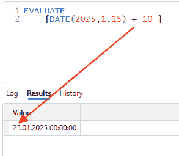
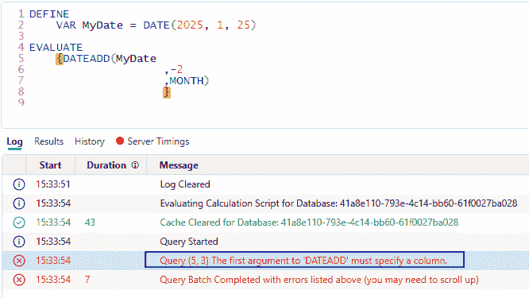
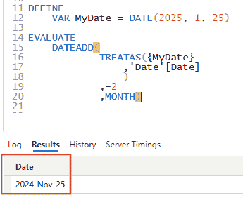
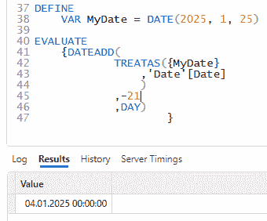
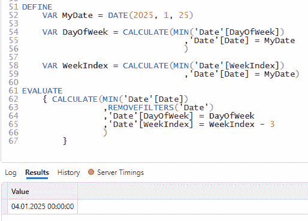

# 如何在 DAX 中进行日期计算

> 原文：[`towardsdatascience.com/how-to-do-date-calculations-in-dax-95e792f65e5e/`](https://towardsdatascience.com/how-to-do-date-calculations-in-dax-95e792f65e5e/)

### *在时间智能计算中，在 DAX 中来回移动时间是常见任务。我们有一些优秀的函数；其中最有用的是 DATEADD。让我们详细了解一下它。*


由[Towfiqu barbhuiya](https://unsplash.com/@towfiqu999999?utm_source=medium&utm_medium=referral)在[Unsplash](https://unsplash.com?utm_source=medium&utm_medium=referral)上的照片

## 这是为了什么？

我在我的过去的一篇文章中展示了[DATEADD()](https://dax.guide/dateadd/)函数的有用性：

> [**探索 DAX 中时间智能的变体**](https://towardsdatascience.com/explore-variants-of-time-intelligence-in-dax-e795545e2a40)

但有时，我们想要做其他事情。

例如，我们有一个固定的日期，想要将其向前或向后移动时间。

如果我们要对几天进行操作，这非常简单：

例如，我想将日期 2025/01/15 向前移动 10 天：



图 1 – 将日期向前移动十天（作者提供的图）

我必须添加花括号，因为 EVALUATE 期望一个表，这些括号从表达式的输出中创建一个表。

但当我们想要对月份、季度、年份或周进行此类操作时怎么办？

## 看一些用例。

DATEADD()函数似乎是我们执行此类任务的明显选择。

在使用 DAX 之前，我使用 T-SQL 为 SQL Server 工作。T-SQL [DATEADD()](https://learn.microsoft.com/en-us/sql/t-sql/functions/dateadd-transact-sql)函数可以用于此目的。

好的，让我们试一试将日期回退两个月，从 2025/01/25 开始：



图 2 – 尝试使用简单的日期变量与 DATEADD()一起使用时出现的错误信息（作者提供的图）

这不起作用，因为我传递了一个日期变量。尽管它看起来直观，但它不起作用。

[文档](https://dax.guide/dateadd/)解释说第一个参数必须是一个包含日期的列。

因此，我们必须说服引擎认为我们传递了一个日期列给函数。

做这件事的一种方法是通过使用[TREATAS()](https://dax.guide/dateadd/):

```py
DEFINE
 VAR MyDate = DATE(2025, 1, 25)

EVALUATE
 DATEADD(
  TREATAS({MyDate}
   ,'Date'[Date]
   )
  ,-2
  ,MONTH)
```

注意，我们不需要花括号，因为 DATEADD()返回一个包含一列的表，在这种情况下，只有一行。

当执行此查询时，DATEADD()认为它从日期表中的[日期]列接收一个值作为参数，并按预期执行计算：



图 3 – 使用 DATEADD() 和 TREATAS() 的固定日期（图由作者提供）

另一种执行此任务的方法是使用日期表并通过传递日期作为过滤器的变量：

```py
DEFINE
    VAR MyDate = DATE(2025, 1, 25)

EVALUATE
    CALCULATETABLE(
                DATEADD('Date'[Date]
                        ,-2
                        ,MONTH)
                ,'Date'[Date] = MyDate
                )
```

结果与之前相同，并且在执行时间上没有明显的差异（在 7 到 10 毫秒之间）。

再次，当查看 DAX.guide 上的文档时，他们使用第二种方法来完成这项工作。

我们可以将第二个表达式更改为获取一个单一值：

```py
DEFINE
    VAR MyDate = DATE(2025, 1, 25)

    VAR Result =
        CALCULATE(DATEADD('Date'[Date]
                        ,-2
                        ,MONTH)
                ,'Date'[Date] = MyDate
                )

EVALUATE
    { Result }
```

这三种方法在功能上几乎相同。然而，区别在于我们可以以不同的方式使用这两种方法。

例如，我们想要计算 2025/01/25 之前 2 个月的在线销售额。

这里是第一种方法：

```py
DEFINE
    VAR MyDate = DATE(2025, 1, 25)

    VAR TargetDate =
                DATEADD(
                        TREATAS({MyDate}
                            ,'Date'[Date]
                            )
                        ,-2
                        ,MONTH)

EVALUATE
{
    CALCULATE([Sum Online Sales]
            ,TargetDate
            )
            }
```

这里是第二种方法：

```py
DEFINE
    VAR MyDate = DATE(2025, 1, 25)

    VAR TargetDate =
                CALCULATE(DATEADD('Date'[Date]
                        ,-2
                        ,MONTH)
                ,'Date'[Date] = MyDate
                )

EVALUATE
{
    CALCULATE([Sum Online Sales]
            ,'Date'[Date] = TargetDate
            )
            }
```

表达式的结果在这里并不重要。

但你注意到区别了吗？

第一个表达式使用 DATEADD 来获取与日期表中的 [日期] 列对齐的表。我可以直接将此表用作 [CALCULATE()](https://dax.guide/calculate/) 中的过滤器。它将遵循过滤器的谱系（起源）并可以直接应用于数据模型。

第二个表达式生成一个单一值并失去了与日期表的谱系。

因此，我们必须使用 = 运算符来过滤日期表。

再次，两种方法返回相同的结果，并且在性能上等效。

## 那么，关于周呢？

使用周进行计算并不像使用 DATEADD() 那样简单，因为这个函数只支持天、月、季度和年。

幸运的是，周总是有 7 天。因此，我们可以通过将 7 天乘以我们想要移动起始日期的周数来回移动。

例如，我想回退三周：

7 x 3 = 21 天：2025/01/25 到 2025/01/04：



图 4 – 从起始日期减去 21 天回退三周（图由作者提供）

对于同一任务，有一个更复杂的模式：

```py
DEFINE
    VAR MyDate = DATE(2025, 1, 25)

    VAR DayOfWeek = CALCULATE(MIN('Date'[DayOfWeek])
                                ,'Date'[Date] = MyDate
                                )

    VAR WeekIndex = CALCULATE(MIN('Date'[WeekIndex])
                                ,'Date'[Date] = MyDate)

EVALUATE
    { CALCULATE(MIN('Date'[Date])
                ,REMOVEFILTERS('Date')
                ,'Date'[DayOfWeek] = DayOfWeek
                ,'Date'[WeekIndex] = WeekIndex - 3
                )
        }
```

在这里，我利用了两个我经常添加到我的日期表中的列：

+   星期几

+   周索引：这个计数从最后数据刷新的周开始计算周数。今天，它是零，当前周之前是 -1，当前周之后是 1 等。

现在，我可以用它们根据这些列执行动态计算。

有趣的是，这个查询版本的性能并不比之前慢。

结果仍然是相同的：



图 5 – 回退三周的更复杂方法（图由作者提供）

但为什么我需要使用更复杂的方法，当减去一些天数会导致相同的结果时？

嗯，这取决于你想要实现什么。我经历过一些场景，在这些场景中，更复杂的方法带来了更多的可能性，并且可以更通用地使用。

在这个特定情况下，第一种方法非常有效。

## 结论

操作日期是在分析或可视化数据时的主要任务之一。

DATEADD() 函数是 DAX 语言工具集的重要组成部分，了解其工作原理以及如何使用它非常重要。

这个函数有三个主要点：

+   输入日期参数应该如何看起来

+   我该如何操作日期以与 DATEADD() 函数一起使用

+   我该如何在度量中使用 DATEADD() 函数的输出

我试图在这篇文章中展示所有这些方法。我希望你觉得这很有帮助。

我将在接下来的文章中展示更多复杂场景，使用这样的附加列可以节省你大量时间——无论是开发时间还是执行时间。

同时，你可以开始将这些技术应用到你的工作中。


Debby Hudson 在 [Unsplash](https://unsplash.com?utm_source=medium&utm_medium=referral) 上的照片

## 参考文献

在这里，这篇文章提到了探索时间智能变体：

> [**探索 DAX 中的时间智能变体**](https://towardsdatascience.com/explore-variants-of-time-intelligence-in-dax-e795545e2a40)

你可以在这里找到更多关于我的日期表的信息：

> [**使用扩展的日期表改进报告的 3 种方法**](https://towardsdatascience.com/3-ways-to-improve-your-reporting-with-an-expanded-date-table-2d983d76cced)

阅读这篇文章了解如何在 DAX-Studio 中提取性能数据以及如何解释它：

> [**如何使用 DAX Studio 从 Power BI 获取性能数据**](https://towardsdatascience.com/how-to-get-performance-data-from-power-bi-with-dax-studio-b7f11b9dd9f9)

[DAX.guide](https://dax.guide/) 中所有时间智能函数的列表：

> [**时间智能 – DAX 指南**](https://dax.guide/functions/time-intelligence/)

就像在我之前的文章中一样，我使用了 Contoso 示例数据集。您可以从微软[这里](https://www.microsoft.com/en-us/download/details.aspx?id=18279)免费下载 ContosoRetailDW 数据集。

根据描述，Contoso 数据可以在 MIT 许可证下自由使用[这里](https://github.com/microsoft/Power-BI-Embedded-Contoso-Sales-Demo)。

我更改了数据集以将数据移至当代日期。

> [**每当 Salvatore Cagliari 发布时，获取电子邮件通知。**](https://medium.com/@salvatorecagliari/subscribe)
