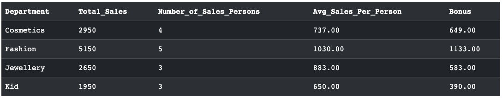

# 如何提高 SQL 代码的安全性和可维护性

> 原文：[`towardsdatascience.com/how-to-enhance-sql-code-security-and-maintainability-3e398b4dd68e/`](https://towardsdatascience.com/how-to-enhance-sql-code-security-and-maintainability-3e398b4dd68e/)


Photo by [FlyD](https://unsplash.com/@flyd2069?utm_source=medium&utm_medium=referral) on [Unsplash](https://unsplash.com?utm_source=medium&utm_medium=referral)

当你编写 SQL 代码来完成公司的一些任务时，你是否曾担心过你的 SQL 代码可能会泄露，并将关键业务逻辑暴露给竞争对手公司？或者你是否注意到，当出现问题时，长而复杂的 SQL 代码非常难以维护和修复？SQL 过程可以解决上述问题，并作为数据专业人士在提升编码技能过程中的关键步骤，尽管并非每个人都足够重视这项技术。

SQL 过程，也称为 SQL 存储过程，是创建并存储在数据库管理系统中的数据库对象，可以通过单次调用执行。它是提高数据库**安全性、模块化**和**代码重用性**的强大工具。

人们经常混淆 SQL UDFs 和 SQL 过程。这两种技术都用于提高 SQL 查询的性能、可维护性和安全性。它们有很多相似之处：两者都允许开发者编写一次 SQL 代码块并在整个应用程序中多次重用，并且两者都可以接受输入参数。由于这些相似之处，两种技术有时可以达到相同的目标。

我将使用模拟数据`promo_sales`来解释它们的相似之处。`promo_sales`是来自百货商店的销售绩效数据，包括字段`Sale_Person_ID`、`Department`和`Sales_Amount`。根据公司政策，销售额的 20%作为奖金支付给每个部门。我们可以编写 SQL 代码来查询部门摘要，包括每人平均销售额和每个部门的奖金。

为了在假日季节提高销售额，公司的高级管理层决定为销售额超过 2000K 美元的部门提供额外的 10%奖金。

```py
CREATE TABLE promo_sales(
  Sale_Person_ID VARCHAR(40) PRIMARY KEY,
  Department VARCHAR(40),
  Sales_Amount INT
);

INSERT INTO promo_sales VALUES ('001', 'Cosmetics', 500);
INSERT INTO promo_sales VALUES ('002', 'Cosmetics', 700);
INSERT INTO promo_sales VALUES ('003', 'Fashion', 1000);
INSERT INTO promo_sales VALUES ('004', 'Jewellery', 800);
INSERT INTO promo_sales VALUES ('005', 'Fashion', 850);
INSERT INTO promo_sales VALUES ('006', 'Kid', 500);
INSERT INTO promo_sales VALUES ('007', 'Cosmetics', 900);
INSERT INTO promo_sales VALUES ('008', 'Fashion', 600);
INSERT INTO promo_sales VALUES ('009', 'Fashion', 1200);
INSERT INTO promo_sales VALUES ('010', 'Jewellery', 900);
INSERT INTO promo_sales VALUES ('011', 'Kid', 700);
INSERT INTO promo_sales VALUES ('012', 'Fashion', 1500);
INSERT INTO promo_sales VALUES ('013', 'Cosmetics', 850);
INSERT INTO promo_sales VALUES ('014', 'Kid', 750);
INSERT INTO promo_sales VALUES ('015', 'Jewellery', 950);
```

如果我们需要更新奖金计算的逻辑，我们就必须重写代码。对于逻辑复杂的项目，这可能会导致挑战。为了解决这个问题，我们可以编写包含两个声明的 UDF，这两个声明分别代表更新前后的逻辑。这种设计显著提高了代码的可维护性。

```py
CREATE FUNCTION dbo.MultiStmt_GetDepartmentSummary()
RETURNS @DeptSummary TABLE 
(
    Department VARCHAR(40),
    Total_Sales INT,
    Number_of_Sales_Persons INT,
    Avg_Sales_Per_Person DECIMAL(10, 2),
    Bonus DECIMAL(10, 2) 
)
AS
BEGIN
    -- First Statement: Initialize the table variable with department sales summary
    INSERT INTO @DeptSummary (Department, Total_Sales, Number_of_Sales_Persons, Avg_Sales_Per_Person, Bonus)
    SELECT 
        Department,
        SUM(Sales_Amount) AS Total_Sales,
        COUNT(DISTINCT Sale_Person_ID) AS Number_of_Sales_Persons,
        AVG(Sales_Amount) AS Avg_Sales_Per_Person,
        SUM(Sales_Amount) * 0.2 AS Bonus
    FROM promo_sales
    GROUP BY Department;  

    -- Second Statement: Update rows in the table variable
    UPDATE @DeptSummary
    SET Bonus = Bonus * 1.1  
    WHERE Total_Sales > 2000;

    -- Return the final table
    RETURN;
END;
GO

-- Usage:
SELECT * FROM dbo.MultiStmt_GetDepartmentSummary();
```

或者，我们可以使用 SQL 过程来生成相同的结果。

```py
-- Creating the stored procedure to achieve the same functionality
CREATE PROCEDURE dbo.GetDepartmentSummary_Proc
AS
BEGIN
    -- Create a temporary table to store the department summary
    CREATE TABLE #DeptSummary 
    (
        Department VARCHAR(40),
        Total_Sales INT,
        Number_of_Sales_Persons INT,
        Avg_Sales_Per_Person DECIMAL(10, 2),
        Bonus DECIMAL(10, 2)
    );

    -- First Statement: Insert department summary into the temporary table
    INSERT INTO #DeptSummary (Department, Total_Sales, Number_of_Sales_Persons, Avg_Sales_Per_Person, Bonus)
    SELECT 
        Department,
        SUM(Sales_Amount) AS Total_Sales,
        COUNT(DISTINCT Sale_Person_ID) AS Number_of_Sales_Persons,
        AVG(Sales_Amount) AS Avg_Sales_Per_Person,
        SUM(Sales_Amount) * 0.2 AS Bonus
    FROM promo_sales
    GROUP BY Department;

    -- Second Statement: Update rows in the temporary table 
    UPDATE #DeptSummary    
    SET Bonus = Bonus * 1.1  
    WHERE Total_Sales > 2000;

    -- Return the final table
    SELECT * FROM #DeptSummary;

    -- Clean up: Drop the temporary table
    DROP TABLE #DeptSummary;
END;
GO

-- Usage:
EXEC dbo.GetDepartmentSummary_Proc;
```



Image by the author (SQL procedure output)

虽然有相似之处，但也有差异，这使开发者在使用 SQL 中的存储过程时具有更大的灵活性。与必须返回值且只能有输入参数的 SQL 函数相比，存储过程不需要返回结果，并且可以选择使用输入/输出参数来实现。在今天的文章中，我将重点介绍 SQL 存储过程的重要特性。

如果你感兴趣 SQL 用户定义函数，你可以参考我的另一篇文章‘***SQL 用户定义函数 (UDFs)***’。

> [**SQL 用户定义函数 (UDFs)**](https://towardsdatascience.com/sql-user-defined-functions-udfs-e385f2887386)

* * *

## SQL 存储过程的语法

### SQL 存储过程的语法

SQL 存储过程的通用语法是：

```py
CREATE PROCEDURE procedure_name(parameters)
AS
BEGIN;
//statements;

END;

EXEC procedure_name;
```

在此语法中，参数是可选的。在创建 SQL 存储过程 `dbo.GetDepartmentSummary_Proc` 时，没有分配任何参数。存储过程包含执行不同任务的多个语句，例如创建表、插入数据、变量计算、变量更新、汇总查询、删除表等。与 SQL UDF 不同，这里没有使用 `RETURN` 语句来返回表，尽管它可以可选地用于返回整数状态值。另一个关键区别是，SQL 存储过程使用 `EXEC` 语句来执行定义的存储过程并获取预期结果。

### 使用默认参数创建存储过程

SQL 存储过程中的默认参数是在执行存储过程时自动使用其值的参数。对于上面创建的存储过程，我们可以包含一个参数，通过特定部门过滤结果。如果没有指定默认参数，存储过程将返回所有部门的摘要。

```py
-- Creating the stored procedure to achieve the same functionality
CREATE PROCEDURE dbo.GetDepartmentSummary_Proc
    @DepartmentFilter VARCHAR(40) = NULL 
AS
BEGIN
    -- Create a temporary table to store the department summaryeh 
    CREATE TABLE #DeptSummary 
    (
        Department VARCHAR(40),
        Total_Sales INT,
        Number_of_Sales_Persons INT,
        Avg_Sales_Per_Person DECIMAL(10, 2),
        Bonus DECIMAL(10, 2)
    );

    -- First Statement: Insert department summary into the temporary table
    INSERT INTO #DeptSummary (Department, Total_Sales, Number_of_Sales_Persons, Avg_Sales_Per_Person, Bonus)
    SELECT 
        Department,
        SUM(Sales_Amount) AS Total_Sales,
        COUNT(DISTINCT Sale_Person_ID) AS Number_of_Sales_Persons,
        AVG(Sales_Amount) AS Avg_Sales_Per_Person,
        SUM(Sales_Amount) * 0.2 AS Bonus
    FROM promo_sales
    WHERE (@DepartmentFilter IS NULL OR Department = @DepartmentFilter)
    GROUP BY Department;

    -- Second Statement: Update rows in the temporary table 
    UPDATE #DeptSummary    
    SET Bonus = Bonus * 1.1  
    WHERE Total_Sales > 2000;

    -- Return the final table
    SELECT * FROM #DeptSummary;

    -- Clean up: Drop the temporary table
    DROP TABLE #DeptSummary;
END;
GO

EXEC dbo.GetDepartmentSummary_Proc @DepartmentFilter = 'Cosmetics';
GO
```

在此示例中，定义了 `@DepartmentFilter` 参数，但当它设置为 `NULL` 时，我们仍然生成所有部门的摘要。通过添加 `WHERE` 子句，我们可以根据参数的值动态地过滤数据。在执行带有参数的存储过程后，这种方法使存储过程在不同场景下更加灵活和可重用。

### 使用输出参数创建 SQL 存储过程

SQL 存储过程中的输出参数是在存储过程执行后可以返回给调用者的参数。使用 SQL 存储过程中的输出参数被认为更有效，因为它通过返回单个值而不是结果集来提高效率。它允许开发者与结果集一起返回附加信息。SQL 存储过程的这一特性提供了在处理数据方面的更多灵活性。

```py
-- Creating the stored procedure to achieve the same functionality
CREATE PROCEDURE dbo.GetDepartmentSummary_Proc
    @TotalDepartments INT OUTPUT
AS
BEGIN
    -- Create a temporary table to store the department summary
    CREATE TABLE #DeptSummary 
    (
        Department VARCHAR(40),
        Total_Sales INT,
        Number_of_Sales_Persons INT,
        Avg_Sales_Per_Person DECIMAL(10, 2),
        Bonus DECIMAL(10, 2)
    );

    -- First Statement: Insert department summary into the temporary table
    INSERT INTO #DeptSummary (Department, Total_Sales, Number_of_Sales_Persons, Avg_Sales_Per_Person, Bonus)
    SELECT 
        Department,
        SUM(Sales_Amount) AS Total_Sales,
        COUNT(DISTINCT Sale_Person_ID) AS Number_of_Sales_Persons,
        AVG(Sales_Amount) AS Avg_Sales_Per_Person,
        SUM(Sales_Amount) * 0.2 AS Bonus
    FROM promo_sales
    GROUP BY Department;

    -- Set the output parameter to the total number of departments processed
    SELECT @TotalDepartments = COUNT(*) 
    FROM #DeptSummary;

    -- Second Statement: Update rows in the temporary table 
    UPDATE #DeptSummary    
    SET Bonus = Bonus * 1.1  
    WHERE Total_Sales > 2000;

    -- Return the final table
    SELECT * FROM #DeptSummary;

    -- Clean up: Drop the temporary table
    DROP TABLE #DeptSummary;
END;
GO

-- Usage:
-- Declare a variable to hold the output parameter value
DECLARE @TotalDepts INT;

-- Execute the procedure and pass the output parameter
EXEC dbo.GetDepartmentSummary_Proc 
    @TotalDepartments = @TotalDepts OUTPUT; -- Capture the output parameter

-- Display the value of the output parameter
PRINT 'Total Departments Processed: ' + CAST(@TotalDepts AS VARCHAR);
```

输出参数 `@TotalDepartments INT OUTPUT` 用于存储部门总数，其值在存储过程执行期间设置，并在存储过程完成后可以打印出来。

* * *

## SQL 存储过程的加密

现在，数据安全已经成为许多公司日益关注的问题。将敏感数据远离未经授权的用户，遵守数据隐私法律法规，以及维护数据完整性，都需要对 SQL 中的存储过程进行加密。

如果你是一名来自关键业务部门的数据工程师或数据分析师，学习如何加密你的 SQL 过程是一项必备技能。加密存储过程相当简单——你只需在创建过程时使用`ENCRYPTION`关键字。该关键字将加密并隐藏源代码。如果有人尝试使用内置函数`sp_helptext`检索源代码，服务器将响应“对象‘procedure_name’的文本已加密。”

```py
CREATE PROCEDURE procedure_name(parameters)
WITH ENCRYPTION
AS
BEGIN;
//statements;

END;

sp_helptext procedure_name;
```

* * *

## 结论

作为关键的先进 SQL 技术之一，存储过程无疑会影响你代码的性能、灵活性、可维护性和效率，并最终对你的数据库管理和数据分析活动产生重大影响。关于 SQL 函数和存储过程哪个更好的争论总是存在。在我看来，选择取决于数据的复杂性和逻辑，要实现的功能，以及预期的输出。你更喜欢哪种技术？请在评论中分享你的想法。

感谢阅读！如果你觉得这篇文章有帮助，请给它一些点赞！关注我并通过电子邮件订阅，以便在发布新文章时收到通知。
