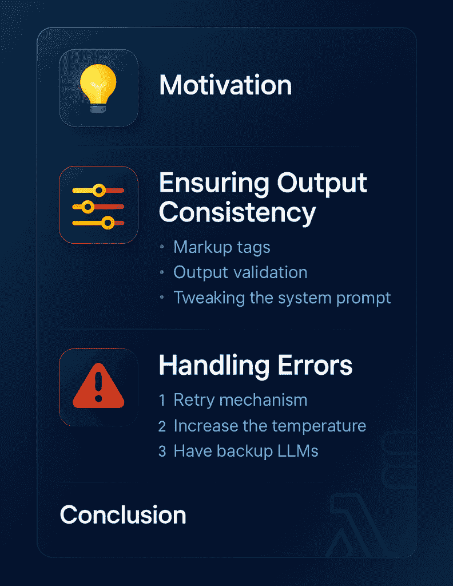

# 如何确保 LLM 应用中的可靠性

> 原文：[`towardsdatascience.com/how-to-ensure-reliability-in-llm-applications/`](https://towardsdatascience.com/how-to-ensure-reliability-in-llm-applications/)

<mdspan datatext="el1752530367282" class="mdspan-comment">LLMs</mdspan>以创纪录的速度进入了计算机科学领域。LLM 是强大的模型，能够有效地执行各种任务。然而，LLM 的输出是随机的，这使得它们不可靠。在这篇文章中，我讨论了如何通过正确提示模型和处理输出，确保你的 LLM 应用中的可靠性。



这张信息图突出了本文的内容。我将主要讨论确保输出一致性和处理错误。图片由 ChatGPT 提供。

您还可以阅读我关于[参加 2025 年巴黎 NVIDIA GTC](https://towardsdatascience.com/how-to-maximize-technical-events-nvidia-gtc-paris-2025/)和[为机器学习创建强大的嵌入](https://eivindkjosbakken.com/2024/02/21/how-to-create-powerful-embeddings-from-your-data-to-feed-into-your-ai/)的文章。

## 目录

+   动机

+   确保输出一致性

    +   标记标签

    +   输出验证

    +   调整系统提示

+   处理错误

    +   重试机制

    +   增加温度

    +   拥有备用 LLM

+   结论

## 动机

我撰写这篇文章的动机是，我一直在使用 LLM 开发新的应用程序。LLM 是通用的工具，可以应用于大多数基于文本的任务，如分类、摘要、信息提取等等。此外，视觉语言模型的出现也使我们能够像处理文本一样处理图像。

我经常遇到我的 LLM 应用程序不一致的问题。有时 LLM 不会以期望的格式响应，或者我无法正确解析 LLM 的响应。当你在生产环境中工作，并且完全依赖于应用程序的一致性时，这是一个大问题。因此，我将讨论我在生产环境中确保应用程序可靠性的技术。

## 确保输出一致性

### 标记标签

为了确保输出一致性，我使用了一种技术，即我的 LLM 以标记标签的形式回答。我使用一个系统提示，例如：

```py
prompt = f"""
Classify the text into "Cat" or "Dog"

Provide your response in <answer> </answer> tags

"""
```

模型几乎总是会以以下方式响应：

```py
<answer>Cat</answer>

or 

<answer>Dog</answer>
```

您现在可以使用以下代码轻松解析出响应：

```py
def _parse_response(response: str):
    return response.split("<answer>")[1].split("</answer>")[0]
```

使用标记标签之所以效果如此之好，是因为这是模型训练成这样行为的方式。当 OpenAI、Qwen、Google 和其他人训练这些模型时，他们使用标记标签。因此，这些模型在利用这些标签方面非常有效，几乎在所有情况下都会遵循预期的响应格式。

例如，随着最近兴起的推理模型，模型首先在标签内进行思考，然后向用户提供答案。

* * *

此外，我还试图在我的提示词中尽可能多地使用标记标签。例如，如果我在向我的模型提供几个示例，我会这样做：

```py
prompt = f"""
Classify the text into "Cat" or "Dog"

Provide your response in <answer> </answer> tags

<example>
This is an image showing a cat -> <answer>Cat</answer>
</example>
<example>
This is an image showing a dog -> <answer>Dog</answer>
</example>
"""
```

我做了两件事来帮助模型在这里表现更好：

1.  我在<example></example>标签内提供例子。

1.  在我的例子中，我确保遵循我自己的预期响应格式，使用<answer></answer>标签

使用标记标签，你可以确保你的 LLM 输出具有高度的统一性

### 输出验证

[Pydantic](https://docs.pydantic.dev/latest/) 是一个你可以用来确保和验证你的 LLM 输出的工具。你可以定义类型，并验证模型的输出是否符合我们预期的类型。例如，你可以根据以下示例进行操作，基于[这篇文章](https://pydantic.dev/articles/llm-intro)：

```py
from pydantic import BaseModel
from openai import OpenAI

client = OpenAI()

class Profile(BaseModel):
    name: str
    email: str
    phone: str

resp = client.chat.completions.create(
    model="gpt-4o",
    messages=[
        {
            "role": "user",
            "content": "Return the `name`, `email`, and `phone` of user {user} in a json object."
        },
    ]
)

Profile.model_validate_json(resp.choices[0].message.content)
```

如你所见，我们提示 GPT 以 JSON 对象的形式回答，然后我们运行 Pydantic 来确保响应符合我们的预期。

* * *

我还想指出，有时简单地创建自己的输出验证函数会更容易。在最后一个例子中，对响应对象的要求基本上是响应对象包含 name、email 和 phone 这些键，并且所有这些键都是字符串类型。你可以在 Python 中使用以下函数进行验证：

```py
def validate_output(output: str):
    assert "name" in output and isinstance(output["name"], str)
    assert "email" in output and isinstance(output["email"], str)
    assert "phone" in output and isinstance(output["phone"], str)
```

这样，你不需要安装任何包，在很多情况下，设置起来也更简单。

### 调整系统提示词

你也可以对系统提示词进行一些其他调整，以确保更可靠的输出。我总是建议尽可能使你的提示词结构化，使用：

+   如前所述的标记标签

+   列表，例如我在这里写的

通常，你也应该始终确保有明确的指令。你可以使用以下方法来确保你的提示词质量

> 如果你将提示词告诉另一个之前从未见过这项任务、对该任务没有任何先验知识的人类，这个人能够有效地完成这项任务吗？

如果你不能让人类完成这项任务，你通常不能期望 AI 完成它（至少目前是这样）。

## 处理错误

在处理 LLM 时，错误是不可避免的。如果你进行了足够的 API 调用，几乎可以肯定有时响应将不会是你期望的格式，或者出现其他问题。

在这些情况下，重要的是你有一个能够处理这些错误的强大应用程序。我使用以下技术来处理错误：

+   重试机制

+   提高温度

+   有备用 LLM

现在，让我逐一详细说明每个要点。

### 指数退避重试机制

考虑到在调用 API 时可能会出现很多问题，实施重试机制是很重要的。你可能会遇到诸如速率限制、输出格式不正确或响应缓慢等问题。在这些情况下，你必须确保将 LLM 调用包裹在 try-catch 中并重试。通常，对于速率限制错误，使用指数退避也是明智的。这样做的原因是确保你等待足够长的时间以避免进一步的速率限制问题。

### 温度提升

我有时也建议稍微提高温度。如果你将温度设置为 0，你告诉模型以确定性的方式行动。然而，有时这可能会产生负面影响。

例如，如果你有一个输入示例，模型未能以适当的输出格式响应。如果你使用 0 的温度重试，你很可能会遇到相同的问题。因此，我建议你将温度设置得稍高一些，例如 0.1，以确保模型具有一定的随机性，同时确保其输出相对确定。

这与许多代理商使用的逻辑相同：更高的温度。

> 他们需要避免陷入循环。提高温度可以帮助他们避免重复的错误。

### 备用 LLM

处理错误的另一种强大方法是拥有备用 LLM。我建议为所有的 API 调用使用一系列 LLM 提供商。例如，你首先尝试[OpenAI](https://openai.com/news/)，如果失败了，你使用[Gemini](https://gemini.google.com/app)，如果还失败了，你可以使用[Claude](https://www.anthropic.com/api)。

这确保了在供应商特定问题发生时的可靠性。这些问题可能包括：

+   服务器宕机（例如，如果 OpenAI 的 API 在一段时间内不可用）

+   过滤（有时，如果 LLM 提供商认为你的请求违反了越狱政策或内容审查，它可能会拒绝回答你的请求）

通常来说，不依赖于单一供应商是一种良好的实践。

## 结论

在这篇文章中，我讨论了如何确保你的 LLM 应用中的可靠性。LLM 应用本质上是随机的，因为你无法直接控制 LLM 的输出。因此，确保你有适当的政策至关重要，既要最小化发生的错误，也要在错误发生时处理它们。

我讨论了以下方法来最小化错误和处理错误：

+   标记标签

+   输出验证

+   调整系统提示

+   重试机制

+   提高温度

+   拥有备用 LLM

如果你将这些技术结合到你的应用中，你可以实现一个强大且健壮的 LLM 应用。

**👉 在社交平台上找到我：**

**👉 我的免费电子书和网络研讨会：**

📚 [获取我的免费视觉语言模型电子书](https://eivindkjosbakken.com/ebook)

💻 [我的视觉语言模型网络研讨会](https://www.eivindkjosbakken.com/webinar)

**👉 在社交平台上找到我：**

📩 [订阅我的通讯](https://eivindkjosbakken.com/newsletter)

🧑‍💻 [联系我](https://eivindkjosbakken.com/)

🔗 [LinkedIn](https://www.linkedin.com/in/eivind-kjosbakken/)

🐦 [X / Twitter](https://x.com/EivindKjos)

✍️ [Medium](https://oieivind.medium.com/)
