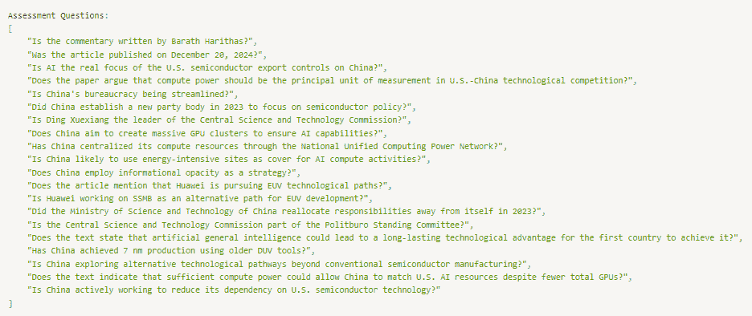

# 如何评估 LLM 摘要

> 原文：[`towardsdatascience.com/how-to-evaluate-llm-summarization-18a040c3905d/`](https://towardsdatascience.com/how-to-evaluate-llm-summarization-18a040c3905d/)


图片来自 Unsplash

**摘要** 是 LLMs 启动的最实用和方便的任务之一。然而，与其他 LLM 任务（如提问或分类）相比，评估 LLMs 在摘要上的表现要困难得多。

因此，我自己也忽视了摘要的评估，尽管我开发的两个应用程序严重依赖摘要（*Podsmart* 摘要播客，而 *[aiRead](https://www.airead.me/)* 则根据您的突出显示创建个性化的 PDF 摘要）。

但最近，我受到了启发——多亏了 AI 行业思想领袖的深刻见解——认识到评估在系统地评估和改进 LLM 系统中的关键作用。（[[链接](https://applied-llms.org/)](https://hamel.dev/blog/posts/evals/) 和链接）。这激励我开始研究摘要的评估。

因此，在这篇文章中，我将讨论一个 **易于实施、基于研究和量化的框架来评估摘要**，它改进了 Confident AI 创建的 [DeepEval](https://docs.confident-ai.com/docs/getting-started) 框架中的摘要指标。

我将通过一个示例笔记本（代码在 [Github](https://github.com/thamsuppp/summary-eval-article)）来展示我的过程，尝试评估一篇约 2500 字文章的约 500 字摘要 *Securing the AGI Laurel: Export Controls, the Compute Gap, and China’s Counterstrategy*（可在 [这里](https://www.csis.org/analysis/securing-agi-laurel-export-controls-compute-gap-and-chinas-counterstrategy)找到，发表于 2024 年 12 月）。

### 目录

∘ 为什么评估摘要很难 ∘ 什么使摘要好 ∘ DeepEval 简介 ∘ DeepEval 的摘要指标 ∘ 改进摘要指标 ∘ 简洁性指标 ∘ 连贯性指标 ∘ 综合起来 ∘ 未来工作

### **为什么评估摘要很难**

在我开始之前，让我详细说明为什么我认为摘要的评估是一个困难的任务。

首先，摘要的输出本质上是开放式的（与分类或实体提取等任务不同）。因此，什么使摘要变得好，取决于诸如流畅性、连贯性和一致性等定性指标，这些指标难以进行定量测量。此外，这些指标往往是主观的——例如，相关性取决于上下文和受众。

其次，创建用于评估系统摘要的带有金标签的数据集是困难的。对于 RAG，创建一个合成问题-答案对的数据集来评估检索器是直接的（参见这个[很好的教程](https://playbooks.capdev.govtext.gov.sg/appendix_dataset/))。

对于摘要，没有明显的自动生成参考摘要的方法，所以我们不得不求助于人类来创建它们。虽然研究人员已经整理了摘要数据集，但这些数据集不会针对您的特定用例进行定制。

第三，我发现学术文献中的大多数摘要指标都不适合以实用为导向的 AI 开发者实现。一些论文训练了神经摘要指标（例如[Seahorse](https://github.com/google-research-datasets/seahorse)，[Summac](https://github.com/tingofurro/summac)等），这些指标有数 GB 大，并且在大规模运行时具有挑战性（*也许我只是懒惰，应该学习如何在本地和 GPU 集群上运行 HuggingFace 模型，但这对大多数人来说仍然是一个入门障碍*）。其他传统指标，如 BLEU 和 ROUGE，依赖于精确的单词/短语重叠，并且是在 LLM 时代之前为提取式摘要而创建的，可能不适合评估由 LLM 生成的抽象摘要，这些摘要可能会改写源文本。

然而，根据我的经验，人类很容易区分一个好的摘要和一个不好的摘要。一种常见的失败模式是含糊其辞和拐弯抹角（例如，“*这个摘要描述了……的原因”）。*

### **什么是一个好的摘要**

那么，一个好的摘要是什么样的呢？Eugene Yan 的[文章](https://eugeneyan.com/writing/abstractive/)对各种摘要指标提供了很好的细节。对我来说，我会将它们提炼成 4 个关键品质：

1.  **相关** – 摘要保留了源文本中的重要观点和细节

1.  **简洁** – 摘要信息密集，不会多次重复相同的内容，也不会冗长

1.  **连贯** – 摘要有良好的结构，易于理解，不仅仅是压缩的事实杂乱无章

1.  **忠实** – 摘要不会凭空捏造与源文本不支持的信息

一个关键的见解是，您实际上可以将前两点表述为一个**精确度和召回率**问题——摘要中保留了源文本中多少事实（**召回率**），以及摘要中有多少事实得到了主要文本的支持（**精确率**）。

这种表述将我们带回到了机器学习中更熟悉的分类问题领域，并提出了一种定量评估摘要的方法。

这里的一些差异是：首先，在保持摘要长度不变的情况下，更高的召回率更好。您不希望得到 100%的召回率，而摘要的长度与源文本相同。其次，理想情况下，您希望精确度尽可能接近 100%——捏造信息是非常糟糕的。我稍后会回到这些内容。

### **DeepEval 简介**

在所有不同的 LLM 评估框架中，您将有很多选择——从 Braintrust 到 Langfuse 以及更多。然而，今天我将使用 DeepEval，这是一个非常用户友好的框架，可以快速入门，无论是总体上还是具体到摘要。

DeepEval 为许多关键的 RAG 度量标准提供了易于使用的现成实现，并且它有一个基于思维链的 LLM 作为裁判的工具 GEval，让您可以定义任何想要的定制标准（我稍后会使用它）

此外，它还提供了有用的基础设施来组织和加速评估：他们已经使用异步很好地**并行化**了一切，因此您可以快速运行整个数据集的评估。他们有方便的**合成**数据生成功能（将在后续文章中介绍），并允许您定义**自定义度量标准**以适应他们的度量标准（这正是我们今天要做的），或者定义基于非 LLM 的评估度量标准以进行更经济高效且更稳健的评估（例如，实体密度，稍后）。

### **DeepEval 的摘要度量标准**

DeepEval 的摘要度量标准（了解更多信息[这里](https://docs.confident-ai.com/docs/metrics-summarization)）是一个无参考度量标准（即不需要黄金标准摘要），只需要源文本（您将其作为“输入”字段）和要评估的生成的摘要（“实际输出”字段）。如您所见，下面的设置和评估代码非常简单！

```py
# Create a DeepEval test case for the purposes of the evaluation
test_case = LLMTestCase(
  input = text,
  actual_output = summary
)

# Instantiate the summarization metric
summarization_metric = SummarizationMetric(verbose_mode = True, n = 20, truths_extraction_limit = 20)

# Run the evaluation on the test case
eval_result = evaluate([test_case], [summarization_metric])
```

摘要度量标准实际上在幕后评估两个单独的组件：**对齐**和**覆盖率**。这些与之前我介绍的**精确度**和**召回率**公式密切相关！

对于对齐，评估器 LLM 从摘要中生成一系列**主张**，对于每个主张，LLM 将确定有多少这些主张得到了从源文本中提取的**真相**的支持，从而产生**对齐得分**。

在覆盖率的案例中，LLM 从源文本生成一系列评估问题，然后尝试使用仅作为上下文的摘要来回答这些问题。如果找不到答案，LLM 将被提示回答“idk”。然后，LLM 将确定这些答案中有多少是正确的，以获得**覆盖率得分**。

最终的摘要得分是对齐得分和覆盖率得分中的最小值。

### **改进摘要度量标准**

然而，尽管 DeepEval 做的事情是一个很好的起点，但当前形式下，有三个关键问题阻碍了摘要度量标准的可靠性和实用性。

因此，我构建了一个**自定义摘要度量标准**，它适应了 DeepEval 的版本。以下，我将解释每个问题和为克服这些问题而实施的相应解决方案：

**1: 使用是/否问题作为覆盖率度量标准过于简单**

目前，评估问题被限制为是/否问题，其中问题的答案是肯定的——看看这些问题：



图片由作者提供

这个方法有两个问题：

首先，通过将问题表述为二元的“是/否”，这限制了它们的信息量，特别是在确定细微的定性点方面。

其次，如果用于回答摘要的 LLM（由于只有三个可能的答案：“是”、“否”、“不知道”，因此它不太可能不产生“是”的幻觉），评估者会错误地认为这个答案是正确的。对于开放性问题，要产生正确的答案要困难得多。此外，如果你看看这些问题，它们几乎是以一种巧妙的方式提出的，几乎暗示答案应该是“是”（例如，“中国是否将信息不透明作为一项策略？”），这增加了产生幻觉“是”的可能性。

我的解决方案是要求 LLM 从源文本中**生成开放性问题**——在代码中，这些被称为“复杂问题”。

此外，我还要求 LLM 分配**问题的权重**（这样我们可能可以在覆盖率分数中提高更重要问题的权重）。

由于现在的问题是开放式的，我使用一个**LLM 进行评估**——我要求 LLM 给出一个**0-5 分的评分，以表示**从摘要生成的答案与使用源文本（参考答案）生成的答案的相似程度，以及一个解释。

```py
def generate_complex_verdicts(answers):
    return f"""You are given a list of JSON objects. Each contains 'original_answer' and 'summary_answer'.
    Original answer is the correct answer to a question. 
    Your job is to assess if the summary answer is correct, based on the model answer which is the original answer.
    Give a score from 0 to 5, with 0 being completely wrong, and 5 being completely correct.
    If the 'summary_answer' is 'idk', return a score of 0.

    Return a JSON object with the key 'verdicts', which is a list of JSON objects, with the keys: 'score', and 'reason': a concise 1 sentence explanation for the score.
..."""

def generate_complex_questions(text, n):
        return f"""Based on the given text, generate a list of {n} questions that can be answered with the information in this document.
        The questions should be related to the main points of this document. 
        Then, provide a concise 1 sentence answer to the question, using only information that can be found in the document.
        Answer concisely, your answer does not need to be in full sentences.
        Make sure the questions are different from each other. 
        They should cover a combination of questions on cause, impact, policy, advantages/disadvantages, etc.

        Lastly, rate the importance of this question to the document on a scale of 1 to 5, with 1 being not important and 5 being most important. 
        Important question means the question is related to an essential or main point of the document,
        and that not knowing the answer to this question would mean that the reader has not understood the document's main point at all.
        A less important question is one asking about a smaller detail, that is not essential to understanding the document's main point.

 ..."""
```

**2: 从源文本中提取真理以进行对齐是有缺陷的**

目前，对于对齐指标，使用 LLM 从源文本中提取一个**真理列表**（有一个可以控制的参数`truths_extraction_limit`）。这导致源文本中的一些事实/细节被省略在真理之外，然后摘要的论点与之进行比较。

说实话，我不确定团队当时是如何想的，他们这样实施——也许我错过了一个细微差别，或者误解了他们的意图。

然而，这导致两个问题，使得对齐分数“不可用”，根据 GitHub 上的一个[用户](https://github.com/confident-ai/deepeval/issues/937)的说法。

首先，LLM 生成的真理列表是非确定性的，因此[人们已经报告](https://github.com/confident-ai/deepeval/issues/565)对齐分数变化很大。这种不一致性可能源于 LLM 每次选择不同的真理子集。更重要的是，真理提取过程使得这并不是对摘要忠实度的一个公平评判，因为摘要中的一个细节可能在源文本中找到，但不在提取的真理中。据观察，所有被检测为不忠实的事实确实在正文中有，但不在提取的真理中。此外，人们报告说，当你将摘要作为输入传递时，对齐分数小于 1，这很奇怪。

为了解决这个问题，我仅仅做了一个简单的调整——那就是将**整个源文本**传递给评估摘要声明的 LLM，而不是传递真理列表。由于所有声明都在一个 LLM 调用中一起评估，这不会显著增加 token 成本。

**3: 最终得分取对齐得分和覆盖得分的较小值是错误的**

目前输出的分数是对齐得分和覆盖得分的较小值（实际上没有方法可以访问这些分数，除非将它们放入日志中）。

这是有问题的，因为覆盖得分可能会低于对齐得分（如果不是，那么就真的有问题了！）。这意味着对齐得分的改变不会影响最终得分。然而，这并不意味着我们可以忽视对齐得分的下降（例如从 1 到 0.8），这可能会被认为是摘要存在更严重问题的信号（即产生了虚假的声明）。

我的解决方案是将**最终得分改为 F1 得分**，就像在机器学习分类中一样，以捕捉精确度和召回率的重要性。一个扩展是改变精确度和召回率的权重。（例如，如果你认为幻觉是无论如何都要避免的事情——参见[这里](https://stats.stackexchange.com/questions/559736/is-there-a-metric-that-combines-recall-and-precision-other-than-the-f1-score)）

通过这三个变化，摘要指标现在更好地反映了生成摘要的相关性和忠实度。

### **简洁度指标**

然而，这仍然只提供了一个不完整的画面。摘要还应该**简洁**且信息密集，将关键信息压缩成更短的形式。

**实体密度**是一个有用且成本低的指标。Chain-of-Density 论文显示，人类创建的摘要以及人类偏好的 AI 生成的摘要，其实体密度约为 0.15 个实体/标记，在清晰度（倾向于较少的密度）和信息量（倾向于较多的密度）之间取得了平衡。

因此，我们可以创建一个**密度分数**，惩罚实体密度远离 0.15（要么过于密集，要么不够密集）的摘要。初始的 AI 生成的摘要通常密度较低（0.10 或更低），而 Chain-of-Density [论文](https://arxiv.org/pdf/2309.04269)展示了一个迭代过程来增加摘要的密度。Ivan Leo 和 Jason Liu 撰写了一篇很好的[文章](https://python.useinstructor.com/blog/2023/11/05/chain-of-density/)，介绍了使用实体密度作为关键指标微调 Chain-of-Density 摘要的方法。

```py
import nltk
import spacy
nlp = spacy.load("en_core_web_sm")

def get_entity_density(text):
  summary_tokens = nltk.word_tokenize(text)
  num_tokens = len(summary_tokens)
  # Extract entities
  doc = nlp(text)
  num_entities = len(doc.ents)
  entity_density = num_entities / num_tokens
  return entity_density
```

接下来，我使用一个**句子模糊度**指标来明确惩罚那些没有实际陈述关键信息的模糊句子（例如，“*这个总结描述了……的原因”*）。

对于这一点，我将摘要分解成句子（类似于对齐指标），并要求 LLM 判断每个句子是否模糊，最终得分是分类为模糊的句子的比例。

```py
prompt = ChatPromptTemplate.from_template(
    """You are given a list of sentences from a summary of a text.
    For each sentence, your job is to evaluate if the sentence is vague, and hence does not help in summarizing the key points of the text.

    Vague sentences are those that do not directly mention a main point, e.g. 'this summary describes the reasons for China's AI policy'. 
    Such a sentence does not mention the specific reasons, and is vague and uninformative.
    Sentences that use phrases such as 'the article suggests', 'the author describes', 'the text discusses' are also considered vague and verbose.
  ...
    OUTPUT:"""
)

class SentenceVagueness(BaseModel):
    sentence_id: int
    is_vague: bool
    reason: str

class SentencesVagueness(BaseModel):
    sentences: List[SentenceVagueness]

chain = prompt | llm.with_structured_output(SentencesVagueness)
```

最后，重复相同信息的总结是不高效的，因为它浪费了本可以用来传达新有意义的见解的宝贵空间。

因此，我们使用 **GEval** 构建了一个 **重复性** 分数。正如我上面简要提到的，GEval 使用具有思维链的 LLM 作为评判者来评估任何自定义标准。由于检测重复概念是一个更复杂的问题，我们需要一个更智能的检测器，也就是一个 LLM。(*警告：这个指标的结果似乎相当不稳定 – 当我反复在相同的输入上运行它时，LLM 会改变它的答案。也许可以尝试一些提示工程)*

```py
from deepeval.metrics import GEval
from deepeval.test_case import LLMTestCaseParams

repetitiveness_metric = GEval(
    name="Repetitiveness",
    criteria="""I do not want my summary to contain unnecessary repetitive information.
    Return 1 if the summary does not contain unnecessarily repetitive information, and 0 if the summary contains unnecessary repetitive information.
    facts or main points that are repeated more than once. Points on the same topic, but talking about different aspects, are OK. In your reasoning, point out any unnecessarily repetitive points.""",
    evaluation_params=[LLMTestCaseParams.ACTUAL_OUTPUT],
    verbose_mode = True
)
```

### **连贯性指标**

最后，我们希望确保 LLM 输出是连贯的 – 具有逻辑流程，相关点放在一起，并实现平滑过渡。Meta 的最近大型概念模型 [论文](https://arxiv.org/pdf/2412.08821) 使用了 Parola 等人（2023）的局部连贯性指标 – 每个第 n 个和第 n+2 个句子之间的平均余弦相似度。这是一个简单且易于实现的指标。我们发现 LLM 总结的分数约为 ~0.45。作为一个感觉检查，如果我们随机排列总结中的句子，连贯性分数会低于 0.4。

```py
# Calculate cosine similarity between each nth and n+2th sentence
def compute_coherence_score(sentences):
  embedding_model = OpenAIEmbeddings(model="text-embedding-3-small")
  sentences_embeddings = embedding_model.embed_documents(sentences)
  sentence_similarities = []
  for i in range(len(sentences_embeddings) - 2):
    # Convert embeddings to numpy arrays and reshape to 2D
    emb1 = np.array(sentences_embeddings[i])
    emb2 = np.array(sentences_embeddings[i+2])
    # Calculate cosine distance
    distance = cosine(emb1, emb2)
    similarity = 1 - distance
    sentence_similarities.append(similarity)
  coherence_score = np.mean(sentence_similarities)
  return coherence_score
```

### **综合来看**

我们可以将上述每个指标打包成自定义指标。好处是，我们可以在你的总结数据集上并行评估所有这些指标，并在一个地方获得所有结果！（见[代码笔记本](https://github.com/thamsuppp/summary-eval-article/blob/main/summary_eval_article_notebook.ipynb)）

然而，有一个注意事项，对于一些这些指标，如连贯性或召回率，对于总结的“最佳”值没有明确的概念，我们只能比较不同 AI 生成的总结的分数，以确定哪个更好或更差。

### **未来工作**

我在这篇文章中介绍的内容为评估你的总结提供了一个坚实的起点！

虽然它并不完美，但仍有未来探索和改进的空间。

一个方面是更好地测试总结是否捕捉到了源文本中的 **重要点**。你不想得到一个召回率很高的总结，但其中包含的是不重要的细节。

目前，当我们生成评估问题时，我们会要求 LLM 评估其 **重要性**。然而，将这些重要性评分作为事实真相也很困难 – 如果你这么想的话，当 LLM 总结时，它们本质上也在评估不同事实的重要性。因此，我们需要一个 **LLM 之外的重要性** 度量。当然，理想的情况是拥有人类参考总结，但这些既昂贵又不可扩展。另一个参考总结的来源是带有执行摘要的报告（例如，财务提案、幻灯片演示文稿的结论、论文的摘要）。我们还可以使用像嵌入的 PageRank 这样的技术来算法性地识别中心概念。

一个值得尝试的有趣想法是生成**合成源文章**——从一个给定主题的主要观点（代表真实“重要”观点）开始，然后让 LLM 扩展成完整的文章（多次使用高温运行以生成许多多样化的合成文章！）。然后运行完整的文章通过摘要过程，并评估摘要是否保留了原始的主要观点。

最后但同样重要的是，确保我介绍的所有摘要指标都与人类对摘要偏好的评估**相关联**。虽然研究人员已经在大型摘要数据集上对某些指标进行了这样的操作，但这些发现可能不适用于你的文本和/或受众。（也许你的公司更喜欢特定风格的摘要，例如包含许多统计数据）。

关于这个话题的精彩讨论，请参阅 Hamel Husain 关于评估的文章中的“Level 2”部分。[文章链接](https://hamel.dev/blog/posts/evals/#automated-evaluation-w-llms)。例如，如果你发现 LLM 的句子模糊度评分与你认为的模糊句子相关性不好，那么一些提示工程（提供模糊句子的例子，进行更多阐述）可能会希望提高相关性。

尽管这一步可能耗时，但它对于确保你可以信赖 LLM 评估是至关重要的。从长远来看，这也会为你节省时间——当你的 LLM 评估对齐时，你实际上获得了一个无限可扩展的、针对你需求和偏好的定制化评估器。

你可以通过创建一个易于使用的 Gradio 注释界面来加速你的人类评估过程——我一次性使用 OpenAI o1 创建了一个不错的界面！

在未来的文章中，我将讨论如何实际使用这些见解来改进我的摘要过程。两年前我[写了](https://medium.com/towards-data-science/summarize-podcast-transcripts-and-long-texts-better-with-nlp-and-ai-e04c89d3b2cb)关于如何摘要长文本的文章，但 LLM 的进步和两年来的经验导致我的摘要方法发生了巨大变化。

非常感谢阅读！如果你错过了，所有代码都可以在 GitHub 仓库[这里](https://github.com/thamsuppp/summary-eval-article)找到。在[X/Twitter](https://x.com/thamsuppp)上关注我，了解更多关于 AI 的帖子！

你使用哪些指标来评估 LLM 摘要？在评论中告诉我！
