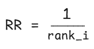
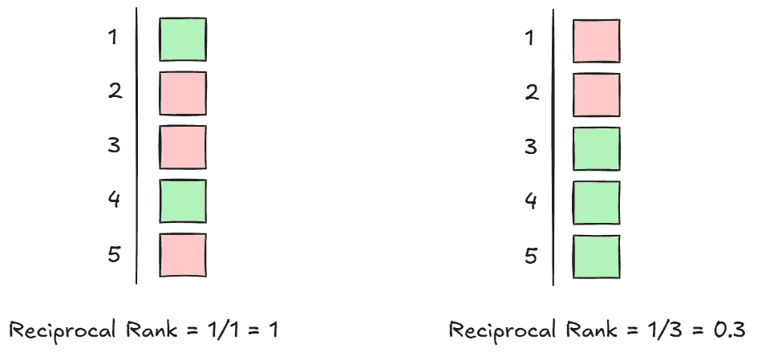
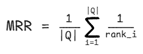
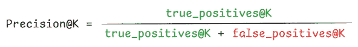
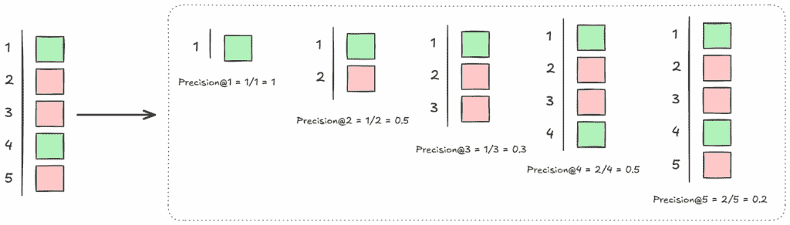
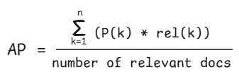

# 如何评估 RAG 管道的检索质量（第二部分）：平均倒数排名 (MRR) 和平均精度 (AP)

> 原文：[`towardsdatascience.com/how-to-evaluate-retrieval-quality-in-rag-pipelines-part-2-mean-reciprocal-rank-mrr-and-average-precision-ap/`](https://towardsdatascience.com/how-to-evaluate-retrieval-quality-in-rag-pipelines-part-2-mean-reciprocal-rank-mrr-and-average-precision-ap/)

*如果您错过了**第一部分：[如何评估 RAG 管道的检索质量](https://towardsdatascience.com/how-to-evaluate-retrieval-quality-in-rag-pipelines-precisionk-recallk-and-f1k/)**，请在此处查看[**这里**](https://towardsdatascience.com/how-to-evaluate-retrieval-quality-in-rag-pipelines-precisionk-recallk-and-f1k/)*

[在我之前的文章中](https://towardsdatascience.com/how-to-evaluate-retrieval-quality-in-rag-pipelines-precisionk-recallk-and-f1k/), 我探讨了为什么评估 RAG 管道的检索质量很重要，以及进行此类评估的一些基本指标。更具体地说，第一部分主要关注二元、无序度量的指标，本质上是在评估检索集中是否存在相关结果。在这第二部分，我们将进一步探讨二元、有序度量的指标。也就是说，这些指标不仅考虑了相关结果被检索的排名，而且还评估了它是否被检索。因此，在这篇文章中，我们将更深入地探讨两个常用的二元、有序度量指标：**平均倒数排名 (MRR)** 和 **平均精度 (AP)**。

* * *

## 为什么排名在检索评估中很重要

在 RAG 管道中，有效的检索非常重要，因为一个好的检索机制是生成有效答案的第一步，这些答案基于我们的文档。否则，如果包含所需信息的正确文档最初无法识别，那么任何人工智能魔法都无法解决这个问题并提供有效答案。

我们可以将检索质量评估的指标分为两大类：二元和分级指标。更具体地说，二元指标将检索到的片段分类为相关或不相关，没有中间状态。另一方面，当使用分级指标时，我们认为一个片段对用户查询的相关性更像是一个连续体，因此，检索到的片段可以更有或更少的相关性。

二进制度量可以进一步分为无序度量和无序度量。无序度量评估一个块是否存在于检索集中，而不考虑它是如何检索的排名。[在我的最新文章中，](https://towardsdatascience.com/how-to-evaluate-retrieval-quality-in-rag-pipelines-precisionk-recallk-and-f1k/) 我们详细探讨了最常见的二进制无序度量，并在 Python 中进行了深入的代码示例。具体来说，我们讨论了**HitRate@K, Precision@K, Recall@K, 和 F1@K**。相比之下，二进制有序度量除了考虑块是否存在于检索集中，还考虑了它们检索时的**排名**。

因此，在今天的文章中，我们将更详细地探讨最常用的二进制有序检索指标，如**MRR**和**AP**，并检查这些如何在 Python 中计算。

* * *

*我在[**DataCream**](https://datacream.substack.com/)上写文章，在那里我正在学习和实验 AI 和数据。[在这里订阅](https://datacream.substack.com/)与我一起学习和探索。

* * *

## 一些有序的二进制度量

因此，像 Precision@K 或 Recall@K 这样的无序二进制度量告诉我们正确的文档是否在顶部 k 个块中的某个地方，但并不指示文档是在这些 k 个块中的顶部还是底部得分。而正是这种确切的信息是有序度量为我们提供的。一些非常有用且常用的无序度量是**平均倒数排名（MRR）**和**平均精度（AP）**。但让我们更详细地看看所有这些。

### 🎯 平均倒数排名（MRR）

用于评估检索的一个常用的有序度量是[平均倒数排名（MRR）](https://en.wikipedia.org/wiki/Mean_reciprocal_rank)。退一步说，倒数排名（RR）表示第一个真正相关的结果在顶部 k 个检索结果中的排名。更确切地说，它衡量第一个相关结果在排名中的位置有多高。RR 可以按照以下方式计算，其中*rank_i*是第一个相关结果被找到的排名：



图片由作者提供

我们还可以通过以下示例直观地探索这个计算：



图片由作者提供

我们现在可以组合**平均倒数排名（MRR）**。MRR 表示不同结果集中第一个相关项的平均位置。



图片由作者提供

这样，MRR 的范围可以从 0 到 1。也就是说，MRR 越高，第一个相关文档在排名中的位置就越高。

一个现实生活中的例子，其中像 MRR 这样的度量标准可以用于评估 RAG 管道的检索步骤，就是任何需要快速决策的环境，我们需要确保真正相关的结果出现在搜索结果的顶部。这对于评估只需要一个相关结果，且重要信息没有分散在多个文本块中的系统来说效果很好。

将 MRR 作为检索评估指标进一步理解的好比喻是 Google 搜索。我们认为 Google 是一个好的搜索引擎，因为你可以从顶部结果中找到你想要的东西。如果你不得不滚动到结果 150 才能找到你想要的东西，你就不会认为它是一个好的搜索引擎。同样，在 RAG 管道中，一个好的向量搜索机制应该将相关块展示在合理的排名中，从而获得合理的 MRR 分数。

### 🎯 平均精度 (AP)

在我之前关于二元、无序检索度量的帖子中，我们特别关注了 Precision@k。特别是，Precision@k 表示在检索到的前 k 个文档中有多少确实是相关的。Precision@k 可以按以下方式计算：



图片由作者提供

**平均精度 (AP)** 在这个想法的基础上进一步发展。更具体地说，为了计算 AP，我们首先需要迭代地计算每次出现新的、相关项目时的 Precision@k。然后我们可以通过简单地计算这些 Precision@k 分数的平均值来计算 AP。

但让我们看看这个计算的说明性例子。对于这个示例集，我们注意到在 k = 1 和 k = 4 时，检索集中引入了新的相关块。



图片由作者提供

因此，我们计算 Precision@1 和 Precision@4，然后取它们的平均值。这将等于(1/1 + 2/4)/ 2 = (1 + 0.5)/ 2 = 0.75。

我们可以将 AP 的计算推广如下：



图片由作者提供

再次强调，AP 的范围从 0 到 1。更具体地说，AP 分数越高，我们的检索系统将相关文档排名在顶部的连贯性就越高。换句话说，检索到的相关文档越多，它们在无关文档之前出现的频率就越高。

与只关注第一个相关结果的 MRR 不同，AP 考虑了所有检索到的相关块的排名。它本质上量化了在检索真正相关项目时，我们得到多少或多少垃圾信息，对于各种 top k。

为了更好地理解 AP 和 MRR，我们还可以想象它们在 Spotify 播放列表的背景下。与 Google 搜索示例类似，高 MRR 意味着播放列表中的第一首歌是我们的最爱。相反，高 AP 意味着*整个播放列表*都很好，我们许多最爱的歌曲频繁出现在播放列表的顶部。

## 那么，我们的向量搜索怎么样？

通常，我会用《战争与和平》的例子继续这一部分，就像我在我的其他 [RAG 教程](https://towardsdatascience.com/rag-explained-reranking-for-better-answers/) 中所做的那样。然而，完整的检索代码变得相当庞大，无法包含在每一篇文章中。因此，在这篇文章中，我将专注于展示如何在 Python 中计算这些指标，并尽可能使示例简洁。

无论如何！让我们看看如何在 Python 中实际计算 RAG 管道的 **MRR** 和 **AP**。我们可以定义计算 **RR** 和 **MRR** 的函数如下：

```py
from typing import List, Iterable, Sequence

# Reciprocal Rank (RR)
def reciprocal_rank(relevance: Sequence[int]) -> float:
    for i, rel in enumerate(relevance, start=1):
        if rel:
            return 1.0 / i
    return 0.0

# Mean Reciprocal Rank (MRR)
def mean_reciprocal_rank(all_relevance: Iterable[Sequence[int]]) -> float:
    vals = [reciprocal_rank(r) for r in all_relevance]
    return sum(vals) / len(vals) if vals else 0.0
```

我们已经在之前的文章中计算了**Precision@k**，如下所示：

```py
# Precision@k
def precision_at_k(relevance: Sequence[int], k: int) -> float:
    k = min(k, len(relevance))
    if k == 0: 
        return 0.0
    return sum(relevance[:k]) / k
```

在此基础上，我们可以将**平均精度（AP）**定义为如下：

```py
def average_precision(relevance: Sequence[int]) -> float:
    if not relevance:
        return 0.0
    precisions = []
    hit_count = 0
    for i, rel in enumerate(relevance, start=1):
        if rel:
            hit_count += 1
            precisions.append(hit_count / i)   # Precision@i
    return sum(precisions) / hit_count if hit_count else 0.0
```

这些函数都接受一个二元相关性标签列表作为输入，其中 1 表示检索到的片段与查询相关，而 0 表示不相关。在实践中，这些标签是通过将检索结果与真实集进行比较生成的，[正如我们在第一部分中计算 Precision@K 和 Recall@K 时所做的那样](https://towardsdatascience.com/how-to-evaluate-retrieval-quality-in-rag-pipelines-precisionk-recallk-and-f1k/)。这样，对于每个查询（例如，“*谁是安娜·帕夫洛夫娜？*”），我们根据每个检索到的片段是否包含答案文本生成一个二元相关性列表。然后，我们可以使用上述函数计算所有指标。

另一个我们可以计算的、有顺序感知的度量指标是**平均平均精度（MAP）**。正如你可以想象的那样，MAP 是不同检索集合的平均 AP 值。例如，如果我们计算我们 RAG 管道中三个不同测试问题的 AP，MAP 分数告诉我们所有这些问题的整体排名质量。

## 在我心中

在本系列的第一个部分中我们看到的不考虑顺序的二进制度量，如**HitRate@k、Precision@k、Recall@k 和 F1@k**，可以为我们评估 RAG 管道的检索性能提供有价值的信息。然而，这些度量指标只能告诉我们相关文档是否存在于检索集中。

本文中回顾的二进制顺序感知度量，如**平均倒数排名（MRR）和平均精度（AP）**，可以为我们提供更深入的见解，因为它们不仅告诉我们相关文档是否存在于检索结果中，还告诉我们它们的排名有多好。这样，我们可以更好地了解我们的 RAG 管道的检索机制在特定任务和文档类型上的表现。

请期待下一部分和系列的最后一部分，我将讨论 RAG 管道的**分级检索评估度量**。

* * *

*喜欢这篇文章？让我们成为朋友！加入我：*

📰***[Substack](https://datacream.substack.com/)*** 💌* **[Medium](https://medium.com/@m.mouschoutzi)*** 💼***[LinkedIn](https://www.linkedin.com/in/mariamouschoutzi/)*** ☕***[请我喝咖啡](http://buymeacoffee.com/mmouschoutzi)!***

* * *

## pialgorithms 是什么？

想要将 RAG 的力量带入您的组织？

[**pialgorithms**](https://pialgorithms.com/) 可以为您做到 ***👉 ***[***预约演示***](https://pialgorithms.com/#contact)*** 今天
