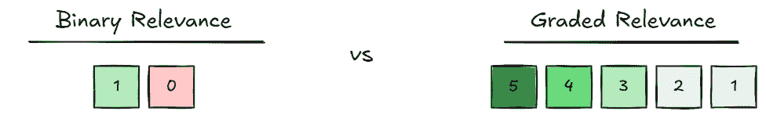
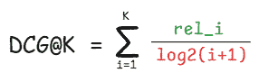
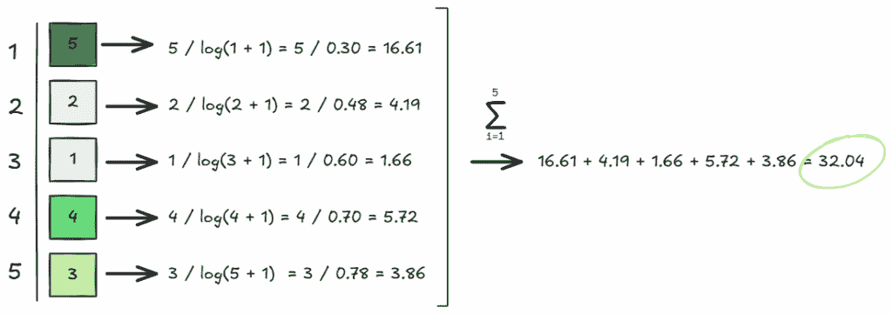
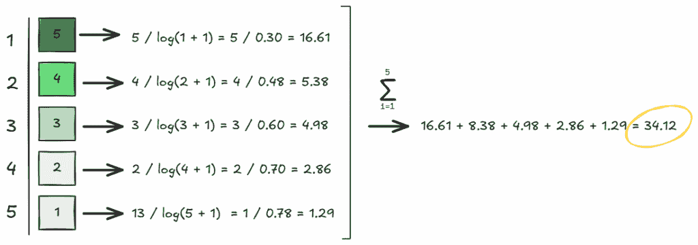
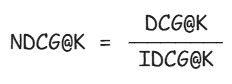
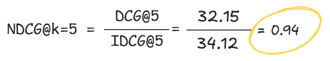

# 如何评估 RAG 管道中的检索质量（第三部分）：DCG@k 和 NDCG@k

> 原文：[`towardsdatascience.com/how-to-evaluate-retrieval-quality-in-rag-pipelines-part-3-dcgk-and-ndcgk/`](https://towardsdatascience.com/how-to-evaluate-retrieval-quality-in-rag-pipelines-part-3-dcgk-and-ndcgk/)

*确保也查看前几部分*：

👉***第一部分：[Precision@k, Recall@k, 和 F1@k](https://towardsdatascience.com/how-to-evaluate-retrieval-quality-in-rag-pipelines-precisionk-recallk-and-f1k/)***

👉*[**第二部分：平均倒数排名（MRR）和平均精度（AP）**](https://towardsdatascience.com/how-to-evaluate-retrieval-quality-in-rag-pipelines-part-2-mean-reciprocal-rank-mrr-and-average-precision-ap/)*

<mdspan datatext="el1762808739563" class="mdspan-comment">在我关于 RAG 管道检索评估指标的系列文章的前几部分中</mdspan>，我们详细探讨了二值检索评估指标。更具体地说，在第一部分，我们讨论了二值、无序检索评估指标，如 HitRate@K、Recall@K、Precision@K 和 F1@K。二值、无序检索评估指标基本上是我们可以用作评估检索机制性能的最基本类型的指标；它们只是将结果分类为相关或不相关，并评估相关结果是否出现在检索集中。

然后，在第二部分，我们回顾了二值、有序评估指标，如平均倒数排名（MRR）和平均精度（AP）。二值、有序指标将结果分类为相关或不相关，并检查它们是否出现在检索集中，但除此之外，它们还量化了结果的排名情况。换句话说，它们还考虑了每个结果检索时的排名，而不仅仅是它是否被检索。

在检索评估指标系列文章的最后一部分，我将进一步阐述其他大型指标类别，超越二值指标。那就是，***分级指标***。与结果要么相关要么不相关的二值指标不同，对于分级指标，相关性更像是一个连续体。这样，检索到的片段可以与用户的查询有***更多或更少的相关性***。

在今天这篇文章中，我们将探讨两种常用的分级相关性指标：折算累积收益（DCG@K）和标准化折算累积收益（NDCG@k）。

* * *

*我在🍨[**DataCream**](https://datacream.substack.com/)上写作，在那里我正在学习和实验 AI 和数据。**[在此订阅](https://datacream.substack.com/)**与我一起学习和探索。*

* * *

## 一些分级指标

对于分级检索指标，首先重要的是理解分级相关性的概念。也就是说，对于分级指标，检索到的项目可以或多或少地相关，这由`rel_i`来量化。



图片由作者提供

#### 🎯 折现累积增益 (DCG@k)

折现累积增益 (DCG@k) 是一个分级、顺序感知的检索评估指标，它允许我们量化检索结果的有用性，考虑到它被检索的排名。我们可以如下计算它：



图片由作者提供

在这里，分子 `rel_i` 是检索结果 i 的分级相关性，本质上是对检索到的文本片段相关性的量化。此外，这个公式的分母是结果 i 的排名的对数。本质上，这允许我们对排名较低出现在检索集中的项目进行惩罚，强调结果出现在顶部更重要。因此，结果的相关性越高，得分越高，但排名越低，得分越低。

让我们用一个简单的例子进一步探讨这个问题：



图片由作者提供

无论如何，DCG@k 的一个主要问题是，正如你所看到的，它本质上是一个所有相关项目的和函数。因此，包含更多项目（更大的 k）和/或更多相关项目的检索集将不可避免地导致更大的 DCG@k。例如，如果我们考虑 k = 4，我们最终会得到 DCG@4 = 28.19。同样，DCG@6 会更高，依此类推。随着 k 的增加，DCG@k 通常会增加，因为我们包括了更多的结果，除非有额外的项目为零相关。然而，这并不一定意味着其检索性能更优越。相反，这反而造成了一个问题，因为它不允许我们根据 DCG@k 比较不同 k 值的检索集。

这个问题将通过我们今天稍后将要讨论的下一个分级度量来解决，那就是 NDCG@k。但在那之前，我们需要介绍 IDCG@K，它是计算 NDCG@K 所必需的。

#### 🎯 理想折现累积增益 (IDCG@k)

理想折现累积增益 (IDCG@k)，正如其名所示，是在我们的检索集根据检索结果的相关性完美排名的理想情况下我们会得到的 DCG。让我们看看我们例子的 IDCG 会是什么：



图片由作者提供

显然，对于固定的 k，IDCG@k 将始终等于或大于任何 DCG@k，因为它代表了一个完美检索和基于检索结果相关性的排名的得分数。

最后，我们现在可以使用 DCG@k 和 IDCG@k 来计算标准化折现累积增益 (NDCG@k)。

#### 🎯 标准化折现累积增益 (NDCG@k)

标准化折现累积增益 (NDCG@k) 实质上是 DCG@k 的一个标准化表达式，解决了我们最初的问题，并使其对于不同检索集大小 k 的可比性。我们可以用这个简单的公式来计算 NDCG@k：



图片由作者提供

基本上，NDCG@k 允许我们量化我们的当前检索和排序与理想值之间的接近程度，对于给定的 k。这方便地为我们提供了一个可以比较不同 k 值的数字。在我们的例子中，NDCG@k=5 将是：



图片由作者提供

通常，NDCG@k 的值可以从 0 到 1，其中 1 表示完美的检索和结果排序，而 0 则表示完全混乱。

## 那么，我们如何在 Python 中实际计算 DCG 和 NDCG 呢？

如果你阅读过我的[其他 RAG 教程](https://towardsdatascience.com/rag-explained-reranking-for-better-answers/)，你知道通常在这里会有一个**《战争与和平》**的例子。不过，这个代码示例太大，无法包含在每一篇文章中，所以我会展示如何在 Python 中计算 DCG 和 NDCG，尽量保持这篇文章的长度合理。

为了计算这些检索指标，我们首先需要定义一个真实集，[正如我们在第一部分中所做的那样](https://towardsdatascience.com/how-to-evaluate-retrieval-quality-in-rag-pipelines-precisionk-recallk-and-f1k/)，当计算 Precision@K 和 Recall@K 时。这里的区别在于，我们不是用二进制相关性（0 或 1）来描述每个检索到的块是否相关，而是给它分配一个分级的相关性评分；例如，从完全不相关（0）到超级相关（5）。因此，我们的真实集将包括每个查询具有最高分级相关性评分的文本块。

例如，对于一个像“安娜·帕夫洛夫娜是谁？”这样的查询，一个完美匹配答案的检索到的块可能会得到 3 分，一个部分提及所需信息的块可能会得到 2 分，而一个完全不相关的块将得到 0 分的相关性评分。

使用这些分级相关性列表来计算检索结果集的 DCG@k、IDCG@k 和 NDCG@k。我们将使用 Python 的`math`库来处理对数项：

```py
import math
```

首先，我们可以定义一个计算**DCG@k**的函数，如下所示：

```py
# DCG@k
def dcg_at_k(relevance, k):
    k = min(k, len(relevance))
    return sum(rel / math.log2(i + 1) for i, rel in enumerate(relevance[:k], start=1))
```

我们也可以通过类似的逻辑计算**IDCG@k**。本质上，**IDCG@k**是完美检索和排序的**DCG@k**；因此，我们可以通过在按相关性降序排序结果后计算**DCG@k**来轻松计算它。

```py
# IDCG@k
def idcg_at_k(relevance, k):
    ideal_relevance = sorted(relevance, reverse=True)
    return dcg_at_k(ideal_relevance, k) 
```

最后，在计算了**DCG@k**和**IDCG@k**之后，我们也可以很容易地通过它们的函数计算**NDCG@k**。更具体地说：

```py
# NDCG@k
def ndcg_at_k(relevance, k):
    dcg = dcg_at_k(relevance, k)
    idcg = idcg_at_k(relevance, k)
    return dcg / idcg if idcg > 0 else 0.0
```

如所述，这些函数中的每一个都接受一个检索到的块的相关性评分列表作为输入。例如，假设对于特定的查询、真实集和检索结果测试，我们得到以下列表：

```py
relevance = [3, 2, 3, 0, 1]
```

然后，我们可以使用我们的函数<mdspan datatext="el1762808668418" class="mdspan-comment">如下计算分级检索指标：

```py
print(f"DCG@5: {dcg_at_k(relevance, 5):.4f}")
print(f"IDCG@5: {idcg_at_k(relevance, 5):.4f}")
print(f"NDCG@5: {ndcg_at_k(relevance, 5):.4f}")
```

就这样！这就是我们如何在 Python 中为我们的 RAG 管道获取分级检索性能指标的方法。

最后，类似于所有其他检索性能指标，我们也可以对不同查询的指标分数进行平均，以获得更具代表性的整体分数。

## 在我心目中

今天这篇关于分级相关度测量的帖子标志着我对 RAG 管道检索性能最常用指标系列帖子的结束。特别是，在整个帖子系列中，我们探讨了二元度量、无序和有序度量，以及分级度量，从而全面了解了我们如何处理这个问题。显然，我们还可以从许多其他方面来评估 RAG 管道的检索机制，例如每个查询的延迟或发送的上下文标记。尽管如此，我在这些帖子中提到的指标涵盖了评估检索性能的基础。

这使我们能够量化、评估，并最终提高检索机制的性能，最终为构建一个有效的 RAG 管道铺平道路，该管道能够基于我们选择的文档产生有意义的答案。

* * *

*喜欢这篇帖子？让我们成为朋友！加入我：*

📰***[Substack](https://datacream.substack.com/)*** 💌* **[Medium](https://medium.com/@m.mouschoutzi)*** 💼***[LinkedIn](https://www.linkedin.com/in/mariamouschoutzi/)*** ☕***[Buy me a coffee](http://buymeacoffee.com/mmouschoutzi)!***

* * *

## 那么，关于 pialgorithms 呢？

想要将 RAG 的力量带入您的组织？

[**pialgorithms**](https://pialgorithms.com/) 可以为您做到 ***👉 ***[***预约演示***](https://pialgorithms.com/#contact)*** 今天***
