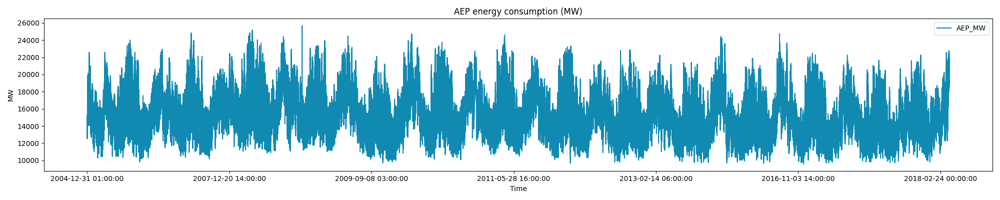
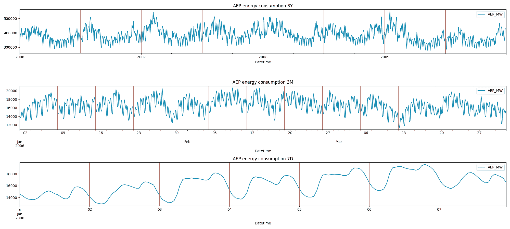
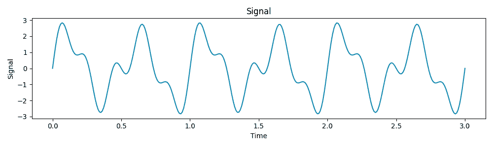
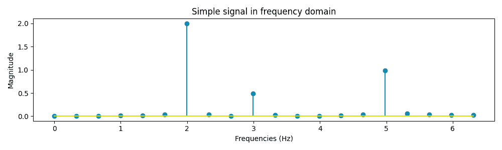
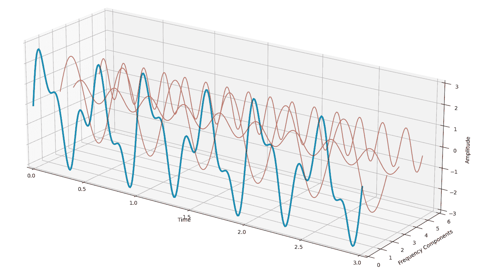
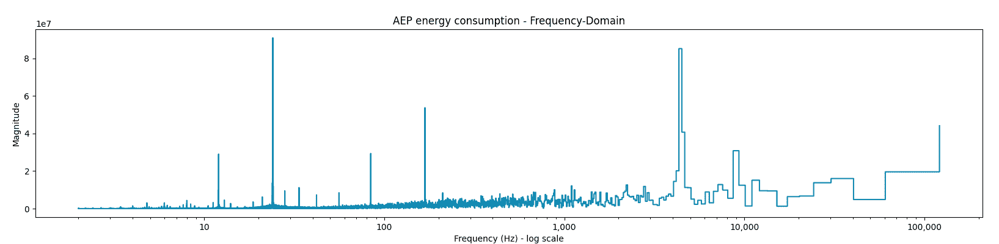
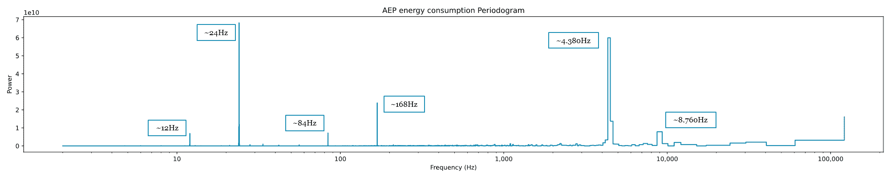

# 如何在时间序列中找到季节性模式

> 原文：[`towardsdatascience.com/how-to-find-seasonality-patterns-in-time-series-c3b9f11e89c6/`](https://towardsdatascience.com/how-to-find-seasonality-patterns-in-time-series-c3b9f11e89c6/)

在我的数据科学家职业生涯中，我多次遇到过时间序列。我的大部分知识来自我的学术经验，特别是我在计量经济学（我有经济学学位）的课程，在那里我们研究了时间序列的统计特性和模型。

在我研究过的模型中，有**SARIMA**，它承认时间序列的季节性，然而，我们从未研究过如何拦截和识别季节性模式。

大多数时候，我找到季节性模式只是简单地依赖于数据的**视觉检查**。这直到我偶然发现了关于**傅里叶变换**的[这个 YouTube 视频](https://www.youtube.com/watch?v=spUNpyF58BY&t=1s)，最终发现了**周期图**是什么。

在这篇博客文章中，我将解释并应用一些简单概念，这些概念将转化为有用的工具，每个研究时间序列的 DS 都应该知道。

**目录**

1.  什么是傅里叶变换？

1.  Python 中的傅里叶变换

1.  周期图

## 概述

假设我有一个以下数据集（[AEP 能源消耗](https://www.kaggle.com/datasets/robikscube/hourly-energy-consumption)，CC0 许可）：

```py
import pandas as pd
import matplotlib.pyplot as plt

df = pd.read_csv("data/AEP_hourly.csv", index_col=0) 
df.index = pd.to_datetime(df.index)
df.sort_index(inplace=True)

fig, ax = plt.subplots(figsize=(20,4))
df.plot(ax=ax)
plt.tight_layout()
plt.show()
```



AEP 每小时能源消耗 | 图片由作者提供

仅从视觉检查来看，很明显**季节性模式正在发挥作用**，然而，拦截它们可能很琐碎。

如前所述，我用来执行发现过程的主要是**手动**的，它可能看起来像以下这样：

```py
fig, ax = plt.subplots(3, 1, figsize=(20,9))

df_3y = df[(df.index >= '2006–01–01') &amp; (df.index < '2010–01–01')]
df_3M = df[(df.index >= '2006–01–01') &amp; (df.index < '2006–04–01')]
df_7d = df[(df.index >= '2006–01–01') &amp; (df.index < '2006–01–08')]

ax[0].set_title('AEP energy consumption 3Y')
df_3y[['AEP_MW']].groupby(pd.Grouper(freq = 'D')).sum().plot(ax=ax[0])
for date in df_3y[[True if x % (24 * 365.25 / 2) == 0 else False for x in range(len(df_3y))]].index.tolist():
 ax[0].axvline(date, color = 'r', alpha = 0.5)

ax[1].set_title('AEP energy consumption 3M')
df_3M[['AEP_MW']].plot(ax=ax[1])
for date in df_3M[[True if x % (24 * 7) == 0 else False for x in range(len(df_3M))]].index.tolist():
 ax[1].axvline(date, color = 'r', alpha = 0.5)

ax[2].set_title('AEP energy consumption 7D')
df_7d[['AEP_MW']].plot(ax=ax[2])
for date in df_7d[[True if x % 24 == 0 else False for x in range(len(df_7d))]].index.tolist():
 ax[2].axvline(date, color = 'r', alpha = 0.5)

plt.tight_layout()
plt.show()
```



AEP 每小时能源消耗，较小的时间范围 | 图片由作者提供

这是这个时间序列的更深入可视化。正如我们所看到的，以下模式正在影响数据：**- 一个 6 个月周期，

+   一个每周周期，

+   以及一个日周期。**

这个数据集显示了能源消耗，因此这些季节性模式仅从领域知识中就可以轻易推断出来。然而，仅依靠手动检查，我们可能会**错过重要的信息**。这些可能是以下主要**缺点**：

+   **主观性**：我们可能会错过不那么明显的模式。

+   **耗时**：我们需要逐个测试不同的时间段。

+   **可扩展性问题**：对于少量数据集表现良好，但对于大规模分析则效率低下。

作为一名数据科学家，拥有一个能够给我们关于组成时间序列的最重要频率的**即时反馈**的工具将非常有用。这就是**傅里叶变换**发挥作用的地方。

## 1. 什么是傅里叶变换

傅里叶变换是一种数学工具，它允许我们“转换域”。

通常，我们在**时间域**中可视化我们的数据。然而，使用傅里叶变换，我们可以切换到**频域**，这显示了信号中存在的频率及其相对于原始时间序列的相对贡献。

### **直观理解**

任何行为良好的函数 f(x)都可以写成不同频率、幅度和相位的正弦波的叠加。简单来说，**每个信号**（时间序列）只是**简单波形**的**组合**。


图片由作者提供

其中：

+   F(f)代表**频域**中的函数。

+   f(x)是**时间域**中的原始函数。

+   exp(−i2πf(x))是一个复指数，它充当“频率滤波器”。

因此，**F(f)**告诉我们原始函数中**存在多少**频率**f**。

### **示例**

让我们考虑一个由三个频率为 2 Hz、3 Hz 和 5 Hz 的正弦波组成的信号：



时间域中的简单信号 | 图片由作者提供

现在，让我们应用傅里叶变换来从信号中提取这些频率：



简单信号在频域中的表示 | 图片由作者提供

上面的图表展示了我们的信号在频域而不是经典的时间域中的表示。从生成的图表中，我们可以看到我们的信号分解成了 3 个频率为 2 Hz、3 Hz 和 5 Hz 的元素，正如从起始信号中预期的那样。

如前所述，任何行为良好的函数都可以写成正弦波的叠加。根据我们目前所拥有的信息，我们可以将我们的信号分解为三个正弦波：



简单信号的基本波长分解 | 图片由作者提供

原始信号（蓝色）可以通过将三个波（红色）相加得到。这个过程可以很容易地应用于任何时间序列，以评估组成时间序列的主要频率。

## Python 中的 2 个傅里叶变换

既然在时间域和频域之间切换相当容易，让我们看看文章开头我们开始研究的 AEP 能耗时间序列。

Python 提供了"numpy.fft"库来计算离散信号的傅里叶变换。FFT 代表快速傅里叶变换，这是一种将离散信号分解为其频率成分的算法：

```py
from numpy import fft

X = fft.fft(df['AEP_MW'])
N = len(X)
frequencies = fft.fftfreq(N, 1)
periods = 1 / frequencies
fft_magnitude = np.abs(X) / N

mask = frequencies >= 0

# Plot the Fourier Transform
fig, ax = plt.subplots(figsize=(20, 3))
ax.step(periods[mask], fft_magnitude[mask]) # Only plot positive frequencies
ax.set_xscale('log')
ax.xaxis.set_major_formatter('{x:,.0f}')
ax.set_title('AEP energy consumption - Frequency-Domain')
ax.set_xlabel('Frequency (Hz)')
ax.set_ylabel('Magnitude')
plt.show()
```



频域中的 AEP 每小时能耗 | 图片由作者提供

这是 AEP_MW 能耗的频域可视化。当我们分析图表时，我们已经在某些频率上看到了更高的幅度，这意味着这些频率的重要性更高。

然而，在这样做之前，我们增加了一块理论，这将使我们能够构建一个**周期图**，这将给我们一个更清晰的最重要的频率视图。

## 3. 周期图

周期图是信号**功率谱密度**（PSD）的频域表示。虽然傅里叶变换告诉我们信号中存在哪些频率，但周期图量化了这些频率的功率（或强度）。本段内容很有用，因为它**减少了次要频率的噪声**。

从数学上讲，周期图由以下公式给出：


图片由作者提供

其中：

+   P(f)是频率 f 处的功率谱密度（PSD），

+   X(f)是信号的傅里叶变换，

+   N 是样本总数。

这在 Python 中可以如下实现：

```py
power_spectrum = np.abs(X)**2 / N # Power at each frequency

fig, ax = plt.subplots(figsize=(20, 3))
ax.step(periods[mask], power_spectrum[mask])
ax.set_title('AEP energy consumption Periodogram')
ax.set_xscale('log')
ax.xaxis.set_major_formatter('{x:,.0f}')
plt.xlabel('Frequency (Hz)')
plt.ylabel('Power')
plt.show()
```



AEP 每小时能耗周期图 | 图片由作者提供

从这个周期图中，现在我们可以**得出结论**。正如我们所见，最强大的频率位于：

+   24 Hz，对应 24 小时，

+   4.380 Hz，对应 6 个月，

+   以及在 168 Hz 处，对应每周周期。

这三个是我们通过视觉检查在手动练习中找到的相同季节性成分。然而，使用这种可视化，我们可以看到**三个其他周期**，功率较弱，但存在：

+   一个 12 Hz 的周期，

+   一个 84 Hz 的周期，对应半周，

+   一个 8.760 Hz 的周期，对应一整年。

还可以使用 scipy 中提供的“periodogram”函数获得相同的结果。

```py
from scipy.signal import periodogram

frequencies, power_spectrum = periodogram(df['AEP_MW'], return_onesided=False)
periods = 1 / frequencies

fig, ax = plt.subplots(figsize=(20, 3))
ax.step(periods, power_spectrum)
ax.set_title('Periodogram')
ax.set_xscale('log')
ax.xaxis.set_major_formatter('{x:,.0f}')
plt.xlabel('Frequency (Hz)')
plt.ylabel('Power')
plt.show()
```

## 结论

当我们处理时间序列时，最重要的组成部分之一是季节性。

在这篇博客文章中，我们看到了如何使用周期图**轻松地发现时间序列中的季节性**。为我们提供了一个简单易实现的工具，这将极大地有助于探索过程。

然而，这仅仅是我们可以从傅里叶变换中受益的可能的实现起点，因为还有更多：

+   **频谱图**

+   **特征编码**

+   **时间序列分解**

+   …

如果您喜欢这篇文章，请留下一些掌声，并随时评论，任何建议和反馈都受欢迎！

_[在此处可以找到本博客文章中代码的 notebook。](https://github.com/lorenzomezzini/MediumPosts/blob/main/Fourier/FTT_and_Periodogram.ipynb)_
