# 如何使用强化学习微调小型语言模型进行思考

> 原文：[`towardsdatascience.com/how-to-finetune-small-language-models-to-think-with-reinforcement-learning/`](https://towardsdatascience.com/how-to-finetune-small-language-models-to-think-with-reinforcement-learning/)

<mdspan datatext="el1752026182070" class="mdspan-comment">**推理模型**目前正流行。DeepSeek-R1、Gemini-2.5-Pro、OpenAI 的 O 系列模型、Anthropic 的 Claude、Magistral 和 Qwen3——每个月都有一个新模型。当你向这些模型提问时，它们会在生成答案之前进入一个**思维链**。

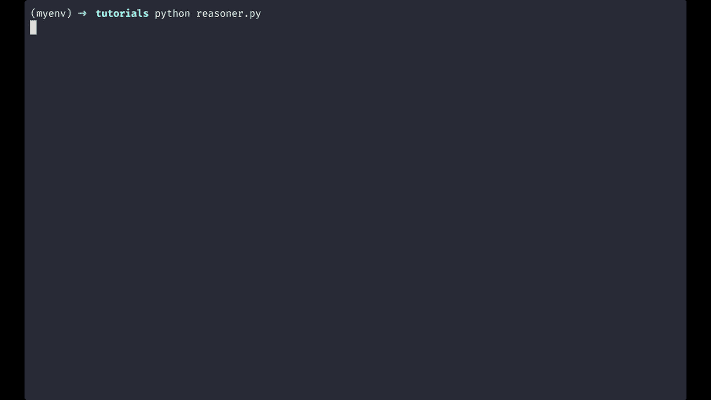

推理的一个简单演示。当被问及问题时，语言模型（LM）首先生成一个思维链，然后给出答案。（插图由作者绘制）

我最近问自己一个问题，“嗯……我想知道我是否应该从头开始编写一个强化学习循环，将这种‘思考’行为教给**非常小**的模型——**比如只有 1.35 亿个参数**。这应该很容易，对吧？

嗯，事实并非如此。

> **小型模型根本不具备大型模型所拥有的世界知识。这使得小于 1B 参数的模型缺乏“常识”，难以轻松通过复杂的逻辑任务进行推理。因此，你不能仅仅依靠计算来训练它们进行推理**。
> 
> 你需要一些额外的技巧**。

在本文中，我不仅会介绍技巧，还会涵盖将推理行为训练到语言模型背后的主要思想，分享一些简单的代码片段，以及一些微调小型语言模型（SLM）的实用技巧。

**本文分为 5 个部分：**

1.  RLVR（可验证奖励的强化学习）简介及其为何如此酷

1.  GRPO 算法和剪裁代理 PPO 损失的视觉概述。

1.  代码演示！

1.  监督微调和训练推理模型的实用技巧

1.  结果！

*除非另有说明，本文中使用的所有图片均为作者制作的插图。*

*在本文末尾，我将链接到本文的 50 分钟配套 YouTube 视频。如果你有任何疑问，该视频可能包含你需要的答案/澄清。你还可以在 X 上联系我 ([@neural_avb](https://x.com/neural_avb))。

## 1. 可验证奖励的强化学习（RLVR）

在深入探讨小型模型的具体挑战之前，让我们首先介绍一些术语。

群组相对策略优化，或称 GRPO，是一种（相对较新）的强化学习（RL）技术，研究人员正在使用它来微调大型语言模型（LLMs）在逻辑和分析任务上的表现。自从其诞生以来，一个新术语已经在 LLM 研究领域流传开来：**RLVR**，或**可验证奖励的强化学习**。

要理解 RLVR 的独特之处，将其与语言模型中最常见的 RL 应用——RLHF（**R**einforcement **L**earning with **H**uman **F**eedback）进行对比是有帮助的。在 RLHF 中，一个 RL 模块被训练以最大化来自单独奖励模型的分数，该模型充当人类偏好的代理。这个奖励模型是在一个数据集上训练的，其中人类对不同的模型响应进行了排名或评分。

> **换句话说，RLHF 经过训练，使得 LLM 可以输出更符合人类偏好的响应。它试图使模型更紧密地遵循指令。**
> 
> **RLVR 试图解决一个不同的问题。RLVR 教导模型成为可验证的正确，通常是通过学习生成它自己的思维链。**

与 RLHF 使用的主观奖励模型不同，RLVR 使用的是客观验证者。核心思想是根据答案是否明显正确来提供奖励，而不是根据对人类可能偏好的预测。

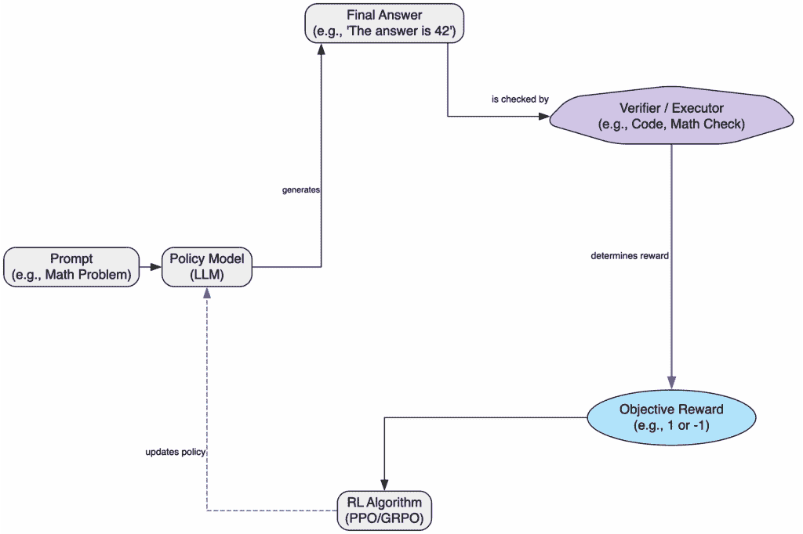

RLVR 工作原理的示意图（由作者绘制）

这正是为什么这个系统被称为“具有可验证奖励的 RL”的原因。并非每个问题的答案都可以轻松验证。特别是像“我应该买什么 iPhone？”或“我应该去哪所大学？”这样的开放式问题。然而，有些用例很容易适应“可验证奖励”范式，例如数学、逻辑任务和代码编写等。在下面的`reasoning-gym`部分，我们将探讨这些任务如何具体模拟以及如何生成奖励。

*但在那之前，你可能想知道：那么“推理”在这个所有过程中是如何定位的？*

我们将训练 LLM 在生成最终答案之前生成任意长度的思维推理文本。我们指示模型将其思考过程用`<think>`标签包裹，并将其最终结论用`<answer>`标签包裹。

完整的语言模型响应将类似于以下内容：

```py
<think>
User has asked me to count the number of r's in strawberry.
Let's do a cumulative count.
s=0, t=0, r=1, a=0, w=0, b=0, e=0, r=2, r=3, y=4

It seems there are 3 r's in strawberry. 
I notice that there is an r in straw and 2 r's in berry.
Since 1+2=3 I am more confident there are 3 r's
</think>
<answer>
3
</answer>
```

这种结构使我们能够轻松地提取最终答案并检查其是否正确。验证者是单一的真实来源，可以是一段简单的代码，它（字面上）计算字母。

```py
def count_alphabets(word, letter):
    return sum([1 for l in word if l == letter])

reward = 1 if (lm_answer == count_alphabets("strawberry", "r") else -1
```

我们将记录模型的经验——其响应和从验证者那里收到的相应奖励。然后，RL 算法将训练以促进增加正确最终答案可能性的行为。

> **通过一致地奖励正确答案和良好的格式，我们可以增加导致正确答案的推理标记的可能性。**
> 
> **请注意：我们**不需要**直接评估中间推理标记。通过简单地奖励最终答案，我们将间接地激发 LLM 思维链中的推理步骤，从而得出正确答案！**

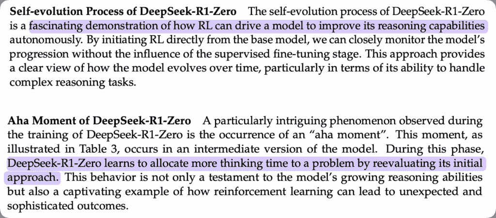

来源：[DeepSeek-R1](https://arxiv.org/pdf/2501.12948) 论文的部分摘录（许可：免费）

## 2. GRPO（Group Relative Policy Optimization）

我将跳过通常的*强化学习 101*简介，我预计读到这里的你们大多数人已经理解了强化学习的基本概念。有一个智能体从环境中观察状态并采取行动——环境根据行动的好坏对智能体进行奖励——智能体存储这些经验并训练在未来采取更好的行动以获得更高的奖励。“强化学习 101”课程结束。

*但是，我们如何将强化学习范式转移到语言上呢？*

让我们谈谈我们选择的算法——**G**roup **R**elative **P**olicy **O**ptimization（GRPO），以了解它是如何工作的。GRPO 在两个迭代自我重复的阶段中工作——一个经验收集阶段，其中语言模型（LM）使用其当前权重在环境中积累经验。还有一个训练阶段，它使用收集到的记忆来更新其权重以改进。训练后，它再次使用更新的权重进入经验收集步骤。

### 经验收集

现在我们来剖析经验收集阶段中的每一步。

+   **步骤 1**：环境是一个黑盒，它生成关于逻辑或数学任务的问题。我们将在使用`reasoning-gym`库的下一节中讨论这个问题。

+   **步骤 2**：我们将输入问题标记化为一系列整数标记。

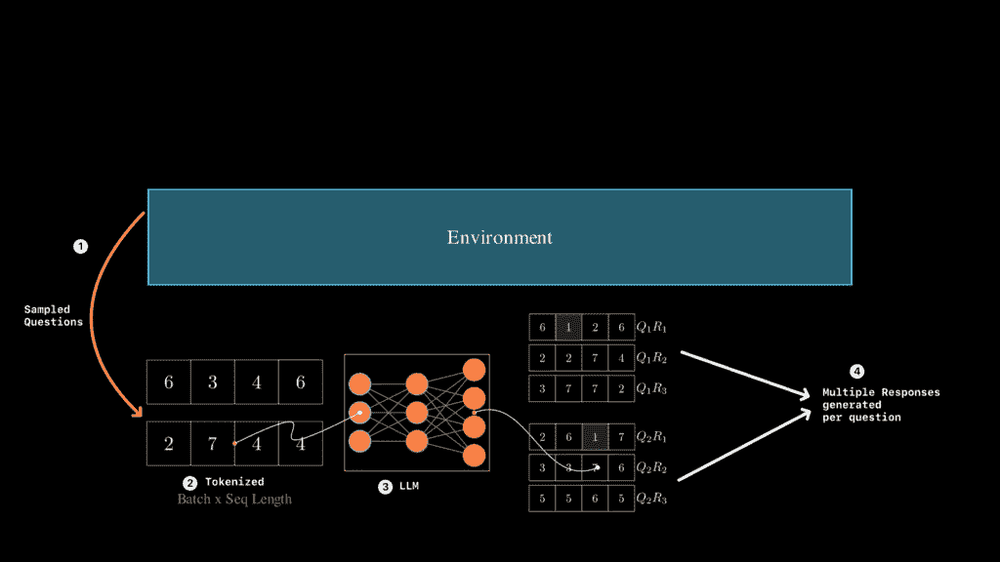

样本问题，对它们进行标记化，通过语言模型进行前向传递，并为每个问题生成多个响应！（作者插图）

+   **步骤 3**：“智能体”或“策略”是我们正在训练的当前序列语言模型（SLM）。它观察环境的标记化问题并生成响应。语言模型（LLM）的响应被转换为文本并返回到环境中。环境对每个响应进行奖励。

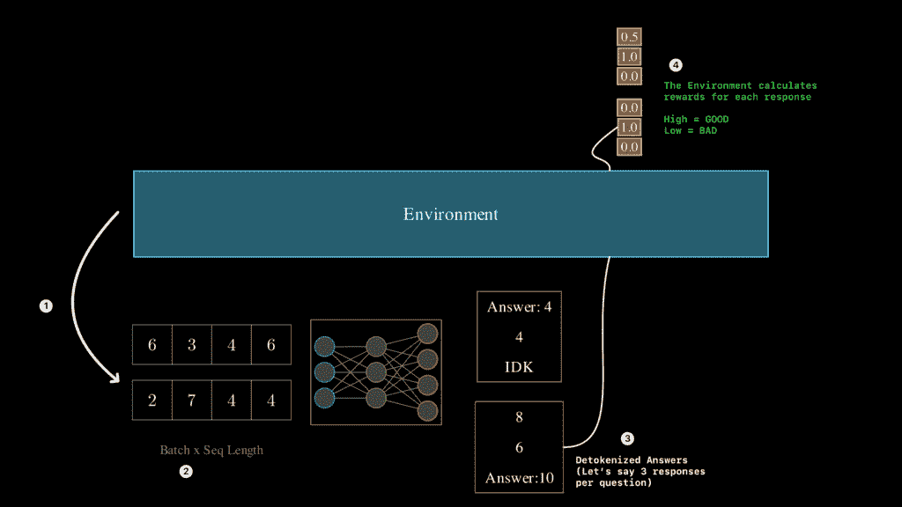

环境（环境）作为验证者，并为智能体分配奖励。（作者插图）

+   **步骤 4**：从奖励中，我们计算每个响应的**优势**。在 GRPO 中，优势是组内每个响应的相对良好程度。重要的是，优势是按组计算的，即我们不会在不同问题之间标准化奖励。

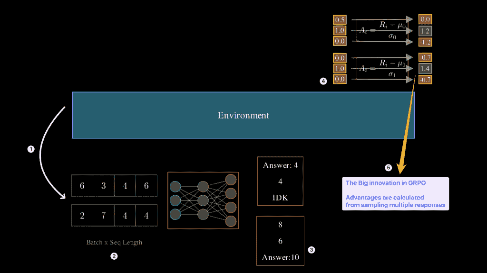

优势定义了特定响应相对于其他相同问题的响应的相对有利程度

（作者插图）

+   **步骤 5**：原始问题、每个 LLM 生成标记的对数概率和优势都被累积在一个记忆缓冲区中。

+   步骤 1-5 会重复进行，直到缓冲区大小达到期望的阈值。

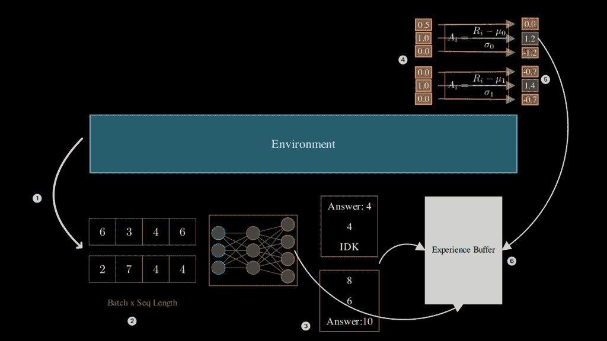

在缓冲区中保存经验！（作者插图）

### 训练阶段

在经验收集阶段结束后，我们的目标是进入训练阶段。在这里，我们将从 LLM 观察到的奖励模式中学习，并使用强化学习来改进其权重。以下是它是如何工作的：

1.  随机采样一个记忆小批量。记住，每个记忆已经包含了其组相对优势（经验收集阶段的第 5 步）。随机采样问题-答案对可以提高训练的鲁棒性，因为梯度是作为一组多样化经验的平均值计算的，从而防止对任何单个问题的过度拟合。

1.  对于每个小批量，我们希望根据标准的 PPO（近端策略优化）公式最大化这个项。**与 GRPO 的主要区别在于我们不需要额外的奖励模型或价值网络来计算优势。相反，GRPO 对同一问题进行多次响应以计算每个响应的相对优势。**由于我们不需要训练那些额外的模型，因此内存占用显著减少！

1.  重复上述步骤。

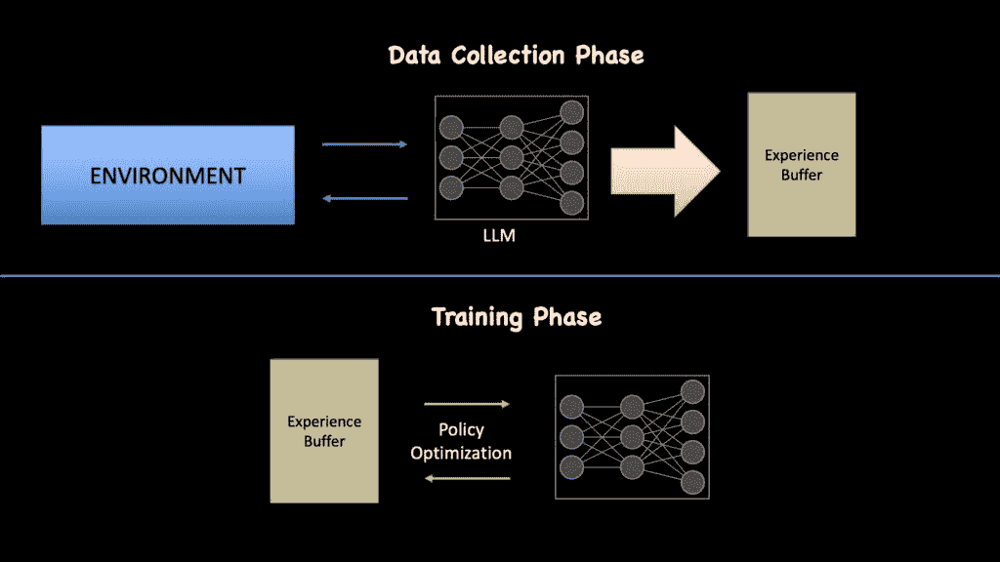

GRPO 在两个重复的阶段中运行——收集经验，基于经验进行训练，然后重复。（由作者插图）

### PPO 损失的含义

让我以直观的、一步一步的方式解释 PPO 损失。PPO 损失看起来是这样的。

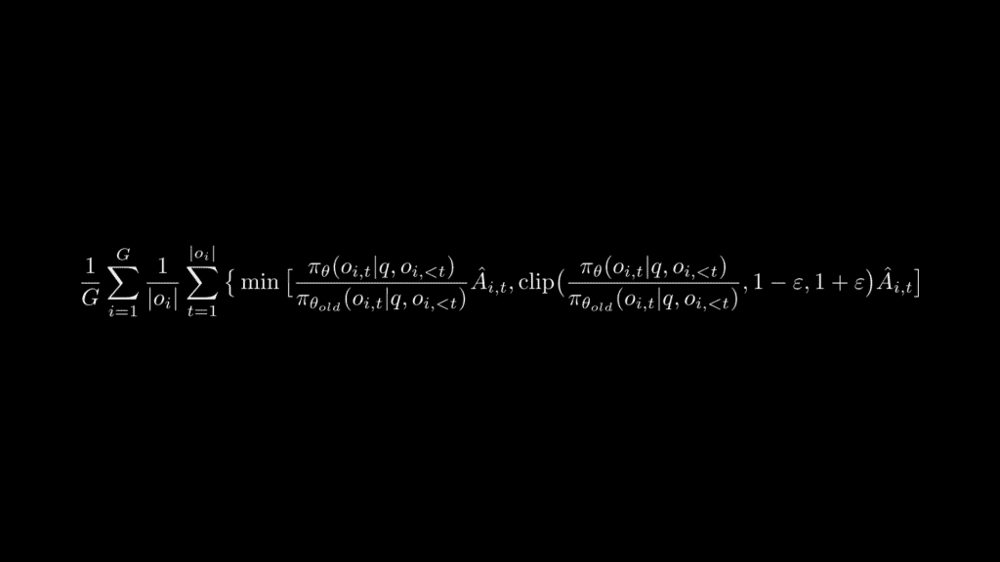

[PPO 损失函数](https://arxiv.org/abs/1707.06347)。让我为您分解一下。（由作者插图）

+   在这里，`pi_old` 是我们在数据收集阶段使用的旧策略神经网络。

+   `π` 是我们正在训练的当前策略神经网络。由于 `π` 的权重在每次梯度更新后都会改变，因此 `π` 和 `π_old` 在训练阶段不会保持相同——因此有所区分。

+   `G` 是单个问题生成的响应数量。`|o_i|` 是第 i 个响应的长度。因此，这些求和和归一化操作计算了所有响应中所有标记的平均值。它计算的是平均值？嗯，它是 `π/π_old * A_{it}`。这意味着什么？

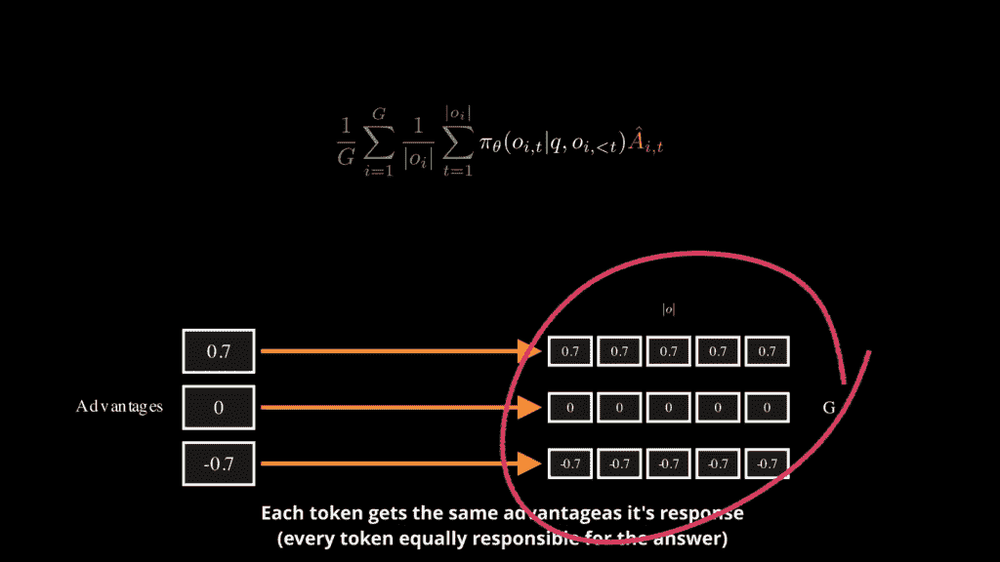

给每个标记分配优势的最简单方法是通过复制整个响应的优势（由作者插图）

+   `A_it` 是第 i 个响应中第 t 个标记的优势。记住我们在经验收集阶段的第 5 步计算每个响应的优势？给每个标记分配优势的最简单方法是将相同的优势简单地复制到每个标记——这意味着我们是在说每个标记对生成正确答案都负有同等责任。

+   最后，`π(o_it | q, o_i < t)` 是什么意思？这意味着第 i 个响应中第 t 个标记的概率是什么？也就是说，当它被生成时有多可能？

+   重要性采样比率重新加权当前更新策略和旧探索策略之间的优势。

+   剪切项确保网络更新不会太大，权重不会离旧策略太远。通过保持模型更新接近“数据收集策略的信任区域”，这增加了训练过程的稳定性。

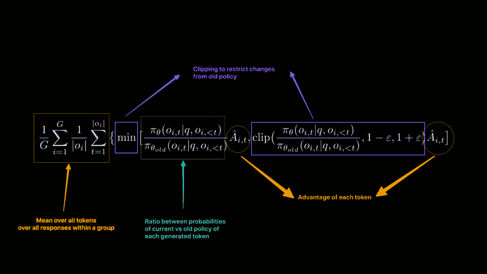

PPO 目标分解成单个组件。（由作者展示）

> **当我们最大化 PPO 目标时，我们实际上是在要求 LLM 增加导致高优势的标记的对数概率，同时减少具有低优势的标记的对数概率。**
> 
> 换句话说：使产生良好优势的标记更有可能，使产生低优势的标记不太可能。

### 通过示例理解 PPO 损失

让我们暂时忘记剪切项和`π_old`，让我们看看最大化`𝜋(𝑜_i) * A_i`意味着什么。为了提醒你，这个方程的部分只是意味着，“第 i 个标记（o_i）的概率与第 i 个标记（A_i）的优势的乘积”

假设对于一个问题，LLM 生成了这两个序列：“A B C”和“D E F”，并且它为前者获得了+1 的优势，为后者获得了-1 的优势。假设我们有每个 3 个标记的日志概率，如下所示。

* *实际上，由于组相对优势总是具有 1 的标准差，正确的优势应该是+0.707 和-0.707。*

注意当你将优势`A_it`乘以当前的日志概率`pi`时会发生什么。现在真正思考一下最大化该乘积矩阵平均值意味着什么。

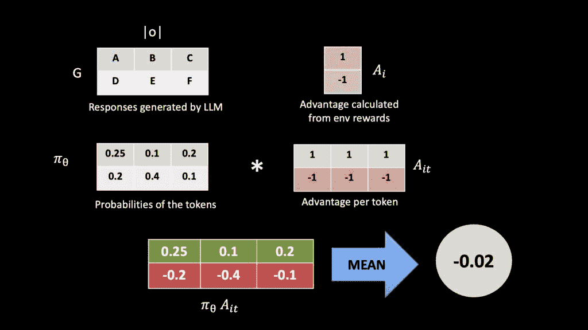

一个玩具例子来展示最大化一个标记的概率与其优势的乘积意味着什么（由作者展示）

记住我们只能改变 LLM 输出的概率。优势来自环境，因此被视为常数。因此，增加这个预期分数意味着增加具有正优势的标记的概率，并减少负优势示例的值。

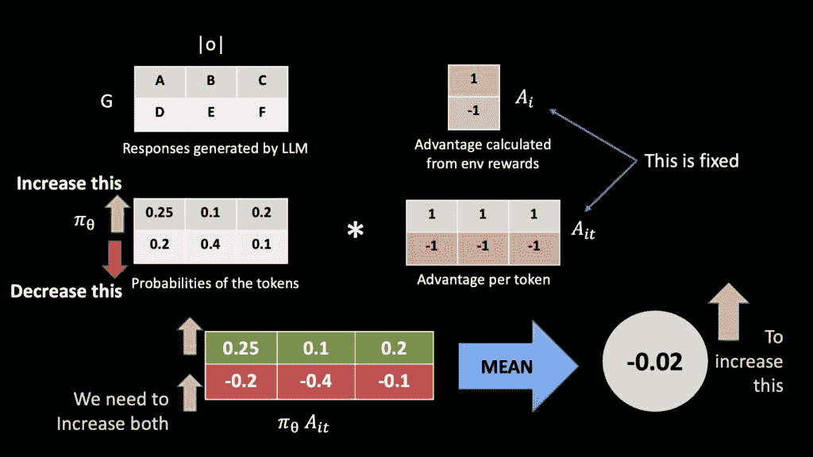

为了增加乘积张量的平均值，我们必须增加张量中的每个值，因此我们必须增加正优势标记的概率，并减少负优势标记的概率。

（由作者展示）

在下面，你可以找到一个例子，展示经过几轮训练后对数概率是如何变化的。注意当优势高时，蓝色线条是如何逐渐接近零的？这表明经过强化学习训练后，对数概率增加了（或者说概率增加了）。与右侧的图表进行比较，它显示了低优势下的不同反应。蓝色线条正在远离 0，在后续轮次中变得不太可能被选中。

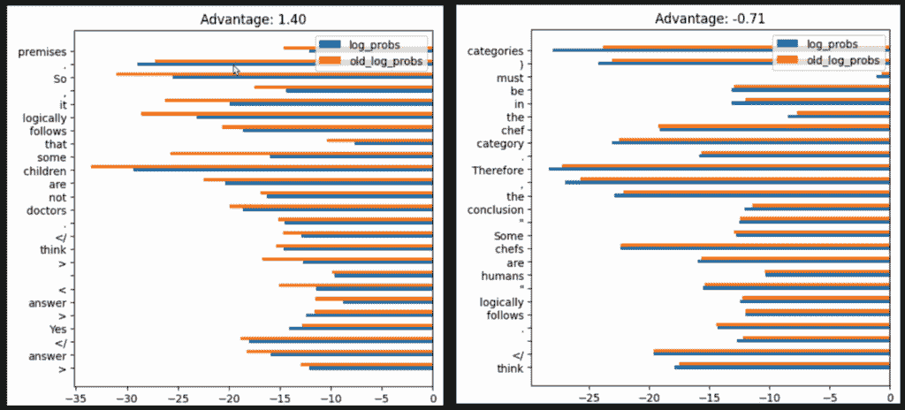

训练后 RL 微调对标记对数概率的影响比较（作者插图）

在下一节中，让我们看看`reasoning-gym`库，并了解我们如何采样任务。

## 3. 实现

因此，要进行 RL，我们首先需要任务。一种常见的方法是使用现有的数学问题数据集，如 GSM-8K 数据集。在这篇文章中，让我们看看一个不同的案例——使用名为[reasoning-gym](https://github.com/open-thought/reasoning-gym)的 Python 库程序化生成任务。

对于我的实验，我使用了两个任务：**三段论**和**命题逻辑**。`reasoning-gym`包含了一系列不同难度级别的不同存储库。

**三段论任务**是一种旨在测试演绎推理的逻辑谜题。基本上，我们将提供两个前提，并询问结论是否正确。**命题逻辑任务**是一种符号推理任务，其中 LLM 被提供带有符号的任务并要求生成结论。与三段论不同，这不是一个 YES/NO 分类响应——他们必须直接生成正确的结论。这使得这个任务难度大大增加。

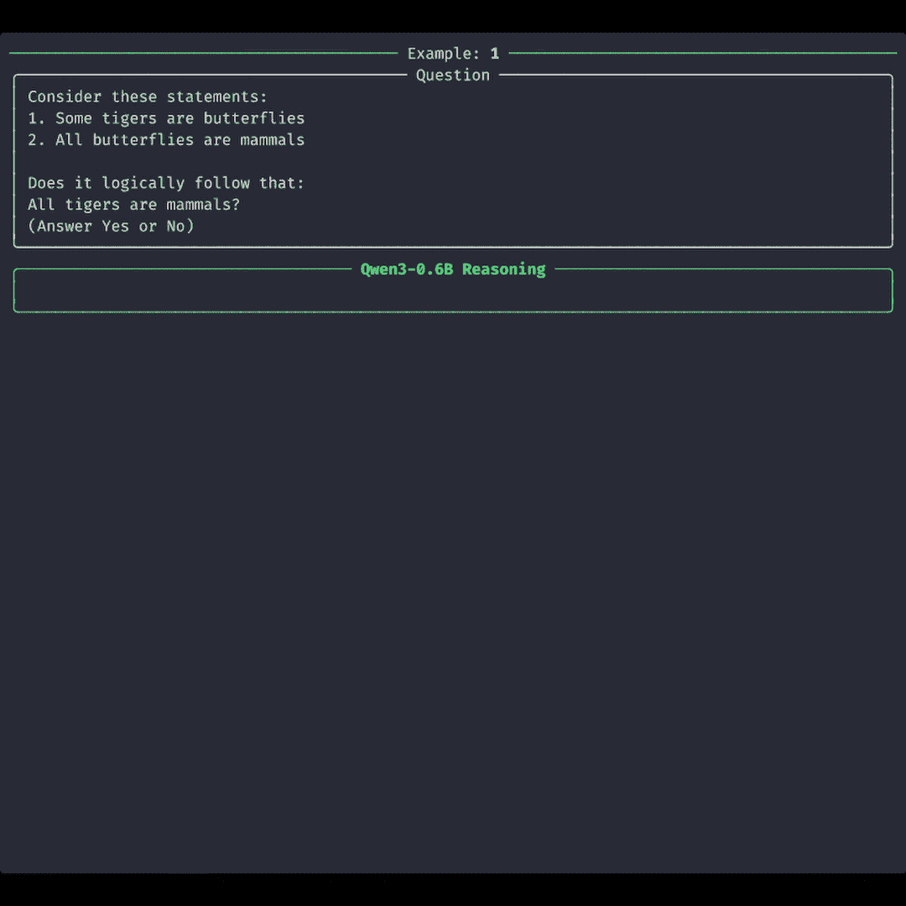

三段论任务示例（我 RL 训练模型的视频片段）

*在我们开始编码之前，我想可能是惯例要明确一下我所说的“小型”模型是什么意思。*

关于什么可以被认为是“小型”模型（有些人说<14B，有些人说<7B）的争论仍在继续，但为了我的 YouTube 视频，我选择了更小的模型：SmolLM-135M-Instruct，SmolLM-360M-Instruct，和 Qwen3-0.6B。这些模型分别是~135M，~360M，和~600M。

让我们看看如何设置基本的训练循环。首先，我们可以使用 Huggingface 的`transformers`库来加载我们想要训练的模型，比如说 135M 参数的小型模型`SmolLM-135M-Instruct`。

要生成一些命题逻辑任务，例如，只需调用此`reasoning_gym.create_dataset`函数，如下所示。

```py
import re
from reasoning_gym import create_dataset, get_score_answer_fn
from transformers import AutoModelForCausalLM, AutoTokenizer
import torch

model_name = "HuggingfaceTB/SmolLM-135M-Instruct"

# load model from huggingface
lm = AutoModelForCausalLM.from_pretrained(model_name, torch_dtype=torch.bfloat16)
tokenizer = AutoTokenizer.from_pretrained(model_name)

# This sets all models as trainable
for param in lm.parameters():
    param.requires_grad = True
# In my experiments, I used a LORA adapter (more on this later)

# specify name of the env 
environment_name = "propositional_logic"

# In practice, you should wrap this with a torch dataloader 
# to sample a minibatch of questions
dataset = create_dataset(
    environment_name, seed=42, size=DATA_SIZE
)

for d in dataset:
    question = d["question"] # Accessing the question

    # We will use this later to verify if answer is correct
    validation_object = d["metadata"]["source_dataset"]
    score_fn = get_score_answer_fn(validation_object) 
```

要生成推理数据，我们希望 LM 先生成思考，然后是响应。以下是我们将使用的系统提示。

```py
system_prompt = """A conversation between User and Assistant. The user asks a question, and the Assistant solves it.
The assistant first thinks about the reasoning process in the mind and then provides the user
with the answer. The reasoning process and answer are enclosed within <think> </think> and
<answer> </answer> tags, respectively, i.e., <think> reasoning process here </think>
<answer> answer here </answer>.

Do not generate new code. Do not write python code.

You may also be given examples by the user telling you the expected response format.
Follow the format of the examples, but solve the specific problem asked by the user, not the examples.

Very important - Remember again, your output format should be:
<think> reasoning process here </think>
<answer> answer here </answer>

Your response will be scored by extracting the substring between the <answer>...</answer> tags.
It is critical to follow the above format.
feature_extraction_utilsling to follow the response format will result in a penalty.
"""
```

要生成答案，我们首先对系统提示和问题进行标记，如下所示。

```py
# Create messages structure
messages = [
    {"role": "system", "content": system_prompt},
    {"role": "user", "content": question}, # Obtained from reasoning-gym
]

# Create tokenized representation
inputs = tokenizer.apply_chat_template(
    messages,
    tokenize=True,
    return_tensors="pt",
    add_generation_prompt=True
)
```

然后我们通过 LM——使用`num_return_sequences`参数生成多个响应，并将其反序列化以获得字符串响应。在这个阶段不会计算梯度。

```py
generated_response = lm.generate(
    input_ids=inputs["input_ids"],
    attention_mask=inputs["attention_mask"],
    max_new_tokens=max_new_tokens, # The max number of tokens to generate
    do_sample=True,                # Probabilistic sampling
    top_p=0.95,                    # Nucleus sampling
    num_return_sequences=G,        # Number of sequences per question
    temperature=1,                 # Increase randomness
    eos_token_id=eos_token_id,
    pad_token_id=eos_token_id,
) 
```

我们还编写了`extract_answer`函数，该函数使用正则表达式从答案标签之间提取答案。

```py
def extract_answer(response):
    answer = re.search(r"<answer>(.*?)</answer>", response, re.DOTALL)
    if answer is not None:
        return answer.group(1).strip()
    else:
        return "" 
```

最后，我们使用之前得到的评分函数根据 LM 的响应是否正确来生成奖励。为了计算奖励，我们添加了一个格式奖励和一个纠正奖励。纠正奖励来自环境，如果模型正确生成了``和`<answer> ... </answer>`标签，则授予格式奖励。

优势是通过在每个组之间标准化来计算的。

```py
# Response is an array of string of length [B*G]
# B is the number of questions, G is the number of responses per question

correctness_reward = score_fn(response, validation_object)
format_reward = calculate_format_reward(response)

# Total reward is a weighted sum of correctness and formatting rewards
reward = correctness_reward * 0.85 + format_reward * 0.15 

# Convert rewards from [B*G, 1] -> [B, G]
rewards = rewards.reshape(B, G) 

# Calculate advantages
advantages = (rewards - np.mean(rewards, axis=1, keepdims=True)) / (
    np.std(rewards, axis=1, keepdims=True) + 1e-8
)
advantages = advantages.reshape(-1, 1) 
```

将（旧的）对数概率、优势、响应和响应掩码存储在内存缓冲区中。

```py
# A function that returns the log prob of each selected token
log_probs = calculate_log_probs(lm, generated_response)

buffer.extend([{
    "full_response": generated_response[i],
    "response_mask": response_mask[i], # A binary mask to denote which tokens in generated response are AI generated, 0 for system prompt and questions
    "old_log_probs": log_probs[i],
    "advantages": advantages[i]
} for i in range(len(generated_response))])
```

在多次经验收集步骤之后，一旦缓冲区满了，我们就启动我们的训练循环。在这里，我们从经验中采样小批量数据，计算对数概率，计算损失，并进行背景处理。

```py
# full_response, response_mask, old_log_probs, advantages <--- Buffer

# Recompute the new log_probs. Notice no torch.no_grad(), so gradients WILL BE USED here.
logits = llm(input_ids=full_response).logits

# Extract log probs from the logits
# Does log_softmax over the vocabulary and extracts the log-prob of each selected token
log_probs = calculate_log_probs(
     logits,
     full_responses
)

# Calculate the clipped surrogate loss
reasoning_loss = calculate_ppo_loss(
     log_probs,       # Trainable
     old_log_probs,   # Obtained from exploration, not trainable
     advantages,      # Obtained from environment, not trainable
     response_mask    # Obtained from exploration, not trainable
) 

# Optimizaiton steps
accelerator.backward(reasoning_loss)
optimizer.step()
optimizer.zero_grad() 
```

你可以在这里使用额外的熵损失，或者按照原始 Deepseek-R1 论文中建议的，使用参考模型最小化 KLD，但未来的论文已经得出结论，这些方法会限制训练过程，并不是必需的。

## 4. 使用监督微调进行预热

技术上，我们现在可以尝试运行一次大的 RL 训练，并希望小型模型能够挺过来并征服我们的任务。然而，这种情况的可能性极低。

有一个很大的问题——我们的小型模型并没有被适当地训练来生成格式化的输出或在这些任务上表现良好。开箱即用，它们的响应确实有一些逻辑流程，这要归功于它们原始开发者的预训练或指令调整，但它们对于我们的目标任务来说还不够好。

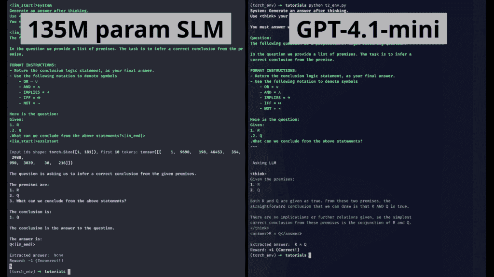

比较小模型和大型语言模型（作者插图）

想想看——RL 通过收集经验和更新策略来最大化良好体验。但如果大部分体验都是完全糟糕的，并且模型收到 0 奖励，它就没有办法优化，因为它没有任何信号来改进。因此，建议的方法是首先使用监督微调教给模型你想要训练的行为。以下是一个简单的脚本：

```py
client = openai.AsyncClient()
ENVIRONMENT = "propositional_logic"
model = "gpt-4.1-mini"
semaphore = asyncio.Semaphore(50)
num_datapoints = 200
system_prompt = (
    system_prompt
    + """You will also be provided the real answer. Your thinking should eventually result in producing the real answer."""
)

dataloader = create_dataset(name=ENVIRONMENT, size=num_datapoints)

@backoff.on_exception(backoff.expo, openai.RateLimitError)
async def generate_response(item):
    async with semaphore:
        messages = [
            {"role": "system", "content": system_prompt},
            {
                "role": "user",
                "content": f"""
    Question: {item['question']}
    Metadata: {item['metadata']}
    Answer: {item['answer']}
                    """,
            },
        ]
        response = await client.chat.completions.create(messages=messages, model=model)
        return {
            "question": item["question"],
            "metadata": item["metadata"],
            "answer": item["answer"],
            "response": response.choices[0].message.content,
        }

async def main():
    responses = await asyncio.gather(*[generate_response(item) for item in dataloader])
    fname = f"responses_{ENVIRONMENT}_{model}.json"
    json.dump(responses, open(fname, "w"), indent=4)
    print(f"Saved responses to {fname}")

if __name__ == "__main__":
    asyncio.run(main())
```

为了生成微调数据集，我首先使用一个类似 LLM 的 GPT-4.1-mini 生成思考和答案标签。这样做非常简单——我们为每个任务采样大约 200 个示例，调用 OpenAI API 生成响应，并将其保存在磁盘上。

在 SFT 过程中，我们加载我们想要训练的基础模型，附加一个可训练的 LORA 适配器，并进行参数高效的微调。以下是我使用的 LORA 配置。

```py
lora:
  r: 32
  lora_alpha: 64
  lora_dropout: 0
  target_modules: ["q_proj", "v_proj", "k_proj", "o_proj", 
                   "up_proj", "down_proj", "gate_proj"] 
```

LORA 允许训练过程更加内存高效，并减少了损坏原始模型的风险。你可以在我的 YouTube 视频中找到参数高效的监督微调的详细信息。

我使用我能找到的最小的语言模型——HuggingfaceTB/SmolLM-135M-Instruct，在 200 个三段论数据示例上训练了一个 LORA 适配器，它为我们带来了 46% 的准确率。大致来说，这意味着我们 46% 的时间能生成正确的答案。更重要的是，我们经常能正确地格式化输出，因此我们的正则表达式可以更频繁地从响应中安全地提取答案。

### 对于 SLMs 的更多优化和实际考虑

1.  并非所有推理任务都能被所有模型解决。**验证一个任务对于模型来说是否过于困难或过于简单的一个简单方法就是检查模型在你任务上的基础准确率**。如果它低于 10-20%，那么这个任务很可能非常困难，你需要额外的监督预热微调。

1.  **即使在小型数据集上，SFT 也可以在小型模型上一般性地显示出巨大的准确率提升**。如果你能获得一个好的数据集，你可能在许多情况下甚至不需要进行强化学习。SLMs 具有极大的可调性。

1.  像 DAPO（[DAPO](https://arxiv.org/abs/2503.14476)）和[对 R1 的批判性视角](https://arxiv.org/abs/2503.20783)这样的论文声称，[DeepSeek](https://arxiv.org/pdf/2402.03300)的原始损失归一化存在**长度偏差**。他们提出了其他值得一看的归一化方法。对于我的项目，常规的 DeepSeek 损失就足够了。

1.  DAPO 还提到了在原始 R1 论文中**移除 KLD 项**。最初，这个损失的目标是确保更新策略永远不会离基策略太远，但 DAPO 建议不要使用它，因为在推理过程中策略的行为可能会发生剧烈变化，使得这个 KLD 项成为一个不必要的正则化项，这将限制模型的能力。

1.  **生成多样化的响应是使强化学习成为可能的关键**。如果你只生成正确的响应，或者只生成错误的响应，优势将为 0，这将给强化学习算法提供没有任何训练信号。我们可以通过增加`generate()`中的`temperature`、`top_p`和`num_return_sequences`参数来生成多样化的响应。

1.  你也可以通过在奖励函数中添加更多项来生成**多样化的奖励**。例如，一个长度奖励，惩罚过长的推理。

1.  以下参数在增加更多计算成本的同时提高了训练的**稳定性**：增加每个滚动的生成次数，增加缓冲区的大小，降低学习率。

1.  如果你有限制资源来训练这些模型，请使用**梯度累积**（甚至梯度检查点）。

1.  在这篇文章中，我跳过了一些关于**填充**的细节。当将经验保存到缓冲区时，最佳实践是完全删除填充标记——并在训练期间加载小批量时重新创建它们。

1.  在<think>和<answer>（以及它们的闭合标签）周围留出空白是最好的。这导致**一致的标记化**，使 SLMs 的训练稍微容易一些。

## 4. 结果

这里是我的 YouTube 视频，它更直观地解释了这篇博客中的所有内容，并提供了一个如何编码此类内容的动手教程。

在对 SmolLM-135M 进行监督微调的推理任务上，我们的成绩提升到了 60%！你可以在这里看到奖励曲线——奖励的健康标准差表明，我们确实在整个过程中得到了多样化的响应，如果我们想用强化学习进行训练，这是一个健康的现象。

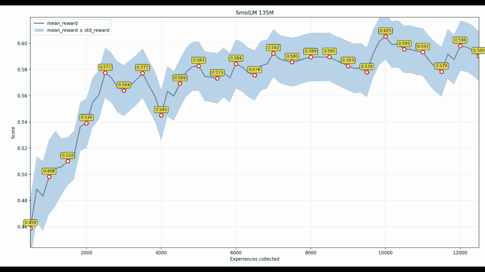

Syllogism 任务在 SmolLM-135M 上经过 SFT 后的奖励曲线（作者插图）

这里有一组对我效果很好的超参数。

```py
config:
  name: "path/to/sft_model"
  max_new_tokens: 300 # reasoning + answer token budget
  exploration_batchsize: 8  # number of questions per batch during rollout
  G: 6  # num responses per group
  temperature: 0.7
  batch_size: 16  # minibatch size during training
  gradient_accumulation_steps: 12
  learning_rate: 0.000001  # Advisable to keep this low, like 1e-6 or 1e-7
  top_p: 0.95
  buffer_size: 500 
```

我还用更大的模型重复了这个实验——SmolLM-360M-Instruct 和 Qwen3-0.6B 模型。在后者中，我能够达到高达 81%的准确率，这真是太棒了！在推理任务上，平均增加了 20%的附加提升！

在我认为更难的命题逻辑任务中，我也在所有小型模型上看到了类似的提升！我相信，通过更多的指令调整和强化学习微调，可能是在多个任务同时进行，我们可以将这些模型的智能提升到一个更高的水平。在单一任务上的训练可以产生快速的结果，这正是我想要为这个 YouTube 视频实现的，但它也可能成为模型整体智能的瓶颈。

让我们以一个小模型输出推理数据和解决任务的 GIF 结束这篇文章。享受吧，保持精彩！

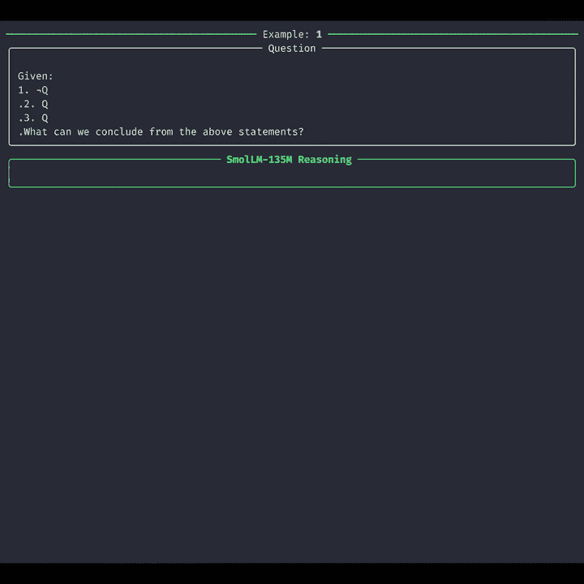

在命题逻辑任务上训练后的 SmolLM-135M（来源：作者）

* * *

## 参考文献

**作者 YouTube 频道**：[`www.youtube.com/@avb_fj`](https://www.youtube.com/@avb_fj)

**作者 Patreon**：[www.patreon.com/NeuralBreakdownwithAVB](https://www.patreon.com/c/NeuralBreakdownwithAVB)

**作者 Twitter（X）账号**：[`x.com/neural_avb`](https://x.com/neural_avb)

Deepseek Math: https://arxiv.org/pdf/2402.03300

DeepSeek R1: https://arxiv.org/abs/2501.12948

DAPO: https://arxiv.org/abs/2503.14476

对 R1 的批判性观点：https://arxiv.org/abs/2503.20783

推理健身房库：[github.com/open-thought/reasoning-gym](https://github.com/open-thought/reasoning-gym)

了解推理的好地方：[`github.com/willccbb/verifiers`](https://github.com/willccbb/verifiers)

学习代码的好地方：[`github.com/huggingface/trl/blob/main/trl/trainer/grpo_trainer.py`](https://github.com/huggingface/trl/blob/main/trl/trainer/grpo_trainer.py)
