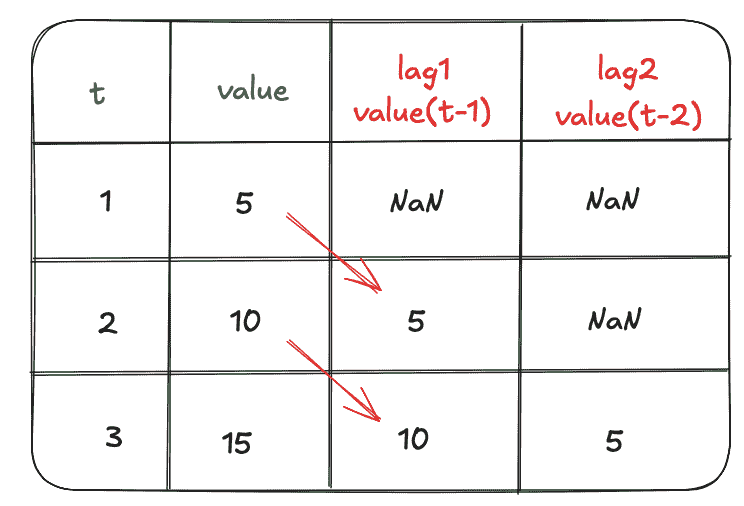
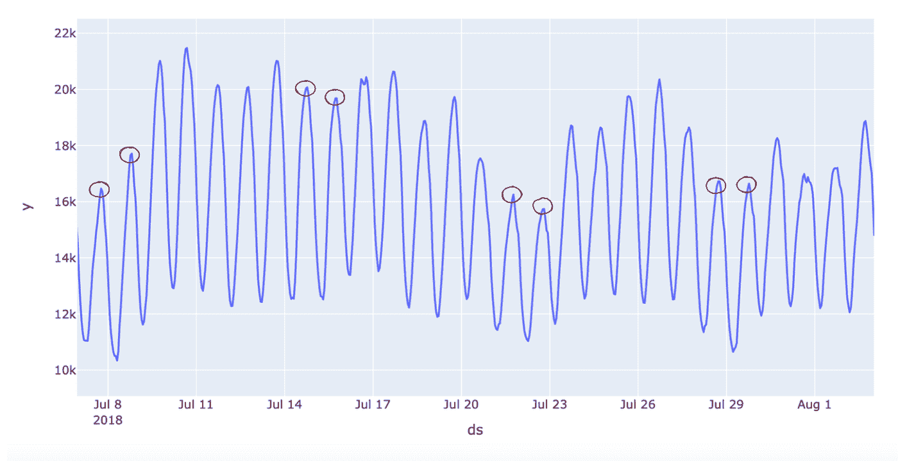
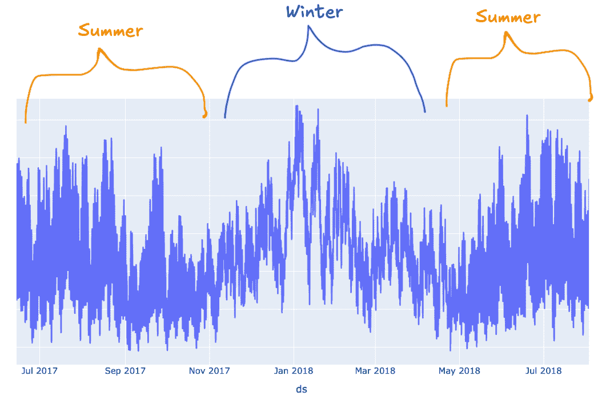
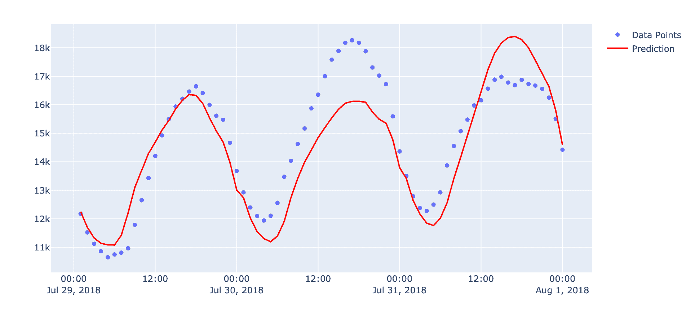

# 如何：使用滞后项预测时间序列

> 原文：[`towardsdatascience.com/how-to-forecast-time-series-using-lags-5876e3f7f473/`](https://towardsdatascience.com/how-to-forecast-time-series-using-lags-5876e3f7f473/)

如何：使用滞后项预测时间序列

.以下是如何利用它们来获得优势



作者图片

时间序列模型的特点是过去值往往会影响未来值。当你的数据中存在任何形式的**季节性**（换句话说，你的数据遵循每小时、每天、每周、每月或每年的周期）时，这种关系甚至更加强烈。

通过特征如小时、星期几、月份等来捕捉这种关系，但你也可以添加滞后项，这可以迅速将你的模型提升到下一个层次。

# 什么是滞后项？

**滞后值**简单来说就是：在某个时间点或另一个时间点，先于当前值的一个值。

假设你有一个时间序列数据集，其值如下：[5,10,15,20,25]。

25，作为你最近的一个值，是时间 t 的值。

20 是 t-1 的值。15 是 t-2 的值，以此类推，直到数据集的开始。

这是有直觉意义的，因为“滞后”这个词暗示着某物“落后”于另一物。

当我们使用滞后特征训练模型时，我们可以训练它识别与先前值如何影响当前值和未来值相关的模式。

## 为什么使用滞后项？（+如何实现）

为了展示滞后项如何使你的模型受益，我将通过一个使用[每小时能源消耗数据集](https://www.kaggle.com/datasets/robikscube/hourly-energy-consumption?resource=download&select=pjm_hourly_est.csv)（[CC0 1.0 许可](https://creativecommons.org/publicdomain/zero/1.0/)）的例子来引导你。

这里是关于这个数据集大约四周的样本，这样你可以感受到它的样子：



作者截图

如你所见，由于周末（用红色圆圈表示）在这四周切片中的使用率较低，存在一些周季节性。还有明显的日季节性，因为一天的高峰通常在 17:00 至 19:00（下午 5 点至 7 点）之间。

当你放大查看时，你还可以看到使用模式在一年中的月份之间有所不同（尤其是夏季与冬季月份）。



作者截图

如果我要训练一个常规的时间序列模型，我会关注以下特征：

+   一天中的小时

+   一周中的某一天

+   年中的月份

我将使用[NIXTLA mlforecast 库](https://nixtlaverse.nixtla.io/mlforecast/index.html)的例子来展示，因为它不仅使时间序列预测变得非常简单，而且还能轻松地将滞后特征添加到你的时间序列模型中。

首先，我使用我列出的特征训练了一个常规模型。首先，我加载了数据集并为其准备了 NIXTLA 库：

```py
import pandas as pd
from mlforecast import MLForecast
from sklearn.ensemble import RandomForestRegressor

# Load in data and basic data cleaning
df = pd.read_csv('AEP_hourly.csv')
df['Datetime']=pd.to_datetime(df['Datetime'])
# Sort by date
df.set_index('Datetime',inplace=True)
df.sort_index(inplace=True)
df.reset_index(inplace=True)
# This dataset is huge with over 100,000 rows
# Get only the last 10,000 rows of hourly data (a little over a year of data)
df = df.tail(10000)

# NIXTLA requires that your date/timestamp column be named "ds"
# and your target variable be named y
df.rename(columns={'Datetime':'ds','AEP_MW':'y'},inplace=True)
# NIXTLA requires a "unique_id" column in case you are training
# more than one model using different datasets, but if you're only
# training with 1 dataset, I just create a dummy constant variable
# column with a value of 1
df['unique_id']=1
```

然后，我将数据分割成训练集和测试集，为建模做准备：

```py
# Split into train/test sets. For this problem, 
# I don't want a huge test set, since when using lags, you'll have to
# predict using predictions after the first hour forecast.
# (More on this later)
# So my test set will be only 48 hours long (48 rows)
train_size = df.shape[0] - 48

df_train = df.iloc[:train_size]
df_test = df.iloc[train_size:]
```

接下来，我使用 NIXTLA 训练了一个随机森林模型：

```py
# NIXTLA allows you to train multiple models, so it requires
# a list as an input. For this exercise, I only trained 1 model.
models = [
    RandomForestRegressor(random_state=0)
]

# Instantiate an MLForecast object and pass in:
# - models: list of models for training
# - freq: timestamp frequency (in this case it is hourly data "H")
# - lags: list of lag features (blank for now)
# - date_features: list of time series date features like hour, month, day
fcst = MLForecast(
    models=models,
    freq='H',
    lags=[],
    date_features=['hour','month','dayofweek']
)

# Fit to train set
fcst.fit(df_train)
```

最后，我在测试集上进行了预测（使用预测对象预测接下来的 48 小时，并与测试集值进行比较），以及运行了包含 3 个窗口的交叉验证，每个窗口预测 24 小时：

```py
from sklearn.metrics import mean_squared_error
from utilsforecast.evaluation import evaluate
from utilsforecast.losses import rmse

# Predict 
predictions = fcst.predict(48)

# Compare to test set. This returns a result of 689.9 RMSE
print(mean_squared_error(df_test.y.values,predictions.RandomForestRegressor.values,squared=False))

# Run cross validation with train df
cv_df = fcst.cross_validation(
    df=df_train,
    h=24,
    n_windows=3,
)

# Get CV RMSE metric
cv_rmse = evaluate(
    cv_df.drop(columns='cutoff'),
    metrics=[rmse], 
    agg_fn='mean'
)

# Prints out 1264.1
print(f"RMSE using cross-validation: {cv_rmse['RandomForestRegressor'].item():.1f}")
```

因此，使用这个时间序列模型——使用小时、星期几和月份——的平均交叉验证 RMSE 为 1264.1，测试集 RMSE 为 689.9。

让我们将其与一个基于滞后的模型进行比较。

```py
# Pass in lags as a list argument - I'm tracking lags for 24 hours
# since the goal of our model is to forecast 24 hours at a time
fcst_lags = MLForecast(
    models=models,
    freq='H', 
    lags=range(1,25), 
    date_features=[] 
)

fcst_lags.fit(df_train)

# Predict 24 hours twice for the test set (48 hours)
predictions_lags = fcst_lags.predict(48)

# RMSE test score w/ lags: 421.86
print(mean_squared_error(df_test.y.values,predictions_lags.RandomForestRegressor.values,squared=False))

# Cross validation:
cv_df_lags = fcst_lags.cross_validation(
    df=df_train,
    h=24,
    n_windows=3,
)

cv_rmse_lags = evaluate(
    cv_df_lags.drop(columns='cutoff'),
    metrics=[rmse], 
    agg_fn='mean'
)

# RMSE for CV w/ lags: 1038.7
print(f"RMSE using cross-validation: {cv_rmse_lags['RandomForestRegressor'].item():.1f}")
```

让我们逐一比较这些指标：

+   **无滞后项加时间序列特征（小时、星期几、月份）测试 RMSE：** 689.9

+   **无滞后项加时间序列特征 CV RMSE：** 1264.1

+   **带有滞后项的模型测试 RMSE：** 421.86

+   **带有滞后项 CV RMSE：** 1038.7

注意：在两种情况下，CV RMSE 都远高于测试 RMSE。这是因为 CV 评估的数据与测试集不同。

CV 正在评估以下 3 天：7 月 29 日至 31 日，每次预测 24 小时，然后取平均值。保留测试集正在评估 8 月 1 日至 2 日，每次预测 48 小时。

为了进一步研究这个问题，我将交叉验证预测值与实际值进行了对比，并得到了每个分割窗口（共有 3 个，每天一个）的 RMSE。

在这两种情况下，模型似乎都对 7 月 30 日（RMSE 为 1445）有显著的低估，对 7 月 31 日（RMSE 888）有轻微的高估。这提高了交叉验证的平均值。



滞后预测模型交叉验证预测值与实际值对比。图片由作者提供

因此，可能由于某些原因（可能是我们没有考虑的其他变量，例如天气），交叉验证的保留集在这两种情况下表现都不太好。

*当你的指标看起来有点问题时，调查发生的事情总是很重要的。*

*在真实的机器学习项目案例中，我会深入调查为什么这些天特别难以预测，但为了本文的目的，我不会这样做——只是指出，这样做总是一个好的主意。*

如果我取平均值：

**无滞后项模型：** 997

**带有滞后项模型：** 730.28

尽管如此，带有滞后项的模型在交叉验证和保留测试集中都优于无滞后项的模型。

## 警告

滞后项可以为你的模型提供有用的信息并提高其性能。它们也相对容易实现，尤其是在像 NIXTLA 这样的构建良好的时间序列库的帮助下（注意：我不是 NIXTLA 的赞助商）。

### 但是，过度依赖滞后项可能会成为一个问题，尤其是如果你的目标是预测更长的预测范围。

基本上，滞后项的问题在于，在某个时刻，模型不再有实际值作为特征来使用，因此它必须依赖于预测。这给模型引入了一些误差。随着你做出越来越多的预测，误差会累积。

例如，假设你只使用 1 个滞后列，并且你的数据集如下所示：[1,2,3,4,5]。你在这个数据集上训练了你的模型，现在是你进行下一个 5 行预测的时候了。

在第一次遍历中，我们处于超过 5 的下一个时间步，让我们称它为时间 t。t-1 时的滞后特征是 5。模型预测下一个值将是 6。为了预测下一个值，在 t+1 时，我们需要使用我们的预测：6。这引入了不确定性，因为 6 是一个预测值，而不是一个真实的滞后值。

如果模型在 t+1 时预测值为 8，那么下一次预测，在 t+2 时必须将 8（由于使用了 6 作为特征，因此具有额外的不确定性）作为下一个滞后特征。

以此类推，每次预测的不确定性都在增加。

因此，你可以看到这可能会在更长的预测范围内导致更差的表现。

## 结论

滞后特征对于预测较短的时间范围，如 1-48 行，非常有用。之后，你需要仔细观察你的误差。[使用预测区间](https://nixtlaverse.nixtla.io/mlforecast/docs/how-to-guides/prediction_intervals.html) 来衡量不确定性。

除了滞后特征之外，优先考虑其他数值和分类特征也很重要。标记是否为假日、周末与工作日，或季节，也可以改善你的模型，以及包括外部变量，如温度。

然而，一切取决于你的具体数据集，所以总是要尝试多个特征和组合进行实验。

在 [这里](https://github.com/hadenpell/Medium-Tutorials/tree/main/Time%20Series%20With%20Lags) 找到完整的源代码和数据集。

## 感谢阅读

+   在 [LinkedIn](http://linkedin.com/in/hadenpelletier/) 上与我联系

+   我现在在 [Topmate](https://topmate.io/haden_p) 上提供 1:1 的数据科学辅导、职业指导/辅导、写作建议、简历审查等服务！

> [**每当 Haden Pelletier 发布时，都会收到电子邮件**](https://medium.com/@pelletierhaden/subscribe)
