# 如何格式化您的 TDS 草稿：快速指南

> 原文：[`towardsdatascience.com/how-to-format-your-tds-draft-a-quickish-guide/`](https://towardsdatascience.com/how-to-format-your-tds-draft-a-quickish-guide/)

* * *

我们都知道什么能让作者和编辑都感到高兴：一个顺畅、高效的发布流程，其中从草稿到已发布文章的路径既快又无痛苦。

我们也知道，我们的大多数贡献者——无论是老手还是新手——可能没有很多使用 WordPress（我们[独立出版物](https://towardsdatascience.com/towards-data-science-is-launching-as-an-independent-publication/)背后的软件）及其块编辑器的经验。我们编写了这个指南，为您提供具体的指导，并回答作者向我们提出的一些常见问题。您可以从头到尾阅读这篇帖子（特别是如果您没有任何块编辑器经验），或者跳到与您当前需求相关的部分。

* * *

+   **什么是块编辑器？**

+   **如何开始一个新的草稿？**

+   **所有 TDS 文章必须具备的基本要素是什么？**

+   **你将最常使用的块（以及如何使用它们）**

    +   **段落**

    +   **标题**

    +   **图片**

    +   **引用**

    +   **列表**

    +   **分隔符**

    +   **Prismatic（用于代码块）**

    +   **短代码（用于 LaTeX 符号）**

    +   **表格**

    +   **嵌入**

        +   **GitHub Gists**

        +   **媒体嵌入**

+   **如何请求帮助我的草稿？**

+   **我的草稿可以发布了！接下来是什么？**

* * *

## 什么是块编辑器？

我们网站的核心发布工具是块编辑器。您可以在 WordPress 文档网站上找到其各种组件和功能的丰富资源；如果您以前从未使用过它，一个好的起点是[这个页面](https://wordpress.org/documentation/article/wordpress-block-editor/)，它解释了您在使用编辑器时可以采取的基本操作，并为您在内容周围（以及其中）看到的许多按钮和符号提供了清晰的图例。

请记住，如果你过去作为站点管理员或编辑已经使用过块编辑器，那么作为 TDS 作者看到的视图将会略有不同。我们希望为你提供一个专注的草稿环境，尽量减少干扰，因此只有你格式化文章所需的工具和选项将可见。

## 如何开始一个新的草稿？

每次您登录我们的[贡献者门户](https://contributor.insightmediagroup.io/)的作者仪表板时，您可以通过点击**文章** **→** **新建文章**来开始一个新的草稿：

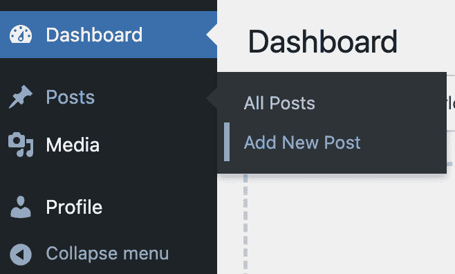

如果你已经在我们的网站上有了几个处于不同完成状态的草稿，点击[这个链接](https://contributor.insightmediagroup.io/wp-admin/edit.php)将直接带你到一个包含你文章的列表；只需选择你想要工作的那篇即可。

## 所有 TDS 文章都必须具备哪些基本要素？

如你所知，TDS 在文章格式、视角和写作风格方面非常灵活。但每篇文章在我们可以发布之前都必须具备以下要素。

### 标题

一个吸引人、描述性、简洁的标题是必不可少的。将其输入到你的文章内容**上方**的顶部文本字段，然后你就准备好了：

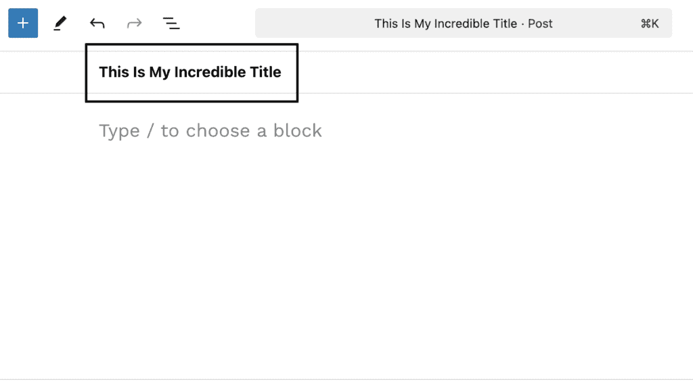

加分项：确保你的标题使用**标题大小写**——例如，“我的标题令人无法抗拒且简洁，但不是点击诱饵”，而不是“我的标题令人无法抗拒且简洁，但不是点击诱饵。”（后者是**句子大小写**，我们将其保留用于你的副标题。）

### 副标题

说到副标题：你需要一个！简洁是很好的——目的是为你的标题添加一点更多背景，并提高潜在读者点击你的文章的可能性。

在块编辑器中，副标题被称为**副标题**，你直接将其添加到——你猜对了——**副标题字段**中，你可以在文章设置侧边栏中找到它，就在文章内容右侧：

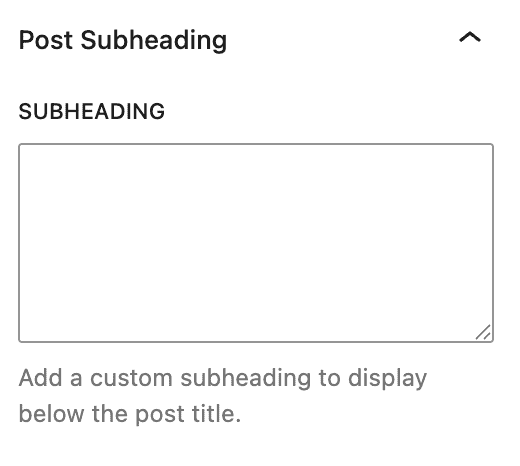

如果你感觉有点冒险，将你的副标题（抱歉，副标题）复制并粘贴到**文章摘要**字段，该字段位于同一文章设置侧边栏的顶部附近。（如果你不想那么冒险，没关系——我们的编辑会帮你处理。）

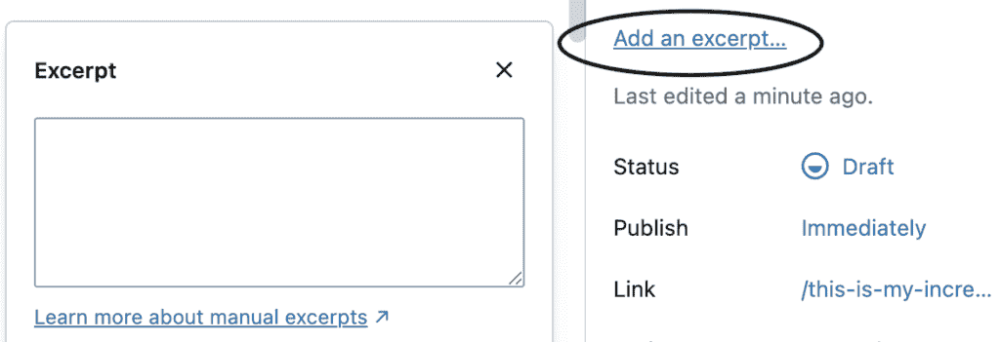

### 特色图片

每篇文章都需要一个！无论你在网上找到它（当然，必须是版权免费的），自己创建它，还是用 AI 工具生成一个，它都是你文章中最重要的视觉元素，所以花几分钟在这项选择上是很值得的。（如果你不确定如何进行，这里有一些[想法和指导](https://towardsdatascience.com/writers-faq-462571b65b35/#featured-image)。）

一旦你准备好了，将你的图片上传到其指定的**特色图片**插槽，*不要*将其放入文章正文中。只需点击文章设置侧边栏中的**设置特色图片**按钮即可。

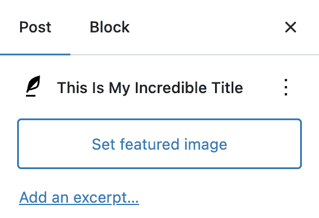

为了让你的编辑们眼中充满真正的喜悦泪水，一旦图片上传，别忘了添加带有必要来源细节的标题：

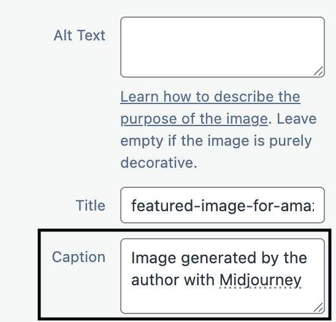

### 标签和类别

随意为你的文章添加一个类别和最多五个标签。虽然这是一个基本元素，但我们很乐意为你处理——所以如果你不确定要选择哪些，只需把这些留给我们即可。

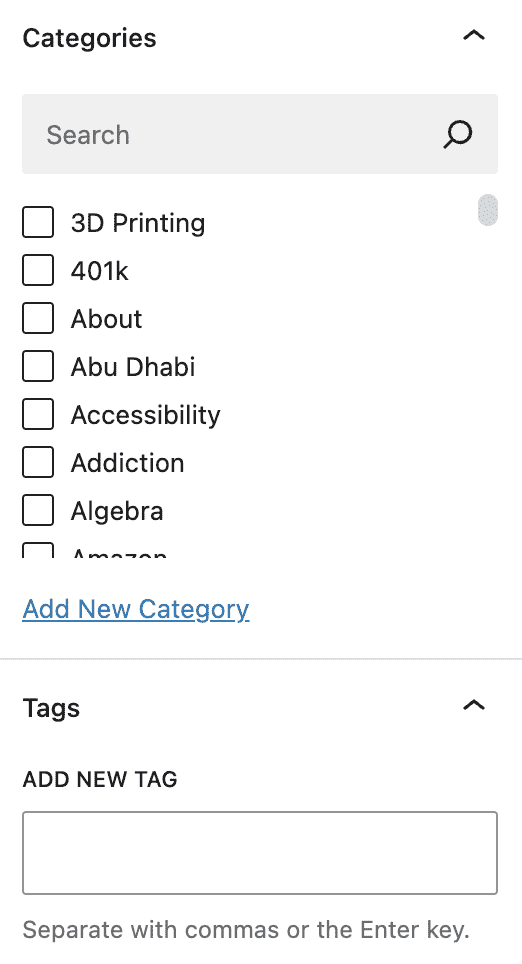

**注意**：我们真正相信我们在 TDS 上发表的所有文章的质量都是一流的，但我们要求你不要自己添加我们的特色标签（如深度挖掘或编辑精选）。我们的团队考虑了每一篇文章，然后我们每天在我们的端为一些文章添加这些标签。

## 你最常用的块（以及如何使用它们）

### 段落

这就是你的文章文本所在的地方——这就是为什么段落块可能是你最频繁使用的。将光标放在段落中的任何位置以使选项菜单可见，并突出显示你想要添加特定样式（如**粗体**、*斜体*和`内联代码`等）的任何单词。

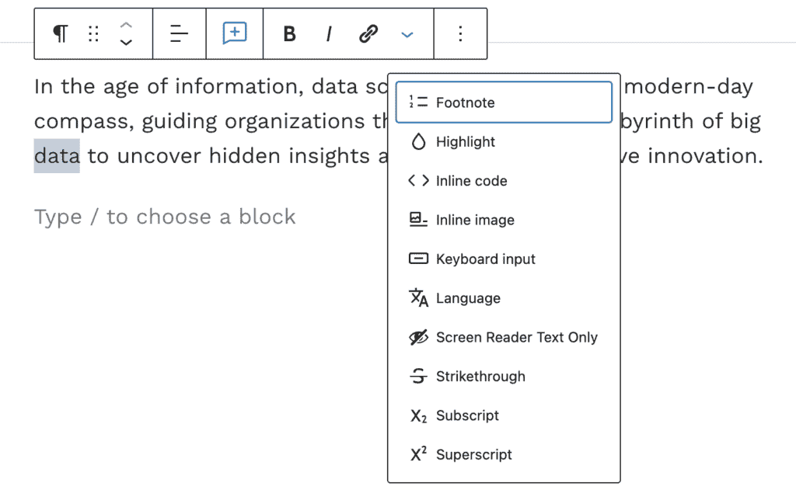

### 标题

在你的文章中创建清晰的结构层次有助于读者和搜索引擎导航你的内容。每次开始新章节时添加一个新的标题，并根据自己的文章位置选择正确的标题。

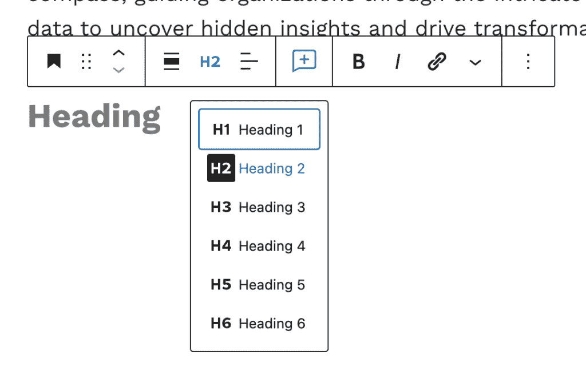

**H1** 标题应保留用于文章标题，所以不要在文章正文中添加更多此类标题。**H2** 标题用于新章节，如果你的较大章节包含较短的子章节，则可以根据需要使用**H3** 或 **H4** 标题。

### 图片

使用图片块将大多数视觉媒体添加到你的文章中——图表、屏幕截图、动画等。最重要的是记住，你不应该将图片复制粘贴到块编辑器中——你需要直接将每个媒体文件上传到我们网站的媒体库中。

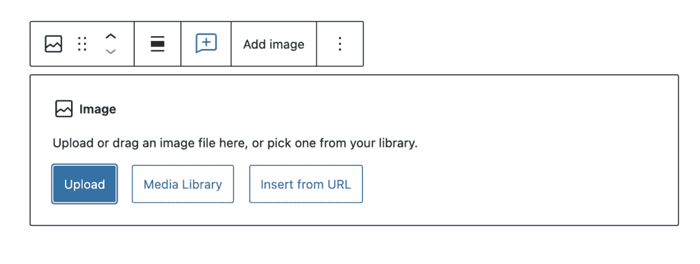

然而，一旦上传，你可以在同一篇文章或几篇文章中多次重用同一图片。

不要忘记给你的图片添加标题——这是你提供读者（和你的 TDS 编辑）关于你的图片来源和许可状态必要信息的地方。

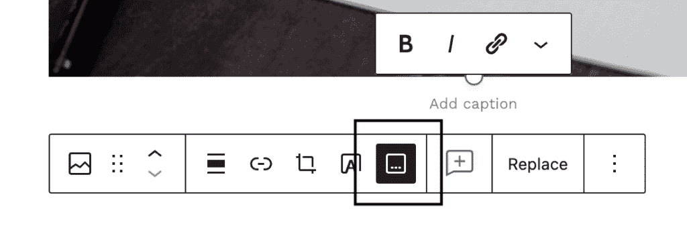

如果你需要快速回顾我们的图片指南，[我们为你准备好了](https://towardsdatascience.com/questions-96667b06af5/#images)。

### 引用

> 引用块是一种视觉方式，用于突出特定的点或想法，或引用来自外部来源的较长的段落。

适度使用它们可以非常有效，但不要过度使用——就像粗体或斜体文本一样，引用块可能会很快变得分散注意力。

### 列表

无论是为了你的...

+   目录，

+   关键要点，

+   或者任何其他可以从中受益于整洁、项目符号排列的元素...

列表块应该是你的首选。一旦你输入第一个项目，块编辑器会自动检测你是在创建有序列表还是无序列表。

要在你的列表中添加嵌套列表，只需开始一个新的项目并点击制表键。

### 分隔符

有时，标题可能不足以在章节之间或章节内部创建视觉分隔。

***

在这些情况下，使用分隔符模块——只需确保你选择了**点状**样式，这是我们选择作为 TDS 默认样式的：

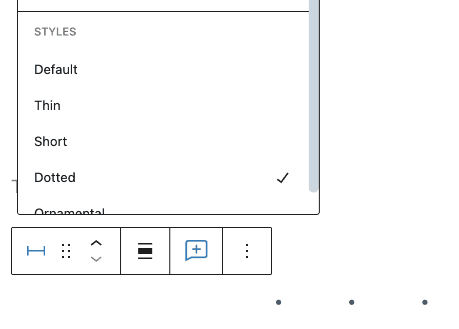

### Prismatic（用于代码块）

我们的文章中有很多（很多！）都包含代码，所以我们想确保它们看起来整洁、清晰、专业。为此，我们启用了 Prismatic 块，这应该是你嵌入较长的代码块到文章中的默认选择。（一个主要的例外：如果你决定使用 GitHub Gists 代替，我们也欢迎这样做。）

随意输入你的代码或从 IDE 中复制粘贴它。然而，你需要记住的一个关键点是**选择块的编程语言**——否则，你的代码在 TDS 前端上不会正确显示。幸运的是，选择正确的语言非常简单，你可以在块的设置侧边栏中直接完成：

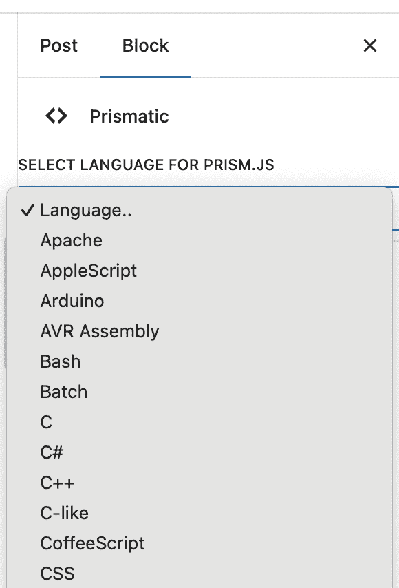

有几十种编程语言可供选择，你几乎肯定能找到你需要的。如果你没有找到，选择一个与你在编写的稀有、新兴语言在语法上足够接近的选项。（如果你只是想在代码块中展示纯文本，最好的选择是使用 HTML。）

### 短代码（用于 LaTeX 标记）

如果你的文章包含大量公式（或者如果你坚持，是*公式*），方程式和其他数学符号，你可以通过将你的 LaTeX 标记插入到短代码块中确保它们在 TDS 上看起来很棒。为此有几种不同的方法，我们强烈建议[阅读 MathJax-LaTeX 的文档](https://wordpress.org/plugins/mathjax-latex/)，这是我们网站上 LaTeX 的 WordPress 插件。

如果你的需求不那么复杂，你还可以……

+   直接使用便捷的键盘快捷键添加一些 ≠、π 或 ∑（仅举几个例子）。

+   在你选择的工具外部创建你的复杂方程式，然后截图——然后将其上传到图像块。

### 表格

对于比较实验结果、产品特性等，表格块使得创建简洁的表格变得非常容易——只需决定你需要多少列和行，你基本上就可以开始了。

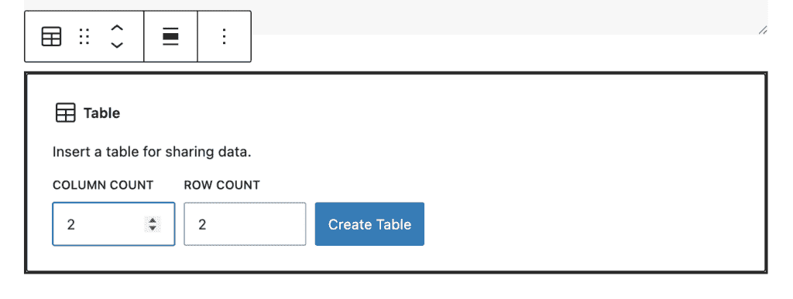

你还可以通过块设置侧边栏进一步自定义你的表格（选择固定宽度单元格，添加标题部分等）。

### 嵌入

我们为作者启用了几种常用的嵌入类型，允许你无缝地将其他平台的内容集成到你的文章中。

#### GitHub Gists

通过 Gists 分享代码在数据科学和机器学习专业人士中很常见，这个模块使得将这种做法扩展到你的 TDS 文章中成为可能。这需要两个简单的步骤：

1.  在 GitHub 上，从你的 GitHub Gist 复制嵌入链接：

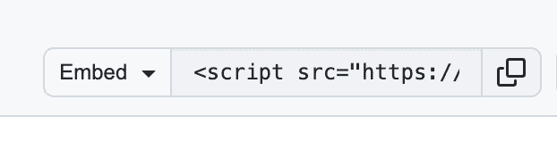

2. 在你的文章中添加一个 GitHub Gist 嵌入块，并在块设置侧边栏中粘贴嵌入链接。你应该立即看到你的 Gist 预览。

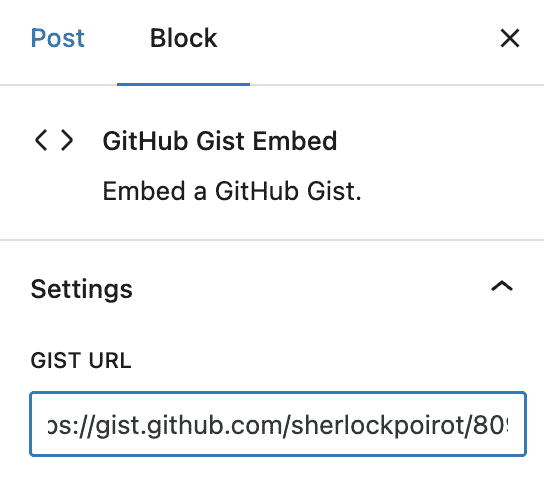

你可以添加尽可能多的 Gists，它们在我们网站上格式将保持不变。

#### 媒体嵌入

如果你想要嵌入推文、YouTube 视频和其他来自外部平台的可嵌入媒体，点击块编辑器中的**+**符号，输入 embed，你将看到可用的各种选项。

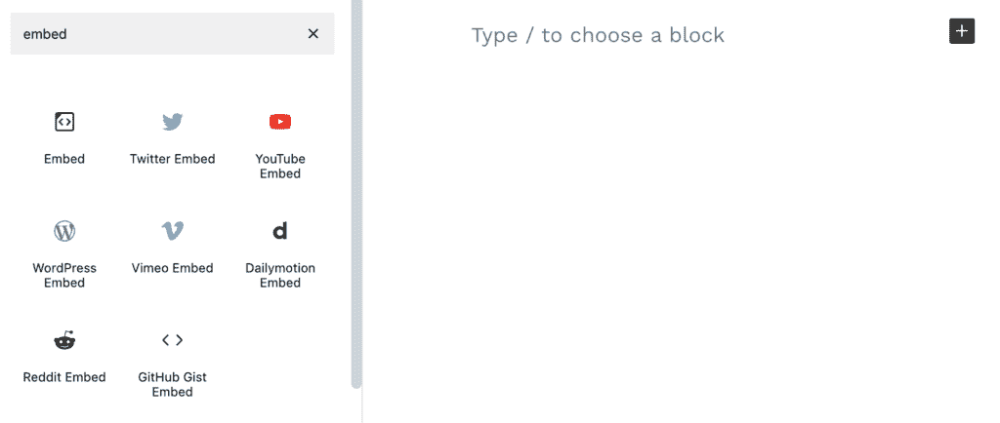

然后，粘贴你想要嵌入到块中的媒体的 URL，让编辑完成剩下的工作。注意，对于某些平台，你可能需要一个特殊的嵌入链接。

如果你想要嵌入其他媒体但不确定是否可行或如何操作，请直接联系——我们将尽力为你找到解决方案。

## 我该如何请求帮助我的草稿？

我们很高兴你问了！如果你在审稿过程中、撰写文章时，甚至在你发布帖子后遇到任何问题，你都可以直接从块编辑器中联系。只需突出显示任何单词，点击新的评论符号，然后输入你的问题、笔记或关注点。

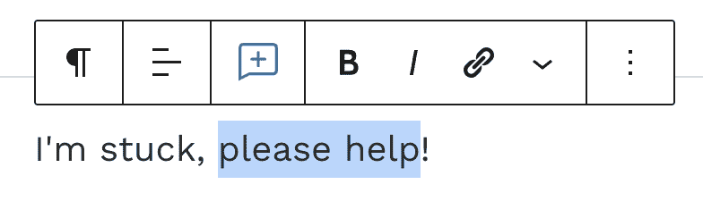

两个需要记住的重要事项：

+   为了获得最快的响应时间，当你输入评论时，**标记我们的团队成员之一**——输入**@**符号将显示你可以 ping 的编辑列表。

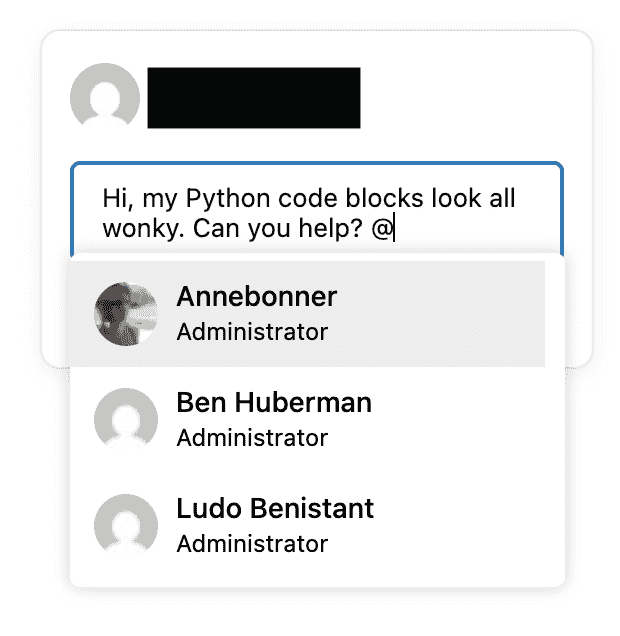

+   **始终**在发布评论后保存你的草稿。这确保了如果你对草稿进行更改，你的评论不会消失得无影无踪，并且会向你 ping 的编辑发送通知。

一旦你发布了评论，你将在草稿的侧边栏中看到它。WordPress 的一个最近更新使得同时查看评论和文章设置侧边栏变得不可能——所以要从其中一个切换到另一个，只需点击屏幕顶部的侧边栏按钮：

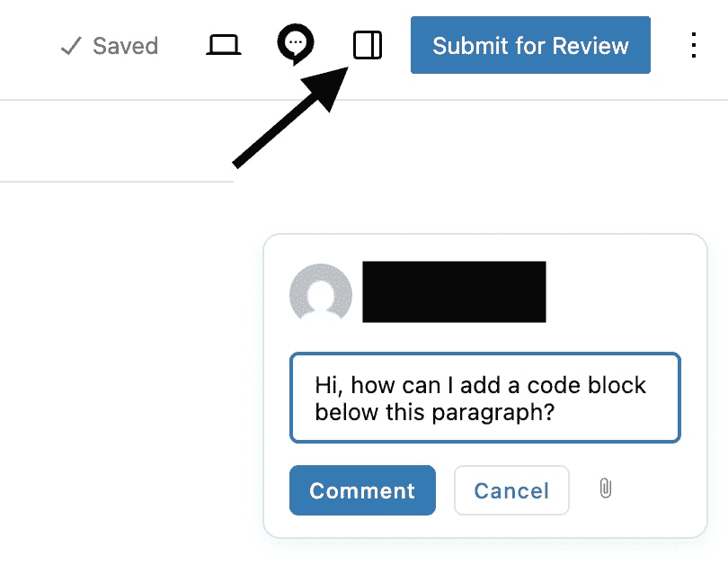

## 我的草稿可以发布了！接下来是什么？

恭喜！你几乎完成了。在你提交文章进行审稿之前，有两件事你应该做——并且有一件事你绝对必须做，以便我们实际上能审阅它。

+   给你的文章进行最后的校对永远不是一个坏主意（我们无法过分强调发送给我们一个干净的初稿的好处）。

+   我们还建议你查看你的草稿预览——看看你的文章发布后会是什么样子很有趣，它还为你提供了一个机会，确保一切格式和显示方式都符合你的预期。要预览你的文章，点击编辑器屏幕顶部的笔记本电脑符号（我们认为它是一个笔记本电脑符号？）。

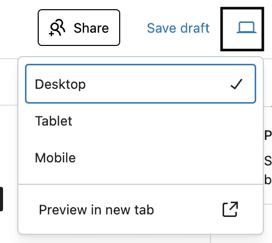

+   最后，**请务必**提交您的文章以供审阅——您可以通过点击块编辑器右上角的（掌声，请）**提交审阅**按钮来完成此操作。

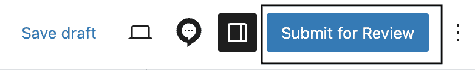

一旦您点击该按钮，您的文章就会进入我们的审阅队列；您仍然可以对其进行修改，但一旦收到审阅通知，最好将这些修改保持在最小范围内。

如果在撰写和格式化文章时您有任何疑问或遇到任何问题，请通过电子邮件或从您的文章中直接联系我们寻求帮助。

* * *
