# 如何使用 Python 从 3D 模型生成 GIF

> 原文：[`towardsdatascience.com/how-to-generate-gifs-from-3d-models-with-python/`](https://towardsdatascience.com/how-to-generate-gifs-from-3d-models-with-python/)

作为数据科学家，你知道有效地传达你的见解与见解本身一样重要。

但你如何传达 3D 数据呢？

我敢打赌，我们大多数人都有过这样的经历：你花费数天、数周，甚至数月的时间，一丝不苟地收集和处理 3D 数据。然后到了分享你的发现的时候，无论是与客户、同事还是更广泛的科学界。你匆匆拼凑了几张静态截图，但它们根本无法捕捉到你工作的精髓。那些细微的细节、空间关系以及数据的规模——所有这些都丢失在翻译过程中。

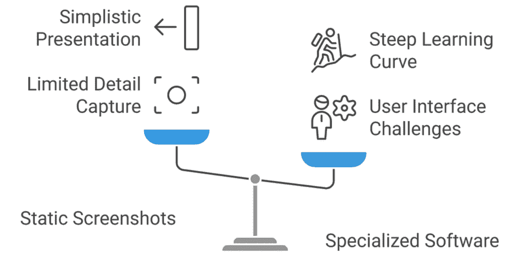

比较三维数据通信方法。© [F. Poux](https://learngeodata.eu/)

或者，也许你已经尝试过使用专门的 3D 可视化软件。但当你客户使用它时，他们会因为笨拙的界面、陡峭的学习曲线和限制性的许可而感到困扰。

应该是一个流畅、直观的过程，却变成了令人沮丧的技术杂技练习。这是一个过于常见的场景：你 3D 数据的辉煌被技术壁垒所困。

这突出了一个常见问题：需要创建任何人都可以打开的可分享内容，即不需要特定的 3D 数据科学技能。

想想看：分享视觉信息最常用的方式是什么？**图像**。

但我们如何从简单的 2D 图像传达 3D 信息呢？

好吧，让我们用“第一性原理思考”：让我们创建可分享的内容，堆叠多个 2D 视图，例如 GIF 或 MP4，从原始点云中生成。

*生成 GIF 和 MP4 的魔法面包。© [F. Poux](https://learngeodata.eu/)*

这个过程对于演示、报告和一般沟通至关重要。但从 3D 数据生成 GIF 和 MP4 可能很复杂且耗时。我经常发现自己在与从 3D 点云快速生成旋转 GIF 或 MP4 文件的挑战作斗争，这个任务看起来很简单，但往往变成了耗时的工作。

当前的流程可能缺乏效率和易用性，而一个简化的流程可以节省时间并改善数据展示。

让我分享一个解决方案，它涉及利用 Python 和特定的库来自动化从点云（或任何 3D 数据集，如网格或 CAD 模型）创建 GIF 和 MP4 的过程。

> 想想看。您已经花费数小时仔细收集和处理这些 3D 数据。现在，您需要以引人入胜的方式展示它们，用于演示或报告。但我们如何确保它能够集成到在上传时触发的 SaaS 解决方案中？您试图创建一个动态的可视化来展示关键功能或见解，但您却陷入了手动捕获帧并拼接它们的困境。我们如何自动化这一过程，使其无缝集成到您现有的系统中？

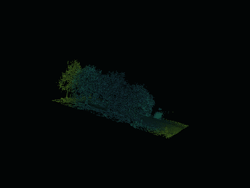

使用该方法生成的 GIF 示例。© [F. Poux](https://learngeodata.eu/)

> 如果您是新手（3D）写作世界，欢迎！我们将进行一次激动人心的冒险，让您掌握一项重要的 3D Python 技能。在深入之前，我喜欢建立一个清晰的场景，即**任务简报**。
> 
> *一旦场景布局完成，我们就开始 Python 之旅。一切皆备。您将看到提示（*🦚**笔记***和* 🌱**成长***）以帮助您充分利用这篇文章。感谢*[***3D Geodata Academy***](https://learngeodata.eu/) *对这一努力的支持。*

## **任务目标 🎯**

您正在为一家新的工程公司“地理空间动态”工作，该公司希望展示其尖端的激光雷达扫描服务。您不是发送静态点云图像给客户，而是提出使用一个新的工具，即 Python 脚本，来生成项目现场的动态旋转 GIF。

在进行市场调研后，您发现这可以立即提高他们的提案质量，从而将项目批准率提高**20%**。这就是视觉叙事的力量。

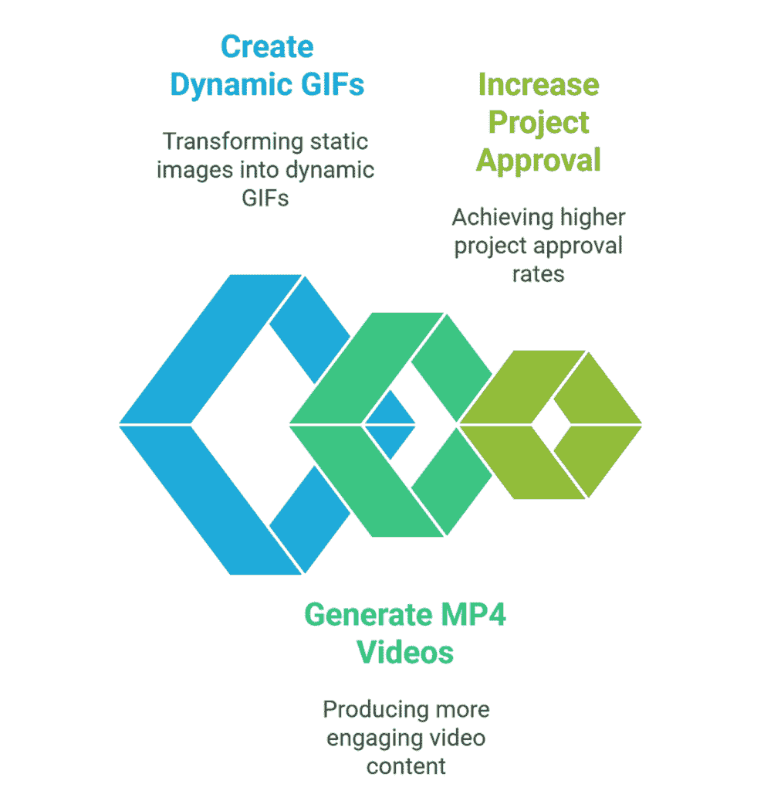

向提高项目批准率迈进的三阶段任务。© [F. Poux](https://learngeodata.eu/)

此外，您甚至可以想象一个更有吸引力的场景，即“地理空间动态”能够大量处理点云，然后生成发送给潜在客户的 MP4 视频。这样，您就可以降低流失率，使品牌更具记忆性。

考虑到这一点，我们可以开始设计一个强大的框架来回答我们任务的目标。

## **框架**

我记得有一个项目，我需要向一群投资者展示详细的建筑扫描。通常的静态图像根本无法捕捉到细微的细节。我迫切需要一种方法来创建旋转 GIF，以传达设计的全貌。这就是为什么我对这个 Cloud2Gif Python 解决方案感到兴奋。有了这个，您将能够轻松地为演示、报告和沟通生成可分享的视觉内容。

我提出的框架简单而有效。它处理原始 3D 数据，使用 Python 和 PyVista 库进行处理，生成一系列帧，并将它们拼接在一起以创建 GIF 或 MP4 视频。高级工作流程包括：

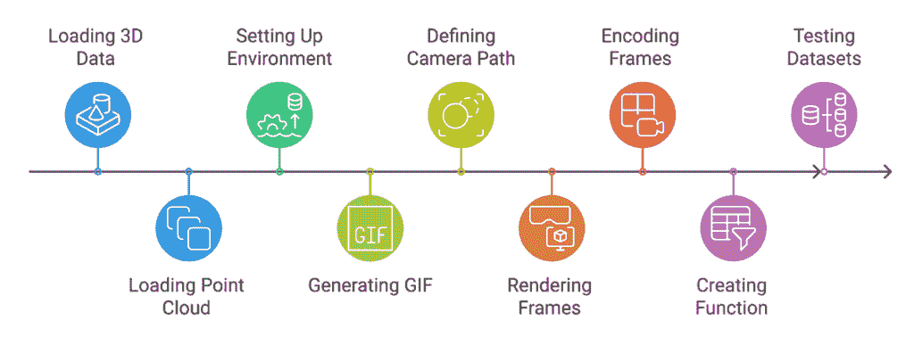

本文中所提到的框架的各个阶段。© [F. Poux](https://learngeodata.eu/)

1. 加载 3D 数据（带纹理的网格）。

2. 加载 3D 点云

3. 设置可视化环境。

4. 生成 GIF

4.1. 定义数据周围的相机轨道路径。

4.2. 沿路径从不同视角渲染帧。

4.3. 将帧编码为 GIF 或

5. 生成轨道 MP4

6. 创建一个函数

7. 使用多个数据集进行测试

这个简化的流程允许轻松定制并集成到现有的工作流程中。这里的关键优势是方法的简单性。通过利用 3D 数据渲染的基本原理，可以构建一个非常高效且自包含的脚本，并部署在任何安装了 Python 的系统上。

这使得它兼容各种边缘计算解决方案，并允许与传感器密集型系统轻松集成。目标是生成一个 GIF 和一个 MP4 文件从 3D 数据集中。这个过程很简单，需要一个 3D 数据集，一点魔法（代码），以及输出为 GIF 和 MP4 文件。

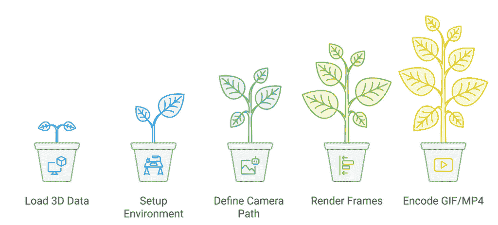

随着我们沿着主要阶段前进，解决方案的增长。© [F. Poux](https://learngeodata.eu/)

现在，我们将需要哪些工具和库来完成这项任务？

### **1. 设置指南：库、工具和数据**

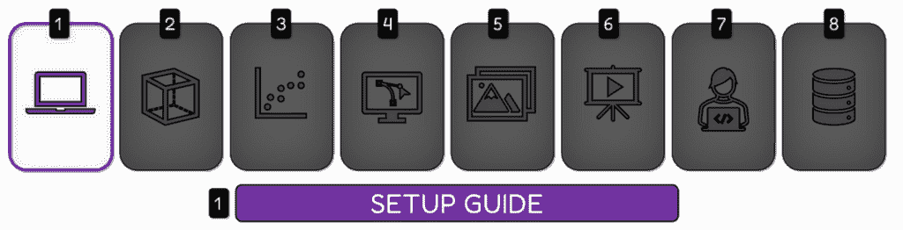

© [F. Poux](https://learngeodata.eu/)

对于这个项目，我们主要使用以下两个 Python 库：

+   **NumPy**：Python 中数值计算的基石。没有它，我不得不以非常低效的方式处理每个顶点（点）。[NumPy 官方网站](https://numpy.org/)

+   **pyvista**：到可视化工具包（VTK）的高级接口。PyVista 使我能够轻松地可视化和交互 3D 数据。它处理渲染、相机控制和导出帧。[PyVista 官方网站](https://www.pyvista.org/)

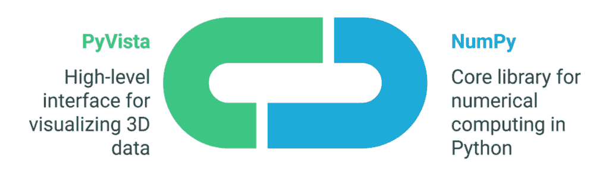

PyVista 和 Numpy 库用于 3D 数据。© [F. Poux](https://learngeodata.eu/)

这些库提供了处理数据、可视化和输出生成的所有必要工具。这套库被精心挑选，以确保外部依赖性最小化，这提高了可持续性，并使其易于在任何系统上部署。

让我分享环境详情以及数据准备设置。

## **快速环境设置指南**

让我简要说明如何设置您的环境。

### **步骤 1: 安装 Miniconda**

四个简单步骤即可获得一个可工作的 Miniconda 版本：

+   访问：[`docs.conda.io/projects/miniconda/en/latest/`](https://docs.conda.io/projects/miniconda/en/latest/)

+   下载您操作系统的“安装文件”（可以是 Windows、MacOS 或 Linux 发行版）

+   运行安装程序

+   打开终端/命令提示符并验证：conda — version

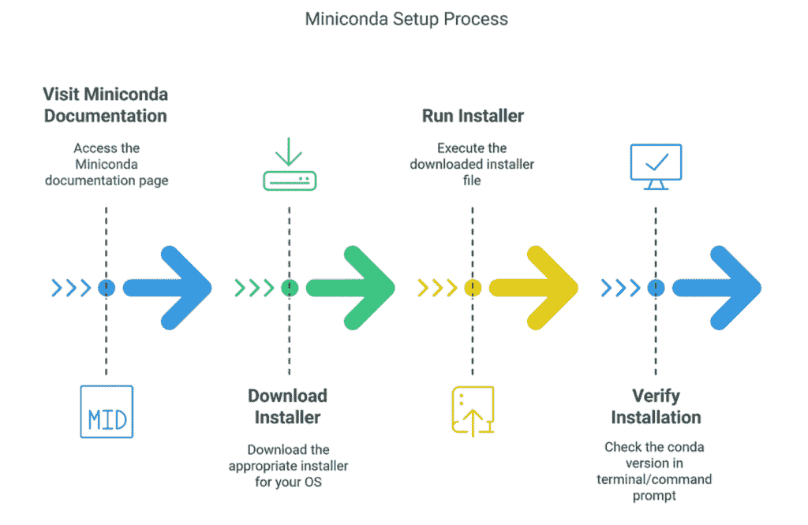

如何为 3D 编码安装 Anaconda。© [F. Poux](https://learngeodata.eu/)

### **步骤 2：创建一个新的环境**

你可以在你的终端中运行以下代码

```py
conda create -n pyvista_env python=3.10
conda activate pyvista_env
```

### **步骤 3：安装所需的包**

为了做到这一点，你可以按照以下方式使用 pip：

```py
pip install numpy
pip install pyvista
```

### **步骤 4：测试安装**

如果你想测试你的安装，请在你的终端中输入 python 并运行以下行：

```py
import numpy as np
import pyvista as pv
print(f”PyVista version: {pv.__version__}”)
```

这应该会返回`pyvista`版本。不要忘记之后从你的终端退出 Python（`Ctrl+C`）。

🦚 **注意**：*以下是一些常见问题和解决方案：*

+   如果 PyVista 没有显示 3D 窗口：`pip install vtk`

+   如果环境激活失败：重启终端

+   如果数据加载失败：检查文件格式兼容性（支持`PLY`，`LAS`，`LAZ`）

美丽，在这个阶段，你的环境已经准备好了。现在，让我分享一些快速获取 3D 数据集的方法。

## **3D 可视化数据准备**

在文章的最后，我与你分享了数据集以及代码。然而，为了确保你完全独立，以下是我经常使用的三个可靠来源，用于获取点云数据：

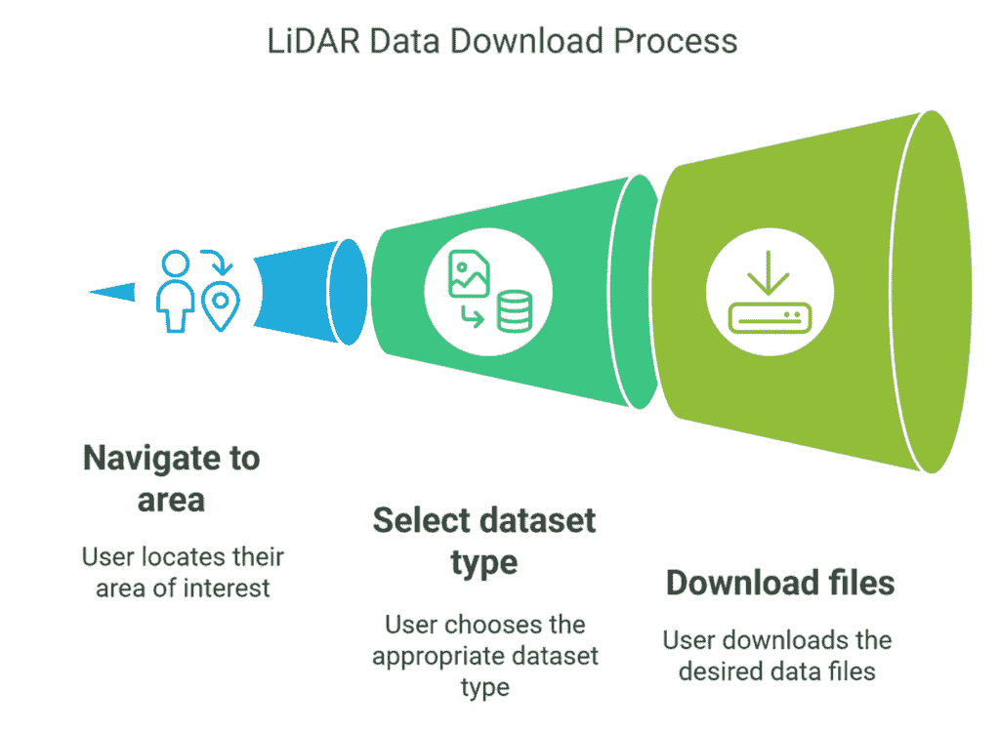

LiDAR 数据下载流程。© [F. Poux](https://learngeodata.eu/)

**美国地质调查局 3DEP LiDAR 点云下载**

+   访问：[`apps.nationalmap.gov/lidar-explorer/`](https://apps.nationalmap.gov/lidar-explorer/)

+   导航到你的兴趣区域

+   下载 LAZ/LAS 文件

**OpenTopography**

+   访问：[`portal.opentopography.org/datasets`](https://portal.opentopography.org/datasets)

+   创建一个免费账户

+   选择“点云”数据集

+   下载所选区域

**ETH 苏黎世 PCD 存储库**

+   访问：[`www.eth3d.net/datasets`](https://www.eth3d.net/datasets)

+   下载“高分辨率多视图”数据集

+   提取 PLY 文件

为了快速测试，你也可以使用 PyVista 内置的示例数据：

```py
# Load sample data
from pyvista import examples
terrain = examples.download_crater_topo()
terrain.plot()
```

🦚 **注意**：*记住在使用公共数据集时始终检查数据许可和归属要求。*

最后，为了确保完整的设置，以下是典型的预期文件夹结构：

```py
project_folder/
├── environment.yml
├── data/
│ └── pointcloud.ply
└── scripts/
└── gifmaker.py
```

美丽，我们现在可以直接进入第一阶段：加载和可视化纹理网格数据。

### **2. 加载和可视化纹理网格数据**

第一个关键步骤是正确加载和渲染 3D 数据。在我的研究实验室中，我发现 PyVista 为处理复杂的 3D 可视化任务提供了一个优秀的基础。

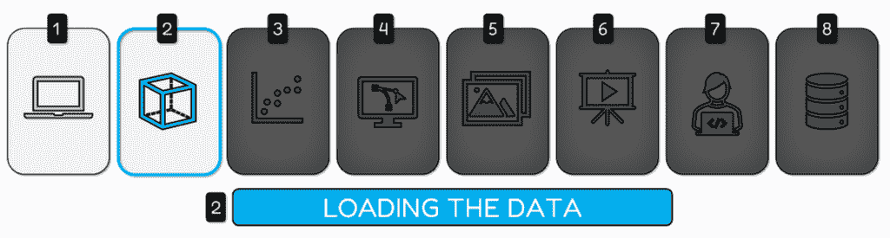

© [F. Poux](https://learngeodata.eu/)

这是你可以如何处理这一基本步骤的方法：

```py
import numpy as np
import pyvista as pv

mesh = pv.examples.load_globe()
texture = pv.examples.load_globe_texture()

pl = pv.Plotter()
pl.add_mesh(mesh, texture=texture, smooth_shading=True)
pl.show()
```

此代码片段加载了一个纹理地球网格，但原理适用于任何纹理 3D 模型。

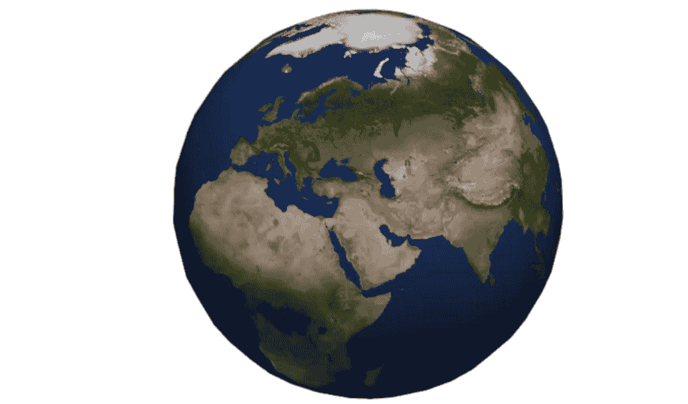

使用 PyVista 将地球渲染成球形。© [F. Poux](https://learngeodata.eu/)

让我讨论并简要谈谈 smooth_shading 参数。这是一个微小的元素，它使表面更加连续（与面片相比），在球形物体的情况下，这提高了视觉影响。

现在，这只是一个 3D 网格数据的起点。这意味着我们处理的是连接点的表面。但如果我们只想使用基于点的表示呢？

在那种情况下，我们必须考虑调整我们的数据处理方法，以提出解决点云数据集的独特视觉挑战的解决方案。

### **3. 点云数据集成**

点云可视化需要特别注意细节。特别是，调整点密度和我们代表屏幕上的点的方式对视觉效果有显著影响。

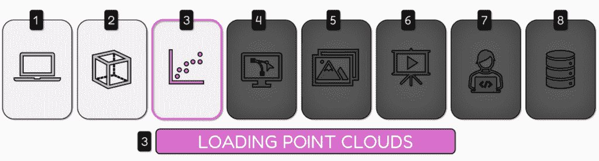

© [F. Poux](https://learngeodata.eu/)

让我们使用 PLY 文件进行测试（请参阅文章末尾的资源）。

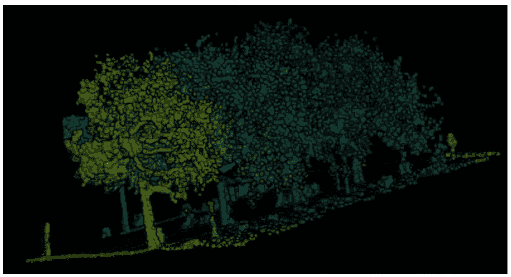

使用 PyVista 的示例 PLY 点云数据。© [F. Poux](https://learngeodata.eu/)

您可以使用 pv.read 加载点云并创建标量场以获得更好的可视化（例如，使用基于点云中心高度或范围的标量场）。

在我的 LiDAR 数据集工作中，我开发了一种简单、系统的点云加载和初始可视化的方法：

```py
cloud = pv.read('street_sample.ply')
scalars = np.linalg.norm(cloud.points - cloud.center, axis=1)

pl = pv.Plotter()
pl.add_mesh(cloud)
pl.show()
```

> 在这里，标量计算尤为重要。通过计算每个点到云中心的距离，我们为着色创建了一个基础，这有助于在可视化中传达深度和结构。当处理大规模点云时，这种关系可能不会立即明显，这时它变得特别有价值。

从基本可视化到创建引人入胜的动画，需要仔细考虑可视化环境。让我们探讨如何优化这些设置以获得最佳结果。

### **4. 优化可视化环境**

我们动画的视觉影响很大程度上取决于可视化环境设置。

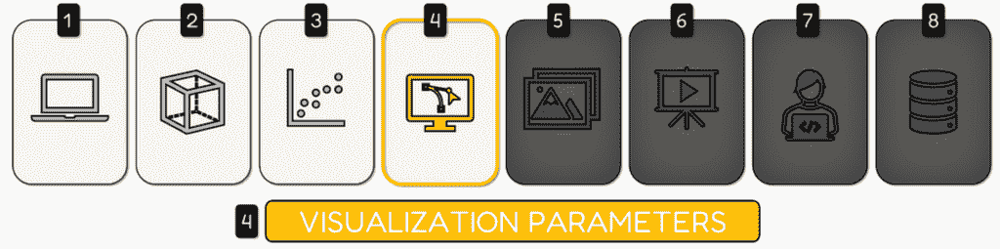

© [F. Poux](https://learngeodata.eu/)

通过广泛的测试，我确定了产生专业质量结果的几个关键参数：

```py
pl = pv.Plotter(off_screen=False)
pl.add_mesh(
   cloud,
   style='points',
   render_points_as_spheres=True,
   emissive=False,
   color='#fff7c2',
   scalars=scalars,
   opacity=1,
   point_size=8.0,
   show_scalar_bar=False
   )

pl.add_text('test', color='b')
pl.background_color = 'k'
pl.enable_eye_dome_lighting()
pl.show()
```

如您所见，绘图器初始化时设置 off_screen=False 以直接渲染到屏幕上。然后，使用指定的样式将点云添加到绘图器中。style='points' 参数确保点云以单独的点渲染。scalars='scalars' 参数使用之前计算的标量场进行着色，而 point_size 设置点的大小，opacity 调整透明度。还设置了一个基础颜色。

> *🦚 **注意**：根据我的经验，将点渲染为球体可以显著提高最终生成的动画的深度感知。您还可以通过使用 eye_dome_lighting 功能来结合这一方法。此算法通过某种基于法线的阴影添加另一层深度提示，使点云的结构更加明显。*

您可以尝试调整各种参数，直到获得满足您应用需求的渲染图。然后，我建议我们转向创建动画 GIF。

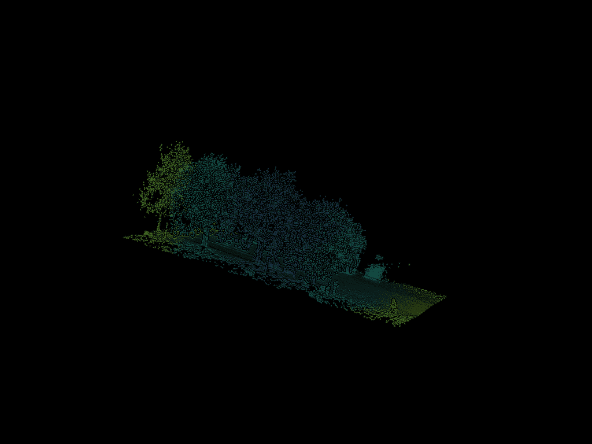*点云的 GIF 动画。© [F. Poux](https://learngeodata.eu)*

### **5. 创建动画 GIF**

在这个阶段，我们的目标是通过对生成这些点云的视角进行变化来生成一系列渲染图。

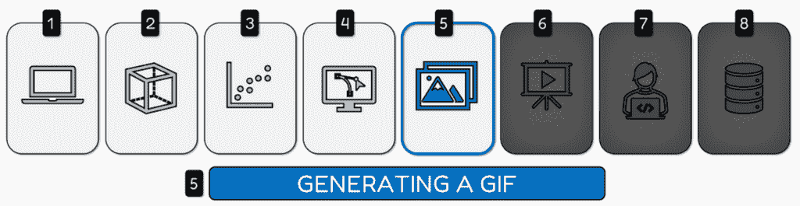

© [F. Poux](https://learngeodata.eu/)

这意味着我们需要设计一个合理的相机路径，从而可以生成帧渲染。

这意味着为了生成我们的 GIF，我们首先需要在点云周围为相机创建一个轨道路径。然后，我们可以以固定间隔采样路径并从不同视角捕获帧。

这些帧可以用来创建 GIF。以下是步骤：

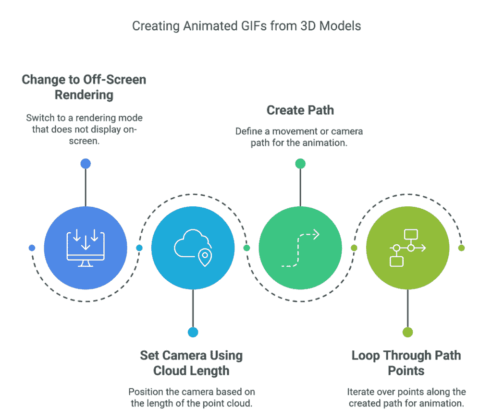

动画 GIF 生成过程中的 4 个阶段。© [F. Poux](https://learngeodata.eu/)

1.  我切换到`离屏渲染`

1.  我使用云长度参数来设置相机

1.  我创建一个路径

1.  我创建一个循环，从中获取这个遍历的点

这转化为以下内容：

```py
pl = pv.Plotter(off_screen=True, image_scale=2)
pl.add_mesh(
   cloud,
   style='points',
   render_points_as_spheres=True,
   emissive=False,
   color='#fff7c2',
   scalars=scalars,
   opacity=1,
   point_size=5.0,
   show_scalar_bar=False
   )

pl.background_color = 'k'
pl.enable_eye_dome_lighting()
pl.show(auto_close=False)

viewup = [0, 0, 1]

path = pl.generate_orbital_path(n_points=40, shift=cloud.length, viewup=viewup, factor=3.0)
pl.open_gif("orbit_cloud_2.gif")
pl.orbit_on_path(path, write_frames=True, viewup=viewup)
pl.close()
```

如您所见，使用`pl.generate_orbital_path()`在点云周围创建了一个轨道路径。路径的半径由 cloud_length 决定，中心设置为点云的中心，法向量设置为`[0, 0, 1]`，表示圆位于`XY`平面。

从那里，我们可以进入循环以生成 GIF 的单独帧（相机的焦点设置为点云的中心）。

`image_scale`参数值得特别注意——它决定了我们输出的分辨率。

> 我发现 2 的值在感知质量和文件大小之间提供了良好的平衡。此外，`viewup`向量对于在整个动画中保持正确的方向至关重要。如果您想要非水平平面的旋转，可以尝试调整其值。

这将生成一个可以轻松用于交流的 GIF。

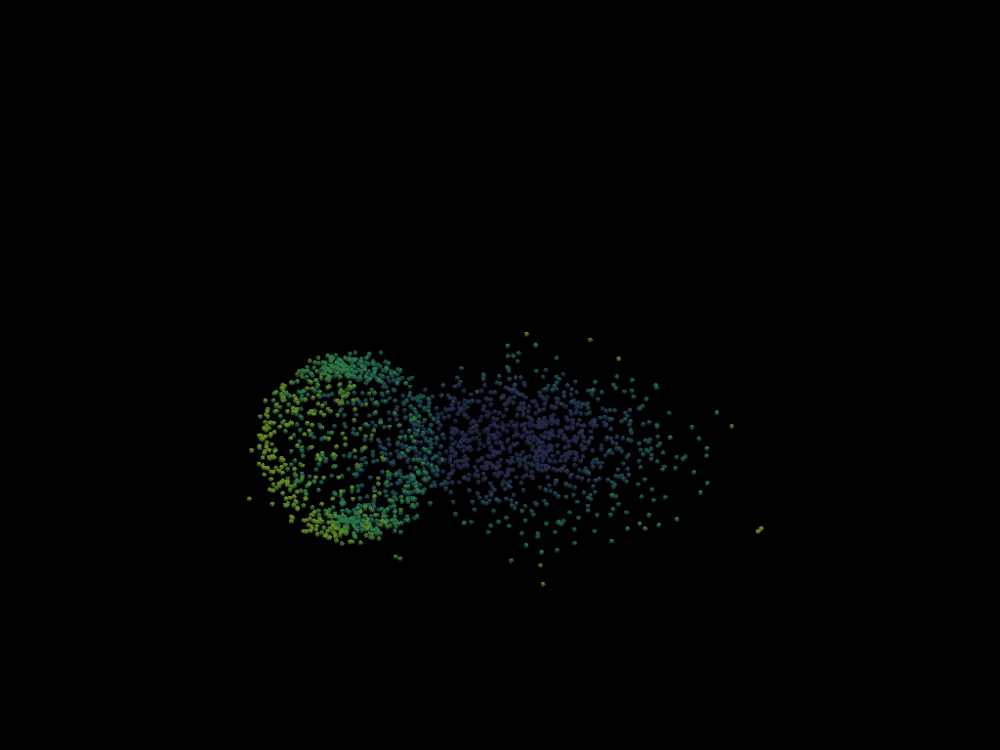*另一个合成的点云生成的 GIF 动画。© [F. Poux](https://learngeodata.eu)*

但我们可以再推进一步：创建 MP4 视频。如果您希望获得比 GIF（未进行压缩）更小的文件大小且质量更高的动画，这可能很有用。

### **6. 高质量 MP4 视频生成**

生成 MP4 视频遵循与我们生成 GIF 相同的精确原则。

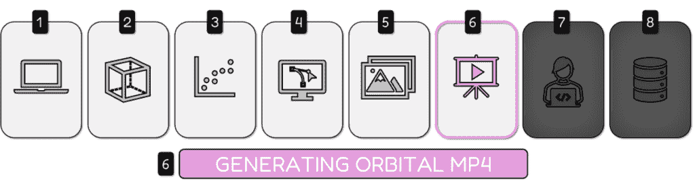

© [F. Poux](https://learngeodata.eu/)

因此，让我直接切入正题。要从任何点云生成 MP4 文件，我们可以分四个阶段进行推理：

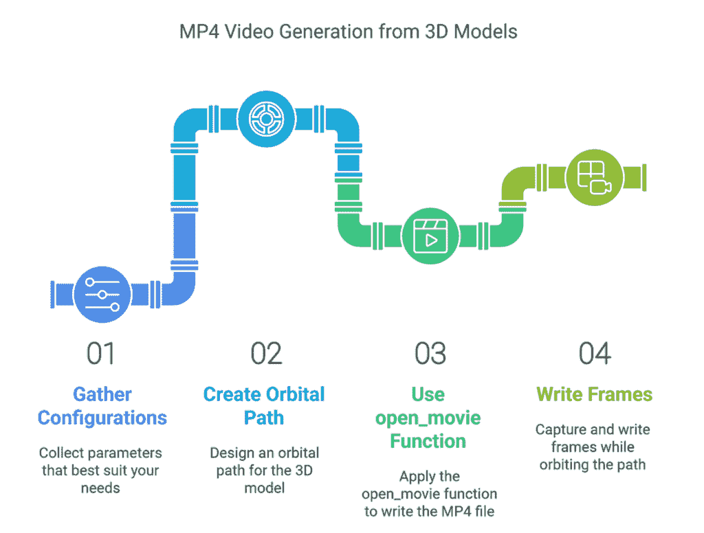

© [F. Poux](https://learngeodata.eu/)

+   收集适合您的最佳参数配置。

+   创建一个与 GIF 相同的轨道路径

+   我们不使用 `open_gif 函数`，而是使用它 `open_movie` 来写入“电影”类型的文件。

+   我们沿着路径进行环绕并编写框架，类似于我们的 GIF 方法。

🦚 **注意**：*不要忘记在路径定义中使用您的适当配置。*

这就是代码的最终结果：

```py
pl = pv.Plotter(off_screen=True, image_scale=1)
pl.add_mesh(
   cloud,
   style='points_gaussian',
   render_points_as_spheres=True,
   emissive=True,
   color='#fff7c2',
   scalars=scalars,
   opacity=0.15,
   point_size=5.0,
   show_scalar_bar=False
   )

pl.background_color = 'k'
pl.show(auto_close=False)

viewup = [0.2, 0.2, 1]

path = pl.generate_orbital_path(n_points=40, shift=cloud.length, viewup=viewup, factor=3.0)
pl.open_movie("orbit_cloud.mp4")
pl.orbit_on_path(path, write_frames=True)
pl.close()
```

注意使用 `points_gaussian` 风格和调整后的不透明度——这些设置在视频格式中提供了有趣的视觉质量，尤其是对于密集的点云。

现在，关于简化流程的事情呢？

### **7. 使用自定义函数简化流程**

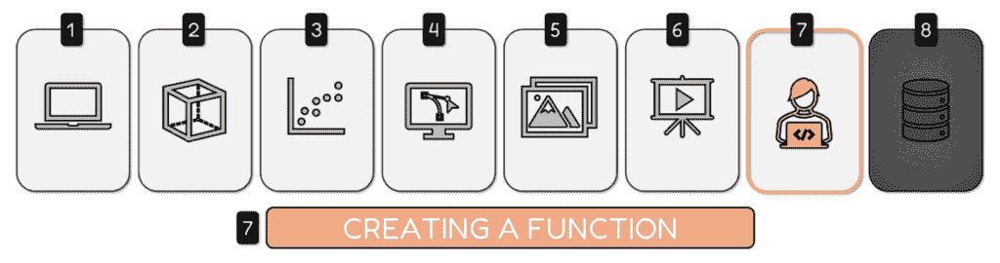

© [F. Poux](https://learngeodata.eu/)

为了使这个过程更高效和可重复，我开发了一个封装所有这些步骤的函数：

```py
def cloudgify(input_path):
   cloud = pv.read(input_path)
   scalars = np.linalg.norm(cloud.points - cloud.center, axis=1)
   pl = pv.Plotter(off_screen=True, image_scale=1)
   pl.add_mesh(
       cloud,
       style='Points',
       render_points_as_spheres=True,
       emissive=False,
       color='#fff7c2',
       scalars=scalars,
       opacity=0.65,
       point_size=5.0,
       show_scalar_bar=False
       )

   pl.background_color = 'k'
   pl.enable_eye_dome_lighting()
   pl.show(auto_close=False)

   viewup = [0, 0, 1]

   path = pl.generate_orbital_path(n_points=40, shift=cloud.length, viewup=viewup, factor=3.0)

   pl.open_gif(input_path.split('.')[0]+'.gif')
   pl.orbit_on_path(path, write_frames=True, viewup=viewup)
   pl.close()

   path = pl.generate_orbital_path(n_points=100, shift=cloud.length, viewup=viewup, factor=3.0)
   pl.open_movie(input_path.split('.')[0]+'.mp4')
   pl.orbit_on_path(path, write_frames=True)
   pl.close()

   return
```

> 🦚 **注意**：此函数通过其参数保持灵活性，同时标准化我们的可视化过程。它结合了我在广泛测试中开发的几个优化。注意 GIF（40）和 MP4（100）的不同 n_points 值——这为每个格式适当地平衡了文件大小和流畅性。自动文件名生成 `split(‘.’)[0]` 确保输出命名的一致性。

在多个数据集上测试我们的新创作不是更好吗？

### **8. 批处理多个数据集**

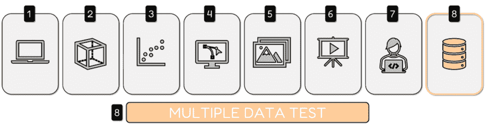

© [F. Poux](https://learngeodata.eu/)

最后，我们可以将我们的函数应用于多个数据集：

```py
dataset_paths= ["lixel_indoor.ply", "NAAVIS_EXTERIOR.ply", "pcd_synthetic.ply", "the_adas_lidar.ply"]

for pcd in dataset_paths:
   cloudgify(pcd)
```

当处理由多个文件组成的大型数据集时，这种方法可以非常高效。确实，如果您的参数化合理，您可以在所有输出中保持一致的 3D 可视化。

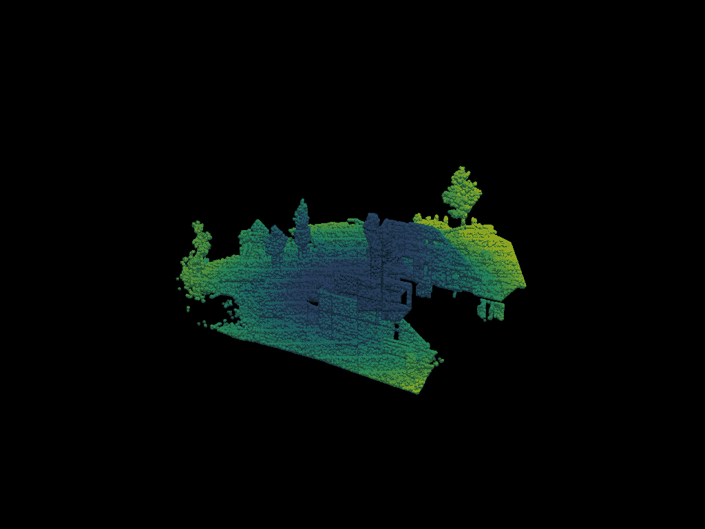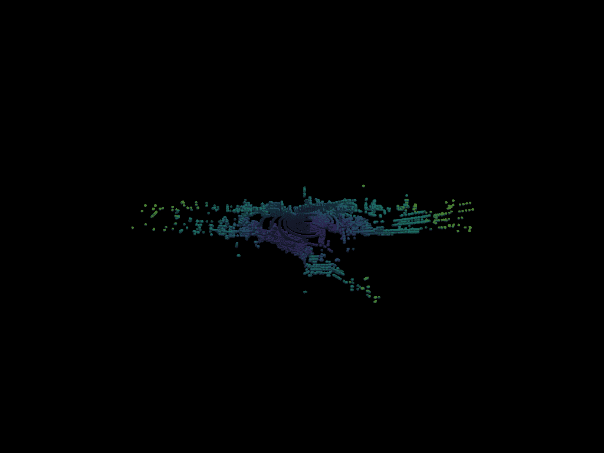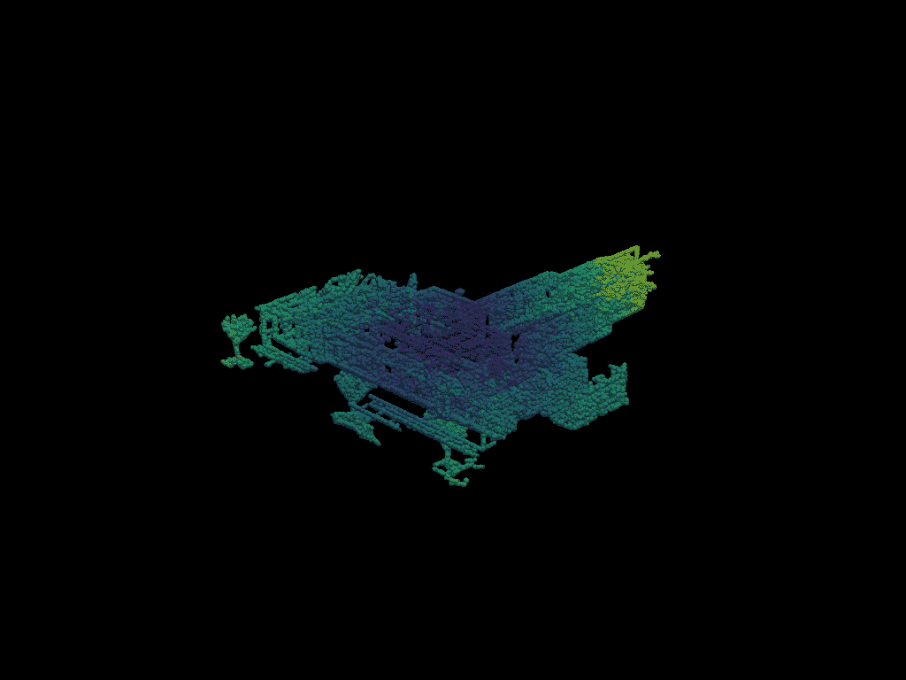

> 🌱 **成长**：我是 0% 监督以创建 100% 自动系统的忠实粉丝。这意味着，如果您想进一步推动实验，我建议调查基于数据自动推断参数的方法，即数据驱动的启发式方法。以下是我几年后写的一篇论文的例子，它专注于这种方法的 [无监督分割（自动化建设，2022）](https://www.sciencedirect.com/science/article/abs/pii/S0926580522001236)

## **一点讨论**

好的，你知道我倾向于推动创新。虽然相对简单，但这个**Cloud2Gif**解决方案有直接的应用，可以帮助你提出更好的体验。以下是我每周都会用到其中的三个应用：

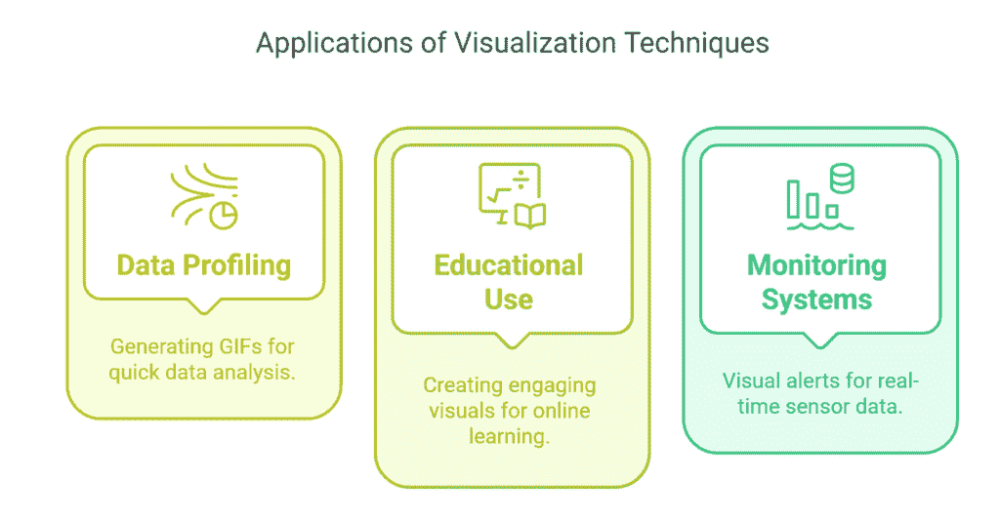

© [F. Poux](https://learngeodata.eu/)

+   **交互式数据分析和探索**：通过生成复杂模拟结果的 GIF，我可以非常快速地对我的结果进行规模分析。确实，定性分析就是将一个充满元数据和 GIF 的表格切片，检查结果是否与我的指标相符。这非常方便

+   **教育材料**：我经常使用这个脚本来为我的[在线课程](https://learngeodata.eu/)和教程生成引人入胜的视觉内容，增强通过这些课程的专业人士和学生的学习体验。尤其是在大多数材料都可在网上找到的情况下，我们可以利用浏览器播放动画的能力。

+   **实时监控系统**：我致力于将这个脚本集成到实时监控系统，以便根据传感器数据生成视觉警报。这对于传感器密集型系统尤为重要，在这些系统中，手动从点云表示中提取意义可能很困难。特别是在构思 3D 捕获系统时，利用 SLAM 或其他技术，实时获取反馈循环以确保一致注册可能很有帮助。

然而，当我们考虑更广泛的研究领域和 3D 数据社区的迫切需求时，这种方法的真正价值主张变得明显。科学研究越来越跨学科，沟通是关键。我们需要能够使来自不同背景的研究人员轻松理解和共享复杂 3D 数据的工具。

> Cloud2Gif 脚本是自包含的，并且对外部依赖最少。这使得它非常适合部署在资源受限的边缘设备上。这可能是我所工作的最重要的应用之一，利用这种直接的方法。

作为一个小插曲，我看到了这个脚本在两个场景中的积极影响。首先，我为农田作物中的疾病监测系统设计了一个环境监控系统。这是一个 3D 项目，我可以包括基于实时激光雷达传感器数据的视觉警报（MP4 文件）生成。这是一个伟大的项目！

在另一个背景下，我想为使用 SLAM 系统进行测绘目的的现场技术人员提供视觉反馈。我将这个过程集成到每 30 秒生成一个显示当前数据注册状态的 GIF 中。这是一个确保持续数据捕获的好方法。这实际上使我们能够以更好的数据漂移管理一致性重建复杂环境。

## **结论**

今天，我介绍了一个简单而强大的 Python 脚本，可以将 3D 数据转换为动态 GIF 和 MP4 视频。这个脚本结合了 NumPy 和 PyVista 等库，使我们能够为各种应用创建引人入胜的视觉效果，从演示到研究材料和教育资料。

这里的关键是易用性：脚本易于部署和定制，提供了一种将复杂数据转换为可访问格式的即时方法。如果你需要在数据采集情况下分享、评估或快速获取视觉反馈，这个 Cloud2Gif 脚本是你应用程序的一个优秀组件。

## **接下来是什么？**

好吧，如果你愿意接受挑战，你可以创建一个简单的网络应用程序，允许用户上传点云，触发视频生成过程，并下载生成的 GIF 或 MP4 文件。

这与这里展示的类似：

除了 Flask，你还可以创建一个简单的网络应用程序，可以在 Amazon Web Services 上部署，使其可扩展，并且对任何人易于访问，维护成本最低。

> 这些是通过[3D 地数据学院](https://learngeodata.eu/)的[Segmentor OS](https://learngeodata.eu/3d-python-segmentation-course-os/)项目培养的技能。

#### **关于作者**

[**Florent Poux, Ph.D.**](https://medium.com/u/8ba7bf4ad784)是一位专注于教育工程师利用 AI 和 3D 数据科学的科学和课程总监。他领导研究团队，并在多所大学教授 3D 计算机视觉。他目前的目的是确保人类能够正确装备知识和技能，以应对 3D 挑战，实现有影响力的创新。

#### **资源**

1.  🏆奖项：[Jack Dangermond Award](https://www.geographie.uliege.be/cms/c_5724437/en/florent-poux-and-roland-billen-winners-of-the-2019-jack-dangermond-award)

1.  📕书籍：[使用 Python 进行 3D 数据科学](https://www.amazon.fr/Data-Science-Python-Environments-Workflows/dp/1098161335)

1.  📜研究：[3D 智能点云（论文）](https://orbi.uliege.be/handle/2268/235520)

1.  🎓课程：[3D 地数据学院目录](https://learngeodata.eu/)

1.  💻代码：[Florent 的 GitHub 仓库](https://github.com/florentPoux)

1.  💌3D 技术快报：[每周通讯](https://learngeodata.eu/3d-newsletter/)
