# 如何在 Python 中生成 QR 码

> 原文：[`towardsdatascience.com/how-to-generate-qr-code-in-python/`](https://towardsdatascience.com/how-to-generate-qr-code-in-python/)

## <mdspan datatext="el1764654022082" class="mdspan-comment">QR 码简介</mdspan>

QR 码中的“QR”代表快速响应。QR 码是一种新兴且简单的方式，可以在不输入或搜索任何内容的情况下检索信息。这些代码本质上是一种黑白方格图案，其中嵌入可扫描的数字代码。如今，餐馆使用这些 QR 码向顾客展示菜单，商店和便利店将其作为无接触式数字支付的一种形式，活动管理团队将其作为快速签到到他们的活动和会议，等等。

## 生成 QR 码

如前所述，QR 码作为一个小型黑白方格图案或网格开发，以二进制形式存储信息，即 0 和 1。信息在代码中以特殊排列编码，具有自定义颜色、背景和边框的功能，只要图案保持不变。

以下是一个使用 Python `[qrcode](https://pypi.org/project/qrcode/)` 包生成的 QR 码示例：

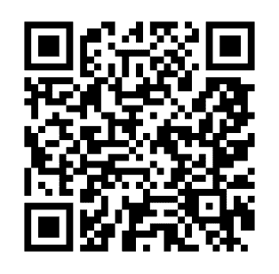

链接到我的 TDS 作者个人资料（图片由作者提供）

使用具有 QR 码扫描功能的扫描仪扫描上述代码将带您到我的 TDS 个人资料，在那里您可以轻松访问适合初学者的 Python 项目。

在本文中，我们将介绍 Python 包`qrcode`，包括安装它并探索其不同的功能来设计 QR 码。

## 安装包

在开始项目之前，我们将安装相关包。我使用 PyCharm IDE 来完成这项任务。为了安装“qrcode”Python 包，我将进入 Python 终端并输入以下内容：

```py
pip install qrcode
```

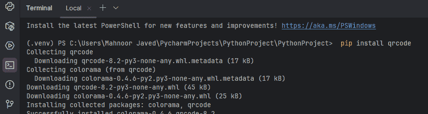

安装 qrcode 包（图片由作者提供）

安装 QRCode 包将允许我们创建 PNG 格式的 QR 码并在 Python 控制台中渲染。然而，如果我们需要更多的图像处理功能，我们应该安装`Pillow`包以获得图像处理能力。

```py
pip install "qrcode[pil]"
```

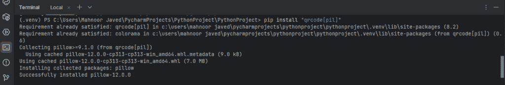

使用 Pillow 安装 QRCode 包（图片由作者提供）

## 导入库和生成简单的 QR 码

现在我们将开始编码。首先，我们将导入库并包含一个别名以方便使用。如 QR Code Python 文档中所示，可以通过以下代码行轻松生成和保存 URL 的 QR Code 图像为 PNG 格式：

```py
import qrcode as qr
img = qr.make("https://pypi.org/project/qrcode/")
img.save("Python QR Code Documentaion.png")
```

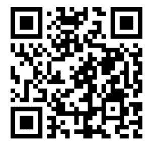

Python QR 码文档（图片由作者提供）

这是一个使用`make()`函数创建并使用`save()`函数保存为 PNG 文件的简单 QR 码。

## 高级功能

为了实现高级图像处理功能，我们将使用`qrcode` Python 包中的 QRCode 类。

类和对象是编程中的一个有用概念。Python 类为创建具有相似特征的对象提供了一个蓝图，包括它们的属性（变量）和方法（函数）。我们将使用 Python 类构造函数来创建 QR 码作为该类的对象。

下面是通用代码，允许我们创建和保存 QR 码：

```py
import qrcode
qr = qrcode.QRCode(
    version=1,
    error_correction=qrcode.constants.ERROR_CORRECT_L,
    box_size=10,
    border=4,
)
qr.add_data('https://towardsdatascience.com/implementing-the-coffee-machine-project-in-python-using-object-oriented-programming/')
qr.make(fit=True)

img = qr.make_image(fill_color="black", back_color="white")
img.save("Understanding Classes and Objects.png")
```

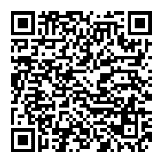

理解 Python 中的类和对象（图片由作者提供）

上述代码已创建并保存了 PNG 格式的 QR 码。如果您扫描上述代码，您将进入一个有趣的 Python 教程，该教程探讨了 Python 类和对象的概念如何在现实世界项目中实现。

现在，让我们深入探讨上面提到的通用代码，并探索其功能和它们的变体。

### 对象创建

在导入`qrcode`库后的第一行代码创建对象，其属性和方法包含在圆括号内。

```py
qr = qrcode.QRCode(
    ...
    ...
    ...
    ...
    ...
)
```

在这里，`qrcode`指的是 Python 包，`QRCode()`指的是类。

### 定义版本

接下来是定义`version`。我们可以设置一个从 1 到 40 的整数，这将导致 QR 码的不同大小。

```py
import qrcode
qr = qrcode.QRCode(
    version=1,
    ...
    ...
    ...
    ...
)
```

让我们创建一个将`version`变量设置为 5 的 QR 码。

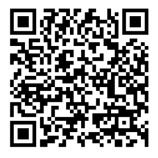

版本属性设置为 5（图片由作者提供）

现在让我们将`version`参数设置为 15：

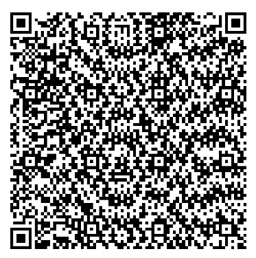

版本属性设置为 15（图片由作者提供）

如上两个 QR 码所示，`version`属性决定了 QR 码的大小。最小的`version` 1 输出一个 21×21 的网格。

### 错误纠正

我们接下来要讨论的下一个属性是`error_correction`。错误纠正属性处理数据冗余，即使 QR 码损坏，它仍然可扫描。有 4 种不同的`error_correction`级别：

+   错误纠正 L：这提供了最低级别的错误纠正，即 7%

+   错误纠正 M：这提供了中等程度的数据纠正，15%或更少，从而在错误纠正和数据大小之间提供了平衡

+   错误纠正 Q：这提供了 25%或更少的错误纠正

+   错误纠正 H：这提供了高水平的错误纠正，适用于可能严重损坏的应用程序，并且数据大小不是问题。

```py
qr = qrcode.QRCode(
    version=1,
    error_correction=qrcode.constants.ERROR_CORRECT_L,
    ...
    ...
)
```

`error_correction`的百分比值越高，它就越容易扫描，即使部分损坏。另一方面，QR 码的大小会变大，这在数据压缩是主要要求的情况下会成为一个问题。

让我们创建具有不同`error_correction`类型的 QR 码。


错误纠正类型 L（图片由作者提供）

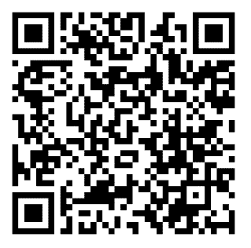

错误纠正类型 M（图片由作者提供）

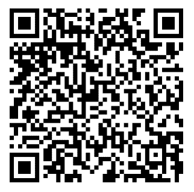

错误纠正类型 Q（图片由作者提供）

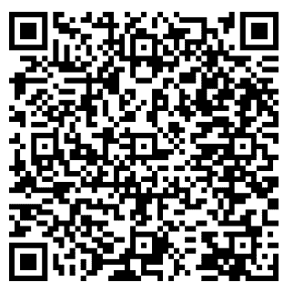

错误纠正类型 H（图片由作者提供）

如上图所示，从生成的各种二维码中可以看出，随着`error_correction`的增加，二维码的复杂性增加，这意味着数据大小增加，同时数据冗余也增加。

### 盒子大小

我们接下来要探索和操作的下一个属性是`box_size`。在 Python 的`qrcode`库中，`box_size`指的是二维码将有的像素数。

```py
qr = qrcode.QRCode(
    version=1,
    error_correction=qrcode.constants.ERROR_CORRECT_L,
    box_size=10,
    ...
)
```

让我们看看不同的`box_size`值如何改变我们的二维码：

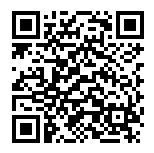

盒子大小 = 1（图片由作者提供）

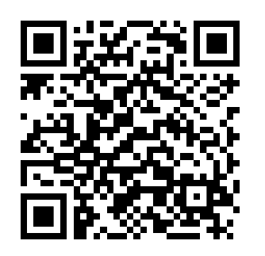

盒子大小 = 100（图片由作者提供）

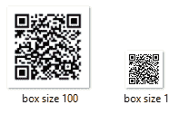

box_size 变化（图片由作者提供）

上面的图片展示了像素值变化时的差异，尽管当涉及到小的差异时，这些变化可能对肉眼来说微不足道。

### 边框

我们需要定义的最后一个属性来创建对象是`border`。这指的是围绕代码的周围框。最小值是 4，我们可以随意增加它。让我们看看这个属性的变化如何影响代码：

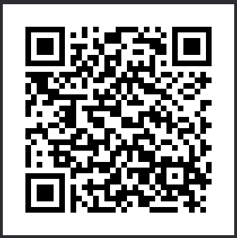

边框 = 4（图片由作者提供）

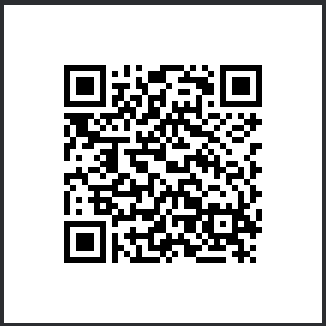

边框 = 10（图片由作者提供）

我们可以从上述图像的边框中看到差异，这可以通过`border`变量轻松自定义。

### 添加数据

一旦我们的对象被创建，具有特定的`version`、`error_correction`类型、`box_size`和`border`值，我们现在将添加需要编码为二维码的数据。这些数据可以是字符串、URL、位置、联系信息等。这可以通过这个类的`add_data()`方法轻松完成。

```py
import qrcode
qr = qrcode.QRCode(
    version=1,
    error_correction=qrcode.constants.ERROR_CORRECT_L,
    box_size=1,
    border=10,
)
qr.add_data('https://towardsdatascience.com/building-a-facial-recognition-model-using-pca-svm-algorithms-c81d870add16/')
qr.make(fit=True)
```

上面的代码最后一行调用`qr.make(fit=True)`。在分析后，它会自动将二维码调整到给定的数据大小，使用尽可能小的二维码来容纳数据，而不需要我们手动设置尺寸属性。

### 生成图像对象

一旦创建了二维码对象，我们将使用 PIL 生成图像，同时定义其颜色，以及以适当的方式保存该图像。在下面的示例中，我们将设置背景为黑色，填充颜色为粉色，如下面的代码所示：

```py
import qrcode
qr = qrcode.QRCode(
    version=1,
    error_correction=qrcode.constants.ERROR_CORRECT_L,
    box_size=1,
    border=10,
)
qr.add_data('https://towardsdatascience.com/using-python-to-build-a-calculator/')
qr.make(fit=True)

img = qr.make_image(fill_color="pink", back_color="black")
img.save("calc.png")
```

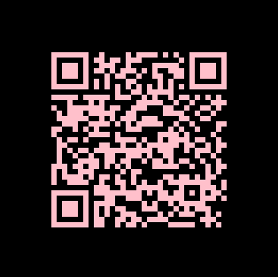

二维码颜色设置（图片由作者提供）

## 结论

在本文中，我们探讨了 Python 包 QR Code，它包含了创建 QR 码并将其保存为不同文件格式的蓝图。它还包括了 QR 码生成的高级定制，我们通过理解类和对象来实现了这一点。这是一个简单且适合初学者的 Python 教程，需要一些关于类和对象的基础知识。
