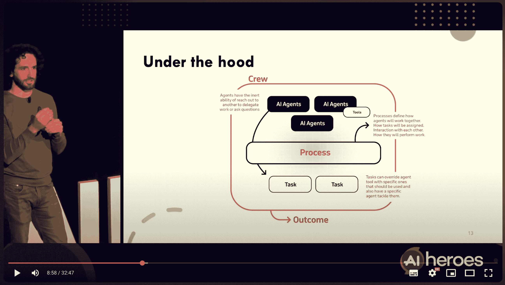

# 如何使用 CrewAI 为您的 AI 代理实施护栏

> 原文：[`towardsdatascience.com/how-to-implement-guardrails-for-your-ai-agents-with-crewai-80b8cb55fa43/`](https://towardsdatascience.com/how-to-implement-guardrails-for-your-ai-agents-with-crewai-80b8cb55fa43/)


由[Muhammad Firdaus Abdullah](https://unsplash.com/@firi?utm_source=medium&utm_medium=referral)在[Unsplash](https://unsplash.com?utm_source=medium&utm_medium=referral)上的照片

由于 LLM 的非确定性，很容易得到不符合我们应用程序预期输出的结果。一个著名的例子是 Tay，微软的聊天机器人，它因发布攻击性推文而闻名。

每当我正在开发一个 LLM 应用程序并想要决定是否需要实施额外的安全策略时，我喜欢关注以下几点：

+   **内容安全**：减轻生成有害、偏见或不适当内容的危险。

+   **用户信任**：通过透明和负责任的功能建立信心。

+   **合规性**：与法律框架和数据保护标准保持一致。

+   **交互质量**：通过确保清晰、相关性和准确性来优化用户体验。

+   **品牌保护**：通过最小化风险来保护组织的声誉。

+   **滥用预防**：预测并阻止潜在的恶意或非预期用例。

如果你计划很快与 LLM 代理合作，**这篇文章就是为你准备的**。

## 什么是护栏？

在这个背景下，为代理实施护栏意味着确保代理的第一个输出不是最终答案。

从技术角度讲，你希望根据特定的约束来评估代理的输出，并在必要时强制代理重新生成答案，直到它满足你的要求。

例如，想象一个应用程序，它会总结你过去一个月收到的所有电子邮件。你指定了个人信息，如发件人的姓名，必须匿名化。然而，由于 LLM 的不可预测性，它们有时会“忘记”这个条件。在这种情况下，你可以依赖额外的步骤来验证你是否满足了严格的条件，因为这是一个关键要求。

## CrewAI 简介

[CrewAI](https://docs.crewai.com/introduction)是我与代理合作时的首选框架。它简单、社区强大、开源，并且完全专注于代理。它还附带了许多额外功能，使其成为一个非常有吸引力的选择。

在深入探讨如何使用 CrewAI 实施护栏之前，让我简要介绍一下我们将要合作的主要组件。

### 代理、任务和团队

在 CrewAI 中，**[任务](https://docs.crewai.com/concepts/tasks)**和**[代理](https://docs.crewai.com/concepts/agents)**本身之间有一个清晰的分离。这种分离允许你将原本可能属于单个大型提示的内容解耦。通过保持这两个概念的不同，你可以清楚地定义代理的角色以及代理应该做什么。

```py
# Fitness Tracker Agent
fitness_tracker_agent = Agent(
    llm=llm,
    role="Fitness Tracker",
    backstory="An AI that sets goals, tracks progress, and recommends workouts.",
    goal="Set goals, track progress, and recommend workouts.",
    verbose=True,
)

# Fitness Tracker Task
set_and_track_goals = Task(
    description=f"Set the fitness goal ({fitness_goal}), track progress, and use weight history: {historical_weight_data}.",
    expected_output="A muscle gain plan with tracking.",
    agent=fitness_tracker_agent,
)
```

在这个例子中，我们有一个负责根据健身目标和历史体重数据创建肌肉增长计划的健身代理。正如你所见，`fitness_tracker_agent`本身并不知道**做什么**，直到我们创建一个任务并指定哪个代理将处理它。

最后，我们将所有任务和代理组合成一个**[Crew](https://docs.crewai.com/concepts/crews)**，这是我们应用程序的核心。

```py
# Crew setup
crew = Crew(
    agents=[fitness_tracker_agent, recommendation_agent],
    tasks=[set_and_track_goals, fetch_fitness_recommendations, provide_workout_plan],
    planning=True,
)
```

最后一步是使用传递给任务的输入参数执行我们的 Crew - 在这种情况下，是健身目标和历史体重数据。

### Flows

我们刚刚覆盖的内容足以构建一个简单的 Crew，但不足以创建一个具有防护栏的完整功能代理应用程序。我们需要掌握的下一个概念是**[CrewAI Flows](https://docs.crewai.com/concepts/flows)**。

Flow 背后的想法是轻松创建具有链式任务、无缝状态管理、事件驱动响应性和灵活控制流（条件、循环和分支）的动态 AI 工作流程。

以下装饰器有助于操作执行流程：

+   **`@start()`**：标记 Flow 的入口点，并在 Flow 开始时启动任务。

+   **`@listen()`**：在特定任务或事件完成时执行一个方法。

+   **`@router()`**：根据条件或结果将 Flow 导向不同的路径。

```py
from crewai.flow.flow import Flow, listen, start
from pydantic import BaseModel

class ExampleState(BaseModel):
    counter: int = 0
    message: str = ""

class StateExampleFlow(Flow[ExampleState]):

    @start()
    def first_method(self):
        self.state.message = "Hello from first_method"
        self.state.counter += 1

    @listen(first_method)
    def second_method(self):
        self.state.message += " - updated by second_method"
        self.state.counter += 1
        return self.state.message

flow = StateExampleFlow()
final_output = flow.kickoff()
print(f"Final Output: {final_output}")
print("Final State:")
print(flow.state)
```

此外，Flows 允许访问一个存储和管理数据（`ExampleState`）的共享对象，从而实现任务之间的无缝通信，并在整个工作流程中保持上下文。

## 使用 CrewAI Flow 的防护栏

通过我们刚刚覆盖的两个简单概念，我们准备好增强我们的 AI 代理。在这个例子中，我将演示如何创建一个多代理 AI 应用程序，该应用程序能够生成文本，并在提供输出之前验证文本是否包含暴力内容。

文本中的暴力检查发生在应用程序内部。多亏了 Flow 的状态管理，我们可以控制文本重生的频率，防止无限循环。这种方法为本质上非确定性的东西引入了一种确定性。

### 导入

主要使用的库是**CrewAI**，但我们也导入**[Pydantic](https://docs.pydantic.dev/latest/)**来创建一个`BaseModel`类，因为 CrewAI 的文档要求这样做。

> 对于这个例子，我们将假设已经根据前面描述的方式创建了两个代理及其相应的任务：一个用于生成文本，另一个用于检查文本中的暴力内容。

```py
from typing import List
from pydantic import BaseModel, Field
from crewai import Flow, start, listen, router
```

除了`Flow`类之外，我们还需要使用三个装饰器来构建我们的应用程序。

### 状态

**[状态](https://docs.crewai.com/concepts/flows#flow-state-management)**是我们用来在整个流执行过程中持久化数据的东西。我们需要持久化的第一条信息是生成的文本。这是我们存储文本跨所有迭代的地方，并在必要时更新它。

```py
class ViolenceCheckState(BaseModel):
    generated_text: str = ""
    contains_violence: bool = False
    generation_attempts_left: int = 2
```

为了控制流，我们还将使用一个标志来指示文本是否包含暴力，以及一个计数器来跟踪剩余的生成尝试次数。这些属性将在流执行期间被访问和更新。

### 流类

我们正在实现的类由控制应用程序流程的方法组成。让我们一步一步地构建它，从`__init__`函数开始。

```py
class ViolenceCheckFlow(Flow[ViolenceCheckState]):
    topic: str = Field(description="Topic for text generation")

    def __init__(self, topic: str):
        super().__init__()
        self.topic = topic
    ...
```

到目前为止，一切照旧。我们只是在初始化我们类的唯一属性。这里的新颖之处在于`ViolenceCheckState` Pydantic 模型，我们将其传递给超类`Flow`。此模型将代表我们的状态。

```py
 ...
    @start()
    def generate_text(self):
        print(f"Generating text based on input topic: {self.topic}")
        task = create_text_generation_task(self.topic)  # Pass the input topic to the task
        crew = Crew(agents=[text_generator_agent], tasks=[task])
        result = crew.kickoff()
        self.state.generated_text = result.raw
        print("Text generated!")

    @listen(generate_text)
    def validate_text_for_violence(self):
        print("Validating text for violence...")
        task = create_violence_check_task(self.state.generated_text)
        crew = Crew(agents=[violence_checker_agent], tasks=[task])
        result = crew.kickoff()
        self.state.contains_violence = "Violence" in result.raw
        print("Validation complete:", "Violence detected" if self.state.contains_violence else "No violence detected")
    ...
```

第一个方法必须使用`@start`装饰器来定义我们的流的起点。它后面跟着第二个方法，该方法在第一个方法之后执行。

这两个方法执行以下任务：

+   **`generate_text`**: 此方法创建一个基于给定主题生成文本的 Crew。生成的结果通过`self.state.generated_text`保存到状态中。

+   **`validate_text_for_violence`**: 此方法使用不同的 Crew 来检查文本是否包含暴力内容。如果检测到暴力，我们将`self.state.contains_violence`设置为`True`。

### 通过路由增加复杂性

这里变得有趣了。现在我们使用`@router`装饰器根据应用程序是否需要再生文本来指导流。这个决定基于`self.state.contains_violence`的值。

```py
 ...
    @router(validate_text_for_violence)
    def route_text_validation(self):
        if not self.state.contains_violence:
            return "safe"
        elif self.state.generation_attempts_left == 0:
            return "not_feasible"
        else:
            return "regenerate"
    ...
```

`route_text_validation`方法在`validate_text_for_violence`方法之后立即执行，如装饰器所指定。它检查状态中的`contains_violence`属性，并：

+   如果未检测到暴力，则返回`"safe"`。

+   如果检测到暴力和有剩余尝试次数，则触发文本的再生。

### 处理信号

我们类的最后部分包括三个方法，这些方法监听来自`route_text_validation`的特定信号：`"safe"`、`"regenerate"`和`"not_feasible"`。

```py
 ...
    @listen("safe")
    def save_safe_text(self):
        with open("safe_text.txt", "w") as file:
            file.write(self.state.generated_text)
        print("Safe text saved to file")

    @listen("regenerate")
    def regenerate_text(self):
        self.state.generation_attempts_left -= 1
        self.generate_text()

    @listen("not_feasible")
    def notify_user(self):
        print("Generated text contains violence and further attempts are not feasible.")
    ...
```

这里是如何处理每种情况的：

+   **`"safe"`**: 如果未检测到暴力，则将生成的文本保存到文件中。

+   **`"regenerate"`**: 如果触发文本再生，则`generation_attempts_left`计数器递减，并再次调用`generate_text`方法，重新启动流程。

+   **`"not_feasible"`**: 当达到最大再生尝试次数（在本例中为 2 次）时，应用程序无法生成无暴力文本，这种情况会发生。

## 结论

这种方法对我来说是救命稻草。实现的重点在于组织循环和处理迭代，而不是重新发明应用程序流程背后的逻辑。在这个例子中，我专注于检查文本是否包含暴力内容，并在发现暴力内容时确定适当的行动。多亏了这个框架提供的干净、内置的功能，我无需浪费时间管理流程逻辑。

### 更多用例

在这种方法的各种用例中，我想特别强调查询注入。这比你想象的要常见得多，尤其是在“提示工程”等角色日益突出的时候。使用 CrewAI，你可以创建一个流程，评估初始查询以确定攻击者是否试图利用聊天机器人，例如。

### 挑战

这是框架的方式：它给你很多，但当你出错时，它可能会加倍地拿走一切。我开始创建简单的应用程序，结果发现自己在工作数小时后，在 GitHub 上提交了修复错误的 pull 请求。

话虽如此，这并没有听起来那么糟糕。CrewAI 仍然是我首选的多代理应用程序。然而，就像任何新的库一样，依赖它意味着接受风险，并准备好应对它们。

如果你想了解更多关于这个库的信息，[查看我的上次演讲](https://youtu.be/Z6iYie_Ry8k?si=t-KvlwFawgEq526R)：


