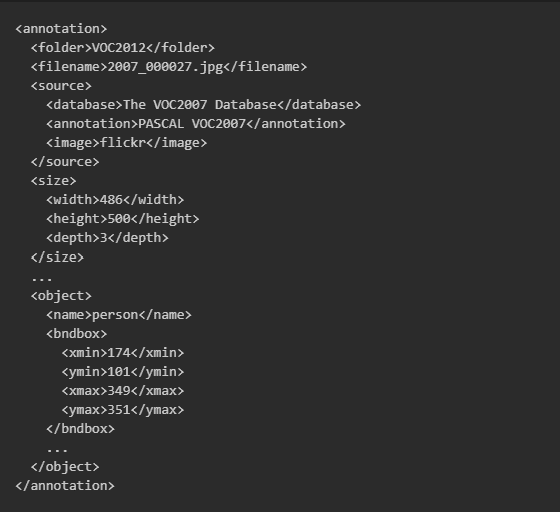
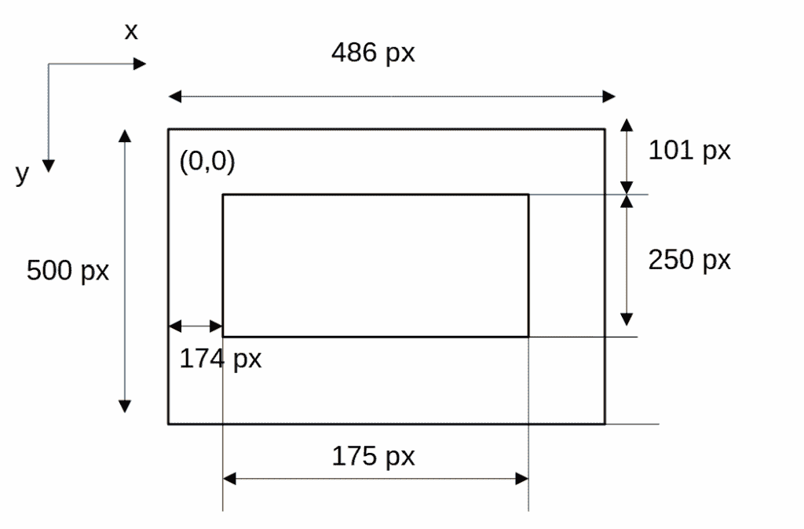
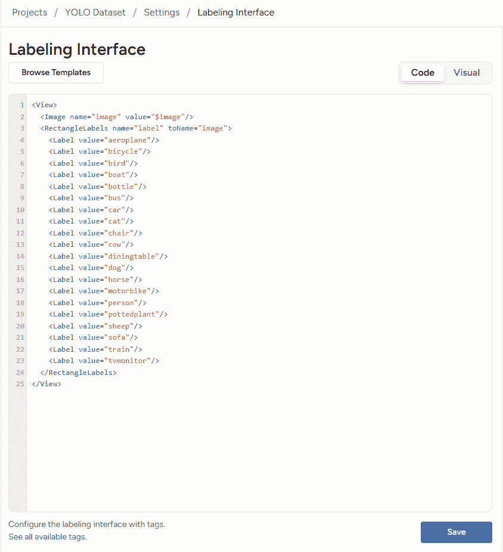
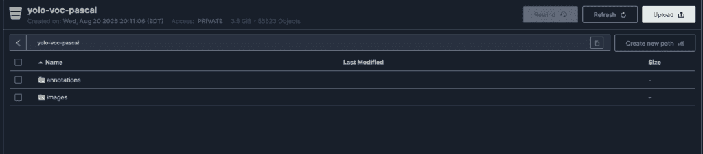
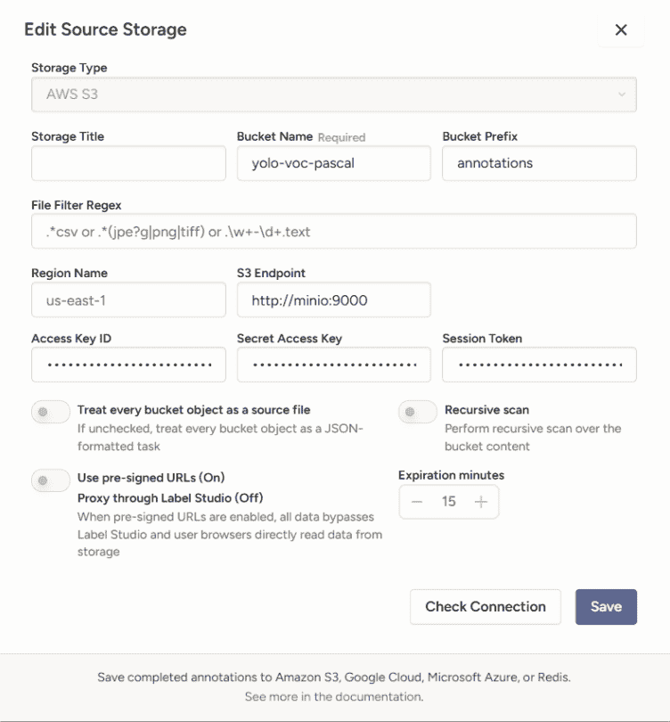
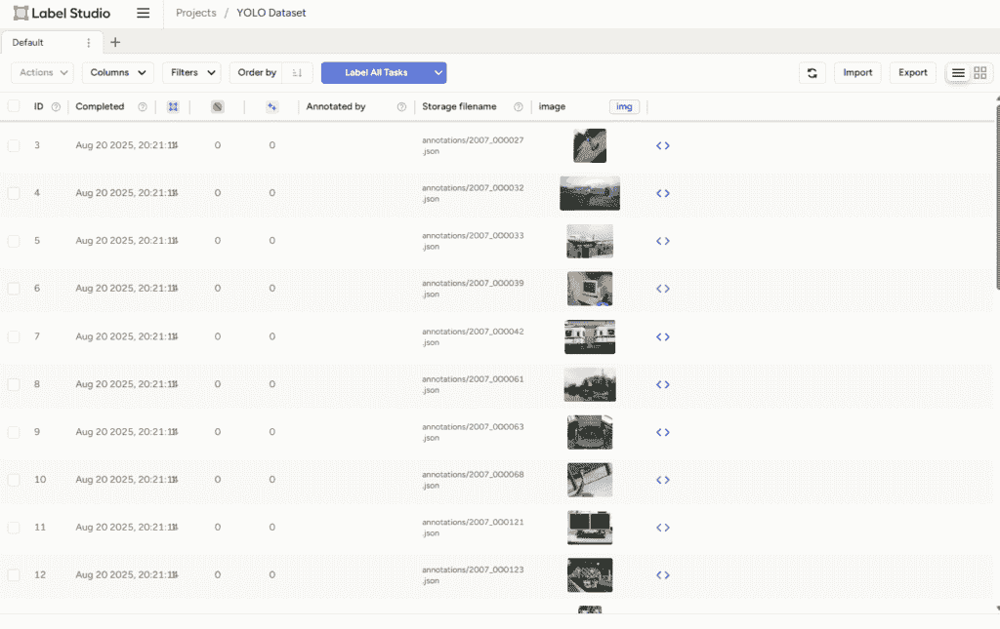
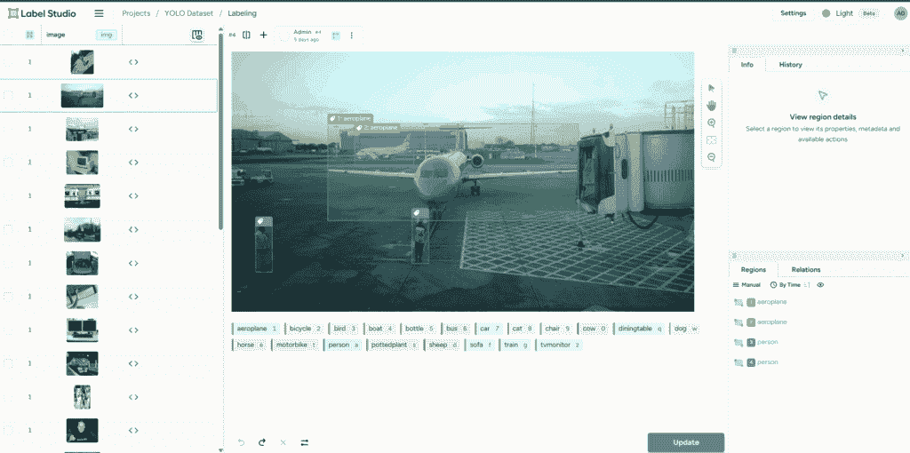

# 如何将预标注数据导入 Label Studio 并使用 Docker 运行全栈

> 原文：[`towardsdatascience.com/how-to-import-pre-annotated-data-into-label-studio-and-run-the-full-stack-with-docker/`](https://towardsdatascience.com/how-to-import-pre-annotated-data-into-label-studio-and-run-the-full-stack-with-docker/)

## <mdspan datatext="el1756253392400" class="mdspan-comment">简介</mdspan>

对象检测训练工作流程的数据集准备可能需要很长时间，并且常常令人沮丧。[Label Studio](https://labelstud.io)，一个开源数据标注工具，可以通过提供一种简单的方式来标注数据集来提供帮助。它支持多种标注模板，包括计算机视觉、自然语言处理以及音频或语音处理。然而，我们将特别关注对象检测工作流程。

但如果您想利用预标注的开源数据集，例如 Pascal VOC 数据集，怎么办呢？在这篇文章中，我将向您展示如何轻松地将这些任务导入 Label Studio 的格式，同时设置整个堆栈——包括 PostgreSQL 数据库、[MinIO](https://www.min.io/)对象存储、Nginx 反向代理和 Label Studio 后端。[MinIO](https://www.min.io/)是一个兼容 S3 的对象存储服务：您可能在生产中使用云原生存储，但您也可以在本地进行开发和测试。

在本教程中，我们将进行以下步骤：

1.  **转换 Pascal VOC 标注** – 将边界框从 XML 转换为 Label Studio 的 JSON 格式任务。

1.  **运行全栈** – 使用 Docker Compose 启动带有 PostgreSQL、MinIO、Nginx 和后端的 Label Studio。

1.  **设置 Label Studio 项目** – 在 Label Studio 界面内配置一个新项目。

1.  **将图像和任务上传到 MinIO** – 将您的数据集存储在兼容 S3 的存储桶中。

1.  **将 MinIO 连接到 Label Studio** – 将云存储桶添加到您的项目中，以便 Label Studio 可以直接获取图像和标注。

### 前提条件

要遵循本教程，请确保您有以下条件：

+   [**Docker 和 Docker Compose**已安装和配置](https://docs.docker.com/desktop/setup/install/windows-install)。

+   [从 Kaggle 下载的**Pascal VOC 数据集**](https://www.kaggle.com/datasets/huanghanchina/pascal-voc-2012)（数据库内容许可）。

+   （可选）在您的系统上安装**Python 3.10 或更高版本**（https://www.python.org/downloads），它将被用于文件转换。

+   （可选）如果您想自动化对象上传到 MinIO，请安装**[AWS CLI](https://docs.aws.amazon.com/cli/latest/userguide/getting-started-install.html)**。

## 从 VOC 到 Label Studio：准备标注

Pascal VOC 数据集有一个文件夹结构，其中训练集和测试集已经分割。*标注*文件夹包含每个图像的标注文件。总共，训练集包括 17,125 个图像，每个图像都有一个相应的标注文件。

```py
.
└── VOC2012
    ├── Annotations  # 17125 annotations
    ├── ImageSets 
    │   ├── Action
    │   ├── Layout
    │   ├── Main
    │   └── Segmentation
    ├── JPEGImages  # 17125 images
    ├── SegmentationClass
    └── SegmentationObject
```

下面的 XML 片段，取自其中一个标注，定义了一个围绕标记为“人”的对象的边界框。该框使用四个像素坐标指定：`xmin`、`ymin`、`xmax`和`ymax`。



Pascal VOC 数据集的 XML 片段（图片由作者提供）

下面的插图显示了内矩形作为标注的边界框，由左上角(`xmin`、`ymin`)和右下角(`xmax`、`ymax`)定义，位于表示图像的外矩形内。



Pascal VOC 边界框坐标以像素格式（图片由作者提供）。

Label Studio 期望每个边界框都通过其宽度、高度和左上角坐标来定义，这些坐标以图像大小的百分比表示。以下是上述标注转换的 JSON 格式的工作示例。

```py
{
  "data": {
    "image": "s3://<bucket_name>/<prefix>/2007_000027.jpg"
  },
  "annotations": [
    {
      "result": [
        {
          "from_name": "label",
          "to_name": "image",
          "type": "rectanglelabels",
          "value": {
            "x": 35.802,
            "y": 20.20,
            "width": 36.01,
            "height": 50.0,
            "rectanglelabels": ["person"]
          }
        }
      ]
    }
  ]
}
```

如您在 JSON 格式中看到的，您还需要指定图像文件的位置——例如，在 MinIO 或 S3 存储桶中的路径，如果您使用的是云存储。

在预处理数据时，我将整个数据集合并在一起，尽管它已经被分为训练集和验证集。这模拟了一个现实世界场景，您通常从一个单一的数据集开始，在训练之前自己将数据集拆分为训练集和验证集。

## 使用 Docker Compose 运行完整堆栈

我将`docker-compose.yml`和`docker-compose.minio.yml`文件合并为一个简化的单一配置，以便整个堆栈可以在同一网络上运行。这两个文件都来自官方[Label Studio GitHub 仓库](https://github.com/HumanSignal/label-studio)。

```py
 services:
  nginx:
    # Acts as a reverse proxy for Label Studio frontend/backend
    image: heartexlabs/label-studio:latest
    restart: unless-stopped
    ports:
      - "8080:8085" 
      - "8081:8086"
    depends_on:
      - app
    environment:
      - LABEL_STUDIO_HOST=${LABEL_STUDIO_HOST:-}

    volumes:
      - ./mydata:/label-studio/data:rw # Stores Label Studio projects, configs, and uploaded files
    command: nginx

  app:
    stdin_open: true
    tty: true
    image: heartexlabs/label-studio:latest
    restart: unless-stopped
    expose:
      - "8000"
    depends_on:
      - db
    environment:
      - DJANGO_DB=default
      - POSTGRE_NAME=postgres
      - POSTGRE_USER=postgres
      - POSTGRE_PASSWORD=
      - POSTGRE_PORT=5432
      - POSTGRE_HOST=db
      - LABEL_STUDIO_HOST=${LABEL_STUDIO_HOST:-}
      - JSON_LOG=1
    volumes:
      - ./mydata:/label-studio/data:rw  # Stores Label Studio projects, configs, and uploaded files
    command: label-studio-uwsgi

  db:
    image: pgautoupgrade/pgautoupgrade:13-alpine
    hostname: db
    restart: unless-stopped
    environment:
      - POSTGRES_HOST_AUTH_METHOD=trust
      - POSTGRES_USER=postgres
    volumes:
      - ${POSTGRES_DATA_DIR:-./postgres-data}:/var/lib/postgresql/data  # Persistent storage for PostgreSQL database
  minio:
    image: "minio/minio:${MINIO_VERSION:-RELEASE.2025-04-22T22-12-26Z}"
    command: server /data --console-address ":9009"
    restart: unless-stopped
    ports:
      - "9000:9000"
      - "9009:9009"
    volumes:
      - minio-data:/data   # Stores uploaded dataset objects (like images or JSON tasks)
    # configure env vars in .env file or your systems environment
    environment:
      - MINIO_ROOT_USER=${MINIO_ROOT_USER:-minio_admin_do_not_use_in_production}
      - MINIO_ROOT_PASSWORD=${MINIO_ROOT_PASSWORD:-minio_admin_do_not_use_in_production}
      - MINIO_PROMETHEUS_URL=${MINIO_PROMETHEUS_URL:-http://prometheus:9090}
      - MINIO_PROMETHEUS_AUTH_TYPE=${MINIO_PROMETHEUS_AUTH_TYPE:-public}

volumes:
  minio-data: # Named volume for MinIO object storage
```

此简化的 Docker Compose 文件定义了四个核心服务及其卷映射：

**App** – 运行 Label Studio 后端本身。

+   与 Nginx 共享**`mydata`**目录，它存储项目、配置和上传的文件。

+   使用一个**绑定挂载**：`./mydata:/label-studio/data:rw` → 将主机上的一个文件夹映射到容器中。

**Nginx** – 作为 Label Studio 前端和后端的反向代理。

+   与 App 服务共享**`mydata`**目录。

**PostgreSQL (数据库**) – 管理元数据和项目信息。

+   存储持久数据库文件。

+   使用一个**绑定挂载**：`${POSTGRES_DATA_DIR:-./postgres-data}:/var/lib/postgresql/data`。

**MinIO** – 一个兼容 S3 的对象存储服务。

+   存储数据集对象，如图像或 JSON 标注任务。

+   使用一个**命名卷**：`minio-data:/data`。

当您挂载主机文件夹，如`./mydata`和`./postgres-data`时，您需要将主机上的所有权分配给在容器内运行的同一用户。Label Studio 不以 root 用户运行——它使用具有**UID 1001**的非 root 用户。如果主机目录的所有权属于不同的用户，容器将无法获得写入权限，您将遇到*权限被拒绝*错误。

在您的项目目录中创建这些文件夹后，您可以使用以下命令调整它们的所有权：

```py
mkdir mydata 
mkdir postgres-data
sudo chown -R 1001:1001 ./mydata ./postgres-data
```

现在目录已经准备好了，我们可以使用 Docker Compose 启动堆栈。只需运行以下命令：

```py
docker compose up -d
```

从 Docker Hub 拉取所有必需的图像并设置 Label Studio 可能需要几分钟时间。一旦设置完成，在浏览器中打开[`localhost:8080`](http://localhost:8080)以访问 Label Studio 界面。你需要创建一个新账户，然后你可以使用凭证登录以访问界面。你可以通过访问**组织 → API 令牌设置**来启用旧版 API 令牌。此令牌允许你与 Label Studio API 通信，这对于自动化任务特别有用。

## 设置 Label Studio 项目

现在我们可以开始在 Label Studio 上创建我们的第一个数据标注项目，具体是为对象检测工作流程。但在开始标注图像之前，你需要定义可以选择的类别类型。在 Pascal VOC 数据集中，有 20 种预标注的对象类型。



XML 风格的标注设置（图片由作者提供）

## 将图像和任务上传到 MinIO

你可以在浏览器中打开 MinIO 用户界面，地址为**localhost:9000**，然后使用在`docker-compose.yml`文件中相关服务下指定的凭证登录。

我创建了一个包含文件夹的桶，其中一个用于存储图像，另一个用于存储按照上述说明格式化的 JSON 任务。



MinIO 中示例桶的截图（图片由作者提供）

我们在本地设置了一个类似 S3 的服务，允许我们模拟 S3 云存储而不产生任何费用。如果你想要将文件传输到 AWS 上的 S3 桶，考虑到数据传输成本，直接通过互联网进行操作会更好。好消息是，你也可以使用 AWS CLI 与你的 MinIO 桶进行交互。为此，你需要在`~/.aws/config`中添加一个配置文件，并在同一配置文件名下，在`~/.aws/credentials`中提供相应的凭证。

然后，你可以使用以下命令轻松地与本地文件夹同步：

```py
#!/bin/bash
set -e

PROFILE=<your_profile_name>
MINIO_ENDPOINT=<your_minio_endpoint>   # e.g. http://localhost:9000
BUCKET_NAME=<your_bucket_name>
SOURCE_DIR=<your_local_source_dir>    
DEST_DIR=<your_bucket_destination_dir> 

aws s3 sync \
      --endpoint-url "$MINIO_ENDPOINT" \
      --no-verify-ssl \
      --profile "$PROFILE" \
      "$SOURCE_DIR" "s3://$BUCKET_NAME/$DEST_DIR" 
```

## 将 MinIO 连接到 Label Studio

在包括图像和标注在内的所有数据已上传后，我们可以继续将云存储添加到之前创建的项目中。

从你的项目设置中，转到**云存储**并添加所需的参数，例如端点（指向 Docker 堆栈中的服务名称以及端口号，例如`minio:9000`）、桶名称以及存储标注文件的相应前缀。然后，JSON 文件中的每个路径都将指向相应的图像。



云存储设置截图（图片由作者提供）

在确认连接正常工作后，您可以将您的项目与云存储同步。由于数据集包含 22,263 张图像，您可能需要多次运行同步命令。一开始可能会看起来失败，但当你重新启动同步时，它将继续进行。最终，所有 Pascal VOC 数据都将成功导入 Label Studio。



任务列表截图（图片由作者提供）

您可以在任务列表中看到导入的任务及其缩略图。当您点击一个任务时，图像将显示其预标注。



带有边界框的图像截图（图片由作者提供）

## 结论

在本教程中，我们展示了如何通过将 XML 注释转换为 Label Studio 的 JSON 格式，运行 Docker Compose 的全栈，以及连接 MinIO 作为 S3 兼容存储，将 Pascal VOC 数据集导入 Label Studio。这种设置使您能够在本地机器上以可重复和成本效益的方式处理大规模、预标注的数据集。首先在本地测试您的项目设置和文件格式将确保在迁移到云环境时更加顺畅。

我希望这个教程能帮助您使用易于扩展或验证的预标注数据启动您的数据标注项目。一旦您的数据集准备好进行训练，您可以将所有任务导出为 COCO 或 YOLO 等流行格式。
