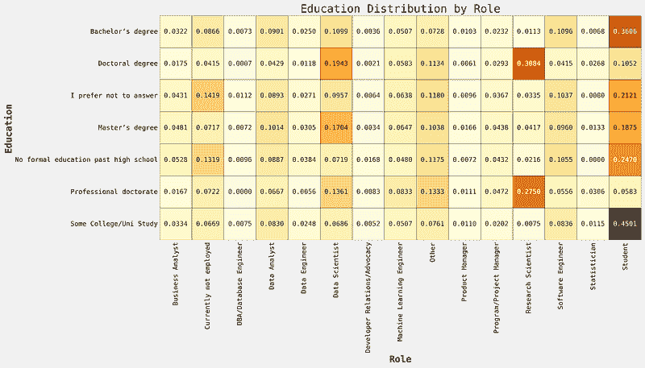
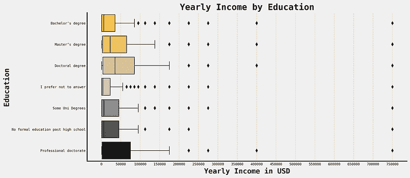

# 如何学习机器学习所需的数学

> 原文：[`towardsdatascience.com/how-to-learn-the-math-needed-for-machine-learning/`](https://towardsdatascience.com/how-to-learn-the-math-needed-for-machine-learning/)

<mdspan datatext="el1747243138238" class="mdspan-comment">数学</mdspan>可能对一些人来说是一个令人畏惧的话题。

许多人都想从事机器学习工作，但所需的数学技能可能看起来令人望而生畏。

我在这里告诉你，这并不像你想象的那么令人生畏，并且为你提供一条路线图、资源和建议，告诉你如何有效地学习数学。

让我们开始吧！

## 你需要数学知识才能从事机器学习吗？

我经常被问到：

> 你需要数学知识才能在机器学习领域工作吗？

简短的回答通常是*是的*，但你需要了解的数学的深度和广度取决于你追求的角色类型。

类似于以下基于研究的角色：

+   **研究工程师**—基于研究想法进行实验的工程师。

+   **研究科学家**—全职从事前沿模型的研究。

+   **应用研究科学家**—介于研究和产业之间。

你特别需要强大的数学技能。

这也取决于你为哪家公司工作。如果你是机器学习工程师、数据科学家或任何在以下公司的技术角色：

+   **Deepmind**

+   **Microsoft AI**

+   **Meta Research**

+   **Google Research**

你还需要强大的数学技能，因为你在一个研究实验室工作，类似于大学或学院的研究实验室。

事实上，由于在大量数据上运行模型的经济成本，大多数机器学习和 AI 研究都是在大型公司而不是大学进行的，这可能需要数百万英镑。

对于我提到的这些角色和职位，你的数学技能至少需要数学、物理、计算机科学、统计学或工程学等学科的学士学位。

然而，理想情况下，你将拥有这些学科中的一个硕士学位或博士学位，因为这些学位教授了这些研究型角色或公司所需的研究技能。

这可能对一些人来说是令人欣慰的，但这只是从统计数据中得出的真相。

根据[2021 Kaggle 机器学习与数据科学调查](https://www.kaggle.com/competitions/kaggle-survey-2021/overview)中的[笔记本](https://www.kaggle.com/code/datafan07/what-takes-to-be-a-data-scientist-story-of-robert#2.7.1.2-Education-and-Yearly-Income)，研究科学家这一职位在博士和博士研究生中非常受欢迎。

[来源](https://www.kaggle.com/code/datafan07/what-takes-to-be-a-data-scientist-story-of-robert#2.2.5.4-Education-vs.-Role)。

通常情况下，你的教育水平越高，你赚的钱就越多，这与数学知识相关。

[来源](https://www.kaggle.com/code/datafan07/what-takes-to-be-a-data-scientist-story-of-robert#2.7.1.2-Education-and-Yearly-Income)。

然而，如果你想从事工业界的生产项目，所需的数学技能就相对较少。我知道的许多作为机器学习工程师和数据科学家工作的人并没有“目标”背景。

这是因为工业界并不那么“研究”密集。它通常关于确定最佳商业策略或决策，然后将它实施到机器学习模型中。

有时候，只需要一个简单的决策引擎，机器学习就会过度。

高中数学知识通常就足够了，但对于这些职位，你可能需要复习关键领域，尤其是在面试或强化学习或时间序列等数学密集型特定专业领域。

说实话，大多数职位都在工业界，所以大多数人需要的数学技能不会达到博士或硕士学位水平。

但如果我说我这些资格不会给你带来优势，那我就撒谎了。

# 你需要了解哪些数学？

你需要了解三个核心领域：

+   **统计学**

+   **微积分**

+   **线性代数**

## 统计学

我可能有点偏见，但统计学是你应该了解并投入最大努力去理解的最重要领域。

大多数机器学习都源于统计学习理论，所以学习统计学意味着你将自然而然地学习机器学习或其基础知识。

这些是你应该研究的领域：

+   **描述性统计**—这有助于一般分析和诊断你的模型。这全部关于以最佳方式总结和描绘你的数据。

    +   平均值：均值、中位数、众数

    +   散布：标准差、方差、协方差

    +   图表：柱状图、折线图、饼图、直方图、误差条

+   **概率分布**—这是统计学的核心，因为它定义了事件概率的形状。有很多，我意思是很多，分布，但你当然不需要学习所有这些。

    +   正态分布

    +   二项式分布

    +   伽马分布

    +   对数正态分布

    +   泊松分布

    +   几何

+   **概率论**—正如我之前所说，机器学习基于统计学习，这来自于理解概率是如何工作的。最重要的概念是

    +   最大似然估计

    +   中心极限定理

    +   贝叶斯统计

+   **假设检验**—大多数数据和机器学习的实际应用案例都围绕测试。你将在生产中测试你的模型或为客户执行 A/B 测试；因此，了解如何进行假设检验非常重要。

    +   显著性水平

    +   Z 检验

    +   t 检验

    +   卡方检验

    +   样本

+   **建模与推断**—像线性回归、逻辑回归、多项式回归以及任何回归算法最初都源于统计学，而不是机器学习。

    +   线性回归

    +   逻辑回归

    +   多项式回归

    +   模型残差

    +   模型不确定性

    +   广义线性模型

## 微积分

大多数机器学习算法都以某种方式从梯度下降中学习。而且，梯度下降的根源在于微积分。

在微积分中，你应该涵盖的两个主要领域是：

### 微分

+   什么是导数？

+   常见函数的导数。

+   转折点、极大值、极小值和鞍点。

+   偏导数和多变量微积分。

+   链式法则和乘积法则。

+   凸函数与非凸可微函数。

### 积分

+   什么是积分？

+   分部积分和换元法。

+   常见函数的积分。

+   面积和体积的积分。

## 线性代数

线性代数在机器学习中无处不在，在深度学习中应用也很多。大多数模型将数据和特征表示为矩阵和向量。

+   **向量**

    +   向量是什么

    +   大小，方向

    +   点积

    +   向量积

    +   向量运算（加法、减法等）

+   **矩阵**

    +   什么是矩阵

    +   迹

    +   逆

    +   转置

    +   矩阵行列式

    +   点积

    +   矩阵分解

+   **特征值与特征向量**

    +   求特征向量

    +   特征值分解

    +   频谱分析

# 最佳资源

资源很多，这主要取决于你的学习风格。

如果你需要教科书，以下几本都是不错的选择，而且基本上你只需要这些：

+   **[数据科学家实用统计学](https://www.amazon.co.uk/Practical-Statistics-Data-Scientists-Essential/dp/149207294X) —** 我一直推荐这本书，而且有充分的理由。这是学习数据科学和机器学习统计学唯一真正需要的教科书。

+   **[机器学习数学](https://www.amazon.co.uk/Mathematics-Machine-Learning-Peter-Deisenroth/dp/110845514X/) —** 如其名所示，这本书将教授机器学习所需的数学。这本书中的很多信息可能有些过度，但如果你学习所有内容，你的数学技能将会非常出色。

如果你想要一些在线课程，我听说以下几门课程都很好。

+   **[机器学习与数据科学数学专项课程](https://www.coursera.org/specializations/mathematics-for-machine-learning-and-data-science) —** 这门课程由 DeepLearning.AI 提供，他们同样提供了备受赞誉的机器学习专项课程。

## 学习建议

你需要学习的数学内容可能看起来令人望而生畏，但不要担心。

主要是要一步一步地分解。

从这三个中选择一个：统计学、线性代数或微积分。

看看上面我提到的你需要知道的东西，选择一个资源。它不必是上面我推荐的任何一个。

这就是初步的工作。不要过度复杂化，寻找“最佳资源”，因为这样的东西并不存在。

现在，开始通过资源进行学习，但不要只是盲目地阅读或观看视频。

积极做笔记并记录你的理解。我本人写博客，本质上运用了[Feynman 技巧](https://fs.blog/feynman-technique/)，因为在某种程度上，我是在“教”别人我所知道的东西。

对于一些人来说，写博客可能太多，所以请确保你有一些好的笔记，无论是物理的还是数字的，都是你自己的话，并且你可以稍后参考。

学习过程通常相当简单，并且已经有一些关于如何有效进行学习的研究。大致要点是：

+   每天做一点

+   经常复习旧概念（间隔重复）

+   记录你的学习

重点是过程；遵循它，你就会学到东西！

* * *

# 另一件事！

加入我的免费通讯，*分享数据*，在这里我每周分享我的实践经验中的小贴士、见解和建议，作为一名实践中的机器学习工程师。此外，作为订阅者，你将获得我的**免费数据科学/机器学习简历模板**！

[**Dishing The Data | Egor Howell | Substack**](https://newsletter.egorhowell.com/)

*关于数据科学、技术和创业的建议和经验。点击阅读 Egor Howell 的 Dishing The Data，一个…*通讯。[egorhowell.com](https://newsletter.egorhowell.com/)

# 与我联系

+   [**YouTube**](https://www.youtube.com/@egorhowell), [**LinkedIn**](https://www.linkedin.com/in/egorhowell/), [**Instagram**](https://www.instagram.com/egorhowell/)

+   👉 [**预约一对一辅导通话**](https://topmate.io/egorhowell/1203300)
