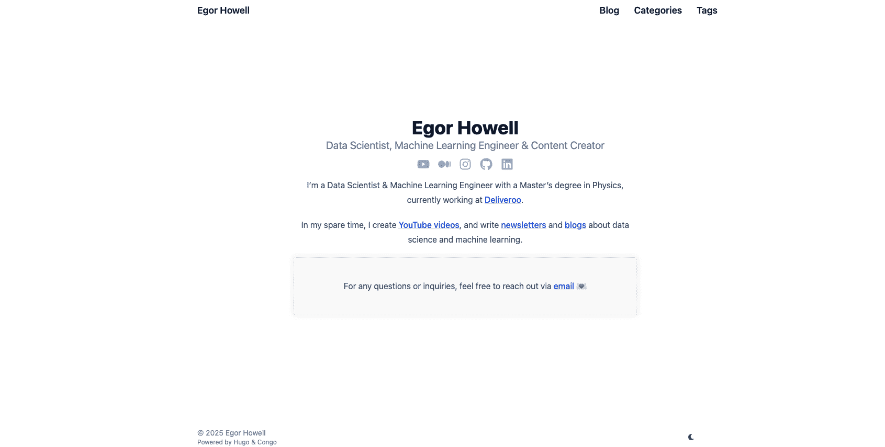
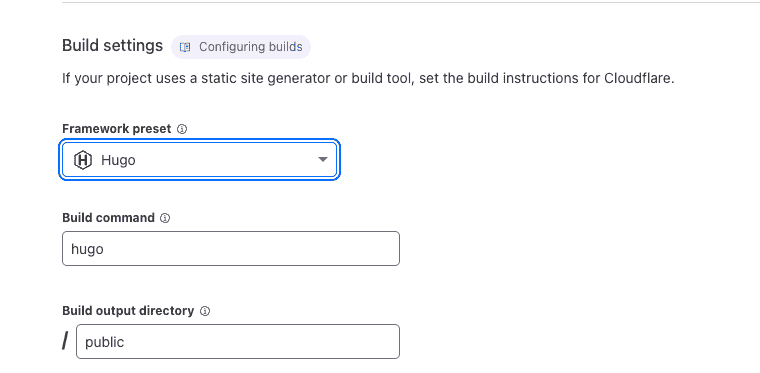

# 如何制作一个引人注目的数据科学作品集

> 原文：[`towardsdatascience.com/how-to-make-a-data-science-portfolio-that-stands-out-94dd81be1448/`](https://towardsdatascience.com/how-to-make-a-data-science-portfolio-that-stands-out-94dd81be1448/)


我们将要创建的我的网站。

* * *

许多人询问我是如何制作我的[网站](https://egorhowell.com/)的。在这篇文章中，我想描述这个确切的过程，并介绍我使用的所有工具和技术。

> **注意**：这个教程主要面向 Mac 用户，因为我使用的是 Mac，并且可以记录下来。

## 预先条件

为了部署我们的网站，我们将大量使用 Git 和 GitHub。你需要的东西包括：

+   **GitHub 账户** -> 你可以在这里创建一个[这里](https://github.com/)。

+   **在命令行中安装 git** -> 按照这个指南[这里](https://github.com/git-guides/install-git)。

+   **生成 SSH 密钥以克隆仓库** -> 按照这个指南[这里](https://docs.github.com/en/authentication/connecting-to-github-with-ssh/generating-a-new-ssh-key-and-adding-it-to-the-ssh-agent)。

+   **基本了解 git 命令** -> 可以在这里找到指南[这里](https://docs.github.com/en/get-started/using-git/about-git)。

+   **了解命令行** -> [这里](https://contributor.insightmediagroup.io/an-introduction-to-the-shell-676ee5b899df?sk=0c6e101165b4314b98ab39d11525366c)有一个很好的教程。

然而，不必过于担心。我仍然会在本文中详细介绍所有的 git 命令，但了解正在发生的事情的直觉总是更好的。

你还需要**[Homebrew](https://brew.sh/)**。这被称为“MacOS 的缺失包管理器”，对于在 Mac 上编码的人来说非常有用。

你可以使用他们网站上的命令来安装 Homebrew：

```py
/bin/bash -c "$(curl -fsSL https://raw.githubusercontent.com/Homebrew/install/HEAD/install.sh)"
```

通过运行`brew help`来验证 Homebrew 是否已安装（你应该会得到一个 brew 命令列表及其用法）。

最后，拥有一些 IDE，比如**[PyCharm](https://www.jetbrains.com/pycharm/)**或**[VSCode](https://code.visualstudio.com/)**。任何你喜欢的都可以。

## Hugo

[Hugo](https://gohugo.io/)是一个用于创建用 GO 编写的静态网站的工具。它使用简单，但需要一些编程经验。如果你没有任何编程经验，我不建议你使用它；在这种情况下，无代码解决方案更好。

### 安装

第一步是使用 Homebrew 安装 GO 和 Hugo。运行以下命令来完成此操作：

```py
brew install go hugo
```

通过运行以下命令来验证两者都已安装：

```py
hugo version
go version
```

### 创建网站

首先，我们将通过运行以下命令来创建一个新的网站模板：

```py
hugo new site quicksite
```

然后，我们将进入那个新目录：

```py
cd quickstart
```

你可以通过运行`ls`来查看这个文件夹中的内容。

现在，我们将初始化这个文件夹，作为 GitHub 仓库的准备，以便将其推送到 GitHub。

```py
git init
```

### 添加主题

Hugo 有许多主题和模板可供使用，你可以用它们来代替从头开始构建网站。所有模板的链接[在这里](https://themes.gohugo.io/)。

[刚果](https://themes.gohugo.io/themes/congo/) 是我用于网站的主题，今天我们将使用它。然而，这个过程适用于列表中的任何主题，所以如果你不喜欢我用的这个，我确信你可以找到其他选择。

> 感谢 [James Panther](https://jamespanther.com/) 创建这个模板，我建议你看看他的东西！

添加主题到你的仓库有不同的方法；我个人的偏好是通过 [git 子模块](https://www.andrewhoog.com/post/git-submodule-for-hugo-themes/)。

> [查看这里](https://discourse.gohugo.io/t/the-different-ways-of-adding-a-theme/30664)以获取添加主题的完整列表。许多用户更喜欢使用 Hugo 模块。

Git 子模块允许你在自己的 git 仓库中放置另一个 git 仓库/项目，并且你可以引用它。主项目可以使用子模块的代码，但保持自己的提交和分支历史。

这可能听起来很复杂，但在实践中并不那么困难。本质上，这只是将一个目录复制粘贴到项目中。

要开始，我们需要将刚果主题作为子模块添加（确保你在项目目录中进行此操作）：

```py
git submodule add https://github.com/jpanther/congo.git themes/congo
```

你的文件结构应该看起来像这样：

```py
quicksite/
├─ archetupes
├─ assest
├─ config
├─ content
├─ data
├─ i8n
├─ layouts
├─ public/
├─ static
└─ themes/
   └─ congo/
```

现在，我们需要将一些主题文件移动到我们的主项目中。我在接下来的几个步骤中使用了我的 IDE，但你可以做任何让你感到舒适的事情。

在根目录下，删除由克隆子模块生成的 `hugo.toml` 文件。

将 congo 主题的 `*.toml` 配置文件复制到你的 `config/_default/` 文件夹中。这将确保你拥有所有正确的主题设置。

配置中的文件结构应该看起来像这样：

```py
config/_default/
├─ config.toml
├─ languages.en.toml
├─ markup.toml
├─ menus.toml
├─ module.toml
└─ params.toml
```

前往 `config/_default/config.toml` 文件，取消注释 `baseURL` 行并添加 `theme = "congo"`。要验证主题是否激活，运行 `hugo server` 并点击本地主机链接。你的页面应该看起来像这样。


恭喜，主题现在已启动并运行！

*刚果主题的作者还提供了一份关于安装主题的指南，如果你需要一个额外的参考点的话。*

> [**安装**](https://jpanther.github.io/congo/docs/installation/#set-up-theme-configuration-files)

### 编辑主题

现在我们来定制这个主题。我不会详细讲解每一个细节，因为这会花费很长时间，作者在他们网站上有一个[完整的指南](https://jpanther.github.io/congo/docs/getting-started/)，你可以用它来获取更多信息。

通常，仓库的结构如下：

```py
.
├── assets
│   └── img
│       └── author.jpg
├── config
│   └── _default
├── content
│   ├── _index.md
│   ├── about.md
│   └── posts
└── themes
    └── congo
```

为了定制我的，我查看了一些使用此主题的其他网站，找到了一个[我喜欢的](https://antoinesoetewey.com/)，并简单地复制了他们的 GitHub 代码。这个给了我很大的启发，你可以在[这里](https://github.com/AntoineSoetewey/antoinesoetewey.com/tree/master/content)找到 GitHub 代码。

对于这个教程，我将向你展示我是如何制作我的主页的，你可以在文章的开头看到它。

创建 `content/_index.md` 页面，并添加以下内容：

```py
---
title: "About"
showAuthor: false
showDate: false
showReadingTime: false
showTableOfContents: false
showComments: false
---
I'm a Data Scientist &amp; Machine Learning Engineer with a Master's degree in Physics, currently working at [Deliveroo](https://deliveroo.co.uk/).
In my spare time, I create [YouTube videos](https://www.youtube.com/channel/UC9Tl0-lzeDPH4y7LcRwRSQA), 
and write [newsletters](https://newsletter.egorhowell.com/) and [blogs](https://medium.com/@egorhowell) about data science and machine learning.
<div style="max-width: 800px; margin: 20px auto; padding: 20px; border: 1px solid #EEE; background-color: #f9f9f9; box-shadow: 0px 0px 10px rgba(0, 0, 0, 0.1);">
  <p>For any questions or inquiries, feel free to reach out via <a href="[[email protected]](/cdn-cgi/l/email-protection)">email</a> 💌 </p>
</div> 
```

我的`languages.en.toml`文件如下所示：

```py
languageCode = "en"
languageName = "English"
languageDirection = "ltr"
weight = 1
title = "Egor Howell"
# copyright = "Egor Howell"
[params]
  dateFormat = "2 January 2006"
  description = "Personal website of Egor Howell"
[params.author]
  name = "Egor Howell"
  image = "img/pic2.png"
  headline = "Data Scientist, Machine Learning Engineer &amp; Content Creator"
  bio = "Data Scientist, Machine Learning Engineer &amp; Content Creator."
  links = [
    { youtube = "https://youtube.com/@egorhowell" },
    { medium = "https://medium.com/@egorhowell" },
    { instagram = "https://instagram.com/egorhowell" },
    { github = "https://github.com/egorhowell" },
    { linkedin = "https://www.linkedin.com/in/egorhowell/" },
  ]
```

`params.toml`文件如下：

```py
# -- Theme Options --
# These options control how the theme functions and allow you to
# customise the display of your website.
#
# Refer to the theme docs for more details about each of these parameters.
# https://jpanther.github.io/congo/docs/configuration/#theme-parameters

colorScheme = "ocean"
defaultAppearance = "light" # valid options: light or dark
autoSwitchAppearance = false
defaultThemeColor = "#007fff"

enableSearch = false
enableCodeCopy = false
enableImageLazyLoading = true

# robots = ""
fingerprintAlgorithm = "sha256"

[header]
  layout = "basic" # valid options: basic, hamburger, hybrid, custom
  # logo = "img/logo.jpg"
  # logoDark = "img/dark-logo.jpg"
  showTitle = true

[footer]
  showCopyright = true
  showThemeAttribution = true
  showAppearanceSwitcher = true
  showScrollToTop = true

[homepage]
  layout = "profile" # valid options: page, profile, custom
  showRecent = false
  recentLimit = 5

[article]
  showDate = false
  showDateUpdated = false
  showAuthor = false
  showBreadcrumbs = false
  showDraftLabel = false
  showEdit = false
  # editURL = "https://github.com/egorhowell/testing_website/"
  editAppendPath = true
  showHeadingAnchors = false
  showPagination = false
  invertPagination = false
  showReadingTime = false
  showTableOfContents = false
  showTaxonomies = false
  showWordCount = false
  showComments = false
  #sharingLinks = ["facebook", "twitter", "mastodon", "pinterest", "reddit", "linkedin", "email"]

[list]
  showBreadcrumbs = false
  showSummary = false
  showTableOfContents = false
  showTaxonomies = false
  groupByYear = false
  paginationWidth = 1

[sitemap]
  excludedKinds = ["taxonomy", "term"]

[taxonomy]
  showTermCount = true

[fathomAnalytics]
  # site = "ABC12345"
  # domain = "llama.yoursite.com"

[plausibleAnalytics]
  # domain = "blog.yoursite.com"
  # event = ""
  # script = ""

[verification]
  # google = ""
  # bing = ""
  # pinterest = ""
  # yandex = ""
```

这样应该就可以了；你的网站应该看起来像这样（如果你复制了上面的内容）：



有很多可以自定义的地方，所以我建议先玩上几个小时，以了解主题并找到你喜欢的东西。你可以添加更多页面，更改布局、颜色等。

我建议查看其他人使用此主题和[我的网站](https://egorhowell.com/)的成果以获取灵感。

*Congo 作者提供的完整自定义指南*

> [**入门指南**](https://jpanther.github.io/congo/docs/getting-started/)

### 推送到 GitHub

我们需要将此代码推送到 GitHub 以从 Cloudflare 访问它。

第一步是在 GitHub 上创建一个 git 仓库。请遵循此[链接](https://github.com/new/)进行操作。

然后运行以下命令。

```py
git remote add origin https://github.com/<your-gh-username>/<repository-name>
git branch -M main 
git add .
git commit -m "first commit"
git push -f origin main
```

你应该在 GitHub 上看到你的代码！

## Cloudflare

我们的网站在 GitHub 上，我们需要部署它！

我使用[Cloudflare](https://developers.cloudflare.com/)托管我的网站，因为它免费使用且功能丰富。它是一个“一站式”平台，因此它将域名、托管和数据分析都放在了同一个地方。你还可以在一个地方管理所有网站，如果你想要扩展业务，我真的喜欢这一点。

在 Cloudflare 上部署很简单。

1.  创建一个 Cloudflare 账户；[请见此处](https://www.cloudflare.com/en-gb/plans/)。

1.  前往你的 Cloudflare[仪表板](https://dash.cloudflare.com/817bef2b866fcf6ec09e5668414e35ea)。

1.  在“账户首页”中，选择**计算（Workers）** > **Workers & Pages** > **创建** > **Pages** > **连接到 Git > 选择你的 Git 仓库**

1.  在构建设置中添加以下内容



你的网站现在应该在指定的域名上上线，看起来可能像这样[`quicksite-env.pages.dev/`](https://quicksite.pages.dev/)。

> 就这样！

如果需要更多信息，请查看 Cloudflare 的指南。

> [**Hugo · Cloudflare Pages 文档**](https://developers.cloudflare.com/pages/framework-guides/deploy-a-hugo-site/)

## 其他想法

如果你想要尝试其他事情

+   获取一个自定义域名以连接你的网页，如果你感兴趣的话，请遵循[此指南](https://developers.cloudflare.com/pages/configuration/custom-domains/)。

+   你不必在 Cloudflare 上部署，[这里](https://gohugo.io/hosting-and-deployment/)有许多解决方案。Hugo 在这里有一个很棒的指南。

+   尝试其他 Hugo 主题；[在此处列出它们](https://themes.gohugo.io/)。

我在这里展示的只是其中一种方法，但生成网站和作品集的不同方式有很多。最重要的是创建一个，不要过于纠结于工具或技术。

> *完成胜于完美*

## 另一件事！

我有一个免费的通讯简报，**[分享数据](https://dishingthedata.substack.com/)**，在这里我作为实践中的数据科学家分享每周的技巧和建议。此外，当你订阅时，你将获得我的**免费数据科学简历**和**我的 AI 路线图的简短 PDF 版本**！

> [**分享数据 | Egor Howell | Substack**](https://newsletter.egorhowell.com/)

## 与我联系

+   **[YouTube](https://www.youtube.com/@egorhowell)**, **[LinkedIn](https://www.linkedin.com/in/egorhowell/)**, **[Instagram](https://www.instagram.com/egorhowell/)**

+   👉 **[预约一对一辅导通话](https://topmate.io/egorhowell)**
