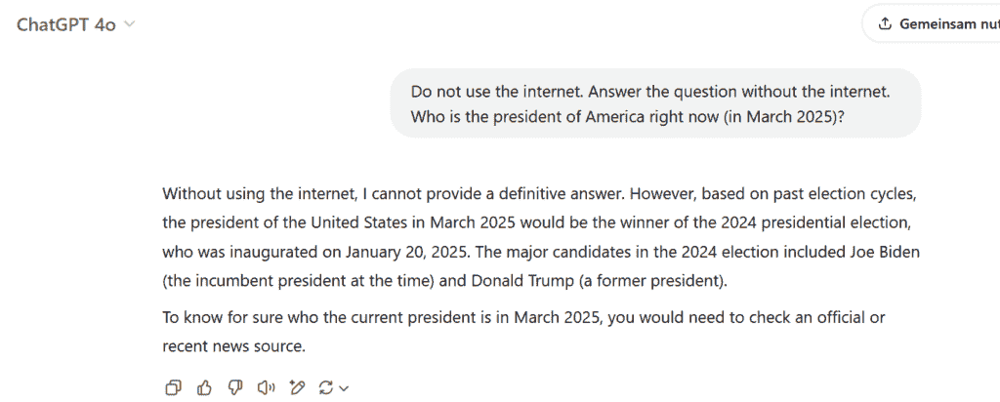
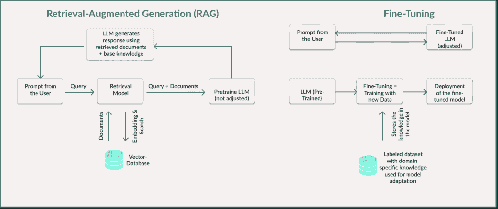
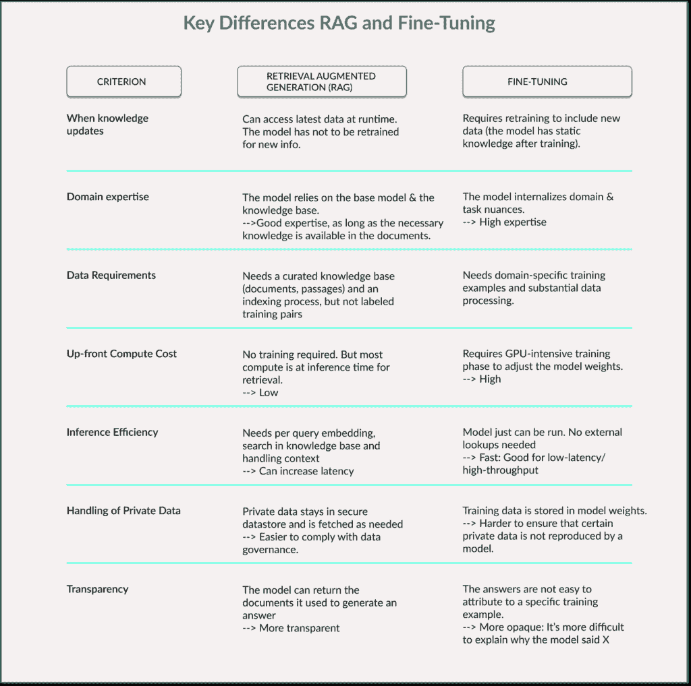

# 如何使用 RAG 和微调使你的 LLM 更准确

> 原文：[`towardsdatascience.com/how-to-make-your-llm-more-accurate-with-rag-fine-tuning/`](https://towardsdatascience.com/how-to-make-your-llm-more-accurate-with-rag-fine-tuning/)

想象一下在大学里学习一个模块一个学期。在密集的学习阶段结束后，你参加考试——你可以在不查找的情况下回忆起最重要的概念。

现在想象第二种情况：有人问你一个关于新主题的问题。你立刻不知道答案，于是你拿起一本书或者浏览维基百科来找到正确的信息。

这两个类比代表了两种最重要的方法，用于改进 LLM 的基本模型或将其适应特定任务和领域：**检索增强生成（RAG）和微调**。

但哪个例子属于哪种方法？

这正是我将在本文中解释的内容：之后，你就会知道什么是 RAG 和微调，最重要的区别以及哪种方法适用于哪种应用。

让我们深入探讨！

**目录**

+   1. 基础知识：什么是 RAG？什么是微调？

+   2. RAG 和微调之间的区别

+   3. 构建 RAG 模型的方法

+   4. 微调模型的选择

+   5. 何时推荐使用 RAG？何时推荐使用微调？

+   最终思考

+   你可以在哪里继续学习？

## 1. 基础知识：什么是 RAG？什么是微调？

大型语言模型（LLM）如 OpenAI 的 ChatGPT、Google 的 Gemini、Anthropics 的 Claude 或 Deepseek 都极其强大，并在极短的时间内确立了在日常工作中的地位。

它们最大的局限性之一是它们的认知仅限于训练。2024 年训练的模型不知道 2025 年的事件。如果我们要求 ChatGPT 的 4o 模型回答当前美国总统是谁，并给出明确的指示不要使用互联网，我们会看到它无法确定地回答这个问题：



作者截图

此外，模型难以访问公司特定的信息，例如内部指南或当前的技术文档。

这正是 RAG 和微调发挥作用的地方。

这两种方法使得将 LLM 适应特定需求成为可能：

### RAG — 模型保持不变，输入得到改进

具有检索增强生成（RAG）的 LLM 保持不变。

然而，它获得了访问外部知识源的权利，因此可以检索模型参数中未存储的信息。RAG 通过使用外部数据源在推理阶段扩展模型，以提供最新或特定信息。推理阶段是模型生成答案的时刻。

这使得模型无需重新训练就能保持最新状态。

**它是如何工作的？**

1.  用户提出一个问题。

1.  查询被转换为向量表示。

1.  检索器在外部数据源中搜索相关的文本部分或数据记录。文档或常见问题解答（FAQS）通常存储在向量数据库中。

1.  找到的内容被转移到模型中作为额外的上下文。

1.  LLM 基于检索到的和当前的信息生成其答案。

关键点在于 LLM 本身保持不变，LLM 的内部权重也保持不变。

假设一家公司使用一个内部人工智能（AI）驱动的支持聊天机器人。

聊天机器人帮助员工回答有关公司政策、IT 流程或人力资源（HR）主题的问题。如果你向 ChatGPT 提出关于你公司的问题（例如，我还有多少带薪休假？），模型从逻辑上不会给你一个有意义的答案。没有 RAG 的经典 LLM 对公司一无所知——它从未用这些数据进行过训练。

这与 RAG 不同：聊天机器人可以搜索包含最新公司政策的现有外部数据库中最相关的文档（例如 PDF 文件、维基百科页面或内部 FAQS），并提供具体的答案。

RAG 的工作方式与人类在图书馆或 Google 搜索中查找特定信息时相似——但这是实时的。

当学生被问及 CRUD 的含义时，会迅速查找维基百科文章并回答创建（Create）、读取（Read）、更新（Update）和删除（Delete）——就像 RAG 模型检索相关文档一样。这个过程允许人类和 AI 提供有根据的答案，而无需记住所有内容。

这使得 RAG 成为保持回答准确和及时的强大工具。



*作者自绘可视化*

### 微调——模型被训练并永久存储知识

除了查找外部信息外，LLM 还可以通过微调直接更新新知识。

微调在训练阶段使用，为模型提供额外的特定领域知识。现有基础模型进一步使用特定新数据进行训练。因此，它“学习”了特定内容，并内化了技术术语、风格或某些内容，但保留了其对语言的总体理解。

这使得微调成为定制 LLM 以满足特定需求、数据或任务的有效工具。

**这是如何工作的？**

1.  LLM 使用专门的数据集进行训练。该数据集包含特定领域或任务的具体知识。

1.  模型权重被调整，以便模型直接将其参数中存储新知识。

1.  训练后，模型可以在不需要外部来源的情况下生成答案。

现在假设我们想要使用一个 LLM，它能为我们提供法律问题的专家答案。

要做到这一点，这个 LLM 需要用法律文本进行训练，以便在微调后提供精确的答案。例如，它学习复杂的术语，如“故意侵权”，并能在相关国家的背景下命名适当的法律依据。它不仅提供一般定义，还可以引用相关的法律和先例。

这意味着你不再只有像 GPT-4o 这样的通用 LLM，而是一个用于法律决策的有用工具。

如果我们再次将类比应用于人类，微调可以与经过密集学习阶段后内化的知识相提并论。

在这个学习阶段之后，计算机科学学生知道 CRUD 这个术语代表创建、读取、更新、删除。他或她可以解释这个概念，而无需查找。通用词汇已经扩展。

这种内化允许更快、更自信的回应——就像微调的 LLM 一样。

## 2. RAG 与微调的区别

这两种方法都提高了 LLM 在特定任务上的性能。

这两种方法都需要准备良好的数据才能有效工作。

这两种方法都有助于减少幻觉——即生成虚假或编造的信息。

但如果我们看下表，我们可以看到这两种方法之间的差异：

RAG 特别灵活，因为模型可以始终访问最新数据，而无需重新训练。它需要较少的预先计算努力，但在回答问题时（推理）需要更多资源。延迟也可能更高。

相反，微调提供了更快的推理时间，因为知识直接存储在模型权重中，无需外部搜索。主要的缺点是训练耗时且昂贵，需要大量高质量的训练数据。

RAG 为模型提供工具，在需要时查找知识，而无需改变模型本身，而微调则将额外知识存储在带有调整参数和权重的模型中。



作者自己的可视化

## 3. 构建 RAG 模型的方法

构建检索增强生成（RAG）管道的流行框架是 LangChain。该框架简化了 LLM 调用与检索系统的链接，并使从外部来源有针对性地检索信息成为可能。

### RAG 是如何在技术上工作的？

**1. 查询嵌入**

在第一步中，用户请求通过嵌入模型被转换为一个向量。例如，可以使用 OpenAI 的 text-embedding-ada-002 或 Hugging Face 的 all-MiniLM-L6-v2。

这是因为向量数据库不是通过传统文本进行搜索，而是计算数值表示（嵌入）之间的语义相似性。通过将用户查询转换为向量，系统不仅可以搜索精确匹配的术语，还可以识别内容上相似的概念。

**2. 在向量数据库中进行搜索**

然后将生成的查询向量与向量数据库进行比较。目标是找到回答问题的最相关信息。

这种相似性搜索是使用近似最近邻（ANN）算法进行的。为此任务而著名的开源工具，例如，Meta 的 FAISS，用于在大数据集中进行高性能的相似性搜索，或 ChromaDB，用于小型到中型检索任务。

**3. 插入到 LLM 上下文中**

在第三步，检索到的文档或文本部分被整合到提示中，以便 LLM 根据这些信息生成其响应。

**4. 生成响应**

现在，LLM 将接收到的信息与其通用语言词汇结合，并生成一个上下文特定的响应。

LangChain 的替代方案是 Hugging Face Transformer 库，它提供了专门开发的 RAG 类：

+   ‘RagTokenizer’对输入和检索结果进行分词。该类处理用户输入的文本和检索到的文档。

+   ‘RagRetriever’类执行从预定义的知识库中检索相关文档的语义搜索和检索。

+   ‘RagSequenceForGeneration’类接受提供的文档，将它们整合到上下文中，并将它们传输到实际的语言模型以生成答案。

## 4. 微调模型的选项

当 LLM 使用 RAG 时，它使用外部信息进行查询，而在微调中，我们改变模型权重，以便模型永久存储新知识。

### 微调在技术上是如何工作的？

**1. 准备训练数据**

微调需要一个高质量的数据集。这个集合包括输入和期望的模型响应。例如，对于聊天机器人，这些可以是问答对。对于医疗模型，这可能是临床报告或诊断数据。对于法律 AI，这些可能是法律文本和判决。

让我们来看一个例子：如果我们查看[OpenAI 的文档](https://platform.openai.com/docs/guides/fine-tuning)，我们会看到这些模型在微调期间使用带有角色（系统、用户、助手）的标准聊天格式。这些问答对的数据格式是 JSONL，例如看起来是这样的：

```py
{"messages": [{"role": "system", "content": "Du bist ein medizinischer Assistent."}, {"role": "user", "content": "Was sind Symptome einer Grippe?"}, {"role": "assistant", "content": "Die häufigsten Symptome einer Grippe sind Fieber, Husten, Muskel- und Gelenkschmerzen."}]}  
```

其他模型使用其他数据格式，例如 CSV、JSON 或 PyTorch 数据集。

**2. 基础模型的选择**

我们可以使用预训练的 LLM 作为起点。这些可以是 OpenAI API 中的闭源模型，如 GPT-3.5 或 GPT-4，或开源模型，如 DeepSeek、LLaMA、Mistral 或 Falcon 或 T5 或 FLAN-T5，用于 NLP 任务。

**3. 模型的训练**

微调需要大量的计算能力，因为模型使用新数据来更新其权重。特别是像 GPT-4 或 LLaMA 65B 这样的大型模型，需要强大的 GPU 或 TPU。

为了减少计算工作量，有如 LoRA（低秩调整）等优化方法，其中只训练少量额外的参数，或者 QLoRA（量化 LoRA），其中使用量化模型权重（例如 4 位）。

**4. 模型部署与使用**

模型训练完成后，我们可以将其部署在本地或云平台，如 Hugging Face 模型中心、AWS 或 Azure。

## 5. 何时推荐使用 RAG？何时推荐微调？

RAG 和微调具有不同的优缺点，因此适用于不同的用例：

RAG 特别适用于内容动态更新或频繁更新的情况。

例如，在需要从不断扩展的知识数据库中检索信息的 FAQ 聊天机器人中。定期更新的技术文档也可以通过 RAG 有效地集成，而无需不断重新训练模型。

另一点是资源：如果可用的计算能力有限或预算较小，RAG 更有意义，因为不需要复杂的训练过程。

另一方面，微调适用于模型需要针对特定公司或行业定制的情况。

通过有针对性的训练，可以提高响应质量和风格。例如，LLM 可以生成具有精确术语的医疗报告。

基本规则是：当知识过于广泛或动态，无法完全集成到模型中时，使用 RAG；而当需要一致的任务特定行为时，微调是更好的选择。

### 然后是 RAFT——组合的魔法

如果我们将两者结合起来会怎样？

这正是[检索增强微调（RAFT）](https://techcommunity.microsoft.com/blog/aiplatformblog/raft-a-new-way-to-teach-llms-to-be-better-at-rag/4084674)所发生的情况。

模型首先通过微调丰富特定领域的知识，以便理解正确的术语和结构。然后通过 RAG 扩展，使其能够从外部数据源整合特定和最新的信息。这种组合确保了深度专业知识和实时适应性。

公司利用两种方法的优势。

## 最后的想法

这两种方法——RAG 和微调——以不同的方式扩展了基本 LLM 的能力。

微调针对特定领域专门化模型，而 RAG 则为其配备外部知识。这两种方法不是相互排斥的，可以结合在混合方法中。从计算成本来看，微调在初期资源密集，但在运行时效率高，而 RAG 则需要较少的初始资源，但在使用时消耗更多。

当知识过于庞大或动态，无法直接集成到模型中时，RAG 是理想的选择。当需要针对特定任务进行稳定性和一致优化时，微调是更好的选择。这两种方法服务于不同的但互补的目的，使它们成为人工智能应用中的宝贵工具。

在我的 [Substack](https://sarahleaschrch.substack.com/) 上，我定期撰写关于科技、Python、数据科学、机器学习和人工智能领域已发布文章的总结。如果你感兴趣，可以查看或订阅。

## 你可以在哪里继续学习？

+   [OpenAI 文档 – 微调](https://platform.openai.com/docs/guides/fine-tuning#:~:text=Fine,a%20wide%20number%20of)

+   [Hugging Face 博客 QLoRA](https://huggingface.co/blog/4bit-transformers-bitsandbytes#:~:text=In%20few%20words%2C%20QLoRA%20reduces,on%20a%20single%2046GB%20GPU)

+   [Microsoft Learn – 使用 RAG 或微调增强 LLM](https://learn.microsoft.com/en-us/azure/developer/ai/augment-llm-rag-fine-tuning)

+   [IBM 技术 YouTube – RAG 与微调对比](https://www.youtube.com/watch?v=00Q0G84kq3M)

+   [DataCamp 博客 – 什么是 RAFT？](https://www.datacamp.com/blog/what-is-raft-combining-rag-and-fine-tuning)

+   [DataCamp 博客 – RAG 与微调对比](https://www.datacamp.com/tutorial/rag-vs-fine-tuning)
