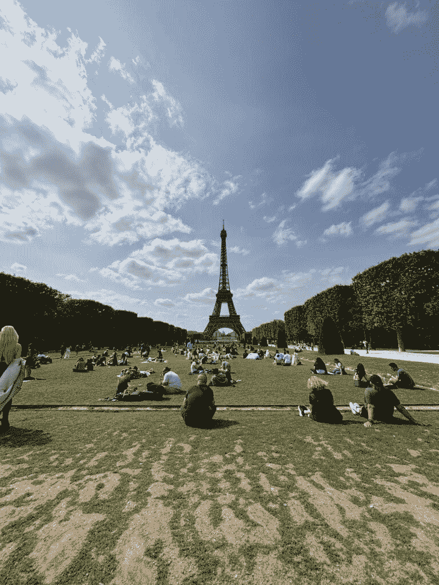
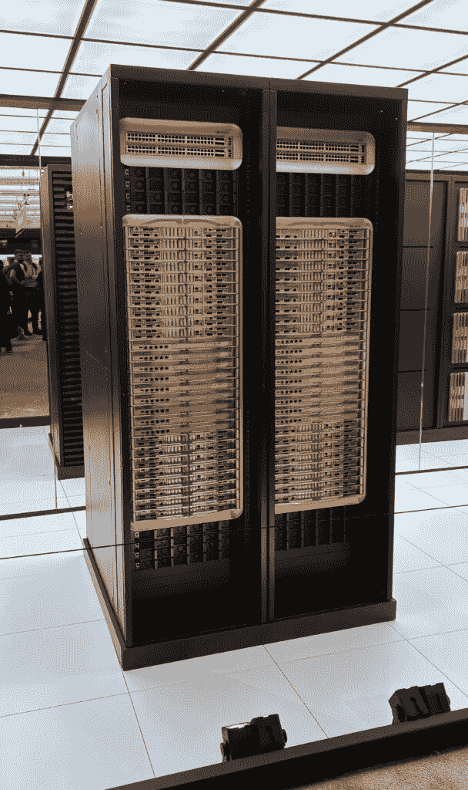
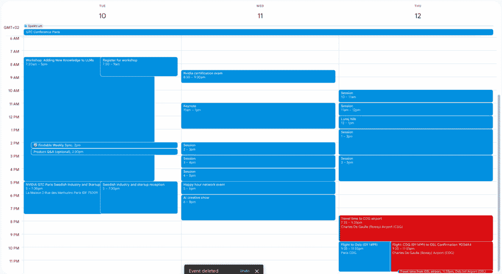
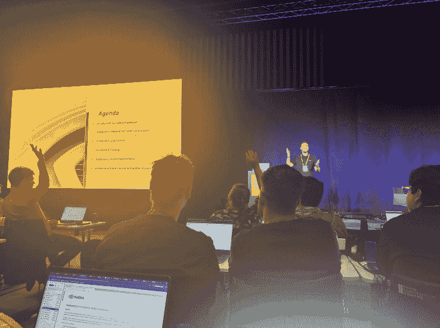
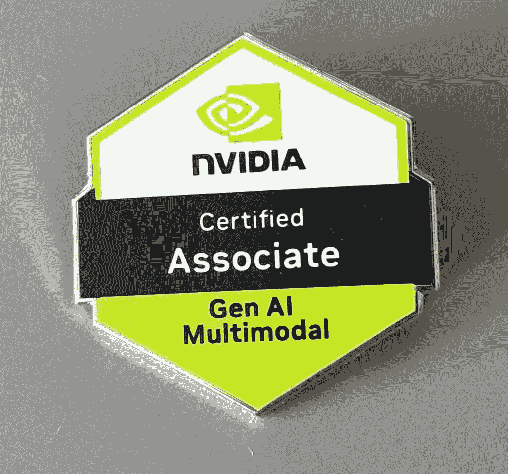
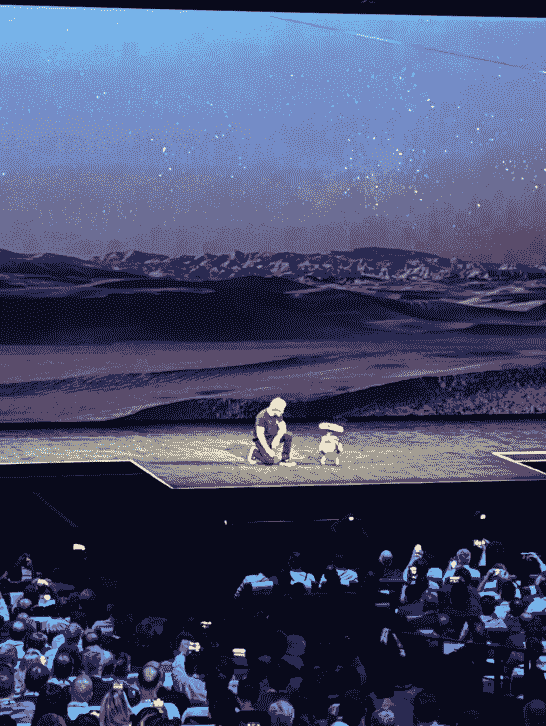

# 如何最大化技术活动 —— NVIDIA GTC 巴黎 2025

> 原文：[`towardsdatascience.com/how-to-maximize-technical-events-nvidia-gtc-paris-2025/`](https://towardsdatascience.com/how-to-maximize-technical-events-nvidia-gtc-paris-2025/)

<mdspan datatext="el1751472277885" class="mdspan-comment">在这篇文章中，我讨论了作为数据科学家、机器学习工程师或其他类似角色，如何从参加技术活动中获得最大收益。参加活动可能会很具挑战性，因为你有许多方式可以度过你的时间。因此，我将讨论如何在与专家交谈、参加演讲和圆桌讨论以及参观公司展台之间分配你的时间。还有其他方法可以改善你的体验，例如在活动前做好充分的准备和反思你的学习成果，这两者我将在本文中讨论。**

这篇文章的灵感来源于我作为 [Findable](https://www.findable.ai/) 的数据科学家，于 2025 年 6 月 10 日至 12 日参加的 [NVIDIA GTC 巴黎 2025](https://www.nvidia.com/en-eu/gtc/)。因此，我将讨论我在活动中的经历、我所学到的知识以及如何以最佳方式参加类似的活动以获得最大收益。

该活动在法国巴黎市举行。图片由作者提供。

*你还可以阅读我的关于 OpenAI Whisper 用于自动转录的文章*[*](https://towardsdatascience.com/use-openai-whisper-for-automated-transcriptions/)*。

声明：我没有任何方式受到 NVIDIA 的赞助，他们也没有影响这篇文章的内容。

我将把这篇文章分为四个主要部分：

+   **动机**：我参加活动和撰写这篇文章的动机

+   **活动前的准备**

+   **活动期间**

+   **活动后的反思**

这是为了突出我在参加活动之前、期间和之后所经历的思考过程。

## 动机

我撰写这篇文章的动机是参加 NVIDIA GTC 巴黎 2025。这是我第一次参加如此大型的大会，因此我花了一些时间思考如何在活动中最好地度过我的时间。

我以 [Findable](https://findable.no/) 员工的身份参加了活动，目的是提高我的技术知识，与聪明人讨论人工智能，并希望学到很多东西。我相信参加此类活动可以是一次巨大的学习经历，但要从活动中获得最大收益，你必须做好充分的准备，并严格优先考虑你如何度过你的时间。

我撰写这篇文章的目标是分享我在活动中的经历，并告知你如何从类似的技术活动中获得最大收益。

NVIDIA 是最大的 GPU 制造商。这张图片显示了活动中的机架。图片由作者提供，

**NVIDIA DGX GB200** 计算系统。图片由作者提供，

## 活动前的规划

在活动之前，[NVIDIA](https://www.nvidia.com/en-us/)在其页面上发布了一个[完整的会议概述](https://www.nvidia.com/en-eu/gtc/conference-schedule/)。我浏览了他们页面上的所有会议，并选择了每个时间段我想参加的前三个会议。有时，与我相关的会议不到三个，我就选择了相关的会议。我还按优先顺序排列了会议。

然后，我将所有相关的会议都放入了我的日历中，如下面的图片所示。正如您所看到的，我将我的日历排得尽可能满。我相信这是一个好的起点，如果您在活动期间发现您想做其他事情，您当然可以决定优先考虑。例如，在 6 月 11 日星期三，我发现将有一个与

+   Jensen Huang – CEO [NVIDIA](https://www.nvidia.com/en-us/)

+   Arthur Mensch – CEO [Mistral](https://mistral.ai/)

+   Emmanuel Macron – 法国总统

这自然超过了那天晚上我其他计划，我决定参加那个讨论，结果那是一场鼓舞人心的演讲。

这张图片显示了我在活动中的日历。正如您所看到的，我确保尽可能填满我的日历，以充分利用活动。在我的日历中的每个会议时段，我还输入了我想在那个时间参加的可能会议，以及房间号。这使得我在活动中找到下一个相关会议时更容易。图片由作者提供。

这就是我为这次活动所做的大部分规划。除此之外，我在活动期间主要即兴行事。

## 在活动期间

事件还有三天

+   6 月 10 日星期二：我参加了一个[LLM 研讨会](https://developer.nvidia.com/blog/nvidia-deep-learning-institute-offers-multilingual-ai-training-at-gtc-paris/)

+   6 月 11 日星期三：Jensen 的主题演讲和下午的一些会议

+   6 月 12 日星期四：全天会议

### 6 月 10 日星期二

在我参加活动的第一天，我参加了一个关于[向 LLM 添加新知识](https://developer.nvidia.com/blog/nvidia-deep-learning-institute-offers-multilingual-ai-training-at-gtc-paris/)的研讨会。这是一个有趣的研讨会，涉及以下主题：

+   数据清洗/整理

+   评估（LLM 作为评委等）

+   知识注入（微调）

+   LLM 压缩（蒸馏）

这张图片来自“向 LLM 添加新知识”研讨会。图片由作者提供。

这是一个富有洞察力的研讨会，如果这些研讨会与您和您的工作相关，我建议您参加类似的研讨会。在研讨会上，我还遇到了一些有趣的人，与他们进行了富有洞察力的技术讨论。

然而，我认为在这种研讨会中最有效的事情是**与讲师进行讨论**。在研讨会后的反思中，我意识到我花在与讲师讨论的时间太少，因为在很多情况下，他们都是 NVIDIA 的真正聪明的人，能够就不同的 AI 主题给你提供见解。如果我要再次参加这样的研讨会，我会提前花更多的时间准备在研讨会上要提出的问题。

在活动中，我还参加了一个免费的认证考试，我参加了并通过了。考试是 NVIDIA 认证助理：多模态生成 AI。通过考试后，他们给了我一份物理证书副本，如图所示。图片由作者提供。

### 周三/周四，6 月 11/12 日

在这些日子里，你可以花时间做的事情有很多。最值得注意的是：

+   参加演示/圆桌讨论

+   去公司的展位

+   参加与专家的会议

与专家会议是围绕一张小桌子，与其他几位参会者一起，你可以向 NVIDIA 员工提问的活动。这些活动通常有一个特定的主题；然而，从理论上讲，你可以问任何问题。

**在 GTC 巴黎期间，与专家会议是我参加的最有价值的会议之一**。

这样做的主要原因包括：

+   在这次活动上，出席的 NVIDIA 员工都非常聪明，在大多数情况下，他们能就我的问题给出非常好的回应。

+   我能够就业务特定的难题（例如，我在 Findable 面临的问题）提问，并得到这些问题的答案。这自然比只问关于通用 AI 主题的问题要好得多。

为了详细说明上一个要点：在专家会议中，你的目的是提出一个问题。这个问题可以非常宽泛，例如：

> 我如何使用 LLMs 进行分类？

然而，人们往往很难回答这样宽泛的问题，因为很难知道从哪里开始回答。为了解决这个问题，你可以给他们提供一个例子（或者，在许多情况下，NVIDIA 的员工会要求一个具体的例子）。然后你可以提供一个你正在自己业务中处理的特定问题的例子，并得到一个非常具体的回应，这在许多情况下会更有价值。

例如，我会把我的问题补充进去

> 在挪威，我们有一个建筑文档的分类标准，其中文档需要被分类到大约 300 个不同的类别中。这些类别例如包括“电线”，“通风系统”，“家具”等等。

提供这样的例子既使 NVIDIA 员工回答你的问题更容易，也使你的问题得到更相关的回应。这是一个双赢的局面！

黄仁勋的闭幕演讲。图片由作者提供。

我还想补充说，在许多情况下，你可以在他们的演讲/圆桌讨论后提问来与 NVIDIA 员工建立联系。你可以这样做：

+   在麦克风前向所有人提问

+   在会议后找到演讲者并提问

+   在 LinkedIn 上与他们建立联系并提问。

此外，我也参加了 6 月 10 日和 11 日的一些有见地的演讲。然而，我也经历了许多会议只是涉及非常高级的主题，或者只是涉及 NVIDIA 特定的工具，并没有真正为我工作中的问题提供有用的见解。这就是我决定在专家交流环节上花更多时间的原因。

## 活动后的反思

在活动结束后，我反思了三天参加活动期间所学到的所有内容。在那几天里，我有很多印象，从遇到许多新人，学到很多新知识，以及总的来说，在一个有很多聪明人、从事与我类似工作的环境中。

在我从活动回家的路上

+   我仔细回顾了所有的笔记。我确保记录了每个我参加的会议的笔记。

+   回顾了我在活动中收到的材料。主要是 Jupyter 笔记本和演讲

+   与我在 LinkedIn 上认识的人建立了联系

之后，我还观看了活动的一些重播，你可以在[点播观看。](https://www.nvidia.com/en-us/on-demand/?regcode=em-news-473524&ncid=em-news-473524)

* * *

我也相信，在参加此类活动时，最好的想法有时可能来自你自己的头脑。所以，并不一定是别人对你说的，而是

例如，我与一位 NVIDIA 专家讨论了微调 LLMs，他提到了教师-学生模型在当今景观中的重要性。听到这一点让我想起了我在微调 Qwen 2.5 VL 时的情况，我可能错过了 LoRA 微调的一部分，这使得模型性能比可能的情况要差得多。我试图用以下单句概括这个概念：

> 参加活动时，最有价值的见解通常来自你自己的思考，这些思考是由对话激发的——而不仅仅是别人直接说的话。

经过一些反思，我现在也将提供一些参加活动的正面和负面方面

### 活动的优点

+   你有机会遇到很多与你从事类似问题的人

+   你可以得到一组有用的信息（你在活动中学到的大部分内容也可以在网上找到）；然而，网上也有很多噪音。在活动中，大部分信息都是高质量的

### 活动的缺点

+   与人交谈有时感觉就像在克朗代克寻找金子。你可能需要与很多人交谈，才能找到某个具有正确专业知识和兴趣的人来帮助你解决具体问题

+   这需要花费很多时间。我在活动中度过了三天，这自然可以用在很多不同的方式上

## 结论

在这篇文章中，我讨论了如何有效地参加技术活动，借鉴了我参加 2025 年巴黎 NVIDIA GTC 的经验。我解释了您应该如何提前规划活动并确定您想参加的会议，并强调了我是如何通过与不同的专家（尤其是 NVIDIA 员工）交谈而不是参加演讲和圆桌讨论来获得最多的个人学习。活动之后的反思也很重要，回顾您所有的笔记和从活动中获得的所有材料。参加像 NVIDIA GTC 这样的技术活动对于收集新想法、结识有趣的人以及希望提高您的工程技能非常有帮助。

**👉 我的免费电子书和网络研讨会：**

📚 [获取我的免费视觉语言模型电子书](https://eivindkjosbakken.com/ebook)

💻 [我的视觉语言模型网络研讨会](https://www.eivindkjosbakken.com/webinar)

**👉 在社交平台上找到我：**

📩 [订阅我的通讯](https://eivindkjosbakken.com/newsletter)

🧑‍💻 [联系我](https://eivindkjosbakken.com/)

🔗 [领英](https://www.linkedin.com/in/eivind-kjosbakken/)

🐦 [X / 推特](https://x.com/EivindKjos)

✍️ [Medium](https://oieivind.medium.com/)
