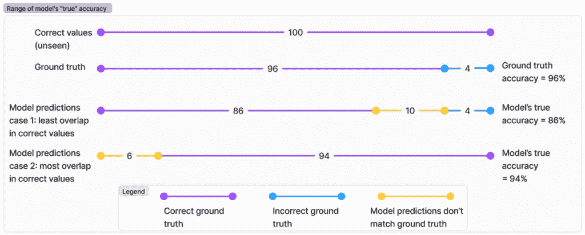
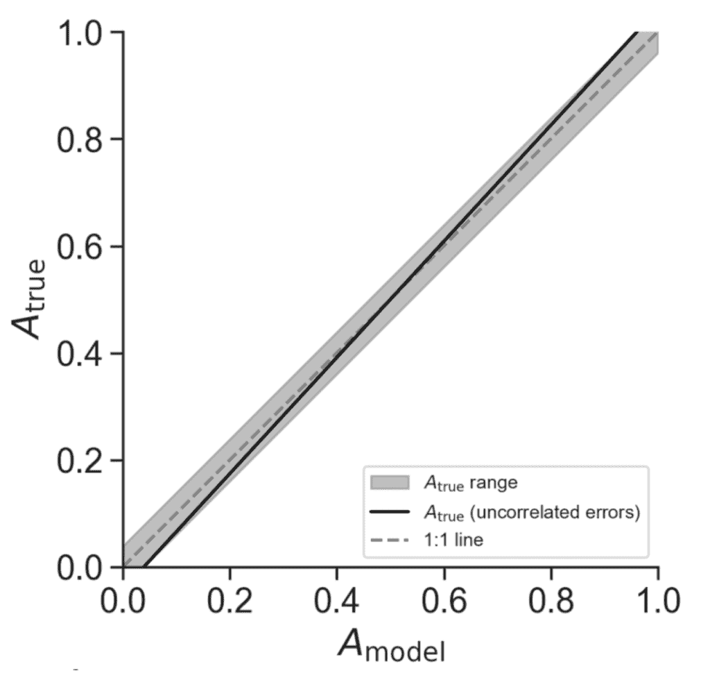
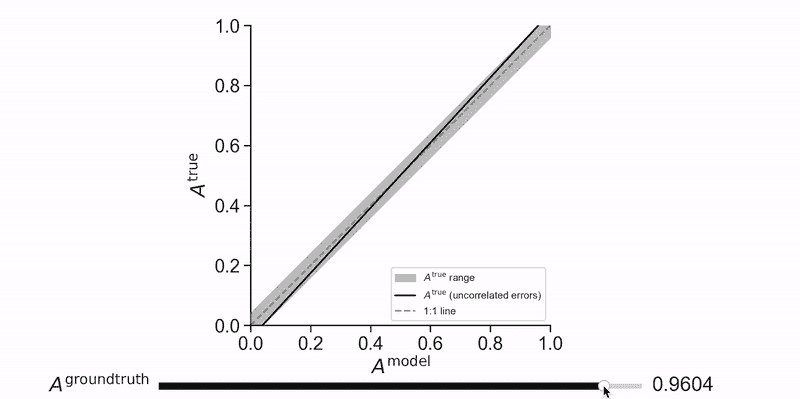

# 当标签有噪声时如何衡量真实模型准确率

> 原文：[`towardsdatascience.com/how-to-measure-real-model-accuracy-when-labels-are-noisy/`](https://towardsdatascience.com/how-to-measure-real-model-accuracy-when-labels-are-noisy/)

<mdspan datatext="el1744312763723" class="mdspan-comment">真实</mdspan>标签从不完美。从科学测量到用于训练深度学习模型的标注，真实标签总是存在一定量的错误。ImageNet，可以说是最精心整理的图像数据集，在人类标注中存在[0.3%的错误](https://karpathy.github.io/2014/09/02/what-i-learned-from-competing-against-a-convnet-on-imagenet/)。那么，我们如何使用这样的错误标签来评估预测模型呢？

在本文中，我们探讨了如何考虑测试数据标签中的错误并估计模型的“真正”准确率。

## 示例：图像分类

假设有 100 张图片，每张图片包含猫或狗。这些图片由已知准确率为 96%（Aᵍʳᵒᵘⁿᵈᵗʳᵘᵗʰ）的人类标注者标注。如果我们在这部分数据上训练一个图像分类器，并发现它在保留集上的准确率为 90%（Aᵐᵒᵈᵉˡ），那么模型的“真正”准确率（Aᵗʳᵘᵉ）是多少？首先观察以下几点：

1.  在模型预测的 90%正确预测中，一些示例可能被错误标注，这意味着模型和真实标签都是错误的。这人为地提高了测量的准确率。

1.  相反，在 10%的“错误”预测中，一些可能实际上是模型正确而真实标签错误的情况。这人为地降低了测量的准确率。

考虑到这些复杂性，真正准确率可以变化多少？

## 真正准确率的范围

模型在模型和标签错误完全相关和不相关时的真正准确率。图由作者绘制。

我们模型的真正准确率取决于其错误与真实标签中的错误之间的相关性。如果我们的模型错误与真实错误完全重叠（即，模型错误与人类标注者的错误完全相同），其真正准确率是：

Aᵗʳᵘᵉ = 0.90 — (1–0.96) = 86%

或者，如果我们的模型错误与人类标注者的错误完全相反（完美的负相关性），其真正准确率是：

Aᵗʳᵘᵉ = 0.90 + (1–0.96) = 94%

或者更普遍地：

**Aᵗʳᵘᵉ = Aᵐᵒᵈᵉˡ ± (1 — Aᵍʳᵒᵘⁿᵈᵗʳᵘᵗʰ)**

重要的是要注意，模型的真正准确率可能低于或高于其报告的准确率，这取决于模型错误与真实错误之间的相关性。

## 真正准确率的概率估计

在某些情况下，标签中的不准确度在示例中随机分布，并不系统地偏向某些标签或特征空间的区域。如果模型的不准确度与标签中的不准确度无关，我们可以推导出其真正准确率的更精确估计。

当我们测量 Aᵐᵒᵈᵉˡ（90%）时，我们正在计算模型预测与真实标签匹配的案例。这可以在两种情况下发生：

1.  模型和真实标签都是正确的。这种情况发生的概率是 Aᵗʳᵘᵉ × Aᵍʳᵒᵘⁿᵈᵗʳᵘᵗʰ。

1.  模型和真实标签都是错误的（以相同的方式）。这种情况发生的概率是 (1 — Aᵗʳᵘᵉ) × (1 — Aᵍʳᵒᵘⁿᵈᵗʳᵘᵗʰ)。

在独立性假设下，我们可以将其表达为：

Aᵐᵒᵈᵉˡ = Aᵗʳᵘᵉ × Aᵍʳᵒᵘⁿᵈᵗʳᵘᵗʰ + (1 — Aᵗʳᵘᵉ) × (1 — Aᵍʳᵒᵘⁿᵈᵗʳᵘᵗʰ)

重新排列项，我们得到：

**Aᵗʳᵘᵉ = (Aᵐᵒᵈᵉˡ + Aᵍʳᵒᵘⁿᵈᵗʳᵘᵗʰ — 1) / (2 × Aᵍʳᵒᵘⁿᵈᵗʳᵘᵗʰ — 1)**

在我们的例子中，这等于 (0.90 + 0.96–1) / (2 × 0.96–1) = 93.5%，这在我们上面推导出的 86% 到 94% 的范围内。

## 独立性悖论

将我们的示例中的 Aᵍʳᵒᵘⁿᵈᵗʳᵘᵗʰ 设为 0.96，我们得到

Aᵗʳᵘᵉ = (Aᵐᵒᵈᵉˡ — 0.04) / (0.92)。让我们在下面绘制这个图表。

当真实标签准确度为 96% 时，真实准确度作为模型报告准确度的函数。图由作者提供。

奇怪，不是吗？如果我们假设模型的误差与真实标签误差不相关，那么当报告的准确度 > 0.5 时，其真实准确度 Aᵗʳᵘᵉ 总是高于 1:1 线。即使我们改变 Aᵍʳᵒᵘⁿᵈᵗʳᵘᵗʰ，这也成立：

模型的“真实”准确度作为其报告准确度和真实标签准确度的函数。图由作者提供。

## 误差相关性：为什么模型在人类遇到困难的地方也难以应对

独立性假设至关重要，但在实践中往往不成立。如果某些猫的图像非常模糊，或者某些小狗看起来像猫，那么真实标签和模型误差都可能是相关的。这导致 Aᵗʳᵘᵉ 更接近下限（Aᵐᵒᵈᵉˡ — (1 — Aᵍʳᵒᵘⁿᵈᵗʳᵘᵗʰ)）而不是上限。

更普遍地，当：

1.  人类和模型都难以处理相同的“困难”示例（例如，模糊图像、边缘情况）

1.  模型已经学到了人类标注过程中存在的相同偏差

1.  某些类别或示例对于任何分类器（无论是人类还是机器）来说都是固有的模糊或具有挑战性的

1.  标签本身是由另一个模型生成的

1.  类别太多（因此错误的方式也太多）

## 最佳实践

模型的真实准确度可能与其实际测量的准确度存在显著差异。理解这种差异对于正确评估模型至关重要，尤其是在获取完美真实标签不可能或成本过高的情况下。

当使用不完美的真实标签评估模型性能时：

1.  **进行有针对性的错误分析**：检查模型与真实标签不一致的示例，以识别潜在的真实标签错误。

1.  **考虑误差之间的相关性**：如果你怀疑模型和真实标签误差之间存在相关性，那么真实准确度可能更接近下限（Aᵐᵒᵈᵉˡ — (1 — Aᵍʳᵒᵘⁿᵈᵗʳᵘᵗʰ)）。

1.  **获取多个独立的标注**：拥有多个标注者可以帮助更可靠地估计真实值准确率。

## 结论

总结来说，我们了解到：

1.  可能的真实准确率范围取决于真实值中的错误率

1.  当错误是独立的时候，对于比随机机会更好的模型，真实准确率通常高于测量值

1.  在现实场景中，错误很少是独立的，真正的准确率可能更接近下限
