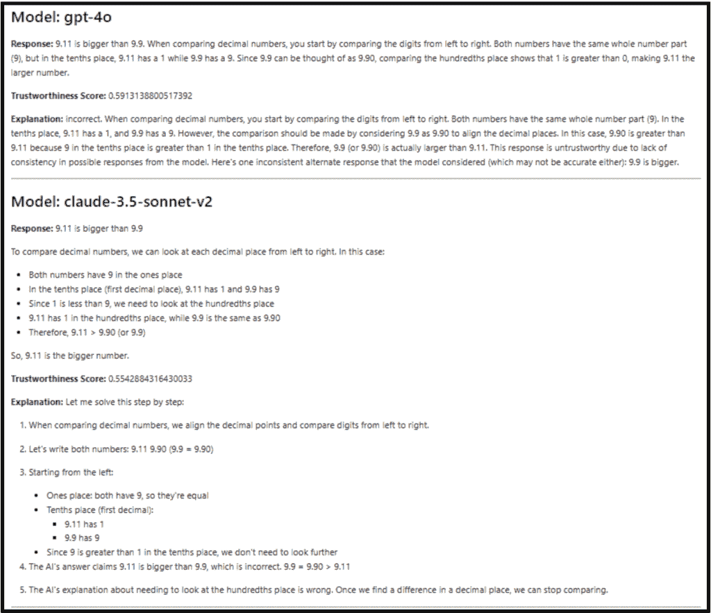
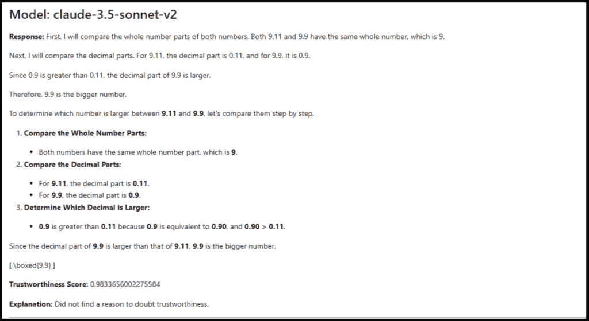
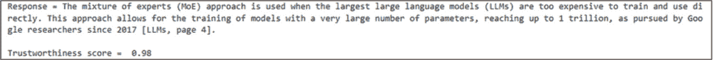
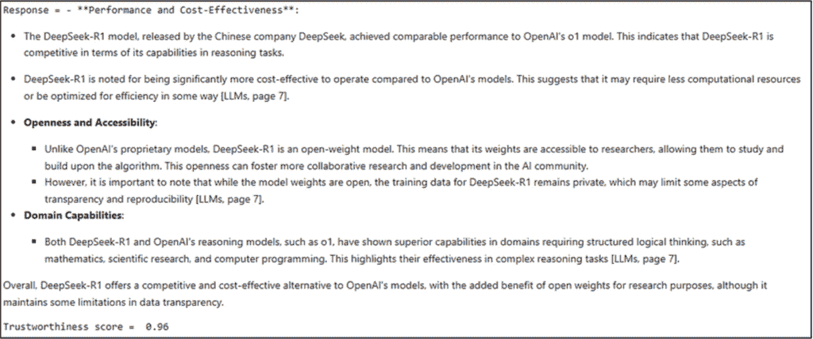

# 如何衡量大型语言模型响应的可靠性

> 原文：[`towardsdatascience.com/how-to-measure-the-reliability-of-a-large-language-models-response/`](https://towardsdatascience.com/how-to-measure-the-reliability-of-a-large-language-models-response/)

大型语言模型（LLM）的基本原理非常简单：根据其训练数据中的统计模式预测一系列单词中的下一个单词（或标记）。然而，当 LLM 能够执行文本摘要、创意生成、头脑风暴、代码生成、信息处理和内容创作等众多令人惊叹的任务时，这种看似简单的功能实际上变得极其复杂。尽管如此，LLM 并没有任何记忆，它们实际上并不“理解”任何东西，除了坚持它们的基本功能：*预测下一个单词*。

下一个单词预测的过程是概率性的。LLM 必须从概率分布中选择每个单词。在这个过程中，它们通常会生成虚假的、编造的或不一致的内容，试图产生连贯的响应并填补空白，使用看似合理但实际上错误的信息。这种现象被称为幻觉，是 LLM 不可避免且众所周知的特点，需要对其输出进行验证和核实。

检索增强生成（RAG）方法，使 LLM 与外部知识源协同工作，在一定程度上可以减少幻觉，但无法完全根除。尽管高级 RAG 可以提供文本引用和 URL，但验证这些参考可能会很繁琐且耗时。因此，我们需要一个客观标准来评估 LLM 响应的可靠性或可信度，无论它是从其自身知识还是外部知识库（RAG）生成的。

在本文中，我们将讨论如何通过一个可信的语言模型来评估 LLM 输出的可信度，该模型会给 LLM 的输出分配一个评分。我们首先将讨论如何使用可信的语言模型为 LLM 的答案分配评分并解释可信度。随后，我们将开发一个使用 LlamaParse 和 LlamaIndex 的示例 RAG，以评估 RAG 答案的可信度。

本文的完整代码可在 GitHub 上的 jupyter 笔记本中找到：[GitHub](https://github.com/umairalipathan1980/Trustworthy-LLM)。

## **为 LLM 的答案分配可信度评分**

为了展示我们如何为 LLM（大型语言模型）的响应分配可信度评分，我将使用[Cleanlab 的可信语言模型（TLM）](https://cleanlab.ai/blog/trustworthy-language-model/)。此类 TLM 结合了**不确定性量化**和**一致性分析**来计算 LLM 响应的可信度评分和解释。

[Cleanlab](https://cleanlab.ai/)提供免费试用 API，您可以通过在他们的网站上创建账户来获取。我们首先需要安装 Cleanlab 的 Python 客户端：

```py
pip install --upgrade cleanlab-studio
```

Cleanlab 支持多个专有模型，如‘*gpt-4o*’，‘*gpt-4o-mini*’，‘*o1-preview*’，‘*claude-3-sonnet*’，‘*claude-3.5-sonnet*’，‘*claude-3.5-sonnet-v2*’以及其他。以下是 TLM 如何为 gpt-4o 的答案分配可信度分数。可信度分数的范围从 0 到 1，其中较高的值表示更高的可信度。

```py
from cleanlab_studio import Studio
studio = Studio("<CLEANLAB_API_KEY>")  # Get your API key from above
tlm = studio.TLM(options={"log": ["explanation"], "model": "gpt-4o"}) # GPT, Claude, etc
#set the prompt
out = tlm.prompt("How many vowels are there in the word 'Abracadabra'.?")
#the TLM response contains the actual output 'response', trustworthiness score and explanation
print(f"Model's response = {out['response']}")
print(f"Trustworthiness score = {out['trustworthiness_score']}")
print(f"Explanation = {out['log']['explanation']}") 
```

上述代码测试了 gpt-4o 对问题“*在单词‘Abracadabra’中有多少个元音？*”的响应。TLM 的输出包含模型的答案（响应）、可信度分数和解释。以下是此代码的输出。

```py
Model's response = The word "Abracadabra" contains 6 vowels. The vowels are: A, a, a, a, a, and a.
Trustworthiness score = 0.6842228802750124
Explanation = This response is untrustworthy due to a lack of consistency in possible responses from the model. Here's one inconsistent alternate response that the model considered (which may not be accurate either):
5. 
```

可以看到，最先进的语言模型在如此简单的任务中如何进行幻觉并产生错误的输出。以下是相同问题的*claude-3.5-sonnet-v2*的响应和可信度分数。

```py
Model's response = Let me count the vowels in 'Abracadabra':
A-b-r-a-c-a-d-a-b-r-a

The vowels are: A, a, a, a, a

There are 5 vowels in the word 'Abracadabra'.
Trustworthiness score = 0.9378276048845285
Explanation = Did not find a reason to doubt trustworthiness. 
```

*claude-3.5-sonnet-v2*可以产生正确的输出。让我们比较这两个模型对另一个问题的响应。

```py
from cleanlab_studio import Studio
import markdown
from IPython.core.display import display, Markdown

# Initialize the Cleanlab Studio with API key
studio = Studio("<CLEANLAB_API_KEY>")  # Replace with your actual API key

# List of models to evaluate
models = ["gpt-4o", "claude-3.5-sonnet-v2"]

# Define the prompt
prompt_text = "Which one of 9.11 and 9.9 is bigger?"

# Loop through each model and evaluate
for model in models:
   tlm = studio.TLM(options={"log": ["explanation"], "model": model})
   out = tlm.prompt(prompt_text)

   md_content = f"""
## Model: {model}

**Response:** {out['response']}

**Trustworthiness Score:** {out['trustworthiness_score']}

**Explanation:** {out['log']['explanation']}

---
"""
   display(Markdown(md_content)) 
```

这是两个模型的响应：



由 gpt-4o 和 claude-3.5-sonnet-v2 生成的错误输出，表示为低可信度分数

我们也可以为开源 LLM 生成一个可信度分数。让我们检查一下最近备受瞩目的开源 LLM：deepseek-R1。我将使用基于 Meta 的*Llama-3.3–70B-Instruct 模型*并从 DeepSeek 的更大型的 671 亿参数混合专家（MoE）模型中提取的*DeepSeek-R1-Distill-Llama-70B*。[知识蒸馏](https://www.ibm.com/think/topics/knowledge-distillation)是一种机器学习技术，旨在将大型预训练模型“教师模型”的学习成果转移到较小的“学生模型”。

```py
import streamlit as st
from langchain_groq.chat_models import ChatGroq
import os
os.environ["GROQ_API_KEY"]=st.secrets["GROQ_API_KEY"]
# Initialize the Groq Llama Instant model
groq_llm = ChatGroq(model="deepseek-r1-distill-llama-70b", temperature=0.5)
prompt = "Which one of 9.11 and 9.9 is bigger?"
# Get the response from the model
response = groq_llm.invoke(prompt)
#Initialize Cleanlab's studio
studio = Studio("226eeab91e944b23bd817a46dbe3c8ae") 
cleanlab_tlm = studio.TLM(options={"log": ["explanation"]})  #for explanations
#Get the output containing trustworthiness score and explanation
output = cleanlab_tlm.get_trustworthiness_score(prompt, response=response.content.strip())
md_content = f"""
## Model: {model}
**Response:** {response.content.strip()}
**Trustworthiness Score:** {output['trustworthiness_score']}
**Explanation:** {output['log']['explanation']}
---
"""
display(Markdown(md_content)) 
```

这是*deepseek-r1-distill-llama-70b*模型的输出。



deepseek-r1-distill-llama-70b 模型具有高可信度分数的正确输出

## **开发一个可信的 RAG**

我们现在将开发一个 RAG 来展示我们如何测量 LLM 响应的可信度。这个 RAG 将通过从给定的链接抓取数据，以 markdown 格式解析它，并创建一个向量存储来开发。

以下库需要安装以运行下一代码。

```py
pip install llama-parse llama-index-core llama-index-embeddings-huggingface 
llama-index-llms-cleanlab requests beautifulsoup4 pdfkit nest-asyncio
```

要将 HTML 渲染成 PDF 格式，我们还需要从[他们的网站](https://wkhtmltopdf.org/downloads.html)安装*wkhtmltopdf*命令行工具。

以下库将被导入：

```py
from llama_parse import LlamaParse
from llama_index.core import VectorStoreIndex
import requests
from bs4 import BeautifulSoup
import pdfkit
from llama_index.readers.docling import DoclingReader
from llama_index.core import Settings
from llama_index.embeddings.huggingface import HuggingFaceEmbedding
from llama_index.core import VectorStoreIndex, SimpleDirectoryReader
from llama_index.llms.cleanlab import CleanlabTLM
from typing import Dict, List, ClassVar
from llama_index.core.instrumentation.events import BaseEvent
from llama_index.core.instrumentation.event_handlers import BaseEventHandler
from llama_index.core.instrumentation import get_dispatcher
from llama_index.core.instrumentation.events.llm import LLMCompletionEndEvent
import nest_asyncio
import os 
```

下一步将涉及使用 Python 的*BeautifulSoup*库从给定的 URL 抓取数据，使用*pdfkit*将抓取的数据保存到 PDF 文件中，并使用*LlamaParse*（这是一个为 LLM 用例构建的 genAI 原生文档解析平台）从 PDF 文件解析数据到 markdown 文件。

我们首先将配置要由 CleanlabTLM 使用的 LLM 以及用于计算抓取数据的嵌入的嵌入模型（*Huggingface*嵌入模型*BAAI/bge-small-en-v1.5*）。

```py
options = {
   "model": "gpt-4o",
   "max_tokens": 512,
   "log": ["explanation"]
}
llm = CleanlabTLM(api_key="<CLEANLAB_API_KEY>", options=options)#Get your free API from https://cleanlab.ai/
Settings.llm = llm
Settings.embed_model = HuggingFaceEmbedding(
   model_name="BAAI/bge-small-en-v1.5"
)
```

我们现在将定义一个自定义事件处理器*GetTrustworthinessScore*，它从一个基本事件处理器类派生。此处理器在 LLM 完成结束时被触发，并从响应元数据中提取可信度分数。辅助函数*display_response*显示 LLM 的响应及其可信度分数。

```py
# Event Handler for Trustworthiness Score
class GetTrustworthinessScore(BaseEventHandler):
   events: ClassVar[List[BaseEvent]] = []
   trustworthiness_score: float = 0.0
   @classmethod
   def class_name(cls) -> str:
       return "GetTrustworthinessScore"
   def handle(self, event: BaseEvent) -> Dict:
       if isinstance(event, LLMCompletionEndEvent):
           self.trustworthiness_score = event.response.additional_kwargs.get("trustworthiness_score", 0.0)
           self.events.append(event)
       return {}
# Helper function to display LLM's response
def display_response(response):
   response_str = response.response
   trustworthiness_score = event_handler.trustworthiness_score
   print(f"Response: {response_str}")
   print(f"Trustworthiness score: {round(trustworthiness_score, 2)}")
```

我们现在将通过从给定的 URL 抓取数据来生成 PDF。为了演示，我们将只从[这篇关于大型语言模型的维基百科文章](https://en.wikipedia.org/wiki/Large_language_model)（*Creative Commons Attribution-ShareAlike 4.0 License*）抓取数据。

**注意**：读者被建议在抓取即将处理的内容/数据的状态时始终进行双重检查，并确保他们被允许这样做。

以下代码通过发送 HTTP 请求并使用*BeautifulSoup* Python 库解析 HTML 内容来从给定的 URL 抓取数据。通过将协议相关 URL 转换为绝对 URL 来清理 HTML 内容。随后，抓取的内容被转换为 PDF 文件(s)使用*pdfkit*。

```py
##########################################
# PDF Generation from Multiple URLs
##########################################
# Configure wkhtmltopdf path
wkhtml_path = r'C:\Program Files\wkhtmltopdf\bin\wkhtmltopdf.exe'
config = pdfkit.configuration(wkhtmltopdf=wkhtml_path)
# Define URLs and assign document names
urls = {
   "LLMs": "https://en.wikipedia.org/wiki/Large_language_model"
}
# Directory to save PDFs
pdf_directory = "PDFs"
os.makedirs(pdf_directory, exist_ok=True)
pdf_paths = {}
for doc_name, url in urls.items():
   try:
       print(f"Processing {doc_name} from {url} ...")
       response = requests.get(url)
       soup = BeautifulSoup(response.text, "html.parser")
       main_content = soup.find("div", {"id": "mw-content-text"})
       if main_content is None:
           raise ValueError("Main content not found")
       # Replace protocol-relative URLs with absolute URLs
       html_string = str(main_content).replace('src="//', 'src="https://').replace('href="//', 'href="https://')
       pdf_file_path = os.path.join(pdf_directory, f"{doc_name}.pdf")
       pdfkit.from_string(
           html_string,
           pdf_file_path,
           options={'encoding': 'UTF-8', 'quiet': ''},
           configuration=config
       )
       pdf_paths[doc_name] = pdf_file_path
       print(f"Saved PDF for {doc_name} at {pdf_file_path}")
   except Exception as e:
       print(f"Error processing {doc_name}: {e}")
```

在从抓取的数据生成 PDF(s)之后，我们使用*LlamaParse*解析这些 PDF。我们将解析指令设置为提取 Markdown 格式的文本内容，并按页面和文档名称及页码逐页解析文档。这些提取的实体（页面）被称为*节点*。解析器遍历提取的节点，并通过附加引用标题来更新每个节点的元数据，这有助于后续的引用。

```py
##########################################
# Parse PDFs with LlamaParse and Inject Metadata
##########################################

# Define parsing instructions (if your parser supports it)
parsing_instructions = """Extract the document content in markdown.
Split the document into nodes (for example, by page).
Ensure each node has metadata for document name and page number."""

# Create a LlamaParse instance
parser = LlamaParse(
   api_key="<LLAMACLOUD_API_KEY>",  #Replace with your actual key
   parsing_instructions=parsing_instructions,
   result_type="markdown",
   premium_mode=True,
   max_timeout=600
)
# Directory to save combined Markdown files (one per PDF)
output_md_dir = os.path.join(pdf_directory, "markdown_docs")
os.makedirs(output_md_dir, exist_ok=True)
# List to hold all updated nodes for indexing
all_nodes = []
for doc_name, pdf_path in pdf_paths.items():
   try:
       print(f"Parsing PDF for {doc_name} from {pdf_path} ...")
       nodes = parser.load_data(pdf_path)  # Returns a list of nodes
       updated_nodes = []
       # Process each node: update metadata and inject citation header into the text.
       for i, node in enumerate(nodes, start=1):
           # Copy existing metadata (if any) and add our own keys.
           new_metadata = dict(node.metadata) if node.metadata else {}
           new_metadata["document_name"] = doc_name
           if "page_number" not in new_metadata:
               new_metadata["page_number"] = str(i)
           # Build the citation header.
           citation_header = f"[{new_metadata['document_name']}, page {new_metadata['page_number']}]\n\n"
           # Prepend the citation header to the node's text.
           updated_text = citation_header + node.text
           new_node = node.__class__(text=updated_text, metadata=new_metadata)
           updated_nodes.append(new_node)
       # Save a single combined Markdown file for the document using the updated node texts.
       combined_texts = [node.text for node in updated_nodes]
       combined_md = "\n\n---\n\n".join(combined_texts)
       md_filename = f"{doc_name}.md"
       md_filepath = os.path.join(output_md_dir, md_filename)
       with open(md_filepath, "w", encoding="utf-8") as f:
           f.write(combined_md)
       print(f"Saved combined markdown for {doc_name} to {md_filepath}")
       # Add the updated nodes to the global list for indexing.
       all_nodes.extend(updated_nodes)
       print(f"Parsed {len(updated_nodes)} nodes from {doc_name}.")
   except Exception as e:
       print(f"Error parsing {doc_name}: {e}")
```

我们现在创建一个向量存储和一个查询引擎。我们定义一个客户提示模板来指导 LLM 在回答问题时的行为。最后，我们创建一个带有创建索引的查询引擎来回答查询。对于每个查询，我们根据查询的语义相似度从向量存储中检索前 3 个节点。LLM 使用这些检索到的节点来生成最终答案。

```py
##########################################
# Create Index and Query Engine
##########################################
# Create an index from all nodes.
index = VectorStoreIndex.from_documents(documents=all_nodes)
# Define a custom prompt template that forces the inclusion of citations.
prompt_template = """
You are an AI assistant with expertise in the subject matter.
Answer the question using ONLY the provided context.
Answer in well-formatted Markdown with bullets and sections wherever necessary.
If the provided context does not support an answer, respond with "I don't know."
Context:
{context_str}
Question:
{query_str}
Answer:
"""
# Create a query engine with the custom prompt.
query_engine = index.as_query_engine(similarity_top_k=3, llm=llm, prompt_template = prompt_template)
print("Combined index and query engine created successfully!")
```

现在让我们测试 RAG 对一些查询及其对应可信度分数。

```py
query = "When is mixture of experts approach used?"
response = query_engine.query(query)
display_response(response)
```



对查询“何时使用专家混合方法？”的回应（作者提供的图片）

```py
query = "How do you compare Deepseek model with OpenAI's models?"
response = query_engine.query(query)
display_response(response)
```



对查询“如何比较 Deepseek 模型与 OpenAI 的模型？”的回应（作者提供的图片）

将可信度分数分配给 LLM 的回应，无论是通过直接推理还是 RAG 生成的，有助于定义 AI 输出的可靠性，并在需要时优先进行人工验证。这在关键领域尤为重要，因为错误的或不可靠的结果可能产生严重后果。

*这就是全部内容！如果您喜欢这篇文章，请关注我的* [*Medium*](https://medium.com/@umairali.khan) *和* [*LinkedIn*](http://www.linkedin.com/in/uakhan80)*.*
